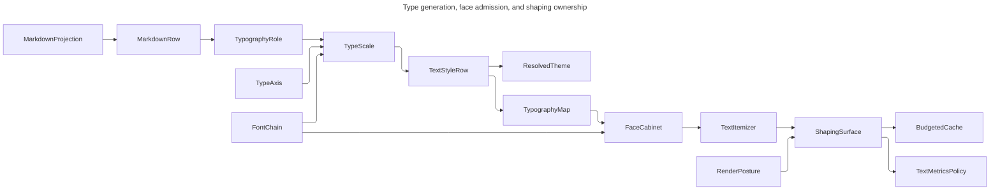

# [APPUI_TYPOGRAPHY_SHAPING]

Rasm.AppUi resolves every text appearance through one generated two-axis type table and renders every glyph through one itemizing shaping rail. `TypographyRole` authors eleven integer rungs on the four-pixel rhythm grid; `TypeAxis` carries the orthogonal emphasis, density, text-scale, and slant the role never spells; `TypeScale` is the one generation folding the two into a `TextStyleRow`, so a line height, a tracking value, or an emphasized weight is derived and an authored one is unrepresentable. `FontChain` ranks host families while face resolution keys on CAPABILITY — weight, width, slant, and codepoint coverage — and `FaceCabinet` holds one capsule per face instance with its variation coordinates, its palette election, its design scale read off the face's own units, and the discretionary features a shaped probe proved it implements. `TextItemizer` segments script, direction, and coverage before any shape, so mixed-script, bidirectional, or partially covered text becomes a run sequence and an uncovered or ill-formed codepoint is a refusal rather than a notdef box. `MarkdownProjection` folds the Markdig AST into role-keyed rows, and `TextMetricsPolicy` owns baseline rhythm, half-leading, decoration geometry, and caret folds. The spine is Avalonia.Fonts.Inter with the owned variable face, SkiaSharp with SkiaSharp.HarfBuzz over the centrally pinned HarfBuzz natives, HarfBuzzSharp for the control-altitude shaping surface, and Markdig for document structure.

Generation is the page's ruling shape, exactly as it is at `Theme/tokens`: a per-role line-height literal, a per-emphasis size column, and a per-density type table are all deleted forms. The token catalogue consumes the same generation — `ResolvedTheme.Types` carries the resolved rows and the Semi size and weight slots re-emit from them — so density and the host text-scale preference re-derive type and geometry together through one resolve.

## [01]-[INDEX]

- [02]-[ROLE_AXIS]: Eleven grid-snapped role rungs crossed with the emphasis, density, text-scale, and slant axis; the one generation and its token emission.
- [03]-[FONT_ADMISSION]: Capability-keyed face resolution, the owned variable face, per-instance capsules under kernel custody, probe-admitted features, and colour-palette election.
- [04]-[SHAPING_RAIL]: Itemization into script, direction, and coverage segments; the shaped fold; the budgeted shaped-run lease; declared render posture per surface class; trim-policy layout.
- [05]-[MARKDOWN_PROJECTION]: Markdig AST folds to role-keyed rows and inline runs through one generated seam and one closed block fold.
- [06]-[TEXT_METRICS]: Baseline rhythm, half-leading and first-baseline law, decoration rows over one band fold, caret and selection folds, tabular proof.

## [02]-[ROLE_AXIS]

- Owner: `TypographyRole` `[SmartEnum<string>]` the eleven-rung role ladder; `TypeEmphasis`, `TypeSlant`, `TrimPolicy`, `LeadingClass`, `FamilyLane` `[SmartEnum<string>]` the orthogonal columns; `FeatureFacet` `[SmartEnum<string>]` the numeral and casing intent rows on one `FacetAxis`; `FeatureIntent` `[SmartEnum<string>]` the one OpenType-feature vocabulary and the capability every admitted set holds; `WeightLadder` the shipped weight rungs; `TypeAxis` the resolution axis; `TypeScale` the generation; `TextStyleRow` the resolved product every consumer reads.
- Cases: `TypographyRole` = micro | caption | label | overline | body | code | numeric | section | title | headline | display; `TypeEmphasis` = quiet | regular | medium | strong; `TypeSlant` = upright | italic; `FamilyLane` = sans | mono; `FeatureFacet` = proportional | tabular | slashed | disambiguated on the numeral axis and source | upper | small-caps on the casing axis; `TrimPolicy` = wrap | ellipsis | clip; `LeadingClass` = tight | snug | normal | loose.
- Law: a role authors an INTEGER base size, a leading class, a weight rung, and the policy intrinsic to the role; everything else is generated. Emphasis is a STEP on the shipped weight ladder, so an emphasized row cannot name a weight the family never shipped. Line height is the leading factor snapped to the baseline unit and floored at the em. Tracking is the optical curve evaluated at the RESOLVED size in em, projected to device pixels exactly once at the bind boundary. Density and the host text-scale multiply the base size before the snap, so the three axes compose in one fold and never as three tables.
- Entry: `TypeScale.Resolve(TypographyRole role, FontChain chain, TypeAxis? axis = null)` — the one resolution, the absent axis resolving `TypeAxis.Baseline`; `TypeScale.Of(TypeEmphasis emphasis, DensityPolicy density, PreferenceCell preferences, TypeSlant slant)` mints the axis from the theme resolve; `TypeScale.Expand(FontChain chain, DensityPolicy density, PreferenceCell preferences)` is the token-catalogue generation and `TypeScale.Emission(rows)` its dictionary leaves; `FeatureFacet.Apply(string text, CultureInfo culture)` the presentation-time casing transform the casing column carries; `TypographyRole.ForHeading(int level)` the document-heading rung read off the rows' own `Heading` column.
- Auto: one resolve yields retained styles, chart paints, editor fonts, table columns, Semi size and weight slots, and shaped Skia labels alike; `ResolvedTheme.Types` carries the expansion, so a density election or a text-scale flip re-derives every type surface inside the one theme resolve.
- Packages: Rasm.Contracts (project), Thinktecture.Runtime.Extensions, LanguageExt.Core, Rasm (kernel `UnitInterval`/`CapabilitySet`), Avalonia, BCL inbox
- Growth: a new text appearance is one `TypographyRole` row; a new emphasis is one ladder step; a new numeral or casing posture is one `FeatureFacet` row on its axis; a new family lane is one `FamilyLane` row carrying its chain accessor; a new face weight is one `WeightLadder` rung; zero new surface.
- Boundary: every size, weight, tracking, line-height, and OpenType-feature literal in AppUi traces to this generation — a bare font value at a call site is the named defect. The declared tracking unit is EM: `TextStyleRow.TrackingEm` is the generated value and `TrackingPx` the single projection a retained `LetterSpacing` or a shaped advance consumes. Emphasis moves the weight rung ALONE, so the emission writes the geometric leaves once per role and the weight leaf once per emitted emphasis. Casing applies at presentation through `FeatureFacet.Apply` and small-caps contributes its feature intent rather than a second string transform; numeric and temporal text arrives pre-formatted through the `Theme/locale` temporal patterns, so the numeric row guarantees glyph geometry alone. The text-scale knob is a UNIT interval whose midpoint is the neutral reading, so the multiplier is two linear segments hinged at that midpoint. `Theme/tokens` owns the `TokenKey` mint and this owner addresses its emission through it. NAMED LOSS of the facet collapse: a role naming two numeral rows was a compile error when `NumeralModality` and `TypeCasing` were two types; it is now the row constructor's axis guard, refusing at type init. `Emission` crosses its leaves as `(TokenKey, object)` because `ResolvedTheme` holds an erased leaf map — a `Theme/tokens` seam to close with a typed leaf union, not a typography concern.

```csharp signature
// --- [TYPES] ----------------------------------------------------------------------------
public static class WeightLadder {
    public static readonly ImmutableArray<int> Rungs = [300, 400, 500, 600, 700];

    // Saturating by declaration: `Strong` on rung 3 asks for rung 5 and receives the heaviest shipped face.
    public static int At(int rung) => Rungs[Math.Clamp(rung, 0, Rungs.Length - 1)];

    // The narrowest rung INTERVAL: a synthetic embolden is earned by a face landing a full rung below the request,
    // and a threshold spelled as the lightest rung would compare a weight DIFFERENCE against a weight VALUE.
    public static int Step => Rungs.Zip(Rungs.Skip(1), static (low, high) => high - low).Min();
}

[SmartEnum<string>]
[KeyMemberEqualityComparer<ComparerAccessors.StringOrdinal, string>]
[KeyMemberComparer<ComparerAccessors.StringOrdinal, string>]
public sealed partial class LeadingClass {
    public static readonly LeadingClass Tight = new("tight", factor: 1.25d);
    public static readonly LeadingClass Snug = new("snug", factor: 1.33d);
    public static readonly LeadingClass Normal = new("normal", factor: 1.45d);
    public static readonly LeadingClass Loose = new("loose", factor: 1.6d);

    public double Factor { get; }
}

// One OpenType feature INTENT: its registered tag and the probe text whose shaped output proves a face implements
// it. The managed binding exposes no GSUB feature enumeration, so a discretionary tag admits by SHAPING the probe
// twice and comparing glyph ids; a baseline tag (absent probe) applies whether or not the face carries a table, so
// there is nothing to prove. `zero`, `tnum`, `ss01`, and the `cv` rows are distinct facts; conflating any is the
// defect this vocabulary closes.
// Rank IS declaration order (kernel CapabilityRank law) — the attribute pins the roster against a reorder pass.
[NoReorder]
[SmartEnum<string>]
[KeyMemberEqualityComparer<ComparerAccessors.StringOrdinal, string>]
[KeyMemberComparer<ComparerAccessors.StringOrdinal, string>]
public sealed partial class FeatureIntent : ICapability<FeatureIntent> {
    public static readonly FeatureIntent Contextual = new("calt", probe: None);
    public static readonly FeatureIntent Kerning = new("kern", probe: None);
    public static readonly FeatureIntent Ligatures = new("liga", probe: None);
    public static readonly FeatureIntent Tabular = new("tnum", probe: Some("0123456789"));
    public static readonly FeatureIntent SlashedZero = new("zero", probe: Some("0"));
    public static readonly FeatureIntent AlternateDigits = new("ss01", probe: Some("0123456789"));
    public static readonly FeatureIntent DisambiguateEll = new("cv05", probe: Some("l"));
    public static readonly FeatureIntent DisambiguateEye = new("cv08", probe: Some("I"));
    public static readonly FeatureIntent SmallCaps = new("smcp", probe: Some("abcdefghijklmnopqrstuvwxyz"));

    public Option<string> Probe { get; }

    public bool Baseline => Probe.IsNone;

    public static CapabilitySet<FeatureIntent> Baselines => Whole.Value;
    private static readonly Lazy<CapabilitySet<FeatureIntent>> Whole = new(
        static () => CapabilitySet<FeatureIntent>.Of([.. Items.Where(static row => row.Baseline)]), LazyThreadSafetyMode.ExecutionAndPublication);
}

[SmartEnum<string>]
[KeyMemberEqualityComparer<ComparerAccessors.StringOrdinal, string>]
[KeyMemberComparer<ComparerAccessors.StringOrdinal, string>]
public sealed partial class FacetAxis {
    public static readonly FacetAxis Numeral = new("numeral");
    public static readonly FacetAxis Casing = new("casing");
}

// Numeral and casing postures are ONE shape: an axis, the feature intents the posture contributes, and the
// presentation transform it applies. Tabular fixes advance width, slashed adds the disambiguated zero, and
// disambiguated adds the character-variant forms; small-caps is a FEATURE and upper a TRANSFORM, which is why
// the transform is a column rather than a second string pass a call site invents.
[SmartEnum<string>]
[KeyMemberEqualityComparer<ComparerAccessors.StringOrdinal, string>]
[KeyMemberComparer<ComparerAccessors.StringOrdinal, string>]
public sealed partial class FeatureFacet {
    public static readonly FeatureFacet Proportional = new("proportional", FacetAxis.Numeral, CapabilitySet<FeatureIntent>.None, Identity);
    public static readonly FeatureFacet Tabular = new("tabular", FacetAxis.Numeral, CapabilitySet<FeatureIntent>.Of(FeatureIntent.Tabular), Identity);
    public static readonly FeatureFacet Slashed = new("slashed", FacetAxis.Numeral,
        CapabilitySet<FeatureIntent>.Of(FeatureIntent.Tabular, FeatureIntent.SlashedZero), Identity);
    public static readonly FeatureFacet Disambiguated = new("disambiguated", FacetAxis.Numeral,
        CapabilitySet<FeatureIntent>.Of(FeatureIntent.Tabular, FeatureIntent.SlashedZero, FeatureIntent.DisambiguateEll, FeatureIntent.DisambiguateEye), Identity);
    public static readonly FeatureFacet Source = new("source", FacetAxis.Casing, CapabilitySet<FeatureIntent>.None, Identity);
    public static readonly FeatureFacet Upper = new("upper", FacetAxis.Casing, CapabilitySet<FeatureIntent>.None,
        static (text, culture) => culture.TextInfo.ToUpper(text));
    public static readonly FeatureFacet SmallCaps = new("small-caps", FacetAxis.Casing, CapabilitySet<FeatureIntent>.Of(FeatureIntent.SmallCaps), Identity);

    public FacetAxis Axis { get; }

    public CapabilitySet<FeatureIntent> Intents { get; }

    [UseDelegateFromConstructor]
    public partial string Apply(string text, CultureInfo culture);

    private static string Identity(string text, CultureInfo culture) => text;
}

// Trim is a LAYOUT row: each posture carries the line fold it runs, so the breaker branches on no trim name and
// the ellipsis and clip rows stop being two spellings of one behaviour.
[SmartEnum<string>]
[KeyMemberEqualityComparer<ComparerAccessors.StringOrdinal, string>]
[KeyMemberComparer<ComparerAccessors.StringOrdinal, string>]
public sealed partial class TrimPolicy {
    public static readonly TrimPolicy Wrap = new("wrap", LineBreaker.Wrapped);
    public static readonly TrimPolicy Ellipsis = new("ellipsis", LineBreaker.Elided);
    public static readonly TrimPolicy Clip = new("clip", LineBreaker.Clipped);

    [UseDelegateFromConstructor]
    public partial Seq<TextLine> Lay(ShapedText text, string source, double width, Func<Rune, BreakClass> oracle);
}

// Rank IS declaration order (kernel CapabilityRank law) — the attribute pins the roster against a reorder pass.
[NoReorder]
[SmartEnum<string>]
[KeyMemberEqualityComparer<ComparerAccessors.StringOrdinal, string>]
[KeyMemberComparer<ComparerAccessors.StringOrdinal, string>]
public sealed partial class TypeEmphasis : ICapability<TypeEmphasis> {
    public static readonly TypeEmphasis Quiet = new("quiet", step: -1);
    public static readonly TypeEmphasis Regular = new("regular", step: 0);
    public static readonly TypeEmphasis Medium = new("medium", step: 1);
    public static readonly TypeEmphasis Strong = new("strong", step: 2);

    public int Step { get; }

    // The emphases the shipped Semi slot vocabulary binds; the rest resolve on demand at a call site that states them.
    public static readonly CapabilitySet<TypeEmphasis> Emitted = CapabilitySet<TypeEmphasis>.Of(Regular, Strong);
}

// Slant carries BOTH the variable axis value and the synthetic skew, so a face with a real `slnt` axis takes the
// true italic while a static face takes the declared skew — a stated row, never a silent per-host difference.
[SmartEnum<string>]
[KeyMemberEqualityComparer<ComparerAccessors.StringOrdinal, string>]
[KeyMemberComparer<ComparerAccessors.StringOrdinal, string>]
public sealed partial class TypeSlant {
    public static readonly TypeSlant Upright = new("upright", axis: 0d, skew: 0f, slant: SKFontStyleSlant.Upright);
    public static readonly TypeSlant Italic = new("italic", axis: -10d, skew: -0.25f, slant: SKFontStyleSlant.Italic);

    public double Axis { get; }

    public float Skew { get; }

    public SKFontStyleSlant Slant { get; }
}

// The family lane a role reads: each row carries its own chain accessor, so a third lane (symbols-only, serif) is
// one row and `FontChain.Ranked` branches on no lane name.
[SmartEnum<string>]
[KeyMemberEqualityComparer<ComparerAccessors.StringOrdinal, string>]
[KeyMemberComparer<ComparerAccessors.StringOrdinal, string>]
public sealed partial class FamilyLane {
    public static readonly FamilyLane Sans = new("sans", static chain => chain.Sans);
    public static readonly FamilyLane Mono = new("mono", static chain => chain.Mono);

    [UseDelegateFromConstructor]
    public partial Seq<string> Families(FontChain chain);
}

// Eleven rungs on the four-pixel rhythm grid. A row authors its generated wire coordinate, INTEGER base size,
// leading class, base weight rung, and intrinsic policy; `Heading` is the document-heading depth it answers.
[SmartEnum<string>]
[KeyMemberEqualityComparer<ComparerAccessors.StringOrdinal, string>]
[KeyMemberComparer<ComparerAccessors.StringOrdinal, string>]
public sealed partial class TypographyRole {
    public static readonly TypographyRole Micro = Row(
        "micro", Rasm.Contracts.Ui.TypographyRole.Micro, 10, LeadingClass.Snug, 1, TrimPolicy.Ellipsis);
    public static readonly TypographyRole Caption = Row(
        "caption", Rasm.Contracts.Ui.TypographyRole.Caption, 12, LeadingClass.Snug, 1, TrimPolicy.Wrap);
    public static readonly TypographyRole Label = Row(
        "label", Rasm.Contracts.Ui.TypographyRole.Label, 12, LeadingClass.Snug, 2, TrimPolicy.Ellipsis);
    // Uppercase counters need opening the optical curve never supplies — the curve is calibrated on mixed case.
    public static readonly TypographyRole Overline = Row(
        "overline", Rasm.Contracts.Ui.TypographyRole.Overline, 11, LeadingClass.Snug, 2, TrimPolicy.Clip,
        casing: FeatureFacet.Upper, trackingBias: 0.08d);
    public static readonly TypographyRole Body = Row(
        "body", Rasm.Contracts.Ui.TypographyRole.Body, 14, LeadingClass.Normal, 1, TrimPolicy.Wrap, heading: 4);
    public static readonly TypographyRole Code = Row(
        "code", Rasm.Contracts.Ui.TypographyRole.Code, 13, LeadingClass.Normal, 1, TrimPolicy.Clip,
        numerals: FeatureFacet.Disambiguated, lane: FamilyLane.Mono);
    public static readonly TypographyRole Numeric = Row(
        "numeric", Rasm.Contracts.Ui.TypographyRole.Numeric, 14, LeadingClass.Normal, 1, TrimPolicy.Clip,
        numerals: FeatureFacet.Slashed);
    public static readonly TypographyRole Section = Row(
        "section", Rasm.Contracts.Ui.TypographyRole.Section, 16, LeadingClass.Normal, 3, TrimPolicy.Wrap, heading: 3);
    public static readonly TypographyRole Title = Row(
        "title", Rasm.Contracts.Ui.TypographyRole.Title, 18, LeadingClass.Snug, 3, TrimPolicy.Ellipsis, heading: 2);
    public static readonly TypographyRole Headline = Row(
        "headline", Rasm.Contracts.Ui.TypographyRole.Headline, 24, LeadingClass.Tight, 3, TrimPolicy.Ellipsis, heading: 1);
    public static readonly TypographyRole Display = Row(
        "display", Rasm.Contracts.Ui.TypographyRole.Display, 32, LeadingClass.Tight, 3, TrimPolicy.Ellipsis);

    public Rasm.Contracts.Ui.TypographyRole Wire { get; }

    public int Size { get; }

    public LeadingClass Leading { get; }

    public int Rung { get; }

    public TrimPolicy Trim { get; }

    public FeatureFacet Numerals { get; }

    public FeatureFacet Casing { get; }

    public FamilyLane Lane { get; }

    public double TrackingBias { get; }

    public Option<int> Heading { get; }

    private static TypographyRole Row(
        string key, Rasm.Contracts.Ui.TypographyRole wire, int size, LeadingClass leading, int rung, TrimPolicy trim,
        FeatureFacet? numerals = null, FeatureFacet? casing = null, FamilyLane? lane = null, double trackingBias = 0d, int? heading = null) =>
        new(key, wire, size, leading, rung, trim, numerals ?? FeatureFacet.Proportional, casing ?? FeatureFacet.Source,
            lane ?? FamilyLane.Sans, trackingBias, Optional(heading));

    // The axis guard the two-type split used to prove at compile time.
    static partial void ValidateConstructorArguments(
        ref string key, ref Rasm.Contracts.Ui.TypographyRole wire, ref int size, ref LeadingClass leading,
        ref int rung, ref TrimPolicy trim, ref FeatureFacet numerals, ref FeatureFacet casing, ref FamilyLane lane,
        ref double trackingBias, ref Option<int> heading) {
        if (numerals.Axis != FacetAxis.Numeral || casing.Axis != FacetAxis.Casing) {
            throw new ArgumentException($"<facet-axis:{key}>", nameof(numerals));
        }
    }

    // Depth past the ladder lands on the label rung rather than inventing a size.
    public static TypographyRole ForHeading(int level) =>
        toSeq(Items).Find(row => row.Heading == Some(level)).IfNone(Label);

    // Baseline shaping features ride every row; the role's numeral and casing intents ride on top.
    public CapabilitySet<FeatureIntent> Intents =>
        CapabilitySet<FeatureIntent>.Of([.. FeatureIntent.Baselines.Held, .. Numerals.Intents.Held, .. Casing.Intents.Held]);
}

// The resolution axis: everything a role is NOT.
public readonly record struct TypeAxis(TypeEmphasis Emphasis, UnitInterval Density, double Scale, TypeSlant Slant) {
    public static readonly TypeAxis Baseline = new(TypeEmphasis.Regular, UnitInterval.Create(1d), 1d, TypeSlant.Upright);
}

// The resolved product. `TrackingPx` is the ONE projection into device pixels; `Family` is the ranked fallback
// list a retained Avalonia consumer binds, while the shaped path elects its own face per segment.
public sealed record TextStyleRow(
    TypographyRole Role,
    TypeEmphasis Emphasis,
    string Family,
    double Size,
    int Weight,
    TypeSlant Slant,
    double TrackingEm,
    double LineBox,
    CapabilitySet<FeatureIntent> Features,
    FeatureFacet Casing,
    TrimPolicy Trim,
    FamilyLane Lane) {
    public double TrackingPx => TrackingEm * Size;

    // The em box sits centred in the line box, so a first line and an interior line share one baseline rule.
    public double HalfLeading => (LineBox - Size) / 2d;
}
```

```csharp signature
// --- [OPERATIONS] -----------------------------------------------------------------------
public static class TypeScale {
    // Inter's published dynamic-tracking curve, evaluated at the RESOLVED pixel size; the product is em.
    const double TrackingIntercept = -0.0223d;
    const double TrackingAmplitude = 0.185d;
    const double TrackingDecay = -0.1745d;

    // The host knob is a unit interval whose MIDPOINT is the neutral reading, so the multiplier hinges there.
    const double ScaleNeutral = 0.5d;
    const double ScaleFloor = 0.875d;
    const double ScaleCeiling = 1.5d;

    public static TextStyleRow Resolve(TypographyRole role, FontChain chain, TypeAxis? axis = null) =>
        (Axis: axis ?? TypeAxis.Baseline, Role: role) switch {
            var cell => TextMetricsPolicy.Grid.Em(cell.Role.Size * cell.Axis.Density.Value * cell.Axis.Scale) switch {
                var size => new TextStyleRow(
                    Role: cell.Role,
                    Emphasis: cell.Axis.Emphasis,
                    Family: string.Join(", ", cell.Role.Lane.Families(chain)),
                    Size: size,
                    Weight: WeightLadder.At(cell.Role.Rung + cell.Axis.Emphasis.Step),
                    Slant: cell.Axis.Slant,
                    TrackingEm: Tracking(size, cell.Role.TrackingBias),
                    LineBox: TextMetricsPolicy.Grid.Line(size, cell.Role.Leading),
                    Features: cell.Role.Intents,
                    Casing: cell.Role.Casing,
                    Trim: cell.Role.Trim,
                    Lane: cell.Role.Lane),
            },
        };

    public static TypeAxis Of(TypeEmphasis emphasis, DensityPolicy density, PreferenceCell preferences, TypeSlant slant) =>
        new(emphasis, density.Type, Multiplier(preferences), slant);

    // Every role crossed with every emitted emphasis, keyed through the one `TokenKey` mint.
    public static FrozenDictionary<TokenKey, TextStyleRow> Expand(FontChain chain, DensityPolicy density, PreferenceCell preferences) =>
        toSeq(TypographyRole.Items)
            .Bind(role => toSeq(TypeEmphasis.Emitted.Held).Map(emphasis => (
                Key: Key(role, emphasis),
                Row: Resolve(role, chain, Of(emphasis, density, preferences, TypeSlant.Upright)))))
            .ToFrozenDictionary(static entry => entry.Key, static entry => entry.Row);

    public static TokenKey Key(TypographyRole role, TypeEmphasis emphasis) =>
        TokenKey.Named("type", emphasis == TypeEmphasis.Regular ? role.Key : $"{role.Key}-{emphasis.Key}");

    // Geometric leaves emit once per role off the regular row; the weight leaf emits per emphasis.
    public static Seq<(TokenKey Key, object Value)> Emission(FrozenDictionary<TokenKey, TextStyleRow> rows) =>
        toSeq(rows).Bind(entry => entry.Value.Emphasis == TypeEmphasis.Regular
            ? Seq<(TokenKey, object)>(
                (Leaf(entry.Key, "family"), new FontFamily(entry.Value.Family)),
                (Leaf(entry.Key, "size"), entry.Value.Size),
                (Leaf(entry.Key, "line"), entry.Value.LineBox),
                (Leaf(entry.Key, "tracking"), entry.Value.TrackingPx),
                (Leaf(entry.Key, "weight"), (FontWeight)entry.Value.Weight))
            : Seq<(TokenKey, object)>((Leaf(entry.Key, "weight"), (FontWeight)entry.Value.Weight)));

    static TokenKey Leaf(TokenKey row, string slot) => TokenKey.Named(row.Value, slot);

    static double Tracking(double size, double bias) =>
        TrackingIntercept + (TrackingAmplitude * Math.Exp(TrackingDecay * size)) + bias;

    // Total over the preference union: an appearance or flag value under the text-scale row is the neutral reading.
    static double Multiplier(PreferenceCell preferences) =>
        preferences.Read(PreferenceRow.TextScale).Switch(
            appearance: static _ => 1d,
            flag: static _ => 1d,
            scale: static scale => scale.Factor.Value <= ScaleNeutral
                ? ScaleFloor + ((1d - ScaleFloor) * (scale.Factor.Value / ScaleNeutral))
                : 1d + ((ScaleCeiling - 1d) * ((scale.Factor.Value - ScaleNeutral) / (1d - ScaleNeutral))));
}
```

## [03]-[FONT_ADMISSION]

- Owner: `FontChain` `[SmartEnum<string>]` the ranked per-platform family chain; `EmbeddedFace` the owned asset rows; `FaceRequest` the capability key; `FaceInstance` the per-instance capsule; `FaceCabinet` the keyed capsule registry; `PalettePosture` the colour-glyph election; `FontAdmission` the boot-time builder pass; `ThemeFault` the shared theme and typography fault family; `TypographyMap` the generated seam projecting the resolved style onto the face request and the request onto the variation wish.
- Cases: `FontChain` = osx | win | linux; `EmbeddedFace` = variable | mono | symbols; `PalettePosture` = light | dark | unset; typography uses `ThemeFault.FaceUnresolved | FaceAdmissionRejected | ShapingRejected | DrawRejected | CoverageRejected`.
- Law: face resolution keys on CAPABILITY, never on a family name alone — the resolved weight, width, slant, and the demanded codepoint enter `SKFontManager.MatchFamily(family, SKFontStyle)` and `MatchCharacter(family, weight, width, slant, bcp47, codepoint)`, so a role's emphasis reaches the face instead of being applied as a synthetic afterwards. A variable face admits through its OWN axes: `wght` takes the resolved weight, `opsz` the resolved size, `slnt` the slant row; an axis the face does not publish falls back to the nearest static rung plus the slant row's DECLARED synthetic skew or an embolden. A discretionary feature is admitted PER FACE by a shaped probe, and a probe whose tag refuses admission fails the capsule rather than reading as "the face lacks it".
- Entry: `FontAdmission.Admit(AppBuilder builder, FontChain chain)` — the one boot-time admission the composition root composes on the application builder, the only font registration path; `FaceCabinet.Face(FaceRequest request)` — the one face election and capsule lease; `FaceCabinet.Cover(FaceRequest request, Rune demand)` — the coverage-demanded election the itemizer drives; `FaceInstance.Open(SKTypeface resolved, FaceRequest request)` — the `Fin`-shaped capsule construction under kernel rollback custody; `TypographyMap.ToRequest(row, chain, palette, bcp47)` / `TypographyMap.ToWish(request)`.
- Receipt: the composition prerequisite is the `Shell/hosts.md` `NativeAssets.Identity` probe for `libHarfBuzzSharp` sealed as `NativeAssetFact`; face admission consumes the admitted runtime and mints no duplicate identity receipt.
- Packages: Avalonia.Fonts.Inter, Avalonia, SkiaSharp, SkiaSharp.HarfBuzz, HarfBuzzSharp, HarfBuzzSharp.NativeAssets.macOS, HarfBuzzSharp.NativeAssets.Linux, Riok.Mapperly, LanguageExt.Core, Rasm (kernel `Custody`, `Cell`, `Fault`)
- Growth: a new platform or script coverage is one `FontChain` row or one ranked family on an existing row; a new owned asset is one `EmbeddedFace` row; a new capability axis is one `FaceRequest` column reaching the same election; zero new surface.
- Boundary: the chain row is ELECTED ONCE by the composition root off its resolved host profile and handed to `Admit` and `TypeScale.Resolve` — ambient OS probing here is the deleted form, and the three family rosters are the platforms' shipped reading and monospace families (Apple, Microsoft, Noto) with the owned faces ranked first, which is the provenance a platform row carries. `WithInterFont` registers the shipped static collection, the owned faces register through `ConfigureFonts` as embedded collections, `FontManagerOptions.DefaultFamilyName` pins the embedded family, and the ranked host families plus the symbols terminator land as `FontFallbacks` rows. The shipped package carries STATIC faces alone, so optical sizing and true italics exist only through the owned variable asset. The design scale is read off the face's own `UnitsPerEm`, so an advance rescales exactly. A face instance is keyed on `(typeface identity, variation coordinates, palette index)` and holds the stream, blob, face, font, and admitted feature set for the capsule's whole life. Construction is a kernel `Custody.Rollback` fold: a refusal after any native owner initialized releases the completed owners LIFO on the failure arm alone, so a never-returned capsule leaks nothing and no `try`/`catch` spells the release. A concurrent cabinet miss resolves through `Cell.Step`, so the loser of the race disposes the capsule it opened and both callers lease the one that landed. Colour-glyph faces elect their palette from the face's own `OpenTypeColorPaletteFlags`, and the elected index is CLONED onto the raster typeface rather than recorded beside it. `SKFontArguments` is a `ref struct`, so it crosses as a construction argument and is never a stored field.

```csharp signature
// --- [ERRORS] ---------------------------------------------------------------------------
// Typography's cases live on the shared `ThemeFault` root in `Theme/tokens`; no second root or validation union exists.
```

```csharp signature
// --- [MODELS] ---------------------------------------------------------------------------
// The CAPABILITY key. Family election reads the chain through the lane; everything else is what the resolved
// style asked for, so a weight, a width, or a slant reaches the platform matcher.
public readonly record struct FaceRequest(
    FontChain Chain,
    FamilyLane Lane,
    int Weight,
    SKFontStyleWidth Width,
    TypeSlant Slant,
    double Size,
    PalettePosture Palette,
    Seq<string> Bcp47) {
    // `SKFontStyle` is an owned native handle, MINTED per election and released with it.
    public SKFontStyle Mint() => new(Weight, (int)Width, Slant.Slant);
}

// The variation position a variable face is cloned onto. Axes the face does not publish drop, so the request is a
// WISH and the instance carries what the face accepted.
public readonly record struct VariationWish(double Weight, double OpticalSize, double Slant) {
    public static readonly SKFourByteTag WeightAxis = SKFourByteTag.Parse("wght");
    public static readonly SKFourByteTag OpticalAxis = SKFourByteTag.Parse("opsz");
    public static readonly SKFourByteTag SlantAxis = SKFourByteTag.Parse("slnt");

    public Option<float> For(SKFourByteTag axis) =>
        axis == WeightAxis ? Some((float)Weight)
        : axis == OpticalAxis ? Some((float)OpticalSize)
        : axis == SlantAxis ? Some((float)Slant)
        : None;
}

[SmartEnum<string>]
[KeyMemberEqualityComparer<ComparerAccessors.StringOrdinal, string>]
[KeyMemberComparer<ComparerAccessors.StringOrdinal, string>]
public sealed partial class PalettePosture {
    public static readonly PalettePosture Unset = new("unset", OpenTypeColorPaletteFlags.Default);
    public static readonly PalettePosture Light = new("light", OpenTypeColorPaletteFlags.UsableWithLightBackground);
    public static readonly PalettePosture Dark = new("dark", OpenTypeColorPaletteFlags.UsableWithDarkBackground);

    public OpenTypeColorPaletteFlags Flags { get; }

    public static PalettePosture Of(VariantProjection projection) => projection.Ascending ? Light : Dark;
}

// The owned embedded assets: the collection URI and the face name are two facts, and the Avalonia family string
// DERIVES from them — a packed `collection#face` string split at a call site was the deleted form.
[SmartEnum<string>]
[KeyMemberEqualityComparer<ComparerAccessors.StringOrdinal, string>]
[KeyMemberComparer<ComparerAccessors.StringOrdinal, string>]
public sealed partial class EmbeddedFace {
    public static readonly EmbeddedFace Variable = new("variable", new Uri("fonts:RasmVariable"), "InterVariable",
        new Uri("avares://Rasm.AppUi/Assets/Fonts/InterVariable.ttf"));
    public static readonly EmbeddedFace Mono = new("mono", new Uri("fonts:RasmMono"), "RasmMono",
        new Uri("avares://Rasm.AppUi/Assets/Fonts/RasmMono.ttf"));
    public static readonly EmbeddedFace Symbols = new("symbols", new Uri("fonts:RasmSymbols"), "RasmSymbols",
        new Uri("avares://Rasm.AppUi/Assets/Fonts/RasmSymbols.ttf"));

    public Uri Collection { get; }

    public string Face { get; }

    public Uri Asset { get; }

    public string Family => $"{Collection}#{Face}";
}

// --- [COMPOSITION] ----------------------------------------------------------------------
// The two admission correspondences as ONE generated seam: the style row projects onto the capability key (the
// width is the one constant column, so it is a value row, never a ctor literal) and the key onto the variable-axis
// wish, whose slant reads the slant row's axis through a segment path.
[Mapper(RequiredMappingStrategy = RequiredMappingStrategy.Target, EnabledConversions = MappingConversionType.All & ~MappingConversionType.ExplicitCast)]
public static partial class TypographyMap {
    [MapValue(nameof(FaceRequest.Width), SKFontStyleWidth.Normal)]
    public static partial FaceRequest ToRequest(TextStyleRow row, FontChain chain, PalettePosture palette, Seq<string> bcp47);

    [MapProperty(nameof(FaceRequest.Size), nameof(VariationWish.OpticalSize))]
    [MapProperty([nameof(FaceRequest.Slant), nameof(TypeSlant.Axis)], [nameof(VariationWish.Slant)])]
    public static partial VariationWish ToWish(FaceRequest request);

    [MapPropertyFromSource(nameof(GridCell.Runs), Use = nameof(Runs))]
    public static partial GridCell ToCell(Markdig.Extensions.Tables.TableCell cell);

    [MapProperty(nameof(FencedCodeBlock.Info), nameof(MarkdownRow.CodeFence.Language), Use = nameof(Text))]
    [MapProperty(nameof(FencedCodeBlock.Arguments), nameof(MarkdownRow.CodeFence.Arguments), Use = nameof(Text))]
    [MapProperty(nameof(FencedCodeBlock.Lines), nameof(MarkdownRow.CodeFence.Source), Use = nameof(Lines))]
    public static partial MarkdownRow.CodeFence ToFence(FencedCodeBlock fence);

    [MapValue(nameof(MarkdownRow.CodeFence.Language), "")]
    [MapValue(nameof(MarkdownRow.CodeFence.Arguments), "")]
    [MapProperty(nameof(CodeBlock.Lines), nameof(MarkdownRow.CodeFence.Source), Use = nameof(Lines))]
    public static partial MarkdownRow.CodeFence ToFence(CodeBlock code);

    private static Seq<InlineRun> Runs(Markdig.Extensions.Tables.TableCell cell) =>
        toSeq<Block>(cell).Bind(static inner => inner is LeafBlock leaf ? MarkdownProjection.Runs(leaf) : Seq<InlineRun>());
    private static string Text(string? value) => value ?? string.Empty;
    private static string Lines(StringLineGroup lines) => lines.ToString();
}
```

```csharp signature
// --- [SERVICES] -------------------------------------------------------------------------
[SmartEnum<string>]
[KeyMemberEqualityComparer<ComparerAccessors.StringOrdinal, string>]
[KeyMemberComparer<ComparerAccessors.StringOrdinal, string>]
public sealed partial class FontChain {
    public static readonly FontChain MacOS = new("osx",
        sans: Seq(EmbeddedFace.Variable.Family, FontAdmission.EmbeddedInter, "SF Pro Text"),
        mono: Seq(EmbeddedFace.Mono.Family, "SF Mono", "Menlo"),
        symbols: "Apple Color Emoji");
    public static readonly FontChain Windows = new("win",
        sans: Seq(EmbeddedFace.Variable.Family, FontAdmission.EmbeddedInter, "Segoe UI"),
        mono: Seq(EmbeddedFace.Mono.Family, "Cascadia Mono", "Consolas"),
        symbols: "Segoe UI Emoji");
    public static readonly FontChain Linux = new("linux",
        sans: Seq(EmbeddedFace.Variable.Family, FontAdmission.EmbeddedInter, "Noto Sans"),
        mono: Seq(EmbeddedFace.Mono.Family, "Noto Sans Mono", "DejaVu Sans Mono"),
        symbols: "Noto Color Emoji");

    public Seq<string> Sans { get; }

    public Seq<string> Mono { get; }

    public string Symbols { get; }

    // The symbols terminator closes every lane, so the election is total or it refuses.
    public Seq<string> Ranked(FamilyLane lane) => lane.Families(this) + Seq(Symbols);

    public Fin<SKTypeface> Elect(SKFontManager manager, FaceRequest request) {
        using SKFontStyle style = request.Mint();
        return Ranked(request.Lane)
            .Choose(family => Optional(manager.MatchFamily(family, style)))
            .Head
            .ToFin(Fail: new ThemeFault.FaceUnresolved($"{Key}/{request.Weight}/{request.Slant.Key}"));
    }

    // The demanded codepoint enters the matcher beside the capability; a codepoint nothing covers is a REFUSAL.
    public Fin<SKTypeface> Cover(SKFontManager manager, FaceRequest request, Rune demand) =>
        Ranked(request.Lane)
            .Choose(family => Optional(manager.MatchCharacter(
                family, request.Weight, (int)request.Width, request.Slant.Slant, [.. request.Bcp47], demand.Value)))
            .Head
            .ToFin(Fail: new ThemeFault.CoverageRejected($"{Key}/U+{demand.Value:X4}"));
}

// One capsule per face INSTANCE — the typeface at its variation coordinates and palette, its HarfBuzz chain, the
// design scale read off the face's own units, and the features a shaped probe proved.
public sealed class FaceInstance : IDisposable {
    static readonly Op OpenOp = Op.Of(name: "typography.face.open");

    readonly Blob blob;
    readonly Face face;
    readonly SKStreamAsset stream;
    // The variation-instanced typeface a palette clone supersedes: a second owned native handle, held for release.
    readonly Option<SKTypeface> superseded;

    FaceInstance(SKStreamAsset stream, Blob blob, Face face, Font font, SKTypeface typeface, Option<SKTypeface> superseded, Option<int> palette, CapabilitySet<FeatureIntent> admitted) {
        this.stream = stream; this.blob = blob; this.face = face; this.superseded = superseded;
        Font = font; Typeface = typeface; Palette = palette; Admitted = admitted; UnitsPerEm = face.UnitsPerEm;
    }

    public SKTypeface Typeface { get; }

    public Font Font { get; }

    public int UnitsPerEm { get; }

    public Option<int> Palette { get; }

    // The tags this face PROVED: every feature request intersects this set, so a role naming a tag the fallback
    // face never carried resolves to the subset that changes glyphs.
    public CapabilitySet<FeatureIntent> Admitted { get; }

    public Option<FaceInstance> Covering(Rune demand) => Typeface.ContainsGlyph(demand.Value) ? Some(this) : None;

    // Construction under kernel custody: each native owner lands in its slot, and a refusal anywhere releases the
    // landed slots LIFO on the failure arm alone. The palette clone follows the blob (the palette table is a face
    // read) and the election is APPLIED to the typeface Skia rasterizes — a held index re-tints nothing.
    public static Fin<FaceInstance> Open(SKTypeface resolved, FaceRequest request) {
        SKTypeface instanced = Instanced(resolved, request);
        SKStreamAsset? stream = null; Blob? blob = null; Face? face = null; Font? font = null; SKTypeface? palettized = null;
        return OpenOp.Catch(() => {
            stream = instanced.OpenStream(out int ttcIndex);
            blob = stream.ToHarfBuzzBlob();
            face = new Face(blob, ttcIndex);
            face.MakeImmutable();
            font = new Font(face);
            font.SetScale(face.UnitsPerEm, face.UnitsPerEm);
            font.SetFunctionsOpenType();
            Option<int> palette = ElectPalette(face, request.Palette);
            palettized = palette.Match(Some: index => instanced.Clone(index), None: () => instanced);
            Option<SKTypeface> superseded = ReferenceEquals(palettized, instanced) ? None : Some(instanced);
            return Probe(font).Map(admitted => new FaceInstance(stream, blob, face, font, palettized, superseded, palette, admitted));
        })
        .Rollback(font, face, blob, stream, ReferenceEquals(palettized, instanced) ? null : palettized, instanced);
    }

    static SKTypeface Instanced(SKTypeface resolved, FaceRequest request) =>
        TypographyMap.ToWish(request) switch {
            var wish => resolved.VariationDesignParameters is { Length: > 0 } axes
                ? axes
                    .Choose(axis => wish.For(axis.Tag).Map(value => new SKFontVariationPositionCoordinate {
                        Axis = axis.Tag,
                        Value = Math.Clamp(value, axis.Min, axis.Max),
                    }))
                    .ToArray() switch {
                        { Length: > 0 } coordinates => resolved.Clone(coordinates),
                        _ => resolved,
                    }
                : resolved,
        };

    static Option<int> ElectPalette(Face face, PalettePosture posture) =>
        face.HasPalettes && posture != PalettePosture.Unset
            ? Enumerable.Range(0, face.PaletteCount).AsIterable().ToSeq().Find(index => face.GetPaletteFlags(index) == posture.Flags)
            : None;

    // The probe shapes the intent's own text with the feature on and off and admits the tag only when the glyph
    // stream differs; a baseline row admits unconditionally. A tag that refuses admission fails the capsule — it is
    // a roster defect, never "the face lacks it".
    static Fin<CapabilitySet<FeatureIntent>> Probe(Font font) =>
        toSeq(FeatureIntent.Items)
            .Traverse(intent => intent.Probe.Match(
                Some: probe => FeatureAdmission.Admit(intent.Key).Map(feature =>
                    Glyphs(font, probe, []).SequenceEqual(Glyphs(font, probe, [feature])) ? Option<FeatureIntent>.None : Some(intent)),
                None: () => Fin.Succ(Some(intent))))
            .As()
            .Map(static proven => CapabilitySet<FeatureIntent>.Of([.. proven.Somes()]));

    static ImmutableArray<uint> Glyphs(Font font, string probe, Feature[] features) {
        using Buffer buffer = new();
        buffer.AddUtf16(probe);
        buffer.GuessSegmentProperties();
        font.Shape(buffer, features);
        return [.. buffer.GetGlyphInfoSpan().ToArray().Select(static info => info.Codepoint)];
    }

    public void Dispose() {
        Font.Dispose(); face.Dispose(); blob.Dispose(); stream.Dispose();
        Typeface.Dispose(); superseded.Iter(static typeface => typeface.Dispose());
    }
}

// The keyed capsule registry: one instance per (family, weight, width, slant, variation, palette) cell, held for
// the cabinet's life. The cabinet is the only owner — a consumer leases and never disposes.
public sealed class FaceCabinet(SKFontManager manager) : IDisposable {
    static readonly Op LeaseOp = Op.Of(name: "typography.face.lease");
    readonly Atom<HashMap<FaceKey, FaceInstance>> instances = Atom(HashMap<FaceKey, FaceInstance>());

    public readonly record struct FaceKey(string Family, int Weight, SKFontStyleWidth Width, TypeSlant Slant, double Size, PalettePosture Palette);

    public Fin<FaceInstance> Face(FaceRequest request) =>
        request.Chain.Elect(manager, request).Bind(typeface => Leased(typeface, request));

    public Fin<FaceInstance> Cover(FaceRequest request, Rune demand) =>
        request.Chain.Cover(manager, request, demand).Bind(typeface => Leased(typeface, request));

    // The optical-size axis makes the size part of the key, so two rungs of one variable family are two instances
    // while a static face collapses every size onto one cell. A concurrent miss is a `Cell.Step`: the step refuses
    // on a key already landed, the loser disposes the capsule it opened, and both lease the one that won.
    Fin<FaceInstance> Leased(SKTypeface typeface, FaceRequest request) =>
        new FaceKey(typeface.FamilyName, request.Weight, request.Width, request.Slant,
            typeface.VariationDesignParameterCount > 0 ? request.Size : 0d, request.Palette) switch {
            var key => instances.Value.Find(key).Match(
                Some: Fin.Succ,
                None: () => FaceInstance.Open(typeface, request).Bind(opened =>
                    Cell.Step(instances, map => map.ContainsKey(key) ? None : Some(map.Add(key, opened)), LeaseOp.InvalidResult()) switch {
                        Transition<HashMap<FaceKey, FaceInstance>>.Committed => Fin.Succ(opened),
                        Transition<HashMap<FaceKey, FaceInstance>> settled => (fun(opened.Dispose)(), settled.Current.Find(key)).Item2
                            .ToFin(Fail: LeaseOp.InvalidResult()),
                    })),
        };

    public void Dispose() {
        instances.Value.Values.Iter(static instance => instance.Dispose());
        instances.Swap(static _ => HashMap<FaceKey, FaceInstance>());
    }
}

public static class FontAdmission {
    public const string EmbeddedInter = "fonts:Inter#Inter";

    // ONE builder pass the composition root composes: the shipped static collection, the owned collections, the
    // pinned default family, and the ranked host fallbacks.
    public static AppBuilder Admit(AppBuilder builder, FontChain chain) =>
        builder
            .WithInterFont()
            .ConfigureFonts(static manager => toSeq(EmbeddedFace.Items).Iter(row =>
                manager.AddFontCollection(new EmbeddedFontCollection(row.Collection, row.Asset))))
            .With(new FontManagerOptions {
                DefaultFamilyName = EmbeddedFace.Variable.Family,
                FontFallbacks = [.. chain.Ranked(FamilyLane.Sans).Tail.Map(static family => new FontFallback { FontFamily = family })],
            });
}
```

## [04]-[SHAPING_RAIL]

- Owner: `RunSpec` the paragraph-level segment policy; `TextSegment` the itemized run; `TextItemizer` the segmentation fold; `ClusterMark` the per-cluster source, pen, and shaper-flag record; `BreakClass` the break vocabulary over the `BreakStrength` ordinal; `RasterTrait` the host font knobs a `RenderPosture` row grants; `ShapedRun` and `ShapedText` the shaped products; `TextLine` with `LineEnd` the laid line; `FeatureAdmission` the one tag mint; `ShapeKey` the complete cache determinant; `RenderPosture` the declared per-surface-class font posture; `LineBreaker` the three trim-row folds; `ShapingSurface` the one shape-then-lay-then-draw rail.
- Cases: `RenderPosture` = live | golden | paged | layer; `BreakClass` = none | space | hyphen | ideograph | mandatory; `BreakStrength` = none | opportunity | mandatory; `RasterTrait` = subpixel | linear-metrics | baseline-snap; `LineEnd` = wrapped | elided | clipped | final.
- Law: shaping precedes drawing for every Skia-rendered glyph, and itemization precedes shaping. A segment is a maximal run of one script, one direction, and one face instance; an uncovered or ill-formed codepoint refuses the whole itemization. A shaped text is a cache LEASE — the `BudgetedCache` at `Theme/assets#ASSET_CACHE` is the sole owner of every blob it holds under the `Generation` retention posture, so disposing a leased text at a call site is the deleted form. Every host-variable font knob is a `RasterTrait` grant on a declared posture per surface class.
- Entry: `ShapingSurface.Cache(long ceiling, Op key)` — mints the shaped-run lease over the folder cache owner with this page's cost and release; `ShapingSurface.Shape(text, style, spec, request, cabinet, posture, cache)` — the one shaping fold, itemizing then shaping then leasing; `ShapingSurface.Layout(ShapedText text, string source, double width, Func<Rune, BreakClass>? oracle = null)` — the trim-row line fold with every baseline populated off the metrics policy; `ShapingSurface.DrawLabel(canvas, text, paint, x, y)` — the one draw; `TextItemizer.Itemize(text, spec, request, cabinet)`; `FeatureAdmission.Admit(string tag, uint value = 1u, Option<(uint Start, uint End)> range = default)`.
- Receipt: `Buffer.SerializeGlyphs(Font, SerializeFormat.Json, SerializeFlag.GlyphFlags)` is the shaping-evidence channel the proof lane diffs beside the frame hash.
- Packages: SkiaSharp.HarfBuzz, SkiaSharp, HarfBuzzSharp, LanguageExt.Core, Rasm (kernel `CapabilitySet`), BCL inbox
- Growth: a new script is one segmentation outcome on the same fold; a new surface class is one `RenderPosture` row; a new break rule is one `BreakClass` row or one composition-supplied oracle; a new trim behaviour is one `TrimPolicy` row carrying its fold; zero new surface.
- Boundary: `FeatureAdmission.Admit` is the one `Feature` mint over both scopes, discriminated by the range. `Tag.Parse` SILENTLY COERCES — a null or empty string yields the none tag and a longer string truncates — so the four-character shape validates BEFORE the parse. The itemizer resolves script through the HarfBuzz unicode functions and general category through the BCL rune classification; a common or inherited codepoint takes the running script and the paragraph base direction, and runs reorder into visual order by that base direction. The carve is stated: no bidirectional algorithm with explicit embedding overrides is admitted. Segment ingress uses the windowed `AddUtf16(text, itemOffset, itemLength)` form with the edge flags set from the segment's position, so joining forms survive a segment boundary. The shaped fold reads the zero-allocation glyph spans; it carries `SKFont.ScaleX` through the horizontal projection, negates the vertical axis because HarfBuzz shaping space is y-up, and rescales every advance through the face's own `UnitsPerEm`; the two-span fill with a running cursor is the page's ONE named `EXPRESSION_SPINE` exemption — no span operator states a three-output scan. `SKTextBlobBuilder.Build()` returns NULL for an empty builder, so an empty segment refuses on the rail by name. `SKCanvas.DrawTextBlob` does not exist — the shaped blob draws through `DrawText(SKTextBlob, x, y, SKPaint)`. Line breaking runs over CLUSTERS: only a cluster boundary whose glyph is safe to break is a candidate. Unshaped `MeasureText(string)`, string convenience shaping, caller-owned blob disposal, an untyped native exception, and a blob outliving its backing stream are rejected forms. Streaming carve: face probing is a bounded boot-time cost inside `Open`, and no edge on this page retries, so `Schedule` and `Channel<T>` have no seat here.

```csharp signature
// --- [TYPES] ----------------------------------------------------------------------------
public readonly record struct RunSpec(Direction Direction, Script Script, Language Language, ClusterLevel Level);

public readonly record struct TextSegment(
    int Start, int Length, Script Script, Direction Direction, FaceInstance Face, BufferFlags Edges);

// The shaper's own flags ride whole, so a second flag (`UnsafeToConcat`) is a read, never a second bool.
public readonly record struct ClusterMark(int Source, float Offset, GlyphFlags Flags) {
    public bool SafeToBreak => !Flags.HasFlag(GlyphFlags.UnsafeToBreak);
}

// Rank IS declaration order (kernel CapabilityRank law) — the attribute pins the roster against a reorder pass.
[NoReorder]
[SmartEnum<string>]
[KeyMemberEqualityComparer<ComparerAccessors.StringOrdinal, string>]
[KeyMemberComparer<ComparerAccessors.StringOrdinal, string>]
public sealed partial class BreakStrength : ICapability<BreakStrength> {
    public static readonly BreakStrength None = new("none");
    public static readonly BreakStrength Opportunity = new("opportunity");
    public static readonly BreakStrength Mandatory = new("mandatory");
}

// The declared break-opportunity vocabulary. Full line-break analysis is not admitted; a locale row widening this
// supplies its own oracle.
[SmartEnum<string>]
[KeyMemberEqualityComparer<ComparerAccessors.StringOrdinal, string>]
[KeyMemberComparer<ComparerAccessors.StringOrdinal, string>]
public sealed partial class BreakClass {
    public static readonly BreakClass None = new("none", BreakStrength.None);
    public static readonly BreakClass Space = new("space", BreakStrength.Opportunity);
    public static readonly BreakClass Hyphen = new("hyphen", BreakStrength.Opportunity);
    public static readonly BreakClass Ideograph = new("ideograph", BreakStrength.Opportunity);
    public static readonly BreakClass Mandatory = new("mandatory", BreakStrength.Mandatory);

    public BreakStrength Strength { get; }

    public bool Opens => Strength.Rank >= BreakStrength.Opportunity.Rank;

    public static BreakClass Of(Rune rune) =>
        rune.Value switch {
            '\n' or '\r' or 0x0085 or 0x2028 or 0x2029 => Mandatory,
            _ => Rune.GetUnicodeCategory(rune) switch {
                UnicodeCategory.SpaceSeparator or UnicodeCategory.LineSeparator or UnicodeCategory.ParagraphSeparator => Space,
                UnicodeCategory.DashPunctuation => Hyphen,
                UnicodeCategory.OtherLetter when rune.Value >= 0x2E80 => Ideograph,
                _ => None,
            },
        };
}

// Rank IS declaration order (kernel CapabilityRank law) — the attribute pins the roster against a reorder pass.
[NoReorder]
[SmartEnum<string>]
[KeyMemberEqualityComparer<ComparerAccessors.StringOrdinal, string>]
[KeyMemberComparer<ComparerAccessors.StringOrdinal, string>]
public sealed partial class RasterTrait : ICapability<RasterTrait> {
    public static readonly RasterTrait Subpixel = new("subpixel");
    public static readonly RasterTrait LinearMetrics = new("linear-metrics");
    public static readonly RasterTrait BaselineSnap = new("baseline-snap");
}

// The declared posture per surface class. Golden pins grayscale coverage, zero hinting, and linear metrics because
// subpixel coverage and hinted outlines are host-dependent; paged keeps linear metrics and subpixel positioning so
// an advance is not quantized into the page; a layer drops to grayscale because subpixel coverage over a
// translucent layer composites against pixels that are not there.
[SmartEnum<string>]
[KeyMemberEqualityComparer<ComparerAccessors.StringOrdinal, string>]
[KeyMemberComparer<ComparerAccessors.StringOrdinal, string>]
public sealed partial class RenderPosture {
    public static readonly RenderPosture Live = new("live", SKFontEdging.SubpixelAntialias, SKFontHinting.Slight,
        CapabilitySet<RasterTrait>.Of(RasterTrait.Subpixel, RasterTrait.BaselineSnap));
    public static readonly RenderPosture Golden = new("golden", SKFontEdging.Antialias, SKFontHinting.None,
        CapabilitySet<RasterTrait>.Of(RasterTrait.LinearMetrics));
    public static readonly RenderPosture Paged = new("paged", SKFontEdging.Antialias, SKFontHinting.None,
        CapabilitySet<RasterTrait>.Of(RasterTrait.Subpixel, RasterTrait.LinearMetrics));
    public static readonly RenderPosture Layer = new("layer", SKFontEdging.Antialias, SKFontHinting.Slight,
        CapabilitySet<RasterTrait>.Of(RasterTrait.Subpixel));

    public SKFontEdging Edging { get; }

    public SKFontHinting Hinting { get; }

    public CapabilitySet<RasterTrait> Traits { get; }

    // The slant row's synthetic applies only when the face accepted no slant axis, so a true italic and a skewed
    // upright never stack.
    public SKFont Raster(FaceInstance face, TextStyleRow style) =>
        new(face.Typeface, (float)style.Size) {
            Edging = Edging,
            Hinting = Hinting,
            Subpixel = Traits.Admits(RasterTrait.Subpixel),
            LinearMetrics = Traits.Admits(RasterTrait.LinearMetrics),
            BaselineSnap = Traits.Admits(RasterTrait.BaselineSnap),
            SkewX = face.Typeface.FontSlant == style.Slant.Slant ? 0f : style.Slant.Skew,
            Embolden = face.Typeface.FontWeight <= style.Weight - WeightLadder.Step,
        };
}

// How a laid line closed — a renderer draws the ellipsis glyph on `Elided` and nothing else reads a trim name.
[SmartEnum<string>]
[KeyMemberEqualityComparer<ComparerAccessors.StringOrdinal, string>]
[KeyMemberComparer<ComparerAccessors.StringOrdinal, string>]
public sealed partial class LineEnd {
    public static readonly LineEnd Wrapped = new("wrapped");
    public static readonly LineEnd Elided = new("elided");
    public static readonly LineEnd Clipped = new("clipped");
    public static readonly LineEnd Final = new("final");
}
```

```csharp signature
// --- [MODELS] ---------------------------------------------------------------------------
// One shaped segment; `Metrics` is the raster font's own metrics captured at shape time so layout never re-opens
// a font to place a baseline.
public sealed class ShapedRun(SKTextBlob blob, SKPoint origin, SKPoint advance, ImmutableArray<ClusterMark> clusters, FaceInstance face, SKFontMetrics metrics) : IDisposable {
    public SKTextBlob Blob { get; } = blob;

    public SKPoint Origin { get; } = origin;

    public SKPoint Advance { get; } = advance;

    public ImmutableArray<ClusterMark> Clusters { get; } = clusters;

    public FaceInstance Face { get; } = face;

    public SKFontMetrics Metrics { get; } = metrics;

    public void Dispose() => Blob.Dispose();
}

// The shaped product of one string: runs in VISUAL order, total advance, the style it resolved under, and the
// byte cost the lease charges — a retained run costs its glyph payload plus the blob's fixed overhead.
public sealed class ShapedText(Seq<ShapedRun> runs, SKPoint advance, TextStyleRow style) : IDisposable {
    const long GlyphCost = 14L;
    const long RunOverhead = 256L;

    public Seq<ShapedRun> Runs { get; } = runs;

    public SKPoint Advance { get; } = advance;

    public TextStyleRow Style { get; } = style;

    public int Glyphs => Runs.Sum(static run => run.Clusters.Length);

    public long Bytes => (Glyphs * GlyphCost) + (Runs.Count * RunOverhead);

    public Option<SKFontMetrics> Metrics => Runs.Head.Map(static run => run.Metrics);

    public void Dispose() => Runs.Iter(static run => run.Dispose());
}

public readonly record struct TextLine(int Start, int End, double Advance, double Baseline, LineEnd Close);

// The complete determinant of a glyph stream: two surfaces asking the same question share one shaped result and a
// posture flip cannot serve a golden a live-shaped run.
public readonly record struct ShapeKey(string Text, TokenKey Style, RunSpec Spec, RenderPosture Posture, double Size, TypeSlant Slant);
```

```csharp signature
// --- [OPERATIONS] -----------------------------------------------------------------------
public static class FeatureAdmission {
    public static Fin<Feature> Admit(string tag, uint value = 1u, Option<(uint Start, uint End)> range = default) =>
        tag.Length == 4 && tag.All(static character => character is >= ' ' and <= '~')
            ? Fin.Succ(Tag.Parse(tag)).Map(parsed => range.Match(
                Some: window => new Feature(parsed, value, window.Start, window.End),
                None: () => new Feature(parsed, value)))
            : Fin.Fail<Feature>(new ThemeFault.ShapingRejected($"tag {tag}: four printable characters required"));
}

public static class TextItemizer {
    public static Fin<Seq<TextSegment>> Itemize(string text, RunSpec spec, FaceRequest request, FaceCabinet cabinet) =>
        Runes(text)
            .Bind(runes => runes.Traverse(cell => Resolve(cell, spec, request, cabinet)).As())
            .Map(marks => Merge(marks, text.Length))
            .Map(segments => Ordered(segments, spec.Direction));

    // An ill-formed code unit is a codepoint nothing covers, so it refuses here rather than electing a face for
    // U+FFFD; the index/length carry stays because `EnumerateRunes` drops the offsets.
    static Fin<Seq<(int Index, int Length, Rune Rune)>> Runes(string text) =>
        Seq.generate(text.Length, static index => index)
            .Fold(Fin.Succ((Next: 0, Cells: Seq<(int Index, int Length, Rune Rune)>())), (state, _) => state.Bind(held =>
                held.Next >= text.Length
                    ? Fin.Succ(held)
                    : Rune.DecodeFromUtf16(text.AsSpan(held.Next), out Rune rune, out int consumed) is OperationStatus.Done
                        ? Fin.Succ((held.Next + consumed, held.Cells.Add((held.Next, consumed, rune))))
                        : Fin.Fail<(int, Seq<(int, int, Rune)>)>(new ThemeFault.CoverageRejected($"ill-formed UTF-16 at {held.Next}"))))
            .Map(static held => held.Cells);

    // A common or inherited script defers to the paragraph hint; direction comes from the resolved script with
    // the paragraph base as the neutral fallback; the face election demands the codepoint.
    static Fin<(int Index, int Length, Script Script, Direction Direction, FaceInstance Face)> Resolve(
        (int Index, int Length, Rune Rune) cell, RunSpec spec, FaceRequest request, FaceCabinet cabinet) =>
        (UnicodeFunctions.Default.GetScript(cell.Rune.Value) switch {
            var script when script == Script.Common || script == Script.Inherited || script == Script.Unknown => spec.Script,
            var script => script,
        }) switch {
            var script => cabinet
                .Face(request)
                .Bind(primary => primary.Covering(cell.Rune).Match(Some: Fin.Succ, None: () => cabinet.Cover(request, cell.Rune)))
                .Map(face => (
                    cell.Index,
                    cell.Length,
                    script,
                    script.HorizontalDirection is Direction.Invalid ? spec.Direction : script.HorizontalDirection,
                    face)),
        };

    static Seq<TextSegment> Merge(Seq<(int Index, int Length, Script Script, Direction Direction, FaceInstance Face)> marks, int total) =>
        marks
            .Fold(Seq<TextSegment>(), static (segments, mark) => segments.Last switch {
                { IsSome: true } tail when tail.Case is TextSegment last
                    && last.Script == mark.Script && last.Direction == mark.Direction && ReferenceEquals(last.Face, mark.Face) =>
                    segments.Init.Add(last with { Length = last.Length + mark.Length }),
                _ => segments.Add(new TextSegment(mark.Index, mark.Length, mark.Script, mark.Direction, mark.Face, BufferFlags.Default)),
            })
            .Map(segment => segment with {
                Edges = (segment.Start is 0 ? BufferFlags.BeginningOfText : BufferFlags.Default)
                    | (segment.Start + segment.Length == total ? BufferFlags.EndOfText : BufferFlags.Default),
            });

    // The declared two-level resolution: runs reverse wholesale under a right-to-left base and HarfBuzz reorders
    // inside each run itself.
    static Seq<TextSegment> Ordered(Seq<TextSegment> segments, Direction paragraph) =>
        paragraph is Direction.RightToLeft or Direction.BottomToTop ? segments.Rev() : segments;
}

public static class ShapingSurface {
    static readonly Op ShapeOp = Op.Of(name: "typography.shape");
    static readonly Op DrawOp = Op.Of(name: "typography.draw");
    // composes Theme/assets#ASSET_CACHE BudgetedCache — generation posture, this page's cost and release.
    public static Fin<BudgetedCache<ShapeKey, ShapedText>> Cache(long ceiling, Op key) =>
        BudgetedCache<ShapeKey, ShapedText>.Of(
            ceiling, RetentionPosture.Generation,
            bytes: static text => text.Bytes, release: static text => text.Dispose(),
            refuse: static (shape, cost) => new ThemeFault.ShapingRejected($"<shape-over-budget:{shape.Style}:{cost}>"),
            key: key);

    public static Fin<ShapedText> Shape(
        string text, TextStyleRow style, RunSpec spec, FaceRequest request, FaceCabinet cabinet, RenderPosture posture,
        BudgetedCache<ShapeKey, ShapedText> cache) =>
        cache.Take(
            new ShapeKey(text, TypeScale.Key(style.Role, style.Emphasis), spec, posture, style.Size, style.Slant),
            () => TextItemizer.Itemize(text, spec, request, cabinet).Bind(segments => Runs(text, style, spec, posture, segments)));

    static Fin<ShapedText> Runs(string text, TextStyleRow style, RunSpec spec, RenderPosture posture, Seq<TextSegment> segments) =>
        segments
            .Fold(
                Fin.Succ((Cursor: SKPoint.Empty, Runs: Seq<ShapedRun>())),
                (state, segment) => state.Bind(carried => Segment(text, style, spec, posture, segment, carried.Cursor)
                    .Map(run => (Cursor: new SKPoint(carried.Cursor.X + run.Advance.X, carried.Cursor.Y + run.Advance.Y), Runs: carried.Runs.Add(run)))))
            .Map(carried => new ShapedText(carried.Runs, carried.Cursor, style));

    // Features intersect the face's PROVEN set; tracking rides the em-to-pixel projection as a per-cluster advance
    // addition because neither HarfBuzz nor Skia carries a tracking knob.
    static Fin<ShapedRun> Segment(
        string text, TextStyleRow style, RunSpec spec, RenderPosture posture, TextSegment segment, SKPoint origin) =>
        toSeq(style.Features.Held)
            .Filter(intent => segment.Face.Admitted.Admits(intent))
            .Traverse(intent => FeatureAdmission.Admit(intent.Key))
            .As()
            .Bind(features => Native(text, style, spec, posture, segment, origin, features.ToArray()));

    static Fin<ShapedRun> Native(
        string text, TextStyleRow style, RunSpec spec, RenderPosture posture, TextSegment segment, SKPoint origin, Feature[] features) =>
        ShapeOp.Catch(() => {
            using SKFont raster = posture.Raster(segment.Face, style);
            using Buffer buffer = new();
            buffer.AddUtf16(text, segment.Start, segment.Length);
            (buffer.Direction, buffer.Script, buffer.Language, buffer.ClusterLevel, buffer.Flags) =
                (segment.Direction, segment.Script, spec.Language, spec.Level, segment.Edges);
            segment.Face.Font.Shape(buffer, features);
            ReadOnlySpan<GlyphInfo> infos = buffer.GetGlyphInfoSpan();
            ReadOnlySpan<GlyphPosition> positions = buffer.GetGlyphPositionSpan();
            float unit = raster.Size / segment.Face.UnitsPerEm;
            float horizontal = unit * raster.ScaleX;
            float tracking = (float)style.TrackingPx;
            using SKTextBlobBuilder builder = new();
            SKRawRunBuffer<SKPoint> run = builder.AllocateRawPositionedRun(raster, infos.Length, null);
            Span<ushort> glyphs = run.Glyphs;
            Span<SKPoint> points = run.Positions;
            ImmutableArray<ClusterMark>.Builder clusters = ImmutableArray.CreateBuilder<ClusterMark>(infos.Length);
            SKPoint cursor = SKPoint.Empty;
            // EXPRESSION_SPINE exemption: a three-output scan over two span fills and a running cursor.
            for (int i = 0; i < infos.Length; i++) {
                glyphs[i] = (ushort)infos[i].Codepoint;
                points[i] = new SKPoint(cursor.X + (positions[i].XOffset * horizontal), cursor.Y - (positions[i].YOffset * unit));
                clusters.Add(new ClusterMark((int)infos[i].Cluster, cursor.X, infos[i].GlyphFlags));
                cursor = new SKPoint(cursor.X + (positions[i].XAdvance * horizontal) + tracking, cursor.Y - (positions[i].YAdvance * unit));
            }
            return Fin.Succ((Blob: Optional(builder.Build()), Cursor: cursor, Clusters: clusters.MoveToImmutable(), Metrics: raster.Metrics));
        })
        .Bind(shaped => shaped.Blob
            .Map(blob => new ShapedRun(blob, origin, shaped.Cursor, shaped.Clusters, segment.Face, shaped.Metrics))
            .ToFin(Fail: new ThemeFault.ShapingRejected($"empty run at {segment.Start}")));

    // Every baseline is populated: the first off the metrics policy's rule, each later line one line box down.
    public static Fin<Seq<TextLine>> Layout(ShapedText text, string source, double width, Func<Rune, BreakClass>? oracle = null) =>
        text.Metrics
            .ToFin(Fail: new ThemeFault.ShapingRejected("layout over an empty shaped text"))
            .Map(metrics => TextMetricsPolicy.Grid.FirstBaseline(text.Style, metrics) switch {
                var first => toSeq(text.Style.Trim.Lay(text, source, width, oracle ?? BreakClass.Of)
                    .AsEnumerable().Select((line, index) => line with { Baseline = first + (index * text.Style.LineBox) })),
            });

    public static Fin<Unit> DrawLabel(SKCanvas canvas, ShapedText text, SKPaint paint, float x, float y) =>
        DrawOp.Catch(() => Fin.Succ(text.Runs.Iter(run => canvas.DrawText(run.Blob, x + run.Origin.X, y + run.Origin.Y, paint))));

    public static string Evidence(string text, RunSpec spec, TextSegment segment) {
        using Buffer buffer = new();
        buffer.AddUtf16(text, segment.Start, segment.Length);
        (buffer.Direction, buffer.Script, buffer.Language, buffer.ClusterLevel) =
            (segment.Direction, segment.Script, spec.Language, spec.Level);
        segment.Face.Font.Shape(buffer);
        return buffer.SerializeGlyphs(segment.Face.Font, SerializeFormat.Json, SerializeFlag.GlyphFlags);
    }
}

// The three trim folds the `TrimPolicy` rows carry. Only a SAFE-TO-BREAK cluster boundary is a candidate, so a
// break inside a ligature or a mark cluster is unrepresentable.
public static class LineBreaker {
    // Overflow closes the line at the last candidate that still fit; a mandatory class closes where it stands; the
    // tail closes only when source remains past the last close, so a text ending on a mandatory break emits no
    // trailing empty line.
    public static Seq<TextLine> Wrapped(ShapedText text, string source, double width, Func<Rune, BreakClass> oracle) =>
        Candidates(text, source, oracle)
            .Fold(
                (Lines: Seq<TextLine>(), Start: 0, Pen: 0d, Fit: Option<(int Source, double Advance)>.None),
                (state, candidate) => candidate.Class.Strength == BreakStrength.Mandatory || candidate.Advance - state.Pen > width
                    ? state.Fit.Match(
                        Some: fit => (state.Lines.Add(new TextLine(state.Start, fit.Source, fit.Advance - state.Pen, 0d, LineEnd.Wrapped)), fit.Source, fit.Advance, Option<(int, double)>.None),
                        None: () => (state.Lines.Add(new TextLine(state.Start, candidate.Source, candidate.Advance - state.Pen, 0d, LineEnd.Wrapped)), candidate.Source, candidate.Advance, Option<(int, double)>.None))
                    : state with { Fit = Some((candidate.Source, candidate.Advance)) })
            switch {
                var closed => closed.Start < source.Length
                    ? closed.Lines.Add(new TextLine(closed.Start, source.Length, text.Advance.X - closed.Pen, 0d, LineEnd.Final))
                    : closed.Lines,
            };

    // One line, cut at the last candidate that fits ahead of the ellipsis glyph's own advance when the text overflows.
    public static Seq<TextLine> Elided(ShapedText text, string source, double width, Func<Rune, BreakClass> oracle) =>
        text.Advance.X <= width
            ? Seq(new TextLine(0, source.Length, text.Advance.X, 0d, LineEnd.Final))
            : Candidates(text, source, oracle)
                .Filter(candidate => candidate.Advance + EllipsisAdvance(text) <= width)
                .Last
                .Map(fit => Seq(new TextLine(0, fit.Source, fit.Advance, 0d, LineEnd.Elided)))
                .IfNone(Seq(new TextLine(0, 0, 0d, 0d, LineEnd.Elided)));

    public static Seq<TextLine> Clipped(ShapedText text, string source, double width, Func<Rune, BreakClass> oracle) =>
        Seq(new TextLine(0, source.Length, text.Advance.X, 0d, Close: text.Advance.X <= width ? LineEnd.Final : LineEnd.Clipped));

    // The ellipsis reserves one em at the resolved size; a shaped ellipsis would need a second lease per label.
    static double EllipsisAdvance(ShapedText text) => text.Style.Size;

    static Seq<(int Source, double Advance, BreakClass Class)> Candidates(ShapedText text, string source, Func<Rune, BreakClass> oracle) =>
        text.Runs.Bind(run => run.Clusters.ToSeq()
            .Filter(static mark => mark.SafeToBreak)
            .Map(mark => (
                mark.Source,
                Advance: (double)(run.Origin.X + mark.Offset),
                Class: Rune.DecodeFromUtf16(source.AsSpan(mark.Source), out Rune rune, out _) is OperationStatus.Done
                    ? oracle(rune)
                    : BreakClass.None)))
            .Filter(static candidate => candidate.Class.Opens);
}
```

## [05]-[MARKDOWN_PROJECTION]

- Owner: `MarkdownRow` the closed eleven-arm block family; `ListGrammar`, `CalloutKind`, `GridBand`, `TaskState` the list, alert, table-band, and task vocabularies; `InlineContent`, `InlineStyle`, `LinkTarget`, `InlineRun` the inline family; `DefinitionRow`, `GridRow`, `GridCell` the structured rows; `MarkdownDocumentRows` the document product; `MarkdownProjection` the one AST fold.
- Cases: `MarkdownRow` = Heading | Paragraph | Quote | Callout | ListRows | Definitions | Grid | CodeFence | Math | Rule | Opaque; `ListGrammar` = Ordered(start) | Bulleted(mark); `CalloutKind` = note | tip | important | warning | caution; `GridBand` = header | body; `TaskState` = open | done; `InlineContent` = Text | Code | Math | Break | Task | Opaque; `InlineStyle` = strong | emphasis | strike.
- Entry: `MarkdownProjection.Project(string markdown)` — pure fold from document text to role-keyed rows plus the front-matter row; presentation consumes rows, never the AST; `MarkdownProjection.Runs(LeafBlock leaf)` the one inline projection the grid seam and the footnote fold share.
- Auto: `TrackTrivia` plus `PreciseSourceLocation` make every `MarkdownRow` carry its source `Span`, so an editor round-trip maps a retained row back to its source range with zero second parse; the `UseYamlFrontMatter` and `UseFootnotes` builder rows populate `FrontMatter` and `Footnotes` live.
- Packages: Markdig, Thinktecture.Runtime.Extensions, Riok.Mapperly, LanguageExt.Core, Rasm (kernel `CapabilitySet`)
- Growth: a new document construct is one `MarkdownRow` case plus one dispatch arm on the same fold; a new extension is one builder row on the one pipeline; a new alert kind is one `CalloutKind` row; zero new surface.
- Boundary: the pipeline admits only extensions with owned projection arms. Heading depth reads `TypographyRole.ForHeading`, so a document heading is a role reference and the role ladder owns the depth map. Table rows and cells, and fenced and indented code, cross through the `TypographyMap` seam; the block dispatch itself stays a hand fold because every other arm composes children recursively and a generated mapper would carry a `Use` converter per member and prove nothing. The fold's tail arms are LAWFUL openness over a FOREIGN family — Markdig's block and inline hierarchies are open, so an unmatched node lands as `Opaque` carrying its node identity and span. A GFM alert kind is a `StringSlice` on the package block, never an enum, so `CalloutKind` admits it as a keyed row through the generated `TryGet` and an unknown kind lands the block as a `Quote`. `UseMathematics` projects engineering notation without typesetting it, `UseAdvancedExtensions` stays absent because no owner admits its diagram and container grammars, and raw HTML becomes explicit opaque evidence. The inline style set is a `CapabilitySet<InlineStyle>` and the link target an `Option`, read off ONE ancestor walk per leaf inline.

```csharp signature
// --- [TYPES] ----------------------------------------------------------------------------
[SmartEnum<string>]
[KeyMemberEqualityComparer<ComparerAccessors.StringOrdinal, string>]
[KeyMemberComparer<ComparerAccessors.StringOrdinal, string>]
public sealed partial class CalloutKind {
    public static readonly CalloutKind Note = new("note");
    public static readonly CalloutKind Tip = new("tip");
    public static readonly CalloutKind Important = new("important");
    public static readonly CalloutKind Warning = new("warning");
    public static readonly CalloutKind Caution = new("caution");
}

[SmartEnum<string>]
[KeyMemberEqualityComparer<ComparerAccessors.StringOrdinal, string>]
[KeyMemberComparer<ComparerAccessors.StringOrdinal, string>]
public sealed partial class GridBand {
    public static readonly GridBand Header = new("header");
    public static readonly GridBand Body = new("body");
    public static GridBand Of(bool header) => header ? Header : Body;
}

[SmartEnum<string>]
[KeyMemberEqualityComparer<ComparerAccessors.StringOrdinal, string>]
[KeyMemberComparer<ComparerAccessors.StringOrdinal, string>]
public sealed partial class TaskState {
    public static readonly TaskState Open = new("open");
    public static readonly TaskState Done = new("done");
    public static TaskState Of(bool done) => done ? Done : Open;
}

// Rank IS declaration order (kernel CapabilityRank law) — the attribute pins the roster against a reorder pass.
[NoReorder]
[SmartEnum<string>]
[KeyMemberEqualityComparer<ComparerAccessors.StringOrdinal, string>]
[KeyMemberComparer<ComparerAccessors.StringOrdinal, string>]
public sealed partial class InlineStyle : ICapability<InlineStyle> {
    public static readonly InlineStyle Strong = new("strong");
    public static readonly InlineStyle Emphasis = new("emphasis");
    public static readonly InlineStyle Strike = new("strike");
}

// An ordered list carries a start and a bulleted one its mark — a bool beside both columns admitted a bulleted
// list at order five.
[Union(ConversionFromValue = ConversionOperatorsGeneration.None)]
public abstract partial record ListGrammar {
    private ListGrammar() { }
    public sealed record Ordered(int Start) : ListGrammar;
    public sealed record Bulleted(char Mark) : ListGrammar;
    public static ListGrammar Of(ListBlock list) => list.IsOrdered ? new Ordered(list.Order) : new Bulleted(list.BulletType);
}

// --- [MODELS] ---------------------------------------------------------------------------
[Union(ConversionFromValue = ConversionOperatorsGeneration.None)]
public abstract partial record MarkdownRow(SourceSpan Span) {
    public sealed record Heading(TypographyRole Role, Seq<InlineRun> Runs, Option<string> Anchor, SourceSpan Span) : MarkdownRow(Span);
    public sealed record Paragraph(Seq<InlineRun> Runs, SourceSpan Span) : MarkdownRow(Span);
    public sealed record Quote(Seq<MarkdownRow> Children, SourceSpan Span) : MarkdownRow(Span);
    public sealed record Callout(CalloutKind Kind, Seq<MarkdownRow> Children, SourceSpan Span) : MarkdownRow(Span);
    public sealed record ListRows(ListGrammar Grammar, Seq<Seq<MarkdownRow>> Items, SourceSpan Span) : MarkdownRow(Span);
    public sealed record Definitions(Seq<DefinitionRow> Items, SourceSpan Span) : MarkdownRow(Span);
    public sealed record Grid(Seq<GridRow> Rows, SourceSpan Span) : MarkdownRow(Span);
    public sealed record CodeFence(string Language, string Arguments, string Source, SourceSpan Span) : MarkdownRow(Span);
    public sealed record Math(string Source, SourceSpan Span) : MarkdownRow(Span);
    public sealed record Rule(SourceSpan Span) : MarkdownRow(Span);
    public sealed record Opaque(string Node, SourceSpan Span) : MarkdownRow(Span);
}

public readonly record struct DefinitionRow(Seq<InlineRun> Term, Seq<MarkdownRow> Body, SourceSpan Span);

public readonly record struct GridRow(GridBand Band, Seq<GridCell> Cells, SourceSpan Span);

public readonly record struct GridCell(int ColumnIndex, int ColumnSpan, int RowSpan, Seq<InlineRun> Runs, SourceSpan Span);

[Union(ConversionFromValue = ConversionOperatorsGeneration.None)]
public abstract partial record InlineContent {
    private InlineContent() { }
    public sealed record Text(string Value) : InlineContent;
    public sealed record Code(string Value) : InlineContent;
    public sealed record Math(string Value) : InlineContent;
    public sealed record Break(BreakStrength Strength) : InlineContent;
    public sealed record Task(TaskState State) : InlineContent;
    public sealed record Opaque(string Node) : InlineContent;
}

[Union(ConversionFromValue = ConversionOperatorsGeneration.None)]
public abstract partial record LinkTarget(string Destination, Option<string> Title) {
    public sealed record Hyperlink(string Destination, Option<string> Title) : LinkTarget(Destination, Title);
    public sealed record Image(string Destination, Option<string> Title) : LinkTarget(Destination, Title);
    public static LinkTarget Of(LinkInline link) =>
        link.IsImage ? new Image(link.Url ?? string.Empty, Optional(link.Title)) : new Hyperlink(link.Url ?? string.Empty, Optional(link.Title));
}

public readonly record struct InlineRun(InlineContent Content, CapabilitySet<InlineStyle> Styles, Option<LinkTarget> Link, SourceSpan Span);

public sealed record MarkdownDocumentRows(Seq<MarkdownRow> Body, Option<string> FrontMatter, HashMap<string, Seq<InlineRun>> Footnotes);

// --- [OPERATIONS] -----------------------------------------------------------------------
public static class MarkdownProjection {
    public static readonly MarkdownPipeline Pipeline =
        new MarkdownPipelineBuilder { PreciseSourceLocation = true, TrackTrivia = true }
            .UsePipeTables()
            .UseGridTables()
            .UseEmphasisExtras()
            .UseDefinitionLists()
            .UseAlertBlocks()
            .UseTaskLists()
            .UseAutoIdentifiers()
            .UseMathematics()
            .UseYamlFrontMatter()
            .UseFootnotes()
            .Build();

    public static MarkdownDocumentRows Project(string markdown) =>
        Markdown.Parse(markdown, Pipeline) switch {
            var document => new MarkdownDocumentRows(
                Body: toSeq<Block>(document).Filter(static block =>
                    block is not (Markdig.Extensions.Yaml.YamlFrontMatterBlock or Markdig.Extensions.Footnotes.FootnoteGroup)).Map(Row),
                FrontMatter: toSeq<Block>(document)
                    .Find(static block => block is Markdig.Extensions.Yaml.YamlFrontMatterBlock)
                    .Map(static block => ((Markdig.Extensions.Yaml.YamlFrontMatterBlock)block).Lines.ToString()),
                Footnotes: Footnotes(document)),
        };

    static HashMap<string, Seq<InlineRun>> Footnotes(MarkdownDocument document) =>
        toHashMap(toSeq(document.Descendants<Markdig.Extensions.Footnotes.Footnote>())
            .Bind(static note => Optional(note.Label)
                .Map(label => (label, toSeq(note.Descendants<LeafBlock>()).Bind(Runs)))
                .ToSeq()));

    // Foreign-family openness: Markdig's block hierarchy is open, so the tail arm is lawful and names the node.
    static MarkdownRow Row(Block block) =>
        block switch {
            HeadingBlock heading => new MarkdownRow.Heading(TypographyRole.ForHeading(heading.Level), Runs(heading), Optional(heading.TryGetAttributes()?.Id), heading.Span),
            Markdig.Extensions.Mathematics.MathBlock math => new MarkdownRow.Math(math.Lines.ToString(), math.Span),
            FencedCodeBlock fence => TypographyMap.ToFence(fence),
            CodeBlock code => TypographyMap.ToFence(code),
            Markdig.Extensions.Alerts.AlertBlock alert => CalloutKind.TryGet(alert.Kind.ToString().ToLowerInvariant(), out CalloutKind? kind)
                ? new MarkdownRow.Callout(kind, toSeq<Block>(alert).Map(Row), alert.Span)
                : new MarkdownRow.Quote(toSeq<Block>(alert).Map(Row), alert.Span),
            QuoteBlock quote => new MarkdownRow.Quote(toSeq<Block>(quote).Map(Row), quote.Span),
            Markdig.Extensions.Tables.Table table => new MarkdownRow.Grid(
                toSeq<Block>(table).Map(static row => (Markdig.Extensions.Tables.TableRow)row).Map(static row => new GridRow(
                    GridBand.Of(row.IsHeader),
                    toSeq<Block>(row).Map(static cell => TypographyMap.ToCell((Markdig.Extensions.Tables.TableCell)cell)),
                    row.Span)),
                table.Span),
            Markdig.Extensions.DefinitionLists.DefinitionList definitions => new MarkdownRow.Definitions(
                toSeq<Block>(definitions).Map(static item => new DefinitionRow(
                    toSeq<Block>((ContainerBlock)item).Bind(static child => child is Markdig.Extensions.DefinitionLists.DefinitionTerm term ? Runs(term) : Seq<InlineRun>()),
                    toSeq<Block>((ContainerBlock)item).Filter(static child => child is not Markdig.Extensions.DefinitionLists.DefinitionTerm).Map(Row),
                    item.Span)),
                definitions.Span),
            ListBlock list => new MarkdownRow.ListRows(ListGrammar.Of(list), toSeq<Block>(list).Map(static item => toSeq<Block>((ListItemBlock)item).Map(Row)), list.Span),
            ThematicBreakBlock rule => new MarkdownRow.Rule(rule.Span),
            LeafBlock leaf => new MarkdownRow.Paragraph(Runs(leaf), leaf.Span),
            var unmatched => new MarkdownRow.Opaque(unmatched.GetType().Name, unmatched.Span),
        };

    public static Seq<InlineRun> Runs(LeafBlock leaf) =>
        Optional(leaf.Inline)
            .Map(static inline => toSeq(inline.Descendants<LeafInline>()).Map(Flatten))
            .IfNone(Seq<InlineRun>());

    static InlineRun Flatten(LeafInline node) =>
        Lineage(node) switch {
            var lineage => node switch {
                CodeInline code => new InlineRun(new InlineContent.Code(code.Content), lineage.Styles, lineage.Link, code.Span),
                Markdig.Extensions.Mathematics.MathInline math => new InlineRun(new InlineContent.Math(math.Content.ToString()), lineage.Styles, lineage.Link, math.Span),
                TaskList task => new InlineRun(new InlineContent.Task(TaskState.Of(task.Checked)), lineage.Styles, lineage.Link, task.Span),
                LiteralInline literal => new InlineRun(new InlineContent.Text(literal.Content.ToString()), lineage.Styles, lineage.Link, literal.Span),
                AutolinkInline auto => new InlineRun(new InlineContent.Text(auto.Url), lineage.Styles, Some<LinkTarget>(new LinkTarget.Hyperlink(auto.Url, None)), auto.Span),
                HtmlEntityInline entity => new InlineRun(new InlineContent.Text(entity.Transcoded.ToString()), lineage.Styles, lineage.Link, entity.Span),
                LineBreakInline brk => new InlineRun(new InlineContent.Break(brk.IsHard ? BreakStrength.Mandatory : BreakStrength.Opportunity), lineage.Styles, lineage.Link, brk.Span),
                HtmlInline => new InlineRun(new InlineContent.Opaque(nameof(HtmlInline)), lineage.Styles, lineage.Link, node.Span),
                _ => new InlineRun(new InlineContent.Opaque(node.GetType().Name), lineage.Styles, lineage.Link, node.Span),
            },
        };

    // ONE ancestor walk answers both the style grant set and the nearest link.
    static (CapabilitySet<InlineStyle> Styles, Option<LinkTarget> Link) Lineage(Inline node) =>
        Ancestry(node) switch {
            var ancestors => (
                CapabilitySet<InlineStyle>.Of([.. ancestors.Choose(static ancestor => ancestor switch {
                    EmphasisInline { DelimiterChar: '*' or '_', DelimiterCount: >= 2 } => Some(InlineStyle.Strong),
                    EmphasisInline { DelimiterChar: '*' or '_', DelimiterCount: 1 } => Some(InlineStyle.Emphasis),
                    EmphasisInline { DelimiterChar: '~', DelimiterCount: 2 } => Some(InlineStyle.Strike),
                    _ => None,
                })]),
                ancestors.Choose(static ancestor => ancestor is LinkInline link ? Some(LinkTarget.Of(link)) : None).Head),
        };

    static Seq<Inline> Ancestry(Inline node) =>
        Optional(node.Parent)
            .Map(static parent => ((Inline)parent).Cons(Ancestry(parent)))
            .IfNone(Seq<Inline>());
}
```


```mermaid
---
title: Type generation, face admission, and shaping ownership
config:
  layout: elk
  htmlLabels: true
  markdownAutoWrap: false
  deterministicIds: true
  elk:
    nodePlacementStrategy: NETWORK_SIMPLEX
    considerModelOrder: NODES_AND_EDGES
  flowchart:
    curve: linear
    defaultRenderer: elk
    padding: 25
---
flowchart LR
    accTitle: Type generation, face admission, and shaping ownership
    accDescr: The role ladder crossed with the resolution axis generates one resolved style row that feeds the token catalogue, the itemizer, and the metrics policy, while the face cabinet supplies the capability-elected face instances the shaping rail draws through under a declared render posture.
    TypographyRole --> TypeScale
    TypeAxis --> TypeScale
    FontChain --> TypeScale
    TypeScale --> TextStyleRow
    TextStyleRow --> ResolvedTheme
    TextStyleRow --> TypographyMap
    TypographyMap --> FaceCabinet
    FontChain --> FaceCabinet
    FaceCabinet --> TextItemizer
    TextItemizer --> ShapingSurface
    RenderPosture --> ShapingSurface
    ShapingSurface --> BudgetedCache
    ShapingSurface --> TextMetricsPolicy
    MarkdownProjection --> MarkdownRow
    MarkdownRow --> TypographyRole
```

## [06]-[TEXT_METRICS]

- Owner: `TextMetricsPolicy` the rhythm owner; `Decoration` the underline and strikeout rows over one `DecorationGeometry.Band` fold; `CaretGeometry` the caret and selection fold.
- Cases: `Decoration` = underline (skip-ink through the blob's own intercept query) | strikeout (one unbroken band).
- Entry: `Line(double size, LeadingClass leading)` — the grid-snapped line box the generation calls; `Em(double raw)` — the integer em admission; `FirstBaseline(TextStyleRow row, SKFontMetrics metrics)` — the container's first baseline; `CapCenter(TextStyleRow row, SKFontMetrics metrics)` — the cap-height centre an icon box aligns to; `DecorationGeometry.Band(ShapedText text, TextStyleRow row, SKFontMetrics metrics, Option<FaceInstance> face, Decoration decoration)` — the one decoration fold; `CaretGeometry.Caret(ShapedText text, int source)`; `CaretGeometry.Selection(ShapedText text, Range source)`.
- Packages: SkiaSharp, HarfBuzzSharp, Thinktecture.Runtime.Extensions, LanguageExt.Core, BCL inbox
- Growth: a new metric rule is one policy value; a new decoration is one `Decoration` row naming its metric tags and skip-ink posture; zero new surface.
- Boundary: measurement consumes `ShapedText.Advance` and the shaped cluster marks — unshaped `MeasureText(string)` is the deleted form. The em admits as an INTEGER pixel value, because a fractional em makes every derived rung fractional and the grid stops being a grid; the line box snaps to the baseline unit with round-to-even and floors at the em. Half-leading distributes EVENLY above and below the em box, so a container's first baseline is the half-leading plus the ascent. Icon boxes align to the cap-height CENTRE because the visual centre of Latin text is the cap band. Decoration geometry reads the face's own underline and strikeout metrics — Skia publishes them as nullable device-pixel values and the HarfBuzz OpenType metrics table in font units is the fallback, divided by the instance's own em square. A caret lands on the nearest preceding cluster boundary — a source index inside a ligature answers the ligature's start — and `None` means outside the text; a selection band's edges are the covered clusters' SOURCE extrema projected to pen offsets, so a right-to-left run opens the band at its visual start rather than at the carrier's head. Tabular advance constancy for the numeric row is proven by equal shaped advances over digit permutations in the headless evidence lane under the golden posture. The caret, selection, and decoration folds are the editing planes' geometry seam (`Editing/inspector` code pane, `Document/media` diff seat); this page declares them and those surfaces bind them.

```csharp signature
// --- [TYPES] ----------------------------------------------------------------------------
// A decoration is its two OpenType metric tags and whether ink breaks it: underline skips descenders through the
// blob's intercept query, strikeout draws through.
[SmartEnum<string>]
[KeyMemberEqualityComparer<ComparerAccessors.StringOrdinal, string>]
[KeyMemberComparer<ComparerAccessors.StringOrdinal, string>]
public sealed partial class Decoration {
    public static readonly Decoration Underline = new("underline", OpenTypeMetricsTag.UnderlineOffset, OpenTypeMetricsTag.UnderlineSize,
        static metrics => (metrics.UnderlinePosition, metrics.UnderlineThickness), DecorationGeometry.Broken);
    public static readonly Decoration Strikeout = new("strikeout", OpenTypeMetricsTag.StrikeoutOffset, OpenTypeMetricsTag.StrikeoutSize,
        static metrics => (metrics.StrikeoutPosition, metrics.StrikeoutThickness), DecorationGeometry.Solid);

    public OpenTypeMetricsTag OffsetTag { get; }

    public OpenTypeMetricsTag SizeTag { get; }

    [UseDelegateFromConstructor]
    public partial (float? Position, float? Thickness) Skia(SKFontMetrics metrics);

    [UseDelegateFromConstructor]
    public partial Seq<SKRect> Rects(ShapedText text, (float Offset, float Thickness) band);
}

// --- [MODELS] ---------------------------------------------------------------------------
public sealed record TextMetricsPolicy {
    private TextMetricsPolicy(double baselineUnit) => BaselineUnit = baselineUnit;

    public static readonly TextMetricsPolicy Grid = new(baselineUnit: 4d);

    public double BaselineUnit { get; }

    // The em quantum IS the integer pixel, so the density and text-scale product snaps here before anything reads it.
    public double Em(double raw) => Math.Max(1d, Math.Round(raw, MidpointRounding.ToEven));

    public double Snap(double height) => Math.Round(height / BaselineUnit, MidpointRounding.ToEven) * BaselineUnit;

    public double Line(double size, LeadingClass leading) => Math.Max(size, Snap(size * leading.Factor));

    public double FirstBaseline(TextStyleRow row, SKFontMetrics metrics) => row.HalfLeading - metrics.Ascent;

    public double CapCenter(TextStyleRow row, SKFontMetrics metrics) => FirstBaseline(row, metrics) - (metrics.CapHeight / 2d);
}

// --- [OPERATIONS] -----------------------------------------------------------------------
public static class DecorationGeometry {
    // Skia's decoration metrics are already in device pixels; the face fallback reads FONT UNITS at the design
    // scale, so it divides by the instance's own em square rather than multiplying by the resolved size.
    public static Fin<Seq<SKRect>> Band(ShapedText text, TextStyleRow row, SKFontMetrics metrics, Option<FaceInstance> face, Decoration decoration) =>
        (decoration.Skia(metrics) switch {
            ({ } offset, { } weight) => Fin.Succ((Offset: offset, Thickness: weight)),
            _ => face
                .Bind(instance => From(instance, decoration.OffsetTag, row).Bind(offset => From(instance, decoration.SizeTag, row).Map(weight => (Offset: offset, Thickness: weight))))
                .ToFin(Fail: new ThemeFault.FaceUnresolved($"{row.Role.Key}/{decoration.Key}")),
        })
        .Map(band => decoration.Rects(text, band));

    static Option<float> From(FaceInstance face, OpenTypeMetricsTag tag, TextStyleRow row) =>
        face.Font.OpenTypeMetrics.TryGetPosition(tag, out int position)
            ? Some((float)(position * row.Size / face.UnitsPerEm))
            : None;

    public static Seq<SKRect> Solid(ShapedText text, (float Offset, float Thickness) band) =>
        Seq(new SKRect(0f, band.Offset, (float)text.Advance.X, band.Offset + band.Thickness));

    // Skip-ink: the intercept query returns the ordered spans where glyph ink crosses the band, so the rule draws
    // as their COMPLEMENT — pen-start edge, each interior gap, pen-end edge — and an odd count is impossible.
    public static Seq<SKRect> Broken(ShapedText text, (float Offset, float Thickness) band) =>
        text.Runs.Bind(run => (toSeq(run.Blob.GetIntercepts(band.Offset, band.Offset + band.Thickness))
                .Prepend(run.Origin.X)
                .Add(run.Origin.X + run.Advance.X)) switch {
            var edges => Enumerable.Range(0, edges.Count / 2).AsIterable().ToSeq()
                .Map(index => (Start: edges[index * 2], End: edges[(index * 2) + 1]))
                .Filter(static span => span.End > span.Start)
                .Map(span => new SKRect(span.Start, band.Offset, span.End, band.Offset + band.Thickness)),
        });
}

public static class CaretGeometry {
    static Seq<(int Source, double Offset)> Marks(ShapedRun run) =>
        run.Clusters.ToSeq().Map(mark => (mark.Source, Offset: (double)(run.Origin.X + mark.Offset)));

    // The nearest PRECEDING cluster boundary: inside a ligature the caret lands at the ligature's start.
    public static Option<double> Caret(ShapedText text, int source) =>
        text.Runs.Bind(Marks)
            .Filter(cell => cell.Source <= source)
            .OrderByDescending(static cell => cell.Source)
            .AsIterable().ToSeq().Head
            .Map(static cell => cell.Offset);

    // One band per run the range touches, edged by the covered clusters' SOURCE extrema so a reordered run still
    // opens at its visual start and closes at the first cluster past the range or the run's own pen end.
    public static Seq<(double Start, double End)> Selection(ShapedText text, Range source) =>
        text.Runs.Choose(run => Marks(run) switch {
            var marks => marks.Filter(mark => mark.Source >= source.Start.Value && mark.Source < source.End.Value) switch {
                var covered when covered.IsEmpty => None,
                var covered => Some((
                    covered.OrderBy(static mark => mark.Source).AsIterable().ToSeq().Head.Map(static mark => mark.Offset).IfNone(run.Origin.X),
                    marks.Find(mark => mark.Source >= source.End.Value).Map(static mark => mark.Offset).IfNone(run.Origin.X + run.Advance.X))),
            },
        });
}
```

## [07]-[RESEARCH]

(none)
