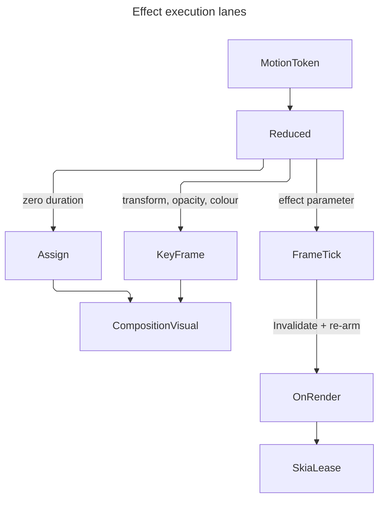

# [APPUI_VFX_COMPOSE]

Rasm.AppUi composition is the effects plane's execution adapter onto the render thread: one closed slot vocabulary whose keys ARE the compositor's own animatable property names, one keyframe mint that lands a `MotionToken` on a composition animation under the duration floor, one implicit-trigger map so a layout assignment animates without a per-frame tick, and one custom-visual handler carrying the material and shader draws off the UI thread. `Theme/motion` owns what motion FEELS like — the token rows, the plan family, the reduced-motion switch — and this page owns where that timing EXECUTES, so a duration, a curve, or a stagger authored here would be a second timing source the reduction switch never reaches.

`Compositor`, `CompositionVisual`, `ElementComposition`, `KeyFrameAnimation`, `ImplicitAnimationCollection`, and `CompositionCustomVisualHandler` are the composed owners; `MotionToken`, `MotionPlan`, `MotionEasing`, and `ReducedMotion.Select` arrive settled from `Theme/motion#MOTION_AXIS`, and `MotionEasing` is the one `IEasing` a keyframe binds so the kernel curve reaches the render thread unchanged. Composition animation reaches transform, opacity, and colour ALONE — no brush, backdrop, mask, clip, or shape type hangs off the compositor — so every material and shader term from `material#MATERIAL_EXECUTION` and `shader#EFFECT_PROGRAM` animates by redrawing inside the handler against the compositor's own clock. Faults derive through `AppUiFaultBand.Compose` (6820).

## [01]-[INDEX]

- [02]-[VISUAL_ACQUISITION]: The closed slot vocabulary, backing-visual acquisition, and the child-visual attach.
- [03]-[ANIMATION_MINT]: Token-to-keyframe mint, the duration floor, and the reduced-motion collapse.
- [04]-[IMPLICIT_TRIGGERS]: Plan-derived trigger maps keyed on the same slot vocabulary.
- [05]-[CUSTOM_VISUAL_TICK]: The render-thread handler, its single-frame re-arm, and the in-tree-versus-composition choice.

## [02]-[VISUAL_ACQUISITION]

- Owner: `ComposeSlot` `[SmartEnum<string>]` the closed animatable-property vocabulary; `ComposeValue` `[Union]` its typed cell; `ComposeFault` the typed rail on the `AppUiFaultBand.Compose` 6820 registry row; `ElementVisual` the acquisition capsule.
- Cases: `ComposeSlot` = Opacity | Offset | Translation | Scale | CenterPoint | RotationAngle | Orientation | Size | Color; `ComposeValue` = Scalar | Vector3 | Vector | Colour | Turn; `ComposeFault` = VisualUnavailable | SlotMismatch | DurationRefused | CompositorMismatch | HandlerDetached.
- Law: a slot's KEY is the compositor's own property name. One string vocabulary addresses both animation surfaces — the explicit start and the implicit trigger map — and the two fail in opposite directions on a typo: the explicit path throws and the implicit path silently animates nothing, so a composed string is the one spelling this page makes unrepresentable.
- Entry: `public static Fin<ElementVisual> Of(Visual element)` — the acquisition, refusing before the element enters a render tree; `public Fin<Unit> Attach(CompositionVisual child)` and `public Fin<Unit> Detach()` — the two tree mutations, both landing through `Compositor.RequestCompositionUpdate`.
- Auto: acquisition defers to the first composition update because the backing visual is null until the element is in a render tree, so a capsule minted at construction re-acquires on attach rather than caching a null; the compositor comes off the acquired visual rather than off the process default, which is what keeps a child attach inside one compositor instance; both tree mutations queue on the compositor loop through one deferral, so a mount or release issued mid-commit seats against the batch that commit is building.
- Packages: Avalonia, Thinktecture.Runtime.Extensions, LanguageExt.Core
- Growth: a new animatable slot is one `ComposeSlot` row carrying its own mint AND its own property write, so the collapse path and the keyframe path both absorb it with no site edited; a new value shape is one `ComposeValue` case with its own keyframe arm; zero new surface.
- Boundary: `SetElementChildVisual` throws across compositor instances, so the child a capsule attaches is minted from the acquired visual's OWN compositor and never from `Compositor.TryGetDefaultCompositor` — the process default is the right compositor in the single-window case and the wrong one exactly where an embedded host surface makes it matter. `Offset` and `Scale` are `Vector3D`, so the `Vector3D` keyframe animation drives them and the `Vector3` variant targets neither — one letter apart, both compiling, one silently binding nothing. Setting a slot cancels a running animation on that same slot before the implicit lookup fires, and starting an animation overrides an assigned value until it stops under its `StopBehavior`, so explicit and implicit motion compete on last-write-wins and a surface driving one slot from both paths is the deleted form.

```csharp signature
// --- [ERRORS] ---------------------------------------------------------------------------

[Union(ConversionFromValue = ConversionOperatorsGeneration.None)]
public abstract partial record ComposeFault : Expected, IValidationError<ComposeFault> {
    private ComposeFault(string detail, int code) : base(detail, code) { }
    public static ComposeFault Create(string message) => new VisualUnavailable(message);
    public sealed record VisualUnavailable(string Detail)
        : ComposeFault($"compose/visual: {Detail}", AppUiFaultBand.Compose.Code(0));
    public sealed record SlotMismatch(string Detail)
        : ComposeFault($"compose/slot: {Detail}", AppUiFaultBand.Compose.Code(1));
    public sealed record DurationRefused(string Detail)
        : ComposeFault($"compose/duration: {Detail}", AppUiFaultBand.Compose.Code(2));
    public sealed record CompositorMismatch(string Detail)
        : ComposeFault($"compose/compositor: {Detail}", AppUiFaultBand.Compose.Code(3));
    public sealed record HandlerDetached(string Detail)
        : ComposeFault($"compose/handler: {Detail}", AppUiFaultBand.Compose.Code(4));
}
```

```csharp signature
// --- [TYPES] ----------------------------------------------------------------------------

// The typed cell. Its cases are the value shapes the compositor's animatable slots actually take, and each one
// OWNS its keyframe write — the typed keyframe subclasses declare InsertKeyFrame independently while the base
// declares none, so the pairing of a constructed animation with a value belongs on the union rather than in a
// tuple switch a new shape has to be threaded through.
[Union(ConversionFromValue = ConversionOperatorsGeneration.None)]
public abstract partial record ComposeValue {
    private ComposeValue() { }
    public sealed record Scalar(float Value) : ComposeValue;
    public sealed record Vector3(Vector3D Value) : ComposeValue;
    public sealed record Vector(Avalonia.Vector Value) : ComposeValue;
    public sealed record Colour(Color Value) : ComposeValue;
    public sealed record Turn(Quaternion Value) : ComposeValue;

    public Option<float> AsScalar => this is Scalar cell ? Some(cell.Value) : None;
    public Option<Vector3D> AsVector3 => this is Vector3 cell ? Some(cell.Value) : None;
    public Option<Avalonia.Vector> AsVector => this is Vector cell ? Some(cell.Value) : None;
    public Option<Color> AsColour => this is Colour cell ? Some(cell.Value) : None;
    public Option<Quaternion> AsTurn => this is Turn cell ? Some(cell.Value) : None;

    // The value keyframe. A pair the compositor cannot express is a typed refusal rather than an overload that
    // never resolves, and the cast lands in the arm that knows which animation its own shape was minted onto.
    public Fin<Unit> Frame(KeyFrameAnimation animation, float cue, IEasing easing) => Switch(
        state: (Animation: animation, Cue: cue, Easing: easing),
        scalar: static (s, cell) => s.Animation is ScalarKeyFrameAnimation a
            ? ComposeSlot.Set(() => a.InsertKeyFrame(s.Cue, cell.Value, s.Easing))
            : Mismatch(s.Animation, cell),
        vector3: static (s, cell) => s.Animation is Vector3DKeyFrameAnimation a
            ? ComposeSlot.Set(() => a.InsertKeyFrame(s.Cue, cell.Value, s.Easing))
            : Mismatch(s.Animation, cell),
        vector: static (s, cell) => s.Animation is VectorKeyFrameAnimation a
            ? ComposeSlot.Set(() => a.InsertKeyFrame(s.Cue, cell.Value, s.Easing))
            : Mismatch(s.Animation, cell),
        colour: static (s, cell) => s.Animation is ColorKeyFrameAnimation a
            ? ComposeSlot.Set(() => a.InsertKeyFrame(s.Cue, cell.Value, s.Easing))
            : Mismatch(s.Animation, cell),
        turn: static (s, cell) => s.Animation is QuaternionKeyFrameAnimation a
            ? ComposeSlot.Set(() => a.InsertKeyFrame(s.Cue, cell.Value, s.Easing))
            : Mismatch(s.Animation, cell));

    static Fin<Unit> Mismatch(KeyFrameAnimation animation, ComposeValue value) =>
        Fin.Fail<Unit>(new ComposeFault.SlotMismatch($"{animation.GetType().Name} takes no {value.GetType().Name}"));
}

// The KEY is the compositor's property name. One string addresses `StartAnimation(name, …)` and
// `ImplicitAnimations[name]`, and the two fail in opposite directions on a typo — the explicit call throws,
// the implicit lookup silently animates nothing — so the vocabulary closes here and no call site spells one.
// Each row carries BOTH of its slot-local facts: the animation its property type takes, and the write that
// property takes. A roster restated as a switch beside the rows is the shape where a new slot compiles, mints
// its animation, and then silently fails to collapse — so the write rides the row and growth edits no site.
[SmartEnum<string>]
[KeyMemberEqualityComparer<ComparerAccessors.StringOrdinal, string>]
[KeyMemberComparer<ComparerAccessors.StringOrdinal, string>]
public sealed partial class ComposeSlot {
    public static readonly ComposeSlot Opacity = new("Opacity",
        static c => c.CreateScalarKeyFrameAnimation(),
        static (visual, value) => value.AsScalar.Map<Action>(v => () => visual.Opacity = v));
    // Offset and Scale are Vector3D: the Vector3 keyframe variant targets neither, and the two factory names
    // differ by one character while both compile against StartAnimation's string parameter.
    public static readonly ComposeSlot Offset = new("Offset",
        static c => c.CreateVector3DKeyFrameAnimation(),
        static (visual, value) => value.AsVector3.Map<Action>(v => () => visual.Offset = v));
    public static readonly ComposeSlot Translation = new("Translation",
        static c => c.CreateVector3DKeyFrameAnimation(),
        static (visual, value) => value.AsVector3.Map<Action>(v => () => visual.Translation = v));
    public static readonly ComposeSlot Scale = new("Scale",
        static c => c.CreateVector3DKeyFrameAnimation(),
        static (visual, value) => value.AsVector3.Map<Action>(v => () => visual.Scale = v));
    public static readonly ComposeSlot CenterPoint = new("CenterPoint",
        static c => c.CreateVector3DKeyFrameAnimation(),
        static (visual, value) => value.AsVector3.Map<Action>(v => () => visual.CenterPoint = v));
    public static readonly ComposeSlot RotationAngle = new("RotationAngle",
        static c => c.CreateScalarKeyFrameAnimation(),
        static (visual, value) => value.AsScalar.Map<Action>(v => () => visual.RotationAngle = v));
    public static readonly ComposeSlot Orientation = new("Orientation",
        static c => c.CreateQuaternionKeyFrameAnimation(),
        static (visual, value) => value.AsTurn.Map<Action>(v => () => visual.Orientation = v));
    public static readonly ComposeSlot Size = new("Size",
        static c => c.CreateVectorKeyFrameAnimation(),
        static (visual, value) => value.AsVector.Map<Action>(v => () => visual.Size = v));
    // The colour slot lives on the solid-colour subclass alone, so the row answers no write where the visual
    // carries no such property and the collapse refuses by name instead of assigning nothing.
    public static readonly ComposeSlot Color = new("Color",
        static c => c.CreateColorKeyFrameAnimation(),
        static (visual, value) => visual is CompositionSolidColorVisual fill
            ? value.AsColour.Map<Action>(v => () => fill.Color = v)
            : None);

    public Func<Compositor, KeyFrameAnimation> Factory { get; }

    Func<CompositionVisual, ComposeValue, Option<Action>> Writer { get; }

    // The one property-assignment site. Slot keys are the compositor's own names, so the write is total over
    // the vocabulary and a name the object does not declare is unspellable rather than an ArgumentException.
    public Fin<Unit> Write(CompositionVisual visual, ComposeValue value) =>
        Writer(visual, value).Match(
            Some: Set,
            None: () => Fin.Fail<Unit>(new ComposeFault.SlotMismatch($"{Key} takes no {value.GetType().Name}")));

    public Fin<KeyFrameAnimation> Mint(Compositor compositor, Seq<(float Cue, ComposeValue Value)> frames, IEasing easing) =>
        Factory(compositor) switch {
            var animation => frames.Fold(
                Fin.Succ(animation),
                (state, frame) => state.Bind(seated => frame.Value.Frame(seated, frame.Cue, easing).Map(_ => seated))),
        };

    // The one lift for a write onto LIVE compositor state — an assigned property, an inserted keyframe, a
    // queued tree mutation — so each is a value on the rail rather than a statement inside an expression.
    // Construction-time writes on an animation a fold still owns stay statements, because nothing observes them
    // until the run starts.
    public static Fin<Unit> Set(Action write) {
        write();
        return Fin.Succ(unit);
    }
}
```

```csharp signature
// --- [SERVICES] -------------------------------------------------------------------------

// The acquisition capsule. GetElementVisual answers null until the element is in a render tree, so the
// capsule is minted at attach and never cached at construction; the compositor comes off the acquired visual
// because SetElementChildVisual throws across compositor instances and the process default is the wrong one
// exactly where an embedded host surface makes the distinction matter. Every tree mutation here defers onto
// the compositor loop, so attach and detach are one deferral owner rather than two call sites racing commits.
public sealed record ElementVisual(Visual Element, CompositionVisual Backing) {
    public Compositor Compositor => Backing.Compositor;

    public static Fin<ElementVisual> Of(Visual element) =>
        ElementComposition.GetElementVisual(element) switch {
            null => Fin.Fail<ElementVisual>(new ComposeFault.VisualUnavailable(
                $"{element.GetType().Name} carries no backing visual until it enters a render tree")),
            var backing => Fin.Succ(new ElementVisual(element, backing)),
        };

    // The compositor identity check is SYNCHRONOUS and the tree mutation is DEFERRED: a foreign-compositor
    // child is a refusal the caller reads on its own rail, while the attach lands in a pre-commit callback on
    // the compositor loop, so a mount issued while a commit is already in flight seats against the batch that
    // commit is building rather than racing it. Queuing is what the rail reports, because a mutation past its
    // one gate carries no second failure the callback could report back.
    public Fin<Unit> Attach(CompositionVisual child) =>
        ReferenceEquals(child.Compositor, Compositor)
            ? Deferred(() => ElementComposition.SetElementChildVisual(Element, child))
            : Fin.Fail<Unit>(new ComposeFault.CompositorMismatch(
                $"{Element.GetType().Name}: child minted on a foreign compositor"));

    public Fin<Unit> Detach() => Deferred(() => ElementComposition.SetElementChildVisual(Element, null));

    Fin<Unit> Deferred(Action mutate) => ComposeSlot.Set(() => Compositor.RequestCompositionUpdate(mutate));
}
```

## [03]-[ANIMATION_MINT]

- Owner: `ComposeTrack` the slot-and-frames animation spec; `ComposeRun` the mint-and-start fold.
- Law: `KeyFrameAnimation.Duration` validates the field it OVERWRITES rather than the incoming value, so a single `TimeSpan.Zero` assignment lands silently and the NEXT assignment of any value at all throws — the floor clamp is therefore not a nicety but the condition under which the property remains assignable, and its real upper bound is one day whatever the diagnostic claims. `ComposeTrack.Bound` is the page's ONE duration admission and every timing path crosses it: the explicit run, the implicit trigger, and the render-thread tick, because a second clamp spelled at one of them is the one that keeps the floor and loses the ceiling.
- Entry: `public Fin<Unit> Start(ElementVisual visual, MotionToken token)` — mint, clamp, start; reduced-motion resolution happens INSIDE, so a caller cannot start an unreduced run; `public static Fin<TimeSpan> Bound(TimeSpan span)` — the one duration admission every timing path on this page takes.
- Auto: the token's curve reaches the render thread through `MotionEasing`, the one Avalonia easing adapter the motion vocabulary already owns, so a composition keyframe and a styled transition evaluate the same kernel curve; a plan-driven run reads `MotionPlan.EnterToken`/`ExitToken`, which have already folded the reduction at their own owner.
- Receipt: `ComposeReceipt` — slot key, token key, resolved key, collapsed flag, frame count, `Instant` — sealed under the evidence union's `Effect` case, so the proof lane reads which runs collapsed on each host rather than inferring reduction from frame timings.
- Packages: Avalonia, NodaTime, LanguageExt.Core
- Growth: a new animated surface is one `ComposeTrack` value over existing slots; zero new surface.
- Boundary: reduced motion COLLAPSES to a value assignment, never to a zero-duration animation — assigning the slot cancels any running animation on it and lands the terminal value in one write, where a zero-length run would arm the duration trap and still pay a composition batch. `StopBehavior` decides what a cancelled run leaves behind and the reduction path never reaches it, so a collapsed track and a completed track leave the same value by construction. Composition animation reaches transform, opacity, and colour alone: a material's blur radius, a shader's phase, and a wash's crossfade weight are not slots and animate by redrawing under `[05]-[CUSTOM_VISUAL_TICK]`, so a track naming an effect parameter is unspellable rather than a run that starts and moves nothing.

```csharp signature
// --- [MODELS] ---------------------------------------------------------------------------

// A track is a slot, its frames, and its playback policy. Frames carry CUES in the zero-to-one progress
// domain the compositor uses, so a track is re-timed by swapping its token and never by rewriting its frames.
public sealed record ComposeTrack(
    ComposeSlot Slot,
    Seq<(float Cue, ComposeValue Value)> Frames,
    PlaybackDirection Direction = PlaybackDirection.Normal,
    AnimationStopBehavior Stop = AnimationStopBehavior.SetToFinalValue) {
    public static readonly TimeSpan Floor = TimeSpan.FromMilliseconds(1);
    public static readonly TimeSpan Ceiling = TimeSpan.FromDays(1);

    // The terminal frame is what a collapse assigns and what a completed run leaves behind, so both paths
    // land one value and a reduced host cannot diverge from an unreduced one on final state.
    // Ordering leaves the carrier, so the ordered run re-enters it before the Option-shaped final read.
    public Option<ComposeValue> Terminal =>
        toSeq(Frames.OrderBy(static frame => frame.Cue)).Last.Map(static frame => frame.Value);

    public Fin<Unit> Start(ElementVisual visual, MotionToken token) =>
        ReducedMotion.Select(token) switch {
            var resolved when resolved.Duration == Duration.Zero => Collapse(visual),
            var resolved => Run(visual, resolved),
        };

    // The collapse. Assigning the slot cancels any running animation on it before the implicit lookup fires,
    // so one write both stops the old run and lands the terminal value; a zero-length animation would arm the
    // duration trap and still cost a composition batch to reach the identical state.
    Fin<Unit> Collapse(ElementVisual visual) =>
        Terminal.ToFin(new ComposeFault.SlotMismatch($"{Slot.Key}: no terminal frame to collapse onto"))
            .Bind(value => Slot.Write(visual.Backing, value));

    Fin<Unit> Run(ElementVisual visual, MotionToken resolved) =>
        from animation in Slot.Mint(visual.Compositor, Frames, new MotionEasing(resolved.Curve))
        from bounded in Bound(resolved.Duration.ToTimeSpan())
        select Started(visual, animation, bounded);

    // The floor is what keeps the property assignable: the setter validates the value it REPLACES, so the
    // zero that lands silently poisons the next assignment of any value whatsoever. The ceiling is the real
    // upper bound the implementation enforces regardless of what its own message states. Every timing path on
    // this page crosses this one admission, so a run, a trigger, and a frame tick cannot disagree about which
    // spans are spellable — and a negative span, which no equality test against zero catches, refuses here
    // rather than dividing a tick's own elapsed fraction by it forever.
    public static Fin<TimeSpan> Bound(TimeSpan span) =>
        span > Ceiling
            ? Fin.Fail<TimeSpan>(new ComposeFault.DurationRefused($"{span} exceeds the {Ceiling} bound"))
            : span < TimeSpan.Zero
                ? Fin.Fail<TimeSpan>(new ComposeFault.DurationRefused($"{span} is a negative span"))
                : Fin.Succ(span < Floor ? Floor : span);

    Unit Started(ElementVisual visual, KeyFrameAnimation animation, TimeSpan duration) {
        animation.Duration = duration;
        animation.Direction = Direction;
        animation.StopBehavior = Stop;
        animation.Target = Slot.Key;
        visual.Backing.StartAnimation(Slot.Key, animation);
        return unit;
    }
}

public readonly record struct ComposeReceipt(
    string Slot, string Token, string Resolved, bool Collapsed, int Frames, Instant At) {
    public EvidenceReceipt ToEvidence() => new EvidenceReceipt.Effect(
        Plane: "compose", Key: Slot, Outcome: Resolved,
        Flag: Collapsed, Count: Frames, Magnitude: Token);
}
```

## [04]-[IMPLICIT_TRIGGERS]

- Owner: `ImplicitPlan` the trigger-map mint over a `MotionPlan`.
- Law: an implicit trigger fires only when the assigned value DIFFERS from the current one, and both of a trigger animation's endpoints are EXPRESSIONS — `this.StartingValue` reads the slot's live value at the moment the trigger fires and `this.FinalValue` reads the value the assignment carried in — so a trigger map authors no literal endpoint and one body covers every slot in the vocabulary.
- Entry: `public static Fin<ImplicitAnimationCollection> Of(Compositor compositor, MotionPlan plan, Seq<ComposeSlot> slots)` — the one mint, refusing under active reduction because a reduced surface takes the assignment directly; assignment to `CompositionObject.ImplicitAnimations` is the whole binding surface.
- Auto: a layout assignment on a triggered slot animates with no per-frame tick and no explicit start, so panel reflow, dock rearrangement, and list reorder ride one map rather than a start call at every write site.
- Packages: Avalonia, LanguageExt.Core
- Growth: a new triggered surface is one `ImplicitPlan` mint over existing slots; zero new surface.
- Boundary: the map is keyed on the SAME `ComposeSlot.Key` vocabulary the explicit path uses, which is the whole reason the vocabulary is closed — a key the object does not declare throws on the explicit path and silently registers a trigger that never fires on this one, and the second failure is invisible in every test that only asserts the value eventually arrives. A slot driven by both an explicit run and a trigger map resolves last-write-wins with no diagnostic, so a surface picks one path per slot; the implicit map is the right path wherever the value is assigned by layout and the explicit run is the right path wherever a command drives it. `ImplicitAnimationCollection` implements the dictionary interface beside its UWP-shaped members, so the estate binds through the indexer and leaves `Insert`/`Lookup`/`HasKey`/`Size` to the shape they mirror.

```csharp signature
// --- [OPERATIONS] -----------------------------------------------------------------------

public static class ImplicitPlan {
    // A trigger animation authors NO value cells at all: both endpoints are expression keyframes over the two
    // keywords the composition expression language reserves — `this.StartingValue` is the slot's live value at
    // the moment the trigger fires and `this.FinalValue` is the value the assignment carried in. Authoring a
    // literal endpoint instead would pin one end to a constant the next assignment silently disagrees with,
    // and the expression form is type-agnostic, so one body covers every slot in the vocabulary.
    public static Fin<ImplicitAnimationCollection> Of(Compositor compositor, MotionPlan plan, Seq<ComposeSlot> slots) =>
        ReducedMotion.Select(plan.Enter) switch {
            var resolved when resolved.Duration == Duration.Zero =>
                Fin.Fail<ImplicitAnimationCollection>(new ComposeFault.DurationRefused(
                    $"{plan.Key}: a reduced plan mounts no trigger map — the assignment lands directly")),
            var resolved => ComposeTrack.Bound(resolved.Duration.ToTimeSpan()).Bind(span => slots.Fold(
                Fin.Succ(compositor.CreateImplicitAnimationCollection()),
                (state, slot) => state.Map(map => Seated(map, slot, Trigger(compositor, slot, resolved, span))))),
        };

    // The span arrives ALREADY bound, because the trigger path and the explicit run share one duration
    // admission — a local floor clamp here would keep the property assignable and lose the ceiling refusal,
    // and an over-long plan would then throw at a setter the map never reports on.
    static KeyFrameAnimation Trigger(Compositor compositor, ComposeSlot slot, MotionToken resolved, TimeSpan span) {
        KeyFrameAnimation animation = slot.Factory(compositor);
        MotionEasing easing = new(resolved.Curve);
        animation.InsertExpressionKeyFrame(0f, "this.StartingValue", easing);
        animation.InsertExpressionKeyFrame(1f, "this.FinalValue", easing);
        animation.Duration = span;
        animation.Target = slot.Key;
        return animation;
    }

    // The indexer is the binding surface: the collection implements the dictionary interface beside its
    // UWP-shaped Insert/Lookup/HasKey/Size members, so one spelling serves and the mirrored set stays unused.
    static ImplicitAnimationCollection Seated(ImplicitAnimationCollection map, ComposeSlot slot, KeyFrameAnimation animation) {
        map[slot.Key] = animation;
        return map;
    }
}
```

## [05]-[CUSTOM_VISUAL_TICK]

- Owner: `VfxHandler` the render-thread custom-visual handler; `VfxMessage` `[Union]` its closed message channel; `VfxRun` the armed run; `VfxSurface` the mount capsule.
- Cases: `VfxMessage` = Retarget | Advance | Halt.
- Law: an effect term is not a composition slot. A blur radius, a glow intensity, a shader phase, and a wash crossfade weight all animate by REDRAWING against the compositor's own frame clock, because no brush, backdrop, mask, clip, or shape type hangs off the compositor at all and the animatable surface is transform, opacity, and colour.
- Entry: `public override void OnRender(ImmediateDrawingContext context)` — the one draw callback, reaching Skia through the same lease an in-tree operation takes; `public override void OnAnimationFrameUpdate()` — the per-frame advance, re-arming itself; `public static Fin<VfxMessage> Advancing(MotionToken token)` — the admitted mint every advance crosses before it reaches the render thread.
- Auto: `RegisterForNextAnimationFrameUpdate` arms exactly ONE frame, so a running term re-arms from inside the update and a settled term simply stops arming; `CompositionNow` is the compositor's own server clock for the frame, so every effect phase derives from one time source and two effects on one surface cannot drift apart; the armed run is ONE cell carrying its token, its bounded span, and the origin it was stamped at, so a retarget mid-run re-reads one subtraction rather than accumulating per-frame deltas that drift with every dropped frame, and a half-armed handler holding an origin for a run it no longer has is unrepresentable; a host that suspends and resumes stops the arming and resumes past the run's own end, so the resumed frame reads the terminal value and disarms.
- Receipt: the tick contributes no receipt of its own — a per-frame receipt is a per-frame write — and the surface's material and tile receipts seal at their own owners.
- Packages: Avalonia, Avalonia.Skia, SkiaSharp, Rasm (project — `UnitInterval`), NodaTime, Thinktecture.Runtime.Extensions, LanguageExt.Core
- Growth: a new render-thread effect surface is one `VfxSurface` mount over existing material and program rows; zero new surface.
- Boundary: `EffectiveSize`, `CompositionNow`, `Invalidate`, and `RegisterForNextAnimationFrameUpdate` throw before the handler attaches to a compositor, and the two render-clip probes throw outside `OnRender`, so every one of them reads inside its own callback and a constructor-time read is the deleted form. The choice between this handler and the in-tree `material#SAMPLE_CONTRACT` host is a real one and it is decided by CADENCE, not by preference: a treatment that must interleave with the control's own content rides the in-tree operation, while a treatment animating every frame independent of layout rides this handler, because a per-frame `InvalidateVisual` re-enters layout arbitration for the whole tree on the UI thread where `Invalidate(Rect)` here stays on the render thread. Messages cross through `SendHandlerMessage` as a CLOSED union, so a handler cannot receive a payload it has no arm for and the channel carries no untyped bag — and the union ADMITS at its own mint, on the thread that still has a rail: the reduction switch and the duration bound both run there, so a reduced token arrives already collapsed to a halt and an unbounded span never reaches a thread with nowhere to report it. `GetRenderBounds` defaults to `EffectiveSize` and widens only where a term bleeds past the visual, which is the same bleed the sample contract inflates by. A frame's moving values are a PROJECTION of the run — the handler holds one run cell and draws `material#MATERIAL_EXECUTION` `MaterialSpec.AtPhase`, so the drawn state cannot disagree with the run's own progress — and the raw elapsed fraction is what settles the tick while the curve is what shapes the value, which keeps a curve that overshoots from ever moving the settling test. The phase channel itself is a CLAMPING axis: an effect parameter saturates at its own domain edge, so overshoot is refused at the token bind by the axis-kind law at `Theme/motion#MOTION_BINDING` rather than squashed silently here.

```csharp signature
// --- [TYPES] ----------------------------------------------------------------------------

// The closed message channel. SendHandlerMessage takes an object, so the union is what keeps an untyped bag
// off the render thread — every message the handler can receive has an arm, and an unhandled payload is a
// compile-time absence rather than a silently ignored frame. Admission happens at the MINT rather than in the
// handler, because the render thread carries no rail: an advance resolves its reduction, bounds its span, and
// collapses a reduced token to a halt outright, so the only run the handler can ever receive is one it can
// divide by and one it will settle out of.
[Union(ConversionFromValue = ConversionOperatorsGeneration.None)]
public abstract partial record VfxMessage {
    private VfxMessage() { }
    public sealed record Retarget(MaterialSpec Spec) : VfxMessage;
    public sealed record Advance(MotionToken Resolved, TimeSpan Span) : VfxMessage;
    public sealed record Halt() : VfxMessage;

    // Reduced motion HALTS the tick rather than slowing it: a reduced host renders the effect's terminal
    // appearance and pays no per-frame recomposite at all, so the collapse is a different message and never a
    // zero-length run the handler would have to special-case on every frame it draws.
    public static Fin<VfxMessage> Advancing(MotionToken token) =>
        ReducedMotion.Select(token) switch {
            var resolved when resolved.Duration == Duration.Zero => Fin.Succ<VfxMessage>(new Halt()),
            var resolved => ComposeTrack.Bound(resolved.Duration.ToTimeSpan())
                .Map(span => (VfxMessage)new Advance(resolved, span)),
        };
}

// The armed run: the resolved token, the span its admission bounded, and the server-clock instant the message
// stamped it at. ONE cell, so arming, settling, and disarming are one write and a handler holding an origin
// for a run it no longer has cannot exist; the span is bounded away from zero at the mint, so the elapsed
// fraction divides by a real duration on every frame and a settled tick is reachable by construction.
public readonly record struct VfxRun(MotionToken Token, TimeSpan Span, TimeSpan Origin) {
    public double Elapsed(TimeSpan now) => Math.Clamp((now - Origin) / Span, 0d, 1d);

    public UnitInterval Phase(TimeSpan now) => UnitInterval.Create(Math.Clamp(Token.Curve(Elapsed(now)), 0d, 1d));
}
```

```csharp signature
// --- [SERVICES] -------------------------------------------------------------------------

// The render-thread handler. Effect terms animate by REDRAWING here because composition animation reaches
// transform, opacity, and colour alone — the compositor publishes no effect, backdrop, mask, or shape brush
// at all — so a phase advances against CompositionNow and the frame re-arms itself.
public sealed class VfxHandler(MaterialSpec spec, Func<PaintCatalog> catalog) : CompositionCustomVisualHandler {
    MaterialSpec current = spec;
    Option<VfxRun> run = None;

    // OnRender reaches the same Skia lease an in-tree ICustomDrawOperation takes, so a composition-thread
    // draw and a control-thread draw share one rail and neither mints a surface. The spec is projected at the
    // frame's own phase, so the moving terms are a READ of the run rather than mutable state the handler and
    // the draw have to keep agreeing about.
    public override void OnRender(ImmediateDrawingContext context) =>
        ignore(context.TryGetFeature<ISkiaSharpApiLeaseFeature>() is { } feature
            ? Draw(feature)
            : Fin.Fail<Unit>(new ComposeFault.HandlerDetached($"{current.Tier.Key}: no Skia lease on this backend")));

    Fin<Unit> Draw(ISkiaSharpApiLeaseFeature feature) {
        using ISkiaSharpApiLease lease = feature.Lease();
        return current.AtPhase(Progress()).Draw(
            new DrawSource.Borrowed(lease),
            catalog(),
            new SKRect(0f, 0f, (float)EffectiveSize.X, (float)EffectiveSize.Y),
            static _ => Fin.Succ(unit));
    }

    // Elapsed is the RAW fraction of the run and progress is that fraction under the token's own kernel curve,
    // so a curve that overshoots never moves the settling test that stops the tick. A settled surface reads the
    // terminal value, never a wall clock.
    double Elapsed() => run.Match(Some: armed => armed.Elapsed(CompositionNow), None: () => 1d);

    UnitInterval Progress() => run.Match(Some: armed => armed.Phase(CompositionNow), None: () => UnitInterval.Create(1d));

    // The arm is SINGLE-frame, so a running term re-arms from inside and a settled one simply stops — which is
    // what makes a completed effect cost nothing rather than ticking against an idle predicate. The run drops
    // at its own end, so the terminal frame draws once and the tick disarms itself.
    public override void OnAnimationFrameUpdate() {
        if (run.IsNone) {
            return;
        }
        Invalidate(GetRenderBounds());
        if (Elapsed() >= 1d) {
            run = None;
            return;
        }
        RegisterForNextAnimationFrameUpdate();
    }

    // Every payload the channel can carry has already crossed its own admission, so the handler dispatches and
    // never decides: a reduced token arrived as a halt and an unbounded span never arrived at all.
    public override void OnMessage(object message) => ignore(message is VfxMessage typed
        ? typed.Switch(
            state: this,
            retarget: static (handler, row) => handler.Retarget(row.Spec),
            advance: static (handler, row) => handler.Advance(row.Resolved, row.Span),
            halt: static (handler, _) => handler.Halt())
        : unit);

    Unit Retarget(MaterialSpec next) {
        current = next;
        Invalidate();
        return unit;
    }

    // The origin is stamped from the compositor's own clock at the message, not from a first-frame sentinel: a
    // run legitimately starting at a zero server clock would otherwise re-stamp its origin every frame and
    // never advance. Arming is ONE write over the whole run, so an origin can never outlive its own token.
    Unit Advance(MotionToken resolved, TimeSpan span) {
        run = Some(new VfxRun(resolved, span, CompositionNow));
        RegisterForNextAnimationFrameUpdate();
        Invalidate();
        return unit;
    }

    Unit Halt() {
        run = None;
        Invalidate();
        return unit;
    }

    // Render bounds widen by the ground's own bleed, the same inflation the in-tree sample contract clamps
    // against, so one value governs the dirty rect on both rails.
    public override Rect GetRenderBounds() =>
        SampleScope.Inflate(new SKRect(0f, 0f, (float)EffectiveSize.X, (float)EffectiveSize.Y), current.Ground)
            .ToAvaloniaRect();
}

// The mount capsule: acquire, mint the custom visual on the acquired compositor, bind its size to the owner's
// bounds, attach it, and release all three on detach. The attach and detach deferral belongs to the
// acquisition capsule, so this capsule holds the mount ORDER and never a second path onto the compositor loop.
public sealed record VfxSurface(ElementVisual Owner, CompositionCustomVisual Visual, IDisposable Sizing) : IDisposable {
    public static Fin<VfxSurface> Mount(Visual element, VfxHandler handler) =>
        from owner in ElementVisual.Of(element)
        let visual = owner.Compositor.CreateCustomVisual(handler)
        from attached in owner.Attach(Sized(visual, element.Bounds.Size))
        select new VfxSurface(owner, visual, Tracking(element, visual));

    // The mount size is a SUBSCRIPTION and never a snapshot: a custom visual sized once at attach keeps drawing
    // at the extent the element happened to have when it entered the tree, and the handler's own EffectiveSize
    // is that stale value — so every falloff, every wash, and every render-bound inflation resolves against a
    // surface the user has already resized away from, with nothing in the frame to show it.
    static IDisposable Tracking(Visual element, CompositionCustomVisual visual) =>
        element.GetObservable(Avalonia.Visual.BoundsProperty)
            .Subscribe(bounds => ignore(Sized(visual, bounds.Size)));

    static CompositionCustomVisual Sized(CompositionCustomVisual visual, Size size) {
        visual.Size = new Vector(size.Width, size.Height);
        return visual;
    }

    public Unit Send(VfxMessage message) {
        Visual.SendHandlerMessage(message);
        return unit;
    }

    public void Dispose() {
        Sizing.Dispose();
        ignore(Send(new VfxMessage.Halt()));
        ignore(Owner.Detach());
    }
}
```



## [06]-[RESEARCH]

(none)
