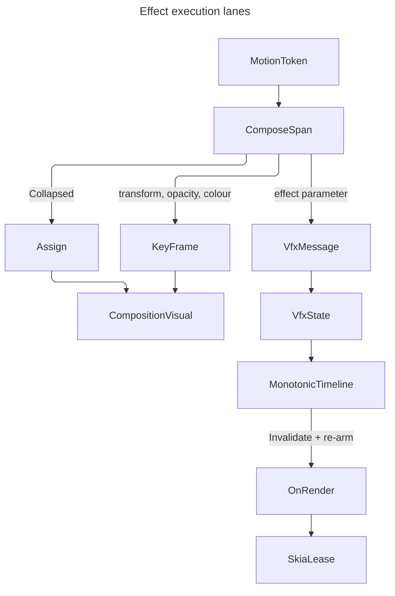

# [APPUI_VFX_COMPOSE]

Rasm.AppUi composition is the effects plane's execution adapter onto the render thread: one closed slot vocabulary whose keys ARE the compositor's own animatable property names, one keyframe mint that lands a `MotionToken` on a composition animation under the duration floor, one implicit-trigger map so a layout assignment animates without a per-frame tick, and one custom-visual handler carrying the material and shader draws off the UI thread. `Theme/motion` owns what motion FEELS like — the token rows, the plan family, the reduced-motion switch — and this page owns where that timing EXECUTES, so a duration, a curve, or a stagger authored here would be a second timing source the reduction switch never reaches.

`Compositor`, `CompositionVisual`, `ElementComposition`, `KeyFrameAnimation`, `ImplicitAnimationCollection`, and `CompositionCustomVisualHandler` are the composed owners; `MotionToken`, `MotionPlan`, `MotionAxis`, `MotionEasing`, and `ReducedMotion.Select` arrive settled from `Theme/motion#MOTION_AXIS` and `#MOTION_BINDING`, and `MotionEasing` is the one `IEasing` a keyframe binds so the kernel curve reaches the render thread unchanged. Composition animation reaches transform, opacity, and colour ALONE — no brush, backdrop, mask, clip, or shape type hangs off the compositor — so every material and shader term from `material#MATERIAL_EXECUTION` and `shader#EFFECT_PROGRAM` animates by redrawing inside the handler. Kernel `Op`, `Custody`, `Transition`, `MonotonicTimeline`, `FaultCell`, `UnitInterval`, and the `FaultBand` `Fault` floor arrive whole from `Rasm.Domain`, `Rasm.Numerics`, and `Rasm.Parametric`.

## [01]-[INDEX]

- [02]-[VISUAL_ACQUISITION]: The value-shape correspondence, the closed slot vocabulary, backing-visual acquisition, and the child-visual attach.
- [03]-[ANIMATION_MINT]: The one reduce-and-bound resolution, the token-to-keyframe mint, and the reduced-motion collapse.
- [04]-[IMPLICIT_TRIGGERS]: Plan-derived trigger maps keyed on the same slot vocabulary.
- [05]-[CUSTOM_VISUAL_TICK]: The render-thread handler, its single-frame re-arm, and the in-tree-versus-composition choice.

## [02]-[VISUAL_ACQUISITION]

- Owner: `ComposeShape` `[SmartEnum<string>]` the value-shape-to-animation correspondence; `ComposeSlot` `[SmartEnum<string>]` the closed animatable-property vocabulary; `ComposeValue` `[Union]` its typed cell; `ComposeFault` the direct generated `[Union]` with one `[FaultCase]` leaf per composition failure; `VisualMount` the acquisition capsule.
- Cases: `ComposeShape` = scalar | vector3 | vector | colour | turn; `ComposeSlot` = Opacity | Offset | Translation | Scale | CenterPoint | RotationAngle | Orientation | Size | Color; `ComposeValue` = Scalar | Vector3 | Vector | Colour | Turn; `ComposeFault` = VisualUnavailable | SlotMismatch | DurationRefused | CompositorMismatch | HandlerDetached | ChannelRefused | TrackRefused.
- Law: ONE primary correspondence — a value shape names the keyframe animation that carries it — and every secondary map derives. `ComposeShape` declares the mint, `ComposeValue.Shape` projects a case onto its row through the union's own generated `Switch`, and `ComposeSlot` names the row its property type takes; a slot and a value agree when their rows are EQUAL, so the pairing is a row compare on the rail and the keyframe arm's cast is total by that compare rather than a second type test that can disagree with the factory.
- Law: a slot's KEY is the compositor's own property name. One string vocabulary addresses both animation surfaces — the explicit start and the implicit trigger map — and the two fail in opposite directions on a typo: the explicit path throws and the implicit path silently animates nothing, so a composed string is the one spelling this page makes unrepresentable.
- Law: every slot names the `MotionAxis` it executes. `Theme/motion#MOTION_BINDING` declares the lane and hands the composed lane's slot correspondence DOWN to this page, so the axis column is where that hand-off lands and a trigger map cannot seat a property its plan's choreography never declared.
- Entry: `public static Fin<VisualMount> Of(Visual element)` — the acquisition, refusing before the element enters a render tree; `public Fin<Unit> Attach(CompositionVisual child)` and `public Fin<Unit> Detach()` — the two tree mutations, both landing through `Compositor.RequestCompositionUpdate`; `public Fin<Unit> ComposeSlot.Write(CompositionVisual visual, ComposeValue value)` — the one property-assignment site.
- Auto: acquisition defers to the first composition update because the backing visual is null until the element is in a render tree, so a capsule minted at construction re-acquires on attach rather than caching a null; the compositor comes off the acquired visual rather than off the process default, which is what keeps a child attach inside one compositor instance; both tree mutations queue on the compositor loop through one deferral, so a mount or release issued mid-commit seats against the batch that commit is building; every write onto live compositor state crosses the kernel `Op.Catch` boundary rail, so a throwing native member lands as a keyed refusal rather than as an exception past a lift that caught nothing.
- Packages: Avalonia, Thinktecture.Runtime.Extensions, LanguageExt.Core, Rasm (project — `Op`, `FaultBand`, `[FaultCase]`, `Fault`, `Retriability`)
- Growth: a new animatable slot is one `ComposeSlot` row carrying its shape, its axis, and its property write, so the collapse path and the keyframe path both absorb it with no site edited; a new value shape is one `ComposeShape` row plus one `ComposeValue` case with its own keyframe arm; a new fault case is one `[FaultCase]` leaf; zero new surface.
- Boundary: `SetElementChildVisual` throws across compositor instances, so the child a capsule attaches is minted from the acquired visual's OWN compositor and never from `Compositor.TryGetDefaultCompositor` — the process default is the right compositor in the single-window case and the wrong one exactly where an embedded host surface makes it matter. `Offset` and `Scale` are `Vector3D`, so the `Vector3D` keyframe animation drives them and the `Vector3` variant targets neither — one letter apart, both compiling, one silently binding nothing — which is the divergence the shape row closes by owning both the mint and the slot's declared row.
- Boundary: setting a slot cancels a running animation on that same slot before the implicit lookup fires, and starting an animation overrides an assigned value until it stops, so explicit and implicit motion compete on last-write-wins and a surface driving one slot from both paths is the deleted form. `VisualUnavailable` declares `Retriability.Transient` because the condition it names ends when the element enters a render tree; the re-drive owner is the caller's own attach edge and NOT a kernel `RedrivePolicy` — a `Schedule` here would poll a tree membership the framework already raises an event for, and the transient discriminant is what lets a caller tell it from the terminal `CompositorMismatch` beside it.

```csharp signature
// --- [ERRORS] ---------------------------------------------------------------------------

[Union(ConversionFromValue = ConversionOperatorsGeneration.None)]
public abstract partial record ComposeFault : Fault {
    private static readonly FaultBand FamilyBand = FaultBand.Compose;
    private ComposeFault(string detail) => Detail = detail;
    public string Detail { get; }
    public override string Message => Detail;
    [FaultCase(0)] public sealed partial record VisualUnavailable(string Detail) : ComposeFault(Detail) { public override Retriability Retriability => Retriability.Transient; }
    [FaultCase(1)] public sealed partial record SlotMismatch(string Detail) : ComposeFault(Detail);
    [FaultCase(2)] public sealed partial record DurationRefused(string Detail) : ComposeFault(Detail);
    [FaultCase(3)] public sealed partial record CompositorMismatch(string Detail) : ComposeFault(Detail);
    [FaultCase(4)] public sealed partial record HandlerDetached(string Detail) : ComposeFault(Detail);
    [FaultCase(5)] public sealed partial record ChannelRefused(string Detail) : ComposeFault(Detail);
    [FaultCase(6)] public sealed partial record TrackRefused(string Detail) : ComposeFault(Detail);
}
```

```csharp signature
// --- [TYPES] ----------------------------------------------------------------------------

// The ONE correspondence. The typed keyframe subclasses declare InsertKeyFrame independently while the base
// declares none, so which animation a value can enter is a fact about the VALUE SHAPE — declared here once,
// read by the slot that names its row and by the union arm that fills it.
[SmartEnum<string>]
[KeyMemberEqualityComparer<ComparerAccessors.StringOrdinal, string>]
public sealed partial class ComposeShape {
    public static readonly ComposeShape Scalar  = new("scalar", static c => c.CreateScalarKeyFrameAnimation());
    public static readonly ComposeShape Vector3 = new("vector3", static c => c.CreateVector3DKeyFrameAnimation());
    public static readonly ComposeShape Vector  = new("vector", static c => c.CreateVectorKeyFrameAnimation());
    public static readonly ComposeShape Colour  = new("colour", static c => c.CreateColorKeyFrameAnimation());
    public static readonly ComposeShape Turn    = new("turn", static c => c.CreateQuaternionKeyFrameAnimation());

    static readonly Op Minting = Op.Of(name: "appui.compose.mint");

    [UseDelegateFromConstructor]
    private partial KeyFrameAnimation Create(Compositor compositor);

    public Fin<KeyFrameAnimation> Mint(Compositor compositor) => Minting.Catch(() => Fin.Succ(Create(compositor)));
}

[Union(ConversionFromValue = ConversionOperatorsGeneration.None)]
public abstract partial record ComposeValue {
    private ComposeValue() { }
    public sealed record Scalar(float Value) : ComposeValue;
    public sealed record Vector3(Vector3D Value) : ComposeValue;
    public sealed record Vector(Avalonia.Vector Value) : ComposeValue;
    public sealed record Colour(Color Value) : ComposeValue;
    public sealed record Turn(Quaternion Value) : ComposeValue;

    static readonly Op Insert = Op.Of(name: "appui.compose.keyframe");

    // The case-to-row projection is the generated total Switch, so a new case cannot reach a shape by omission.
    public ComposeShape Shape => Switch(
        scalar:  static _ => ComposeShape.Scalar,
        vector3: static _ => ComposeShape.Vector3,
        vector:  static _ => ComposeShape.Vector,
        colour:  static _ => ComposeShape.Colour,
        turn:    static _ => ComposeShape.Turn);

    // The animation was minted from a row EQUAL to this value's own, proved on the rail by the caller, so each
    // arm's cast is total and the pair refusal it used to answer has no remaining condition to name.
    public Fin<Unit> Frame(KeyFrameAnimation animation, float cue, IEasing easing) => Switch(
        state: (Animation: animation, Cue: cue, Easing: easing),
        scalar:  static (s, cell) => Insert.Catch(() => ((ScalarKeyFrameAnimation)s.Animation).InsertKeyFrame(s.Cue, cell.Value, s.Easing)),
        vector3: static (s, cell) => Insert.Catch(() => ((Vector3DKeyFrameAnimation)s.Animation).InsertKeyFrame(s.Cue, cell.Value, s.Easing)),
        vector:  static (s, cell) => Insert.Catch(() => ((VectorKeyFrameAnimation)s.Animation).InsertKeyFrame(s.Cue, cell.Value, s.Easing)),
        colour:  static (s, cell) => Insert.Catch(() => ((ColorKeyFrameAnimation)s.Animation).InsertKeyFrame(s.Cue, cell.Value, s.Easing)),
        turn:    static (s, cell) => Insert.Catch(() => ((QuaternionKeyFrameAnimation)s.Animation).InsertKeyFrame(s.Cue, cell.Value, s.Easing)));
}

// The KEY is the compositor's property name. One string addresses `StartAnimation(name, …)` and
// `ImplicitAnimations[name]`, and the two fail in opposite directions on a typo — the explicit call throws, the
// implicit lookup silently animates nothing — so the vocabulary closes here and no call site spells one.
[SmartEnum<string>]
[KeyMemberEqualityComparer<ComparerAccessors.StringOrdinal, string>]
[KeyMemberComparer<ComparerAccessors.StringOrdinal, string>]
public sealed partial class ComposeSlot {
    public static readonly ComposeSlot Opacity = new("Opacity", ComposeShape.Scalar, MotionAxis.Opacity,
        static (visual, value) => Assign.Catch(() => visual.Opacity = ((ComposeValue.Scalar)value).Value));
    public static readonly ComposeSlot Offset = new("Offset", ComposeShape.Vector3, MotionAxis.Transform,
        static (visual, value) => Assign.Catch(() => visual.Offset = ((ComposeValue.Vector3)value).Value));
    public static readonly ComposeSlot Translation = new("Translation", ComposeShape.Vector3, MotionAxis.Transform,
        static (visual, value) => Assign.Catch(() => visual.Translation = ((ComposeValue.Vector3)value).Value));
    public static readonly ComposeSlot Scale = new("Scale", ComposeShape.Vector3, MotionAxis.Transform,
        static (visual, value) => Assign.Catch(() => visual.Scale = ((ComposeValue.Vector3)value).Value));
    public static readonly ComposeSlot CenterPoint = new("CenterPoint", ComposeShape.Vector3, MotionAxis.Transform,
        static (visual, value) => Assign.Catch(() => visual.CenterPoint = ((ComposeValue.Vector3)value).Value));
    public static readonly ComposeSlot RotationAngle = new("RotationAngle", ComposeShape.Scalar, MotionAxis.Transform,
        static (visual, value) => Assign.Catch(() => visual.RotationAngle = ((ComposeValue.Scalar)value).Value));
    public static readonly ComposeSlot Orientation = new("Orientation", ComposeShape.Turn, MotionAxis.Transform,
        static (visual, value) => Assign.Catch(() => visual.Orientation = ((ComposeValue.Turn)value).Value));
    public static readonly ComposeSlot Size = new("Size", ComposeShape.Vector, MotionAxis.Extent,
        static (visual, value) => Assign.Catch(() => visual.Size = ((ComposeValue.Vector)value).Value));
    // The colour property lives on the solid-colour subclass ALONE, so this row carries a visual-kind condition
    // no other row has; a column here would be eight empty cells naming one row's fact.
    public static readonly ComposeSlot Color = new("Color", ComposeShape.Colour, MotionAxis.Colour,
        static (visual, value) => visual is CompositionSolidColorVisual fill
            ? Assign.Catch(() => fill.Color = ((ComposeValue.Colour)value).Value)
            : Fin.Fail<Unit>(new ComposeFault.SlotMismatch("Color drives a CompositionSolidColorVisual alone")));

    static readonly Op Assign = Op.Of(name: "appui.compose.assign");

    public ComposeShape Shape { get; }

    // The composed-lane axis this slot executes. Theme owns the lane and hands the slot correspondence down; a
    // ComposeSlot column at the Theme owner would point that vocabulary UP at its executor.
    public MotionAxis Axis { get; }

    [UseDelegateFromConstructor]
    private partial Fin<Unit> Assigned(CompositionVisual visual, ComposeValue value);

    // The ONE shape compare on this page. Past it every arm's cast is total, which is why no keyframe body and
    // no property write re-derives the pairing.
    public Fin<Unit> Write(CompositionVisual visual, ComposeValue value) =>
        Shape.Equals(value.Shape)
            ? Assigned(visual, value)
            : Fin.Fail<Unit>(new ComposeFault.SlotMismatch($"{Key} takes {Shape.Key}, not {value.Shape.Key}"));
}
```

```csharp signature
// --- [SERVICES] -------------------------------------------------------------------------

// The acquisition capsule. GetElementVisual answers null until the element is in a render tree, so the capsule
// is minted at attach and never cached at construction; the compositor comes off the acquired visual because
// SetElementChildVisual throws across compositor instances. Every tree mutation defers onto the compositor
// loop, so attach and detach are one deferral owner rather than two call sites racing commits.
public sealed record VisualMount(Visual Element, CompositionVisual Backing) {
    static readonly Op Defer = Op.Of(name: "appui.compose.defer");

    public Compositor Compositor => Backing.Compositor;

    public static Fin<VisualMount> Of(Visual element) =>
        ElementComposition.GetElementVisual(element) switch {
            null => Fin.Fail<VisualMount>(new ComposeFault.VisualUnavailable(
                $"{element.GetType().Name} carries no backing visual until it enters a render tree")),
            var backing => Fin.Succ(new VisualMount(element, backing)),
        };

    // The compositor identity check is SYNCHRONOUS and the tree mutation is DEFERRED: a foreign-compositor child
    // is a refusal the caller reads on its own rail, while the attach lands in a pre-commit callback, so a mount
    // issued while a commit is in flight seats against the batch that commit is building rather than racing it.
    public Fin<Unit> Attach(CompositionVisual child) =>
        ReferenceEquals(child.Compositor, Compositor)
            ? Deferred(() => ElementComposition.SetElementChildVisual(Element, child))
            : Fin.Fail<Unit>(new ComposeFault.CompositorMismatch(
                $"{Element.GetType().Name}: child minted on a foreign compositor"));

    // Detach passes null, so it names no child and needs no compositor compare; the asymmetry against Attach is
    // the absence of a second compositor to disagree with.
    public Fin<Unit> Detach() => Deferred(() => ElementComposition.SetElementChildVisual(Element, null));

    Fin<Unit> Deferred(Action mutate) => Defer.Catch(() => Compositor.RequestCompositionUpdate(mutate));
}
```

## [03]-[ANIMATION_MINT]

- Owner: `ComposeSpan` `[Union]` the one reduce-and-bound resolution; `ComposeTrack` `[ComplexValueObject]` the admitted slot-and-frames animation spec; `RunOutcome` the posture a run seals under; `ComposeReceipt` the evidence row.
- Cases: `ComposeSpan` = Collapsed | Running; `RunOutcome` = animated | assigned.
- Law: `KeyFrameAnimation.Duration` validates the field it OVERWRITES rather than the incoming value, so a single `TimeSpan.Zero` assignment lands silently and the NEXT assignment of any value at all throws — the floor clamp is therefore the condition under which the property remains assignable, and its real upper bound is one day whatever the diagnostic claims. `ComposeSpan.Of` is the page's ONE duration admission and every timing path crosses it: the explicit run, the implicit trigger, and the render-thread tick, because a second clamp spelled at one of them keeps the floor and loses the ceiling.
- Law: reduction, the duration bound, and the overshoot refusal resolve TOGETHER at one owner. The three paths differ only in what they do with a collapse — assign the terminal value, refuse the trigger map, or halt the tick — so the fold answers the closed decision and each caller takes its own arm; three copies of the protocol were three chances for the arms to disagree with nothing stating why.
- Entry: `public static Fin<ComposeSpan> Of(MotionToken token)` — the one resolution; `public Fin<ComposeSpan> Admits(MotionAxis axis)` — the clamping-channel refusal, keyed on the axis a caller executes; `public static Fin<ComposeTrack> Of(ComposeSlot slot, Seq<(float Cue, ComposeValue Value)> frames)` — the track admission; `public Fin<ComposeReceipt> Start(VisualMount mount, MotionToken token)` — mint, clamp, start, and answer the receipt; reduced-motion resolution happens INSIDE, so a caller cannot start an unreduced run.
- Auto: frames admit SORTED, non-empty, cue-domain-bounded, and shape-agreeing at construction, so `Terminal` is a last read rather than a sort per collapse and `Mint` needs no per-frame pairing check; the token's curve reaches the render thread through `MotionEasing`, so a composition keyframe and a styled transition evaluate the same kernel curve; a plan-driven run reads `MotionPlan.EnterToken`/`ExitToken`, which have already folded the reduction at their own owner.
- Receipt: `ComposeReceipt` — slot key, resolved token key, run posture, host reduction flag, frame count — projected onto `EvidenceReceipt.Effect` under plane `compose` by `Diagnostics/evidence#RECEIPT_UNION` `EvidenceMap.ToEvidence(receipt)`, so the proof lane reads which runs collapsed on each host rather than inferring reduction from frame timings; `Start` ANSWERS the receipt and the composition seals it, so no timing path mints evidence nothing reads.
- Packages: Avalonia, NodaTime, Thinktecture.Runtime.Extensions, LanguageExt.Core, Rasm (project — `Op`, `UnitInterval`)
- Growth: a new animated surface is one `ComposeTrack` value over existing slots; a new run posture is one `RunOutcome` row; zero new surface.
- Boundary: reduced motion COLLAPSES to a value assignment, never to a zero-duration animation — assigning the slot cancels any running animation on it and lands the terminal value in one write, where a zero-length run would arm the duration trap and still pay a composition batch. A stopped run must leave what a collapse assigns, so `Settle` is a declared constant rather than a per-track knob: a track that reversed or left the current value would let a reduced host and an unreduced host end on different state, and a reversed run is a fresh track over reversed frames.
- Boundary: composition animation reaches transform, opacity, and colour alone — a material's blur radius, a shader's phase, and a wash's crossfade weight are not slots and animate by redrawing under `[05]-[CUSTOM_VISUAL_TICK]`, so a track naming an effect parameter is unspellable rather than a run that starts and moves nothing. Overshoot refusal is DELEGATED to `Theme/motion#MOTION_BINDING`'s axis-kind law and re-raised as `MotionFault.AxisRefused`: the condition already has a family, and a second case here would fork one diagnostic across two bands. Track admission accumulates through the `Validation` applicative, so a track that is empty AND unsorted AND shape-divergent names all three at once.

```csharp signature
// --- [TYPES] ----------------------------------------------------------------------------

[SmartEnum<string>]
[KeyMemberEqualityComparer<ComparerAccessors.StringOrdinal, string>]
public sealed partial class RunOutcome {
    public static readonly RunOutcome Animated = new("animated");
    public static readonly RunOutcome Assigned = new("assigned");
}

// The one reduce-and-bound resolution. Both arms carry the RESOLVED token and the host's reduction posture,
// because an instant token collapses with reduction inactive and a reduced host can still animate — the two
// facts are independent and a board reading one for the other counts a preference as a token.
[Union(ConversionFromValue = ConversionOperatorsGeneration.None)]
public abstract partial record ComposeSpan {
    private ComposeSpan(MotionToken resolved, bool reduced) => (Resolved, Reduced) = (resolved, reduced);
    public MotionToken Resolved { get; }
    public bool Reduced { get; }
    public sealed record Collapsed(MotionToken Resolved, bool Reduced) : ComposeSpan(Resolved, Reduced);
    public sealed record Running(MotionToken Resolved, bool Reduced, TimeSpan Span) : ComposeSpan(Resolved, Reduced);

    // The floor keeps the property ASSIGNABLE: the setter validates the value it replaces, so the zero that lands
    // silently poisons the next assignment of any value whatsoever. The ceiling is the real upper bound the
    // implementation enforces regardless of what its own message states.
    public static readonly TimeSpan Floor = TimeSpan.FromMilliseconds(1);
    public static readonly TimeSpan Ceiling = TimeSpan.FromDays(1);

    // A negative span is what no equality test against zero catches, and it divides a tick's elapsed fraction
    // forever; it refuses here, once, for every timing path on the page.
    public static Fin<ComposeSpan> Of(MotionToken token) =>
        ReducedMotion.Select(token) switch {
            var resolved when resolved.Duration == Duration.Zero =>
                Fin.Succ<ComposeSpan>(new Collapsed(resolved, ReducedMotion.Active)),
            var resolved => resolved.Duration.ToTimeSpan() switch {
                var span when span > Ceiling => Fin.Fail<ComposeSpan>(
                    new ComposeFault.DurationRefused($"{span} exceeds the {Ceiling} bound")),
                var span when span < TimeSpan.Zero => Fin.Fail<ComposeSpan>(
                    new ComposeFault.DurationRefused($"{span} is a negative span")),
                var span => Fin.Succ<ComposeSpan>(new Running(resolved, ReducedMotion.Active, span < Floor ? Floor : span)),
            },
        };

    // The clamping-channel refusal rides the axis the CALLER executes, because the transform axis admits
    // overshoot where opacity, colour, and every effect parameter saturate at their own domain edge.
    public Fin<ComposeSpan> Admits(MotionAxis axis) =>
        !axis.Kind.AdmitsOvershoot && Resolved.Overshoots
            ? Fin.Fail<ComposeSpan>(new MotionFault.AxisRefused($"{axis.Key}: {Resolved.Key} overshoots a clamping channel"))
            : Fin.Succ(this);
}
```

```csharp signature
// --- [MODELS] ---------------------------------------------------------------------------

// A track is a slot and its frames. Frames carry CUES in the zero-to-one progress domain the compositor uses,
// so a track is re-timed by swapping its token and never by rewriting its frames.
[ComplexValueObject]
[ValidationError]
public sealed partial class ComposeTrack {
    // What a cancelled run leaves behind. A collapse assigns the terminal value and a completed run must land
    // the same one, so this is an invariant of the pair rather than a column either side could tune apart.
    public static readonly AnimationStopBehavior Settle = AnimationStopBehavior.SetToFinalValue;

    static readonly Op Play = Op.Of(name: "appui.compose.start");

    public ComposeSlot Slot { get; }

    public Seq<(float Cue, ComposeValue Value)> Frames { get; }

    // Sorted and non-empty at admission, so this is a read rather than a sort per collapse.
    public ComposeValue Terminal => Frames[Frames.Count - 1].Value;

    public static Fin<ComposeTrack> Of(ComposeSlot slot, Seq<(float Cue, ComposeValue Value)> frames) =>
        (Validate(slot, frames, out ComposeTrack? admitted), admitted) switch {
            (null, ComposeTrack track) => Fin.Succ(track),
            (ComposeFault refusal, _) => Fin.Fail<ComposeTrack>(refusal),
            _ => Fin.Fail<ComposeTrack>(new ComposeFault.TrackRefused($"{slot.Key}: unadmitted track")),
        };

    public Fin<ComposeReceipt> Start(VisualMount mount, MotionToken token) =>
        from span in ComposeSpan.Of(token).Bind(resolved => resolved.Admits(Slot.Axis))
        from receipt in span switch {
            ComposeSpan.Running run => Run(mount, run),
            var collapsed => Slot.Write(mount.Backing, Terminal).Map(_ => Sealed(collapsed, RunOutcome.Assigned)),
        }
        select receipt;

    // Mint and bound are INDEPENDENT admissions, so they accumulate: a track whose keyframe insert fails under a
    // span the ceiling already refused reports both rather than the first.
    Fin<ComposeReceipt> Run(VisualMount mount, ComposeSpan.Running span) =>
        Mint(mount.Compositor, new MotionEasing(span.Resolved.Curve))
            .Bind(animation => Started(mount, animation, span.Span))
            .Map(_ => Sealed(span, RunOutcome.Animated));

    public Fin<KeyFrameAnimation> Mint(Compositor compositor, IEasing easing) =>
        Slot.Shape.Mint(compositor).Bind(animation =>
            Frames.Traverse(frame => frame.Value.Frame(animation, frame.Cue, easing)).As().Map(_ => animation));

    // Five writes onto a LIVE animation the compositor already owns, so the whole assignment block crosses one
    // boundary rail rather than running as statements inside a select.
    Fin<Unit> Started(VisualMount mount, KeyFrameAnimation animation, TimeSpan duration) =>
        Play.Catch(() => {
            animation.Duration = duration;
            animation.StopBehavior = Settle;
            animation.Target = Slot.Key;
            mount.Backing.StartAnimation(Slot.Key, animation);
        });

    ComposeReceipt Sealed(ComposeSpan span, RunOutcome outcome) =>
        new(Slot: Slot.Key, Resolved: span.Resolved.Key, Outcome: outcome, Reduced: span.Reduced, Frames: Frames.Count);

    // Three independent defects accumulate through the applicative, so a caller repairing a track sees the whole
    // set; the frames CANONICALIZE by ref, which is what makes Terminal a last read everywhere below.
    static partial void ValidateFactoryArguments(
        ref ValidationError? validationError, ref ComposeSlot slot, ref Seq<(float Cue, ComposeValue Value)> frames) {
        Seq<(float Cue, ComposeValue Value)> ordered = toSeq(frames.OrderBy(static frame => frame.Cue)).Strict();
        ComposeSlot row = slot;
        frames = ordered;
        validationError = (
            Held(!ordered.IsEmpty, $"{row.Key}: a track carries at least one frame"),
            Held(ordered.ForAll(static frame => frame.Cue is >= 0f and <= 1f), $"{row.Key}: cues lie in the unit progress domain"),
            Held(ordered.ForAll(frame => row.Shape.Equals(frame.Value.Shape)), $"{row.Key} takes {row.Shape.Key} frames alone"))
            .Apply(static (_, _, _) => unit)
            .As()
            .Match(
                Succ: static _ => (ComposeFault?)null,
                Fail: errors => new ValidationError(string.Join(" | ", new object?[] { string.Join("; ", errors.Map(static defect => defect.Message)) })));
    }

    static Validation<Error, Unit> Held(bool holds, string requirement) =>
        holds ? Success<Error, Unit>(unit) : Fail<Error, Unit>(new ComposeFault.TrackRefused(requirement));
}

// Plane, key, and outcome are the fan's own partitions; the resolved token rides the wire's magnitude column,
// which the evidence union declares as a byte count or a token key by producer.
public readonly record struct ComposeReceipt(string Slot, string Resolved, RunOutcome Outcome, bool Reduced, int Frames);
```

## [04]-[IMPLICIT_TRIGGERS]

- Owner: `ImplicitPlan` the trigger-map mint over a `MotionPlan`.
- Law: an implicit trigger fires only when the assigned value DIFFERS from the current one, and both of a trigger animation's endpoints are EXPRESSIONS — `StartingValue` reads the slot's live value at the moment the trigger fires and `FinalValue` reads the value the assignment carried in — so a trigger map authors no literal endpoint and one body covers every slot in the vocabulary.
- Law: the two expression endpoints are RESERVED KEYWORDS of the composition expression language, so they are declared constants on this owner rather than inline literals (folder RULINGS `[02]:115`); a keyword the parser does not resolve animates nothing and reports nothing.
- Entry: `public static Fin<ImplicitAnimationCollection> Of(Compositor compositor, MotionPlan plan, Seq<ComposeSlot> slots)` — the one mint, refusing under a collapsed resolution because a reduced surface takes the assignment directly; assignment to `CompositionObject.ImplicitAnimations` is the whole binding surface.
- Auto: a layout assignment on a triggered slot animates with no per-frame tick and no explicit start, so panel reflow, dock rearrangement, and list reorder ride one map rather than a start call at every write site; the slot set is ADMITTED against the plan's own choreography, so a map cannot seat a property the plan never declared it animates; a half-seated map drains through kernel `Custody.Rollback`, because a collection carrying triggers for some slots and not others would animate a surface into a state no plan describes.
- Packages: Avalonia, LanguageExt.Core, Rasm (project — `Op`, `Custody`)
- Growth: a new triggered surface is one `ImplicitPlan` mint over existing slots; zero new surface.
- Boundary: the map is keyed on the SAME `ComposeSlot.Key` vocabulary the explicit path uses, which is the whole reason the vocabulary is closed — a key the object does not declare throws on the explicit path and silently registers a trigger that never fires on this one, and the second failure is invisible in every test that only asserts the value eventually arrives. A slot driven by both an explicit run and a trigger map resolves last-write-wins with no diagnostic, so a surface picks one path per slot: the implicit map wherever the value is assigned by layout, the explicit run wherever a command drives it.
- Boundary: the plan's choreography names AXES and the transform axis covers six composition properties, so the slot set stays a caller argument — the admission proves MEMBERSHIP rather than deriving the set, because a plan naming `transform` does not decide whether a surface drives offset, scale, or both. `ImplicitAnimationCollection` implements the dictionary interface beside its UWP-shaped members, so the estate binds through the indexer and leaves `Insert`/`Lookup`/`HasKey`/`Size` to the shape they mirror.

```csharp signature
// --- [OPERATIONS] -----------------------------------------------------------------------

public static class ImplicitPlan {
    // The composition expression language's two reserved endpoint keywords. A literal endpoint would pin one end
    // to a constant the next assignment silently disagrees with; the expression form is type-agnostic, so one
    // body covers every slot in the vocabulary.
    public const string StartingValue = "this.StartingValue";
    public const string FinalValue = "this.FinalValue";

    static readonly Op Seat = Op.Of(name: "appui.compose.trigger");

    public static Fin<ImplicitAnimationCollection> Of(Compositor compositor, MotionPlan plan, Seq<ComposeSlot> slots) =>
        from span in ComposeSpan.Of(plan.Enter)
        from running in span is ComposeSpan.Running run
            ? Fin.Succ(run)
            : Fin.Fail<ComposeSpan.Running>(new ComposeFault.DurationRefused(
                $"{plan.Key}: a collapsed plan mounts no trigger map — the assignment lands directly"))
        from admitted in slots.Traverse(slot => Admitted(plan, slot).Bind(row => running.Admits(row.Axis).Map(_ => row))).As()
        from map in Seat.Catch(() => Fin.Succ(compositor.CreateImplicitAnimationCollection()))
        from seated in admitted
            .Traverse(slot => Trigger(compositor, slot, running).Map(animation => Seated(map, slot, animation))).As()
            .Map(_ => map)
            .Rollback(() => Seat.Catch(map.Clear))
        select seated;

    // The plan's choreography is the authority on which axes a surface animates, so a slot outside it is a mint
    // the plan never sanctioned rather than a trigger that merely never fires.
    static Fin<ComposeSlot> Admitted(MotionPlan plan, ComposeSlot slot) =>
        plan.Choreography.Axes.Contains(slot.Axis)
            ? Fin.Succ(slot)
            : Fin.Fail<ComposeSlot>(new ComposeFault.SlotMismatch($"{plan.Key} animates no {slot.Axis.Key} axis"));

    // The span arrives ALREADY bound, because the trigger path and the explicit run share one duration admission
    // — a local floor clamp here would keep the property assignable and lose the ceiling refusal, and an
    // over-long plan would then throw at a setter the map never reports on.
    static Fin<KeyFrameAnimation> Trigger(Compositor compositor, ComposeSlot slot, ComposeSpan.Running span) =>
        slot.Shape.Mint(compositor).Bind(animation => Seat.Catch(() => {
            MotionEasing easing = new(span.Resolved.Curve);
            animation.InsertExpressionKeyFrame(0f, StartingValue, easing);
            animation.InsertExpressionKeyFrame(1f, FinalValue, easing);
            animation.Duration = span.Span;
            animation.Target = slot.Key;
        }).Map(_ => animation));

    // The collection is a live compositor object rather than a value, so the fold seats into it and hands it back;
    // the rollback above is what keeps a refused fold from leaving a partial map behind.
    static ImplicitAnimationCollection Seated(ImplicitAnimationCollection map, ComposeSlot slot, KeyFrameAnimation animation) {
        map[slot.Key] = animation;
        return map;
    }
}
```

## [05]-[CUSTOM_VISUAL_TICK]

- Owner: `VfxMessage` `[Union]` the closed message channel; `VfxRun` the armed run; `VfxStep` the transition payload; `VfxState` the handler's one cell; `VfxPoints` the fault-cell seat; `VfxHandler` the render-thread custom-visual handler; `VfxSurface` the mount capsule.
- Cases: `VfxMessage` = Retarget | Advance | Halt.
- Law: an effect term is not a composition slot. A blur radius, a glow intensity, a shader phase, and a wash crossfade weight all animate by REDRAWING against the frame clock, because no brush, backdrop, mask, clip, or shape type hangs off the compositor at all and the animatable surface is transform, opacity, and colour.
- Law: the tick's elapsed evidence is the kernel `MonotonicTimeline`. ONE `Capture` per frame threads into ONE `Elapsed` against the run's own origin stamp, so a frame's settle test and its drawn phase read the same instant; two independent reads of any clock let one frame straddle a tick, and a wall-clock read in a render-thread tick is the deleted form outright.
- Law: the handler's transitions ANSWER what they retired (folder RULINGS `[02]:136`). `VfxState.Apply` and `VfxState.Tick` return kernel `Transition<VfxStep>` whose payload carries the post-state beside the run it displaced, so a retarget arriving mid-run states the run it cut short instead of returning `Unit` and leaving the fact unrecoverable.
- Entry: `public override void OnRender(ImmediateDrawingContext context)` — the one draw callback, reaching Skia through the same lease an in-tree operation takes; `public override void OnAnimationFrameUpdate()` — the per-frame advance, re-arming itself; `public static Fin<VfxMessage> Advancing(MotionToken token)` — the admitted mint every advance crosses before it reaches the render thread; `public static Fin<VfxSurface> Mount(Visual element, VfxHandler handler, HostSink sink)` — the mount capsule every product surface takes.
- Auto: `RegisterForNextAnimationFrameUpdate` arms exactly ONE frame, so a running term re-arms from inside the update and a settled term simply stops arming; the armed run is ONE cell carrying its token, its bounded span, and the monotonic stamp it was armed at, so a retarget mid-run re-reads one subtraction rather than accumulating per-frame deltas that drift with every dropped frame; a host that suspends and resumes stops the arming and resumes past the run's own end, so the resumed frame reads the terminal value and disarms; every callback that carries no rail collapses onto the composition-minted kernel `FaultCell` through `HostSink`, so a lease-less backend and a foreign payload are counted evidence rather than a discarded frame.
- Receipt: the tick contributes no receipt of its own — a per-frame receipt is a per-frame write — and the surface's material and tile receipts seal at their own owners.
- Packages: Avalonia, Avalonia.Skia, SkiaSharp, Thinktecture.Runtime.Extensions, LanguageExt.Core, NodaTime, Rasm (project — `MonotonicTimeline`, `MonotonicStamp`, `Transition`, `Custody`, `FaultCell`, `HookId`, `UnitInterval`, `Op`)
- Growth: a new render-thread effect surface is one `VfxSurface` mount over existing material and program rows; a new message is one `VfxMessage` case with one `Apply` arm; zero new surface.
- Boundary: `EffectiveSize`, `Invalidate`, and `RegisterForNextAnimationFrameUpdate` throw before the handler attaches to a compositor, and the two render-clip probes throw outside `OnRender`, so every one of them reads inside its own callback and a constructor-time read is the deleted form. Messages cross through `SendHandlerMessage(object)`, which is a HOST-OWNED untyped channel — a `Channel<VfxMessage>` cannot replace it, so the union closes what the estate SENDS and the else-arm faults by name rather than dropping a foreign payload silently; the union ADMITS at its own mint, on the thread that still has a rail, so a reduced token arrives already collapsed to a halt and an unbounded span never reaches a thread with nowhere to report it.
- Boundary: the choice between this handler and the in-tree `material#SAMPLE_CONTRACT` host is decided by CADENCE, not preference — a treatment that must interleave with the control's own content rides the in-tree operation, while a treatment animating every frame independent of layout rides this handler, because a per-frame `InvalidateVisual` re-enters layout arbitration for the whole tree on the UI thread where `Invalidate(Rect)` here stays on the render thread. `GetRenderBounds` widens by the ground's own bleed off the same extent value the draw uses, so the dirty rect and the drawn rect cannot disagree within a frame.
- Boundary: a frame's moving values are a PROJECTION of the run — the state carries one phase the frame update computed and `OnRender` draws `SurfaceTreatment.Draw` at it (phase is the draw's own argument, never a spec snapshot) — and the RAW elapsed fraction settles the tick while the curve shapes the value, so a curve that overshoots never moves the settling test. Overshoot itself is refused at the mint on the effect axis, which is what makes the curve read a total `UnitInterval` admission rather than a clamp that pays for an admission and discards it.

```csharp signature
// --- [TYPES] ----------------------------------------------------------------------------

// The closed message channel. Admission happens at the MINT rather than in the handler, because the render
// thread carries no rail: an advance resolves its reduction, bounds its span, refuses an overshooting token on
// the effect axis, and collapses a reduced token to a halt outright, so the only run the handler can receive is
// one it can divide by and one it will settle out of.
[Union(ConversionFromValue = ConversionOperatorsGeneration.None)]
public abstract partial record VfxMessage {
    private VfxMessage() { }
    public sealed record Retarget(SurfaceTreatment Spec, PaintCatalog Paints) : VfxMessage;
    public sealed record Advance(MotionToken Resolved, TimeSpan Span) : VfxMessage;
    public sealed record Halt() : VfxMessage;

    // Reduced motion HALTS the tick rather than slowing it: a reduced host renders the effect's terminal
    // appearance and pays no per-frame recomposite at all, so the collapse is a different message and never a
    // zero-length run the handler would have to special-case on every frame it draws.
    public static Fin<VfxMessage> Advancing(MotionToken token) =>
        ComposeSpan.Of(token).Bind(span => span.Admits(MotionAxis.Effect)).Map(static span => span switch {
            ComposeSpan.Running run => (VfxMessage)new Advance(run.Resolved, run.Span),
            _ => new Halt(),
        });
}

// The armed run: the resolved token, the span its admission bounded, and the monotonic stamp the message armed
// it at. ONE cell, so arming, settling, and disarming are one write and a handler holding an origin for a run
// it no longer has cannot exist; the span is bounded away from zero at the mint, so the elapsed fraction
// divides by a real duration on every frame and a settled tick is reachable by construction.
public readonly record struct VfxRun(MotionToken Token, TimeSpan Span, MonotonicStamp Origin) {
    public UnitInterval Elapsed(TimeSpan since) => UnitInterval.Create(Math.Clamp(since / Span, 0d, 1d));

    // Total by the mint's own overshoot refusal: an effect parameter saturates at its domain edge, so the axis
    // law at Theme/motion#MOTION_BINDING has already refused every curve that could leave the unit band.
    public UnitInterval Phase(UnitInterval elapsed) => UnitInterval.Create(Token.Curve(elapsed.Value));
}

// The transition payload: the post-state beside the run it displaced. RULINGS [02]:136 asks a live cell's
// transitions to answer what they retired, and a retarget over a running effect retires a run no other reader
// can recover once the field is overwritten.
public readonly record struct VfxStep(VfxState State, Option<VfxRun> Retired);

public sealed record VfxState(SurfaceTreatment Spec, PaintCatalog Paints, Option<VfxRun> Run, UnitInterval Phase) {
    public static readonly UnitInterval Origin = UnitInterval.Create(0d);
    public static readonly UnitInterval Settled = UnitInterval.Create(1d);

    static readonly Op Arm = Op.Of(name: "appui.compose.arm");
    static readonly Op Frame = Op.Of(name: "appui.compose.frame");

    public Transition<VfxStep> Apply(VfxMessage message, MonotonicTimeline line) => message.Switch(
        state: (Held: this, Line: line),
        retarget: static (s, row) => (Transition<VfxStep>)new Transition<VfxStep>.Committed(
            new VfxStep(s.Held with { Spec = row.Spec, Paints = row.Paints }, None)),
        // The origin is stamped from the timeline at the MESSAGE, not from a first-frame sentinel: a run
        // starting at a zero-valued clock would otherwise re-stamp its origin every frame and never advance.
        advance: static (s, row) => s.Line.Capture(Arm).Match(
            Succ: origin => (Transition<VfxStep>)new Transition<VfxStep>.Committed(new VfxStep(
                s.Held with { Run = Some(new VfxRun(row.Resolved, row.Span, origin)), Phase = Origin }, s.Held.Run)),
            Fail: cause => new Transition<VfxStep>.Refused(new VfxStep(s.Held, None), cause)),
        halt: static (s, _) => new Transition<VfxStep>.Committed(
            new VfxStep(s.Held with { Run = None, Phase = Settled }, s.Held.Run)));

    // ONE capture, ONE elapsed, per frame. An idle tick CEDES — nothing was proposed because nothing is armed —
    // so the caller reads a verdict rather than an early return that states nothing about why it stopped.
    public Fin<Transition<VfxStep>> Tick(MonotonicTimeline line) => Run.Match(
        Some: armed =>
            from now in line.Capture(Frame)
            from since in line.Elapsed(armed.Origin, now, Frame)
            let elapsed = armed.Elapsed(since)
            select elapsed.Value >= 1d
                ? (Transition<VfxStep>)new Transition<VfxStep>.Committed(
                    new VfxStep(this with { Run = None, Phase = Settled }, Some(armed)))
                : new Transition<VfxStep>.Committed(
                    new VfxStep(this with { Phase = armed.Phase(elapsed) }, None)),
        None: () => Fin.Succ<Transition<VfxStep>>(new Transition<VfxStep>.Ceded(new VfxStep(this, None))));
}
```

```csharp signature
// --- [SERVICES] -------------------------------------------------------------------------

public static class VfxPoints {
    public static readonly HookId Compose = HookId.Create(value: "rasm.appui.vfx.compose");
}

// The render-thread handler. Effect terms animate by REDRAWING here because composition animation reaches
// transform, opacity, and colour alone. Every callback the host declares returns void, so each collapses its
// typed rail onto the kernel FaultCell through HostSink before the callback returns; the state field is
// render-thread-affine, so the transitions carry verdicts and no CAS.
public sealed class VfxHandler(VfxState seed, MonotonicTimeline line, HostSink sink) : CompositionCustomVisualHandler {
    static readonly Op Leasing = Op.Of(name: "appui.compose.lease");
    static readonly Op Invalidating = Op.Of(name: "appui.compose.invalidate");

    VfxState state = seed;

    // OnRender reaches the same Skia lease an in-tree ICustomDrawOperation takes, so a composition-thread draw
    // and a control-thread draw share one rail and neither mints a surface. A backend with no lease is a real
    // refusal on every frame it draws, so it is COUNTED rather than discarded.
    public override void OnRender(ImmediateDrawingContext context) => sink.Collapse(IO.lift(
        context.TryGetFeature<ISkiaSharpApiLeaseFeature>() is { } feature
            ? Draw(feature)
            : Fin.Fail<Unit>(new ComposeFault.HandlerDetached($"{state.Spec.Tier.Key}: no Skia lease on this backend"))));

    // The phase rides the DRAW as its own argument (the treatment owner deleted the phase-snapshot spec), and
    // the receipt seals through the evidence seam on the handler's own sink.
    Fin<Unit> Draw(ISkiaSharpApiLeaseFeature feature) =>
        Custody.Bracket(feature.Lease, lease => state.Spec.Draw(
                new DrawSource.Borrowed(lease), state.Paints, Extent(), state.Phase)
            .Map(static _ => unit), Leasing);

    public override void OnAnimationFrameUpdate() => sink.Collapse(IO.lift(state.Tick(line).Bind(Landed)));

    // Every payload the channel can carry has already crossed its own admission, so the handler dispatches and
    // never decides — but SendHandlerMessage takes an object, so a payload off the estate's own union is named
    // by the one identity it has and refused rather than ignored on the frame it arrives.
    public override void OnMessage(object message) => sink.Collapse(IO.lift(
        message is VfxMessage typed
            ? Landed(state.Apply(typed, line))
            : Fin.Fail<Unit>(new ComposeFault.ChannelRefused(
                $"{state.Spec.Tier.Key}: {message.GetType().Name} is no VfxMessage"))));

    // The ONE landing site both callbacks share: the post-state seats, a refusal rides out to the fault cell,
    // and a ceded tick re-arms nothing.
    Fin<Unit> Landed(Transition<VfxStep> verdict) {
        state = verdict.Current.State;
        return verdict switch {
            Transition<VfxStep>.Refused refused => Fin.Fail<Unit>(refused.Cause),
            Transition<VfxStep>.Committed => Armed(),
            _ => Fin.Succ(unit),
        };
    }

    // The arm is SINGLE-frame, so a running term re-arms from inside and a settled one simply stops — which is
    // what makes a completed effect cost nothing rather than ticking against an idle predicate.
    Fin<Unit> Armed() => Invalidating.Catch(() => {
        Invalidate(GetRenderBounds());
        if (state.Run.IsSome) { RegisterForNextAnimationFrameUpdate(); }
    });

    // ONE extent value per frame: the dirty rect the compositor is handed and the rect the draw fills are the
    // same reading of EffectiveSize, widened by the ground's own bleed the in-tree sample contract clamps against.
    SKRect Extent() => new(0f, 0f, (float)EffectiveSize.X, (float)EffectiveSize.Y);

    public override Rect GetRenderBounds() => SampleScope.Inflate(Extent(), state.Spec.Ground).ToAvaloniaRect();
}

// The mount capsule: acquire, mint the custom visual on the acquired compositor, bind its size to the owner's
// bounds, attach, and release all three on detach. A sealed CLASS rather than a record because it holds a live
// subscription a record copy would share by reference. The attach and detach deferral belongs to the
// acquisition capsule, so this capsule holds the mount ORDER and never a second path onto the compositor loop.
public sealed class VfxSurface(VisualMount owner, CompositionCustomVisual visual, IDisposable sizing, HostSink sink)
    : IDisposable {
    static readonly Op Minting = Op.Of(name: "appui.compose.custom");

    // The size subscription opens BEFORE the attach and rolls back with it, so no resize lands in the window
    // between the two and a refused attach leaves no live subscription behind.
    public static Fin<VfxSurface> Mount(Visual element, VfxHandler handler, HostSink sink) =>
        from mount in VisualMount.Of(element)
        from custom in Minting.Catch(() => Fin.Succ(mount.Compositor.CreateCustomVisual(handler)))
        from tracking in Tracking(element, custom, sink)
        from seated in Resized(custom, element.Bounds.Size).Bind(_ => mount.Attach(custom)).Rollback(tracking)
        select new VfxSurface(mount, custom, tracking, sink);

    // The mount size is a SUBSCRIPTION and never a snapshot: a custom visual sized once at attach keeps drawing
    // at the extent the element happened to have when it entered the tree, and the handler's own EffectiveSize
    // is that stale value — so every falloff, wash, and render-bound inflation resolves against a surface the
    // user has already resized away from, with nothing in the frame to show it.
    static Fin<IDisposable> Tracking(Visual element, CompositionCustomVisual visual, HostSink sink) =>
        Minting.Catch(() => Fin.Succ<IDisposable>(element.GetObservable(Avalonia.Visual.BoundsProperty)
            .Subscribe(bounds => sink.Collapse(IO.lift(Resized(visual, bounds.Size))))));

    // The ONE size write, taken by the initial seat and by every bounds delta alike.
    static Fin<Unit> Resized(CompositionCustomVisual visual, Size size) =>
        Minting.Catch(() => visual.Size = new Vector(size.Width, size.Height));

    public Fin<Unit> Send(VfxMessage message) => Minting.Catch(() => visual.SendHandlerMessage(message));

    // Disposal reports: Detach answers a rail precisely so a failed release is visible, and the fault cell is
    // where a void-returning Dispose can put it.
    public void Dispose() {
        sizing.Dispose();
        sink.Collapse(IO.lift(Send(new VfxMessage.Halt()).Bind(_ => owner.Detach())));
    }
}
```



## [06]-[RESEARCH]

(none)
