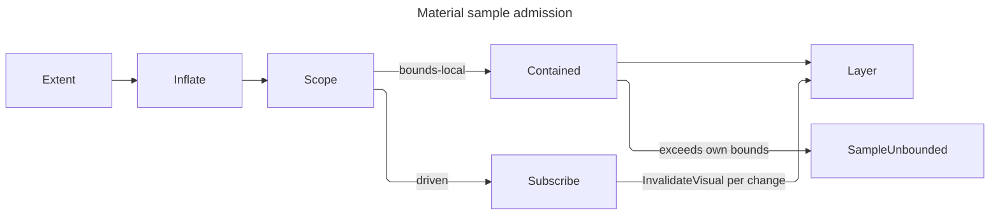

# [APPUI_VFX_MATERIAL]

Rasm.AppUi materials are the effects plane's surface-treatment owner: one layer capsule brackets a draw with a ground the compositor already painted, one filter-row family carries every per-draw filter term the frozen paint catalogue structurally cannot hold, and one sample contract fixes when a backdrop-reading operation is allowed to trust its own last sample. The page EXECUTES what `Theme/tokens#TOKEN_CATALOG` declares — `MaterialTier` rows resolved into `MaterialValue`, the `Glazing` translucency election, the module `WashRow` family, the `PaintRole` ladder every pigment reads — so the token catalogue stays the data owner and this plane stays the executor; a material constant authored here would be a second token source.

`DrawSource`, `PaintCatalog`, `PaintSpec`, `DrawRole`, `EffectTokens`, `FxRow`, `FxEffect`, `LayerGround`, `GlyphCoverage`, and `LayerSpec` arrive settled from `Render/capture#DRAW_CAPSULE`, which owns the one `SKSurface` and the one `SaveLayer(in SKCanvasSaveLayerRec)` site in the package; this page mints the `LayerSpec` values that site consumes and never opens a layer itself. Procedural sources — the film field, the glass displacement, the gradient wash — resolve by `EffectRow` and `UniformFrame` against the `shader#EFFECT_PROGRAM` `EffectCatalog`. Translucency admission is the `Glazing` row `MaterialTier.Resolve` already folded, contrast lift is the `VariantProjection.FloorLift` the same generation carries, `WorkspaceRow` arrives from `Shell/navigation#WORKSPACE_ROWS`, and `LayerFault` carries each failure through a direct generated union case.

## [01]-[INDEX]

- [02]-[LAYER_ALGEBRA]: The fault floor, the ground-and-coverage election, and the per-tier composite role this page contributes to the one paint catalog.
- [03]-[SAMPLE_CONTRACT]: The bounds-local-or-driven invalidation law and the in-tree host that discharges it.
- [04]-[FILTER_ROWS]: Lighting, refraction, tint, crossfade, luma, curve, and contrast rows as per-draw natives.
- [05]-[MATERIAL_EXECUTION]: Tier execution, the opaque floor, the module wash, grain, and the treatment receipt.

## [02]-[LAYER_ALGEBRA]

- Owner: `LayerFault` — the direct generated `[Union]` with one `[FaultCase]` leaf per material failure; `TreatmentSurfaces` — the per-tier composite `DrawRole` and the `PaintSpec` rows this page contributes to the one catalog resolve.
- Cases: `LayerFault` = LayerRefused | SampleUnbounded | TintUndeclared | FilterRejected | SourceMissing | WashUnmapped | ContrastUnsupported | LeaseUnavailable.
- Law: the ground arm is a CHOICE the `Render/capture#DRAW_CAPSULE` `LayerGround` union closes — `Filtered` puts the catalogue's frozen `SKImageFilter` in the `Backdrop` slot so the layer opens on filtered ground, `Previous` leaves `Backdrop` null and sets `InitializeWithPrevious` so the layer opens on an unfiltered copy — and this plane SELECTS an arm per material rather than opening a layer, because the one `SaveLayer` site in the package belongs to that capsule.
- Law: the composite role a layer restores through is a `DrawRole` DERIVED from the tier roster and backed by a `PaintSpec` in the same catalog every other role mints through, so the address the layer names and the paint the catalog holds cannot disagree.
- Entry: `TreatmentSurfaces.Roles[tier]` — the composite address; `TreatmentSurfaces.Paints` — the catalog contribution the app root folds into one `PaintCatalog.Of` per generation.
- Packages: SkiaSharp, Thinktecture.Runtime.Extensions, Rasm (kernel `FaultBand`/`[FaultCase]`/`Fault`), LanguageExt.Core
- Growth: a new ground treatment is one `FxRow.Ground` value at its capture-side owner; a new layer posture is one `LayerGround` case; a new tier grows its composite role and its paint row by derivation; a new fault case is one `[FaultCase]` leaf.
- Boundary: subpixel text over a material layer is the one coverage election this plane makes and the one it must not make blindly — `GlyphCoverage.Lcd` keeps LCD glyph coverage through the layer, and `LayerSpec.Of` already REFUSES it over a `Filtered` ground because a blurred backdrop is never opaque. The residual that admission names is a translucent composite over an unfiltered COPY, and this plane is the mount that closes it: the coverage a mount requests narrows to `Grayscale` under a translucent `Glazing`, so a sheet that hosts glyphs cannot fringe them against content the layer never composited. The glyph side of that same law is the `Theme/typography` layer posture, which drops LCD coverage to grayscale edging for a layer-hosted run: the two ends state one fact — subpixel coverage is invalid against pixels the layer never composited — and a surface that elected LCD while shaping under a non-layer posture would fringe exactly the runs the posture protected. The `Previous` arm is the honest floor on an embedded host: it copies what the compositor already painted and applies this plane's own tint, where `AcrylicBackgroundSource.Digger` would erase those pixels and dig through to nothing. Layer bounds are the material's OWN extent and never the surface — a layer bounded to the surface pays a full-surface offscreen for a panel-sized treatment — and the bound is what `[03]-[SAMPLE_CONTRACT]` clamps against, so the two are one value read twice and never two authored rects.

```csharp signature
// --- [ERRORS] ---------------------------------------------------------------------------

[Union(ConversionFromValue = ConversionOperatorsGeneration.None)]
public abstract partial record LayerFault : Fault {
    private static readonly FaultBand FamilyBand = FaultBand.Material;
    private LayerFault(string detail) { Detail = detail; }
    public string Detail { get; }
    public override string Message => Detail;

    [FaultCase(0)]
    public sealed partial record LayerRefused(string Detail)
        : LayerFault($"material/layer: {Detail}");
    [FaultCase(1)]
    public sealed partial record SampleUnbounded(SKRect Region, SKRect Own)
        : LayerFault($"material/sample: {Region} exceeds {Own} with no change source driving invalidation");
    [FaultCase(2)]
    public sealed partial record TintUndeclared(TokenKey Pigment, Error Cause)
        : LayerFault($"material/tint: {Pigment}: {Cause.Message}"), ICausedFault;
    [FaultCase(3)]
    public sealed partial record FilterRejected(string Slot, string Demand)
        : LayerFault($"material/filter: a {Slot} row is not {Demand}");
    [FaultCase(4)]
    public sealed partial record SourceMissing(EffectRow Row, Error Cause)
        : LayerFault($"material/source: {Row.Key}: {Cause.Message}"), ICausedFault;
    [FaultCase(5)]
    public sealed partial record WashUnmapped(string Workspace)
        : LayerFault($"material/wash: workspace {Workspace} declares no wash row");
    [FaultCase(6)]
    public sealed partial record ContrastUnsupported(ContrastMode Mode, SignedUnit Amount)
        : LayerFault($"material/contrast: {Mode.Key} at {Amount.Value}");
    [FaultCase(7)]
    public sealed partial record LeaseUnavailable(MaterialTier Tier)
        : LayerFault($"material/lease: {Tier.Key} drew on a backend publishing no Skia lease");
}
```

```csharp signature
// --- [COMPOSITION] ----------------------------------------------------------------------

// The page's catalog rows and their role addresses in ONE place, DERIVED from the tier roster so the two cannot
// agree by coincidence: `LayerSpec.Composite` narrowed to `DrawRole`, and the composed `$"material-{key}"` string
// the prior spelling put there addressed no paint at all (`RULINGS.md:105`). The app root concatenates this seq
// with every other owner's into one `PaintCatalog.Of` call per generation.
public static class TreatmentSurfaces {
    public static readonly HashMap<MaterialTier, DrawRole> Roles =
        toHashMap(toSeq(MaterialTier.Items).Map(static tier => (tier, DrawRole.Create($"material-{tier.Key}"))));

    // RESIDUAL: `PaintSpec` carries no alpha column, so the composite paint takes the tier's own pigment at the
    // token's alpha and `MaterialValue.MaterialOpacity` reaches the surface through the tint fill alone.
    public static readonly Seq<PaintSpec> Paints =
        toSeq(MaterialTier.Items).Map(static tier =>
            new PaintSpec(Roles[tier], tier.Tint.At(0), 0f, SKPaintStyle.Fill, Seq<FxRow>()));
}
```

## [03]-[SAMPLE_CONTRACT]

- Owner: `SampleScope` `[Union]` the two-case admission axis, the driven case carrying the change source it owes; `TreatmentHost` the in-tree control discharging it; `TreatmentOperation` the custom draw operation; `TreatmentEvidence` the host-edge seal seat.
- Cases: `SampleScope` = BoundsLocal | Driven.
- Law: a backdrop-sampling operation re-samples ONLY when the invalidated region intersects its own visual's bounds. The compositor never widens a dirty region to cover a visual that merely SAMPLES it, so a material whose sample region exceeds its own bounds — blur bleed past the edge, a whole-surface wash, a global tint — holds a stale sample across every change outside those bounds. The two admitted resolutions are total: hold the sample region inside the owner's own bounds, or CARRY the change source the region covers and issue `InvalidateVisual()` per change. There is no third resolution, and an over-reaching undriven material is `LayerFault.SampleUnbounded` at admission rather than a stale panel at run time.
- Entry: `public Fin<SKRect> Admit(SKRect own, LayerGround ground)` — the admission every material extent passes, folding the ground's own bleed in before it tests; `public static SKRect Inflate(SKRect bounds, LayerGround ground)` — the same bleed the render-bound projection at `compose#CUSTOM_VISUAL_TICK` reads.
- Auto: the driven case's subscription RE-SEATS at control attach and releases at detach through one `SerialDisposable`, so a detached-and-reattached host resumes rather than living on permanently dead; a bounds-local material seats nothing at all, because its own dirty rect already covers everything it reads.
- Receipt: `TreatmentReceipt.Scope` carries the case, so the proof lane reads which resolution each mounted material took rather than inferring it from geometry.
- Packages: Avalonia, Avalonia.Skia, System.Reactive, Generator.Equals, Rasm (kernel `FaultCell` through `Diagnostics/devloop` `HostSink`), LanguageExt.Core
- Growth: a new material surface picks one `SampleScope` case and the driven case demands its change source at construction; zero new surface.
- Boundary: the change source is the stream of the region the material SAMPLES, never the material's own property stream — an own-property change already dirties own bounds and re-runs the operation, which is exactly the case the contract does not cover. The carrier is `IObservable` because `InvalidateVisual` is a UI-thread push the Avalonia host already publishes that way and a channel here would need a pump nothing drains. `InvalidateVisual` is issued per change and never per frame: a per-frame invalidation defeats the compositor's dirty-rect economy for every surface in the tree, which is the cost this contract exists to bound. A blur ground bleeds by its own sigma, so a `Filtered` material's requested region is its bounds inflated by that sigma and the clamp is what forces the inflation onto the driven case rather than letting it silently sample stale ground. Both vehicles' host signatures return `void`, so each collapses its typed refusal through the ONE `Diagnostics/devloop#HOST_COLLAPSE` `HostSink` and parks it on the composition-minted kernel `FaultCell`; the prior `ignore(...)` meant a backend with no Skia lease rendered nothing and reported nothing.

```csharp signature
// --- [TYPES] ----------------------------------------------------------------------------

// The two total resolutions of the sampling law as CASES, because they differ in what they CARRY and not in a flag:
// the local case clamps and needs nothing, while the driven case owes a live subscription over the region it
// samples. A bool column left a driven spec with no change source spellable and let a bounds-local host accept a
// stream and silently drop it.
[Union(ConversionFromValue = ConversionOperatorsGeneration.None)]
public abstract partial record SampleScope {
    private SampleScope() { }
    public sealed record BoundsLocal() : SampleScope;
    public sealed record Driven(IObservable<Unit> Changes) : SampleScope;

    // `Inflate` is the ground's own bleed — a clamp against un-inflated bounds passes a material that then samples
    // sigma pixels of ground it never invalidates. It is scope-independent, so the render-bound projection reads it
    // without electing a case first.
    public static SKRect Inflate(SKRect bounds, LayerGround ground) => ground.Switch(
        state: bounds,
        filtered: static (rect, row) => SKRect.Inflate(rect, row.Row.Sigma, row.Row.Sigma),
        previous: static (rect, _) => rect);

    // The one admission, TOTAL over the two cases. A driven material passes its inflated region through because the
    // subscription is what keeps a sample outside own bounds fresh; a bounds-local material admits only where the
    // inflation changed nothing, which makes the pairing law STRUCTURAL rather than advisory — a filtered ground
    // bleeds by its own sigma and therefore cannot be bounds-local, because clamping that bleed away deletes
    // exactly the ground the arm was chosen for.
    public Fin<SKRect> Admit(SKRect own, LayerGround ground) => Switch(
        state: (Own: own, Region: Inflate(own, ground)),
        boundsLocal: static (s, _) => s.Own.Contains(s.Region)
            ? Fin.Succ(s.Region)
            : Fin.Fail<SKRect>(new LayerFault.SampleUnbounded(s.Region, s.Own)),
        driven: static (s, _) => Fin.Succ(s.Region));
}
```

```csharp signature
// --- [SERVICES] -------------------------------------------------------------------------

// The four columns a host-edge seal takes, seated by composition exactly as `Diagnostics/devloop` seats them on
// `InspectorEdits`: the sink advances the envelope HLC, and the cell is where a void host signature parks a refusal.
public sealed record TreatmentEvidence(
    ReceiptSinkPort Sink,
    CorrelationId Correlation,
    TenantContext Tenant,
    HostSink Faults);

// The in-tree vehicle. `Render` folds the lease to `DrawSource.Borrowed` exactly as every other in-tree draw on
// this estate does, so the material composites into the host's in-flight frame and mints no surface. The catalog
// arrives as the per-generation VALUE every other consumer takes rather than as a zero-argument factory.
public sealed class TreatmentHost : Control {
    readonly SerialDisposable seat = new();
    readonly SurfaceTreatment treatment;
    readonly PaintCatalog paints;
    readonly TreatmentEvidence evidence;

    public TreatmentHost(SurfaceTreatment treatment, PaintCatalog paints, TreatmentEvidence evidence) =>
        (this.treatment, this.paints, this.evidence) = (treatment, paints, evidence);

    // Attach RE-SEATS and detach releases (`RULINGS.md:132`): a seat taken once in the constructor left every
    // reattached material subscribed to nothing and permanently stale.
    protected override void OnAttachedToVisualTree(VisualTreeAttachmentEventArgs e) {
        base.OnAttachedToVisualTree(e);
        seat.Disposable = treatment.Scope.Switch(
            state: this,
            boundsLocal: static (_, _) => Disposable.Empty,
            driven: static (host, row) => row.Changes.Subscribe(_ => host.InvalidateVisual()));
    }

    protected override void OnDetachedFromVisualTree(VisualTreeAttachmentEventArgs e) {
        seat.Disposable = null;
        base.OnDetachedFromVisualTree(e);
    }

    // An in-tree host is chosen exactly where the treatment does NOT advance per frame, so it draws the run's
    // settled state; the animating vehicle is the `compose#CUSTOM_VISUAL_TICK` handler.
    public override void Render(DrawingContext context) =>
        context.Custom(new TreatmentOperation(
            treatment, paints, new Rect(Bounds.Size), SurfaceTreatment.Settled, evidence));
}

// Bounds are GLOBAL-coordinate per the custom-draw contract and `HitTest` answers from its own geometry without
// recursing. The explicit member algebra is what makes the retained-scene-node reuse REAL: the record's own
// equality reference-compares `Seq<FilterRow>` and would fold the catalog and the evidence seat in besides, and
// while a delegate column sat on the spec it could never hold at all — so every frame rebuilt a node the
// compositor had been told was unchanged.
[Equatable(Explicit = true)]
public sealed partial record TreatmentOperation(
    [property: DefaultEquality] SurfaceTreatment Treatment,
    PaintCatalog Paints,
    [property: DefaultEquality] Rect Bounds,
    [property: DefaultEquality] UnitInterval Phase,
    TreatmentEvidence Evidence) : ICustomDrawOperation {

    public bool Equals(ICustomDrawOperation? other) => Equals(other as TreatmentOperation);

    public bool HitTest(Point point) => Bounds.Contains(point);

    // The host signature carries no rail, so the draw's outcome collapses through the one `HostSink`: a completed
    // draw seals its receipt onto the evidence stream and a refusal parks on the fault cell, where the prior
    // `ignore` discarded both.
    public void Render(ImmediateDrawingContext context) =>
        ignore(Evidence.Faults.Collapse(
            IO.lift(() => context.TryGetFeature<ISkiaSharpApiLeaseFeature>() is { } feature
                    ? Draw(feature)
                    : Fin.Fail<TreatmentReceipt>(new LayerFault.LeaseUnavailable(Treatment.Tier)))
                .Bind(drawn => drawn.Match(
                    Succ: receipt => EvidenceMap.ToEvidence(receipt)
                        .Seal(Evidence.Sink, Evidence.Correlation, Evidence.Tenant)
                        .Map(static _ => unit),
                    Fail: IO.fail<Unit>))));

    Fin<TreatmentReceipt> Draw(ISkiaSharpApiLeaseFeature feature) {
        using ISkiaSharpApiLease lease = feature.Lease();
        return Treatment.Draw(new DrawSource.Borrowed(lease), Paints, Bounds.ToSKRect(), Phase);
    }

    // The lease is the only handle this operation holds and `Draw` scopes it; the interface demands the member.
    public void Dispose() { }
}
```



## [04]-[FILTER_ROWS]

- Owner: `FilterRow` `[Union]` the per-draw filter algebra; `LightFace` and `CurveKind` `[SmartEnum<string>]` two generated sub-axes; `ContrastMode` the shipped high-contrast posture row; `ToneTable` the materialized transfer.
- Cases: `FilterRow` = Lighting | Refraction | Tint | Crossfade | Luma | Curve | Contrast; `LightFace` = rim | inset; `CurveKind` = gamma | lift | gain | contrast; `ContrastMode` = colour | grayscale | inverted.
- Law: a row lands here only when its parameters VARY per draw or per frame — a crossfade phase, a light direction tracking a pointer, a refraction scale on a resize, a curve amount on a preference flip. A row whose parameters are fixed for a whole theme generation belongs to the frozen `FxRow` catalogue at its capture-side owner, where it mints once and every draw reads it; minting a fixed row here would rebuild a native per frame for a value that never moved.
- Law: phase is an ARGUMENT and never spec state. The crossfade is the only term on the plane that moves per frame, so `Build` takes the tick's own normalized run value and no row carries a stored weight — which retires a seven-arm advance whose six identity arms copied a record per row per frame.
- Entry: `public Fin<FxEffect> Build(EffectTokens tokens, EffectCatalog effects, UnitInterval phase)` — the one native mint, taking the compiled program roster `shader#EFFECT_PROGRAM` owns; `public Fin<SKImageFilter> Ground(EffectTokens tokens, EffectCatalog effects, UnitInterval phase)` — the same rows projected into a save-layer backdrop, lifting every colour row through `SKImageFilter.CreateColorFilter`.
- Auto: `Tint` and `Crossfade` generate their matrices from the resolved pigment rather than carrying authored coefficients; `Curve` materializes its 256-entry table at the ROW's own mint, so a per-spec allocation never lands on the per-frame rail; `Contrast` reads the `VariantProjection.FloorLift` amount its admission derived, so the high-contrast projection reaches the effects plane through the same generation every token rung took.
- Packages: SkiaSharp, Rasm (project — `PerceptualColor`, `UnitInterval`, `SignedUnit`, `PositiveMagnitude`, `Custody`), Thinktecture.Runtime.Extensions, Generator.Equals, LanguageExt.Core
- Growth: a new filter term is one `FilterRow` case with its `Build` arm; a new tone shape is one `CurveKind` row; a new lighting face is one `LightFace` row; a new high-contrast posture is one `ContrastMode` row; zero new surface.
- Boundary: the lit filters derive their height field from the input's ALPHA, so a rim highlight and an inset highlight differ in the light direction ALONE — the inset row negates the incident vector and nothing else, and a second filter family for insets would carry one sign as a whole owner. Refraction is the glass floor and its displacement source is a `shader#EFFECT_PROGRAM` ROW carrying its own uniform frame, never an inline shader and never a composed key: displacement takes ONE channel per axis and offsets by that channel's distance from mid-grey, so the source must publish two decorrelated channels over the same seeded field the grain draw samples — an achromatic source hands both axes one value and shears every pixel along one diagonal — and the frame rides the row because a row alone cannot state the field's own separation. Every row's native is minted PER DRAW and `SKPaint.Dispose` releases none of the four slots it binds, so a fold that refuses mid-stack releases the prefix it already minted through the kernel custody owner rather than through a hand rollback lambda. Skia natives are reference-counted and the catalogue carries that custody: a composed filter holds its OWN reference to every arm, so the handles a composition consumed release on both paths. The crossfade is the one arm that cannot release unconditionally — `SKColorFilter.CreateLerp` short-circuits at the CLOSED endpoints `UnitInterval` admits and hands back an input as the result, so that arm releases only what the result does not alias. `Tint` is a lerp toward the pigment expressed as one 4x5 matrix whose fifth column carries the additive term in normalized units, so an 8-bit byte constant in that column is the deleted form; `Crossfade` is `SKColorFilter.CreateLerp` over two built rows, which is why the phase cannot be frozen and why the module wash reaches its crossfade here rather than through a second animation path. The 256-entry curve tables are GENERATED from their kind's transfer — an authored table is unverifiable against the shape it claims — and its buffers stay private to `ToneTable` because the native takes `byte[]` and a shared writable array a consumer can reach is a table the next draw reads differently. `Contrast` binds the shipped high-contrast config and keeps its `IsValid` read: the amount is a `SignedUnit` this plane owns, but `SKHighContrastConfigInvertStyle`'s valid range belongs to SkiaSharp, so the native's own gate stays the admission and `ContrastUnsupported` stays raised.

```csharp signature
// --- [TYPES] ----------------------------------------------------------------------------

// Rim and inset differ by the incident vector alone: both filters read the input's ALPHA as a height field, so
// flipping the light to come from below inverts the bevel. A second owner for insets would carry one sign.
[SmartEnum<string>]
[KeyMemberEqualityComparer<ComparerAccessors.StringOrdinal, string>]
public sealed partial class LightFace {
    public static readonly LightFace Rim = new("rim", flip: 1f);
    public static readonly LightFace Inset = new("inset", flip: -1f);

    public float Flip { get; }

    public SKPoint3 Incident(SKPoint3 direction) =>
        new(direction.X, direction.Y * Flip, direction.Z * Flip);
}

// Tone shapes as transfers, so the 256-entry table is a GENERATION and never an authored roster. Amount is the
// row's single knob and every transfer is total on the unit interval, so a table entry cannot leave range.
[SmartEnum<string>]
[KeyMemberEqualityComparer<ComparerAccessors.StringOrdinal, string>]
public sealed partial class CurveKind {
    public static readonly CurveKind Gamma = new("gamma", static (v, a) => Math.Pow(v, 1d + a));
    public static readonly CurveKind Lift = new("lift", static (v, a) => a + ((1d - a) * v));
    public static readonly CurveKind Gain = new("gain", static (v, a) => v * (1d + a));
    public static readonly CurveKind Contrast = new("contrast", static (v, a) => 0.5d + ((v - 0.5d) * (1d + a)));

    public Func<double, double, double> Transfer { get; }
}

// The materialized transfer. The table is a pure function of (kind, amount), so it materializes at the ROW's mint
// and never inside `Build`, which allocated a fresh 256-byte array on every draw of every curve row. Identity and
// the channel buffer stay PRIVATE: `SKColorFilter.CreateTable` demands `byte[]`, and a writable array a consumer
// can reach is a lookup the next draw reads differently.
[Equatable(Explicit = true)]
public sealed partial class ToneTable {
    // Alpha passes through every tone curve untouched: a curve that lifted alpha would dissolve the material's own
    // coverage while claiming to move its tone. One identity buffer serves every row.
    static readonly byte[] Identity = [.. Enumerable.Range(0, 256).Select(static step => (byte)step)];

    readonly byte[] channel;

    ToneTable(CurveKind kind, UnitInterval amount, byte[] channel) =>
        (Kind, Amount, this.channel) = (kind, amount, channel);

    [DefaultEquality] public CurveKind Kind { get; }
    [DefaultEquality] public UnitInterval Amount { get; }

    public static ToneTable Of(CurveKind kind, UnitInterval amount) =>
        new(kind, amount, [.. Enumerable.Range(0, 256).Select(step =>
            (byte)Math.Clamp(Math.Round(kind.Transfer(step / 255d, amount.Value) * 255d), 0d, 255d))]);

    public SKColorFilter Native() => SKColorFilter.CreateTable(a: Identity, r: channel, g: channel, b: channel);
}

// The shipped high-contrast config takes a grayscale flag beside an invert style, and the estate uses three of the
// six combinations — so the pair is ONE row carrying both columns and the union case spells no bool at all.
[SmartEnum<string>]
[KeyMemberEqualityComparer<ComparerAccessors.StringOrdinal, string>]
public sealed partial class ContrastMode {
    public static readonly ContrastMode Colour =
        new("colour", grayscale: false, invert: SKHighContrastConfigInvertStyle.NoInvert);
    public static readonly ContrastMode Grayscale =
        new("grayscale", grayscale: true, invert: SKHighContrastConfigInvertStyle.NoInvert);
    public static readonly ContrastMode Inverted =
        new("inverted", grayscale: false, invert: SKHighContrastConfigInvertStyle.InvertLightness);

    public bool Grayscale { get; }
    public SKHighContrastConfigInvertStyle Invert { get; }

    public SKHighContrastConfig Config(SignedUnit amount) => new(Grayscale, Invert, (float)amount.Value);
}
```

```csharp signature
// --- [MODELS] ---------------------------------------------------------------------------

// The per-draw filter algebra. Every case carries its parameters as ROW DATA and mints its native at Build, because
// each one's parameters move — a light direction per pointer sample, a refraction scale per resize, a curve amount
// per preference flip. A parameter that holds for a whole generation belongs to the frozen FxRow catalogue instead,
// where one mint serves every draw. Every scalar carries its own domain as a type: `Ks` is a fraction, surface
// scale and shininess are positive, and a contrast amount is signed on `[-1,1]` exactly as the native gates it.
[Union(ConversionFromValue = ConversionOperatorsGeneration.None)]
public abstract partial record FilterRow {
    private FilterRow() { }
    public sealed record Lighting(
        LightFace Face, SKPoint3 Direction, TokenKey Light,
        PositiveMagnitude SurfaceScale, UnitInterval Ks, PositiveMagnitude Shininess) : FilterRow;
    public sealed record Refraction(
        EffectRow Source, UniformFrame Frame, float Scale, SKColorChannel X, SKColorChannel Y) : FilterRow;
    public sealed record Tint(TokenKey Pigment, UnitInterval Strength) : FilterRow;
    public sealed record Crossfade(FilterRow From, FilterRow To) : FilterRow;
    public sealed record Luma() : FilterRow;
    public sealed record Curve(ToneTable Table) : FilterRow;
    public sealed record Contrast(ContrastMode Mode, SignedUnit Amount) : FilterRow;

    // The ONE native mint. Colour rows land in the paint's ColorFilter slot and geometry-reading rows in its
    // ImageFilter slot, so the product discriminates by slot exactly as the capture-side effect union does and a
    // caller never chooses where a row binds. Refraction takes a compiled ROW beside a frame, so a program the
    // roster never minted is unspellable rather than a key resolving to nothing at draw time.
    public Fin<FxEffect> Build(EffectTokens tokens, EffectCatalog effects, UnitInterval phase) => Switch(
        state: (Tokens: tokens, Effects: effects, Phase: phase),
        lighting: static (s, row) =>
            from light in Pigment(s.Tokens, row.Light)
            select (FxEffect)new FxEffect.Imaging(SKImageFilter.CreateDistantLitSpecular(
                // The lit filters take an 8-bit SKColor and publish no float twin, so the light quantizes at this
                // boundary by the API's own shape — the explicit cast states that where an implicit conversion
                // would hide a working-space value silently losing its gamut.
                direction: row.Face.Incident(row.Direction),
                lightColor: (SKColor)light,
                surfaceScale: (float)row.SurfaceScale.Value,
                ks: (float)row.Ks.Value,
                shininess: (float)row.Shininess.Value)),
        refraction: static (s, row) =>
            from shader in s.Effects.Source(row.Source, row.Frame)
                .MapFail(error => (Error)new LayerFault.SourceMissing(row.Source, error))
            select (FxEffect)new FxEffect.Imaging(SKImageFilter.CreateDisplacementMapEffect(
                xChannelSelector: row.X,
                yChannelSelector: row.Y,
                scale: row.Scale,
                displacement: SKImageFilter.CreateShader(shader))),
        tint: static (s, row) =>
            from pigment in Pigment(s.Tokens, row.Pigment)
            select (FxEffect)new FxEffect.Coloring(SKColorFilter.CreateColorMatrix(Lerp(pigment, row.Strength))),
        // A refused second arm releases the first; the built lerp is bracketed because it holds its own reference
        // to whichever arms it composed — one custody law, two kernel members.
        crossfade: static (s, row) =>
            from origin in row.From.Colour(s.Tokens, s.Effects, s.Phase)
            from target in row.To.Colour(s.Tokens, s.Effects, s.Phase).Rollback(origin)
            from lerped in Crossfade(s.Phase, origin, target)
            select lerped,
        luma: static (_, _) => Fin.Succ<FxEffect>(new FxEffect.Coloring(SKColorFilter.CreateLumaColor())),
        curve: static (_, row) => Fin.Succ<FxEffect>(new FxEffect.Coloring(row.Table.Native())),
        contrast: static (_, row) => row.Mode.Config(row.Amount) switch {
            { IsValid: true } config =>
                Fin.Succ<FxEffect>(new FxEffect.Coloring(SKColorFilter.CreateHighContrast(config))),
            _ => Fin.Fail<FxEffect>(new LayerFault.ContrastUnsupported(row.Mode, row.Amount)),
        });

    // `CreateLerp` short-circuits at the CLOSED endpoints `Band.Unit` admits — weight 0 hands back `filter0` and
    // weight 1 hands back `filter1` — and SkiaSharp's handle map returns that as the SAME managed instance, so a
    // phase of exactly 0 or 1 makes the result one of the arms. Releasing both would dispose the native the
    // success arm just transferred, so the aliased arm holds no release slot and `Bracket` skips its null.
    static Fin<FxEffect> Crossfade(UnitInterval phase, SKColorFilter origin, SKColorFilter target) {
        SKColorFilter lerped = SKColorFilter.CreateLerp((float)phase.Value, origin, target);
        return Custody.Bracket(
            () => Fin.Succ<FxEffect>(new FxEffect.Coloring(lerped)),
            ReferenceEquals(lerped, origin) ? null : origin,
            ReferenceEquals(lerped, target) ? null : target);
    }

    // Save-layer backdrops take an image filter alone, so a colour row lifts through CreateColorFilter rather than
    // forcing every ground to be authored twice. The lift is free at the node level — Skia composes it into the
    // same DAG the blur ground already builds — and the refusing arms hold a live native no other owner reaches.
    // The lift RETAINS rather than consumes, so the colour row's own handle releases on the drawn path too and
    // only the imaging arm hands its native straight through; a bare lift would strand one reference per ground.
    public Fin<SKImageFilter> Ground(EffectTokens tokens, EffectCatalog effects, UnitInterval phase) =>
        Build(tokens, effects, phase).Bind(static effect => effect.Switch(
                shading: static _ => Fin.Fail<SKImageFilter>(new LayerFault.FilterRejected("shader", "a layer ground")),
                imaging: static row => Fin.Succ(row.Native),
                coloring: static row => Custody.Bracket(
                    () => Fin.Succ(SKImageFilter.CreateColorFilter(row.Native)), row.Native),
                pathing: static _ => Fin.Fail<SKImageFilter>(new LayerFault.FilterRejected("path", "a layer ground")))
            .Rollback(() => Fin.Succ(effect.Release())));

    // The crossfade arms must both be COLOUR rows: SKColorFilter.CreateLerp interpolates two colour filters and has
    // no image-filter twin, so a geometry row reaching a crossfade refuses through the union's own total Switch
    // rather than through a hand type test, and the refused arm's native releases where the colour arm TRANSFERS.
    Fin<SKColorFilter> Colour(EffectTokens tokens, EffectCatalog effects, UnitInterval phase) =>
        Build(tokens, effects, phase).Bind(static effect => effect.Switch(
                shading: static _ => Fin.Fail<SKColorFilter>(new LayerFault.FilterRejected("shader", "a colour row")),
                imaging: static _ => Fin.Fail<SKColorFilter>(new LayerFault.FilterRejected("image", "a colour row")),
                pathing: static _ => Fin.Fail<SKColorFilter>(new LayerFault.FilterRejected("path", "a colour row")),
                coloring: static row => Fin.Succ(row.Native))
            .Rollback(() => Fin.Succ(effect.Release())));

    // The pigment read routes through the capture-side token edge and re-bands its refusal: `EffectTokens.Pigment`
    // already owns the frozen-bucket lookup and the policy widening that lifts an 8-bit display value into the
    // generation's one working space, so a second lookup here would be a second token edge disagreeing with it. The
    // address is the generated `TokenKey` off the role ladder (`RULINGS.md:105`), so a rung the generation never
    // emitted is a typed refusal on this plane's own band instead of a miss discovered at draw time.
    static Fin<SKColorF> Pigment(EffectTokens tokens, TokenKey pigment) =>
        tokens.Pigment(pigment).MapFail(error => (Error)new LayerFault.TintUndeclared(pigment, error));

    // A 4x5 row-major matrix lerping every channel toward the pigment. The fifth column is the ADDITIVE term in
    // normalized units, which is why the pigment enters as SKColorF and never as a byte constant.
    static float[] Lerp(SKColorF pigment, UnitInterval strength) {
        float s = (float)strength.Value;
        return [
            1f - s, 0f,     0f,     0f, s * pigment.Red,
            0f,     1f - s, 0f,     0f, s * pigment.Green,
            0f,     0f,     1f - s, 0f, s * pigment.Blue,
            0f,     0f,     0f,     1f, 0f,
        ];
    }
}
```

## [05]-[MATERIAL_EXECUTION]

- Owner: `SurfaceTreatment` the executable material; `GrainLay` `[Union]` the resolved grain posture; `WashPlane` the module ambient-wash executor; `TreatmentReceipt` the evidence row.
- Cases: `GrainLay` = Bare | Weighted.
- Law: `Theme/tokens` decides and this plane executes — a `MaterialTier` resolves to a `MaterialValue` at theme resolve and reaches here as a value, and a `WashRow` reaches here as a value; an opacity, a grain weight, a hue, or a coverage authored on this page would be a second token source the swap capsule never re-seeds.
- Law: the translucency verdict is derived ONCE, at admission, as the `Glazing` row the token generation already speaks, and every consumer reads that column — the ground arm, the coverage narrowing, and the receipt's own outcome. Three separate `MaterialOpacity >= 1` comparisons scattered across the admission, the ground rule, and the fill could disagree with each other and with the generation.
- Entry: `public static Fin<SurfaceTreatment> Of(MaterialTier tier, ResolvedTheme theme, LayerGround ground, GlyphCoverage coverage, SampleScope scope, Seq<FilterRow> stack, Option<WashPlane> wash, EffectCatalog effects)` — the admission; `public Fin<TreatmentReceipt> Draw(DrawSource source, PaintCatalog paints, SKRect extent, UnitInterval phase)` — the capsule: plan the layer, lay the wash, fill the tint, lay the grain, release every per-draw native, and let the one layer site restore; `public static Validation<Error, WashPlane> Of(WorkspaceRow from, WorkspaceRow to, UnitInterval aim)` — the wash admission.
- Auto: the opaque floor arrives already resolved — `MaterialTier.Resolve` collapses tint opacity, material opacity, and grain to their opaque values when the `Glazing` election refuses translucency — so this plane reads `MaterialValue` and never re-derives the preference; the high-contrast projection appends its `FilterRow.Contrast` row through the same admission with its amount DERIVED from the lifted floor's own ratio, so a variant flip re-stacks every mounted material without a second code path and without a literal that can disagree with the floor; the grain resolves to a case at admission, so the draw body tests no float and rounds no byte.
- Receipt: `TreatmentReceipt` — tier, glazing verdict, ground arm, sample case, filter count — projected through the `Diagnostics/evidence#RECEIPT_UNION` `EvidenceMap` seam onto the `Effect` case under plane `material` and sealed by whichever vehicle drew it, so the proof lane reads which materials actually rendered translucent on each host rather than which ones asked to.
- Packages: SkiaSharp, Avalonia.Skia, Rasm (project — `UnitInterval`, `SignedUnit`, `Custody`), Generator.Equals, Thinktecture.Runtime.Extensions, LanguageExt.Core
- Growth: a new material surface is one `SurfaceTreatment` value over an existing tier; a new TIER costs this plane one derived composite role and one derived paint row, because the ground a material composites on is the mount's own declaration rather than a per-tier arm; a new module wash is one `WashRow` at its token owner; zero new surface.
- Boundary: which translucent ground a surface asks for is the MOUNT's fact and never the tier's (`RULINGS.md:127`) — a sheet over a live viewport and a sheet on an embedded host beneath which no pixels exist take different arms under one tier, and the opaque floor is the single ground rule this plane owns because an opaque material overpaints every pixel a filtered ground would read. Every native this capsule mints lives for ONE draw: a filter row rebuilds its filter per frame, the grain source is a fresh `SKShader` off the retained builder, and `SKPaint.Dispose` releases none of them (`RULINGS.md:125`), so the capsule releases what it built on the drawn and the refused path alike — through one body, because `FxEffect.Release` is the union's own ordered teardown rather than an `IDisposable` a `Custody.Bracket` span could carry. Every paint is minted, configured, used, and dropped inside one bracket, so no fill retains a paint the next frame reads differently. The grain is a DRAW, not a token knob — `MaterialValue.Grain` is a declared weight and the noise it weights is the compiled `grain` program at `shader#EFFECT_PROGRAM`, because the shipped acrylic material composes a fixed noise bitmap under a fixed alpha and neither is addressable, so a material that wanted its grain to follow density or variant had no seam at all. The module wash crossfades two `EffectRow.Wash` sources through ONE arithmetic blender rather than drawing both and hoping alpha compounds: two alpha-over draws at coverage `c` composite to `1-(1-c)²` and brighten the mid-transition frame, which is precisely the luminance the `WashRow.LuminanceCeiling` gate exists to hold. The wash resolves its rows from `WorkspaceRow` values and never from caller text (`RULINGS.md:115`), and the join between the wash roster's module column and the workspace roster's key lives at ONE site — `present` is the workspace that declares no wash today, so the refusal is live rather than defensive. `TreatmentOperation` is the only in-tree vehicle, so a control that wants a material mounts one rather than overriding its own render, and the capsule brackets the treatment alone: an earlier content fold no consumer ever supplied is gone, so a host's own content composites over the treatment through the scene graph rather than inside its layer.

```csharp signature
// --- [MODELS] ---------------------------------------------------------------------------

// The grain as a CASE resolved at admission from the tier's declared weight: the draw body no longer tests a float
// against zero, and the 8-bit paint alpha is a column the mint quantized rather than a rounding inside a per-frame
// body. The opaque floor already zeroes the weight at the token owner, so `Bare` is the resolved fact.
[Union(ConversionFromValue = ConversionOperatorsGeneration.None)]
public abstract partial record GrainLay {
    private GrainLay() { }
    public sealed record Bare() : GrainLay;
    public sealed record Weighted(UnitInterval Weight, byte Alpha) : GrainLay;

    public static GrainLay Of(UnitInterval weight) =>
        weight.Value <= 0d
            ? new Bare()
            : new Weighted(weight, (byte)Math.Round(weight.Value * byte.MaxValue));
}

// The executable material: the tier that produced it, the resolved value the token generation handed over, the
// translucency verdict, the ground arm, the elected glyph coverage, the sample case, the per-draw filter stack, the
// resolved grain, the module wash it lays, and the compiled program roster its procedural sources resolve against.
// The catalog is a VALUE the composition binds; the delegate column it replaces erased the roster's own refusals
// and made every operation's structural equality permanently false.
[Equatable]
public sealed partial record SurfaceTreatment(
    MaterialTier Tier,
    MaterialValue Value,
    Glazing Glaze,
    LayerGround Ground,
    GlyphCoverage Coverage,
    SampleScope Scope,
    [property: OrderedEquality] Seq<FilterRow> Stack,
    GrainLay Grain,
    Option<WashPlane> Wash,
    [property: ReferenceEquality] EffectCatalog Effects) {

    static readonly UnitInterval Full = UnitInterval.Create(1d);
    static readonly Op ReleaseOp = Op.Of(name: "appui.material.release");

    // A non-animating vehicle draws the run's TERMINAL state: the in-tree host is chosen exactly where the
    // treatment does not advance per frame, so a crossfade mounted there shows its destination rather than
    // freezing at its origin.
    public static readonly UnitInterval Settled = Full;

    // Admission is where the variant projection reaches the effects plane: the high-contrast row appends to the
    // stack exactly once, so a contrast flip re-stacks every mounted material through the generation rather than
    // through a per-surface conditional. A driven scope with no inflation to justify it still admits —
    // over-invalidation is a cost, where under-invalidation is a stale frame. The resolved bucket is addressed by
    // the tier's own `MaterialKey`, because the frozen map is keyed by `TokenKey` and the smart-enum string key is
    // a different vocabulary that would not type against it.
    public static Fin<SurfaceTreatment> Of(
        MaterialTier tier, ResolvedTheme theme, LayerGround ground, GlyphCoverage coverage, SampleScope scope,
        Seq<FilterRow> stack, Option<WashPlane> wash, EffectCatalog effects) =>
        from value in Resolved(theme, tier)
        let glaze = Glazed(value)
        select new SurfaceTreatment(
            Tier: tier,
            Value: value,
            Glaze: glaze,
            // The ONE ground rule this plane owns: an opaque material has nothing to filter, because the ground it
            // would blur is entirely overpainted, so the copy arm is both cheaper and the only honest spelling.
            Ground: glaze == Glazing.Opaque ? LayerGround.Copy : ground,
            // `LayerSpec.Of` refuses LCD over a filtered ground; the RESIDUAL that admission names — a translucent
            // composite over an unfiltered copy — closes here, because this is the mount that knows the opacity.
            Coverage: glaze == Glazing.Opaque ? coverage : GlyphCoverage.Grayscale,
            Scope: scope,
            Stack: theme.Variant.Projection.FloorLift.Match(
                Some: floor => stack.Add(Lifted(floor)),
                None: () => stack),
            Grain: GrainLay.Of(value.Grain),
            Wash: wash,
            Effects: effects);

    // The capsule. One layer plan, one bracketed treatment, one release — and the restore belongs to the layer site
    // at the capture-side owner, so no exit path here can strand a saved layer. The LAYER takes the admitted region
    // and the fills take the visible extent: the layer must cover the ground its filter reads, while the treatment
    // paints only what the material actually covers.
    public Fin<TreatmentReceipt> Draw(DrawSource source, PaintCatalog paints, SKRect extent, UnitInterval phase) =>
        from bounds in Scope.Admit(extent, Ground)
        from plan in LayerSpec.Of(bounds, Ground, Some(TreatmentSurfaces.Roles[Tier]), Coverage)
        from natives in Built(Stack, paints.Tokens, Effects, phase)
        from drawn in Released(natives,
            source.Layered(paints, plan, canvas => Compose(canvas, paints, extent, natives, phase)))
        select new TreatmentReceipt(Tier, Glaze, Ground, Scope, Stack.Count);

    // Wash first, then tint, then grain over both: the wash is the MODULE's ambient ground, the tint is the
    // material's own pigment, and the grain is a surface property that modulates what it sits on rather than
    // veiling it. The tint crosses through the policy's own byte admission — `SKPaint.Color` assumes sRGB and
    // quantizes before any conversion, so a component-wise divide by 255 here would fabricate a working-space
    // value — and every native binds onto ONE paint, which is the estate's paint law.
    Fin<Unit> Compose(SKCanvas canvas, PaintCatalog paints, SKRect extent, Seq<FxEffect> natives, UnitInterval phase) =>
        from washed in Wash.Match(
            Some: plane => plane.Lay(canvas, paints, Effects, extent, phase),
            None: () => Fin.Succ(unit))
        from pigment in paints.Tokens.Policy.Resolve(Value.Tint)
            .MapFail(error => (Error)new LayerFault.TintUndeclared(Tier.MaterialKey, error))
        from tinted in Filled(canvas, extent, paint => {
            natives.Iter(effect => ignore(effect.BindTo(paint)));
            paint.SetColor(pigment.WithAlpha((float)Value.TintOpacity.Value), paints.Tokens.Working);
        })
        from grained in Grain.Switch(
            state: (Canvas: canvas, Extent: extent, Treatment: this),
            bare: static (_, _) => Fin.Succ(unit),
            weighted: static (s, row) => s.Treatment.Film(s.Canvas, s.Extent, row))
        select grained;

    // Grain rides Overlay so it MODULATES the tint it sits on: an alpha-over noise at the same weight washes the
    // surface toward the noise's own mid grey and flattens every rung beneath it. The shader is a fresh native off
    // the retained builder every frame and releases with the fill that bound it, in ownership order.
    Fin<Unit> Film(SKCanvas canvas, SKRect extent, GrainLay.Weighted grain) =>
        Effects.Source(EffectRow.Grain, UniformFrame.Of(
                new SKSize(extent.Width, extent.Height),
                ("weight", new UniformValue.Scalar((float)grain.Weight.Value))))
            .MapFail(error => (Error)new LayerFault.SourceMissing(EffectRow.Grain, error))
            .Bind(shader => Custody.Bracket(() => Filled(canvas, extent, paint => {
                paint.Shader = shader;
                paint.BlendMode = SKBlendMode.Overlay;
                paint.Color = SKColors.White.WithAlpha(grain.Alpha);
            }), shader));

    // The ONE paint-scoped fill on the plane, shared with the wash: a paint is minted, configured, used, and
    // dropped inside one bracket, so no fill can retain a paint the next frame reads differently.
    internal static Fin<Unit> Filled(SKCanvas canvas, SKRect extent, Action<SKPaint> configure) {
        SKPaint paint = new() { IsAntialias = true };
        return Custody.Bracket(() => {
            configure(paint);
            canvas.DrawRect(extent, paint);
            return Fin.Succ(unit);
        }, paint);
    }

    // A short-circuiting traverse drops every native built before the offending row with no other owner holding
    // them, so the build FOLDS and its refusal releases its own prefix through the kernel custody owner.
    static Fin<Seq<FxEffect>> Built(
        Seq<FilterRow> stack, EffectTokens tokens, EffectCatalog effects, UnitInterval phase) =>
        stack.Fold(Fin.Succ(Seq<FxEffect>()), (state, row) => state.Bind(built =>
            row.Build(tokens, effects, phase)
                .Rollback(
                    held: built,
                    release: static effect => Fin.Succ(effect.Release()),
                    key: ReleaseOp)
                .Map(built.Add)));

    // The stack releases whichever way the fold ended, including a layer that refused before the body ever ran; a
    // paint releases nothing it was bound, so kernel custody drains the typed roster in reverse and aggregates
    // every release refusal with the primary result instead of dropping a tail failure.
    static Fin<T> Released<T>(Seq<FxEffect> natives, Fin<T> fold) =>
        fold.Settled(
            held: natives,
            release: static effect => Fin.Succ(effect.Release()),
            key: ReleaseOp);

    static Fin<MaterialValue> Resolved(ResolvedTheme theme, MaterialTier tier) =>
        (theme.Materials.TryGetValue(tier.MaterialKey, out MaterialValue value) ? Some(value) : None)
            .ToFin(new LayerFault.LayerRefused($"tier {tier.Key} carries no resolved material"));

    // The one translucency derivation on the plane, speaking the token owner's own row rather than a local bool.
    static Glazing Glazed(MaterialValue value) =>
        value.MaterialOpacity == Full && value.TintOpacity == Full ? Glazing.Opaque : Glazing.Translucent;

    // The high-contrast row DERIVES from the lifted floor's own ratio: the amount is that floor's relative lift
    // over the AA text baseline, so raising the projection's floor raises the filter with it and the prior literal
    // `0.3f` — authored beside a `FloorLift` read that discarded the lifted value entirely — cannot disagree with
    // the generation. The value SATURATES at the axis's own domain edge, which is the clamping-channel law at
    // `Theme/motion#MOTION_BINDING`.
    static FilterRow Lifted(ContrastFloor floor) =>
        new FilterRow.Contrast(ContrastMode.Colour, SignedUnit.Create(
            Math.Clamp(1d - (ContrastFloor.AaText.Ratio.Value / floor.Ratio.Value), -1d, 1d)));
}

// The module ambient wash: the token catalogue's WashRow pair executed as two `EffectRow.Wash` sources lerped by
// one arithmetic blender. The blend is a true lerp, so the mid-transition frame never exceeds either row's own
// coverage and the luminance ceiling the token owner already gated that coverage against still holds through the
// crossfade — a re-clamp here would be a second gate on a value the generation settled.
public sealed record WashPlane(WashRow From, WashRow To, UnitInterval Aim) {
    // BOTH lookups are independent, so the admission is APPLICATIVE and names every unmapped workspace rather than
    // the first: a first-defect chain reported one rename and hid the other.
    public static Validation<Error, WashPlane> Of(WorkspaceRow from, WorkspaceRow to, UnitInterval aim) =>
        (Row(from), Row(to)).Apply((origin, target) => new WashPlane(origin, target, aim)).As();

    // `WashRow.Module` and `WorkspaceRow.Key` are one key space two rosters spell separately, so the join lives
    // HERE, once, against declared rows and never against caller text (`RULINGS.md:115`); a workspace the token
    // generation gave no wash refuses by name, which `present` does today.
    static Validation<Error, WashRow> Row(WorkspaceRow workspace) =>
        ThemeCatalog.Washes.Find(row => row.Module == workspace.Key)
            .ToValidation<Error>(new LayerFault.WashUnmapped(workspace.Key));

    // One directional falloff per row at the row's own coverage. A refused second source releases the first, and
    // the composed blend holds its own references to the blender and both sources, so all three release here and
    // the fill takes the only handle a caller owes back.
    public Fin<Unit> Lay(
        SKCanvas canvas, PaintCatalog paints, EffectCatalog effects, SKRect extent, UnitInterval phase) =>
        from origin in Source(paints, effects, From, extent, Aim)
        from target in Source(paints, effects, To, extent, Aim).Rollback(origin)
        from laid in Custody.Bracket(() => Blended(canvas, extent, origin, target, phase), origin, target)
        select laid;

    // The hue crosses as a float pigment through the same `ColorPolicy.Resolve` the tint takes, so a shader colour
    // and a painted colour agree in the generation's one working space. The aim is a fraction of a full turn, which
    // is why the row carries no radians and no degrees.
    static Fin<SKShader> Source(
        PaintCatalog paints, EffectCatalog effects, WashRow row, SKRect extent, UnitInterval aim) =>
        from hue in paints.Tokens.Pigment(row.Hue.At(0))
            .MapFail(error => (Error)new LayerFault.TintUndeclared(row.Hue.At(0), error))
        from shader in effects.Source(EffectRow.Wash, UniformFrame.Of(
                new SKSize(extent.Width, extent.Height),
                ("hue", new UniformValue.Pigment(hue)),
                ("coverage", new UniformValue.Scalar((float)row.Coverage.Value)),
                ("angle", new UniformValue.Scalar((float)(aim.Value * Math.Tau)))))
            .MapFail(error => (Error)new LayerFault.SourceMissing(EffectRow.Wash, error))
        select shader;

    // k1..k4 name the arithmetic blender's own terms: result = k1*src*dst + k2*src + k3*dst + k4. `CreateBlend`
    // binds its first shader as the DESTINATION and its second as the source, so a lerp toward `To` is k2 = phase,
    // k3 = 1 - phase, and the product and constant terms are zero. Two alpha-over draws would composite to
    // 1-(1-c)^2 at the midpoint and overshoot the ceiling this row exists to hold.
    Fin<Unit> Blended(SKCanvas canvas, SKRect extent, SKShader origin, SKShader target, UnitInterval phase) {
        using SKBlender lerp = SKBlender.CreateArithmetic(
            k1: 0f, k2: (float)phase.Value, k3: 1f - (float)phase.Value, k4: 0f, enforcePMColor: true);
        using SKShader blend = SKShader.CreateBlend(lerp, origin, target);
        return SurfaceTreatment.Filled(canvas, extent, paint => paint.Shader = blend);
    }
}

// The row the capsule MINTS on every completed draw. Time stays off it because the envelope HLC is the sole
// evidence-time authority, and every column carries ONE fact: `Outcome` takes the glazing verdict the receipt
// exists to prove, the sample case rides `Flag`, and the ground arm rides `Magnitude` — the prior spelling put the
// ground and the scope on `Outcome` together, which is a counted lie on the fan's own dimension (`RULINGS.md:86`).
public readonly record struct TreatmentReceipt(
    MaterialTier Tier, Glazing Glaze, LayerGround Ground, SampleScope Scope, int Filters);
```

## [06]-[RESEARCH]

(none)
