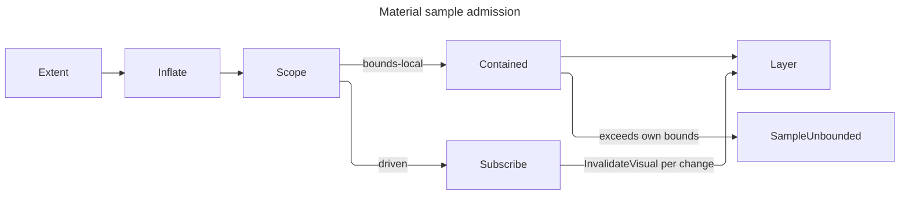

# [APPUI_VFX_MATERIAL]

Rasm.AppUi materials are the effects plane's surface-treatment owner: one layer capsule brackets a draw with a ground the compositor already painted, one filter-row family carries every per-draw filter term the frozen paint catalogue structurally cannot hold, and one sample contract fixes when a backdrop-reading operation is allowed to trust its own last sample. The page EXECUTES what `Theme/tokens#TOKEN_CATALOG` declares — `MaterialTier` rows resolved into `MaterialValue`, the module `WashRow` family, the `PaintRole` ladder every pigment reads — so the token catalogue stays the data owner and this plane stays the executor; a material constant authored here would be a second token source.

`DrawSource`, `PaintCatalog`, `EffectTokens`, `FxRow`, `FxEffect`, and `LayerSpec` arrive settled from `Render/capture#DRAW_CAPSULE`, which owns the one `SKSurface` and the one `SaveLayer(in SKCanvasSaveLayerRec)` site in the package; this page mints the `LayerSpec` values that site consumes and never opens a layer itself. Translucency admission is `ThemeVariantRow.Translucent(PreferenceCell)` folding the `PreferenceRow.ReducedTransparency` column, contrast lift is the `VariantProjection.FloorLift` the same generation carries, and crossfade timing is a `MotionToken` resolved through `ReducedMotion.Select`. Procedural sources — the film field, the glow falloff, the gradient wash — resolve by ROW and uniform frame against `shader#EFFECT_PROGRAM`, and every fault derives through `AppUiFaultBand.Material` (6800).

## [01]-[INDEX]

- [02]-[LAYER_ALGEBRA]: The two-arm ground choice, the layer spec every material draw brackets with, and the text-preservation flag.
- [03]-[SAMPLE_CONTRACT]: The bounds-local-or-driven invalidation law and the in-tree host that discharges it.
- [04]-[FILTER_ROWS]: Lighting, refraction, tint, crossfade, luma, curve, and contrast rows as per-draw natives.
- [05]-[MATERIAL_EXECUTION]: Tier and wash execution, the opaque floor, grain, and the material receipt.

## [02]-[LAYER_ALGEBRA]

- Owner: `MaterialFault` the typed rail on the `AppUiFaultBand.Material` 6800 registry row; `LayerPlan` the spec mint every material draw brackets with.
- Cases: `MaterialFault` = LayerRefused | SampleUnbounded | TintUndeclared | FilterRejected | SourceMissing | WashUnmapped | ContrastUnsupported.
- Law: the ground arm is a CHOICE the `Render/capture#DRAW_CAPSULE` `LayerGround` union closes — `Filtered` puts the catalogue's frozen `SKImageFilter` in the `Backdrop` slot so the layer opens on filtered ground, `Previous` leaves `Backdrop` null and sets `InitializeWithPrevious` so the layer opens on an unfiltered copy — and this plane SELECTS an arm per material rather than opening a layer, because the one `SaveLayer` site in the package belongs to that capsule.
- Entry: `public static Fin<LayerSpec> Plan(MaterialSpec spec, SKRect extent, bool subpixelText)` — the one spec mint; the composite paint role rides the tier row, so a material's `MaterialOpacity` reaches the layer through the catalogue rather than a per-draw paint.
- Packages: SkiaSharp, Avalonia.Skia, Thinktecture.Runtime.Extensions, LanguageExt.Core
- Growth: a new ground treatment is one `FxRow.Ground` value at its capture-side owner; a new layer posture is one `LayerGround` case; zero new surface.
- Boundary: subpixel text over a material layer is the one flag this plane must set and the one it must not set blindly — `SKCanvasSaveLayerRecFlags.PreserveLcdText` keeps LCD glyph coverage through the layer, and it is legal ONLY when the layer composites onto opaque ground, so the flag folds the mounting surface's declared text fact against the OPAQUE resolve and a translucent tier drops it rather than fringing every glyph against the content beneath. The glyph side of that same law is the `Theme/typography` layer posture, which drops LCD coverage to grayscale edging for a layer-hosted run: the two ends state one fact — subpixel coverage is invalid against pixels the layer never composited — and a surface that set this flag while shaping under a non-layer posture would fringe exactly the runs the posture protected. The `Previous` arm is the honest floor on an embedded host: it copies what the compositor already painted and applies this plane's own tint, where `AcrylicBackgroundSource.Digger` would erase those pixels and dig through to nothing. Layer bounds are the material's OWN extent and never the surface — a layer bounded to the surface pays a full-surface offscreen for a panel-sized treatment — and the bound is what `[03]-[SAMPLE_CONTRACT]` clamps against, so the two are one value read twice and never two authored rects.

```csharp signature
// --- [ERRORS] ---------------------------------------------------------------------------

[Union(ConversionFromValue = ConversionOperatorsGeneration.None)]
public abstract partial record MaterialFault : Expected, IValidationError<MaterialFault> {
    private MaterialFault(string detail, int code) : base(detail, code) { }
    public static MaterialFault Create(string message) => new LayerRefused(message);
    public sealed record LayerRefused(string Detail)
        : MaterialFault($"material/layer: {Detail}", AppUiFaultBand.Material.Code(0));
    public sealed record SampleUnbounded(string Detail)
        : MaterialFault($"material/sample: {Detail}", AppUiFaultBand.Material.Code(1));
    public sealed record TintUndeclared(string Detail)
        : MaterialFault($"material/tint: {Detail}", AppUiFaultBand.Material.Code(2));
    public sealed record FilterRejected(string Detail)
        : MaterialFault($"material/filter: {Detail}", AppUiFaultBand.Material.Code(3));
    public sealed record SourceMissing(string Detail)
        : MaterialFault($"material/source: {Detail}", AppUiFaultBand.Material.Code(4));
    public sealed record WashUnmapped(string Detail)
        : MaterialFault($"material/wash: {Detail}", AppUiFaultBand.Material.Code(5));
    public sealed record ContrastUnsupported(string Detail)
        : MaterialFault($"material/contrast: {Detail}", AppUiFaultBand.Material.Code(6));
}
```

```csharp signature
// --- [MODELS] ---------------------------------------------------------------------------

// The spec mint. `subpixelText` is the MOUNTING surface's declared fact, carried on the spec's own HostsText
// column, and the opaque resolve is what actually admits the flag, because LCD coverage through a translucent
// layer fringes against content the layer never composited. Bounds are the material's own extent, so the layer
// costs one panel-sized offscreen and the sample contract clamps against the same value.
public static class LayerPlan {
    public static Fin<LayerSpec> Plan(MaterialSpec spec, SKRect extent, bool subpixelText) =>
        extent.IsEmpty
            ? Fin.Fail<LayerSpec>(new MaterialFault.LayerRefused($"{spec.Tier.Key}: empty extent"))
            : Fin.Succ(new LayerSpec(
                Bounds: extent,
                Ground: spec.Ground,
                Composite: Some(spec.CompositeRole),
                PreserveText: subpixelText && spec.Opaque));
}
```

The ground arm is the MOUNT's own declaration and the opaque resolve overrides it — an opaque material takes `LayerGround.Copy` on every tier, and the opaque floor drops grain and subpixel text with it. The rows below are the ground each tier's mounted surfaces request, not a per-tier constant this plane holds.

| [INDEX] | [TIER]    | [MOUNT_GROUND]        | [ADMISSIBLE_SCOPE]                                             | [COMPOSITE_ROLE]   |
| :-----: | :-------- | :-------------------- | :------------------------------------------------------------- | :----------------- |
|  [01]   | `chrome`  | `LayerGround.Copy`    | bounds-local or driven; an unfiltered copy inflates by nothing | `material-chrome`  |
|  [02]   | `overlay` | `LayerGround.Frosted` | driven alone; the blur bleeds by its own sigma                 | `material-overlay` |
|  [03]   | `sheet`   | `LayerGround.Acrylic` | driven alone; the blur bleeds by its own sigma                 | `material-sheet`   |

## [03]-[SAMPLE_CONTRACT]

- Owner: `SampleScope` `[SmartEnum<string>]` the two-row admission axis; `MaterialHost` the in-tree control discharging the driven obligation.
- Cases: bounds-local | driven.
- Law: a backdrop-sampling operation re-samples ONLY when the invalidated region intersects its own visual's bounds. The compositor never widens a dirty region to cover a visual that merely SAMPLES it, so a material whose sample region exceeds its own bounds — blur bleed past the edge, a whole-surface wash, a global tint — holds a stale sample across every change outside those bounds. The two admitted resolutions are total: hold the sample region inside the owner's own bounds, or subscribe to the change source the region covers and issue `InvalidateVisual()` per change. There is no third resolution, and an over-reaching undriven material is `MaterialFault.SampleUnbounded` at admission rather than a stale panel at run time.
- Entry: `public Fin<SKRect> Admit(SKRect own, LayerGround ground)` — the admission every material extent passes, folding the ground's own bleed in before it tests; the driven row's subscription at `MaterialHost` construction is what discharges the obligation.
- Auto: the `Driven` row's subscription lands at control attach and releases at detach through the same `CompositeDisposable` the host's other subscriptions ride; a bounds-local material needs no subscription at all, because its own dirty rect already covers everything it reads.
- Receipt: `MaterialReceipt.Scope` carries the row key, so the proof lane reads which resolution each mounted material took rather than inferring it from geometry.
- Packages: Avalonia, System.Reactive, LanguageExt.Core
- Growth: a new material surface declares one `SampleScope` row and, on the driven row, one change-source column; zero new surface.
- Boundary: the driven subscription's source is the change stream of the region the material SAMPLES, never the material's own property stream — an own-property change already dirties own bounds and re-runs the operation, which is exactly the case the contract does not cover. `InvalidateVisual` is issued per change and never per frame: a per-frame invalidation defeats the compositor's dirty-rect economy for every surface in the tree, which is the cost this contract exists to bound. A blur ground bleeds by its own sigma, so a `Filtered` material's requested region is its bounds inflated by the ground's sigma and the clamp is what forces that inflation onto the driven row rather than letting it silently sample stale ground.

```csharp signature
// --- [TYPES] ----------------------------------------------------------------------------

// The two total resolutions of the sampling law, as ROWS rather than a bool, because each carries its own
// admission body: the local row clamps and needs nothing else, while the driven row admits any region and
// owes a live subscription. `Inflate` is the ground's own bleed — a clamp against un-inflated bounds passes a
// material that then samples sigma pixels of ground it never invalidates.
[SmartEnum<string>]
[KeyMemberEqualityComparer<ComparerAccessors.StringOrdinal, string>]
[KeyMemberComparer<ComparerAccessors.StringOrdinal, string>]
public sealed partial class SampleScope {
    public static readonly SampleScope BoundsLocal = new("bounds-local", driven: false);
    public static readonly SampleScope Driven = new("driven", driven: true);

    public bool DrivesInvalidation { get; }

    public static SKRect Inflate(SKRect bounds, LayerGround ground) => ground.Switch(
        state: bounds,
        filtered: static (rect, row) => SKRect.Inflate(rect, row.Row.Sigma, row.Row.Sigma),
        previous: static (rect, _) => rect);

    // The one admission, and it is TOTAL over the two rows. A driven material passes its inflated region
    // through because the subscription is what keeps a sample outside own bounds fresh. A bounds-local
    // material admits only where the inflation changed nothing — which makes the pairing law structural
    // rather than advisory: a filtered ground bleeds by its own sigma and therefore cannot be bounds-local,
    // because clamping that bleed away deletes exactly the ground the arm was chosen for.
    public Fin<SKRect> Admit(SKRect own, LayerGround ground) => Inflate(own, ground) switch {
        var region when DrivesInvalidation => Fin.Succ(region),
        var region when own.Contains(region) => Fin.Succ(region),
        var region => Fin.Fail<SKRect>(new MaterialFault.SampleUnbounded(
            $"{Key}: {region} exceeds {own} with no change source driving invalidation")),
    };
}
```

```csharp signature
// --- [SERVICES] -------------------------------------------------------------------------

// The in-tree vehicle. `Render` folds the lease to `DrawSource.Borrowed` exactly as every other in-tree draw
// on this estate does, so the material composites into the host's in-flight frame and mints no surface.
// `changes` is the SAMPLED region's stream, not this control's own: an own-property write already dirties own
// bounds, and the contract exists for the disjoint change the compositor will never attribute here.
public sealed class MaterialHost : Control {
    readonly CompositeDisposable lifetime = new();
    readonly MaterialSpec spec;
    readonly Func<PaintCatalog> catalog;

    public MaterialHost(MaterialSpec spec, Func<PaintCatalog> catalog, IObservable<Unit> changes) {
        (this.spec, this.catalog) = (spec, catalog);
        if (spec.Scope.DrivesInvalidation) {
            lifetime.Add(changes.Subscribe(_ => InvalidateVisual()));
        }
    }

    protected override void OnDetachedFromVisualTree(VisualTreeAttachmentEventArgs e) {
        lifetime.Dispose();
        base.OnDetachedFromVisualTree(e);
    }

    public override void Render(DrawingContext context) =>
        context.Custom(new MaterialOperation(spec, catalog(), new Rect(Bounds.Size)));
}

// Bounds are GLOBAL-coordinate per the custom-draw contract, `HitTest` answers from its own geometry without
// recursing, and every Skia handle stays inside the `Render` lease scope. Equality is structural over the
// spec and the bounds so an unchanged operation re-uses the retained scene node.
public sealed record MaterialOperation(MaterialSpec Spec, PaintCatalog Paints, Rect Bounds) : ICustomDrawOperation {
    public bool Equals(ICustomDrawOperation? other) => Equals(other as MaterialOperation);

    public bool HitTest(Point point) => Bounds.Contains(point);

    public void Render(ImmediateDrawingContext context) =>
        ignore(context.TryGetFeature<ISkiaSharpApiLeaseFeature>() is { } feature
            ? Draw(feature)
            : Fin.Fail<Unit>(new MaterialFault.LayerRefused($"{Spec.Tier.Key}: no Skia lease on this backend")));

    Fin<Unit> Draw(ISkiaSharpApiLeaseFeature feature) {
        using ISkiaSharpApiLease lease = feature.Lease();
        return Spec.Draw(new DrawSource.Borrowed(lease), Paints, Bounds.ToSKRect(), static _ => Fin.Succ(unit));
    }

    public void Dispose() { }
}
```



## [04]-[FILTER_ROWS]

- Owner: `FilterRow` `[Union]` the per-draw filter algebra; `LightFace` and `CurveKind` `[SmartEnum<string>]` its two generated sub-axes.
- Cases: `FilterRow` = Lighting | Refraction | Tint | Crossfade | Luma | Curve | Contrast; `LightFace` = rim | inset; `CurveKind` = gamma | lift | gain | contrast.
- Law: a row lands here only when its parameters VARY per draw or per frame — a crossfade weight, a light direction tracking a pointer, a refraction scale on a resize, a curve amount on a preference flip. A row whose parameters are fixed for a whole theme generation belongs to the frozen `FxRow` catalogue at its capture-side owner, where it mints once and every draw reads it; minting a fixed row here would rebuild a native per frame for a value that never moved.
- Entry: `public Fin<FxEffect> Build(EffectTokens tokens, Func<EffectRow, UniformFrame, Fin<SKShader>> sources)` — the one native mint, taking the procedural-source projection `shader#EFFECT_PROGRAM` supplies; `public Fin<SKImageFilter> Ground(EffectTokens tokens, Func<EffectRow, UniformFrame, Fin<SKShader>> sources)` — the same rows projected into a save-layer backdrop, lifting every colour row through `SKImageFilter.CreateColorFilter`; `public FilterRow AtPhase(UnitInterval progress)` — the one per-frame advance the render-thread tick reads.
- Auto: `Tint` and `Crossfade` generate their matrices from the resolved pigment rather than carrying authored coefficients; `Curve` materializes its 256-entry tables from its kind's transfer at build; `Contrast` reads `VariantProjection.FloorLift` so the high-contrast projection reaches the effects plane through the same generation every token rung took.
- Packages: SkiaSharp, Rasm (project — `PerceptualColor`, `UnitInterval`), Thinktecture.Runtime.Extensions, LanguageExt.Core
- Growth: a new filter term is one `FilterRow` case with its `Build` arm; a new tone shape is one `CurveKind` row; a new lighting face is one `LightFace` row; zero new surface.
- Boundary: the lit filters derive their height field from the input's ALPHA, so a rim highlight and an inset highlight differ in the light direction ALONE — the inset row negates the incident vector and nothing else, and a second filter family for insets would carry one sign as a whole owner. Refraction is the glass floor and its displacement source is a `shader#EFFECT_PROGRAM` ROW carrying its own uniform frame, never an inline shader and never a composed key: displacement takes ONE channel per axis and offsets by that channel's distance from mid-grey, so the source must publish two decorrelated channels over the same seeded field the grain draw samples — an achromatic source hands both axes one value and shears every pixel along one diagonal — and the frame rides the row because a row alone cannot state the field's own separation. Every row's native is minted PER DRAW and `SKPaint.Dispose` releases none of the four slots it binds, so the built stack is released by the capsule that built it and a build that refuses mid-fold releases the prefix it already minted. `Tint` is a lerp toward the pigment expressed as one 4x5 matrix whose fifth column carries the additive term in normalized units, so an 8-bit byte constant in that column is the deleted form; `Crossfade` is `SKColorFilter.CreateLerp` over two built rows, which is why the weight cannot be frozen and why the module wash reaches its crossfade here rather than through a second animation path. The 256-entry curve tables are GENERATED from their kind's transfer — an authored table is unverifiable against the shape it claims — and `Contrast` binds the shipped high-contrast config rather than a hand-rolled grayscale matrix, because the config's own `IsValid` gate is the admission the estate would otherwise re-derive.

```csharp signature
// --- [TYPES] ----------------------------------------------------------------------------

// Rim and inset differ by the incident vector alone: both filters read the input's ALPHA as a height field,
// so flipping the light to come from below inverts the bevel. A second owner for insets would carry one sign.
[SmartEnum<string>]
[KeyMemberEqualityComparer<ComparerAccessors.StringOrdinal, string>]
[KeyMemberComparer<ComparerAccessors.StringOrdinal, string>]
public sealed partial class LightFace {
    public static readonly LightFace Rim = new("rim", flip: 1f);
    public static readonly LightFace Inset = new("inset", flip: -1f);

    public float Flip { get; }

    public SKPoint3 Incident(SKPoint3 direction) =>
        new(direction.X, direction.Y * Flip, direction.Z * Flip);
}

// Tone shapes as transfers, so the 256-entry table is a GENERATION and never an authored roster. Amount is the
// row's single knob and every transfer is total on the unit interval, so a table entry cannot leave range.
[SmartEnum<string>]
[KeyMemberEqualityComparer<ComparerAccessors.StringOrdinal, string>]
[KeyMemberComparer<ComparerAccessors.StringOrdinal, string>]
public sealed partial class CurveKind {
    public static readonly CurveKind Gamma = new("gamma", static (v, a) => Math.Pow(v, 1d + a));
    public static readonly CurveKind Lift = new("lift", static (v, a) => a + ((1d - a) * v));
    public static readonly CurveKind Gain = new("gain", static (v, a) => v * (1d + a));
    public static readonly CurveKind Contrast = new("contrast", static (v, a) => 0.5d + ((v - 0.5d) * (1d + a)));

    public Func<double, double, double> Transfer { get; }

    public byte[] Table(UnitInterval amount) => [.. Enumerable.Range(0, 256).Select(step =>
        (byte)Math.Clamp(Math.Round(Transfer(step / 255d, amount.Value) * 255d), 0d, 255d))];
}
```

```csharp signature
// --- [MODELS] ---------------------------------------------------------------------------

// The per-draw filter algebra. Every case carries its parameters as ROW DATA and mints its native at Build,
// because each one's parameters move — a crossfade weight per frame, a light direction per pointer sample, a
// refraction scale per resize. A parameter that holds for a whole generation belongs to the frozen FxRow
// catalogue instead, where one mint serves every draw.
[Union(ConversionFromValue = ConversionOperatorsGeneration.None)]
public abstract partial record FilterRow {
    private FilterRow() { }
    public sealed record Lighting(LightFace Face, SKPoint3 Direction, PaintRole Light, float SurfaceScale, float Ks, float Shininess) : FilterRow;
    public sealed record Refraction(EffectRow Source, UniformFrame Frame, float Scale, SKColorChannel X, SKColorChannel Y) : FilterRow;
    public sealed record Tint(PaintRole Role, int Rung, UnitInterval Strength) : FilterRow;
    public sealed record Crossfade(UnitInterval Weight, FilterRow From, FilterRow To) : FilterRow;
    public sealed record Luma() : FilterRow;
    public sealed record Curve(CurveKind Kind, UnitInterval Amount) : FilterRow;
    public sealed record Contrast(bool Grayscale, SKHighContrastConfigInvertStyle Invert, float Amount) : FilterRow;

    // The ONE native mint. Colour rows land in the paint's ColorFilter slot and geometry-reading rows in its
    // ImageFilter slot, so the product discriminates by slot exactly as the capture-side effect union does and
    // a caller never chooses where a row binds. `sources` is the procedural projection the shader page supplies;
    // refraction is the only arm that takes it, and it takes a ROW beside a frame so a program the roster never
    // minted is unspellable rather than a key that resolves to nothing at draw time.
    public Fin<FxEffect> Build(EffectTokens tokens, Func<EffectRow, UniformFrame, Fin<SKShader>> sources) => Switch(
        state: (Tokens: tokens, Sources: sources),
        lighting: static (s, row) =>
            from light in Pigment(s.Tokens, row.Light, 0)
            select (FxEffect)new FxEffect.Imaging(SKImageFilter.CreateDistantLitSpecular(
                // The lit filters take an 8-bit SKColor and publish no float twin, so the light quantizes at
                // this boundary by the API's own shape — the explicit cast states that where an implicit
                // conversion would hide a working-space value silently losing its gamut.
                direction: row.Face.Incident(row.Direction),
                lightColor: (SKColor)light,
                surfaceScale: row.SurfaceScale,
                ks: row.Ks,
                shininess: row.Shininess)),
        refraction: static (s, row) =>
            from shader in s.Sources(row.Source, row.Frame)
            select (FxEffect)new FxEffect.Imaging(SKImageFilter.CreateDisplacementMapEffect(
                xChannelSelector: row.X,
                yChannelSelector: row.Y,
                scale: row.Scale,
                displacement: SKImageFilter.CreateShader(shader))),
        tint: static (s, row) =>
            from pigment in Pigment(s.Tokens, row.Role, row.Rung)
            select (FxEffect)new FxEffect.Coloring(SKColorFilter.CreateColorMatrix(Lerp(pigment, row.Strength))),
        crossfade: static (s, row) =>
            from from_ in row.From.Colour(s.Tokens, s.Sources)
            from to in row.To.Colour(s.Tokens, s.Sources)
            select (FxEffect)new FxEffect.Coloring(
                SKColorFilter.CreateLerp((float)row.Weight.Value, from_, to)),
        luma: static (_, _) => Fin.Succ<FxEffect>(new FxEffect.Coloring(SKColorFilter.CreateLumaColor())),
        curve: static (_, row) => row.Kind.Table(row.Amount) switch {
            var table => Fin.Succ<FxEffect>(new FxEffect.Coloring(
                SKColorFilter.CreateTable(a: Identity, r: table, g: table, b: table))),
        },
        contrast: static (_, row) => new SKHighContrastConfig(row.Grayscale, row.Invert, row.Amount) switch {
            { IsValid: true } config => Fin.Succ<FxEffect>(new FxEffect.Coloring(SKColorFilter.CreateHighContrast(config))),
            var config => Fin.Fail<FxEffect>(new MaterialFault.ContrastUnsupported($"{config.InvertStyle}/{config.Contrast}")),
        });

    // Save-layer backdrops take an image filter alone, so a colour row lifts through CreateColorFilter rather
    // than forcing every ground to be authored twice. The lift is free at the node level — Skia composes it
    // into the same DAG the blur ground already builds.
    public Fin<SKImageFilter> Ground(EffectTokens tokens, Func<EffectRow, UniformFrame, Fin<SKShader>> sources) =>
        Build(tokens, sources).Bind(static effect => effect.Switch(
            shading: static _ => Fin.Fail<SKImageFilter>(new MaterialFault.FilterRejected("a shader row is not a ground")),
            imaging: static row => Fin.Succ(row.Native),
            coloring: static row => Fin.Succ(SKImageFilter.CreateColorFilter(row.Native)),
            pathing: static _ => Fin.Fail<SKImageFilter>(new MaterialFault.FilterRejected("a path row is not a ground"))));

    // The one per-frame read. Progress is the render-thread tick's own normalized run value, and exactly the
    // rows whose parameters MOVE per frame consume it — which is the crossfade weight alone, because every
    // other row moves on a preference flip, a pointer sample, or a resize, all of which retarget the whole spec
    // instead of advancing it. A row that ignored progress by carrying its own clock would drift from the one
    // server clock `compose#CUSTOM_VISUAL_TICK` reads.
    public FilterRow AtPhase(UnitInterval progress) => Switch(
        state: progress,
        lighting: static (_, row) => (FilterRow)row,
        refraction: static (_, row) => row,
        tint: static (_, row) => row,
        crossfade: static (p, row) => row with { Weight = p },
        luma: static (_, row) => row,
        curve: static (_, row) => row,
        contrast: static (_, row) => row);

    // The crossfade arms must both be COLOUR rows: SKColorFilter.CreateLerp interpolates two colour filters and
    // has no image-filter twin, so a geometry row reaching a crossfade is a refusal here rather than a silently
    // dropped arm at the native boundary.
    Fin<SKColorFilter> Colour(EffectTokens tokens, Func<EffectRow, UniformFrame, Fin<SKShader>> sources) =>
        Build(tokens, sources).Bind(effect => effect is FxEffect.Coloring row
            ? Fin.Succ(row.Native)
            : Fin.Fail<SKColorFilter>(new MaterialFault.FilterRejected($"crossfade arm {GetType().Name} is not a colour row")));

    // The pigment read routes through the capture-side token edge and re-bands its refusal: `EffectTokens.Pigment`
    // already owns the frozen-bucket lookup and the policy widening that lifts an 8-bit display value into the
    // generation's one working space, so a second lookup here would be a second token edge disagreeing with it.
    // The key comes off the role ladder rather than a composed string, so a rung the generation never emitted is
    // a typed refusal on this plane's own band instead of a miss discovered at draw time.
    static Fin<SKColorF> Pigment(EffectTokens tokens, PaintRole role, int rung) =>
        tokens.Pigment(role.At(rung))
            .MapFail(error => new MaterialFault.TintUndeclared($"{role.Key}/{rung}: {error.Message}"));

    // A 4x5 row-major matrix lerping every channel toward the pigment. The fifth column is the ADDITIVE term in
    // normalized units, which is why the pigment enters as SKColorF and never as a byte constant.
    static float[] Lerp(SKColorF pigment, UnitInterval strength) => (float)strength.Value switch {
        var s => [
            1f - s, 0f,     0f,     0f, s * pigment.Red,
            0f,     1f - s, 0f,     0f, s * pigment.Green,
            0f,     0f,     1f - s, 0f, s * pigment.Blue,
            0f,     0f,     0f,     1f, 0f,
        ],
    };

    // Alpha passes through every tone curve untouched: a curve that lifted alpha would dissolve the material's
    // own coverage while claiming to move its tone.
    static readonly byte[] Identity = [.. Enumerable.Range(0, 256).Select(static step => (byte)step)];
}
```

| [INDEX] | [ROW]        | [NATIVE]                                    | [VARIES_BY]                         |
| :-----: | :----------- | :------------------------------------------ | :---------------------------------- |
|  [01]   | `Lighting`   | `SKImageFilter.CreateDistantLitSpecular`    | light direction, face, pigment      |
|  [02]   | `Refraction` | `SKImageFilter.CreateDisplacementMapEffect` | scale on resize, the field frame    |
|  [03]   | `Tint`       | `SKColorFilter.CreateColorMatrix`           | strength, resolved pigment          |
|  [04]   | `Crossfade`  | `SKColorFilter.CreateLerp`                  | weight per frame                    |
|  [05]   | `Luma`       | `SKColorFilter.CreateLumaColor`             | nothing; the mask arm of a stack    |
|  [06]   | `Curve`      | `SKColorFilter.CreateTable`                 | amount on a preference flip         |
|  [07]   | `Contrast`   | `SKColorFilter.CreateHighContrast`          | the variant projection's floor lift |

## [05]-[MATERIAL_EXECUTION]

- Owner: `MaterialSpec` the executable material; `WashPlane` the module ambient-wash executor; `MaterialReceipt` the evidence row.
- Law: `Theme/tokens` decides and this plane executes — a `MaterialTier` resolves to a `MaterialValue` at theme resolve and reaches here as a value, and a `WashRow` reaches here as a value; an opacity, a grain weight, a hue, or a coverage authored on this page would be a second token source the swap capsule never re-seeds.
- Entry: `public Fin<Unit> Draw(DrawSource source, PaintCatalog paints, SKRect extent, Func<SKCanvas, Fin<Unit>> content)` — the capsule: plan the layer, bracket the content, fill the tint, lay the grain, release every per-draw native, and let the one layer site restore; `public static Fin<MaterialSpec> Of(MaterialTier tier, ResolvedTheme theme, LayerGround ground, SampleScope scope, Seq<FilterRow> stack, bool hostsText, Func<EffectRow, UniformFrame, Fin<SKShader>> sources)` — the admission; `public MaterialSpec AtPhase(UnitInterval progress)` — the render-thread phase read `compose#CUSTOM_VISUAL_TICK` draws through.
- Auto: the opaque floor arrives already resolved — `MaterialTier.Resolve` collapses tint opacity, material opacity, and grain to their opaque values when translucency is refused — so this plane reads `MaterialValue` and never re-derives the preference; the high-contrast projection appends its `FilterRow.Contrast` row through the same admission, so a variant flip re-stacks the material without a second code path; the wash crossfade advances on a `MotionToken` already selected through `ReducedMotion.Select`, so a reduced host renders the terminal module hue with no interpolation at all.
- Receipt: `MaterialReceipt` — tier key, ground key, scope key, translucent flag, filter count, wash module, `Instant` — sealed through `ReceiptSinkPort` under the evidence union's `Effect` case, so the proof lane reads which materials actually rendered translucent on each host rather than which ones asked to.
- Packages: SkiaSharp, Avalonia.Skia, Rasm (project — `UnitInterval`), NodaTime, LanguageExt.Core
- Growth: a new material surface is one `MaterialSpec` value over an existing tier; a new TIER costs this plane nothing at all, because the ground a material composites on is the mount's own declaration rather than a per-tier arm; a new per-frame term is one `FilterRow.AtPhase` arm; a new module wash is one `WashRow` at its token owner; zero new surface.
- Boundary: which translucent ground a surface asks for is the MOUNT's fact and never the tier's — a sheet over a live viewport and a sheet on an embedded host beneath which no pixels exist take different arms under one tier, and the opaque floor is the single ground rule this plane owns because an opaque material overpaints every pixel a filtered ground would read. Every native this capsule mints lives for ONE draw: a filter row rebuilds its `SKImageFilter` or `SKColorFilter` per frame, the grain source is a fresh `SKShader` off the retained builder, and `SKPaint.Dispose` releases none of them, so the capsule releases what it built on both the drawn and the refused path. The grain is a DRAW, not a token knob — `MaterialValue.Grain` is a declared weight and the noise it weights is the compiled `grain` program at `shader#EFFECT_PROGRAM`, because the shipped acrylic material composes a fixed noise bitmap under a fixed alpha and neither is addressable, so a material that wanted its grain to follow density or variant had no seam at all. The wash crossfade blends two shaders through one arithmetic blender rather than drawing both and hoping alpha compounds correctly: two alpha-over draws at coverage `c` composite to `1-(1-c)²` and brighten the mid-transition frame, which is precisely the luminance the `WashRow.LuminanceCeiling` gate exists to hold. A material never draws its own content — the capsule takes the content fold and brackets it — so a surface cannot half-apply a treatment by drawing outside the layer, and `MaterialOperation` is the only in-tree vehicle, so a control that wants a material mounts one rather than overriding its own render.

```csharp signature
// --- [MODELS] ---------------------------------------------------------------------------

// The executable material: the tier that produced it, the resolved value the token generation handed over, the
// ground arm, the sample scope, the per-draw filter stack, and whether the bracketed content hosts glyphs.
// Opaque is the resolved fact and never a probe read here — MaterialTier.Resolve already folded the
// reduced-transparency preference, so this plane cannot disagree with the generation about whether a surface is
// translucent and takes no preference cell of its own to re-read it from.
public sealed record MaterialSpec(
    MaterialTier Tier,
    MaterialValue Value,
    LayerGround Ground,
    SampleScope Scope,
    Seq<FilterRow> Stack,
    string CompositeRole,
    bool HostsText,
    Func<EffectRow, UniformFrame, Fin<SKShader>> Sources) {
    public bool Opaque => Value.MaterialOpacity.Value >= 1d && Value.TintOpacity.Value >= 1d;

    // Admission is where the variant projection reaches the effects plane: the high-contrast row appends to the
    // stack exactly once, so a contrast flip re-stacks every mounted material through the generation rather
    // than through a per-surface conditional. A driven scope with no inflation to justify it still admits —
    // over-invalidation is a cost, where under-invalidation is a stale frame. The resolved bucket is addressed
    // by the tier's own `MaterialKey`, because the frozen map is keyed by `TokenKey` and the smart-enum string
    // key is a different vocabulary that would not type against it.
    public static Fin<MaterialSpec> Of(
        MaterialTier tier, ResolvedTheme theme, LayerGround ground, SampleScope scope, Seq<FilterRow> stack,
        bool hostsText, Func<EffectRow, UniformFrame, Fin<SKShader>> sources) =>
        theme.Materials.TryGetValue(tier.MaterialKey, out MaterialValue value)
            ? Fin.Succ(new MaterialSpec(
                Tier: tier,
                Value: value,
                Ground: Arm(value, ground),
                Scope: scope,
                Stack: theme.Variant.Projection.FloorLift.IsSome
                    ? stack + Seq<FilterRow>(new FilterRow.Contrast(false, SKHighContrastConfigInvertStyle.NoInvert, 0.3f))
                    : stack,
                CompositeRole: $"material-{tier.Key}",
                HostsText: hostsText,
                Sources: sources))
            : Fin.Fail<MaterialSpec>(new MaterialFault.TintUndeclared($"tier {tier.Key} carries no resolved material"));

    // The render-thread phase read. A tick advances ONE value — the normalized progress of the run driving this
    // material — and every moving term reads it off a projected spec, so the handler holds an origin instant
    // rather than a mutable copy of the values the draw is about to use.
    public MaterialSpec AtPhase(UnitInterval progress) =>
        this with { Stack = Stack.Map(row => row.AtPhase(progress)) };

    // The ONE ground rule this plane owns: an opaque material has nothing to filter, because the ground it
    // would blur is entirely overpainted, so the copy arm is both cheaper and the only honest spelling. Which
    // translucent arm to request is the MOUNT's own fact — the embedded-host floor is a surface declaring Copy
    // because no pixels exist beneath it — so a per-tier arm here could express neither that host nor its
    // translucent twin, while costing an edit on every tier the token generation later grows.
    static LayerGround Arm(MaterialValue value, LayerGround requested) =>
        value.MaterialOpacity.Value >= 1d ? LayerGround.Copy : requested;

    // A short-circuiting traverse drops every native built before the offending row with no other owner holding
    // them, so the build FOLDS and its refusal releases its own prefix.
    static Fin<Seq<FxEffect>> Built(
        Seq<FilterRow> stack, EffectTokens tokens, Func<EffectRow, UniformFrame, Fin<SKShader>> sources) =>
        stack.Fold(Fin.Succ(Seq<FxEffect>()), (state, row) => state.Bind(built =>
            row.Build(tokens, sources)
                .MapFail(fault => {
                    built.Iter(static effect => ignore(effect.Release()));
                    return fault;
                })
                .Map(effect => built.Add(effect))));

    // The capsule. One layer plan, one bracketed content fold, one tint fill, one grain lay — and the restore
    // belongs to the layer site at the capture-side owner, so no exit path here can strand a saved layer.
    public Fin<Unit> Draw(DrawSource source, PaintCatalog paints, SKRect extent, Func<SKCanvas, Fin<Unit>> content) =>
        from bounds in Scope.Admit(extent, Ground)
        // The LAYER takes the admitted region and the tint fill takes the visible extent: the layer must
        // cover the ground its filter reads, while the tint covers only what the material actually paints.
        // The text flag is the MOUNTING surface's declared fact, never a re-read of the opaque resolve: a
        // material that hosts no glyphs gains nothing from LCD coverage and the plan folds the opaque
        // admission onto it, so an opaque panel with no text never claims subpixel coverage it cannot use.
        from plan in LayerPlan.Plan(this, bounds, subpixelText: HostsText)
        from natives in Built(Stack, paints.Tokens, Sources)
        from drawn in source.Layered(paints, plan, canvas => Compose(canvas, paints, extent, natives, content))
        select drawn;

    // Tint first, then the caller's content, then the grain over both: the grain is a surface property of the
    // material and reads as film rather than as texture behind the content. Every native binds onto ONE paint,
    // which is the estate's paint law, and the paint is scoped to the fill rather than retained. The tint
    // crosses through the policy's own byte admission — SKPaint.Color assumes sRGB and quantizes before any
    // conversion, so a component-wise divide by 255 here would fabricate a working-space value. The stack
    // RELEASES on the way out whichever way the fold ended: a paint releases nothing it was bound, so a
    // three-row material would otherwise leak three natives on every frame it draws.
    Fin<Unit> Compose(SKCanvas canvas, PaintCatalog paints, SKRect extent, Seq<FxEffect> natives, Func<SKCanvas, Fin<Unit>> content) {
        Fin<Unit> drawn = paints.Tokens.Policy.Resolve(Value.Tint).Bind(pigment => {
            using SKPaint fill = new() { IsAntialias = true };
            ignore(natives.Fold(fill, static (paint, effect) => effect.BindTo(paint)));
            fill.SetColor(pigment.WithAlpha((float)Value.TintOpacity.Value), paints.Tokens.Working);
            canvas.DrawRect(extent, fill);
            return content(canvas).Bind(_ => Grain(canvas, paints, extent));
        });
        natives.Iter(static effect => ignore(effect.Release()));
        return drawn;
    }

    // Grain rides Overlay so it modulates the tint it sits on instead of veiling it: an alpha-over noise at the
    // same weight washes the surface toward the noise's own mid grey and flattens every rung beneath it. The
    // shader is a FRESH native off the retained builder every frame, so it releases with the paint that bound
    // it and in ownership order, the paint dropping before the source it sampled.
    Fin<Unit> Grain(SKCanvas canvas, PaintCatalog paints, SKRect extent) =>
        Value.Grain.Value <= 0d
            ? Fin.Succ(unit)
            : Sources(
                    EffectRow.Grain,
                    UniformFrame.Of(
                        new SKSize(extent.Width, extent.Height),
                        ("weight", new UniformValue.Scalar((float)Value.Grain.Value))))
                .MapFail(error => new MaterialFault.SourceMissing($"{EffectRow.Grain.Key}: {error.Message}"))
                .Map(shader => {
                    using SKShader source = shader;
                    using SKPaint film = new() {
                        Shader = source,
                        BlendMode = SKBlendMode.Overlay,
                        Color = SKColors.White.WithAlpha((byte)Math.Round(Value.Grain.Value * byte.MaxValue)),
                    };
                    canvas.DrawRect(extent, film);
                    return unit;
                });
}

// The module ambient wash: the token catalogue's WashRow executed as two gradient shaders lerped by one
// arithmetic blender. The blend is a true lerp, so the mid-transition frame never exceeds either row's own
// coverage and the luminance ceiling the token owner already gated that coverage against still holds through
// the crossfade — a re-clamp here would be a second gate on a value the generation settled.
public sealed record WashPlane(WashRow From, WashRow To, UnitInterval Weight) {
    public static Fin<WashPlane> Of(string from, string to, UnitInterval weight) =>
        (Find(from), Find(to)) switch {
            ({ IsSome: true } a, { IsSome: true } b) => Fin.Succ(new WashPlane((WashRow)a, (WashRow)b, weight)),
            var pair => Fin.Fail<WashPlane>(new MaterialFault.WashUnmapped($"{from}->{to}: {pair}")),
        };

    static Option<WashRow> Find(string module) =>
        ThemeCatalog.Washes.Find(row => row.Module == module);

    // The composed blend RETAINS the blender and both source shaders, so the three handles this fold minted
    // release here and the product carries the only reference a caller owes back. A refused second gradient
    // releases the first: a short-circuit past a live native leaves a handle no rail can reach.
    public Fin<SKShader> Resolve(Func<WashRow, Fin<SKShader>> gradient) =>
        gradient(From).Bind(origin => gradient(To)
            .MapFail(fault => {
                origin.Dispose();
                return fault;
            })
            .Map(target => Blended(origin, target)));

    // k1..k4 name the arithmetic blender's own terms: result = k1*src*dst + k2*src + k3*dst + k4, so a straight
    // lerp is k2 = weight, k3 = 1 - weight and the product and constant terms are zero. Two alpha-over draws
    // would composite to 1-(1-c)^2 at the midpoint and overshoot the ceiling this row exists to hold.
    SKShader Blended(SKShader origin, SKShader target) {
        using SKBlender lerp = SKBlender.CreateArithmetic(
            k1: 0f, k2: (float)Weight.Value, k3: 1f - (float)Weight.Value, k4: 0f, enforcePMColor: true);
        using SKShader from = origin;
        using SKShader to = target;
        return SKShader.CreateBlend(lerp, from, to);
    }
}

// The row's Instant stays off the evidence case because the envelope HLC owns time; Scope rides Outcome so a
// board can group mounted materials by which half of the sampling contract they took.
public readonly record struct MaterialReceipt(
    string Tier, string Ground, string Scope, bool Translucent, int Filters, string Wash, Instant At) {
    public EvidenceReceipt ToEvidence() => new EvidenceReceipt.Effect(
        Plane: "material", Key: Tier, Outcome: $"{Ground}/{Scope}",
        Flag: Translucent, Count: Filters, Magnitude: Wash);
}
```

## [06]-[RESEARCH]

(none)
