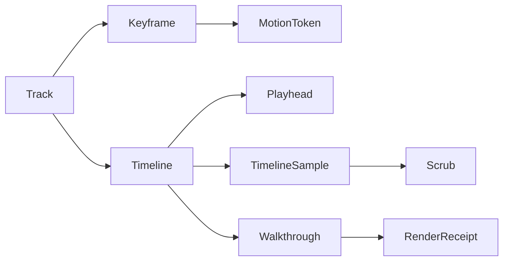

# [APPUI_ANIMATION_TIMELINE]

The animation rail is the temporal model: `Track` is the closed keyframe-track union over parameters, cameras, visibility, and transient-field indices, `Keyframe` carries a value and a motion-token easing, `Timeline` composes tracks under a deterministic playhead clock, and `Walkthrough` renders the timeline to an offline frame sequence through the offscreen encode rail. The page owns the track and keyframe vocabulary, the timeline composition and deterministic-playback sampler, the kinematic and transient-field scrub, and the offline walkthrough export; the substrate is the motion-token easing vocabulary for keyframe interpolation, the `Viewpoint` camera for camera tracks, the `SimField` frame index for transient scrub, the visuals encode rail for walkthrough frames, and the AppHost clock for the deterministic playhead. Playback is frame-indexed under the deterministic motion clock so a scrub and an offline render reproduce the same state.

## [1]-[INDEX]

| [INDEX] | [CLUSTER]   | [OWNS]                                                         |
| :-----: | :---------- | :------------------------------------------------------------- |
|   [1]   | TRACK_MODEL | Keyframe-track union; keyframe value plus motion-token easing  |
|   [2]   | TIMELINE    | Track composition; deterministic playhead; sample-at-time fold |
|   [3]   | SCRUB       | Kinematic playback; transient-field scrubbing by frame index   |
|   [4]   | WALKTHROUGH | Offline frame-sequence render to the encode rail               |

## [2]-[TRACK_MODEL]

- Owner: `Keyframe<T>` the timed value with its easing; `Track` `[Union]` the track-kind family; `Easing` the motion-token interpolation projection.
- Cases: `Track` = Parameter | Camera | Visibility | FieldIndex | Color under the locked kind literals — a parameter track animates a typed scalar, a camera track the viewpoint camera, a visibility track an element-visibility step, a field-index track the transient simulation frame, a color track an OKLab-interpolated paint.
- Entry: `public static Fin<Track> OfParameter(string Key, Seq<Keyframe<double>> Frames)` and its four sibling smart constructors — each sorts the keyframes by time and rejects an empty track at construction, so every constructed `Track` carries at least one keyframe in ascending time and the bracket sampler is total without a sample-time guard.
- Sample: `public static T Sample<T>(Keyframe<T> head, Seq<Keyframe<T>> rest, Duration t, Func<T, T, double, T> lerp)` — samples by finding the bracketing keyframes around the head-plus-rest decomposition and easing between them; the easing rides the keyframe's `MotionToken`; the head-threaded shape makes the sampler total over the construction-guaranteed non-empty track with no thrown control flow and no unconstrained `default!`.
- Auto: each keyframe carries its time, value, and a `MotionToken` whose spring or curve drives the interpolation between it and the next so the easing vocabulary is the one motion catalog — a keyframe never carries a raw cubic-bezier literal; camera tracks interpolate the `ViewCamera` eye, target, and up through the same easing so a fly-through is a camera-keyframe track, visibility tracks step a `VisibilityOverride` set at the keyframe so an element appears or hides at a time, field-index tracks step the `SimField.FrameIndex` so a transient simulation scrubs by keyframe, and color tracks interpolate through the OKLab mix so a paint animates perceptually; the bracketing search is a binary search over the time-sorted keyframes so a sample is logarithmic in keyframe count.
- Packages: Thinktecture.Runtime.Extensions, LanguageExt.Core, NodaTime
- Growth: a new track kind is one `Track` case plus its one `Of*` smart constructor; a new easing is one `MotionToken` row consumed here; zero new surface.
- Boundary: the easing is the motion-token vocabulary so a hand-rolled tween curve is the deleted form — every keyframe traces its easing to a `MotionToken` row exactly as every visual constant traces to a token; camera tracks ride the `ViewCamera` shape so the animation camera and the viewport camera and the drafting projection share one camera vocabulary; field-index tracks step the `SimField.FrameIndex` so a transient field scrub rides the simulation owner and the animation page re-computes no field; the `Track.Of*` smart constructors sort by time and reject an empty track into `Fin`, so the non-empty ascending-time invariant holds at construction and the `Sample` projection is total — an unsorted or empty track is structurally rejected at the rail edge, never guarded inside the pure sampler, so no `throw` and no unconstrained `default!` ever enters the value projection; the private union constructors are reachable only through the `Of*` rail so the invariant cannot be bypassed; color tracks ride the OKLab mix so the one color-interpolation law holds and a second interpolation is the rejected form.

```csharp signature
public readonly record struct Keyframe<T>(Duration At, T Value, MotionToken Easing) {
    public int CompareTo(Keyframe<T> other) => At.CompareTo(other.At);
}

public static class Easing {
    public static double Eased(MotionToken token, double t) =>
        token.Spring is { IsSome: true, Case: SpringValue spring }
            ? Damped(spring, Math.Clamp(t, 0d, 1d))
            : SmoothStep(Math.Clamp(t, 0d, 1d));

    private static double SmoothStep(double t) => t * t * (3d - (2d * t));

    private static double Damped(SpringValue spring, double t) =>
        1d - (Math.Exp(-spring.Damping * t) * Math.Cos(spring.Stiffness * t));
}

[Union(ConversionFromValue = ConversionOperatorsGeneration.None)]
public abstract partial record Track {
    private Track() { }
    public sealed record Parameter(string Key, Seq<Keyframe<double>> Frames) : Track;
    public sealed record Camera(string Key, Seq<Keyframe<ViewCamera>> Frames) : Track;
    public sealed record Visibility(string Key, Seq<Keyframe<Seq<VisibilityOverride>>> Frames) : Track;
    public sealed record FieldIndex(string Key, Seq<Keyframe<int>> Frames) : Track;
    public sealed record Color(string Key, Seq<Keyframe<Avalonia.Media.Color>> Frames) : Track;

    public static Fin<Track> OfParameter(string Key, Seq<Keyframe<double>> Frames) =>
        Sorted(Frames).Map(sorted => (Track)new Parameter(Key, sorted));
    public static Fin<Track> OfCamera(string Key, Seq<Keyframe<ViewCamera>> Frames) =>
        Sorted(Frames).Map(sorted => (Track)new Camera(Key, sorted));
    public static Fin<Track> OfVisibility(string Key, Seq<Keyframe<Seq<VisibilityOverride>>> Frames) =>
        Sorted(Frames).Map(sorted => (Track)new Visibility(Key, sorted));
    public static Fin<Track> OfFieldIndex(string Key, Seq<Keyframe<int>> Frames) =>
        Sorted(Frames).Map(sorted => (Track)new FieldIndex(Key, sorted));
    public static Fin<Track> OfColor(string Key, Seq<Keyframe<Avalonia.Media.Color>> Frames) =>
        Sorted(Frames).Map(sorted => (Track)new Color(Key, sorted));

    private static Fin<Seq<Keyframe<T>>> Sorted<T>(Seq<Keyframe<T>> frames) =>
        frames.IsEmpty
            ? Fin<Seq<Keyframe<T>>>.Fail(Error.New("animation/empty-track"))
            : FinSucc(frames.OrderBy(static frame => frame.At).ToSeq());

    public string Key => Switch(
        parameter: static p => p.Key, camera: static c => c.Key, visibility: static v => v.Key,
        fieldIndex: static f => f.Key, color: static c => c.Key);

    public Duration Duration => Switch(
        parameter: static p => p.Frames.Last.At, camera: static c => c.Frames.Last.At,
        visibility: static v => v.Frames.Last.At, fieldIndex: static f => f.Frames.Last.At,
        color: static c => c.Frames.Last.At);

    public static T Sample<T>(Keyframe<T> head, Seq<Keyframe<T>> rest, Duration t, Func<T, T, double, T> lerp) =>
        Bracket(head, rest, t) switch {
            (var lo, var hi) when lo.At == hi.At => lo.Value,
            var bracket => lerp(bracket.Lo.Value, bracket.Hi.Value,
                Easing.Eased(bracket.Hi.Easing, (t - bracket.Lo.At).TotalNanoseconds / (double)(bracket.Hi.At - bracket.Lo.At).TotalNanoseconds)),
        };

    private static (Keyframe<T> Lo, Keyframe<T> Hi) Bracket<T>(Keyframe<T> head, Seq<Keyframe<T>> rest, Duration t) =>
        rest.LastOrNone().Match(
            None: () => (head, head),
            Some: last =>
                t <= head.At ? (head, head)
                    : t >= last.At ? (last, last)
                    : head.Cons(rest).Zip(rest).Find(pair => t >= pair.Item1.At && t <= pair.Item2.At).Match(
                        Some: pair => (pair.Item1, pair.Item2),
                        None: () => (last, last)));
}
```

## [3]-[TIMELINE]

- Owner: `Playhead` the deterministic playback clock; `Timeline` the track composition; `TimelineSample` the sampled state at the playhead.
- Entry: `public TimelineSample SampleAt(Duration t, Func<double, double, double, double> lerpD, Func<ViewCamera, ViewCamera, double, ViewCamera> lerpCam, Func<Color, Color, double, Color> lerpColor)` — samples every track at the playhead into one composed state; the playhead advances by frame under the deterministic clock.
- Auto: `Advance` steps the playhead by exactly one frame interval derived from the timeline frame rate so playback is frame-indexed and deterministic — a scrub to frame N and a render of frame N produce the same state; the timeline duration is the max track duration so the playhead clamps at the end; loop and ping-pong are playhead policy values so a looping animation is a clock policy, never a per-track flag; the sample composes the parameter, camera, visibility, field-index, and color tracks into one `TimelineSample` the viewport, the inspector, and the simulation render consume.
- Packages: Thinktecture.Runtime.Extensions, LanguageExt.Core, NodaTime
- Growth: a new playback mode is one `PlaybackMode` value; a new composed-state field is one `TimelineSample` member; zero new surface.
- Boundary: the playhead is frame-indexed under the deterministic motion clock so a wall-clock animation is the rejected form — a scrub and an offline render hit identical frames, the determinism the walkthrough export depends on; the frame rate is a timeline row value so a per-render frame-rate literal is the deleted form; loop and ping-pong are playhead policy so a per-track loop flag is the deleted form; the composed sample binds the camera onto the viewport camera, the field index onto the simulation render, the visibility onto the viewpoint overrides, and the parameters onto the inspector bindings so the timeline drives existing owners and a timeline-local renderer is the deleted form.

```csharp signature
[SmartEnum<string>]
public sealed partial class PlaybackMode {
    public static readonly PlaybackMode Once = new("once");
    public static readonly PlaybackMode Loop = new("loop");
    public static readonly PlaybackMode PingPong = new("ping-pong");
}

public sealed record Playhead(Duration Position, Duration Frame, PlaybackMode Mode, Duration Total) {
    public static Playhead At(double fps, Duration total, PlaybackMode mode) =>
        new(Duration.Zero, Duration.FromNanoseconds((long)(1e9 / fps)), mode, total);

    public Playhead Advance() =>
        Position + Frame switch {
            var next when next < Total => this with { Position = next },
            _ => Mode.Switch(
                state: (Frame, Total),
                once: static (s, _) => new Playhead(s.Total, s.Frame, PlaybackMode.Once, s.Total),
                loop: static (s, _) => new Playhead(Duration.Zero, s.Frame, PlaybackMode.Loop, s.Total),
                pingPong: static (s, _) => new Playhead(s.Total, s.Frame, PlaybackMode.PingPong, s.Total)),
        };

    public long FrameIndex => (long)(Position.TotalNanoseconds / Frame.TotalNanoseconds);

    public long FrameCount => (long)(Total.TotalNanoseconds / Frame.TotalNanoseconds);
}

public sealed record TimelineSample(
    HashMap<string, double> Parameters,
    Option<ViewCamera> Camera,
    Seq<VisibilityOverride> Visibility,
    Option<int> FieldIndex,
    HashMap<string, Color> Colors);

public sealed record Timeline(string Key, Seq<Track> Tracks, double FrameRate, PlaybackMode Mode) {
    public Duration Total => Tracks.IsEmpty ? Duration.Zero : Tracks.Map(static track => track.Duration).Max();

    public Playhead Playhead() => Animation.Playhead.At(FrameRate, Total, Mode);

    public TimelineSample SampleAt(
        Duration t,
        Func<double, double, double, double> lerpD,
        Func<ViewCamera, ViewCamera, double, ViewCamera> lerpCam,
        Func<Color, Color, double, Color> lerpColor) =>
        Tracks.Fold(
            new TimelineSample(HashMap<string, double>(), None, Seq<VisibilityOverride>(), None, HashMap<string, Color>()),
            (sample, track) => track.Switch(
                state: (Sample: sample, T: t, LerpD: lerpD, LerpCam: lerpCam, LerpColor: lerpColor),
                parameter: static (ctx, p) => ctx.Sample with { Parameters = ctx.Sample.Parameters.AddOrUpdate(p.Key, Track.Sample(p.Frames.Head, p.Frames.Tail, ctx.T, ctx.LerpD)) },
                camera: static (ctx, c) => ctx.Sample with { Camera = Some(Track.Sample(c.Frames.Head, c.Frames.Tail, ctx.T, ctx.LerpCam)) },
                visibility: static (ctx, v) => ctx.Sample with { Visibility = Track.Sample(v.Frames.Head, v.Frames.Tail, ctx.T, static (a, _, _) => a) },
                fieldIndex: static (ctx, f) => ctx.Sample with { FieldIndex = Some(Track.Sample(f.Frames.Head, f.Frames.Tail, ctx.T, static (a, b, t) => (int)Math.Round(a + ((b - a) * t)))) },
                color: static (ctx, c) => ctx.Sample with { Colors = ctx.Sample.Colors.AddOrUpdate(c.Key, Track.Sample(c.Frames.Head, c.Frames.Tail, ctx.T, ctx.LerpColor)) }));
}
```

## [4]-[SCRUB]

- Owner: `ScrubState` the interactive playhead binding; `Scrub` the kinematic and transient-field scrub fold.
- Entry: `public IO<TimelineSample> To(Timeline timeline, long frame, SurfaceScheduler scheduler)` — scrubs the playhead to an exact frame and emits the composed sample on the UI thread; the field-index track drives the transient simulation frame.
- Auto: scrubbing to a frame samples the timeline at that frame's exact time so a scrub is deterministic and re-entrant — dragging the playhead back and forth never accumulates drift because the playhead is frame-indexed, not delta-integrated; the kinematic playback advances one frame per tick under the deterministic motion clock so a play is a repeated `Advance` and a pause holds the frame; the transient-field scrub reads the `FieldIndex` track so dragging the playhead steps the simulation frame the simulation render binds — a transient field and a camera fly-through scrub on the same playhead.
- Packages: LanguageExt.Core, System.Reactive, NodaTime
- Growth: a new scrub binding is one `ScrubState` field; zero new surface.
- Boundary: the scrub is frame-indexed so it is deterministic and re-entrant — a delta-integrated scrub that drifts is the deleted form; playback advances under the deterministic motion clock through the scheduler boundary so the one `ObserveOn` law holds and a scrub-local timer is the rejected form; the field-index scrub drives the simulation render frame so the transient field and the kinematic camera share one playhead and a second timeline for the field is the deleted form; the composed sample marshals through the surface scheduler so the scrub is a single UI-thread emission.

```csharp signature
public sealed record ScrubState(Playhead Head, bool Playing) {
    public ScrubState Play() => this with { Playing = true };
    public ScrubState Pause() => this with { Playing = false };
    public ScrubState Tick() => Playing ? this with { Head = Head.Advance() } : this;
    public ScrubState Seek(long frame) => this with { Head = Head with { Position = Duration.FromNanoseconds(frame * Head.Frame.TotalNanoseconds) } };
}

public static class Scrub {
    public static IO<TimelineSample> To(
        Timeline timeline,
        long frame,
        SurfaceScheduler scheduler,
        Func<double, double, double, double> lerpD,
        Func<ViewCamera, ViewCamera, double, ViewCamera> lerpCam,
        Func<Color, Color, double, Color> lerpColor) =>
        IO.lift(() => timeline.SampleAt(
            Duration.FromNanoseconds(frame * timeline.Playhead().Frame.TotalNanoseconds),
            lerpD, lerpCam, lerpColor));

    public static IObservable<ScrubState> Kinematic(ScrubState seed, IObservable<long> ticks) =>
        ticks.Scan(seed, static (state, _) => state.Tick());
}
```

## [5]-[WALKTHROUGH]

- Owner: `WalkthroughSpec` the offline-render specification; `Walkthrough` the frame-sequence render fold.
- Entry: `public static IO<RenderReceipt> Render(VisualRuntime runtime, Timeline timeline, WalkthroughSpec spec, Func<TimelineSample, SKImageInfo, Fin<SKImage>> frame)` — renders every frame of the timeline to the encode rail and seals one receipt for the sequence; the frame count is the timeline duration over the frame rate.
- Auto: the walkthrough steps the playhead frame by frame from zero to the timeline duration, samples the composed state at each frame, renders the frame to an `SKImage` through the supplied frame delegate (which binds the viewport or the chart render), and encodes each frame through the visuals codec so an offline walkthrough is a deterministic frame sequence; the sequence encodes to the destination as numbered frames or, where the destination is a single artifact, the frames pack into one bundle; every frame is content-hashed so a walkthrough is reproducible and a regression is attributable to a frame index.
- Receipt: one `RenderReceipt` of kind walkthrough per sequence carrying the frame count and the total bytes; sealed through the visuals encode sink.
- Packages: SkiaSharp, LanguageExt.Core, NodaTime, Rasm.AppHost (project)
- Growth: a new walkthrough output is one `WalkthroughSpec` value; zero new surface.
- Boundary: the walkthrough is deterministic frame-indexed playback so an offline render reproduces the interactive scrub exactly — a wall-clock-paced offline render is the rejected form; each frame renders through the supplied frame delegate so the walkthrough composes the viewport, chart, or simulation render and mints no second renderer; each frame encodes through the visuals codec so the walkthrough mints no second encode owner and the per-frame content hash makes a regression frame-attributable; the offline frame sequence delivers through the visuals `VisualDestination` so the walkthrough mints no second destination owner; video-codec emit (the frame sequence to an MP4 or WebM container) is the encode-format research row and the numbered-frame and bundle outputs ship today.

```csharp signature
public sealed record WalkthroughSpec(string Key, int Width, int Height, EncodeRowSelector Encode, VisualDestination Destination);

public readonly record struct EncodeRowSelector(string FormatKey);

public static class Walkthrough {
    public const string Kind = "walkthrough";

    public static IO<RenderReceipt> Render(
        VisualRuntime runtime,
        Timeline timeline,
        WalkthroughSpec spec,
        Func<double, double, double, double> lerpD,
        Func<ViewCamera, ViewCamera, double, ViewCamera> lerpCam,
        Func<Color, Color, double, Color> lerpColor,
        Func<TimelineSample, SKImageInfo, Fin<SKImage>> frame) =>
        Range(0L, timeline.Playhead().FrameCount)
            .Fold(IO.pure((Frames: 0, Bytes: 0L)), (rail, index) => rail.Bind(state =>
                from sample in IO.pure(timeline.SampleAt(
                    Duration.FromNanoseconds(index * timeline.Playhead().Frame.TotalNanoseconds), lerpD, lerpCam, lerpColor))
                from image in IO.lift(() => frame(sample, new SKImageInfo(spec.Width, spec.Height)).ThrowIfFail())
                from receipt in VisualCodec.Encode(runtime, image, VisualCodec.Png, Kind, $"walkthroughs/{spec.Key}/{index:D6}.png")
                select (state.Frames + 1, state.Bytes + receipt.Bytes)))
            .Bind(totals => IO.pure(new RenderReceipt(
                Kind, "frame-sequence", string.Empty, totals.Bytes, Duration.Zero, runtime.Correlation, None, VisualCodec.ColorPolicy.Display.Key)));
}
```



## [6]-[RESEARCH]

- [WALKTHROUGH_VIDEO]: the video-container emit — the frame sequence to an MP4/WebM container through an admitted encoder, resolved at implementation against an admitted video-codec package; the track and keyframe vocabulary, the timeline sampler, the deterministic playhead, the scrub fold, and the numbered-frame and bundle walkthrough outputs are settled, the video-container muxing is the unverified surface and the numbered-frame sequence ships today.
