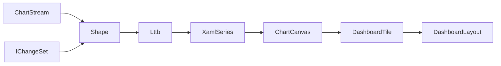

# [APPUI_CHARTS_DASHBOARDS]

One LiveCharts rail carries every Rasm.AppUi visualization: `ChartSeriesSpec` is the fifteen-row series axis dispatching onto four `ChartCanvas` rows, `ChartAxisKind` owns the five scale rows, one `ChartPolicy` record owns interaction and styling keys, `ChartStream` rows bind `DataSource` feeds through window and downsampling folds, and `DashboardTile` composes boards persisted as versioned `DashboardLayout` blobs. The package spine is LiveCharts on the admitted Skia stack over DynamicData change-sets; paints, motion, and label roles arrive as token keys resolved at mount; capture and export are consumed rails. Benchmark and activity-timeline dashboards are named layout rows over the analytical and receipt feeds.

## [1]-[INDEX]

| [INDEX] | [CLUSTER]         | [OWNS]                                                             |
| :-----: | ----------------- | ------------------------------------------------------------------ |
|   [1]   | SERIES_TABLE      | Fifteen series rows; canvas dispatch; geo asset-key column         |
|   [2]   | AXES_SECTIONS     | Five scale rows; label formats; sections; shared-scale pairing     |
|   [3]   | CHART_INTERACTION | One policy record; zoom, anchors, intent routing, dashboard canvas |
|   [4]   | STREAM_BINDING    | Feed rows; window expiry; downsampling fold; sync law              |
|   [5]   | DASHBOARD_TILES   | Tile union; placement fold; named dashboards; layout persistence   |

## [2]-[SERIES_TABLE]

- Owner: `ChartSeriesSpec`
- Cases: line, step-line, scatter, column, row, stacked-area, stacked-column, heat, candlestick, box, pie, polar-line, gauge-angular, gauge-background, geo-map — canvas rows cartesian, pie, polar, map materialize as `CartesianChart`, `PieChart`, `PolarChart`, `GeoMap` control templates selected by the `ChartCanvas` key.
- Packages: LiveChartsCore.SkiaSharpView.Avalonia, Thinktecture.Runtime.Extensions, LanguageExt.Core
- Growth: a new visualization is one `ChartSeriesSpec` row and a new chart family is one `ChartCanvas` row; zero new surface.
- Boundary: typed row models project through `ValuesMap` on each `XamlSeries` instance materialized per tile from the row delegate, never shared across charts; the geo row carries an absent series delegate and a `GeoAssetKey` resolved by key through the asset rank fold — chart code never opens files; gauge accessory visuals `XamlNeedle` and `XamlAngularTicks` ride the gauge rows as canvas children; series paints resolve from the `ChartPolicy` paint-family ramp indexed per series instance; per-chart wrapper controls, hand-drawn chart code, and a second charting package are the deleted patterns.

```csharp signature
public sealed class ChartKeyPolicy : IEqualityComparerAccessor<string>, IComparerAccessor<string> {
    public static IEqualityComparer<string> EqualityComparer => StringComparer.Ordinal;

    public static IComparer<string> Comparer => StringComparer.Ordinal;
}

[SmartEnum<string>(SwitchMethods = SwitchMapMethodsGeneration.None, MapMethods = SwitchMapMethodsGeneration.None)]
[KeyMemberEqualityComparer<ChartKeyPolicy, string>]
[KeyMemberComparer<ChartKeyPolicy, string>]
public sealed partial class ChartCanvas {
    public static readonly ChartCanvas Cartesian = new("cartesian");
    public static readonly ChartCanvas Pie = new("pie");
    public static readonly ChartCanvas Polar = new("polar");
    public static readonly ChartCanvas Map = new("map");
}

[SmartEnum<string>(SwitchMethods = SwitchMapMethodsGeneration.None, MapMethods = SwitchMapMethodsGeneration.None)]
[KeyMemberEqualityComparer<ChartKeyPolicy, string>]
[KeyMemberComparer<ChartKeyPolicy, string>]
public sealed partial class ChartSeriesSpec {
    public static readonly ChartSeriesSpec Line = new("line", canvas: ChartCanvas.Cartesian, series: static () => new XamlLineSeries(), geoAssetKey: null);
    public static readonly ChartSeriesSpec StepLine = new("step-line", canvas: ChartCanvas.Cartesian, series: static () => new XamlStepLineSeries(), geoAssetKey: null);
    public static readonly ChartSeriesSpec Scatter = new("scatter", canvas: ChartCanvas.Cartesian, series: static () => new XamlScatterSeries(), geoAssetKey: null);
    public static readonly ChartSeriesSpec Column = new("column", canvas: ChartCanvas.Cartesian, series: static () => new XamlColumnSeries(), geoAssetKey: null);
    public static readonly ChartSeriesSpec Row = new("row", canvas: ChartCanvas.Cartesian, series: static () => new XamlRowSeries(), geoAssetKey: null);
    public static readonly ChartSeriesSpec StackedArea = new("stacked-area", canvas: ChartCanvas.Cartesian, series: static () => new XamlStackedAreaSeries(), geoAssetKey: null);
    public static readonly ChartSeriesSpec StackedColumn = new("stacked-column", canvas: ChartCanvas.Cartesian, series: static () => new XamlStackedColumnSeries(), geoAssetKey: null);
    public static readonly ChartSeriesSpec Heat = new("heat", canvas: ChartCanvas.Cartesian, series: static () => new XamlHeatSeries(), geoAssetKey: null);
    public static readonly ChartSeriesSpec Candlestick = new("candlestick", canvas: ChartCanvas.Cartesian, series: static () => new XamlCandlesticksSeries(), geoAssetKey: null);
    public static readonly ChartSeriesSpec Box = new("box", canvas: ChartCanvas.Cartesian, series: static () => new XamlBoxSeries(), geoAssetKey: null);
    public static readonly ChartSeriesSpec Pie = new("pie", canvas: ChartCanvas.Pie, series: static () => new XamlPieSeries(), geoAssetKey: null);
    public static readonly ChartSeriesSpec PolarLine = new("polar-line", canvas: ChartCanvas.Polar, series: static () => new XamlPolarLineSeries(), geoAssetKey: null);
    public static readonly ChartSeriesSpec GaugeAngular = new("gauge-angular", canvas: ChartCanvas.Pie, series: static () => new XamlAngularGaugeSeries(), geoAssetKey: null);
    public static readonly ChartSeriesSpec GaugeBackground = new("gauge-background", canvas: ChartCanvas.Pie, series: static () => new XamlGaugeBackgroundSeries(), geoAssetKey: null);
    public static readonly ChartSeriesSpec Geo = new("geo-map", canvas: ChartCanvas.Map, series: null, geoAssetKey: "GeoWorld");

    private readonly Func<XamlSeries>? series;
    private readonly string? geoAssetKey;

    public ChartCanvas Canvas { get; }

    public Option<Func<XamlSeries>> Series => Optional(series);

    public Option<string> GeoAssetKey => Optional(geoAssetKey);
}
```

## [3]-[AXES_SECTIONS]

- Owner: `ChartAxisKind`
- Cases: numeric, instant, duration, logarithmic, polar — mapping to `XamlAxis`, `XamlDateTimeAxis`, `XamlTimeSpanAxis`, `XamlLogarithmicAxis`, `XamlPolarAxis`, with the polar row riding `PolarAxesCollection` on the polar canvas and all cartesian rows riding `AxesCollection`.
- Packages: LiveChartsCore.SkiaSharpView.Avalonia, NodaTime, Thinktecture.Runtime.Extensions, BCL inbox
- Growth: a new scale is one `ChartAxisKind` row; a new threshold band is one `ChartSection` value on its chart's policy; zero new surface.
- Boundary: axis labels format through `CompositeFormat.Parse` over the row `LabelFormat` — the only runtime-format path; `Instant` and `Duration` values cross to BCL axis representations only at the bind edge and `ClockPolicy.Admit` owns the inbound direction; `ChartPolicy.ScaleGroup` pairs axes across charts under one shared min-max fold per group key; sections render through `SectionsCollection` with paints resolved from `ChartSection.PaintKey`; crosshair and separator paints resolve from the `ChartPolicy.GridRole` token key.

```csharp signature
[SmartEnum<string>(SwitchMethods = SwitchMapMethodsGeneration.None, MapMethods = SwitchMapMethodsGeneration.None)]
[KeyMemberEqualityComparer<ChartKeyPolicy, string>]
[KeyMemberComparer<ChartKeyPolicy, string>]
public sealed partial class ChartAxisKind {
    public static readonly ChartAxisKind Numeric = new("numeric", labelFormat: "{0:G6}");
    public static readonly ChartAxisKind Instant = new("instant", labelFormat: "{0:HH:mm:ss}");
    public static readonly ChartAxisKind Duration = new("duration", labelFormat: "{0:c}");
    public static readonly ChartAxisKind Logarithmic = new("logarithmic", labelFormat: "{0:E2}");
    public static readonly ChartAxisKind Polar = new("polar", labelFormat: "{0:G4}");

    public string LabelFormat { get; }
}

public readonly record struct ChartSection(double From, double To, string PaintKey);
```

## [4]-[CHART_INTERACTION]

- Owner: `ChartPolicy`
- Cases: `ChartAnchor` rows hidden, top, bottom, left, right, auto — one anchor vocabulary shared by the tooltip and legend columns.
- Packages: PanAndZoom, LiveChartsCore.SkiaSharpView.Avalonia, Thinktecture.Runtime.Extensions, LanguageExt.Core
- Growth: a new interaction posture is one `ChartPolicy` value row; a new overlay verb is one CommandIntent table row the chart raises by key; zero new surface.
- Boundary: `ZoomX`/`ZoomY` compose into the chart `ZoomMode` value and the anchors map onto `TooltipPosition` and `LegendPosition` at the bind edge — the measure-enum spellings are research-gated; `VisualElements` overlays route `VisualElementsPointerDown` to the `PointerIntent` CommandIntent key, never a local handler; `AnimationsSpeed` and easing derive from the `MotionKey` motion row, and a second animation vocabulary is the deleted pattern; the dashboard canvas is one `ZoomBorder` — gestures ride `EnableGestures`, fit is `AutoFit`, focus is `ZoomToRectangle`, traversal is `NavigateBack`/`NavigateForward`, and `ZoomBorderState` round-trips through `ImportState` into `DashboardLayout.CanvasState`; `MotionKey`, `LabelRole`, `GridRole`, and `PaintFamily` values are row keys in the motion, typography, and token vocabularies resolved at mount; tooltip and legend text paints resolve from the `LabelRole` typography key.

```csharp signature
[SmartEnum<string>]
[KeyMemberEqualityComparer<ChartKeyPolicy, string>]
[KeyMemberComparer<ChartKeyPolicy, string>]
public sealed partial class ChartAnchor {
    public static readonly ChartAnchor Hidden = new("hidden");
    public static readonly ChartAnchor Top = new("top");
    public static readonly ChartAnchor Bottom = new("bottom");
    public static readonly ChartAnchor Left = new("left");
    public static readonly ChartAnchor Right = new("right");
    public static readonly ChartAnchor Auto = new("auto");
}

public sealed record ChartPolicy(
    ChartAxisKind XAxis,
    ChartAxisKind YAxis,
    Seq<ChartSection> Sections,
    bool ZoomX,
    bool ZoomY,
    ChartAnchor Tooltip,
    ChartAnchor Legend,
    Option<string> ScaleGroup,
    Option<string> PointerIntent,
    string MotionKey,
    string LabelRole,
    string GridRole,
    string PaintFamily) {
    public static readonly ChartPolicy Dashboard = new(
        XAxis: ChartAxisKind.Instant,
        YAxis: ChartAxisKind.Numeric,
        Sections: default,
        ZoomX: true,
        ZoomY: false,
        Tooltip: ChartAnchor.Auto,
        Legend: ChartAnchor.Hidden,
        ScaleGroup: None,
        PointerIntent: None,
        MotionKey: "standard",
        LabelRole: "caption",
        GridRole: "non-text",
        PaintFamily: "accent");
}
```

## [5]-[STREAM_BINDING]

- Owner: `ChartStream`
- Cases: feed rows compute-receipt-stream, persistence-analytical, host-document-events, fake-deterministic — each row binds one `DataSource` case with its window, bucket, and cadence values.
- Entry: `public static Seq<T> Lttb<T>(Seq<T> points, int buckets, Func<T, (double X, double Y)> project)` — the pure largest-triangle-three-buckets fold; below three buckets the stream binds change-for-change.
- Packages: DynamicData, NodaTime, LanguageExt.Core, BCL inbox
- Growth: a new feed class is one `ChartStream` row in the feed table; a new bound is one policy value on its row; zero new surface.
- Boundary: `SourceKey` names the feed row whose typed `DataSource` case the screen catalog binds — the stream record carries policy values, never the typed source; window expiry composes `ExpireAfter` over the source change-set; the bind edge materializes the window snapshot, applies `Lttb`, and swaps series values inside the chart `SyncContext` lock — the concurrent-mutation law; scheduler placement stays inside the live-data binding capsule, so `ObserveOn` is composed exactly once and never re-applied here; gauge feeds assign `GaugeValue` and call `Invalidate` per swap; `Cadence` throttles bind refresh and rows with no cadence bind change-for-change.

```csharp signature
public sealed record ChartStream(
    string Key,
    string SourceKey,
    Option<Duration> Window,
    int Buckets,
    Option<Duration> Cadence);

public static class ChartFolds {
    public static IObservable<IChangeSet<T, TKey>> Shape<T, TKey>(ChartStream stream, IObservable<IChangeSet<T, TKey>> source) where TKey : notnull =>
        stream.Window
            .Map(window => source.ExpireAfter(_ => window.ToTimeSpan()))
            .IfNone(source);

    public static Seq<T> Lttb<T>(Seq<T> points, int buckets, Func<T, (double X, double Y)> project) =>
        buckets < 3 || points.Count <= buckets
            ? points
            : Enumerable.Range(1, buckets - 2)
                .Aggregate(
                    (Acc: Seq<T>().Add(points[0]), Anchor: project(points[0])),
                    (state, bucket) => Some((
                            Lo: 1 + (((bucket - 1) * (points.Count - 2)) / (buckets - 2)),
                            Hi: 1 + ((bucket * (points.Count - 2)) / (buckets - 2)),
                            End: Math.Min(1 + (((bucket + 1) * (points.Count - 2)) / (buckets - 2)), points.Count - 1)))
                        .Map(window => (
                            Window: window,
                            Mean: points.Skip(window.Hi).Take(window.End - window.Hi)
                                .Fold((X: 0d, Y: 0d, N: 0d), (sum, point) => (X: sum.X + project(point).X, Y: sum.Y + project(point).Y, N: sum.N + 1d))))
                        .Map(step => (
                            step.Window,
                            Target: step.Mean.N == 0d
                                ? project(points[points.Count - 1])
                                : (X: step.Mean.X / step.Mean.N, Y: step.Mean.Y / step.Mean.N)))
                        .Map(step => points.Skip(step.Window.Lo).Take(step.Window.Hi - step.Window.Lo)
                            .Fold(
                                (Best: -1d, Pick: points[step.Window.Lo]),
                                (best, candidate) => Area(state.Anchor, project(candidate), step.Target) > best.Best
                                    ? (Best: Area(state.Anchor, project(candidate), step.Target), Pick: candidate)
                                    : best))
                        .Map(peak => (Acc: state.Acc.Add(peak.Pick), Anchor: project(peak.Pick)))
                        .IfNone(state))
                .Acc
                .Add(points[points.Count - 1]);

    internal static double Area((double X, double Y) a, (double X, double Y) b, (double X, double Y) c) =>
        Math.Abs(((a.X - c.X) * (b.Y - a.Y)) - ((a.X - b.X) * (c.Y - a.Y))) * 0.5;
}
```

| [INDEX] | [FEED_ROW]             | [SOURCE_CASE]        | [WINDOW] | [BUCKETS] | [CADENCE] |
| :-----: | ---------------------- | -------------------- | :------: | :-------: | :-------: |
|   [1]   | compute-receipt-stream | ComputeReceiptStream | 120 s    | 512       | 250 ms    |
|   [2]   | persistence-analytical | PersistenceQuery     | none     | 0         | 1 s       |
|   [3]   | host-document-events   | HostDocumentEvents   | 300 s    | 256       | 500 ms    |
|   [4]   | fake-deterministic     | FakeDeterministic    | none     | 0         | none      |

Window, bucket, and cadence values live on these rows and nowhere else; a bucket value below three is the passthrough case the `Lttb` guard encodes.



## [6]-[DASHBOARD_TILES]

- Owner: `DashboardTile`
- Cases: `DashboardTile.Chart` | `DashboardTile.Stat` | `DashboardTile.Gauge` | `DashboardTile.Table`; named dashboards benchmark and activity-timeline.
- Entry: `public static Fin<Seq<(TilePlacement Placement, DashboardTile Tile)>> Resolve(DashboardLayout layout, HashMap<string, DashboardTile> tiles)` — `Fin<T>` aborts on the first unresolved tile key.
- Packages: Thinktecture.Runtime.Extensions, LanguageExt.Core, SkiaSharp
- Growth: a new tile kind is one `DashboardTile` case; a new dashboard is one `DashboardLayout` row; zero new surface.
- Boundary: layout blobs persist as opaque versioned snapshots through the persistence port on the dock-layout law — `Version` gates restore and a mismatch falls back to the named dashboard row; board capture projects to `SKImage` and hands off to the offscreen encode rows, so export is consumed and never re-owned; the headless render hash per named dashboard row is the visual proof lane; benchmark and activity-timeline rows read HLC-ordered receipt envelopes, and the skew-uncertainty band arrives as a consumed series feed from the evidence join; a dashboard layout engine is the deleted pattern — one placement fold inside the dock rail.

```csharp signature
[Union(ConversionFromValue = ConversionOperatorsGeneration.None)]
public abstract partial record DashboardTile {
    private DashboardTile() { }

    public sealed record Chart(string Key, ChartSeriesSpec Spec, ChartPolicy Policy, ChartStream Stream) : DashboardTile;

    public sealed record Stat(string Key, string Label, ChartStream Stream) : DashboardTile;

    public sealed record Gauge(string Key, double Floor, double Ceiling, ChartStream Stream) : DashboardTile;

    public sealed record Table(string Key, string TableKey) : DashboardTile;
}

public readonly record struct TilePlacement(string TileKey, int Column, int Row, int ColumnSpan, int RowSpan);

public sealed record DashboardLayout(string Key, int Version, Seq<TilePlacement> Placements, Option<string> CanvasState) {
    public static Fin<DashboardLayout> Admit(string key, int version, Seq<TilePlacement> placements, Option<string> canvasState = default) =>
        placements.Map(static p => p.TileKey).Distinct().Count == placements.Count
            ? Fin.Succ(new DashboardLayout(key, version, placements, canvasState))
            : Fin.Fail<DashboardLayout>(Error.New($"<duplicate-tile:{key}>"));
}

public static class DashboardSurface {
    public static Fin<Seq<(TilePlacement Placement, DashboardTile Tile)>> Resolve(DashboardLayout layout, HashMap<string, DashboardTile> tiles) =>
        layout.Placements
            .TraverseM(placement => tiles.Find(placement.TileKey) is { IsSome: true, Case: DashboardTile tile }
                ? Fin.Succ((Placement: placement, Tile: tile))
                : Fin.Fail<(TilePlacement Placement, DashboardTile Tile)>(Error.New($"<missing-tile:{placement.TileKey}>")))
            .As();
}
```

| [INDEX] | [DASHBOARD_ROW]   | [TILES]                  | [FEEDS]                                         |
| :-----: | ----------------- | ------------------------ | ----------------------------------------------- |
|   [1]   | benchmark         | column + box + stat      | persistence-analytical                          |
|   [2]   | activity-timeline | step-line + heat + table | compute-receipt-stream + persistence-analytical |

## [7]-[RESEARCH]

| [INDEX] | [ITEM]                                                                                  | [PROOF]                                                                                       | [GATE]            |
| :-----: | ---------------------------------------------------------------------------------------- | ---------------------------------------------------------------------------------------------- | ----------------- |
|   [1]   | LiveCharts net8-asset render fidelity on the net10 Avalonia 12 host across all fifteen series rows | uv run python -m tools.assay test run --target Rasm.AppUi — headless Skia render-hash sweep per `ChartSeriesSpec` row | SERIES_TABLE      |
|   [2]   | Heat-land geo series payload and the `GeoMap` series-property spelling for the map canvas | uv run python -m tools.assay api query livecharts GeoMap                                        | SERIES_TABLE      |
|   [3]   | Measure-enum spellings behind `ZoomMode`, `TooltipPosition`, and `LegendPosition` for the bind-edge mapping | uv run python -m tools.assay api query livecharts SourceGenCartesianChart                       | CHART_INTERACTION |
|   [4]   | `SyncContext` lock-object contract and the `SeriesSource`/`SeriesTemplate` binding shape under streamed mutation | uv run python -m tools.assay api query livecharts SourceGenChart                                | STREAM_BINDING    |
