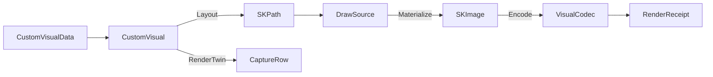

# [APPUI_CUSTOM_VISUALS]

Custom visuals are the package's Skia layout-algebra rail for the four diagram kinds LiveCharts structurally cannot supply: `CustomVisual` is the four-case union (sankey, treemap, waterfall, funnel) whose every case is a pure layout fold from `CustomVisualData` to an `SKPath` run, materialized through the one offscreen draw capsule and sealed as a per-cell render-hash twin; `ColorSpaceAxis` is the single suite-wide wide-gamut vocabulary the codec working-space consumes. The page owns the custom-visual union, its layout-fold and render-twin algebra, the synthesized live-region peer binding, and the four-row color-space axis the encode identity tags. The package spine is SkiaSharp path geometry behind the `DrawSource.Owned` capsule and the `VisualCodec` encode path; paints, label fonts, automation peers, and capture lanes arrive as settled vocabulary and are never re-minted here.

## [1]-[INDEX]

| [INDEX] | [CLUSTER]   | [OWNS]                                                          |
| :-----: | :---------- | :------------------------------------------------------------- |
|   [1]   | SKIA_KINDS  | Four custom-visual cases; layout folds; render-hash twins      |
|   [2]   | COLOR_SPACE | Four wide-gamut rows; working-space factory; encode-format tag |

## [2]-[SKIA_KINDS]

- Owner: `CustomVisual` [Union] · `CustomVisualData` · `CustomVisuals`
- Cases: Sankey · Treemap · Waterfall · Funnel
- Entry: `public IO<RenderReceipt> Materialize(VisualRuntime runtime, CustomVisualData data, SKImageInfo info, ColorSpaceAxis space)` — IO rail through the settled encode fold; `public static TelemetryContributorPort TelemetryRow(string version)` — the one contribution surface for the rendered and layout-elapsed instruments
- Auto: each case carries one pure `Func<CustomVisualData, SKImageInfo, Fin<SKPath>>` layout fold resolved at declaration — the sankey fold cubic-bridges weighted ribbons, the treemap fold squarified-rect packs the node weights through the Bruls worst-aspect-ratio row algebra that grows a row while the worst rect aspect ratio improves and flips the layout-row orientation on the shorter box side toward unit aspect, the waterfall fold bridges signed delta columns, the funnel fold trapezoids the descending stage widths; `Materialize` marks the clock around the layout fold and folds the elapsed onto the layout-elapsed instrument through `runtime.Measure` distinctly from the encode-elapsed, composing the fold through `DrawSource.Owned.Materialize` so the projected `SKPath` rasters onto an owned `SKImage` and never a host lease; the render-twin derives its `CaptureRow` from the same `Key` and the resolved `(ThemeVariantRow, DensityRow)` cell exactly as `ChartSeriesSpec.Baseline` does, so the proof lane captures the same materialized kind through `CaptureRenderedFrame` and the `FrameHash` baseline derives from one row with no parallel fixture.
- Receipt: every materialize lands one `RenderReceipt` of kind custom-visual carrying the blob artifact key as its destination and the `ColorSpaceAxis` row key as its `ColorSpace` tag; `TelemetryRow` contributes the rendered count and the layout-elapsed duration inward through the AppHost `TelemetryContributorPort`, the layout-fold duration measured around `Layout` distinctly from the encode-elapsed the encode receipt carries, so a slow pack folds onto the layout-elapsed instrument and never blurs into encode cost.
- Packages: SkiaSharp, Thinktecture.Runtime.Extensions, LanguageExt.Core, NodaTime
- Growth: a new diagram kind is one `CustomVisual` case breaking the `Key` and `Layout` dispatch at compile time; a sixth kind carries its render-hash baseline by construction of the same fold; zero new surface.
- Boundary: `CustomVisual` mints zero Skia-surface, encode, placement, or peer owner — the layout fold composes through `DrawSource.Owned.Materialize` (the only Skia-surface owner) exactly as `PreviewRow.Render` does, `VisualCodec.Encode` is the only encode path, `DashboardTile.Custom` places a kind in a board, and the `custom-visual` `AnnouncementRow` synthesized row gives each kind its live-region peer through the one `ControlAutomationPeer` synthesized-peer construction; the projected `SKPath` is using-scoped inside the fold and never outlives the materialize so a layout fault leaks no native handle; ribbon and trapezoid fills resolve from `TokenRow` paint keys as `SKColorF` token paints under the color-managed law and stage labels shape through the typography rail's `DrawShapedText` so glyphs raster through HarfBuzz, never a raw `DrawText` loop or a sRGB-quantized fill; gradient ribbons enter through `SKShader.CreateLinearGradient(SKPoint, SKPoint, SKColorF[], SKColorSpace, SKShaderTileMode)` so a wide-gamut ramp stays float end-to-end; the layout folds are managed Skia geometry only and carry no native, bridge, or live-host probe and cross no TS wire — `CustomVisual`, `CustomVisualData`, `CustomVisuals`, and `ColorSpaceAxis` are host-local desktop-Skia owners with no browser or peer crossing, so the page authors no `TS_PROJECTION` cluster; a custom-tile dashboard feed crosses only as the already-projected `EvidenceTimeline`/`RenderReceipt` evidence wire on diagnostics-evidence#TS_PROJECTION and any remote numeric input arrives through the existing Compute remote-lane#PROTO_VOCABULARY `Solve` rpc, never a new AppUi wire shape — a custom-visual wire contract is the deleted form; each materialize folds one observation into the rendered count and the measured layout-fold duration into the layout-elapsed instrument through the one `AppUiTelemetry.Contribute` spine, so a custom-tile render contributes through `TelemetryContributorPort` and a layout-local meter is the deleted form; a fork of `ChartSeriesSpec` for these kinds, a hand-rolled diagram control, and a second Skia-surface owner are the deleted patterns.

```csharp signature
public sealed record CustomVisualData(
    string Key,
    Seq<(int From, int To, double Weight)> Flows,
    Seq<(string Label, double Value)> Nodes,
    Seq<(string Label, double Delta, bool Total)> Steps,
    string PaintFamily,
    string LabelRole);

[Union(ConversionFromValue = ConversionOperatorsGeneration.None)]
public abstract partial record CustomVisual {
    private CustomVisual() { }
    public sealed record Sankey(string Key, Func<CustomVisualData, SKImageInfo, Fin<SKPath>> Fold) : CustomVisual;
    public sealed record Treemap(string Key, Func<CustomVisualData, SKImageInfo, Fin<SKPath>> Fold) : CustomVisual;
    public sealed record Waterfall(string Key, Func<CustomVisualData, SKImageInfo, Fin<SKPath>> Fold) : CustomVisual;
    public sealed record Funnel(string Key, Func<CustomVisualData, SKImageInfo, Fin<SKPath>> Fold) : CustomVisual;

    public string Key => Switch(
        sankey: static s => s.Key,
        treemap: static t => t.Key,
        waterfall: static w => w.Key,
        funnel: static f => f.Key);

    public Fin<SKPath> Layout(CustomVisualData data, SKImageInfo info) => Switch(
        state: (Data: data, Info: info),
        sankey: static (ctx, s) => s.Fold(ctx.Data, ctx.Info),
        treemap: static (ctx, t) => t.Fold(ctx.Data, ctx.Info),
        waterfall: static (ctx, w) => w.Fold(ctx.Data, ctx.Info),
        funnel: static (ctx, f) => f.Fold(ctx.Data, ctx.Info));

    public IO<RenderReceipt> Materialize(VisualRuntime runtime, CustomVisualData data, SKImageInfo info, ColorSpaceAxis space) =>
        from mark in IO.lift(runtime.Clocks.Mark)
        from image in IO.lift(() => new DrawSource.Owned(info.WithColorSpace(space.Working()))
            .Materialize(canvas => Layout(data, info).Bind(path => {
                using SKPath scoped = path;
                using SKPaint paint = new() { IsAntialias = true, Style = SKPaintStyle.Fill };
                canvas.DrawPath(scoped, paint);
                return FinSucc(unit);
            })).ThrowIfFail())
        from layout in IO.lift(() => runtime.Clocks.Elapsed(mark))
        from _ in runtime.Measure(CustomVisuals.LayoutInstrument, Key, layout)
        from receipt in VisualCodec.Encode(runtime, image, space.Encode, CustomVisuals.Kind, $"custom-visuals/{Key}@{space.Key}.png")
        select receipt;

    public CaptureRow RenderTwin((ThemeVariantRow Variant, DensityRow Density) cell, double scale,
        Func<CustomVisual, (ThemeVariantRow, DensityRow), Func<double, Func<IO<Unit>>, IO<SKImage>>> grab) =>
        new($"{Key}@{cell.Variant.Key}-{cell.Density.Key}", static host => host is SurfaceHost.Headless, scale, 1, grab(this, cell));
}

public static class CustomVisuals {
    public const string Kind = "custom-visual";
    public const string RenderedInstrument = "rasm.appui.customvisual.rendered";
    public const string LayoutInstrument = "rasm.appui.customvisual.layout-elapsed";

    public static TelemetryContributorPort TelemetryRow(string version) =>
        AppUiTelemetry.Contribute(version, RenderedInstrument, LayoutInstrument);

    public static readonly CustomVisual Sankey = new CustomVisual.Sankey("sankey", static (data, info) =>
        data.Flows.Fold(Fin.Succ(new SKPath()), (rail, flow) => rail.Map(path => {
            float lane = info.Height / (float)(data.Nodes.Count + 1);
            float x0 = 0f, x1 = info.Width;
            float y0 = lane * (flow.From + 1), y1 = lane * (flow.To + 1);
            float thickness = (float)(flow.Weight) * lane * 0.5f;
            path.MoveTo(x0, y0 - thickness);
            path.CubicTo(info.Width * 0.5f, y0 - thickness, info.Width * 0.5f, y1 - thickness, x1, y1 - thickness);
            path.LineTo(x1, y1 + thickness);
            path.CubicTo(info.Width * 0.5f, y1 + thickness, info.Width * 0.5f, y0 + thickness, x0, y0 + thickness);
            path.Close();
            return path;
        })));

    public static readonly CustomVisual Treemap = new CustomVisual.Treemap("treemap", static (data, info) =>
        Squarify(data.Nodes, new SKRect(0f, 0f, info.Width, info.Height)).Map(rects =>
            rects.Fold(new SKPath(), static (path, rect) => { path.AddRect(rect, SKPathDirection.Clockwise); return path; })));

    public static readonly CustomVisual Waterfall = new CustomVisual.Waterfall("waterfall", static (data, info) =>
        Fin.Succ(data.Steps.Fold(
                (Path: new SKPath(), Cursor: 0d, Index: 0),
                (state, step) => {
                    float width = info.Width / (float)data.Steps.Count;
                    float x = state.Index * width;
                    float baseTop = (float)(info.Height - (state.Cursor / data.Steps.Count * info.Height));
                    float top = step.Total ? 0f : baseTop;
                    float bottom = step.Total ? info.Height : (float)(info.Height - ((state.Cursor + step.Delta) / data.Steps.Count * info.Height));
                    state.Path.AddRect(new SKRect(x, Math.Min(top, bottom), x + width * 0.8f, Math.Max(top, bottom)), SKPathDirection.Clockwise);
                    return (state.Path, Cursor: step.Total ? 0d : state.Cursor + step.Delta, Index: state.Index + 1);
                })
            .Path));

    public static readonly CustomVisual Funnel = new CustomVisual.Funnel("funnel", static (data, info) =>
        Fin.Succ(data.Nodes.Fold(
                (Path: new SKPath(), Top: 0f, Index: 0),
                (state, node) => {
                    float bandHeight = info.Height / (float)data.Nodes.Count;
                    float bottom = state.Top + bandHeight;
                    float topWidth = (float)(node.Value) * info.Width;
                    float nextWidth = state.Index + 1 < data.Nodes.Count ? (float)(data.Nodes[state.Index + 1].Value) * info.Width : topWidth;
                    float center = info.Width * 0.5f;
                    state.Path.MoveTo(center - topWidth * 0.5f, state.Top);
                    state.Path.LineTo(center + topWidth * 0.5f, state.Top);
                    state.Path.LineTo(center + nextWidth * 0.5f, bottom);
                    state.Path.LineTo(center - nextWidth * 0.5f, bottom);
                    state.Path.Close();
                    return (state.Path, Top: bottom, Index: state.Index + 1);
                })
            .Path));

    static Fin<Seq<SKRect>> Squarify(Seq<(string Label, double Value)> nodes, SKRect bounds) {
        double total = nodes.Sum(static n => n.Value);
        if (total <= 0d) return Fin.Fail<Seq<SKRect>>(Error.New("custom-visual/treemap-empty: node weights sum to zero"));
        double area = bounds.Width * bounds.Height;
        Seq<double> scaled = nodes.OrderByDescending(static n => n.Value).Map(n => n.Value / total * area).ToSeq();
        return Fin.Succ(Pack(scaled, Seq<double>(), bounds, Seq<SKRect>()));
    }

    static double Worst(Seq<double> row, double side, double withCandidate) {
        Seq<double> trial = withCandidate <= 0d ? row : row.Add(withCandidate);
        if (trial.IsEmpty) return double.PositiveInfinity;
        double sum = trial.Sum(), max = trial.Max(), min = trial.Min(), s2 = sum * sum, w2 = side * side;
        return Math.Max(w2 * max / s2, s2 / (w2 * min));
    }

    static Seq<SKRect> Pack(Seq<double> remaining, Seq<double> row, SKRect box, Seq<SKRect> placed) {
        float side = Math.Min(box.Width, box.Height);
        if (remaining.IsEmpty)
            return row.IsEmpty ? placed : placed + LayoutRow(row, box, side).Rects;
        double head = remaining.Head;
        return Worst(row, side, 0d) >= Worst(row, side, head) || row.IsEmpty
            ? Pack(remaining.Tail, row.Add(head), box, placed)
            : Pack(remaining, Seq<double>(), LayoutRow(row, box, side).Rest, placed + LayoutRow(row, box, side).Rects);
    }

    static (Seq<SKRect> Rects, SKRect Rest) LayoutRow(Seq<double> row, SKRect box, float side) {
        double rowSum = row.Sum();
        float thickness = (float)(rowSum / side);
        bool vertical = box.Width >= box.Height;
        var built = row.Fold(
            (Rects: Seq<SKRect>(), Offset: vertical ? box.Top : box.Left),
            (state, cell) => {
                float extent = (float)(cell / rowSum * side);
                SKRect rect = vertical
                    ? new SKRect(box.Left, state.Offset, box.Left + thickness, state.Offset + extent)
                    : new SKRect(state.Offset, box.Top, state.Offset + extent, box.Top + thickness);
                return (state.Rects.Add(rect), state.Offset + extent);
            });
        SKRect rest = vertical
            ? new SKRect(box.Left + thickness, box.Top, box.Right, box.Bottom)
            : new SKRect(box.Left, box.Top + thickness, box.Right, box.Bottom);
        return (built.Rects, rest);
    }
}
```



| [INDEX] | [KIND]    | [DATA_FIELD] | [LAYOUT_PRIMITIVE]              |
| :-----: | :-------- | :----------- | :----------------------------- |
|   [1]   | sankey    | Flows        | cubic ribbon `SKPath.CubicTo`  |
|   [2]   | treemap   | Nodes        | squarified `SKPath.AddRect`    |
|   [3]   | waterfall | Steps        | bridged column `SKPath.AddRect`|
|   [4]   | funnel    | Nodes        | trapezoid `SKPath.LineTo`      |

## [3]-[COLOR_SPACE]

- Owner: `ColorSpaceAxis` SmartEnum · `ColorSpaceKeyPolicy` comparer accessor
- Cases: srgb · display-p3 · rec2020 · scrgb-float — the baseline plus three wide-gamut rows
- Entry: `public SKColorSpace Working()` — the working-space factory per row; the `Encode` member projects the row onto the codec encode policy
- Auto: each row carries the `Func<SKColorSpace>` working-space factory and the `SKColorType` surface format the encode loop selects — the srgb, display-p3, and rec2020 rows tag ICC primaries through `SKColorSpace.CreateRgb(SKColorSpaceTransferFn, SKColorSpaceXyz)` on the `Rgba8888` byte surface, and the scrgb-float row carries `SKColorSpace.CreateSrgbLinear` on the `RgbaF16` float surface; the row's `Encode` member yields the matching `VisualCodec.EncodeRow` whose `ColorPolicy` reproject pins the output space, so a materialize tags its `RenderReceipt.ColorSpace` with the exact gamut and a cross-host byte swap is attributable to one of four spaces, never silent.
- Packages: SkiaSharp, SkiaSharp.NativeAssets.macOS, Thinktecture.Runtime.Extensions, LanguageExt.Core
- Growth: a new gamut is one `ColorSpaceAxis` row carrying its working-space factory, surface format, and encode row; zero new surface.
- Boundary: `ColorSpaceAxis` is the single suite-wide gamut vocabulary — `VisualCodec.ColorPolicy` consumes it through the `DisplayP3`/`Rec2020`/`ScrgbFloat` policy rows the encode identity carries and the `RenderReceipt.ColorSpace` field tags it, so a parallel `Gamut` enum or a per-encode color struct is the deleted form; the working space converts once at projection through `SKImageInfo.WithColorSpace` and `SKColorSpace.Equal` is the only identity test the reproject runs fail-closed against an already-matching space; the ICC-primary path uses `SKColorSpaceXyz.DisplayP3` and `SKColorSpaceXyz.Rec2020` with `SKColorSpaceTransferFn.Srgb` for the display-referred rows and `SKColorSpaceTransferFn.Linear` with `SKColorSpaceXyz.Srgb` for the scene-referred float row, so the byte `SKColor` path that assumes sRGB and quantizes before conversion is the deleted form and a wide-gamut custom visual hashes its float or ICC-tagged pixels, never a quantized sRGB shadow; the gamut row key crosses no TS wire on its own — it tags `RenderReceipt.ColorSpace` which crosses host-local only as the existing evidence wire on diagnostics-evidence#TS_PROJECTION, so `ColorSpaceAxis` authors no `TS_PROJECTION` cluster.

```csharp signature
public sealed class ColorSpaceKeyPolicy : IEqualityComparerAccessor<string>, IComparerAccessor<string> {
    public static IEqualityComparer<string> EqualityComparer => StringComparer.Ordinal;
    public static IComparer<string> Comparer => StringComparer.Ordinal;
}

[SmartEnum<string>(SwitchMethods = SwitchMapMethodsGeneration.None, MapMethods = SwitchMapMethodsGeneration.None)]
[KeyMemberEqualityComparer<ColorSpaceKeyPolicy, string>]
[KeyMemberComparer<ColorSpaceKeyPolicy, string>]
public sealed partial class ColorSpaceAxis {
    public static readonly ColorSpaceAxis Srgb = new("srgb",
        working: static () => SKColorSpace.CreateSrgb(),
        surface: SKColorType.Rgba8888,
        encode: VisualCodec.Png);
    public static readonly ColorSpaceAxis DisplayP3 = new("display-p3",
        working: static () => SKColorSpace.CreateRgb(SKColorSpaceTransferFn.Srgb, SKColorSpaceXyz.DisplayP3),
        surface: SKColorType.Rgba8888,
        encode: VisualCodec.PngP3);
    public static readonly ColorSpaceAxis Rec2020 = new("rec2020",
        working: static () => SKColorSpace.CreateRgb(SKColorSpaceTransferFn.Srgb, SKColorSpaceXyz.Rec2020),
        surface: SKColorType.Rgba8888,
        encode: VisualCodec.PngRec2020);
    public static readonly ColorSpaceAxis ScrgbFloat = new("scrgb-float",
        working: static () => SKColorSpace.CreateRgb(SKColorSpaceTransferFn.Linear, SKColorSpaceXyz.Srgb),
        surface: SKColorType.RgbaF16,
        encode: VisualCodec.PngScrgb);

    private readonly Func<SKColorSpace> working;

    public SKColorType Surface { get; }

    public VisualCodec.EncodeRow Encode { get; }

    public SKColorSpace Working() => working();
}
```

| [INDEX] | [ROW]       | [TRANSFER]                       | [PRIMARIES]                  | [SURFACE]   |
| :-----: | :---------- | :------------------------------- | :--------------------------- | :---------- |
|   [1]   | srgb        | `SKColorSpaceTransferFn.Srgb`    | `SKColorSpaceXyz.Srgb`       | `Rgba8888`  |
|   [2]   | display-p3  | `SKColorSpaceTransferFn.Srgb`    | `SKColorSpaceXyz.DisplayP3`  | `Rgba8888`  |
|   [3]   | rec2020     | `SKColorSpaceTransferFn.Srgb`    | `SKColorSpaceXyz.Rec2020`    | `Rgba8888`  |
|   [4]   | scrgb-float | `SKColorSpaceTransferFn.Linear`  | `SKColorSpaceXyz.Srgb`       | `RgbaF16`   |
