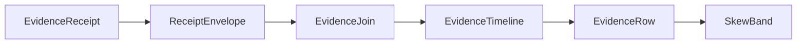

# [APPUI_DIAGNOSTICS_EVIDENCE]

Rasm.AppUi evidence is one rail: a seven-case `EvidenceReceipt` union folds every sibling receipt stream into the
HLC-stamped sink envelope, one correlation join projects per-package envelope streams into causal timelines with
typed skew bands, host-agnostic capture rows prove pixels by content hash, and a derivation engine generates the
headless proof matrix from the screen catalog and replays command journals under virtual time. The page owns the
evidence union with the package wire context, the join fold, the capture and proof row families, the Debug loop
rows, and the evidence wire contract — composing AppHost ports and the settled sibling receipt records throughout.

## [1]-[INDEX]

| [INDEX] | [CLUSTER]           | [OWNS]                                                             |
| :-----: | :------------------ | :----------------------------------------------------------------- |
|   [1]   | RECEIPT_UNION       | Seven-case evidence union sealed through the HLC sink envelope     |
|   [2]   | CORRELATION_JOIN    | Causal timeline join keyed correlation plus HLC with skew bands    |
|   [3]   | CAPTURE_LANES       | Host-agnostic frame capture rows; render-hash regression proof     |
|   [4]   | HEADLESS_DERIVATION | Catalog-derived proof matrix; deterministic command-journal replay |
|   [5]   | DEV_LOOP            | Debug hot-reload knob rows; dispatcher starvation probe            |
|   [6]   | TS_PROJECTION       | Evidence and timeline wire shapes for dashboard ingestion          |

## [2]-[RECEIPT_UNION]

- Owner: `EvidenceReceipt` — the one `[Union]` evidence vocabulary; `EvidenceOps` — the sibling-receipt projection fold; `AppUiWireContext` — the package wire context.
- Cases: Surface | Focus | Render | Disposal | Edit | Command | NativeAssetIdentity under the locked kind literals surface, focus, render, disposal, edit, command, native-asset.
- Entry: `public IO<ReceiptEnvelope> Seal(ReceiptSinkPort sink, CorrelationId correlation, JsonSerializerOptions wire)` — `IO` carries the sink effect; the returned envelope is the emission evidence.
- Auto: composition binds the settled sibling delegates onto case constructors — `ScreenRuntime.Disposed` to Disposal, `VisualRuntime.Sink` to Render through `ToEvidence`, the inspector receipt sink to the Edit flatten, the mount transaction and its fact stream to Surface and Focus, and the native load-identity probe to NativeAssetIdentity — so every existing receipt stream folds into one union with zero new emitters.
- Receipt: the sealed `ReceiptEnvelope` is the emission evidence; its HLC stamp is the only time authority on evidence, so a second stamp field on a case payload is the deleted form.
- Packages: Thinktecture.Runtime.Extensions, LanguageExt.Core, NodaTime, BCL inbox
- Growth: one case row absorbs a new evidence family and one `[JsonSerializable]` row extends the context; zero new surface.
- Boundary: receipts are process-local and HLC-correlated, never globally shared; a generic receipt or ledger abstraction is the rejected form — the typed union with slot metadata is the absorbing owner; cases nest a sibling receipt when its wire form is settled and flatten to scalars when the sibling shape carries non-wire members — the render flatten absorbs the optional destination and the edit flatten absorbs the literal-free outcome union, and a third parallel evidence shape is the named defect; the kind literal reads from the serialized payload, so a second literal table is the deleted form; `AppUiTelemetry.Contribute(version, instruments)` is the one parameterized telemetry-contribution surface every owner calls with its own instrument-name constants — a hand-rolled per-owner `TelemetryContributorPort` factory is the deleted form, the instrument names stay owned by the contributing page, and the contribution shape stays single.

```csharp signature
[Union(ConversionFromValue = ConversionOperatorsGeneration.None)]
[JsonPolymorphic(TypeDiscriminatorPropertyName = "kind")]
[JsonDerivedType(typeof(EvidenceReceipt.Surface), "surface")]
[JsonDerivedType(typeof(EvidenceReceipt.Focus), "focus")]
[JsonDerivedType(typeof(EvidenceReceipt.Render), "render")]
[JsonDerivedType(typeof(EvidenceReceipt.Disposal), "disposal")]
[JsonDerivedType(typeof(EvidenceReceipt.Edit), "edit")]
[JsonDerivedType(typeof(EvidenceReceipt.Command), "command")]
[JsonDerivedType(typeof(EvidenceReceipt.NativeAssetIdentity), "native-asset")]
public abstract partial record EvidenceReceipt {
    private EvidenceReceipt() { }
    public sealed record Surface(SurfaceReceipt Receipt) : EvidenceReceipt;
    public sealed record Focus(string Target, bool Focused) : EvidenceReceipt;
    public sealed record Render(string Slot, string Format, string FrameHash, long Bytes, Duration Elapsed, string? Destination) : EvidenceReceipt;
    public sealed record Disposal(string ScreenId, Duration Active, int Disposables) : EvidenceReceipt;
    public sealed record Edit(string Slot, string Surface, string Target, string Editor, string Outcome) : EvidenceReceipt;
    public sealed record Command(CommandReceipt Receipt) : EvidenceReceipt;
    public sealed record NativeAssetIdentity(NativeAssetFact Fact) : EvidenceReceipt;

    public IO<ReceiptEnvelope> Seal(ReceiptSinkPort sink, CorrelationId correlation, JsonSerializerOptions wire) =>
        IO.lift(() => JsonSerializer.SerializeToElement<EvidenceReceipt>(this, wire))
            .Bind(payload => sink.Send(
                correlation, "Rasm.AppUi", payload.GetProperty("kind").GetString() ?? string.Empty, payload));
}

public static class EvidenceOps {
    extension(RenderReceipt receipt) {
        public EvidenceReceipt ToEvidence() => new EvidenceReceipt.Render(
            receipt.Kind, receipt.Format, receipt.FrameHash, receipt.Bytes, receipt.Elapsed,
            receipt.Destination.Case as string);
    }

    extension(EditReceipt receipt) {
        public EvidenceReceipt ToEvidence() => new EvidenceReceipt.Edit(
            receipt.Kind, receipt.Surface, receipt.Target, receipt.Editor,
            receipt.Outcome.Switch(
                observed: static _ => "observed",
                committed: static _ => "committed",
                reverted: static _ => "reverted",
                rejected: static _ => "rejected",
                hostRouted: static _ => "host-routed"));
    }
}

public static class AppUiTelemetry {
    public static TelemetryContributorPort Contribute(string version, params ReadOnlySpan<string> instruments) =>
        new(TelemetrySource.AppUi, version,
            toSeq(instruments.ToArray()).Map(static name => new InstrumentRow(TelemetrySource.AppUi, name)));
}
```

```csharp signature
[JsonSourceGenerationOptions(
    PropertyNamingPolicy = JsonKnownNamingPolicy.CamelCase,
    UnmappedMemberHandling = JsonUnmappedMemberHandling.Disallow,
    RespectNullableAnnotations = true,
    RespectRequiredConstructorParameters = true)]
[JsonSerializable(typeof(CommandPayload))]
[JsonSerializable(typeof(CommandReceipt))]
[JsonSerializable(typeof(EvidenceReceipt))]
[JsonSerializable(typeof(EvidenceTimeline))]
public partial class AppUiWireContext : JsonSerializerContext;
```

## [3]-[CORRELATION_JOIN]

- Owner: `SkewBand` — the HLC uncertainty band; `EvidenceRow` — the ordered timeline row; `EvidenceTimeline` — the causal projection; `EvidenceJoin` — the cross-package fold.
- Entry: `public static Seq<EvidenceTimeline> Correlate(Seq<ReceiptEnvelope> envelopes, Option<string> package = default)` — pure fold; the package filter value is the model-result provenance projection over the Compute stream.
- Auto: rows order by the HLC pair physical-then-logical with the package name as the deterministic tiebreaker, and every row derives its band from the envelope `SkewBound`, so the timeline surfaces clock-skew uncertainty with zero configuration.
- Receipt: `EvidenceTimeline` serializes through the package wire context for dashboard export.
- Packages: LanguageExt.Core, NodaTime, BCL inbox
- Growth: one provenance-filter row absorbs a new per-package view; zero new surface.
- Boundary: the join consumes only `ReceiptEnvelope` — no Compute or Persistence receipt shape enters the fold, and each per-package payload stays an opaque `JsonElement` decoded against its owning wire contract at the view edge; a second correlation vocabulary beside `CorrelationId` plus the HLC stamp is the rejected form; `Overlaps` is the band algebra — a causal-order claim between rows whose bands overlap is structurally unrepresentable, so the timeline renders overlapping bands as one uncertainty region.

```csharp signature
public readonly record struct SkewBand(Instant Earliest, Instant Latest) {
    public static SkewBand Of(ReceiptEnvelope envelope) =>
        new(envelope.Physical - envelope.SkewBound, envelope.Physical);

    public bool Overlaps(SkewBand other) =>
        Earliest <= other.Latest && other.Earliest <= Latest;
}

public sealed record EvidenceRow(int Ordinal, ReceiptEnvelope Envelope, SkewBand Band);

public sealed record EvidenceTimeline(CorrelationId Correlation, Seq<EvidenceRow> Rows);

public static class EvidenceJoin {
    public static Seq<EvidenceTimeline> Correlate(Seq<ReceiptEnvelope> envelopes, Option<string> package = default) =>
        envelopes
            .Filter(envelope => package.Map(name => envelope.Package == name).IfNone(true))
            .GroupBy(static envelope => envelope.Correlation)
            .AsIterable()
            .Map(static group => new EvidenceTimeline(group.Key, Ordered(group)))
            .ToSeq();

    static Seq<EvidenceRow> Ordered(IEnumerable<ReceiptEnvelope> grouped) =>
        toSeq(grouped
            .OrderBy(static envelope => (envelope.Physical, envelope.Logical, envelope.Package))
            .Select(static (envelope, ordinal) => new EvidenceRow(ordinal, envelope, SkewBand.Of(envelope))));
}
```



## [4]-[CAPTURE_LANES]

- Owner: `CaptureRow` — the per-surface capture row carrying the DPI-scale column; `Captures` — the shot-and-regression surface.
- Entry: `public static IO<RenderReceipt> Shot(VisualRuntime runtime, CaptureRow row)` — `IO` rail through the settled encode fold; one PNG artifact plus one render receipt per shot.
- Auto: capture keys prefix into the per-run artifact scope behind the runtime blob delegate, so a shot never computes a path; the `Scale` column pins the headless render scaling through `SetRenderScaling` so a hi-DPI baseline keys distinctly from its standard-scale twin; the `Ticks` column folds that many `ForceRenderTimerTick` advances into one deterministic frame effect before the grab, so a single-frame baseline pins `Ticks: 1` and an animation-settled or multi-frame capture pins its own count as data and never wall time; the receipt's `FrameHash` rides the suite content-hash identity row.
- Packages: SkiaSharp, Avalonia.Headless, Avalonia.Skia, LanguageExt.Core
- Growth: one capture row absorbs a new surface lane; one `Scale` value on a row absorbs a new DPI baseline; zero new surface.
- Boundary: grab delegates bind at composition per surface row and no capture member is named outside its own row — the headless lane rides `CaptureRenderedFrame` and `GetLastRenderedFrame` whose `WriteableBitmap` pixels enter the hash fold through `Lock()` over the `ILockedFramebuffer` (`Address`, `RowBytes`, `Size`, `Format`) with `UseHeadlessDrawing` false selecting the Skia backend on every hash lane and `SetRenderScaling` pinning the device scale before the grab so the render-hash is scale-attributable, the rhino lane rides the settled host viewport capture port, and the desktop in-tree lane renders through `RenderTargetBitmap.Render(Visual)` with `CopyPixels(PixelRect, nint, int, int)` as its pixel projection; `ForceRenderTimerTick` is the only frame-advance verb on the deterministic lane — a debounce or animation that fails under forced ticks has smuggled wall time, and the tick count is a row column so a multi-frame capture is data; `Regression` compares `FrameHash` values from the settled receipt family, so a per-spec screenshot helper is the deleted form and a second baseline store beside the blob lane is the rejected form.

```csharp signature
public sealed record CaptureRow(string Key, Func<SurfaceHost, bool> Surface, double Scale, int Ticks, Func<double, Func<IO<Unit>>, IO<SKImage>> Grab) {
    public IO<SKImage> Shoot() =>
        Grab(Scale, () => Range(0, int.Max(Ticks, 1))
            .Fold(IO.pure(unit), static (rail, _) => rail.Bind(static _ => IO.lift(AvaloniaHeadlessPlatform.ForceRenderTimerTick))));
}

public static class Captures {
    public const string Kind = "capture";

    public static IO<RenderReceipt> Shot(VisualRuntime runtime, CaptureRow row) =>
        row.Shoot().Bind(image =>
            VisualCodec.Encode(runtime, image, VisualCodec.Png, Kind, $"captures/{row.Key}@{row.Scale}x.png"));

    public static Fin<RenderReceipt> Regression(RenderReceipt actual, string baseline) =>
        actual.FrameHash == baseline
            ? Fin.Succ(actual)
            : Fin.Fail<RenderReceipt>(Error.New($"evidence/render-hash: {actual.Kind} diverged from {baseline}"));
}
```

## [5]-[HEADLESS_DERIVATION]

- Owner: `EvidenceKeyPolicy` ordinal accessor; `ProofCheck` — the six-row check vocabulary; `ProofSpec` — the derived spec row; `ProofEngine` — the derivation and replay surface.
- Cases: activation, render-hash, focus-walk, variant-sweep, density-sweep, disposal-leak.
- Entry: `public static Seq<ProofSpec> Derive(ScreenCatalog catalog, Seq<(ThemeVariantRow Variant, DensityRow Density)> grid, Func<ScreenCatalogRow, ProofCheck, ThemeVariantRow, DensityRow, Func<IO<EvidenceReceipt>>> probe)` — every headless catalog row crossed with every check and every variant-density cell.
- Auto: derived specs execute on the shared `HeadlessUnitTestSession` through `GetOrStartForAssembly` once per assembly and `Dispatch` per spec, so every spec runs on the one UI thread without a per-spec session boot, and `[AvaloniaFact]` dispatch under the xunit.v3 MTP runner rides the same session; `FakeTimeProvider` time travel fills the headless row's virtual-time slot; `Replay` drives the journal through the one remote-invocation route on the frozen deck, so journal replay, deep links, and interactive execution seal the same receipt family; the snapshot store rehydrates screen state before the first journal entry, so replay is deterministic end to end.
- Receipt: every executed spec seals its `EvidenceReceipt` through the union — disposal-leak audits ride the Disposal case and render checks ride the Render case.
- Packages: Avalonia.Headless, Avalonia.Headless.XUnit, Thinktecture.Runtime.Extensions, LanguageExt.Core, BCL inbox
- Growth: one check row sweeps every headless screen and one grid cell sweeps every check; zero new surface.
- Boundary: the derivation engine deletes hand-written per-screen smoke specs — a bespoke screen spec beside the engine is the named defect; the engine owns execution and capture while sibling audit folds declare their own row shapes over it; host-bound screens exit the matrix structurally through the catalog's headless lane, never through skipped specs.

```csharp signature
public sealed class EvidenceKeyPolicy : IEqualityComparerAccessor<string>, IComparerAccessor<string> {
    public static IEqualityComparer<string> EqualityComparer => StringComparer.Ordinal;

    public static IComparer<string> Comparer => StringComparer.Ordinal;
}

[SmartEnum<string>]
[KeyMemberEqualityComparer<EvidenceKeyPolicy, string>]
[KeyMemberComparer<EvidenceKeyPolicy, string>]
public sealed partial class ProofCheck {
    public static readonly ProofCheck Activation = new("activation");
    public static readonly ProofCheck RenderHash = new("render-hash");
    public static readonly ProofCheck FocusWalk = new("focus-walk");
    public static readonly ProofCheck VariantSweep = new("variant-sweep");
    public static readonly ProofCheck DensitySweep = new("density-sweep");
    public static readonly ProofCheck DisposalLeak = new("disposal-leak");
}

public sealed record ProofSpec(
    string ScreenId,
    ProofCheck Check,
    ThemeVariantRow Variant,
    DensityRow Density,
    Func<IO<EvidenceReceipt>> Run);

public static class ProofEngine {
    public static Seq<ProofSpec> Derive(
        ScreenCatalog catalog,
        Seq<(ThemeVariantRow Variant, DensityRow Density)> grid,
        Func<ScreenCatalogRow, ProofCheck, ThemeVariantRow, DensityRow, Func<IO<EvidenceReceipt>>> probe) =>
        catalog.HeadlessLane.Bind(row =>
            grid.Bind(cell =>
                toSeq(ProofCheck.Items).Map(check =>
                    new ProofSpec(row.Id, check, cell.Variant, cell.Density, probe(row, check, cell.Variant, cell.Density)))));

    public static IO<EvidenceReceipt> Dispatch(ProofSpec spec) =>
        IO.liftAsync(async () => await HeadlessUnitTestSession
            .GetOrStartForAssembly(typeof(ProofEngine).Assembly)
            .Dispatch(() => spec.Run().RunAsync().AsTask(), CancellationToken.None)
            .ConfigureAwait(false));

    public static IO<Seq<CommandReceipt>> Replay(CommandDeck deck, Seq<(string Key, JsonElement Payload)> journal) =>
        journal.TraverseM(entry => deck.Invoke(entry.Key, entry.Payload)).As();
}
```

## [6]-[DEV_LOOP]

- Owner: `DevLoop` — the Debug loop surface with the hot-reload knob rows and the remote-evidence ingest edge.
- Entry: `public static IO<Unit> DispatcherLag(SurfaceScheduler boundary, TimeProvider time, Func<Duration, IO<Unit>> sink)` — marshal round-trip lag into the composition-bound sink delegate; `public static IO<Unit> Ingest(ReceiptSinkPort sink, Func<ReadOnlyMemory<byte>, Fin<ReceiptEnvelope>> decode, ReadOnlyMemory<byte> frame)` — the composition-bound binary-wire `decode` column lifts a remote frame into a `ReceiptEnvelope` re-emitted through `sink.Emit`, preserving the origin node's HLC stamp so the correlation join reads each node's own clock.
- Auto: the lag sink binds to `ReceiptSinkPort.Send` at composition under the `LagKind` row, so starvation evidence rides the same envelope stream the dashboards ingest; threshold evaluation stays with the health fold, so the probe carries zero literals; the `decode` column binds the settled Persistence binary-wire decode at composition so a companion node's receipt frames fold into the same envelope stream as local evidence with no second codec.
- Packages: HotAvalonia, LanguageExt.Core, NodaTime, BCL inbox
- Growth: one knob row retunes the reload gate and one probe row absorbs a new loop measure; zero new surface.
- Boundary: HotAvalonia is a Debug-gated build asset whose injected `UseHotReload` wiring is the only callable surface — the master gate plus `HotAvaloniaProcessReferences` enabled strips `HotAvalonia.Core`, `HotAvalonia.Extensions`, and the `HotAvalonia.Fody` weaver from Release closures while `HotAvaloniaExcludeReferences` names the exact reference list the strip removes, and the explicit `Avalonia.Markup.Xaml.Loader` markup-loader pin with its transitive floor lands in the charter admissions so the Debug XAML-compile path resolves and the Release closure carries none of it; a DevTools attach surface is the deleted form — the dev loop is hot reload plus headless evidence; remote evidence ingestion packs envelopes through the settled Persistence binary wire row via a composition-bound codec delegate, so a second binary codec here is the rejected form.

```csharp signature
public static class DevLoop {
    public const string LagKind = "dispatcher-lag";

    public static IO<Unit> DispatcherLag(SurfaceScheduler boundary, TimeProvider time, Func<Duration, IO<Unit>> sink) =>
        IO.lift(time.GetTimestamp)
            .Bind(mark => boundary.Marshal(() =>
                ignore(sink(Duration.FromTimeSpan(time.GetElapsedTime(mark))).Run())));

    public static IO<Unit> Ingest(ReceiptSinkPort sink, Func<ReadOnlyMemory<byte>, Fin<ReceiptEnvelope>> decode, ReadOnlyMemory<byte> frame) =>
        decode(frame).Match(
            Succ: sink.Emit,
            Fail: static error => IO.fail<Unit>(error));
}
```

| [INDEX] | [KNOB_ROW]                   | [VALUE]            | [ROLE]                                  |
| :-----: | :--------------------------- | :----------------- | :-------------------------------------- |
|   [1]   | HotAvalonia                  | Debug default      | master gate                             |
|   [2]   | HotAvaloniaIncludeExtensions | exe default        | injects the UseHotReload source         |
|   [3]   | HotAvaloniaProcessReferences | enabled            | Release closure strip                   |
|   [4]   | HotAvaloniaExcludeReferences | weaver + core list | reference list the strip removes        |
|   [5]   | markup-loader pin            | transitive floor   | `Avalonia.Markup.Xaml.Loader` Debug pin |

## [7]-[TS_PROJECTION]

- Owner: `EvidenceReceiptWire`, `SurfaceReceiptWire`, `NativeAssetFactWire`, `SkewBandWire`, `EvidenceRowWire`, `EvidenceTimelineWire` — the evidence wire contract; the command case composes the settled command receipt wire shape.
- Packages: BCL inbox
- Growth: one wire member row per new case field and one kind literal per new evidence case; zero new surface.
- Boundary: shapes transcribe the camelCase Strict emission — kind literals discriminate the union, the surface host crosses as its locked case key, instants cross as ISO-8601 text and durations as round-trip text, the optional destination crosses as null, and the receipt binds as the payload type parameter on the suite envelope wire record; skew bands cross as instant pairs so the dashboard renders uncertainty regions without recomputing the HLC fold; timeline rows carry the envelope whole, so the dashboard decodes each payload against its owning package contract.

```ts contract
type EvidenceReceiptWire =
  | { readonly kind: "surface"; readonly receipt: SurfaceReceiptWire }
  | { readonly kind: "focus"; readonly target: string; readonly focused: boolean }
  | { readonly kind: "render"; readonly slot: string; readonly format: string; readonly frameHash: string; readonly bytes: number; readonly elapsed: string; readonly destination: string | null }
  | { readonly kind: "disposal"; readonly screenId: string; readonly active: string; readonly disposables: number }
  | { readonly kind: "edit"; readonly slot: string; readonly surface: string; readonly target: string; readonly editor: string; readonly outcome: string }
  | { readonly kind: "command"; readonly receipt: CommandReceiptWire }
  | { readonly kind: "native-asset"; readonly fact: NativeAssetFactWire };

interface SurfaceReceiptWire {
  readonly host: string;
  readonly descriptor: string;
  readonly handle: number;
  readonly scale: number;
  readonly at: string;
  readonly correlation: string;
}

interface NativeAssetFactWire {
  readonly library: string;
  readonly version: string;
  readonly path: string;
  readonly rid: string;
}

interface SkewBandWire {
  readonly earliest: string;
  readonly latest: string;
}

interface EvidenceRowWire {
  readonly ordinal: number;
  readonly envelope: ReceiptEnvelopeWire<unknown>;
  readonly band: SkewBandWire;
}

interface EvidenceTimelineWire {
  readonly correlation: string;
  readonly rows: readonly EvidenceRowWire[];
}
```

## [8]-[RESEARCH]

- [HEADLESS_RUNNER]: `AvaloniaFact` session dispatch under the xunit.v3 MTP runner on the assay test rail.
- [DEV_LOOP_STRIP]: HotAvalonia Release closure strip and markup-loader floor resolution against the central Avalonia pin.
