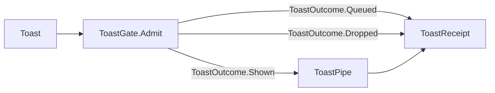

# [APPUI_DIALOGS_NOTIFICATIONS]

Rasm.AppUi presents every modal and transient surface through one `DialogIntent` union resolved over a per-root ReactiveUI `Interaction` seam into DialogHost sessions: six intent cases return `Fin`-railed typed results with dismissal as a value, six `DialogTopology` rows bind one session root per admitted surface, four `ToastRow` rows pass one suppression fold over `RuntimePhase` and `DegradationLevel` before presentation, and three `PickKind` rows route format-derived filters through host-agnostic pick pipes. The page owns the intent vocabulary, the session algebra, the notification policy with its queued-then-dropped receipts, and the picker and host-modality law over DialogHost.Avalonia, ReactiveUI, Avalonia, Thinktecture-generated vocabulary, LanguageExt rails, and NodaTime instants.

## [1]-[INDEX]

| [INDEX] | [CLUSTER]             | [OWNS]                                                          |
| :-----: | :-------------------- | :-------------------------------------------------------------- |
|   [1]   | DIALOG_INTENTS        | One modal vocabulary; typed `Fin` results; dismissal is a value |
|   [2]   | SESSION_ALGEBRA       | Topology rows bind sessions, stacking, styling, registration    |
|   [3]   | NOTIFICATIONS         | Toast rows, suppression fold over phase and level, receipts     |
|   [4]   | PICKERS_HOST_MODALITY | Pick rows, format-derived filters, host modality law            |

## [2]-[DIALOG_INTENTS]

- Owner: `DialogIntent` `[Union]` — the one modal vocabulary across every admitted surface; `DialogFault` fault family in the 4130 code band.
- Cases: Confirm → `Unit`, Form → template commit record, Pick → `Seq<string>`, Progress → `DeadlineOutcome`, Error → `Unit`, About → `Unit`; dismissal projects `Option<TResult>.None`; `DialogFault` = Text | ResultShape | PickerUnavailable.
- Auto: the screen fault fold raises the Error case with its correlation — never per-control failure handling; the boot crash-restore offer rides one Confirm row; the conflict-resolution inspector registers as one Form content row.
- Packages: Thinktecture.Runtime.Extensions, ReactiveUI, LanguageExt.Core, Rasm.AppHost (project)
- Growth: one `DialogIntent` case or one Form content row resolved through `IViewFor` registration; zero new surface.
- Boundary: Progress content binds the Compute progress stream selected by `Correlation`, and a deadline miss renders the typed `DeadlineOutcome` — never a spinner timeout; About renders the `ReleaseIdentity` record as given.

```csharp signature
[Union(ConversionFromValue = ConversionOperatorsGeneration.None)]
public abstract partial record DialogIntent {
    private DialogIntent() { }
    public sealed record Confirm(string Title, string Body, string AffirmKey, string DismissKey) : DialogIntent;
    public sealed record Form(string TemplateKey, IReactiveObject Content) : DialogIntent;
    public sealed record Pick(PickKind Kind, Seq<PickFilter> Filters, Option<string> SuggestedName = default, bool AllowMany = false) : DialogIntent;
    public sealed record Progress(string Title, CorrelationId Correlation, DeadlineClass Deadline) : DialogIntent;
    public sealed record Error(LanguageExt.Common.Error Fault, CorrelationId Correlation) : DialogIntent;
    public sealed record About(ReleaseIdentity Identity) : DialogIntent;
}

[Union]
public abstract partial record DialogFault : Expected, IValidationError<DialogFault> {
    private DialogFault(string detail, int code) : base(detail, code, None) { }

    public static DialogFault Create(string message) => new Text(message);

    public sealed record Text : DialogFault { public Text(string detail) : base(detail, 4130) { } }
    public sealed record ResultShape : DialogFault { public ResultShape(string expected, string actual) : base($"{expected}:{actual}", 4131) { } }
    public sealed record PickerUnavailable : DialogFault { public PickerUnavailable(string surface) : base(surface, 4132) { } }
}
```

## [3]-[SESSION_ALGEBRA]

- Owner: `DialogTopology` — one per-surface root row binding identifier, stacking, close policy, styling token keys, toast pipe, pick pipe, and its `Interaction` seam; `DialogSurface` extension fold over the row.
- Cases: six topology rows — avalonia-desktop, rhino-panel, rhino-modal, gh2-companion, sidecar-shell, headless; the web-browser case carries zero rows.
- Entry: `public IO<Fin<Option<TResult>>> Show<TResult>(DialogIntent intent)` — `Fin` aborts on fault, `Option` carries dismissal as a value; `Advance` drives live progress through `UpdateContent`; `Retreat` closes the top stacked session; `Dismiss` closes the current session.
- Auto: `RegisterRoot` binds the row's handler at surface mount and disposes with the activation scope; composition projects each row onto `Identifier`, `IsMultipleDialogsEnabled`, `CloseOnClickAway`, `OverlayBackground`, `BlurBackground`, `PopupPositioner`, and `DialogHostStyle` `CornerRadius`; a dirty Form session arms `DialogClosingEventArgs` `Cancel` through `DialogClosingCallback`.
- Packages: DialogHost.Avalonia, ReactiveUI, Avalonia, LanguageExt.Core
- Growth: one topology row admits a new surface root, one positioner row swaps `IDialogPopupPositioner`; zero new surface.
- Boundary: `DialogSurface` is the named boundary capsule — the registration handler and pick route carry the erased close parameter the DialogHost seam owns, and `Project` re-types it onto the `Fin` rail; overlay, blur, and corner styling resolve through theme token keys, never local literals; one headless smoke spec opens, stacks, and closes sessions per row.

```csharp signature
public sealed record DialogTopology(
    string SurfaceKey,
    string Identifier,
    bool StackedSessions,
    bool CloseOnClickAway,
    bool BlurBackground,
    string OverlayToken,
    string CornerToken,
    IDialogPopupPositioner Positioner,
    Func<ToastRow, string, string, Option<string>, Unit> ToastPipe,
    Option<Func<DialogIntent.Pick, Task<Seq<string>>>> PickPipe) {
    public Interaction<DialogIntent, object?> Requests { get; } = new();
}

public static class DialogSurface {
    extension(DialogTopology root) {
        public IO<Fin<Option<TResult>>> Show<TResult>(DialogIntent intent) where TResult : notnull =>
            IO.liftAsync(async () => Project<TResult>(await root.Requests.Handle(intent)));

        public IO<Unit> Advance(DialogIntent.Progress snapshot) =>
            IO.lift(() => Optional(DialogHost.GetDialogSession(root.Identifier)).Iter(session => session.UpdateContent(snapshot)));

        public IO<Unit> Retreat() => IO.lift(fun(() => DialogHost.Pop(root.Identifier)));

        public IO<Unit> Dismiss() => IO.lift(fun(() => DialogHost.Close(root.Identifier)));

        public IDisposable RegisterRoot() =>
            root.Requests.RegisterHandler(async context =>
                context.SetOutput(await context.Input.Switch(
                    state: root,
                    confirm: static (state, request) => DialogHost.Show(request, state.Identifier),
                    form: static (state, request) => DialogHost.Show(request, state.Identifier),
                    pick: static (state, request) => state.RoutePick(request),
                    progress: static (state, request) => DialogHost.Show(request, state.Identifier),
                    error: static (state, request) => DialogHost.Show(request, state.Identifier),
                    about: static (state, request) => DialogHost.Show(request, state.Identifier)).ConfigureAwait(true)));

        internal async Task<object?> RoutePick(DialogIntent.Pick request) =>
            root.PickPipe is { IsSome: true, Case: Func<DialogIntent.Pick, Task<Seq<string>>> route }
                ? await route(request).ConfigureAwait(true) is { IsEmpty: false } paths ? (object?)paths : null
                : new DialogFault.PickerUnavailable(root.SurfaceKey);
    }

    static Fin<Option<TResult>> Project<TResult>(object? closing) where TResult : notnull =>
        closing switch {
            null => FinSucc(Option<TResult>.None),
            TResult value => FinSucc(Some(value)),
            DialogFault fault => FinFail<Option<TResult>>(fault),
            var other => FinFail<Option<TResult>>(new DialogFault.ResultShape(typeof(TResult).Name, other.GetType().Name)),
        };
}
```

| [INDEX] | [SURFACE]        | [IDENTIFIER]       | [STACKED] | [CLICK_AWAY] | [BLUR] | [TOAST_PIPE]                  | [PICK_PIPE]               |
| :-----: | :--------------- | :----------------- | :-------: | :----------: | :----: | :---------------------------- | :------------------------ |
|   [1]   | avalonia-desktop | desktop-root       |   true    |     true     |  true  | manager over window root      | storage provider          |
|   [2]   | rhino-panel      | rhino-panel-root   |   false   |    false     | false  | manager over embedded root    | embedded storage provider |
|   [3]   | rhino-modal      | rhino-modal-root   |   false   |    false     | false  | manager over embedded root    | embedded storage provider |
|   [4]   | gh2-companion    | gh2-companion-root |   true    |     true     | false  | manager over companion window | storage provider          |
|   [5]   | sidecar-shell    | sidecar-root       |   true    |     true     |  true  | manager over sidecar window   | storage provider          |
|   [6]   | headless         | headless-root      |   true    |    false     | false  | receipt-only sink             | none — typed fault        |

## [4]-[NOTIFICATIONS]

- Owner: `ToastRow` linger rows, `ToastOutcome` outcome rows, the `ToastGate` suppression fold, and `ToastReceipt`, under the one `NoticeKeyPolicy` ordinal accessor.
- Cases: Info 4s | Success 4s | Warning 6s | Error sticky; outcomes shown | queued | dropped.
- Entry: `public IO<ToastReceipt> Toast(ToastRow row, string title, string body, RuntimePhase phase, DegradationState degradation, Instant at, CorrelationId correlation, Option<string> intentKey = default)` — `IO` carries the presentation effect; the receipt is total over outcomes.
- Auto: composition binds `ToastPipe` per topology row; a toast action raises its command intent by key through the one intent table; queued notes flush through one `PhaseSubscription` observing the support-capture resume and fold to dropped receipts when the phase reaches `Draining`.
- Receipt: `ToastReceipt` — row, surface, outcome, intent key, `Instant`, correlation — sinks through the `ReceiptSinkPort` envelope; the receipt stream absorbs the audit need and no notification-history store exists.
- Packages: Avalonia, Thinktecture.Runtime.Extensions, LanguageExt.Core, NodaTime, Rasm.AppHost (project)
- Growth: one `ToastRow` row or one `ToastOutcome` case; zero new surface.
- Boundary: enter/exit timing and reduced-motion pairs arrive from the motion vocabulary — linger and suppression are the only timing facts owned here; `ToastPipe` binds one `WindowNotificationManager` constructed over the surface `TopLevel`, whose `Show(object, NotificationType, TimeSpan?, ...)` overload carries the row's severity as the `NotificationType` case and the linger as the expiration; native Rhino toasts and status panes stay host-owned; `Suspended` drops every note because retained capabilities exclude presentation.

```csharp signature
public sealed class NoticeKeyPolicy : IEqualityComparerAccessor<string>, IComparerAccessor<string> {
    private static readonly StringComparer Policy = StringComparer.Ordinal;

    public static IEqualityComparer<string> EqualityComparer => Policy;

    public static IComparer<string> Comparer => Policy;
}

[SmartEnum<string>]
[KeyMemberEqualityComparer<NoticeKeyPolicy, string>]
[KeyMemberComparer<NoticeKeyPolicy, string>]
public sealed partial class ToastRow {
    public static readonly ToastRow Info = new("info", linger: Duration.FromSeconds(4), sticky: false);
    public static readonly ToastRow Success = new("success", linger: Duration.FromSeconds(4), sticky: false);
    public static readonly ToastRow Warning = new("warning", linger: Duration.FromSeconds(6), sticky: false);
    public static readonly ToastRow Error = new("error", linger: Duration.Zero, sticky: true);

    public Duration Linger { get; }
    public bool Sticky { get; }
}

[SmartEnum<string>]
[KeyMemberEqualityComparer<NoticeKeyPolicy, string>]
[KeyMemberComparer<NoticeKeyPolicy, string>]
public sealed partial class ToastOutcome {
    public static readonly ToastOutcome Shown = new("shown");
    public static readonly ToastOutcome Queued = new("queued");
    public static readonly ToastOutcome Dropped = new("dropped");
}

public readonly record struct ToastReceipt(ToastRow Row, string Surface, ToastOutcome Outcome, Option<string> IntentKey, Instant At, CorrelationId Correlation);

public static class ToastGate {
    public static ToastOutcome Admit(RuntimePhase phase, DegradationLevel level) =>
        (Terminal: phase == RuntimePhase.Draining || phase == RuntimePhase.Unloaded || phase == RuntimePhase.Faulted || level == DegradationLevel.Suspended,
         Paused: phase == RuntimePhase.SupportCapture) switch {
            { Terminal: true } => ToastOutcome.Dropped,
            { Paused: true } => ToastOutcome.Queued,
            _ => ToastOutcome.Shown,
        };

    extension(DialogTopology root) {
        public IO<ToastReceipt> Toast(ToastRow row, string title, string body, RuntimePhase phase, DegradationState degradation, Instant at, CorrelationId correlation, Option<string> intentKey = default) =>
            ToastGate.Admit(phase, degradation.Level) switch {
                var outcome when outcome == ToastOutcome.Shown =>
                    IO.lift(() => root.ToastPipe(row, title, body, intentKey)).Map(_ => new ToastReceipt(row, root.SurfaceKey, ToastOutcome.Shown, intentKey, at, correlation)),
                var outcome => IO.pure(new ToastReceipt(row, root.SurfaceKey, outcome, intentKey, at, correlation)),
            };
    }
}
```



## [5]-[PICKERS_HOST_MODALITY]

- Owner: `PickKind` rows, the `PickFilter` projection, and the `PickOps` fold from port-projected format tuples.
- Cases: open | save | folder.
- Entry: `public static Seq<PickFilter> Filters(Seq<(string Key, Seq<string> Extensions)> formats)` — pure projection; one filter row per format tuple.
- Packages: Thinktecture.Runtime.Extensions, LanguageExt.Core, BCL inbox
- Growth: one `PickKind` row or one format tuple from the host vocabulary; zero new surface.
- Boundary: the Rasm.Rhino `FileFormat` vocabulary crosses `HostAttachPort` as key-plus-extension tuples — the type never enters this package; host-native modal flows (document file IO, command prompts, Eto semi-modal panels) stay Rasm.Rhino-owned and AppUi raises only the intent through the port; `PickPipe` rows bind `IStorageProvider` per surface — `OpenFilePickerAsync`, `SaveFilePickerAsync`, and `OpenFolderPickerAsync` discriminate on the `PickKind` row with `PickFilter` rows projecting into `FilePickerFileType` patterns — and the headless row holds `None`, folding to `DialogFault.PickerUnavailable`.

```csharp signature
[SmartEnum<string>]
[KeyMemberEqualityComparer<NoticeKeyPolicy, string>]
[KeyMemberComparer<NoticeKeyPolicy, string>]
public sealed partial class PickKind {
    public static readonly PickKind Open = new("open");
    public static readonly PickKind Save = new("save");
    public static readonly PickKind Folder = new("folder");
}

public readonly record struct PickFilter(string Label, Seq<string> Patterns);

public static class PickOps {
    public static Seq<PickFilter> Filters(Seq<(string Key, Seq<string> Extensions)> formats) =>
        formats.Map(static format => new PickFilter(format.Key, format.Extensions.Map(static extension => $"*.{extension}")));
}
```

## [6]-[RESEARCH]

| [INDEX] | [ITEM]                                                                                                           | [PROOF]                                                                                          | [GATE]                |
| :-----: | :--------------------------------------------------------------------------------------------------------------- | :----------------------------------------------------------------------------------------------- | :-------------------- |
|   [1]   | Embedded-root TopLevel service resolution for the toast manager and storage provider inside the rhino-panel root  | `tests/csharp/libs/Rasm.AppUi/scenarios/appui-embedded-toplevel.verify.csx`                        | NOTIFICATIONS         |
