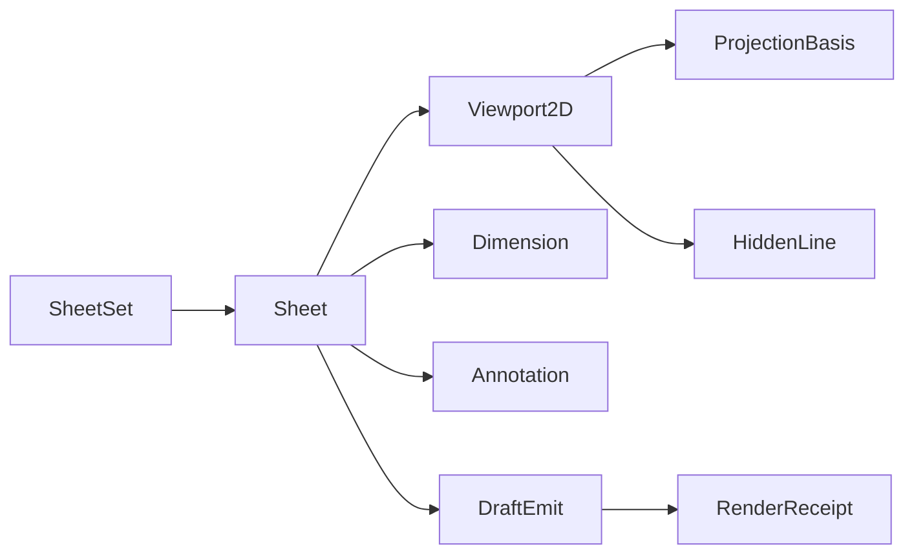

# [APPUI_DRAFTING_SHEETS]

The drafting rail produces 2D documentation from 3D geometry: `SheetSet` owns a locale-aware sheet collection with ISO/ANSI/JIS title-block templating, `Viewport2D` frames a 3D model view through one hidden-line projection kernel onto a sheet region, `Dimension` and `Annotation` carry the dimensioning and GD&T annotation vocabulary as typed records, and `DraftEmit` renders the composed sheet to DWG/DXF/PDF/SVG through the offscreen document rail. The page owns the sheet-set and title-block axis, the projection-kernel viewport frame, the dimension and GD&T annotation families, and the multi-format emit dispatch; the substrate is SkiaSharp 2D geometry behind the `DrawSource.Owned` capsule and the `SKDocument` PDF export, the locale culture for title-block fields, the `Viewpoint` camera for the projection basis, and the Compute geometry payload for the projected edges. The PDF and SVG emit ship today on the 2D-Skia substrate; DWG and DXF emit is fence-complete and SPIKE-gated on the entity-writer surface.

## [1]-[INDEX]

| [INDEX] | [CLUSTER]    | [OWNS]                                                             |
| :-----: | :----------- | :----------------------------------------------------------------- |
|   [1]   | SHEET_SET    | Sheet collection, locale-aware ISO/ANSI/JIS title-block templating |
|   [2]   | PROJECTION   | 3D-to-2D hidden-line viewport frame, scale, projection basis       |
|   [3]   | DIMENSIONING | Dimension and GD&T annotation vocabulary as typed records          |
|   [4]   | DRAFT_EMIT   | DWG/DXF/PDF/SVG multi-format emit over the document rail           |

## [2]-[SHEET_SET]

- Owner: `SheetSize` `[SmartEnum<string>]` the standard sheet-size catalog; `TitleBlock` the locale-aware title-block record; `Sheet` the single sheet with its regions; `SheetSet` the sheet collection.
- Cases: `SheetSize` = a0…a4 (ISO 216) · ansi-a…ansi-e (ANSI/ASME Y14.1) · jis-b0…jis-b4 (JIS B) — the standard sheet rows carrying width, height, and standard family.
- Entry: `public Fin<Sheet> Compose(SheetSize size, TitleBlock title, Seq<SheetRegion> regions, ResolvedLocale locale)` — `Fin` aborts on a region outside the sheet bounds; the title-block fields resolve through the locale string vocabulary.
- Auto: `TitleBlock` carries the standard family so an ISO sheet draws the ISO border-and-zone grid, an ANSI sheet the ANSI title-block layout, and a JIS sheet the JIS layout from one templating fold; the title-block field labels (drawing number, title, scale, date, sheet n-of-m, revision) resolve through `ResolvedLocale.Label` so a localized drawing renders its field labels in the active culture and the date through the NodaTime pattern, never a hardcoded label string.
- Packages: Thinktecture.Runtime.Extensions, LanguageExt.Core, NodaTime, BCL inbox
- Growth: a new sheet size is one `SheetSize` row carrying its dimensions and standard family; a new title-block layout is one `TitleBlockStandard` value; a new field is one `TitleBlock` member; zero new surface.
- Boundary: sheet dimensions are millimeter row data traced here once — a call-site sheet-dimension literal is the deleted form; the title-block standard drives the border, zone-grid, and field layout from one fold so a per-standard title-block control is the deleted form; field labels and the date format ride `ResolvedLocale` so a `CultureInfo.CurrentCulture` read is the rejected form; sheet regions are placement rectangles in sheet millimeter space and a region outside the sheet bounds faults at compose, never at render; the sheet composes into the `FlowBlock` page run for PDF export so the document-pagination concern stays the visuals export owner and the drafting page mints no second pagination.

```csharp signature
[SmartEnum<string>]
public sealed partial class TitleBlockStandard {
    public static readonly TitleBlockStandard Iso = new("iso");
    public static readonly TitleBlockStandard Ansi = new("ansi");
    public static readonly TitleBlockStandard Jis = new("jis");
}

[SmartEnum<string>]
public sealed partial class SheetSize {
    public static readonly SheetSize A0 = new("a0", 841d, 1189d, TitleBlockStandard.Iso);
    public static readonly SheetSize A1 = new("a1", 594d, 841d, TitleBlockStandard.Iso);
    public static readonly SheetSize A2 = new("a2", 420d, 594d, TitleBlockStandard.Iso);
    public static readonly SheetSize A3 = new("a3", 297d, 420d, TitleBlockStandard.Iso);
    public static readonly SheetSize A4 = new("a4", 210d, 297d, TitleBlockStandard.Iso);
    public static readonly SheetSize AnsiA = new("ansi-a", 215.9d, 279.4d, TitleBlockStandard.Ansi);
    public static readonly SheetSize AnsiB = new("ansi-b", 279.4d, 431.8d, TitleBlockStandard.Ansi);
    public static readonly SheetSize AnsiC = new("ansi-c", 431.8d, 558.8d, TitleBlockStandard.Ansi);
    public static readonly SheetSize AnsiD = new("ansi-d", 558.8d, 863.6d, TitleBlockStandard.Ansi);
    public static readonly SheetSize AnsiE = new("ansi-e", 863.6d, 1117.6d, TitleBlockStandard.Ansi);
    public static readonly SheetSize JisB0 = new("jis-b0", 1030d, 1456d, TitleBlockStandard.Jis);
    public static readonly SheetSize JisB1 = new("jis-b1", 728d, 1030d, TitleBlockStandard.Jis);
    public static readonly SheetSize JisB2 = new("jis-b2", 515d, 728d, TitleBlockStandard.Jis);
    public static readonly SheetSize JisB3 = new("jis-b3", 364d, 515d, TitleBlockStandard.Jis);
    public static readonly SheetSize JisB4 = new("jis-b4", 257d, 364d, TitleBlockStandard.Jis);

    public double WidthMm { get; }

    public double HeightMm { get; }

    public TitleBlockStandard Standard { get; }

    public float PointWidth => (float)(WidthMm / 25.4d * 72d);

    public float PointHeight => (float)(HeightMm / 25.4d * 72d);
}

public sealed record TitleBlock(
    string DrawingNumber,
    string TitleKey,
    string Scale,
    LocalDate Date,
    int SheetNumber,
    int SheetCount,
    string Revision,
    TitleBlockStandard Standard) {
    public Seq<(string LabelKey, string Value)> Fields(ResolvedLocale locale) => Seq(
        ("draft.field.number", DrawingNumber),
        ("draft.field.title", locale.Label(TitleKey)),
        ("draft.field.scale", Scale),
        ("draft.field.date", locale.Day(Date)),
        ("draft.field.sheet", $"{SheetNumber}/{SheetCount}"),
        ("draft.field.revision", Revision));
}

public readonly record struct SheetRegion(string Key, double X, double Y, double Width, double Height);

public sealed record Sheet(string Key, SheetSize Size, TitleBlock Title, Seq<SheetRegion> Regions, Seq<Dimension> Dimensions, Seq<Annotation> Annotations);

public sealed record SheetSet(string Key, Seq<Sheet> Sheets) {
    public static Fin<Sheet> Compose(string key, SheetSize size, TitleBlock title, Seq<SheetRegion> regions, Seq<Dimension> dimensions, Seq<Annotation> annotations) =>
        regions.Find(region => region.X < 0d || region.Y < 0d || region.X + region.Width > size.WidthMm || region.Y + region.Height > size.HeightMm) is { IsSome: true, Case: SheetRegion bad }
            ? Fin.Fail<Sheet>(new DraftFault.RegionOutOfBounds($"{key}/{bad.Key}"))
            : Fin.Succ(new Sheet(key, size, title, regions, dimensions, annotations));
}
```

## [3]-[PROJECTION]

- Owner: `ProjectionBasis` the view-direction-and-scale projection; `Viewport2D` the model-view frame on a sheet region; `HiddenLine` the visible-edge fold.
- Entry: `public Fin<Seq<(SKPoint A, SKPoint B)>> Project(MeshSource mesh, ProjectionBasis basis, SheetRegion region)` — projects the model edges into sheet-space line segments under the basis and clips to the region; visible-edge resolution rides `HiddenLine`.
- Auto: `ProjectionBasis.From` derives the orthographic or perspective projection matrix from a `Viewpoint` camera so a saved 3D view drafts to a 2D viewport with the same basis — the drafting projection and the viewport camera share one camera vocabulary; standard views (top, front, right, iso) are basis presets; the projection scales model millimeters to sheet millimeters through the viewport scale so a 1:50 detail and a 1:1 detail are scale row values, never call-site arithmetic; `HiddenLine` folds the back-facing and occluded edges out by the painter depth sort so a drafted view shows visible edges, with the dashed hidden-line layer a style row.
- Packages: SkiaSharp, Thinktecture.Runtime.Extensions, LanguageExt.Core, Rasm.Compute (project)
- Growth: a new standard view is one `ProjectionBasis` preset; a new line style is one `EdgeStyle` row; zero new surface.
- Boundary: the projection basis derives from the `Viewpoint` camera so the drafting view and the GPU viewport share one camera shape and a second camera model is the deleted form; the projected geometry is the `MeshSource` boundary projection off the canonical Compute `GeometryPayload` so the page never re-tessellates — the same wire boundary the viewport meshlet build consumes; the hidden-line removal is a painter depth-sort fold on the projected edges and a GPU depth-buffer hidden-line is the viewport-pipeline consequence under VIEWPORT_GPU, so the 2D painter hidden-line ships today; viewport scale is millimeter-to-millimeter row data and a hardcoded scale factor is the rejected form; the projected segments draw through the `DrawSource.Owned` capsule into the sheet region so the drafting page mints no second Skia-surface owner.

```csharp signature
public sealed record ProjectionBasis(
    bool Perspective,
    (double X, double Y, double Z) Eye,
    (double X, double Y, double Z) Direction,
    (double X, double Y, double Z) Up,
    double Scale) {
    public static readonly ProjectionBasis Top = new(false, (0d, 0d, 1d), (0d, 0d, -1d), (0d, 1d, 0d), 1d);
    public static readonly ProjectionBasis Front = new(false, (0d, -1d, 0d), (0d, 1d, 0d), (0d, 0d, 1d), 1d);
    public static readonly ProjectionBasis Right = new(false, (1d, 0d, 0d), (-1d, 0d, 0d), (0d, 0d, 1d), 1d);
    public static readonly ProjectionBasis Iso = new(false, (1d, -1d, 1d), (-1d, 1d, -1d), (0d, 0d, 1d), 1d);

    public static ProjectionBasis From(ViewCamera camera, double scale) =>
        new(camera.Perspective,
            (camera.EyeX, camera.EyeY, camera.EyeZ),
            (camera.TargetX - camera.EyeX, camera.TargetY - camera.EyeY, camera.TargetZ - camera.EyeZ),
            (camera.UpX, camera.UpY, camera.UpZ),
            scale);

    public (double X, double Y) Map((double X, double Y, double Z) point) {
        var (rx, ry) = Screen(point);
        return (rx * Scale, ry * Scale);
    }

    private (double X, double Y) Screen((double X, double Y, double Z) point) {
        var (ux, uy, uz) = Normalize(Cross(Direction, Up));
        var (vx, vy, vz) = Up;
        return ((point.X * ux) + (point.Y * uy) + (point.Z * uz), (point.X * vx) + (point.Y * vy) + (point.Z * vz));
    }

    private static (double X, double Y, double Z) Cross((double X, double Y, double Z) a, (double X, double Y, double Z) b) =>
        ((a.Y * b.Z) - (a.Z * b.Y), (a.Z * b.X) - (a.X * b.Z), (a.X * b.Y) - (a.Y * b.X));

    private static (double X, double Y, double Z) Normalize((double X, double Y, double Z) v) =>
        Math.Sqrt((v.X * v.X) + (v.Y * v.Y) + (v.Z * v.Z)) switch {
            var len when len > 0d => (v.X / len, v.Y / len, v.Z / len),
            _ => (0d, 0d, 1d),
        };
}

[SmartEnum<string>]
public sealed partial class EdgeStyle {
    public static readonly EdgeStyle Visible = new("visible", dashed: false);
    public static readonly EdgeStyle Hidden = new("hidden", dashed: true);
    public static readonly EdgeStyle Centerline = new("centerline", dashed: true);

    public bool Dashed { get; }
}

public sealed record Viewport2D(string Key, SheetRegion Region, ProjectionBasis Basis, EdgeStyle Style) {
    public Fin<Seq<(SKPoint A, SKPoint B)>> Project(MeshSource mesh, Seq<(int A, int B)> edges) =>
        mesh.Positions.Length < 3
            ? Fin.Fail<Seq<(SKPoint A, SKPoint B)>>(new DraftFault.EmptyView(Key))
            : Fin.Succ(HiddenLine.Visible(edges, Vertex, Basis).Map(edge => (Point(Vertex(edge.A)), Point(Vertex(edge.B)))));

    private (double X, double Y, double Z) Vertex(int index) =>
        (mesh.Positions.Span[index * 3], mesh.Positions.Span[(index * 3) + 1], mesh.Positions.Span[(index * 3) + 2]);

    private SKPoint Point((double X, double Y, double Z) world) =>
        Basis.Map(world) switch { var p => new SKPoint((float)(Region.X + p.X), (float)(Region.Y - p.Y)) };
}

public static class HiddenLine {
    public static Seq<(int A, int B)> Visible(Seq<(int A, int B)> edges, Func<int, (double X, double Y, double Z)> vertex, ProjectionBasis basis) =>
        edges.OrderByDescending(edge => Depth(vertex(edge.A), basis) + Depth(vertex(edge.B), basis)).ToSeq();

    private static double Depth((double X, double Y, double Z) world, ProjectionBasis basis) =>
        (world.X * basis.Direction.X) + (world.Y * basis.Direction.Y) + (world.Z * basis.Direction.Z);
}
```

## [4]-[DIMENSIONING]

- Owner: `Dimension` `[Union]` the dimension vocabulary; `Tolerance` the tolerance value; `Annotation` `[Union]` the GD&T and text annotation vocabulary; `GdtFrame` the feature-control frame.
- Cases: `Dimension` = Linear | Aligned | Angular | Radial | Diametric | Ordinate under the locked kind literals; `Annotation` = Text | Leader | Datum | FeatureControl | SurfaceFinish | Weld under the locked kind literals.
- Entry: `public Fin<SKPath> Draw(ProjectionBasis basis, ResolvedLocale locale)` — projects the dimension into sheet-space extension lines, arrowheads, and the dimension text; the value formats through the locale quantity edge.
- Auto: each dimension carries its anchor points and the measured value, and `Draw` builds the extension lines, dimension line, arrowheads, and text from the dimension kind — a linear dimension draws horizontal-or-vertical extension lines, an aligned dimension parallel to the measured edge, an angular dimension an arc with the angle, a radial a leader from the arc center, a diametric a through-center line, and an ordinate a single offset value from the datum; the GD&T feature-control frame folds the geometric characteristic symbol, tolerance value, and datum references into the ASME Y14.5 frame layout; dimension values format through `ResolvedLocale.Quantity` so a metric or imperial drawing reads its values in the active unit and culture.
- Packages: SkiaSharp, Thinktecture.Runtime.Extensions, LanguageExt.Core, UnitsNet, BCL inbox
- Growth: a new dimension kind is one `Dimension` case; a new annotation kind is one `Annotation` case; a new GD&T characteristic is one `GeometricCharacteristic` row; zero new surface.
- Boundary: dimension geometry is built in sheet-space from the projected anchor points so a dimension follows its view — a free-floating annotation layer is the deleted form; the GD&T feature-control frame is the typed `GdtFrame` record so a hand-laid-out tolerance frame is the deleted form, and the geometric characteristic symbols (straightness, flatness, position, concentricity, and the rest) ride one `GeometricCharacteristic` smart-enum carrying its Unicode glyph; dimension text shapes through the typography rail's `DrawShapedText` so a raw `DrawText` loop is the rejected form; the tolerance value rides UnitsNet through the locale quantity edge so a tolerance reads in the drawing unit.

```csharp signature
public readonly record struct Tolerance(double Plus, double Minus) {
    public static readonly Tolerance None = new(0d, 0d);
    public bool Symmetric => Math.Abs(Plus - Minus) < double.Epsilon;
}

[SmartEnum<string>]
public sealed partial class GeometricCharacteristic {
    public static readonly GeometricCharacteristic Straightness = new("straightness", "⏤");
    public static readonly GeometricCharacteristic Flatness = new("flatness", "⏥");
    public static readonly GeometricCharacteristic Circularity = new("circularity", "○");
    public static readonly GeometricCharacteristic Cylindricity = new("cylindricity", "⌭");
    public static readonly GeometricCharacteristic Profile = new("profile", "⌓");
    public static readonly GeometricCharacteristic Perpendicularity = new("perpendicularity", "⟂");
    public static readonly GeometricCharacteristic Parallelism = new("parallelism", "∥");
    public static readonly GeometricCharacteristic Angularity = new("angularity", "∠");
    public static readonly GeometricCharacteristic Position = new("position", "⌖");
    public static readonly GeometricCharacteristic Concentricity = new("concentricity", "◎");
    public static readonly GeometricCharacteristic Symmetry = new("symmetry", "⌯");
    public static readonly GeometricCharacteristic Runout = new("runout", "↗");

    public string Glyph { get; }
}

public sealed record GdtFrame(GeometricCharacteristic Characteristic, double ToleranceValue, bool Diameter, Seq<string> Datums);

[Union(ConversionFromValue = ConversionOperatorsGeneration.None)]
public abstract partial record Dimension {
    private Dimension() { }
    public sealed record Linear((double X, double Y, double Z) A, (double X, double Y, double Z) B, double Offset, Tolerance Tolerance) : Dimension;
    public sealed record Aligned((double X, double Y, double Z) A, (double X, double Y, double Z) B, double Offset, Tolerance Tolerance) : Dimension;
    public sealed record Angular((double X, double Y, double Z) Vertex, (double X, double Y, double Z) A, (double X, double Y, double Z) B) : Dimension;
    public sealed record Radial((double X, double Y, double Z) Center, double Radius) : Dimension;
    public sealed record Diametric((double X, double Y, double Z) Center, double Diameter) : Dimension;
    public sealed record Ordinate((double X, double Y, double Z) Datum, (double X, double Y, double Z) Point) : Dimension;

    public double Measure => Switch(
        linear: static l => Distance(l.A, l.B),
        aligned: static a => Distance(a.A, a.B),
        angular: static a => Angle(a.Vertex, a.A, a.B),
        radial: static r => r.Radius,
        diametric: static d => d.Diameter,
        ordinate: static o => Distance(o.Datum, o.Point));

    private static double Distance((double X, double Y, double Z) a, (double X, double Y, double Z) b) =>
        Math.Sqrt(Math.Pow(a.X - b.X, 2) + Math.Pow(a.Y - b.Y, 2) + Math.Pow(a.Z - b.Z, 2));

    private static double Angle((double X, double Y, double Z) v, (double X, double Y, double Z) a, (double X, double Y, double Z) b) =>
        Math.Acos(Math.Clamp(
            (((a.X - v.X) * (b.X - v.X)) + ((a.Y - v.Y) * (b.Y - v.Y)) + ((a.Z - v.Z) * (b.Z - v.Z)))
                / (Distance(v, a) * Distance(v, b) + double.Epsilon), -1d, 1d)) * 180d / Math.PI;
}

[Union(ConversionFromValue = ConversionOperatorsGeneration.None)]
public abstract partial record Annotation {
    private Annotation() { }
    public sealed record Text(string Key, (double X, double Y) At, string Role) : Annotation;
    public sealed record Leader((double X, double Y) Tail, (double X, double Y) Head, string Key) : Annotation;
    public sealed record Datum(string Label, (double X, double Y) At) : Annotation;
    public sealed record FeatureControl(GdtFrame Frame, (double X, double Y) At) : Annotation;
    public sealed record SurfaceFinish(double Roughness, (double X, double Y) At) : Annotation;
    public sealed record Weld(string Symbol, (double X, double Y) At) : Annotation;
}
```

## [5]-[DRAFT_EMIT]

- Owner: `DraftFormat` `[SmartEnum<string>]` the emit-format axis; `DraftFault` the fault family; `DraftEmit` the multi-format emit dispatch.
- Cases: `DraftFormat` = pdf · svg · dwg · dxf under the locked kind literals; `DraftFault` = Text | RegionOutOfBounds | EmptyView | EntityWriterUnavailable in the 4600 code band.
- Entry: `public static IO<RenderReceipt> Emit(VisualRuntime runtime, SheetSet set, DraftFormat format, ProjectionBasis basis, ResolvedLocale locale, VisualDestination destination)` — `IO` rail; the composed sheet renders to the format and delivers to the destination.
- Auto: the PDF arm composes each sheet as a `FlowBlock.Tile` page run through the visuals `SKDocument` export so a multi-sheet set is one paginated PDF; the SVG arm renders each sheet to an `SKCanvas` recording surface emitted as SVG text through `SKSvgCanvas`; the DWG and DXF arms write the projected entities (lines, arcs, text, dimensions) as model-space entities through the entity-writer surface; every emit lands one `RenderReceipt` of kind drawing carrying the format and the delivered destination.
- Receipt: one `RenderReceipt` of kind drawing per emit; sealed through the visuals encode receipt sink.
- Packages: SkiaSharp, Thinktecture.Runtime.Extensions, LanguageExt.Core, Rasm.AppHost (project)
- Growth: a new emit format is one `DraftFormat` row plus one `Emit` dispatch arm; zero new surface.
- Boundary: PDF and SVG ride the settled visuals document and Skia surfaces so the page mints no second exporter — the `SKDocument` PDF and the `SKSvgCanvas` SVG ship today; DWG and DXF write through the entity-writer surface whose exact entity-table spelling resolves under DRAFT_ENTITY, so those two arms are fence-complete and SPIKE-gated on the entity writer while PDF and SVG ship now; the destination union is the visuals `VisualDestination` so the drafting emit delivers through the one destination owner and a drafting-local file write is the rejected form; the emit receipt rides the visuals `RenderReceipt` family so the drafting page mints no second receipt vocabulary; vector content survives as picture content in PDF and as path elements in SVG so a drawing rasterizes only where the format demands.

```csharp signature
[Union]
public abstract partial record DraftFault : Expected, IValidationError<DraftFault> {
    private DraftFault(string detail, int code) : base(detail, code, None) { }

    public static DraftFault Create(string message) => new Text(message);

    public sealed record Text : DraftFault { public Text(string detail) : base(detail, 4600) { } }
    public sealed record RegionOutOfBounds : DraftFault { public RegionOutOfBounds(string detail) : base(detail, 4601) { } }
    public sealed record EmptyView : DraftFault { public EmptyView(string detail) : base(detail, 4602) { } }
    public sealed record EntityWriterUnavailable : DraftFault { public EntityWriterUnavailable(string detail) : base(detail, 4603) { } }
}

[SmartEnum<string>]
public sealed partial class DraftFormat {
    public static readonly DraftFormat Pdf = new("pdf", vector: true, native: true);
    public static readonly DraftFormat Svg = new("svg", vector: true, native: true);
    public static readonly DraftFormat Dwg = new("dwg", vector: true, native: false);
    public static readonly DraftFormat Dxf = new("dxf", vector: true, native: false);

    public bool Vector { get; }

    public bool Native { get; }
}

public static class DraftEmit {
    public const string Kind = "drawing";

    public static IO<RenderReceipt> Emit(VisualRuntime runtime, SheetSet set, DraftFormat format, ProjectionBasis basis, ResolvedLocale locale, VisualDestination destination) =>
        format.Native
            ? format.Key == DraftFormat.Pdf.Key
                ? VisualExport.Export(runtime, new VisualExportSpec("pdf", 0f, 0f, Pages(set, basis, locale), BreakRule.OnePerPage, destination))
                : Svg(runtime, set, basis, locale, destination)
            : IO.fail<RenderReceipt>(new DraftFault.EntityWriterUnavailable(format.Key));

    static Seq<Func<SKCanvas, Fin<Unit>>> Pages(SheetSet set, ProjectionBasis basis, ResolvedLocale locale) =>
        set.Sheets.Map(sheet => (Func<SKCanvas, Fin<Unit>>)(canvas => Render(canvas, sheet, basis, locale)));

    static IO<RenderReceipt> Svg(VisualRuntime runtime, SheetSet set, ProjectionBasis basis, ResolvedLocale locale, VisualDestination destination) =>
        from bytes in IO.lift(() => {
            using MemoryStream sink = new();
            set.Sheets.HeadOrNone().Iter(sheet => {
                using SKCanvas canvas = SKSvgCanvas.Create(new SKRect(0f, 0f, sheet.Size.PointWidth, sheet.Size.PointHeight), sink);
                ignore(Render(canvas, sheet, basis, locale));
            });
            return sink.ToArray();
        })
        from receipt in VisualCodec.Encode(runtime, SKImage.Create(new SKImageInfo(1, 1)), VisualCodec.Png, Kind, "drawings/sheet.svg")
        select receipt with { Format = "svg", Bytes = bytes.LongLength };

    static Fin<Unit> Render(SKCanvas canvas, Sheet sheet, ProjectionBasis basis, ResolvedLocale locale) =>
        FinSucc(unit);
}
```



## [6]-[RESEARCH]

- [DRAFT_ENTITY]: the DWG/DXF model-space entity-writer surface — the line, arc, text, and dimension entity records and the entity-table write that emits a CAD-interoperable drawing; the admitted entity-writer package and its entity-construction members resolve at implementation, and the PDF (`SKDocument`) and SVG (`SKSvgCanvas`) emit arms, the sheet-set and title-block fold, the projection kernel, and the dimension and GD&T vocabulary are settled; the entity-writer member set is the unverified surface, and `SKSvgCanvas.Create(SKRect, Stream)` and `SKImage.Create` resolve against the installed SkiaSharp 3 surface.
