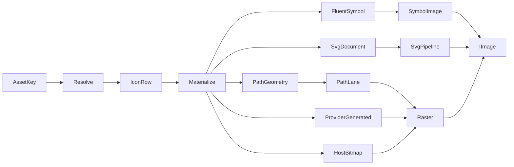

# [APPUI_ICONS_ASSETS]

Rasm.AppUi sources every icon and bundled asset through one nameof-derived `AssetKey` vocabulary: five `IconSource` cases materialize into one image product through a rank-column fallback walk, the SVG pipeline retains documents, scene graphs, and animation invalidation, raster rows own async loading with cache and DPI-variant policy, and the avares admission table mints identity receipts. The page owns the icon axis, the SVG pipeline, the raster rows, and the asset catalogue over FluentIcons.Avalonia, Svg.Controls.Skia.Avalonia, AsyncImageLoader.Avalonia, SkiaSharp, Thinktecture-generated vocabulary, and LanguageExt rails.

## [1]-[INDEX]

| [INDEX] | [CLUSTER]     | [OWNS]                                                              |
| :-----: | :------------ | :------------------------------------------------------------------ |
|   [1]   | ICON_AXIS     | Five-case icon union, rank-column fallback walk, one materialize dispatch |
|   [2]   | SVG_PIPELINE  | Retained SVG documents, scene graph, animation invalidation, hit testing |
|   [3]   | RASTER_ASSETS | Async raster loaders, cache scope, fallbacks, DPI-variant selection  |
|   [4]   | ASSET_CATALOG | Avares admission rows, key vocabulary, preload receipts, geo assets  |

## [2]-[ICON_AXIS]

- Owner: `IconSource` — one `[Union]` icon-sourcing axis; `IconSurface` owns the rank-walk resolution fold and the one materialize dispatch; `IconRow` is the resolution-table row carrying the rank column.
- Cases: FluentSymbol | SvgDocument | PathGeometry | ProviderGenerated | HostBitmap in canonical fallback order; `AssetFault` = Text | UnknownKey | SizeOffAxis | MaterializeRejected in the 4120 code band; 16, 20, 24, 32 are the closed size axis.
- Entry: `public static Fin<IImage> Resolve(FrozenDictionary<AssetKey, ImmutableArray<IconRow>> table, AssetKey key, int size, double scale, Func<string, Color> tokens)` — `Fin` aborts on off-axis size, unknown key, and exhausted ranks.
- Auto: the rank walk deletes per-call icon lookup and tint code; `DefaultRank` is the generated `Map` verdict table, so a new sourcing modality lands as one case plus one rank value; Projektanker-style attached icon registries stay rejected with this fold as the absorber.
- Packages: FluentIcons.Avalonia, SkiaSharp, Avalonia, Thinktecture.Runtime.Extensions, LanguageExt.Core
- Growth: one icon row — key, rank, case payload, tint token — absorbs a new icon or fallback with zero new surface; one case on `IconSource` plus one rank value absorbs a new sourcing modality.
- Boundary: `PathLane` is this fence's boundary capsule — native Skia path, paint, surface, and encode state stay inside its statement body; `HostBitmap` is host-agnostic — the byte-provider delegate binds per host row at mount and host image egress (`Eto.Drawing.Bitmap` `ToByteArray` at the Rasm.Rhino seam) crosses exactly once; per-row tint resolves through the theme token key column, never an ambient brush read.

```csharp signature
[Union]
public abstract partial record AssetFault : Expected, IValidationError<AssetFault> {
    private AssetFault(string detail, int code) : base(detail, code, None) { }

    public static AssetFault Create(string message) => new Text(message);

    public sealed record Text : AssetFault { public Text(string detail) : base(detail, 4120) { } }
    public sealed record UnknownKey : AssetFault { public UnknownKey(string detail) : base(detail, 4121) { } }
    public sealed record SizeOffAxis : AssetFault { public SizeOffAxis(string detail) : base(detail, 4122) { } }
    public sealed record MaterializeRejected : AssetFault { public MaterializeRejected(string detail) : base(detail, 4123) { } }
}

[Union]
public abstract partial record IconSource {
    private IconSource() { }

    public sealed record FluentSymbol(Symbol Glyph, IconVariant Variant) : IconSource;
    public sealed record SvgDocument(AssetKey Asset) : IconSource;
    public sealed record PathGeometry(string PathData) : IconSource;
    public sealed record ProviderGenerated(Func<int, double, SKColor, byte[]> Render) : IconSource;
    public sealed record HostBitmap(Func<int, double, byte[]> Provider) : IconSource;
}

public sealed record IconRow(AssetKey Key, int Rank, IconSource Source, string TintToken);

public static class IconSurface {
    public static readonly FrozenSet<int> Sizes = new[] { 16, 20, 24, 32 }.ToFrozenSet();

    public static int DefaultRank(IconSource source) =>
        source.Map(fluentSymbol: 0, svgDocument: 1, pathGeometry: 2, providerGenerated: 3, hostBitmap: 4);

    public static FrozenDictionary<AssetKey, ImmutableArray<IconRow>> Freeze(params ReadOnlySpan<IconRow> rows) =>
        rows.ToArray().GroupBy(static row => row.Key).ToFrozenDictionary(
            static group => group.Key,
            static group => group.OrderBy(static row => row.Rank).ToImmutableArray());

    public static Fin<IImage> Resolve(FrozenDictionary<AssetKey, ImmutableArray<IconRow>> table, AssetKey key, int size, double scale, Func<string, Color> tokens) =>
        from admitted in Sizes.Contains(size) ? Fin.Succ(size) : Fin.Fail<int>(new AssetFault.SizeOffAxis($"{size}"))
        from ranked in Ranked(table, key)
        from image in ranked.AsIterable().Fold(
            Fin.Fail<IImage>(new AssetFault.MaterializeRejected(key.ToString())),
            (acc, row) => acc.IsSucc ? acc : Materialize(row.Source, admitted, scale, tokens(row.TintToken)))
        select image;

    public static Fin<IImage> Materialize(IconSource source, int size, double scale, Color tint) =>
        source.Switch(
            state: (Size: size, Scale: scale, Tint: tint),
            fluentSymbol: static (s, c) => Fin.Succ<IImage>(new SymbolImage { Symbol = c.Glyph, IconVariant = c.Variant, FontSize = s.Size, Foreground = new SolidColorBrush(s.Tint) }),
            svgDocument: static (s, c) => SvgPipeline.Image(c.Asset, s.Tint),
            pathGeometry: static (s, c) => Raster(PathLane(c.PathData, s.Size, s.Scale, Skia(s.Tint))),
            providerGenerated: static (s, c) => Raster(c.Render(s.Size, s.Scale, Skia(s.Tint))),
            hostBitmap: static (s, c) => Raster(c.Provider(s.Size, s.Scale)));

    public static SKColor Skia(Color tint) => new(tint.R, tint.G, tint.B, tint.A);

    static Fin<ImmutableArray<IconRow>> Ranked(FrozenDictionary<AssetKey, ImmutableArray<IconRow>> table, AssetKey key) =>
        table.TryGetValue(key, out var rows) ? Fin.Succ(rows) : Fin.Fail<ImmutableArray<IconRow>>(new AssetFault.UnknownKey(key.ToString()));

    static Fin<IImage> Raster(byte[] payload) =>
        Fin.Succ<IImage>(new Bitmap(new MemoryStream(payload)));

    static byte[] PathLane(string pathData, int size, double scale, SKColor tint) {
        using SKPath path = SKPath.ParseSvgPathData(pathData);
        using SKPaint paint = new() { Color = tint };
        using SKSurface surface = SKSurface.Create(new SKImageInfo(Pixels(size, scale), Pixels(size, scale)));
        surface.Canvas.DrawPath(path, paint);
        using SKImage shot = surface.Snapshot();
        using SKData data = shot.Encode();
        return data.ToArray();
    }

    static int Pixels(int size, double scale) => (int)double.Ceiling(size * scale);
}
```



## [3]-[SVG_PIPELINE]

- Owner: `SvgPipeline` — retained SVG document admission, scene access, animation invalidation, hit testing, and tinted image projection.
- Entry: `public static Fin<SKSvg> Load(AssetKey key, Option<EventHandler<SvgAnimationFrameChangedEventArgs>> onAnimation = default)` — `Fin` aborts on unknown key and stream admission failure.
- Auto: the process-static retained table deletes per-control re-parse and per-call picture rebuilds; animation invalidation drives `InvalidateVisual` on the consuming `Svg` control; `SvgParameters` recolor and `CurrentColor` tinting ride the same theme token resolve.
- Packages: Svg.Controls.Skia.Avalonia, SkiaSharp, Avalonia, LanguageExt.Core, BCL inbox
- Growth: one retained row per asset key; a recolor or scene policy is one policy value with zero new surface.
- Boundary: the `Admit` and `Subscribed` pair is this fence's boundary capsule — native document construction, event attachment, and the process-static cache stay inside their statement bodies, the admitted stream is using-scoped, and a racing duplicate document disposes in place so only the retained winner survives; hit-test results cross into the interaction rail as scene-node values, never as retained control handles.

```csharp signature
public static class SvgPipeline {
    static readonly ConcurrentDictionary<AssetKey, SKSvg> Retained = new();

    public static Fin<SKSvg> Load(AssetKey key, Option<EventHandler<SvgAnimationFrameChangedEventArgs>> onAnimation = default) =>
        (Retained.TryGetValue(key, out var hit) ? Fin.Succ(hit) : AssetCatalog.Open(key).Map(payload => Admit(key, payload)))
            .Map(document => Subscribed(document, onAnimation));

    public static Fin<IImage> Image(AssetKey asset, Color tint) =>
        AssetCatalog.Row(asset).Map(row => (IImage)new SvgImage { Source = SvgSource.Load(row.Source.ToString()), CurrentColor = tint });

    public static Option<SvgSceneDocument> Scene(SKSvg document) =>
        document.HasRetainedSceneGraph ? Optional(document.RetainedSceneGraph) : None;

    public static Option<SvgSceneNode> Hit(SKSvg document, float x, float y) =>
        Optional(document.HitTestTopmostSceneNode(new SKPoint(x, y)));

    static SKSvg Admit(AssetKey key, Stream payload) {
        using Stream scoped = payload;
        SKSvg document = new();
        _ = document.Load(scoped);
        SKSvg retained = Retained.GetOrAdd(key, document);
        if (!ReferenceEquals(retained, document)) { document.Dispose(); }
        return retained;
    }

    static SKSvg Subscribed(SKSvg document, Option<EventHandler<SvgAnimationFrameChangedEventArgs>> onAnimation) {
        onAnimation.IfSome(handler => document.AnimationInvalidated += handler);
        return document;
    }
}
```

## [4]-[RASTER_ASSETS]

- Owner: `RasterAssets` — async raster loader rows, cache scope, and DPI-variant selection; `RasterRow` is the policy record carrying placeholder and error fallback keys.
- Entry: `public static IAsyncImageLoader Loader(ProfileRoots roots)` — the disk-cached loader rooted under the resolved app root.
- Auto: one `Wire` assignment publishes the global loader and deletes per-view loader construction; placeholder and error fallbacks are catalog keys consumed by `AdvancedImage` `FallbackImage` rows, never per-control bitmaps.
- Packages: AsyncImageLoader.Avalonia, Avalonia, Rasm.AppHost (project), LanguageExt.Core, BCL inbox
- Growth: one policy value per cache or variant fact; a remote companion source is one loader row with zero new surface.
- Boundary: remote rows serve companion streams and the web remote row is designed-only growth carrying zero unadmitted payload types; cache content lives under `ProfileRoots` and a second image cache stays rejected — the loader hierarchy and the blob lane absorb it.

```csharp signature
public sealed record RasterRow(AssetKey Placeholder, AssetKey Error, string CacheFolder, double HiDpiThreshold);

public static class RasterAssets {
    public static readonly RasterRow Policy = new(AssetKeys.IconPlaceholder, AssetKeys.IconError, "asset-cache", 1.5d);

    public static IAsyncImageLoader Loader(ProfileRoots roots) =>
        new DiskCachedWebImageLoader(Path.Join(roots.AppRoot, Policy.CacheFolder));

    public static IAsyncImageLoader CompanionLoader() =>
        new RamCachedWebImageLoader();

    public static Unit Wire(ProfileRoots roots) =>
        (ImageLoader.AsyncImageLoader = Loader(roots), unit).Item2;

    public static Uri Pick(AssetRow row, double scale) =>
        scale >= Policy.HiDpiThreshold && row.HiDpi is { IsSome: true, Case: Uri dense } ? dense : row.Source;
}
```

## [5]-[ASSET_CATALOG]

- Owner: `AssetCatalog` — the avares admission table; `AssetKey` is the one nameof-derived key vocabulary shared by command, screen, and chart rows; `AssetKind` is the kind axis.
- Cases: `AssetKind` = vector | raster | geo.
- Entry: `public static Fin<Stream> Open(AssetKey key, double scale = 1d)` — `Fin` aborts on unknown key; geo rows feed the chart geo series by key so the chart never loads files.
- Auto: `Preload` folds preload rows into identity receipts at boot; runtime asset reload is deleted — Debug hot reload rides HotAvalonia and Release assets are immutable avares plus blob-lane content.
- Receipt: `AssetReceipt` — key, kind, origin, scale, content hash — sinks through `ReceiptSinkPort` into the evidence stream.
- Packages: Avalonia, Thinktecture.Runtime.Extensions, LanguageExt.Core, BCL inbox
- Growth: one `AssetRow` — key, kind, avares source, hi-dpi variant, preload flag — admits a new asset with zero new surface.
- Boundary: avares content is the only Release-time asset origin; remote bytes enter through the raster loader rows and durable artifacts live in the blob lane; the key vocabulary crosses pages as values — sibling catalogs admit their icon and asset columns through `AssetKey` at composition; `Receipt` is this fence's boundary capsule — the probed stream is using-scoped inside the hash fold.

```csharp signature
public sealed class AssetKeyPolicy : IEqualityComparerAccessor<string>, IComparerAccessor<string> {
    private static readonly StringComparer Policy = StringComparer.Ordinal;

    public static IEqualityComparer<string> EqualityComparer => Policy;

    public static IComparer<string> Comparer => Policy;
}

[ValueObject<string>(
    ComparisonOperators = OperatorsGeneration.DefaultWithKeyTypeOverloads,
    EqualityComparisonOperators = OperatorsGeneration.DefaultWithKeyTypeOverloads)]
[ValidationError<AssetFault>]
[KeyMemberEqualityComparer<AssetKeyPolicy, string>]
[KeyMemberComparer<AssetKeyPolicy, string>]
public readonly partial struct AssetKey;

[SmartEnum<string>]
[ValidationError<AssetFault>]
[KeyMemberEqualityComparer<AssetKeyPolicy, string>]
[KeyMemberComparer<AssetKeyPolicy, string>]
public sealed partial class AssetKind {
    public static readonly AssetKind Vector = new("vector");
    public static readonly AssetKind Raster = new("raster");
    public static readonly AssetKind Geo = new("geo");
}

public sealed record AssetRow(AssetKey Key, AssetKind Kind, Uri Source, Option<Uri> HiDpi, bool Preload);

public sealed record AssetReceipt(AssetKey Key, AssetKind Kind, string Origin, double Scale, Option<string> ContentHash);

public static class AssetKeys {
    public static readonly AssetKey GeoWorld = AssetKey.Create(nameof(GeoWorld));
    public static readonly AssetKey IconPlaceholder = AssetKey.Create(nameof(IconPlaceholder));
    public static readonly AssetKey IconError = AssetKey.Create(nameof(IconError));
}

public static class AssetCatalog {
    public static readonly ImmutableArray<AssetRow> Rows = [
        new(AssetKeys.GeoWorld, AssetKind.Geo, Avares("geo/world.geojson"), None, true),
        new(AssetKeys.IconPlaceholder, AssetKind.Raster, Avares("raster/placeholder.png"), Some(Avares("raster/placeholder@2x.png")), true),
        new(AssetKeys.IconError, AssetKind.Raster, Avares("raster/error.png"), Some(Avares("raster/error@2x.png")), true),
    ];

    static Uri Avares(string path) => new("avares://Rasm.AppUi/Assets/" + path);

    private static readonly FrozenDictionary<AssetKey, AssetRow> Table = Rows.ToFrozenDictionary(static row => row.Key);

    public static Fin<AssetRow> Row(AssetKey key) =>
        Table.TryGetValue(key, out var row) ? Fin.Succ(row) : Fin.Fail<AssetRow>(new AssetFault.UnknownKey(key.ToString()));

    public static Fin<Stream> Open(AssetKey key, double scale = 1d) =>
        Row(key).Map(row => AssetLoader.Open(RasterAssets.Pick(row, scale)));

    public static Fin<Seq<AssetReceipt>> Preload() =>
        Rows.AsIterable().Filter(static row => row.Preload).TraverseM(static row => Receipt(row)).As().Map(static receipts => receipts.ToSeq());

    static Fin<AssetReceipt> Receipt(AssetRow row) =>
        Open(row.Key).Map(payload => {
            using Stream scoped = payload;
            return new AssetReceipt(row.Key, row.Kind, "avares", 1d, Some(Convert.ToHexString(SHA256.HashData(scoped))));
        });
}
```

