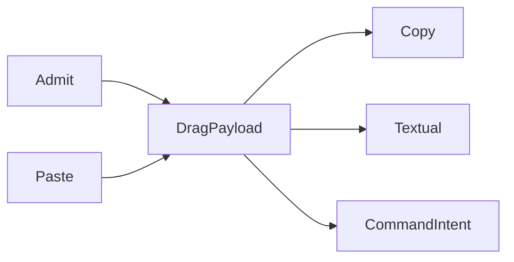

# [APPUI_INPUT_INTERACTION]

One interaction rail owns gesture mechanics for every admitted surface: keyboard chords derive from the one command table through a per-surface `GesturePolicy`, the behavior rail admits its trigger and action vocabulary as rows, pointer gestures and the frozen `PanZoomRow` canvas family route pinch, wheel, and drag input, and `DragPayload` plus `ClipboardRow` carry every transfer across the drag and clipboard boundaries on the validation rail. The page owns no key table, no conflict fold, no timer loop, and no second hotkey registry — the command deck, the AppHost schedule rows, and the motion timing vocabulary arrive settled. The spine is Avalonia, Xaml.Behaviors.Avalonia, PanAndZoom, Thinktecture.Runtime.Extensions, and LanguageExt.Core.

## [1]-[INDEX]

| [INDEX] | [CLUSTER]         | [OWNS]                                                              |
| :-----: | ----------------- | ------------------------------------------------------------------- |
|   [1]   | HOTKEY_DERIVATION | Chord transform, scope split, gesture bindings over the frozen deck |
|   [2]   | BEHAVIOR_RAIL     | Admitted trigger and action rows; one intent-binding entry          |
|   [3]   | POINTER_GESTURES  | Gesture routing rows and the frozen pan-zoom canvas family          |
|   [4]   | DRAG_CLIPBOARD    | Typed transfer payload union and clipboard codec rows               |

## [2]-[HOTKEY_DERIVATION]

- Owner: `GesturePolicy` — the per-surface chord, scope, and return-key policy record carrying the binding fold.
- Entry: `public FrozenDictionary<KeyGesture, CommandIntent> Bindings(CommandDeck deck)` — pure fold over the frozen deck's gesture column through its chord delegate; the first admitted row holds a contested chord and every later claimant drops deterministically.
- Auto: `For` builds the policy whose `Chord` the deck freeze receives; bindings derive once per frozen deck; global rows attach at the surface root during the mount transaction, screen-scoped rows attach inside activation scopes and detach with them.
- Packages: Avalonia, LanguageExt.Core, BCL inbox
- Growth: a new hotkey is one gesture value on its command-table row; a new surface posture is one policy value inside `For`; zero new surface.
- Boundary: the command table owns the `Option<KeyGesture>` column as the only key table in the package and the deck's freeze-time conflict fold is the only conflict evidence — a second conflict fold or receipt shape here is the deleted pattern; canonical gestures are authored with the control modifier and `Chord` swaps it for the platform primary, so one authored chord serves every desktop; web and headless rows pin the control modifier for deterministic specs and serialized parity; the Rhino panel posture holds the return key inside the panel instead of the host command line, with the host knob spelling research-gated; `KeyGesture` is value-equal with the `(Key, KeyModifiers)` constructor and `Parse`, and bindings attach as `KeyBinding` rows (`Gesture`, `Command`) in the surface root's `KeyBindings` collection.

```csharp signature
public sealed record GesturePolicy(
    KeyModifiers Primary,
    bool WantReturnInPanel,
    Func<CommandIntent, bool> ScreenScoped) {
    public static GesturePolicy For(SurfaceHost host) =>
        new(
            Primary: host is SurfaceHost.WebBrowser or SurfaceHost.Headless || !OperatingSystem.IsMacOS()
                ? KeyModifiers.Control
                : KeyModifiers.Meta,
            WantReturnInPanel: host is SurfaceHost.RhinoPanel,
            ScreenScoped: static _ => false);

    public KeyGesture Chord(KeyGesture canonical) =>
        (canonical.KeyModifiers & KeyModifiers.Control) != 0
            ? new KeyGesture(canonical.Key, (canonical.KeyModifiers & ~KeyModifiers.Control) | Primary)
            : canonical;

    public FrozenDictionary<KeyGesture, CommandIntent> Bindings(CommandDeck deck) =>
        toSeq(deck.Rows.Values)
            .Bind(row => row.Gesture.Map(gesture => (Gesture: deck.Chord(gesture), Row: row)).ToSeq())
            .Fold(
                HashMap<KeyGesture, CommandIntent>(),
                static (held, pair) => held.Find(pair.Gesture).IsSome ? held : held.Add(pair.Gesture, pair.Row))
            .AsEnumerable()
            .ToFrozenDictionary(static pair => pair.Key, static pair => pair.Value);

    public (Seq<CommandIntent> Global, Seq<CommandIntent> Scoped) Split(Seq<CommandIntent> table) =>
        (table.Filter(row => !ScreenScoped(row)), table.Filter(ScreenScoped));
}
```

## [3]-[BEHAVIOR_RAIL]

- Owner: `BehaviorRail` — the static intent-binding surface over the admitted trigger and action rows.
- Entry: `public static InvokeCommandAction Intent(ICommand command)` — the only action-to-command bridge; the argument is the table-generated ReactiveCommand row resolved by intent key.
- Packages: Xaml.Behaviors.Avalonia, BCL inbox
- Growth: a new interaction trigger or action is one admission-table row naming its catalogued type, knob, and timing row; zero new surface.
- Boundary: `FileSystemWatcherTrigger`, `NetworkInformationTrigger`, `HttpRequestAction`, and `WriteTextToFileAction` are the deleted patterns — asset hot reload rides the HotAvalonia Debug loop over immutable avares content, connectivity reads the AppHost degradation fold, outbound requests ride the AppHost hop registry, and file export rides the offscreen-visuals export rows through the Persistence port; `TimerTrigger` rows carry surface-local micro-cadence only and process cadence stays on the AppHost schedule rows; throttle and debounce intervals resolve from the motion timing vocabulary at composition, so behavior rows carry zero literal intervals — `ThrottleAction.Interval` and `DebounceAction.Delay` are `TimeSpan` knobs, `ObservableStreamBehavior.Source` carries the observable, and `PassEventArgsToCommand` sits on the action base; the routed-event row materializes as the catalogued routed-event-trigger family, one trigger per named routed event, never a hand-written event handler.

```csharp signature
public static class BehaviorRail {
    public static InvokeCommandAction Intent(ICommand command) =>
        new() { Command = command, PassEventArgsToCommand = false };
}
```

| [INDEX] | [ROW]          | [SURFACE]                            | [KNOB]       | [TIMING_ROW] |
| :-----: | -------------- | ------------------------------------ | ------------ | :----------: |
|   [1]   | routed-event   | `Xaml.Behaviors.Interactions.Events` | —            |      —       |
|   [2]   | data           | `DataTriggerBehavior`                | `Binding`    |      —       |
|   [3]   | multi-data     | `MultiDataTriggerBehavior`           | `Conditions` |      —       |
|   [4]   | timer          | `TimerTrigger`                       | —            |   standard   |
|   [5]   | task-completed | `TaskCompletedTrigger`               | —            |      —       |
|   [6]   | stream-bridge  | `ObservableStreamBehavior`           | `Source`     |      —       |
|   [7]   | intent-action  | `InvokeCommandAction`                | `Command`    |      —       |
|   [8]   | property       | `ChangePropertyAction`               | —            |      —       |
|   [9]   | async-group    | `AsyncActionGroup`                   | `Actions`    |      —       |
|  [10]   | throttle       | `ThrottleAction`                     | `Interval`   |     fast     |
|  [11]   | debounce       | `DebounceAction`                     | `Delay`      |   standard   |

## [4]-[POINTER_GESTURES]

- Owner: `PanZoomRow` — the frozen canvas row family over `ZoomBorder`; gesture routing rows.
- Cases: `Dashboard` | `Preview`
- Packages: PanAndZoom, Xaml.Behaviors.Avalonia, Avalonia, BCL inbox
- Growth: a new zoomable surface is one `PanZoomRow` row; a new pointer gesture is one routing-table row landing on an existing intent; a rotation or saved-view posture is one policy value on the row; zero new surface.
- Boundary: one zoom owner per canvas — a chart tile mounted inside a `PanZoomRow` canvas gates its internal zoom off; the row's `MinZoom` and `MaxZoom` land on the control's per-axis `MinZoomX`/`MinZoomY`/`MaxZoomX`/`MaxZoomY` at composition; `Dashboard` animation duration binds `AnimationDuration` from the motion standard row at composition and `Preview` stays animation-free for capture determinism; rotation rides the `EnableRotation` row gate onto the control `Rotate`/`RotateAt` operations with `SnapRotation` quantizing to the rotation-step policy value and `ResetRotation` clearing on view reset, so a hand-built rotation matrix on the canvas is the deleted form and `Preview` holds rotation off for capture determinism; view state round-trips through the `ZoomBorderState` value and `ImportState` into the screen-state snapshot rows, named viewports persist through `SaveView`/`RestoreView` with `DeleteSavedView` and `ClearSavedViews` owning the named-view registry as command-table intents, traversal rides `NavigateBack`/`NavigateForward` with `ClearViewHistory` resetting the stack at screen teardown; focus follows pointer press through `Focus` on `IInputElement`, and pointer-capture acquisition on press and release on capture-loss ride the behavior rail as routed-event triggers; the dashboard tile canvas and the offscreen-visuals preview canvas consume these rows as settled values.

```csharp signature
public sealed record PanZoomRow(
    string Key,
    StretchMode Stretch,
    ButtonName PanButton,
    double ZoomSpeed,
    double MinZoom,
    double MaxZoom,
    bool EnableConstrains,
    bool EnableGestures,
    bool EnableAnimations,
    bool ShowZoomIndicator,
    bool EnableRotation,
    double RotationStep) {
    public static readonly PanZoomRow Dashboard = new("dashboard", StretchMode.None, ButtonName.Middle, ZoomSpeed: 1.2, MinZoom: 0.1, MaxZoom: 8.0, EnableConstrains: true, EnableGestures: true, EnableAnimations: true, ShowZoomIndicator: true, EnableRotation: true, RotationStep: 15.0);
    public static readonly PanZoomRow Preview = new("preview", StretchMode.Uniform, ButtonName.Middle, ZoomSpeed: 1.2, MinZoom: 0.05, MaxZoom: 64.0, EnableConstrains: true, EnableGestures: true, EnableAnimations: false, ShowZoomIndicator: false, EnableRotation: false, RotationStep: 0.0);

    public static readonly FrozenDictionary<string, PanZoomRow> Rows =
        new[] { Dashboard, Preview }.ToFrozenDictionary(static row => row.Key, static row => row, StringComparer.Ordinal);
}
```

| [INDEX] | [GESTURE]       | [ROUTE]                              | [CONSEQUENCE]                                            |
| :-----: | --------------- | ------------------------------------ | -------------------------------------------------------- |
|   [1]   | tap             | routed-event trigger over tap        | primary intent action fires                              |
|   [2]   | double-tap      | routed-event trigger over double-tap | canvas rows route through `DoubleClickZoomMode`          |
|   [3]   | press-hold      | routed-event trigger over press-hold | context intent raise                                     |
|   [4]   | context-request | routed-event trigger over right-tap  | menu derivation from the command-table surface predicate |
|   [5]   | wheel zoom      | `ZoomBorder`                         | one zoom owner per canvas row                            |
|   [6]   | pinch zoom      | `ZoomBorder` `EnableGestures`        | same single-owner law                                    |
|   [7]   | canvas drag     | `CanvasDragBehavior`                 | draggable tiles inside canvas rows                       |
|   [8]   | item drag       | `ItemDragBehavior`                   | draggable-control rows                                   |
|   [9]   | rotate gesture  | `ZoomBorder` `Rotate` / `SnapRotation` | gated by the row `EnableRotation` under `RotationStep`  |
|  [10]   | saved-view      | `ZoomBorder` `RestoreView` / `SaveView` | `DeleteSavedView`/`ClearSavedViews` raise as intents   |

## [5]-[DRAG_CLIPBOARD]

- Owner: `DragPayload` transfer union; `ClipboardRow` codec row family.
- Cases: `TableRows(Seq<string> Keys, string Tsv)` | `AssetKey(string Key)` | `HostObjects(Seq<Guid> Ids)` | `Files(Seq<string> Paths)` | `Image(ReadOnlyMemory<byte> Png)`
- Entry: `public static Validation<Error, DragPayload> Admit(Seq<string> paths, Func<string, bool> admitted)` — external drop admission; `Validation<Error,T>` accumulates one refusal per unadmitted path.
- Auto: every external drop runs `Admit` and every paste runs its row `Paste` before any intent fires; refusals fold into the screen fault state with zero partial payloads.
- Receipt: admitted payloads raise their command intents and ride the command receipt family — the rail mints no second receipt vocabulary.
- Packages: Thinktecture.Runtime.Extensions, LanguageExt.Core, Xaml.Behaviors.Avalonia, Avalonia, BCL inbox
- Growth: a new transfer shape is one union case plus one `ClipboardRow`; zero new surface.
- Boundary: drag rows ride `ContextDragBehavior`, `ContextDropBehavior`, and `ListReorderDragBehavior`; the `admitted` predicate column arrives from the dialogs file-filter vocabulary; a paste gates through `GetClipboardFormatsAction` so the present data-format identifiers select the matching `ClipboardRow` before any `Paste` runs and an absent format folds to no-op rather than a failed decode; plain-text paste routes to the focused control and never the payload rail, so the text row is copy-only by law; asset keys ride the icons asset-key vocabulary and table-row keys ride the grid row-model identity; structured copy crosses through one clipboard write keyed by the row `Format` identifiers and the exact multi-format clipboard-write spelling resolves under the CLIPBOARD_WRITE research item; host-object drag across the NSView boundary is research-gated on the embed capsule.

```csharp signature
[Union(ConversionFromValue = ConversionOperatorsGeneration.None)]
public abstract partial record DragPayload {
    private DragPayload() { }

    public sealed record TableRows(Seq<string> Keys, string Tsv) : DragPayload;

    public sealed record AssetKey(string Key) : DragPayload;

    public sealed record HostObjects(Seq<Guid> Ids) : DragPayload;

    public sealed record Files(Seq<string> Paths) : DragPayload;

    public sealed record Image(ReadOnlyMemory<byte> Png) : DragPayload;

    public static string Textual(DragPayload payload) =>
        payload.Switch(
            tableRows: static rows => rows.Tsv,
            assetKey: static key => key.Key,
            hostObjects: static host => string.Join(",", host.Ids),
            files: static files => string.Join("\n", files.Paths),
            image: static _ => string.Empty);

    public static Validation<Error, DragPayload> Admit(Seq<string> paths, Func<string, bool> admitted) =>
        Refused(paths, admitted) switch {
            { IsEmpty: true } => paths.IsEmpty
                ? (Validation<Error, DragPayload>)Error.New("<empty-drop>")
                : (Validation<Error, DragPayload>)new Files(paths),
            var refused => (Validation<Error, DragPayload>)Error.Many([.. refused]),
        };

    private static Seq<Error> Refused(Seq<string> paths, Func<string, bool> admitted) =>
        paths.Filter(path => !admitted(path)).Map(static path => Error.New($"<unadmitted-drop:{path}>"));
}

public sealed record ClipboardRow(
    string Format,
    Func<DragPayload, Option<ReadOnlyMemory<byte>>> Copy,
    Func<ReadOnlyMemory<byte>, Validation<Error, DragPayload>> Paste) {
    public static readonly ClipboardRow Text = new(
        "text/plain",
        Copy: static payload => Optional<ReadOnlyMemory<byte>>(Encoding.UTF8.GetBytes(DragPayload.Textual(payload))),
        Paste: static _ => (Validation<Error, DragPayload>)Error.New("<plain-text-paste-unrouted>"));

    public static readonly ClipboardRow Tsv = new(
        "text/tab-separated-values",
        Copy: static payload => payload is DragPayload.TableRows rows ? Optional<ReadOnlyMemory<byte>>(Encoding.UTF8.GetBytes(rows.Tsv)) : None,
        Paste: static bytes => (Validation<Error, DragPayload>)new DragPayload.TableRows(Seq<string>(), Encoding.UTF8.GetString(bytes.Span)));

    public static readonly ClipboardRow Png = new(
        "image/png",
        Copy: static payload => payload is DragPayload.Image image ? Optional(image.Png) : None,
        Paste: static bytes => bytes.Span is [0x89, 0x50, 0x4E, 0x47, ..]
            ? (Validation<Error, DragPayload>)new DragPayload.Image(bytes)
            : (Validation<Error, DragPayload>)Error.New("<png-signature-mismatch>"));

    public static readonly ClipboardRow Asset = new(
        "application/x-rasm-asset-key",
        Copy: static payload => payload is DragPayload.AssetKey key ? Optional<ReadOnlyMemory<byte>>(Encoding.UTF8.GetBytes(key.Key)) : None,
        Paste: static bytes => (Validation<Error, DragPayload>)new DragPayload.AssetKey(Encoding.UTF8.GetString(bytes.Span)));

    public static readonly FrozenDictionary<string, ClipboardRow> Rows =
        new[] { Text, Tsv, Png, Asset }.ToFrozenDictionary(static row => row.Format, static row => row, StringComparer.Ordinal);
}
```



## [6]-[RESEARCH]

- [PANEL_KEYS]: Rhino panel return-key policy knob residence and its registration point on the panel host.
- [EMBEDDED_DRAG]: host-object drag across the NSView boundary carrying Rhino object ids into and out of the embedded panel.
- [GESTURE_TRIGGERS]: the per-gesture routed-event-trigger spellings for tap, double-tap, press-hold, and right-tap, and the press-hold gesture-event source, against the behaviors routed-event-trigger family.
- [POINTER_CAPTURE]: the pointer-capture acquisition and capture-loss spellings carried as behavior-rail routed-event triggers on the canvas rows.
- [ROTATE_GESTURE]: the two-finger rotate `GestureEventArgs` source the rotation row binds to drive `Rotate`/`SnapRotation` under the `RotationStep` policy — the `Rotate`/`RotateAt`/`ResetRotation`/`SnapRotation` operations and the saved-view registry operations are fenced.
- [CLIPBOARD_WRITE]: the multi-format structured clipboard-write spelling keyed by the `ClipboardRow` format identifiers — Avalonia 12 reshaped the data-transfer surface, so the write rides `IClipboard.SetDataAsync(IDataTransfer)` with `DataTransfer`/`DataTransferItem` carrying per-format payloads keyed by `DataFormat.CreateBytesApplicationFormat`/`CreateStringApplicationFormat` (the legacy `DataObject`/`DataFormats` surface is obsolete), and the read rides `IClipboard.TryGetDataAsync`; the exact `IDataTransfer` assembly and the per-item write composition bind at implementation against the installed Avalonia surface.
