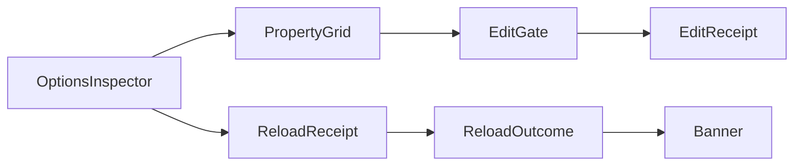

# [APPUI_INSPECTOR_EDITING]

Typed property inspection and value editing for product state: one `InspectorPolicy`-driven PropertyGrid admission capsule, eleven ranked `EditorFactory` rows resolving every editable shape, an `EditFault`/`EditReceipt` commit rail with the preview-versus-commit law, the options-inspector composite binding policy records to user-settings writes and `ReloadReceipt` outcomes, a side-by-side conflict projection over Persistence conflict receipts, and grammar-scoped `CodePane` rows with a completion projection. The page owns the editor-row axis, the edit fault and outcome vocabulary, the inspector policy values, and the conflict and completion projections. The spine is bodong.Avalonia.PropertyGrid, Avalonia.Controls.ColorPicker, Avalonia.AvaloniaEdit with AvaloniaEdit.TextMate, ReactiveUI.Validation, UnitsNet, Thinktecture.Runtime.Extensions, NodaTime, System.Reactive, and LanguageExt.Core.

## [1]-[INDEX]

| [INDEX] | [CLUSTER]           | [OWNS]                                                          |
| :-----: | ------------------- | --------------------------------------------------------------- |
|   [1]   | INSPECTOR_SURFACE   | PropertyGrid admission policy, descriptor filters, focus receipts |
|   [2]   | EDITOR_FACTORIES    | Eleven ranked editor rows with total shape match                 |
|   [3]   | COMMIT_VALIDATION   | Typed admission rail, preview-commit law, edit receipts          |
|   [4]   | OPTIONS_INSPECTOR   | Options-to-grid binding, user-settings persist, reload banner    |
|   [5]   | CONFLICT_RESOLUTION | Side-by-side conflict projection with resolution intent keys     |
|   [6]   | CODE_EDITING        | Grammar-scoped code panes and completion projection              |

## [2]-[INSPECTOR_SURFACE]

- Owner: `InspectorPolicy` policy record; `InspectorSurface` static boundary capsule.
- Entry: `Mount(PropertyGrid grid, InspectorPolicy policy, object subject, ClockPolicy clocks, CorrelationId correlation, Action<EditReceipt> sink)` — `IDisposable` detacher composed LIFO by the activation scope.
- Receipt: `EditReceipt` focus kind — surface, member path, `Instant`, correlation.
- Packages: bodong.Avalonia.PropertyGrid, System.Reactive, NodaTime, LanguageExt.Core
- Growth: one policy value on `InspectorPolicy`; zero new surface.
- Boundary: `Mount` is the page's PropertyGrid boundary capsule — the inspected subject enters through `DataContext` (the grid's only subject channel) as object because the grid inspects arbitrary shapes, and canonical typing re-enters at the editor rows; every grid event is a routed `EventHandler<RoutedEventArgs>` whose args narrow to `CustomPropertyDescriptorFilterEventArgs` (`TargetObject`, `PropertyDescriptor`, settable `IsVisible`) and `PropertyGotFocusEventArgs` (`Context`), so host-API variance lives in the policy's delegate columns (`Admit` descriptor filter, `FocusTarget` member-path projection) and no call site beyond the capsule reads grid event internals; `OperationIntents` surface operation controls as command-table intent keys and the derivation fold lives with the command table — a per-screen operation registry is deleted; quick-filter, category, and read-only state are policy values, never control state.

```csharp signature
public sealed record InspectorPolicy(
    bool ReadOnly,
    bool CategoriesVisible,
    bool QuickFilter,
    bool CategoriesExpanded,
    string Surface,
    Seq<string> OperationIntents,
    Action<CustomPropertyDescriptorFilterEventArgs> Admit,
    Func<PropertyGotFocusEventArgs, string> FocusTarget);

public static partial class InspectorSurface {
    public static IDisposable Mount(PropertyGrid grid, InspectorPolicy policy, object subject, ClockPolicy clocks, CorrelationId correlation, Action<EditReceipt> sink) {
        grid.DataContext = subject;
        grid.IsReadOnly = policy.ReadOnly;
        grid.IsCategoryVisible = policy.CategoriesVisible;
        grid.IsQuickFilterVisible = policy.QuickFilter;
        grid.AllCategoriesExpanded = policy.CategoriesExpanded;
        EventHandler<RoutedEventArgs> admit = (_, args) => policy.Admit((CustomPropertyDescriptorFilterEventArgs)args);
        EventHandler<RoutedEventArgs> focus = (_, args) => sink(new EditReceipt(
            Kind: EditReceipt.FocusKind,
            Surface: policy.Surface,
            Target: policy.FocusTarget((PropertyGotFocusEventArgs)args),
            Editor: string.Empty,
            Outcome: new EditOutcome.Observed(),
            At: clocks.Now,
            Correlation: correlation));
        grid.CustomPropertyDescriptorFilter += admit;
        grid.PropertyGotFocus += focus;
        return Disposable.Create(() => {
            grid.CustomPropertyDescriptorFilter -= admit;
            grid.PropertyGotFocus -= focus;
        });
    }
}
```

## [3]-[EDITOR_FACTORIES]

- Owner: `EditorKeyPolicy` single ordinal-ignore-case key accessor; `EditorFactory` `[SmartEnum<string>]` eleven rows.
- Cases: quantity, value-object, optional, color, choice, path, collection, boolean, numeric, text, nested — rank equals declaration order, the match walk takes the first accepting row, and nested is the total fallback for record shapes.
- Entry: `Match(Type shape)` — `Option<EditorFactory>` rank walk over `Items`.
- Auto: generated `Items` ordering and key factories under `[ValidationError<EditFault>]`; the `Accepts` column rides `[UseDelegateFromConstructor]`.
- Packages: bodong.Avalonia.PropertyGrid, Avalonia.Controls.ColorPicker, UnitsNet, Thinktecture.Runtime.Extensions, LanguageExt.Core, BCL inbox
- Growth: one editor row on `EditorFactory` (key, rank, accept predicate, bridge column); zero new surface — per-shape editor controls and per-`[ValueObject]` editor classes are deleted by the value-object and quantity rows.
- Boundary: the `Bridge` column names the package factory type a stock row registers; `None` rows (quantity, value-object, optional, choice) ride the one row-driven `AbstractCellEditFactory` adapter overriding `ImportPriority` (virtual int, stock default 100), `Accept(object accessToken)`, `HandleNewProperty(PropertyCellContext)` returning `Control?`, `HandlePropertyChanged(PropertyCellContext)` returning bool, and `HandleReadOnlyStateChanged(Control, bool)`, with `SetAndRaise(PropertyCellContext, Control, object?)` driving the undo-scoped command pipeline; generated-owner detection rides `MetadataLookup.Find` over the pin-stable `Thinktecture.Internal` metadata classes — `Metadata.Keyed.SmartEnum`/`Metadata.KeylessSmartEnum` split choice rows from `Metadata.Keyed.ValueObject`/`Metadata.ComplexValueObject` value rows, deleting the interface scan and the `Items` reflection probe; the optional row re-enters `Match` on the wrapped argument and renders absence as a value, never a sentinel; color rows present `PreviewableColorPicker` with the `Palettes` families and HSV models.

```csharp signature
public sealed class EditorKeyPolicy : IEqualityComparerAccessor<string>, IComparerAccessor<string> {
    private static readonly StringComparer Policy = StringComparer.OrdinalIgnoreCase;

    public static IEqualityComparer<string> EqualityComparer => Policy;

    public static IComparer<string> Comparer => Policy;
}

[SmartEnum<string>]
[ValidationError<EditFault>]
[KeyMemberEqualityComparer<EditorKeyPolicy, string>]
[KeyMemberComparer<EditorKeyPolicy, string>]
public sealed partial class EditorFactory {
    public static readonly EditorFactory Quantity = new("quantity", rank: 10, accepts: AcceptQuantity, bridge: None);
    public static readonly EditorFactory Value = new("value-object", rank: 20, accepts: AcceptValue, bridge: None);
    public static readonly EditorFactory Optional = new("optional", rank: 30, accepts: AcceptOptional, bridge: None);
    public static readonly EditorFactory Color = new("color", rank: 40, accepts: AcceptColor, bridge: Some(typeof(ColorCellEditFactory)));
    public static readonly EditorFactory Choice = new("choice", rank: 50, accepts: AcceptChoice, bridge: None);
    public static readonly EditorFactory Path = new("path", rank: 60, accepts: AcceptPath, bridge: Some(typeof(PathCellEditFactory)));
    public static readonly EditorFactory Collection = new("collection", rank: 70, accepts: AcceptCollection, bridge: Some(typeof(CollectionCellEditFactory)));
    public static readonly EditorFactory Boolean = new("boolean", rank: 80, accepts: AcceptBoolean, bridge: Some(typeof(BooleanCellEditFactory)));
    public static readonly EditorFactory Numeric = new("numeric", rank: 90, accepts: AcceptNumeric, bridge: Some(typeof(NumericCellEditFactory)));
    public static readonly EditorFactory Text = new("text", rank: 100, accepts: AcceptText, bridge: Some(typeof(StringCellEditFactory)));
    public static readonly EditorFactory Nested = new("nested", rank: 110, accepts: AcceptNested, bridge: Some(typeof(ExpandableCellEditFactory)));

    public static readonly Seq<IColorPalette> Palettes = Seq<IColorPalette>(new FluentColorPalette(), new MaterialColorPalette(), new FlatColorPalette());

    public int Rank { get; }

    public Option<Type> Bridge { get; }

    [UseDelegateFromConstructor]
    public partial bool Accepts(Type shape);

    public static Option<EditorFactory> Match(Type shape) => Items.AsIterable().Find(row => row.Accepts(shape));

    private static readonly FrozenSet<Type> NumericShapes = new[] {
        typeof(byte), typeof(sbyte), typeof(short), typeof(ushort), typeof(int), typeof(uint),
        typeof(long), typeof(ulong), typeof(float), typeof(double), typeof(decimal),
    }.ToFrozenSet();

    private static bool AcceptQuantity(Type shape) => typeof(IQuantity).IsAssignableFrom(shape);
    private static bool AcceptValue(Type shape) => MetadataLookup.Find(shape) is Metadata.Keyed.ValueObject or Metadata.ComplexValueObject;
    private static bool AcceptOptional(Type shape) => shape is { IsGenericType: true } && shape.GetGenericTypeDefinition() == typeof(Option<>);
    private static bool AcceptColor(Type shape) => shape == typeof(Avalonia.Media.Color);
    private static bool AcceptChoice(Type shape) => shape.IsEnum || MetadataLookup.Find(shape) is Metadata.Keyed.SmartEnum or Metadata.KeylessSmartEnum;
    private static bool AcceptPath(Type shape) => typeof(FileSystemInfo).IsAssignableFrom(shape);
    private static bool AcceptCollection(Type shape) => shape != typeof(string) && typeof(IEnumerable).IsAssignableFrom(shape);
    private static bool AcceptBoolean(Type shape) => shape == typeof(bool);
    private static bool AcceptNumeric(Type shape) => NumericShapes.Contains(shape);
    private static bool AcceptText(Type shape) => shape == typeof(string);
    private static bool AcceptNested(Type shape) => shape is { IsClass: true, IsAbstract: false };
}
```

## [4]-[COMMIT_VALIDATION]

- Owner: `EditFault` `[Union]` fault family on the doctrine `Expected` shape with the dual-tier `Create` contract; `EditOutcome` `[Union]`; `EditReceipt` record; `EditGate` static admission surface.
- Cases: `EditFault` Text, Parse, Invariant, UnmatchedShape, StoreRejected, HostRejected, Aggregate — codes 4700-4799, `Combine` folds independent faults into Aggregate; `EditOutcome` Observed, Committed, Reverted, Rejected, HostRouted.
- Entry: `Admit<TOwner, TRaw, TError>(string target, TRaw raw, IFormatProvider? culture = null)` — `Validation<EditFault,TOwner>` accumulates; `Resolve(Type shape)` lifts an unmatched shape onto the same rail.
- Receipt: `EditReceipt` — kind, surface, target, editor row key, outcome, `Instant`, `CorrelationId`.
- Packages: Thinktecture.Runtime.Extensions, UnitsNet, ReactiveUI.Validation, NodaTime, LanguageExt.Core
- Growth: one case on `EditFault` or `EditOutcome`; zero new surface.
- Boundary: preview interactions (`PreviewColorChanged` on `PreviewableColorPicker`, transient editor control state) mutate nothing durable and emit nothing; the grid's `CommandExecuting` event carries `RoutedCommandExecutingEventArgs` with a settable `Canceled` — the gate vetoes a failing admission there — and `CommandExecuted` carries `RoutedCommandExecutedEventArgs` (`Command`, `Target`, `Property`, `OldValue`, `NewValue`) and sinks exactly one `EditReceipt` per commit — the executing-versus-executed split is the whole debounce law, with `ColorChanged` as the picker's commit edge; the value-object leg is the doctrine `Validate` bridge, so `Create`/`TryCreate` call sites and per-call-site error translation are deleted; quantity admission parses through `Quantity.TryParse` with explicit culture and unit lists present through `QuantityInfo`/`UnitInfo` from `Quantity.Infos`; `ValidateProperty` text renders through `BindValidation` against the screen validation vocabulary and `IsValid` streams gate commit intents — a second validation rail is deleted; host-mutating edits route through the Rasm.Rhino document-transaction port undo-scoped, and `HostRouted` carries that hop's correlation.

```csharp signature
[Union]
public abstract partial record EditFault : Expected, IValidationError<EditFault>, Semigroup<EditFault> {
    private EditFault(string detail, int code) : base(detail, code, None) { }

    public static EditFault Create(string message) => new Text(message);

    public sealed record Text : EditFault { public Text(string detail) : base(detail, 4700) { } }
    public sealed record Parse : EditFault {
        public Parse(string target, string detail) : base($"{target}: {detail}", 4701) => Target = target;
        public string Target { get; }
    }
    public sealed record Invariant : EditFault {
        public Invariant(string target, string detail) : base($"{target}: {detail}", 4702) => Target = target;
        public string Target { get; }
    }
    public sealed record UnmatchedShape : EditFault {
        public UnmatchedShape(string shape) : base($"{shape}: no editor row", 4703) => Shape = shape;
        public string Shape { get; }
    }
    public sealed record StoreRejected : EditFault {
        public StoreRejected(string target, string detail) : base($"{target}: {detail}", 4704) => Target = target;
        public string Target { get; }
    }
    public sealed record HostRejected : EditFault {
        public HostRejected(string target, string detail) : base($"{target}: {detail}", 4705) => Target = target;
        public string Target { get; }
    }
    public sealed record Aggregate : EditFault {
        public Aggregate(Seq<EditFault> faults) : base($"{faults.Count} faults", 4799) => Faults = faults;
        public Seq<EditFault> Faults { get; }
    }

    public EditFault Combine(EditFault rhs) => (this, rhs) switch {
        (Aggregate l, Aggregate r) => new Aggregate(l.Faults + r.Faults),
        (Aggregate l, _) => new Aggregate(l.Faults.Add(rhs)),
        (_, Aggregate r) => new Aggregate(this.Cons(r.Faults)),
        _ => new Aggregate(Seq(this, rhs)),
    };
}

[Union(ConversionFromValue = ConversionOperatorsGeneration.None)]
public abstract partial record EditOutcome {
    private EditOutcome() { }

    public sealed record Observed : EditOutcome;
    public sealed record Committed(string Editor) : EditOutcome;
    public sealed record Reverted(string Editor) : EditOutcome;
    public sealed record Rejected(EditFault Fault) : EditOutcome;
    public sealed record HostRouted(CorrelationId Transaction) : EditOutcome;
}

public sealed record EditReceipt(
    string Kind,
    string Surface,
    string Target,
    string Editor,
    EditOutcome Outcome,
    Instant At,
    CorrelationId Correlation) {
    public const string FocusKind = "focus";
    public const string EditKind = "edit";
    public const string OptionsKind = "options";
    public const string ConflictKind = "conflict";
}

public static class EditGate {
    public static Validation<EditFault, TOwner> Admit<TOwner, TRaw, TError>(string target, TRaw raw, IFormatProvider? culture = null)
        where TOwner : IObjectFactory<TOwner, TRaw, TError>
        where TRaw : notnull, allows ref struct
        where TError : Expected, IValidationError<TError> =>
        TOwner.Validate(raw, culture, out var owner) is { } fault
            ? (Validation<EditFault, TOwner>)new EditFault.Invariant(target, fault.Message)
            : (Validation<EditFault, TOwner>)owner!;

    public static Validation<EditFault, IQuantity> AdmitQuantity(string target, Type shape, string text, IFormatProvider culture) =>
        Quantity.TryParse(culture, shape, text, out var parsed)
            ? (Validation<EditFault, IQuantity>)parsed!
            : new EditFault.Parse(target, text);

    public static Validation<EditFault, EditorFactory> Resolve(Type shape) =>
        EditorFactory.Match(shape) is { IsSome: true, Case: EditorFactory row }
            ? (Validation<EditFault, EditorFactory>)row
            : new EditFault.UnmatchedShape(shape.Name);
}
```

## [5]-[OPTIONS_INSPECTOR]

- Owner: `OptionsInspector<T>` binding record; `InspectorSurface` extension `Attach`/`Banner`.
- Cases: banner keys per `ReloadOutcome` case — options-applied, options-unchanged, options-restart-required, options-rejected; restart-required is the frozen-row path rendered as a typed outcome, never a toast.
- Entry: `Attach<T>(PropertyGrid grid, OptionsInspector<T> binding, InspectorPolicy policy, ClockPolicy clocks, CorrelationId correlation, Action<EditReceipt> sink, Action<string> banner)` — `IDisposable` composing the mount, the persist hook, and the receipt subscription.
- Auto: the generated `ReloadOutcome` `Switch` is the whole banner fold.
- Receipt: `EditReceipt` options kind per persisted commit; `ReloadReceipt` consumed from the options monitor stream.
- Packages: bodong.Avalonia.PropertyGrid, System.Reactive, NodaTime, LanguageExt.Core
- Growth: one options section row binds with one `OptionsInspector` record; zero new surface — a settings-dialog framework is deleted by this composite.
- Boundary: `Attach` extends the `Mount` boundary capsule; `Persist` writes the draft to the user-settings JSON path computed from the settled config-layer values, the options monitor re-validates, and the resulting `ReloadReceipt` stream closes the loop — the grid never touches configuration directly; cross-process propagation is the op-log cursor consequence consumed as settled vocabulary, never re-modeled; the immutable-record draft route is gated on the draft research row, and `Snapshot` is the bound subject under that gate.

```csharp signature
public sealed record OptionsInspector<T>(
    string Section,
    ReloadClass Reload,
    T Snapshot,
    Func<T, Fin<Unit>> Persist,
    IObservable<ReloadReceipt> Receipts) where T : class;

public static partial class InspectorSurface {
    public const string AppliedBanner = "options-applied";
    public const string UnchangedBanner = "options-unchanged";
    public const string RestartBanner = "options-restart-required";
    public const string RejectedBanner = "options-rejected";

    public static string Banner(ReloadOutcome outcome) => outcome.Switch(
        applied: static row => AppliedBanner,
        unchanged: static row => UnchangedBanner,
        restartRequired: static row => RestartBanner,
        rejected: static row => RejectedBanner);

    public static IDisposable Attach<T>(PropertyGrid grid, OptionsInspector<T> binding, InspectorPolicy policy, ClockPolicy clocks, CorrelationId correlation, Action<EditReceipt> sink, Action<string> banner) where T : class {
        var mount = Mount(grid, policy, binding.Snapshot, clocks, correlation, sink);
        var reload = binding.Receipts.Subscribe(receipt => banner(Banner(receipt.Outcome)));
        EventHandler<RoutedEventArgs> committed = (_, _) => sink(new EditReceipt(
            Kind: EditReceipt.OptionsKind,
            Surface: policy.Surface,
            Target: binding.Section,
            Editor: string.Empty,
            Outcome: binding.Persist(binding.Snapshot) is { IsFail: true, Case: Error error }
                ? new EditOutcome.Rejected(EditFault.Create(error.Message))
                : new EditOutcome.Committed(string.Empty),
            At: clocks.Now,
            Correlation: correlation));
        grid.CommandExecuted += committed;
        return new CompositeDisposable(mount, reload, Disposable.Create(() => grid.CommandExecuted -= committed));
    }
}
```



## [6]-[CONFLICT_RESOLUTION]

- Owner: `ConflictPane<TReceipt>` projection record with its `Project` fold.
- Cases: kind keys local-win, remote-win, merged, rejected arrive as projection values from the Persistence conflict union; four resolution intent keys — conflict.accept-local, conflict.accept-remote, conflict.merge, conflict.discard.
- Entry: `Project(TReceipt receipt, Func<TReceipt, string> kind, Func<TReceipt, string> target, Func<TReceipt, string> local, Func<TReceipt, string> remote, Func<TReceipt, string> stamp)` — total projection, zero re-modeling of the source union.
- Packages: LanguageExt.Core
- Growth: one resolution intent row; zero new surface — resolution verbs derive into the command table, never a conflict-local command registry.
- Boundary: the receipt enters generically with delegate extraction columns because Persistence owns the conflict vocabulary — the pane re-declares nothing; `Stamp` carries the HLC text of the op-log envelope; modal presentation reuses the Form dialog intent with one conflict content-template row, never a new dialog case; the side-by-side body renders `Local` and `Remote` through two read-only `CodePane` viewers; chosen verbs sink an `EditReceipt` conflict kind whose outcome carries the resolution.

```csharp signature
public sealed record ConflictPane<TReceipt>(
    TReceipt Receipt,
    string Kind,
    string Target,
    string Local,
    string Remote,
    string Stamp,
    Seq<string> ResolutionIntents) {
    public const string AcceptLocalIntent = "conflict.accept-local";
    public const string AcceptRemoteIntent = "conflict.accept-remote";
    public const string MergeIntent = "conflict.merge";
    public const string DiscardIntent = "conflict.discard";

    public static ConflictPane<TReceipt> Project(
        TReceipt receipt,
        Func<TReceipt, string> kind,
        Func<TReceipt, string> target,
        Func<TReceipt, string> local,
        Func<TReceipt, string> remote,
        Func<TReceipt, string> stamp) =>
        new(receipt, kind(receipt), target(receipt), local(receipt), remote(receipt), stamp(receipt),
            Seq(AcceptLocalIntent, AcceptRemoteIntent, MergeIntent, DiscardIntent));
}
```

## [7]-[CODE_EDITING]

- Owner: `CodePane` document-editor row record; `CompletionRow` completion projection.
- Cases: grammar scopes source.rasm, source.rasm-expression, source.json — the Rasm-DSL scopes register through the custom `IRegistryOptions` implementation row.
- Entry: `Open(TextEditor editor, IRegistryOptions registry)` — `Fin<(TextMate.Installation Session, Option<FoldingManager> Folding)>` aborts on grammar admission; `FromMetadata(Seq<(string Key, string Detail)> metadata)` — completion fold.
- Packages: Avalonia.AvaloniaEdit, AvaloniaEdit.TextMate, LanguageExt.Core
- Growth: one grammar scope row on `CodePane`; zero new surface.
- Boundary: `Open` is the editor boundary capsule — one TextMate installation per editor, disposed with the pane; the registry argument implements the four-member `IRegistryOptions` contract (`GetTheme(string)`, `GetGrammar(string)`, `GetInjections(string)`, `GetDefaultTheme()`), and the Rasm-DSL scopes register by returning their raw grammars from `GetGrammar`; highlight colors derive from theme tokens through `SetTheme`/`TryGetThemeColor` and the mono typography role enters as the code role key, so per-editor font setup is deleted; read-only panes are the evidence and conflict viewer mode; completion data is a projection fold over options section keys and policy record member names as nameof-derived symbols, and `CompletionRow` projects into `ICompletionData` (`Image`, `Text`, `Content`, `Description`, `Priority`, `Complete(TextArea, ISegment, EventArgs)`) at the completion-window edge; Markdown never renders here — the typography projection owns it and the code pane owns only fenced code.

```csharp signature
public sealed record CodePane(
    string GrammarScope,
    bool ReadOnly,
    bool LineNumbers,
    bool Folding) {
    public const string RasmScope = "source.rasm";
    public const string ExpressionScope = "source.rasm-expression";
    public const string JsonScope = "source.json";

    public Fin<(TextMate.Installation Session, Option<FoldingManager> Folding)> Open(TextEditor editor, IRegistryOptions registry) {
        editor.IsReadOnly = ReadOnly;
        editor.ShowLineNumbers = LineNumbers;
        editor.WordWrap = false;
        return Try.lift(() => {
            var session = editor.InstallTextMate(registry);
            session.SetGrammar(GrammarScope);
            var folding = Folding ? Some(FoldingManager.Install(editor.TextArea)) : Option<FoldingManager>.None;
            return (Session: session, Folding: folding);
        }).Run().MapFail(static error => (Error)EditFault.Create(error.Message));
    }
}

public sealed record CompletionRow(string Key, string Detail) {
    public static Seq<CompletionRow> FromMetadata(Seq<(string Key, string Detail)> metadata) =>
        metadata.Map(static row => new CompletionRow(row.Key, row.Detail))
            .OrderBy(static row => row.Key, EditorKeyPolicy.Comparer)
            .ToSeq();
}
```

## [8]-[RESEARCH]

| [INDEX] | [ITEM]                                                                                                                                  | [PROOF]                                                                                                                                       | [GATE]            |
| :-----: | ---------------------------------------------------------------------------------------------------------------------------------------- | --------------------------------------------------------------------------------------------------------------------------------------------- | ----------------- |
|   [1]   | Immutable policy-record draft route for grid editing — PropertyModels descriptor synthesis versus a generated mutable draft partial        | dotnet run on a scratch PropertyGrid probe binding a record-draft pair and asserting `SetPropertyValue` lands on the draft, commit rebuilds the record | OPTIONS_INSPECTOR |
