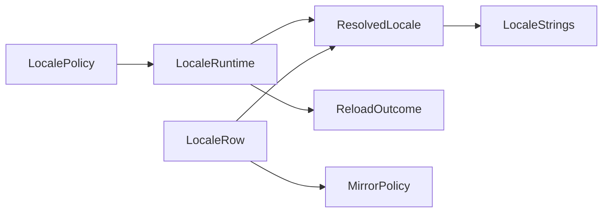

# [APPUI_LOCALIZATION_CULTURE]

One locale law serves every AppUi surface: `LocaleRow` is the culture axis — tag, string-table source, flow direction, format policy, plural route — `ResolvedLocale` is the single resolve product binding `CultureInfo` composition, the NodaTime display patterns, and the `CompositeFormat` rail, and `LocaleStrings` is the inbox-resx string vocabulary whose nameof-derived keys the command table, the screen catalog, and the PropertyGrid `LocalizationService` bridge all share. `LocaleRuntime` swaps the resolved set atomically from the user-settings `LocalePolicy` section, and `MirrorPolicy` owns retained-layout mirroring with the icon exemption law. The package spine is BCL inbox globalization and resources, NodaTime, Thinktecture.Runtime.Extensions, and LanguageExt.Core.

## [1]-[INDEX]

| [INDEX] | [CLUSTER]           | [OWNS]                                                          |
| :-----: | ------------------- | --------------------------------------------------------------- |
|   [1]   | LOCALE_AXIS         | Culture rows: tag, source, flow, format, plural-route columns   |
|   [2]   | STRING_TABLES       | Inbox resx vocabulary, nameof-derived keys, PropertyGrid bridge |
|   [3]   | CULTURE_COMPOSITION | Resolve fold, atomic switch, pattern and format binding         |
|   [4]   | RTL_MIRRORING       | Flow application at surface root, icon mirroring exemption      |

## [2]-[LOCALE_AXIS]

- Owner: `LocaleKeyPolicy` single ordinal-ignore-case key accessor; `LocaleRow` `[SmartEnum<string>]` culture axis.
- Cases: en, qps-ploc — En is the shipped default; Pseudo is the conformance row proving string expansion and mirrored layout in headless evidence.
- Entry: `public partial string Source(string key, CultureInfo strings)` — the per-row string-table source column.
- Auto: generated `Items` and key lookup under the single comparer; `Source` rides `[UseDelegateFromConstructor]`.
- Packages: Thinktecture.Runtime.Extensions, BCL inbox
- Growth: a new shipped language is one `LocaleRow` row plus one satellite resx set; the ICU plural route is one `PluralRoute` value plus one dispatch arm on `Plural`; zero new surface.
- Boundary: `RightToLeft` is the authoritative flow column — flow is never derived from culture data, so the pseudo row proves mirroring on every platform; per-surface culture variance enters as the `LocalePolicy` construction source, never a second axis — embedded panel surfaces fold the host language probe (a `HostAttachPort` delegate) to a row key with unmatched tags folding to `En` at the probe edge, standalone surfaces carry the user-chosen user-settings value; script coverage for non-Latin rows arrives as ranked family values on the `FontChain` rows, so a locale row never carries font data; pseudo-culture construction and the host probe spelling ride their research rows.

```csharp signature
public sealed class LocaleKeyPolicy : IEqualityComparerAccessor<string>, IComparerAccessor<string> {
    private static readonly StringComparer Policy = StringComparer.OrdinalIgnoreCase;

    public static IEqualityComparer<string> EqualityComparer => Policy;

    public static IComparer<string> Comparer => Policy;
}

[SmartEnum<string>]
[KeyMemberEqualityComparer<LocaleKeyPolicy, string>]
[KeyMemberComparer<LocaleKeyPolicy, string>]
public sealed partial class LocaleRow {
    public static readonly LocaleRow En = new("en", rightToLeft: false, formatTag: "en-US", pluralRoute: CardinalRoute, source: LocaleStrings.Find);
    public static readonly LocaleRow Pseudo = new("qps-ploc", rightToLeft: true, formatTag: "en-US", pluralRoute: CardinalRoute, source: LocaleStrings.Expand);

    public const string CardinalRoute = "cardinal-one-other";

    public bool RightToLeft { get; }

    public string FormatTag { get; }

    public string PluralRoute { get; }

    [UseDelegateFromConstructor]
    public partial string Source(string key, CultureInfo strings);
}
```

## [3]-[STRING_TABLES]

- Owner: `LocaleStrings` static string-table surface.
- Entry: `public static string Find(string key, CultureInfo strings)` — satellite lookup; a missing key returns the key itself as the visible marker.
- Packages: bodong.Avalonia.PropertyGrid, BCL inbox
- Growth: a new translatable surface is one resx key row per shipped locale row; zero new surface.
- Boundary: inbox `ResourceManager` owns the fallback fold — satellite culture, then parent, then neutral — so a hand-rolled chain walk and per-screen resx managers are the deleted patterns; keys compose through `Key` from nameof-derived owner and member symbols — the command intent key doubles as its label key and the screen catalog `Title` cell arrives as a formed key, so call-site string-literal keys are the deleted form; the bodong `LocalizationService` registration consumes `Find`, so PropertyGrid display names and built-in strings ride this one vocabulary, with the override member spelling on its research row; Microsoft.Extensions.Localization is the named-rejected owner shape and a translation-service abstraction is the rejected form — string tables are data rows; `Expand` brackets resolved text so truncation and clipping surface in pseudo-row headless sweeps.

```csharp signature
public static class LocaleStrings {
    public const string BaseName = "Rasm.AppUi.Strings";
    public const string OneSuffix = ".one";
    public const string OtherSuffix = ".other";

    public static readonly ResourceManager Table = new(BaseName, typeof(LocaleStrings).Assembly);

    public static string Key(string owner, string member) => $"{owner}.{member}";

    public static string Find(string key, CultureInfo strings) => Table.GetString(key, strings) ?? key;

    public static string Expand(string key, CultureInfo strings) => $"[!! {Find(key, strings)} !!]";
}
```

## [4]-[CULTURE_COMPOSITION]

- Owner: `LocalePolicy` user-settings options record; `ResolvedLocale` resolve product; `LocaleRuntime` atomic locale cell.
- Entry: `public Fin<Unit> Apply(LocalePolicy policy)` — `Fin` aborts on an unresolved tag or zone; one swap publishes the full resolved set.
- Auto: `Republish` is the whole options-monitor bridge — `OptionsAdmission.Observe` wires it under the transition reload class, so a culture switch is an options reload, not a second driver.
- Receipt: `ReloadReceipt` per culture switch from the options monitor stream — section, transition class, `ReloadOutcome`, `Instant`, correlation.
- Packages: NodaTime, LanguageExt.Core, BCL inbox
- Growth: a new display grammar is one pattern value on `ResolvedLocale` and a new format edge is one expression-bodied projection on the same record; zero new surface.
- Boundary: ambient culture is structurally absent — `CultureInfo.CurrentCulture`, `CurrentUICulture`, and default-thread culture writes never appear because the host process owns process culture on embedded rows; consumers read `Current` and pass `Strings`/`Formats` explicitly, and one swap publishes strings, patterns, formats, and flow together so no frame observes a mixed-culture state — per-control culture refresh handlers are the deleted pattern; persisted temporal grammars stay invariant through the `ClockPolicy` patterns, the resolved record owns only the user-facing display edge, and `ZonedDateTime` projection is confined inside `Stamp`; `CompositeFormat` is the only runtime-format path and quantities format through the `IFormattable` edge with `Formats` — the same culture the inspector quantity admission receives; a rejected `LocalePolicy` write keeps prior values live and cross-process propagation rides the op-log cursor consequence; pattern letters and factory arity ride their research row, and the ICU MessageFormat plural and gender route is research-gated with the suffix fold as the current `CardinalRoute` arm.

```csharp signature
public sealed record LocalePolicy(string Tag, string Zone, Option<string> FormatTag) {
    public const string Section = nameof(LocalePolicy);

    public static readonly LocalePolicy Default = new(Tag: "en", Zone: "Etc/UTC", FormatTag: None);
}

public sealed record ResolvedLocale(
    LocaleRow Row,
    CultureInfo Strings,
    CultureInfo Formats,
    DateTimeZone Zone,
    ZonedDateTimePattern Timestamp,
    LocalDatePattern Date,
    DurationPattern Elapsed) {
    public const string TimestampText = "G";
    public const string DateText = "D";
    public const string ElapsedText = "H:mm:ss";

    public static ResolvedLocale Resolve(LocaleRow row, DateTimeZone zone, Option<string> formatTag = default) =>
        Compose(row, zone, CultureInfo.GetCultureInfo(formatTag.IfNone(row.FormatTag)));

    public string Label(string key) => Row.Source(key, Strings);

    public string Plural(string key, long count) =>
        Row.Source(count == 1 ? key + LocaleStrings.OneSuffix : key + LocaleStrings.OtherSuffix, Strings);

    public string Stamp(Instant value) => Timestamp.Format(value.InZone(Zone));

    public string Day(LocalDate value) => Date.Format(value);

    public string Span(Duration value) => Elapsed.Format(value);

    public string Text(CompositeFormat format, params object?[] args) => string.Format(Formats, format, args);

    public string Quantity(IFormattable value) => value.ToString(null, Formats);

    private static ResolvedLocale Compose(LocaleRow row, DateTimeZone zone, CultureInfo formats) =>
        new(
            Row: row,
            Strings: CultureInfo.GetCultureInfo(row.Key),
            Formats: formats,
            Zone: zone,
            Timestamp: ZonedDateTimePattern.CreateWithInvariantCulture(TimestampText, DateTimeZoneProviders.Tzdb).WithCulture(formats),
            Date: LocalDatePattern.CreateWithInvariantCulture(DateText).WithCulture(formats),
            Elapsed: DurationPattern.CreateWithInvariantCulture(ElapsedText).WithCulture(formats));
}

public sealed record LocaleRuntime(Atom<ResolvedLocale> Cell, IDateTimeZoneProvider Zones) {
    public static Fin<LocaleRuntime> Boot(LocalePolicy policy, IDateTimeZoneProvider zones) =>
        Compose(policy, zones).Map(resolved => new LocaleRuntime(Atom(resolved), zones));

    public ResolvedLocale Current => Cell.Value;

    public Fin<Unit> Apply(LocalePolicy policy) =>
        Compose(policy, Zones).Map(resolved => ignore(Cell.Swap(_ => resolved)));

    public ReloadOutcome Republish(LocalePolicy policy) =>
        Apply(policy).Match(
            Succ: static _ => (ReloadOutcome)new ReloadOutcome.Applied(LocalePolicy.Section),
            Fail: static error => new ReloadOutcome.Rejected(LocalePolicy.Section, ConfigError.Create(error.Message)));

    private static Fin<ResolvedLocale> Compose(LocalePolicy policy, IDateTimeZoneProvider zones) =>
        (RowFor(policy.Tag), Optional(zones.GetZoneOrNull(policy.Zone))) switch {
            ({ IsSome: true, Case: LocaleRow row }, { IsSome: true, Case: DateTimeZone zone }) =>
                Fin<ResolvedLocale>.Succ(ResolvedLocale.Resolve(row, zone, policy.FormatTag)),
            ({ IsSome: false }, _) => Fin<ResolvedLocale>.Fail(Error.New($"unresolved locale tag: {policy.Tag}")),
            _ => Fin<ResolvedLocale>.Fail(Error.New($"unresolved zone id: {policy.Zone}")),
        };

    private static Option<LocaleRow> RowFor(string tag) =>
        LocaleRow.Items.AsIterable().Find(item => LocaleKeyPolicy.EqualityComparer.Equals(item.Key, tag));
}
```



## [5]-[RTL_MIRRORING]

- Owner: `MirrorPolicy` directional-row policy record.
- Entry: `public bool Mirrors(string iconKey, LocaleRow row)` — pure predicate; the icon presenter's flow pin folds over it.
- Packages: Avalonia, LanguageExt.Core
- Growth: a direction-sensitive glyph is one key row on `Directional`; zero new surface.
- Boundary: the mount transaction applies the active row's flow to the surface root once and layout mirroring arrives by inheritance — per-control flow flips are the deleted pattern; every icon presenter pins left-to-right structurally — the exemption — and only `Directional` rows re-join the root flow, so logos, status glyphs, and brand marks never mirror; Skia-side bidi and complex-script ordering stay with the shaping rail and this cluster owns retained-layout mirroring only; caret travel and text alignment arrive from the inherited flow, never per-control settings; the root flow property spelling and mirror-transform inheritance ride the research row.

```csharp signature
public sealed record MirrorPolicy(Seq<string> Directional) {
    public static readonly MirrorPolicy Default = new(Seq("nav.back", "nav.forward"));

    public bool Mirrors(string iconKey, LocaleRow row) =>
        row.RightToLeft && Directional.Exists(key => string.Equals(key, iconKey, StringComparison.Ordinal));
}
```

## [6]-[RESEARCH]

| [INDEX] | [ITEM]                                                                                                  | [PROOF]                                                                                                              | [GATE]              |
| :-----: | -------------------------------------------------------------------------------------------------------- | ---------------------------------------------------------------------------------------------------------------------- | ------------------- |
|   [1]   | qps-ploc pseudo-culture construction and satellite resolution on ICU-backed globalization                 | dotnet run scratch probe constructing CultureInfo.GetCultureInfo("qps-ploc") and reading one satellite string on macOS  | LOCALE_AXIS         |
|   [2]   | Rhino host language tag probe spelling for the embedded-panel host-matched row fold                       | uv run python -m tools.assay api query rhino Rhino.ApplicationSettings.AppearanceSettings                               | LOCALE_AXIS         |
|   [3]   | bodong LocalizationService registration and override member spelling for the resx-backed bridge           | uv run python -m tools.assay api query propertygrid LocalizationService                                                 | STRING_TABLES       |
|   [4]   | NodaTime culture-bound standard pattern letters and Create factory arity for the three display patterns   | uv run python -m tools.assay api query nodatime NodaTime.Text.ZonedDateTimePattern                                      | CULTURE_COMPOSITION |
|   [5]   | ICU MessageFormat plural and gender route replacing the suffix arm — umsg binding over the runtime ICU or a managed CLDR fold | dotnet run scratch probe binding libicui18n umsg_open and u_formatMessage exports via NativeLibrary on macOS | CULTURE_COMPOSITION |
|   [6]   | Avalonia surface-root flow property spelling and visual mirror-transform inheritance for the exemption pin | uv run python -m tools.assay api query avalonia Avalonia.Media.FlowDirection                                            | RTL_MIRRORING       |
