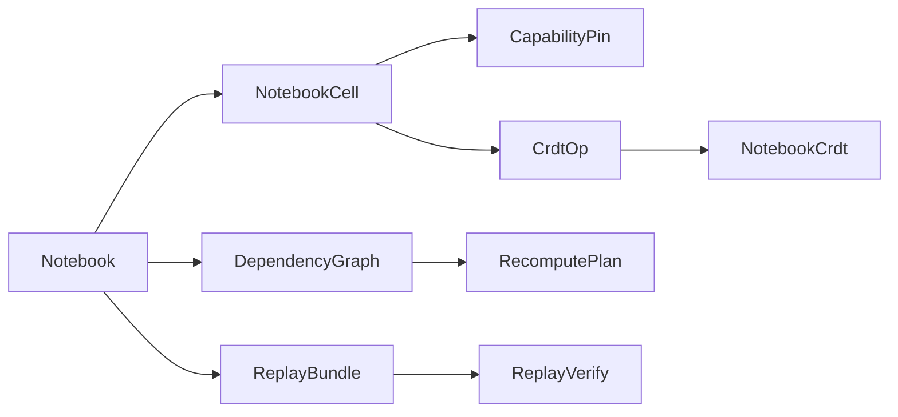

# [APPUI_NOTEBOOK_DOCUMENT]

The notebook rail is the reproducible computational-document model: `NotebookCell` is the closed cell-kind union (code, markdown, chart, render, viewpoint, parameter) each carrying a pinned capability fingerprint, `DependencyGraph` is the cell DAG whose dirty-propagation drives recompute over exactly the affected closure, `NotebookCrdt` is the conflict-free replicated document for co-editing through op-log merge, and `ReplayBundle` exports the notebook plus its pinned capabilities and inputs as a portable replay artifact. The page owns the cell union with its pinned-capability fingerprint, the dependency DAG and dirty-recompute fold, the CRDT co-edit merge, and the export-to-replay bundle; the substrate is the Compute capability registry and receipt determinism for pinned cells, AvaloniaEdit for code cells, the chart and render owners for output cells, the Persistence op-log for CRDT and replay, and the AppHost clock and HLC for ordering. Replay reproduces a notebook bit-identically because every cell pins the capability and inputs it ran against.

## [1]-[INDEX]

| [INDEX] | [CLUSTER]        | [OWNS]                                                           |
| :-----: | :--------------- | :--------------------------------------------------------------- |
|   [1]   | CELL_MODEL       | Closed cell-kind union; pinned capability fingerprint per cell   |
|   [2]   | DEPENDENCY_GRAPH | Cell DAG, dirty propagation, recompute over the affected closure |
|   [3]   | CRDT_COEDIT      | Conflict-free replicated document; op-log merge co-editing       |
|   [4]   | REPLAY_BUNDLE    | Export-to-replay artifact with pinned capabilities and inputs    |

## [2]-[CELL_MODEL]

- Owner: `CapabilityPin` the pinned-capability fingerprint; `NotebookCell` `[Union]` the cell-kind family; `CellOutput` `[Union]` the materialized output; `Notebook` the cell sequence.
- Cases: `NotebookCell` = Code | Markdown | Chart | Render | Viewpoint | Parameter under the locked kind literals; `CellOutput` = Receipt | Rows | Image | Timeline | Empty under the locked kind literals.
- Entry: `public Fin<CellOutput> Evaluate(NotebookRuntime runtime, HashMap<string, CellOutput> upstream)` — `Fin` aborts on an unpinned capability or a missing upstream output; a code cell runs through the Compute dispatch under its pin.
- Auto: every code and chart cell carries a `CapabilityPin` — the Compute capability key, the model or kernel checksum, the substrate, and the deterministic seed — so a cell records exactly the capability version it ran against and a re-run under a drifted capability is a detectable mismatch, never a silent re-result; markdown cells project through the typography `MarkdownProjection` so a documentation cell rides the one markdown vocabulary; chart and render cells bind their output to the chart and visual owners so a notebook output cell mints no second chart; parameter cells expose a typed binding the downstream cells read so a notebook is a live parameterized document.
- Packages: Thinktecture.Runtime.Extensions, LanguageExt.Core, NodaTime, Rasm.Compute (project)
- Growth: a new cell kind is one `NotebookCell` case; a new output kind is one `CellOutput` case; a new pin field is one `CapabilityPin` member; zero new surface.
- Boundary: the capability pin is the reproducibility law — a code or chart cell with no pin faults at evaluate so an unpinned cell can never enter the document, and the pin's checksum is the Compute model-or-kernel checksum so the notebook reproducibility rides the settled Compute determinism rather than a notebook-local hash; markdown cells route to the typography projection and chart/render cells to the chart and visual owners so the notebook composes existing output owners and a notebook-local renderer is the deleted form; code cells edit through the AvaloniaEdit `CodePane` so the notebook mints no second editor; the cell output is the typed `CellOutput` union and a stringly-typed output blob is the rejected form.

```csharp signature
public readonly record struct CapabilityPin(string Capability, string Checksum, string Substrate, long Seed) {
    public bool Matches(CapabilityPin other) =>
        Capability == other.Capability && Checksum == other.Checksum && Substrate == other.Substrate;
}

[Union(ConversionFromValue = ConversionOperatorsGeneration.None)]
public abstract partial record CellOutput {
    private CellOutput() { }
    public sealed record Receipt(ComputeReceipt Value) : CellOutput;
    public sealed record Rows(Seq<JsonElement> Values) : CellOutput;
    public sealed record Image(RenderReceipt Render) : CellOutput;
    public sealed record Timeline(EvidenceTimeline Value) : CellOutput;
    public sealed record Empty : CellOutput;
}

[Union(ConversionFromValue = ConversionOperatorsGeneration.None)]
public abstract partial record NotebookCell {
    private NotebookCell() { }
    public sealed record Code(string Id, string Source, CapabilityPin Pin, Seq<string> Inputs, Func<NotebookRuntime, HashMap<string, CellOutput>, IO<CellOutput>> Run) : NotebookCell;
    public sealed record Markdown(string Id, string Source) : NotebookCell;
    public sealed record Chart(string Id, ChartSeriesSpec Spec, ChartPolicy Policy, CapabilityPin Pin, Seq<string> Inputs) : NotebookCell;
    public sealed record Render(string Id, CustomVisual Kind, CapabilityPin Pin, Seq<string> Inputs) : NotebookCell;
    public sealed record Viewpoint(string Id, AppUi.Viewport.Viewpoint View) : NotebookCell;
    public sealed record Parameter(string Id, string Key, JsonElement Value) : NotebookCell;

    public string Id => Switch(
        code: static c => c.Id, markdown: static m => m.Id, chart: static c => c.Id,
        render: static r => r.Id, viewpoint: static v => v.Id, parameter: static p => p.Id);

    public Seq<string> Inputs => Switch(
        code: static c => c.Inputs, markdown: static _ => Seq<string>(), chart: static c => c.Inputs,
        render: static r => r.Inputs, viewpoint: static _ => Seq<string>(), parameter: static _ => Seq<string>());

    public Option<CapabilityPin> Pin => Switch(
        code: static c => Some(c.Pin), markdown: static _ => Option<CapabilityPin>.None, chart: static c => Some(c.Pin),
        render: static r => Some(r.Pin), viewpoint: static _ => Option<CapabilityPin>.None, parameter: static _ => Option<CapabilityPin>.None);

    public IO<CellOutput> Evaluate(NotebookRuntime runtime, HashMap<string, CellOutput> upstream) => Switch(
        state: (Runtime: runtime, Upstream: upstream),
        code: static (ctx, c) => ctx.Runtime.Verify(c.Pin) ? c.Run(ctx.Runtime, ctx.Upstream) : IO.fail<CellOutput>(new NotebookFault.CapabilityDrift(c.Id)),
        markdown: static (_, _) => IO.pure<CellOutput>(new CellOutput.Empty()),
        chart: static (ctx, c) => ctx.Runtime.Verify(c.Pin) ? ctx.Runtime.Chart(c.Spec, c.Policy, ctx.Upstream) : IO.fail<CellOutput>(new NotebookFault.CapabilityDrift(c.Id)),
        render: static (ctx, r) => ctx.Runtime.Verify(r.Pin) ? ctx.Runtime.Render(r.Kind, ctx.Upstream) : IO.fail<CellOutput>(new NotebookFault.CapabilityDrift(r.Id)),
        viewpoint: static (_, _) => IO.pure<CellOutput>(new CellOutput.Empty()),
        parameter: static (_, p) => IO.pure<CellOutput>(new CellOutput.Rows(Seq1(p.Value))));
}

public sealed record NotebookRuntime(
    Func<CapabilityPin, bool> VerifyPin,
    Func<ChartSeriesSpec, ChartPolicy, HashMap<string, CellOutput>, IO<CellOutput>> Chart,
    Func<CustomVisual, HashMap<string, CellOutput>, IO<CellOutput>> Render,
    ClockPolicy Clocks,
    CorrelationId Correlation) {
    public bool Verify(CapabilityPin pin) => VerifyPin(pin);
}

public sealed record Notebook(string Key, int Version, Seq<NotebookCell> Cells);

[Union]
public abstract partial record NotebookFault : Expected, IValidationError<NotebookFault> {
    private NotebookFault(string detail, int code) : base(detail, code, None) { }

    public static NotebookFault Create(string message) => new Text(message);

    public sealed record Text : NotebookFault { public Text(string detail) : base(detail, 4800) { } }
    public sealed record CapabilityDrift : NotebookFault { public CapabilityDrift(string detail) : base(detail, 4801) { } }
    public sealed record MissingUpstream : NotebookFault { public MissingUpstream(string detail) : base(detail, 4802) { } }
    public sealed record CycleDetected : NotebookFault { public CycleDetected(string detail) : base(detail, 4803) { } }
}
```

## [3]-[DEPENDENCY_GRAPH]

- Owner: `DependencyGraph` the cell DAG; `RecomputePlan` the affected-closure plan.
- Entry: `public Fin<RecomputePlan> Dirty(string changed)` — folds the downstream transitive closure of the changed cell into the recompute order; `public Fin<HashMap<string, CellOutput>> Recompute(NotebookRuntime runtime, RecomputePlan plan, HashMap<string, CellOutput> cache)` — evaluates exactly the affected cells in topological order, re-using the cached output of unaffected cells.
- Auto: `Build` derives the DAG from each cell's declared `Inputs` so the dependency edges are document data, never inferred from source parsing; `Dirty` walks the downstream closure of the changed cell so editing a parameter recomputes only the cells that read it, transitively, and an unaffected cell never re-runs; the topological order is the one evaluation order so a recompute respects the dependency partial order; a cycle in the declared inputs faults at build so a self-referential notebook is structurally rejected.
- Packages: Thinktecture.Runtime.Extensions, LanguageExt.Core
- Growth: a new propagation policy is one plan value; zero new surface.
- Boundary: dirty propagation recomputes the affected closure only — a full-notebook re-run on every edit is the deleted form, so a parameter change is O(downstream) not O(cells); the dependency edges are the declared cell inputs so a hidden side-effect dependency is structurally absent — a cell reads only its declared upstream outputs; the recompute re-uses the cached output of cells outside the dirty closure so an expensive upstream cell never re-runs for a downstream-only edit; cycle detection runs at build so a topological order always exists.

```csharp signature
public sealed record RecomputePlan(Seq<string> Order);

public sealed record DependencyGraph(
    FrozenDictionary<string, Seq<string>> Inputs,
    FrozenDictionary<string, Seq<string>> Dependents,
    Seq<string> Topological) {
    public static Fin<DependencyGraph> Build(Notebook notebook) {
        var inputs = notebook.Cells.Map(cell => KeyValuePair.Create(cell.Id, cell.Inputs)).ToFrozenDictionary(StringComparer.Ordinal);
        var dependents = notebook.Cells
            .Bind(cell => cell.Inputs.Map(input => (Input: input, Cell: cell.Id)))
            .GroupBy(static edge => edge.Input, StringComparer.Ordinal)
            .ToFrozenDictionary(static group => group.Key, static group => toSeq(group).Map(static edge => edge.Cell), StringComparer.Ordinal);
        return Topo(notebook, inputs).Map(order => new DependencyGraph(inputs, dependents, order));
    }

    public Fin<RecomputePlan> Dirty(string changed) =>
        Reachable(changed, Set<string>()) switch {
            var affected => Fin.Succ(new RecomputePlan(Topological.Filter(affected.Contains))),
        };

    public Fin<HashMap<string, CellOutput>> Recompute(Notebook notebook, NotebookRuntime runtime, RecomputePlan plan, HashMap<string, CellOutput> cache) =>
        plan.Order.Fold(
            Fin.Succ(cache),
            (rail, id) => rail.Bind(state => notebook.Cells.Find(cell => cell.Id == id)
                .Map(cell => Gather(cell, state).Bind(upstream => cell.Evaluate(runtime, upstream).Run().Map(output => state.AddOrUpdate(id, output))))
                .IfNone(() => Fin.Fail<HashMap<string, CellOutput>>(new NotebookFault.MissingUpstream(id)))));

    private Fin<HashMap<string, CellOutput>> Gather(NotebookCell cell, HashMap<string, CellOutput> state) =>
        cell.Inputs.Fold(
            Fin.Succ(HashMap<string, CellOutput>()),
            (rail, input) => rail.Bind(acc => state.Find(input).Match(
                Some: output => Fin.Succ(acc.Add(input, output)),
                None: () => Fin.Fail<HashMap<string, CellOutput>>(new NotebookFault.MissingUpstream($"{cell.Id}<-{input}")))));

    private Set<string> Reachable(string node, Set<string> seen) =>
        seen.Contains(node)
            ? seen
            : Dependents.TryGetValue(node, out var next)
                ? next.Fold(seen.Add(node), (acc, child) => Reachable(child, acc))
                : seen.Add(node);

    private static Fin<Seq<string>> Topo(Notebook notebook, FrozenDictionary<string, Seq<string>> inputs) =>
        notebook.Cells.Fold(
            Fin.Succ((Order: Seq<string>(), Visited: Set<string>())),
            (rail, cell) => rail.Bind(state => Visit(cell.Id, inputs, state, Set<string>())))
        .Map(static state => state.Order);

    private static Fin<(Seq<string> Order, Set<string> Visited)> Visit(string id, FrozenDictionary<string, Seq<string>> inputs, (Seq<string> Order, Set<string> Visited) state, Set<string> stack) =>
        stack.Contains(id)
            ? Fin.Fail<(Seq<string>, Set<string>)>(new NotebookFault.CycleDetected(id))
            : state.Visited.Contains(id)
                ? Fin.Succ(state)
                : (inputs.TryGetValue(id, out var deps) ? deps : Seq<string>())
                    .Fold(Fin.Succ(state), (rail, dep) => rail.Bind(inner => Visit(dep, inputs, inner, stack.Add(id))))
                    .Map(inner => (inner.Order.Add(id), inner.Visited.Add(id)));
}
```

## [4]-[CRDT_COEDIT]

- Owner: `CrdtOp` `[Union]` the replicated edit operation; `NotebookCrdt` the conflict-free replicated document.
- Entry: `public NotebookCrdt Apply(CrdtOp op)` — applies one replicated op idempotently; `public NotebookCrdt Merge(NotebookCrdt other)` — folds another replica's op-log into this one, converging without conflict.
- Auto: each edit is a `CrdtOp` carrying its replica id and HLC stamp so the op-log totally orders by HLC with the replica id as the deterministic tiebreaker; cell insertion uses a fractional position index so two replicas inserting at the same spot converge to a stable order, cell deletion is a tombstone so a deleted cell never resurrects on merge, and cell-content edit is a last-writer-wins register keyed by HLC so concurrent edits to one cell resolve deterministically; `Merge` is commutative, associative, and idempotent so any two replicas that have seen the same op set hold the same document — the CRDT convergence law.
- Packages: Thinktecture.Runtime.Extensions, LanguageExt.Core, NodaTime, Rasm.Persistence (project)
- Growth: a new replicated edit is one `CrdtOp` case; zero new surface.
- Boundary: the op-log rides the Persistence op-log and change-feed so co-editing transports through the settled sync vocabulary and the notebook mints no second sync — the `CrdtOp` projects onto the Persistence `OpLogEntry` at the seam; convergence is the CRDT law so a central merge server is the deleted form — two offline replicas reconcile on reconnect; the fractional-index insertion order and the tombstone deletion make merge conflict-free so a three-way merge dialog for cell order is structurally unnecessary; content edits are last-writer-wins by HLC so a concurrent same-cell edit resolves deterministically and the loser's text surfaces as a superseded op in the log, never silently dropped.

```csharp signature
public readonly record struct HlcStamp(long Physical, int Logical, string Replica) {
    public int CompareTo(HlcStamp other) =>
        Physical != other.Physical ? Physical.CompareTo(other.Physical)
            : Logical != other.Logical ? Logical.CompareTo(other.Logical)
            : string.CompareOrdinal(Replica, other.Replica);
}

[Union(ConversionFromValue = ConversionOperatorsGeneration.None)]
public abstract partial record CrdtOp {
    private CrdtOp() { }
    public sealed record Insert(string CellId, double Position, NotebookCell Cell, HlcStamp At) : CrdtOp;
    public sealed record Delete(string CellId, HlcStamp At) : CrdtOp;
    public sealed record Edit(string CellId, string Source, HlcStamp At) : CrdtOp;

    public HlcStamp At => Switch(insert: static i => i.At, delete: static d => d.At, edit: static e => e.At);

    public string CellId => Switch(insert: static i => i.CellId, delete: static d => d.CellId, edit: static e => e.CellId);
}

public sealed record NotebookCrdt(
    string Key,
    HashMap<string, (double Position, NotebookCell Cell, HlcStamp At)> Live,
    Set<string> Tombstones,
    Seq<CrdtOp> Log) {
    public static NotebookCrdt Empty(string key) => new(key, HashMap<string, (double, NotebookCell, HlcStamp)>(), Set<string>(), Seq<CrdtOp>());

    public NotebookCrdt Apply(CrdtOp op) =>
        Log.Exists(seen => seen.At.Equals(op.At) && seen.CellId == op.CellId)
            ? this
            : op.Switch(
                state: this,
                insert: static (doc, i) => doc.Tombstones.Contains(i.CellId) ? doc with { Log = doc.Log.Add(i) } : doc with { Live = doc.Live.AddOrUpdate(i.CellId, (i.Position, i.Cell, i.At)), Log = doc.Log.Add(i) },
                delete: static (doc, d) => doc with { Live = doc.Live.Remove(d.CellId), Tombstones = doc.Tombstones.Add(d.CellId), Log = doc.Log.Add(d) },
                edit: static (doc, e) => doc.Live.Find(e.CellId).Match(
                    Some: cur => e.At.CompareTo(cur.At) > 0 ? doc with { Live = doc.Live.AddOrUpdate(e.CellId, (cur.Position, Retext(cur.Cell, e.Source), e.At)), Log = doc.Log.Add(e) } : doc with { Log = doc.Log.Add(e) },
                    None: () => doc with { Log = doc.Log.Add(e) }));

    public NotebookCrdt Merge(NotebookCrdt other) =>
        other.Log.OrderBy(static op => op.At, OpOrder).Fold(this, static (doc, op) => doc.Apply(op));

    public Notebook Materialize(int version) =>
        new(Key, version, toSeq(Live.Values).OrderBy(static entry => entry.Position).Map(static entry => entry.Cell).ToSeq());

    private static NotebookCell Retext(NotebookCell cell, string source) =>
        cell is NotebookCell.Code code ? code with { Source = source }
            : cell is NotebookCell.Markdown md ? md with { Source = source }
            : cell;

    static readonly IComparer<HlcStamp> OpOrder = Comparer<HlcStamp>.Create(static (a, b) => a.CompareTo(b));
}
```

## [5]-[REPLAY_BUNDLE]

- Owner: `ReplayManifest` the pinned-input-and-capability manifest; `ReplayBundle` the export-to-replay artifact; `ReplayVerify` the bit-identity check.
- Entry: `public static Fin<ReplayBundle> Export(Notebook notebook, HashMap<string, CellOutput> outputs, Func<string, IO<ReadOnlyMemory<byte>>> blob)` — `Fin` aborts when a code or chart cell carries no pin; the bundle packs the cells, the pinned capabilities, the input blobs, and the recorded outputs; `public static IO<Fin<bool>> Verify(ReplayBundle bundle, NotebookRuntime runtime)` — re-runs the notebook and compares each cell's output hash to the recorded hash.
- Auto: the manifest records every cell's `CapabilityPin` and the content hash of every input blob so the bundle is self-contained — a replay resolves its capabilities from the manifest and its inputs from the packed blobs, never the live environment; `Verify` re-runs the dependency graph under the manifest's pins and asserts each output hash equals the recorded hash so a reproducibility regression surfaces as a named cell mismatch; the bundle is a versioned Persistence artifact so it crosses the blob lane as an opaque payload.
- Receipt: `Verify` seals a render or evidence receipt per re-run cell; a mismatch folds the cell id into the replay-mismatch instrument.
- Packages: Thinktecture.Runtime.Extensions, LanguageExt.Core, System.IO.Hashing, NodaTime, Rasm.Persistence (project)
- Growth: a new manifest field is one `ReplayManifest` member; zero new surface.
- Boundary: the bundle is self-contained — replay resolves capabilities and inputs from the manifest and packed blobs so a notebook reproduces independent of the live environment, and a replay that reaches the live store is the rejected form; the output identity is the content hash through the suite XxHash128 identity row so bit-identity is the verification law and a fuzzy float compare is the deleted form; the bundle crosses the Persistence blob lane as a versioned opaque artifact so the notebook mints no second store; the journal-replay determinism rides the diagnostics `ProofEngine.Replay` under virtual time so the replay reproducibility shares the settled deterministic-replay law and a notebook-local replay engine is the deleted form.

```csharp signature
public readonly record struct ReplayInput(string Key, string ContentHash, long Bytes);

public sealed record ReplayManifest(
    string NotebookKey,
    int Version,
    Seq<CapabilityPin> Pins,
    Seq<ReplayInput> Inputs,
    Seq<(string CellId, string OutputHash)> Outputs,
    Instant At);

public sealed record ReplayBundle(ReplayManifest Manifest, Notebook Notebook, HashMap<string, ReadOnlyMemory<byte>> Blobs) {
    public static Fin<ReplayBundle> Export(Notebook notebook, HashMap<string, CellOutput> outputs, HashMap<string, ReadOnlyMemory<byte>> blobs, Func<CellOutput, string> hash, ClockPolicy clocks) =>
        notebook.Cells.Find(cell => cell.Inputs.Count > 0 && cell.Pin.IsNone) is { IsSome: true, Case: NotebookCell unpinned }
            ? Fin.Fail<ReplayBundle>(new NotebookFault.CapabilityDrift($"{unpinned.Id}: code cell carries no capability pin"))
            : Fin.Succ(new ReplayBundle(
                new ReplayManifest(
                    notebook.Key, notebook.Version,
                    notebook.Cells.Bind(cell => cell.Pin.ToSeq()),
                    toSeq(blobs).Map(entry => new ReplayInput(entry.Key, Convert.ToHexStringLower(XxHash128.Hash(entry.Value.Span)), entry.Value.Length)),
                    toSeq(outputs).Map(entry => (entry.Key, hash(entry.Value))),
                    clocks.Now),
                notebook, blobs));
}

public static class ReplayVerify {
    public const string MismatchInstrument = "rasm.appui.notebook.replay-mismatch";

    public static TelemetryContributorPort TelemetryRow(string version) =>
        AppUiTelemetry.Contribute(version, MismatchInstrument);

    public static IO<Fin<Seq<string>>> Verify(ReplayBundle bundle, NotebookRuntime runtime, Func<CellOutput, string> hash) =>
        IO.lift(() => DependencyGraph.Build(bundle.Notebook).Bind(graph => graph.Dirty(bundle.Notebook.Cells.Head.Id)))
            .Bind(plan => plan.Match(
                Succ: order => Recompute(bundle, runtime, hash, order),
                Fail: error => IO.pure(Fin.Fail<Seq<string>>(error))));

    static IO<Fin<Seq<string>>> Recompute(ReplayBundle bundle, NotebookRuntime runtime, Func<CellOutput, string> hash, RecomputePlan plan) =>
        IO.lift(() => DependencyGraph.Build(bundle.Notebook)
            .Bind(graph => graph.Recompute(bundle.Notebook, runtime, plan, HashMap<string, CellOutput>()))
            .Map(outputs => bundle.Manifest.Outputs
                .Filter(recorded => toSeq(outputs).Find(actual => actual.Key == recorded.CellId).Map(actual => hash(actual.Value) != recorded.OutputHash).IfNone(true))
                .Map(static mismatch => mismatch.CellId)));
}
```



## [6]-[RESEARCH]

- [NOTEBOOK_CAPABILITY]: the Compute capability-registry key and checksum surface the `CapabilityPin` records — the capability identity (kernel/model checksum, substrate, opset) the pin matches against, resolved at implementation against the settled Compute model-lane and intent-selection vocabulary; the cell union, the dependency-graph dirty fold, the CRDT merge, and the replay bundle are settled, the exact capability-registry member shape the `VerifyPin` delegate reads is the unverified surface.
