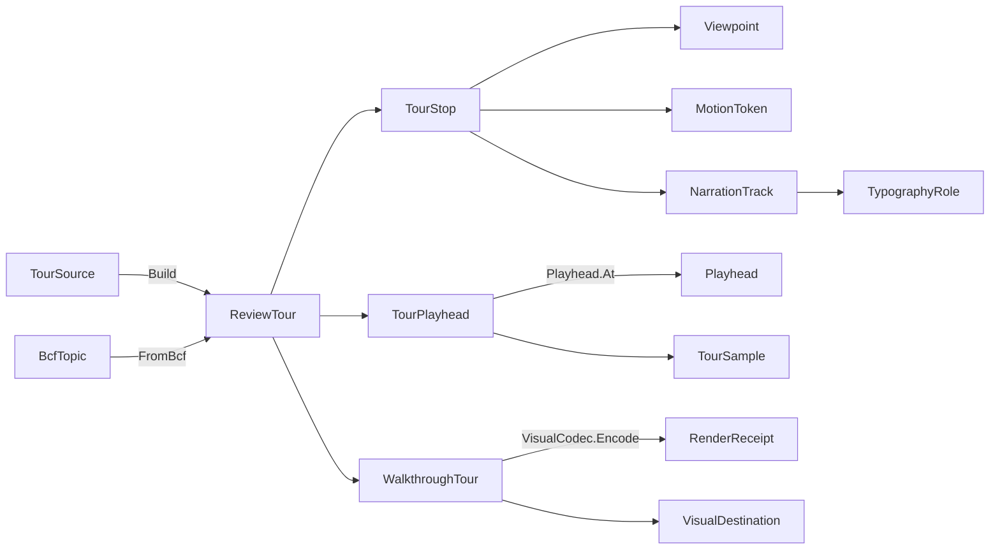

# [APPUI_REVIEW_TOUR]

The presentation rail is the client-facing design-review deliverable: `ReviewTour` is an ordered `TourStop` sequence each binding one saved `viewport/viewport-pipeline#VIEWPOINT_CODEC` `Viewpoint`, a per-stop dwell `Duration` and a per-transition `motion/motion-tokens#MOTION_AXIS` token, `TourPlayhead` drives the inter-stop camera interpolation on the `animation/animation-timeline#TRACK_MODEL` `Track`/`Scrub` clock so a tour scrubs re-entrantly with no drift exactly as the timeline does, `NarrationTrack` shapes a stop's caption through the `typography/typography-shaping#ROLE_AXIS` role vocabulary, `WalkthroughRender` emits the tour offline through the `visuals/visuals-offscreen#DOCUMENT_EXPORT` `VisualDestination` over the timeline `Walkthrough` fold, and `TourSource` is the one closed family discriminating a `SavedSequence` of viewpoint keys from a `TopicTour` that folds a `cs:Rasm.Bim/coordination/issue-exchange#BCF_ARCHIVE` `BcfTopic` set into stops at the package edge. The page owns the tour and stop vocabulary, the playhead camera-interpolation fold, the narration projection, the offline walkthrough render, and the topic-to-tour projection; the substrate is the saved `Viewpoint` receipt for camera state, the animation `Playhead`/`ScrubState` for the re-entrant clock, the motion-token easing for every transition, the typography role for every caption, the visuals codec and destination for the offline render, and the `Rasm.Bim` BCF topic contract composed only at the boundary. A tour mints no second camera-snapshot shape, no tour-local stopwatch, no tour-local raster path, and no second BCF schema — every concern is a projection over a settled owner.

## [1]-[INDEX]

| [INDEX] | [CLUSTER]    | [OWNS]                                                                         |
| :-----: | :----------- | :----------------------------------------------------------------------------- |
|   [1]   | TOUR_MODEL   | `ReviewTour` ordered stop sequence; `TourStop` viewpoint + dwell + transition  |
|   [2]   | TOUR_PLAYHEAD | Camera-interpolation fold over the animation Track/Scrub re-entrant clock      |
|   [3]   | NARRATION    | Per-stop caption projected onto the typography role vocabulary; shaped runs    |
|   [4]   | TOUR_SOURCE  | `TourSource` closed family; saved-sequence and BCF-topic-set projections       |
|   [5]   | WALKTHROUGH_RENDER | Offline tour render through the visuals destination over the timeline fold |

## [2]-[TOUR_MODEL]

- Owner: `TourStop` `[ComplexValueObject]` the structural-identity stop binding a saved `Viewpoint` with its dwell `Duration`, transition `MotionToken`, and narration; `ReviewTour` `[ValueObject]` the ordered non-empty `Seq<TourStop>` with its tour key; `TourFault` the construction fault rail in the 4300 code band.
- Cases: a stop binds exactly one `Viewpoint` receipt, one dwell duration, one transition token, and one `NarrationTrack` — there is no stop-kind axis because every stop is the same shape; the tour-source variation lives on `TOUR_SOURCE`, never on the stop.
- Entry: `public static Fin<ReviewTour> Of(string Key, Seq<TourStop> Stops)` — rejects an empty tour at construction so every constructed `ReviewTour` carries at least one stop and the playhead segment fold is total without an empty-tour guard; the stops keep caller order because tour order is presentation order, never re-sorted.
- Packages: Thinktecture.Runtime.Extensions, LanguageExt.Core, NodaTime
- Growth: a new stop concern is one `TourStop` member; a new transition is one `motion/motion-tokens#MOTION_AXIS` token consumed here; zero new surface.
- Boundary: `TourStop` is structural-identity so two stops with the same viewpoint, dwell, transition, and narration are equal — the identity rides the bound owners, never a stop-local guid; the dwell and transition trace to the motion vocabulary so a tour never carries a raw duration or easing-curve literal, exactly as the animation keyframe traces its easing to a `MotionToken` row; the bound `Viewpoint` is the one portable view-state the viewport mints so a tour stop holds no second camera shape and applying a stop drives the viewport camera and section through the viewpoint codec; `ReviewTour.Of` rejects an empty tour into `Fin` so the non-empty invariant holds at construction and `TOUR_PLAYHEAD` segments without a guard; the total tour duration is the dwell-plus-transition fold over the stops so a tour duration is derived, never a stored field that can drift from the stops.

```csharp signature
// --- [ERRORS] --------------------------------------------------------------------------
[Union]
public abstract partial record TourFault : Expected, IValidationError<TourFault> {
    private TourFault(string detail, int code) : base(detail, code, None) { }

    public static TourFault Create(string message) => new Text(message);

    public sealed record Text : TourFault { public Text(string detail) : base(detail, 4300) { } }
    public sealed record Empty : TourFault { public Empty(string detail) : base(detail, 4301) { } }
    public sealed record StopOutOfRange : TourFault { public StopOutOfRange(string detail) : base(detail, 4302) { } }
}

// --- [MODELS] --------------------------------------------------------------------------
[ComplexValueObject]
public sealed partial class TourStop {
    public Viewpoint View { get; }
    public Duration Dwell { get; }
    public MotionToken Transition { get; }
    public NarrationTrack Narration { get; }

    static partial void NormalizeDwell(ref Duration dwell) =>
        dwell = dwell < Duration.Zero ? Duration.Zero : dwell;

    public Duration Span => Transition.Duration + Dwell;
}

[ValueObject<string>]
public readonly partial struct TourKey;

public sealed record ReviewTour(TourKey Key, Seq<TourStop> Stops) {
    public static Fin<ReviewTour> Of(string Key, Seq<TourStop> Stops) =>
        Stops.IsEmpty
            ? Fin.Fail<ReviewTour>(new TourFault.Empty($"presentation/empty-tour:{Key}"))
            : Fin.Succ(new ReviewTour(TourKey.Create(Key), Stops));

    public Duration Total => Stops.Fold(Duration.Zero, static (sum, stop) => sum + stop.Span);

    public Fin<TourStop> StopAt(int index) =>
        index >= 0 && index < Stops.Count
            ? Fin.Succ(Stops[index])
            : Fin.Fail<TourStop>(new TourFault.StopOutOfRange($"presentation/stop-out-of-range:{Key.Value}[{index}/{Stops.Count}]"));

    public Duration OffsetOf(int index) =>
        Stops.Take(Math.Clamp(index, 0, Stops.Count)).Fold(Duration.Zero, static (sum, stop) => sum + stop.Span);
}
```

## [3]-[TOUR_PLAYHEAD]

- Owner: `TourSegment` the active-and-next stop bracket carrying the elapsed-within-segment phase; `TourPlayhead` the state-threaded fold over the animation `Playhead` clock projecting the tour to its sampled camera; `TourSample` the composed camera-plus-narration state at the playhead.
- Entry: `public TourSample SampleAt(ReviewTour tour, Duration t, Func<ViewCamera, ViewCamera, double, ViewCamera> lerpCam)` — folds the tour offset table to find the bracketing stop pair around `t`, eases the transition phase through the motion token, and interpolates the bracketing viewpoints' cameras into the sampled camera; the dwell holds the current stop's camera, the transition eases toward the next.
- Auto: the playhead rides the animation `Playhead`/`ScrubState` frame-indexed clock so a tour scrub and a tour render hit identical frames — dragging the tour playhead back and forth never accumulates drift because the position is frame-indexed off the animation owner, never delta-integrated by a tour-local stopwatch; a tour is, structurally, one camera `Track` whose keyframes are the stops and whose per-segment easing is the transition token, so the tour reuses the timeline's bracketing sampler rather than minting a second interpolator; the per-stop dwell holds the camera fixed and the per-stop transition eases the camera from the previous stop's viewpoint to the current, so a fly-through is the easing of the camera keyframe exactly as the animation camera track is.
- Packages: Thinktecture.Runtime.Extensions, LanguageExt.Core, NodaTime
- Growth: a new sampled state field is one `TourSample` member; a new interpolation channel rides the existing camera/section view-state, never a new track; zero new surface.
- Boundary: the playhead drives camera interpolation on the `animation/animation-timeline#TRACK_MODEL` `Track`/`Scrub` clock so a wall-clock-paced tour is the deleted form and a tour-local stopwatch is the named defect — the tour position is frame-indexed off the animation `Playhead.At` so a re-entrant scrub holds the timeline's no-drift law; the transition easing is the stop's `MotionToken` so the camera ease between viewpoints rides the one motion catalog and a hand-rolled tween curve is the rejected form, exactly as the animation `Easing.Eased` reads the keyframe token; the camera interpolation is the state-threaded fold over the motion easing table, never an enumerated set of transition arms — adding a transition is a motion-token row, not a switch case; the bracketing search rides the tour offset table so a sample is logarithmic in stop count and the segment bracket is total over the construction-guaranteed non-empty tour; the sampled `Viewpoint` applies onto the viewport camera and section through the viewpoint codec so the tour mints no second camera applier; the playhead reads `motion/motion-tokens#REDUCED_MOTION` `ReducedMotion.Select` so a reduced-motion tour snaps stops without the spring exactly as every motion consumer reduces once at the switch, never a tour-local accessibility conditional.

```csharp signature
// --- [MODELS] --------------------------------------------------------------------------
public readonly record struct TourSegment(TourStop From, TourStop To, double Phase, bool Dwelling);

public sealed record TourSample(Viewpoint View, ViewCamera Camera, NarrationTrack Narration, int StopIndex, double Phase);

// --- [OPERATIONS] ----------------------------------------------------------------------
public static class TourPlayhead {
    public static Playhead At(ReviewTour tour, double fps) =>
        Playhead.At(fps, tour.Total, PlaybackMode.Once);

    public static TourSample SampleAt(
        ReviewTour tour,
        Duration t,
        Func<ViewCamera, ViewCamera, double, ViewCamera> lerpCam) =>
        Bracket(tour, t) switch {
            var segment when segment.Dwelling || segment.From == segment.To =>
                new TourSample(segment.To.View, segment.To.View.Camera, segment.To.Narration, tour.Stops.IndexOf(segment.To), segment.Phase),
            var segment =>
                new TourSample(
                    segment.To.View,
                    lerpCam(segment.From.View.Camera, segment.To.View.Camera, Easing.Eased(ReducedMotion.Select(segment.To.Transition), segment.Phase)),
                    segment.To.Narration,
                    tour.Stops.IndexOf(segment.To),
                    segment.Phase),
        };

    static TourSegment Bracket(ReviewTour tour, Duration t) =>
        tour.Stops.Head switch {
            var head when t <= Duration.Zero => new TourSegment(head, head, 0d, Dwelling: true),
            _ => Walk(tour, t <= tour.Total ? t : tour.Total),
        };

    static TourSegment Walk(ReviewTour tour, Duration t) =>
        tour.Stops.Fold(
            (Prev: tour.Stops.Head, Cursor: Duration.Zero, Found: Option<TourSegment>.None),
            (state, stop) =>
                state.Found.IsSome
                    ? state
                    : t <= state.Cursor + stop.Transition.Duration
                        ? state with { Found = Some(new TourSegment(state.Prev, stop, Phase(t - state.Cursor, stop.Transition.Duration), Dwelling: false)) }
                        : t <= state.Cursor + stop.Span
                            ? state with { Found = Some(new TourSegment(stop, stop, 1d, Dwelling: true)) }
                            : (Prev: stop, Cursor: state.Cursor + stop.Span, Found: Option<TourSegment>.None))
        switch {
            var folded => folded.Found.IfNone(() => new TourSegment(tour.Stops.Last, tour.Stops.Last, 1d, Dwelling: true)),
        };

    static double Phase(Duration into, Duration span) =>
        span <= Duration.Zero ? 1d : Math.Clamp(into.TotalNanoseconds / (double)span.TotalNanoseconds, 0d, 1d);
}
```

## [4]-[NARRATION]

- Owner: `NarrationTrack` the per-stop caption record carrying its title and body keyed to the typography role vocabulary; `NarrationShaper` the projection folding a track onto shaped role rows the visuals canvas draws.
- Entry: `public Seq<NarrationRow> Resolve(FontChain chain)` — projects the track's title and body onto the resolved `TextStyleRow` for the `Title` and `Body` roles so a caption is one role-keyed row run, never a per-tour font choice.
- Auto: a narration carries a title and an optional body, each a `TypographyRole` row reference, so the caption appearance traces to the one typographic law and a tour caption renders in the same role vocabulary the inspector and the document panel render; the shaped run rides the `typography/typography-shaping` `DrawShapedText` HarfBuzz rail so the caption glyphs shape before they raster in the offline walkthrough exactly as every Skia-rendered glyph shapes, never a tour-local glyph placement loop.
- Packages: Thinktecture.Runtime.Extensions, LanguageExt.Core, BCL inbox
- Growth: a new caption channel is one `NarrationTrack` member keyed to its role; zero new surface.
- Boundary: the narration is the typography role projection so a second text model inside `presentation/` is the deleted form — the title rides `TypographyRole.Title` and the body rides `TypographyRole.Body` so the caption resolves through `Typography.Resolve` exactly as every product text appearance does, and a hard-coded font size or weight on a tour caption is the named defect; the shaped run draws through the shaping rail's `DrawShapedText` so the offline render shapes the caption through HarfBuzz before raster and the per-stop caption survives in the walkthrough frame as shaped glyphs, never a managed per-glyph layout; the narration is empty when a stop carries no caption so a silent stop is the `None` body, never a sentinel string; the title is required so a stop always carries a heading the tour panel renders, and the body is `Option<string>` so a caption-only or full-narration stop is one shape.

```csharp signature
// --- [MODELS] --------------------------------------------------------------------------
public sealed record NarrationTrack(string Title, Option<string> Body) {
    public static readonly NarrationTrack Silent = new(string.Empty, None);

    public static NarrationTrack Of(string title, Option<string> body) => new(title, body);

    public bool IsSilent => string.IsNullOrEmpty(Title) && Body.IsNone;
}

public readonly record struct NarrationRow(TypographyRole Role, TextStyleRow Style, string Text);

// --- [OPERATIONS] ----------------------------------------------------------------------
public static class NarrationShaper {
    extension(NarrationTrack track) {
        public Seq<NarrationRow> Resolve(FontChain chain) =>
            track.IsSilent
                ? Seq<NarrationRow>()
                : new NarrationRow(TypographyRole.Title, Typography.Resolve(TypographyRole.Title, chain), track.Title)
                    .Cons(track.Body.Map(body => new NarrationRow(TypographyRole.Body, Typography.Resolve(TypographyRole.Body, chain), body)).ToSeq());

        public Fin<Unit> Draw(SKCanvas canvas, SKShaper shaper, SKFont font, SKPaint paint, FontChain chain, float x, float y) =>
            track.Resolve(chain).Fold(Fin.Succ(y), (cursor, row) =>
                cursor.Map(at => {
                    ignore(ShapedText.DrawLabel(canvas, shaper, font, paint, row.Text, x, at));
                    return at + (float)row.Style.LineHeight;
                })).Map(static _ => unit);
    }
}
```

## [5]-[TOUR_SOURCE]

- Owner: `TourSource` `[Union]` the one closed tour-origin family; `SavedSequence` the ordered saved-viewpoint-key projection; `TopicTour` the BCF-topic-set projection folding a `Rasm.Bim` topic set into stops at the package edge.
- Cases: `TourSource` = `SavedSequence` | `TopicTour` — a saved sequence orders stored viewpoint keys with their per-stop dwell and transition, a topic tour folds a coordination `BcfTopic` set into stops binding each topic's first viewpoint through the viewpoint codec; one new tour origin is one `TourSource` case the generated total `Switch` breaks at every site.
- Entry: `public Fin<ReviewTour> Build(Func<string, Fin<Viewpoint>> resolve, ClockPolicy clocks)` — the generated total switch projects each source onto the one `ReviewTour` keyed by the source's own `Key` field; the saved-sequence arm resolves each key to its stored viewpoint, the topic-tour arm folds each `BcfTopic` to a stop through `ViewpointCodec.FromBcf`.
- Packages: Thinktecture.Runtime.Extensions, LanguageExt.Core, NodaTime, Rasm.Bim (project)
- Growth: a new tour origin is one `TourSource` case plus its one `Build` arm; a new BCF mapping rides the existing topic projection; zero new surface.
- Boundary: `TourSource` is the one closed family so a parallel tour-builder per origin is the deleted form — a saved-sequence tour and a topic tour are two cases of one union with a generated total `Switch`, never two builder classes; the `TopicTour` composes the `cs:Rasm.Bim/coordination/issue-exchange#BCF_ARCHIVE` `BcfTopic`/`BcfViewpoint` contract consumed at the package edge exactly as `coordination/issue-board#ISSUE_BINDING` does — AppUi owns the `ReviewTour` projection while `Rasm.Bim` owns the openBIM topic exchange, the two meeting only at the topic contract, so a second BCF model or a direct `.bcfzip` reader inside `presentation/` is the rejected form; each BCF viewpoint binds onto the AppUi `Viewpoint` through `ViewpointCodec.FromBcf` so a topic tour's saved view rides the one portable view-state receipt and a tour-local camera shape is the deleted form; the per-stop dwell and transition default to the motion tokens so a topic tour carries no raw timing literal — a topic's dwell is the `MotionToken.SpringGentle` envelope and its transition the `MotionToken.Emphasized` ease unless the source row overrides them, every value tracing to the motion catalog; the saved-sequence arm resolves keys through the caller-supplied `resolve` delegate so the source mints no viewpoint store and reads the settled viewpoint persistence.

```csharp signature
// --- [MODELS] --------------------------------------------------------------------------
public readonly record struct SequenceStop(string ViewpointKey, Duration Dwell, MotionToken Transition, NarrationTrack Narration);

[Union(ConversionFromValue = ConversionOperatorsGeneration.None)]
public abstract partial record TourSource {
    private TourSource() { }
    public sealed record SavedSequence(string Key, Seq<SequenceStop> Stops) : TourSource;
    public sealed record TopicTour(string Key, Seq<Rasm.Bim.Coordination.BcfTopic> Topics) : TourSource;

    public Fin<ReviewTour> Build(Func<string, Fin<Viewpoint>> resolve, ClockPolicy clocks) =>
        Switch(
            state: (Resolve: resolve, Clocks: clocks),
            savedSequence: static (ctx, sequence) =>
                sequence.Stops
                    .Map(stop => ctx.Resolve(stop.ViewpointKey).Map(view => TourStop.Create(view, stop.Dwell, stop.Transition, stop.Narration)))
                    .Sequence()
                    .Bind(stops => ReviewTour.Of(sequence.Key, stops)),
            topicTour: static (ctx, topic) =>
                topic.Topics
                    .Filter(static t => !t.Viewpoints.IsEmpty)
                    .Map(t => TourStop.Create(
                        ViewpointCodec.FromBcf(t.Guid, ToBcfViewpoint(t.Viewpoints.Head), ctx.Clocks),
                        MotionToken.SpringGentle.Duration,
                        MotionToken.Emphasized,
                        new NarrationTrack(t.Title, Optional(t.Comments.HeadOrNone().Map(static c => c.Text).IfNone(string.Empty)).Filter(static s => !string.IsNullOrEmpty(s)))))
                    .ToSeq()
                    switch {
                        var stops => ReviewTour.Of(topic.Key, stops),
                    });

    static BcfViewpoint ToBcfViewpoint(Rasm.Bim.Coordination.BcfViewpoint vp) =>
        new(
            new BcfCamera(
                vp.CameraDirection.LengthSquared() > 0f ? "perspective" : "orthogonal",
                vp.CameraPosition.X, vp.CameraPosition.Y, vp.CameraPosition.Z, vp.FieldOfView),
            vp.SelectedGlobalIds,
            Seq<(string ElementId, uint Color)>(),
            Seq<string>());
}
```

## [6]-[WALKTHROUGH_RENDER]

- Owner: `WalkthroughTour` the offline tour-render fold projecting a `ReviewTour` through the animation `Walkthrough` rail onto one `visuals/visuals-offscreen#DOCUMENT_EXPORT` `VisualDestination`; `TourFrame` the per-frame composed state binding the sampled viewpoint and narration onto the supplied frame delegate.
- Entry: `public static IO<RenderReceipt> Render(VisualRuntime runtime, ReviewTour tour, double fps, VisualDestination destination, Func<ViewCamera, ViewCamera, double, ViewCamera> lerpCam, Func<TourSample, SKImageInfo, Fin<SKImage>> frame, int width, int height)` — steps the tour playhead frame by frame from zero to the tour total, samples the camera-and-narration state at each frame through `lerpCam`, renders each `width`x`height` frame through the supplied frame delegate, and seals one `RenderReceipt` of kind walkthrough through the visuals encode sink — the frame count is the tour total over the frame rate.
- Receipt: one `RenderReceipt` of kind walkthrough per tour carrying the frame count in `Bytes` accumulation and the destination key; sealed through the visuals encode sink exactly as the animation `Walkthrough.Render` seals, never a presentation-local receipt.
- Packages: SkiaSharp, LanguageExt.Core, NodaTime, Rasm.AppHost (project)
- Growth: a new tour output is one `VisualDestination` case the visuals owner already carries; zero new surface.
- Boundary: the walkthrough is deterministic frame-indexed playback so an offline tour render reproduces the interactive tour scrub exactly — a wall-clock-paced offline tour render is the rejected form, the tour frame count rides `TourPlayhead.At` off the animation `Playhead` so the render hits the same frames the scrub does; each frame renders through the supplied frame delegate so the walkthrough composes the viewport render and mints no second renderer, and the per-frame narration draws through the `NARRATION` shaped rail so a caption survives as shaped glyphs in the frame; each frame encodes through the `visuals/visuals-offscreen#VISUAL_CODEC` `VisualCodec.Encode` so the tour mints no second encode owner and the per-frame content hash makes a regression frame-attributable, exactly as the animation `Walkthrough` does; the offline tour delivers through the visuals `VisualDestination` so the walkthrough mints no second destination owner — a numbered-frame sequence, a blob lane, or a bundle is the destination case, and the paged-deliverable arm rides the `DOCUMENT_EXPORT` `SKDocument` pagination, never a tour-local raster path; the tour-local frame delegate is the only statement-bearing capsule and it binds the sampled `Viewpoint` onto the viewport camera through the viewpoint codec so the offline render applies the same camera the interactive scrub applies.

```csharp signature
// --- [MODELS] --------------------------------------------------------------------------
public sealed record TourFrame(long Index, TourSample Sample);

// --- [OPERATIONS] ----------------------------------------------------------------------
public static class WalkthroughTour {
    public const string Kind = "walkthrough";

    public static IO<RenderReceipt> Render(
        VisualRuntime runtime,
        ReviewTour tour,
        double fps,
        VisualDestination destination,
        Func<ViewCamera, ViewCamera, double, ViewCamera> lerpCam,
        Func<TourSample, SKImageInfo, Fin<SKImage>> frame,
        int width,
        int height) =>
        TourPlayhead.At(tour, fps) switch {
            var head =>
                Range(0L, head.FrameCount)
                    .Fold(IO.pure((Frames: 0L, Bytes: 0L)), (rail, index) => rail.Bind(state =>
                        from sample in IO.pure(TourPlayhead.SampleAt(
                            tour, Duration.FromNanoseconds(index * head.Frame.TotalNanoseconds), lerpCam))
                        from image in IO.lift(() => frame(sample, new SKImageInfo(width, height)).ThrowIfFail())
                        from receipt in VisualCodec.Encode(runtime, image, VisualCodec.Png, Kind, FrameKey(tour.Key, index))
                        select (state.Frames + 1, state.Bytes + receipt.Bytes)))
                    .Bind(totals => runtime.Sink(Seal(runtime, totals.Bytes, destination)).Map(_ => Seal(runtime, totals.Bytes, destination))),
        };

    static RenderReceipt Seal(VisualRuntime runtime, long bytes, VisualDestination destination) =>
        new(Kind, "frame-sequence", string.Empty, bytes, Duration.Zero, runtime.Correlation,
            Optional(destination.Switch(
                filePath: static f => f.AbsolutePath,
                blobLane: static b => b.ArtifactKey,
                bundle: static b => b.ArtifactName)),
            VisualCodec.ColorPolicy.Display.Key);

    static string FrameKey(TourKey key, long index) => $"tours/{key.Value}/{index:D6}.png";
}
```


