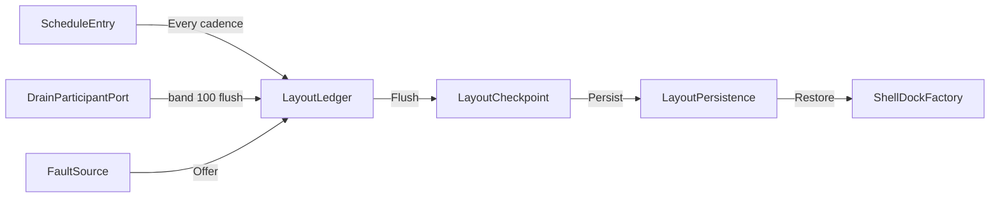

# [APPUI_SHELL_NAVIGATION]

Rasm.AppUi composes one shell: a five-case `NavRequest` union dispatches over the `ShellRoot` router capsule with two view-resolution hosts, one `ShellDockFactory` folds route-keyed `DockableRow` rows into the Dock model graph so dockables are screens, `LayoutLedger` flows layout checkpoints as versioned hashed blobs through `LayoutPersistence` delegates with cadence, drain, support, and crash-restore registrations on the AppHost ports, `ShellChrome` derives menu, toolbar, status, and tray rows from intent keys per `SurfaceHost` row, and `AdaptiveLayout` owns the breakpoint table. The page owns the routing spine, dock layouts with checkpoint-cadence and crash-restore values, chrome derivation, and adaptive layout over ReactiveUI, Dock.Avalonia, Dock.Model.ReactiveUI, Xaml.Behaviors.Avalonia, Thinktecture vocabulary, and LanguageExt rails.

## [1]-[INDEX]

| [INDEX] | [CLUSTER]       | [OWNS]                                                            |
| :-----: | --------------- | ----------------------------------------------------------------- |
|   [1]   | ROUTING_SPINE   | One route union over the shell root; two view-resolution hosts    |
|   [2]   | DOCK_LAYOUTS    | Dockables fold from route rows; checkpoint, crash restore, drain  |
|   [3]   | SHELL_CHROME    | Chrome rows derive from intent keys per surface row               |
|   [4]   | ADAPTIVE_LAYOUT | One breakpoint table; behavior-attached responsive policy values  |

## [2]-[ROUTING_SPINE]

- Owner: `NavRequest` `[Union]` five-verb navigation vocabulary with the deep-link grammar; `ShellRoot` shell-root capsule owning `IScreen`, the router cell, and the ordinal-frozen route index.
- Cases: Push, Pop, Replace, Reset, Modal
- Entry: `public IO<Unit> Navigate(NavRequest request)` — `IO` carries the navigation effect; an unknown route key aborts on the `Error` rail.
- Auto: `RoutedViewHost` re-resolves the view on every router transition; deep links and remote verbs enter through `Parse` with no second admission path.
- Packages: ReactiveUI, ReactiveUI.Avalonia, Thinktecture.Runtime.Extensions, LanguageExt.Core, BCL inbox
- Growth: a new navigation verb is one case on `NavRequest`, and a new screen is one route row frozen through `Freeze`; zero new surface.
- Boundary: `ShellRoot` is the named boundary capsule — ReactiveUI command execution awaits inside its private kernels and nowhere else; `RoutedViewHost` and `ViewModelViewHost` are the only view-resolution surfaces, binding `Router` and `ViewModel` from the shell root, and view lookup beside the two hosts is the deleted pattern; the `ViewContract` value on `RoutedViewHost` carries the `SurfaceHost` row key so one screen resolves a surface-specific template; route keys are ordinal strings shared by deep links, remote invocation, the dock factory, and the web projection, so the same grammar admits every caller today; modal presentation crosses to the dialog-session owner through the `PresentModal` delegate; a second router beside the router cell and a region framework are the rejected forms.

```csharp signature
[Union(ConversionFromValue = ConversionOperatorsGeneration.None)]
public abstract partial record NavRequest {
    private const string Scheme = "rasm:";

    private NavRequest() { }

    public sealed record Push(string RouteKey) : NavRequest;

    public sealed record Pop() : NavRequest;

    public sealed record Replace(string RouteKey) : NavRequest;

    public sealed record Reset(string RouteKey) : NavRequest;

    public sealed record Modal(string RouteKey) : NavRequest;

    public static Fin<NavRequest> Parse(string deepLink) =>
        deepLink.Split('/', StringSplitOptions.RemoveEmptyEntries) switch {
            [Scheme, "push", var key] => Fin.Succ<NavRequest>(new Push(key)),
            [Scheme, "pop"] => Fin.Succ<NavRequest>(new Pop()),
            [Scheme, "replace", var key] => Fin.Succ<NavRequest>(new Replace(key)),
            [Scheme, "reset", var key] => Fin.Succ<NavRequest>(new Reset(key)),
            [Scheme, "modal", var key] => Fin.Succ<NavRequest>(new Modal(key)),
            _ => Fin.Fail<NavRequest>(Error.New($"<invalid-deep-link:{deepLink}>")),
        };
}

public sealed class ShellRoot(
    FrozenDictionary<string, Func<IScreen, IRoutableViewModel>> routes,
    Func<IRoutableViewModel, IO<Unit>> presentModal) : ReactiveObject, IScreen {
    public RoutingState Router { get; } = new();

    public FrozenDictionary<string, Func<IScreen, IRoutableViewModel>> Routes { get; } = routes;

    public Func<IRoutableViewModel, IO<Unit>> PresentModal { get; } = presentModal;

    public static FrozenDictionary<string, Func<IScreen, IRoutableViewModel>> Freeze(
        Seq<(string Key, Func<IScreen, IRoutableViewModel> Make)> rows) =>
        rows.ToFrozenDictionary(static row => row.Key, static row => row.Make, StringComparer.Ordinal);

    public IO<Unit> Navigate(NavRequest request) =>
        request.Switch(
            state: this,
            push: static (s, c) => s.Forward(s.Router.Navigate, c.RouteKey),
            pop: static (s, _) => s.Back(),
            replace: static (s, c) => s.Back().Bind(_ => s.Forward(s.Router.Navigate, c.RouteKey)),
            reset: static (s, c) => s.Forward(s.Router.NavigateAndReset, c.RouteKey),
            modal: static (s, c) => s.Resolve(c.RouteKey).Bind(s.PresentModal));

    private IO<IRoutableViewModel> Resolve(string key) =>
        Routes.TryGetValue(key, out var make)
            ? IO.pure(make(this))
            : IO.fail<IRoutableViewModel>(Error.New($"<unknown-route:{key}>"));

    private IO<Unit> Forward(ReactiveCommand<IRoutableViewModel, IRoutableViewModel> verb, string key) =>
        Resolve(key).Bind(vm => IO.liftAsync(async () => { await verb.Execute(vm); return unit; }));

    private IO<Unit> Back() =>
        IO.liftAsync(async () => { await Router.NavigateBack.Execute(); return unit; });
}
```

## [3]-[DOCK_LAYOUTS]

- Owner: `DockableRow` registration row; `ShellDockFactory` boundary capsule over the Dock model graph; `ShellPolicy` policy anchor; `LayoutCheckpoint` versioned blob record; `LayoutPersistence` port-delegate record; `LayoutLedger` checkpoint, restore, and registration fold surface.
- Entry: `public static IO<Option<LayoutCheckpoint>> Flush(ClockPolicy clocks, LayoutPersistence port, Atom<Option<string>> last)` — `IO` carries the serialize-hash-persist effect; the unchanged-hash skip rides `Option<T>`.
- Auto: the cadence, drain, and support rows register once at composition — flush fires on the `Every` cadence and again at drain band 100, the support capture reads the latest blob, and boot restore runs once from the fault-spine probe consequence; zero UI timers.
- Receipt: `Flush` yields `Option<LayoutCheckpoint>` — Some on a persisted blob, None on the unchanged-hash skip; the checkpoint record is the restore evidence and the support artifact body.
- Packages: Dock.Avalonia, Dock.Model.ReactiveUI, NodaTime, LanguageExt.Core, Rasm.AppHost (project), BCL inbox
- Growth: a new dockable is one `DockableRow` row registered from the screen catalog, and a new cadence, rank, retention, or proportion bound is one policy value on `ShellPolicy`; zero new surface.
- Boundary: `ShellDockFactory` is the named boundary capsule for the statement carve-out — the Dock model graph is mutable host-owned state assembled only through `Factory` create entrypoints, and view-layer mutation of dock structure is the rejected form; `DockControl` binds `Build`'s root through `Layout` with `InitializeLayout` and `InitializeFactory` false so the factory owns initialization, and floating hosts ride `HostWindowFactory` with `EnableManagedWindowLayer` under the `FloatingWindows` gate; dockable `Context` resolves through the same frozen route index as navigation, so a dockable is a screen and a second viewmodel system is the deleted pattern; the serialize and restore delegates bind the dock serializer at composition and the payload crosses the Persistence port as an opaque versioned blob — AppUi issues no store queries, the `ContentHash` delegate carries the Persistence snapshot hash vocabulary, and the persist route prunes to `RetainedCheckpoints` generations; crash offer consumes the fault-spine crashes — a `HostCrashMarker` case gates the confirm route while a clean boot restores the warm blob silently; multi-window coordination and session restore ride the same blob; the checkpoint row shares the health-probe deadline bound, so a flush past it is the dispatcher-starvation signal; the drain row ranks after the screens teardown row inside `DrainBand.Interaction`, so the flushed layout captures post-suspension state; pin, auto-hide, float, and close states are `DockableRow` policy values, never control state.

```csharp signature
public sealed record DockableRow(
    string RouteKey,
    string Title,
    bool IsTool,
    bool CanFloat,
    bool CanPin,
    bool CanClose,
    int Rank);

public sealed class ShellDockFactory(ShellRoot shell, Seq<DockableRow> rows) : Factory {
    public RootDock Build() {
        var tools = CreateToolDock();
        tools.Proportion = ShellPolicy.ToolDockProportion;
        tools.VisibleDockables = CreateList<IDockable>([.. rows.Filter(static r => r.IsTool).OrderBy(static r => r.Rank).Select(Dockable)]);
        var documents = CreateDocumentDock();
        documents.VisibleDockables = CreateList<IDockable>([.. rows.Filter(static r => !r.IsTool).OrderBy(static r => r.Rank).Select(Dockable)]);
        var split = CreateProportionalDock();
        split.Orientation = Orientation.Horizontal;
        split.VisibleDockables = CreateList<IDockable>(tools, CreateProportionalDockSplitter(), documents);
        var root = CreateRootDock();
        root.VisibleDockables = CreateList<IDockable>(split);
        root.ActiveDockable = split;
        return root;
    }

    private IDockable Dockable(DockableRow row) {
        DockableBase dockable = row.IsTool ? CreateTool() : (DockableBase)CreateDocument();
        var make = shell.Routes[row.RouteKey];
        dockable.Id = row.RouteKey;
        dockable.Title = row.Title;
        dockable.Context = make(shell);
        dockable.CanFloat = row.CanFloat;
        dockable.CanPin = row.CanPin;
        dockable.CanClose = row.CanClose;
        return dockable;
    }
}
```

```csharp signature
public static class ShellPolicy {
    public const int LayoutVersion = 1;
    public const int DrainRank = 20;
    public const int RetainedCheckpoints = 4;
    public const long LayoutArtifactBytes = 262_144;
    public const double ToolDockProportion = 0.25;
    public static readonly Duration CheckpointCadence = Duration.FromSeconds(120);

    public static bool FloatingWindows(SurfaceHost host) =>
        host is not (SurfaceHost.RhinoPanel or SurfaceHost.WebBrowser);
}

public sealed record LayoutCheckpoint(int Version, string ContentHash, string Payload, Instant At);

public sealed record LayoutPersistence(
    Func<string> Serialize,
    Action<string> Restore,
    Func<string, string> ContentHash,
    Func<LayoutCheckpoint, IO<Unit>> Persist,
    IO<Option<LayoutCheckpoint>> Latest);

public static class LayoutLedger {
    public static IO<Option<LayoutCheckpoint>> Flush(ClockPolicy clocks, LayoutPersistence port, Atom<Option<string>> last) =>
        IO.lift(port.Serialize)
            .Map(payload => new LayoutCheckpoint(ShellPolicy.LayoutVersion, port.ContentHash(payload), payload, clocks.Now))
            .Bind(next => last.Value == Some(next.ContentHash)
                ? IO.pure(Option<LayoutCheckpoint>.None)
                : port.Persist(next).Map(done => (last.Swap(prior => Some(next.ContentHash)), Some(next)).Item2));

    public static Option<LayoutCheckpoint> Offer(Seq<FaultSource> crashes, Option<LayoutCheckpoint> latest) =>
        crashes.Exists(static fault => fault is FaultSource.HostCrashMarker) ? latest : None;

    public static IO<Unit> Restore(LayoutPersistence port, Seq<FaultSource> crashes, Func<LayoutCheckpoint, IO<bool>> confirm) =>
        port.Latest.Bind(latest =>
            Offer(crashes, latest) is { IsSome: true, Case: LayoutCheckpoint offered }
                ? confirm(offered).Bind(accepted => accepted
                    ? IO.lift(fun(() => port.Restore(offered.Payload)))
                    : IO.pure(unit))
                : latest is { IsSome: true, Case: LayoutCheckpoint warm }
                    ? IO.lift(fun(() => port.Restore(warm.Payload)))
                    : IO.pure(unit));

    public static ScheduleEntry CheckpointRow(ClockPolicy clocks, LayoutPersistence port, Atom<Option<string>> last) =>
        new(
            Key: "shell-layout-checkpoint",
            Spec: new OccurrenceSpec.Every(ShellPolicy.CheckpointCadence),
            Deadline: DeadlineClass.HealthProbe,
            Lease: None,
            Work: () => Flush(clocks, port, last).Map(static saved => unit));

    public static DrainParticipantPort DrainRow(ClockPolicy clocks, LayoutPersistence port, Atom<Option<string>> last) =>
        new(
            Name: "shell-layout-flush",
            Band: DrainBand.Interaction,
            Rank: ShellPolicy.DrainRank,
            Drain: cancel => Flush(clocks, port, last).Map(static saved => unit));

    public static SupportContributorPort SupportRow(LayoutPersistence port) =>
        new(
            Package: "Rasm.AppUi",
            Rows: Seq(new SupportArtifact(
                Name: "dock-layout",
                Classification: DataClassification.Operational,
                EstimatedBytes: ShellPolicy.LayoutArtifactBytes,
                Produce: window => port.Latest.Map(latest =>
                    ((ReadOnlyMemory<byte>)Encoding.UTF8.GetBytes(latest.Map(static c => c.Payload).IfNone("")), 0)))));
}
```



## [4]-[SHELL_CHROME]

- Owner: `ChromeKeyPolicy` comparer accessor; `ChromeSlot` `[SmartEnum<string>]` four-slot chrome vocabulary; `ChromeRow` derivation row; `ShellChrome` projection fold.
- Cases: menu, toolbar, status, tray
- Entry: `public static Seq<ChromeRow> Project(SurfaceHost host, ChromeSlot slot, Seq<ChromeRow> rows)` — pure projection; rows filter on slot and host predicate and order by rank.
- Packages: Avalonia, Thinktecture.Runtime.Extensions, LanguageExt.Core, BCL inbox
- Growth: a new chrome surface is one `ChromeSlot` case, and a new entry is one `ChromeRow` row naming an existing intent key; zero new surface.
- Boundary: rows carry intent keys only — command mechanics, gestures, and availability live on the intent table and arrive as settled vocabulary, so menu item classes and per-surface registries are the deleted patterns; the Menu slot projects to the macOS global-menu export on window-owning rows and to the managed in-window menu elsewhere, and the Tray slot materializes only where the matrix admits it, with the exact export member spellings research-gated; embedded rows suppress menu and status chrome because the host owns its own chrome, and the WebBrowser row exposes serialized keys only; window titles compose the product name with the active dockable `Title` through `Title`; the Headless floating cell stays vacuously open because no `HostWindow` materializes without a windowing platform.

```csharp signature
public sealed class ChromeKeyPolicy : IEqualityComparerAccessor<string>, IComparerAccessor<string> {
    public static IEqualityComparer<string> EqualityComparer => StringComparer.Ordinal;

    public static IComparer<string> Comparer => StringComparer.Ordinal;
}

[SmartEnum<string>]
[KeyMemberEqualityComparer<ChromeKeyPolicy, string>]
[KeyMemberComparer<ChromeKeyPolicy, string>]
public sealed partial class ChromeSlot {
    public static readonly ChromeSlot Menu = new("menu");
    public static readonly ChromeSlot Toolbar = new("toolbar");
    public static readonly ChromeSlot Status = new("status");
    public static readonly ChromeSlot Tray = new("tray");
}

public sealed record ChromeRow(string IntentKey, ChromeSlot Slot, string Path, int Rank, Func<SurfaceHost, bool> Visible);

public static class ShellChrome {
    public static Seq<ChromeRow> Project(SurfaceHost host, ChromeSlot slot, Seq<ChromeRow> rows) =>
        toSeq(rows.Filter(row => row.Slot == slot && row.Visible(host)).OrderBy(static row => row.Rank));

    public static string Title(string product, Option<string> active) =>
        active is { IsSome: true, Case: string current } ? $"{current} — {product}" : product;
}
```

Visibility matrix — the value source for every `Visible` predicate and for `FloatingWindows`:

| [INDEX] | [HOST_ROW]            | [MENU] | [TOOLBAR] | [STATUS] | [TRAY] | [FLOATING] |
| :-----: | --------------------- | :----: | :-------: | :------: | :----: | :--------: |
|   [1]   | AvaloniaDesktopWindow |  on    |    on     |    on    |  off   |    open    |
|   [2]   | RhinoPanel            |  off   |    on     |   off    |  off   | suppressed |
|   [3]   | RhinoModal            |  off   |    on     |   off    |  off   |    open    |
|   [4]   | Gh2CompanionWindow    |  off   |    on     |    on    |  off   |    open    |
|   [5]   | SidecarShell          |  on    |    on     |    on    |  on    |    open    |
|   [6]   | WebBrowser            |  off   |    off    |   off    |  off   | suppressed |
|   [7]   | Headless              |  off   |    off    |   off    |  off   |    open    |

## [5]-[ADAPTIVE_LAYOUT]

- Owner: `BreakpointRow` responsive tier row; `AdaptiveLayout` resolve fold over the ascending table.
- Entry: `public static BreakpointRow Resolve(double width)` — pure fold; the widest admitted row wins.
- Packages: Xaml.Behaviors.Avalonia, LanguageExt.Core, BCL inbox
- Growth: a new responsive tier is one `BreakpointRow` row; zero new surface.
- Boundary: `AdaptiveBehavior` and `AspectRatioBehavior` attach the resolved row key at each surface root, so per-view width literals are the deleted pattern; density-aware spacing arrives from the theme token resolve as settled vocabulary and composes orthogonally to breakpoints; the row keys are serializable strings, so the designed-only WebBrowser growth case consumes the same vocabulary with zero live surface.

```csharp signature
public sealed record BreakpointRow(string Key, double MinWidth);

public static class AdaptiveLayout {
    public static readonly Seq<BreakpointRow> Rows = Seq(
        new BreakpointRow("compact", 0d),
        new BreakpointRow("medium", 720d),
        new BreakpointRow("expanded", 1280d));

    public static BreakpointRow Resolve(double width) =>
        Rows.Fold(Rows[0], (best, row) => row.MinWidth <= width ? row : best);
}
```

## [6]-[RESEARCH]

| [INDEX] | [ITEM]                                                                                                                                  | [PROOF]                                                                                          | [GATE]        |
| :-----: | ---------------------------------------------------------------------------------------------------------------------------------------- | -------------------------------------------------------------------------------------------------- | ------------- |
|   [1]   | RoutingState navigation command surface — Navigate, NavigateBack, NavigateAndReset shapes and the awaitable Execute form on the ReactiveUI 23 line | uv run python -m tools.assay api query reactiveui RoutingState                                    | ROUTING_SPINE |
|   [2]   | Dock model composition member surface — IDockable contract, dockable identity, context, float-pin-close flags, visible-dockable lists, proportion and orientation members | uv run python -m tools.assay api query dock.model.reactiveui DockableBase                          | DOCK_LAYOUTS  |
|   [3]   | DockSerializer round-trip payload shape preserving dockable identity across serialize and restore                                          | uv run python -m tools.assay test run --target Rasm.AppUi build-serialize-restore headless spec    | DOCK_LAYOUTS  |
|   [4]   | NativeMenuBar export and TrayIcon attachment spellings on the Avalonia 12 line per SurfaceHost row                                         | uv run python -m tools.assay api query avalonia NativeMenuBar                                      | SHELL_CHROME  |
