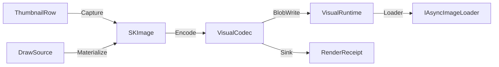

# [APPUI_VISUALS_OFFSCREEN]

Offscreen visuals are the package's raster rail: one DrawSource capsule projects every Skia canvas — host-leased or owned — through a Fin-railed Use, thumbnails and geometry previews materialize as SKImage through host-agnostic capture delegates, one codec surface encodes and decodes with content-hashed RenderReceipt evidence, and one SKDocument export surface paginates a flow-fold of content blocks under a break rule and header-footer band, delivering paged output to parameterized destinations. The page owns the draw capsule, the thumbnail and preview row families, the encode axis, the export spec with its flow vocabulary and destination union, and the RenderReceipt family the render-hash proof lanes and the AppHost telemetry spine consume. The package spine is SkiaSharp behind Avalonia.Skia leases, AsyncImageLoader display, and PanAndZoom preview navigation; HUD and viewport overlay drawing stays host-side.

## [1]-[INDEX]

| [INDEX] | [CLUSTER]          | [OWNS]                                                       |
| :-----: | :----------------- | :----------------------------------------------------------- |
|   [1]   | DRAW_CAPSULE       | Borrowed and owned Skia canvas projection on one Fin rail    |
|   [2]   | THUMBNAIL_PIPELINE | Host-agnostic capture rows, blob-backed cache, async display |
|   [3]   | PREVIEW_SURFACES   | Receipt-to-path preview rows, backplates, zoomable viewing   |
|   [4]   | ENCODE_IDENTITY    | Codec axis, content-hashed receipts, native asset identity   |
|   [5]   | DOCUMENT_EXPORT    | Paged SKDocument export to parameterized destinations        |

## [2]-[DRAW_CAPSULE]

- Owner: `DrawSource` [Union] · `Offscreen`
- Cases: Borrowed · Owned
- Entry: `public Fin<T> Use<T>(Func<SKCanvas, Fin<T>> draw)` — Fin rail
- Auto: in-tree visuals lease the live canvas through `ISkiaSharpApiLeaseFeature.Lease` at render scope and fold to Borrowed; offscreen pipelines construct Owned with the target `SKImageInfo` and Materialize a snapshot.
- Packages: SkiaSharp, Avalonia.Skia, Thinktecture.Runtime.Extensions, LanguageExt.Core
- Growth: one effect row extends the FX table, and the in-tree vehicle is one `ICustomDrawOperation` implementation — `Bounds`, `HitTest(Point)`, `Render(ImmediateDrawingContext)` with the canvas leased through `ISkiaSharpApiLeaseFeature.Lease()` folding to Borrowed — zero new surface.
- Boundary: `Offscreen` is the named boundary capsule — the using-scoped `SKSurface` create-and-dispose pair is the only place a Skia surface is owned; a Borrowed lease draws into the host's in-flight frame and never materializes, so Materialize folds that arm to the LeaseBound error row; transforms compose as `SKMatrix` values inside `Save`/`Restore` scopes and no mutated canvas state survives a projection; FX-row effect natives construct once at token resolve and bind onto the long-lived paint, and gradient stops enter through `SKColorF` token paints under the color-managed law so a wide-gamut ramp never quantizes through the byte color path — a per-draw effect construction or a sRGB-lerped gradient is the deleted form; the custom-visual layout folds compose their projected `SKPath` through `Owned.Materialize` exactly as `PreviewRow.Render` does, so `Offscreen` stays the only Skia-surface owner and the custom-visual rail mints no second surface, encode, or capture owner.

```csharp signature
[Union(ConversionFromValue = ConversionOperatorsGeneration.None)]
public abstract partial record DrawSource {
    private DrawSource() { }
    public sealed record Borrowed(ISkiaSharpApiLease Lease) : DrawSource;
    public sealed record Owned(SKImageInfo Info) : DrawSource;

    public Fin<T> Use<T>(Func<SKCanvas, Fin<T>> draw) => Switch(
        state: draw,
        borrowed: static (paint, source) => paint(source.Lease.SkCanvas),
        owned: static (paint, source) => Offscreen.Rent(source.Info, paint));

    public Fin<SKImage> Materialize(Func<SKCanvas, Fin<Unit>> draw) => Switch(
        state: draw,
        borrowed: static (_, _) => Fin<SKImage>.Fail(Offscreen.LeaseBound),
        owned: static (paint, source) => Offscreen.Snapshot(source.Info, paint));
}

public static class Offscreen {
    public static readonly Error LeaseBound = Error.New("visuals/lease-bound: a borrowed host lease draws into the live frame and never materializes");

    public static Fin<T> Rent<T>(SKImageInfo info, Func<SKCanvas, Fin<T>> draw) {
        using SKSurface surface = SKSurface.Create(info);
        return draw(surface.Canvas);
    }

    public static Fin<SKImage> Snapshot(SKImageInfo info, Func<SKCanvas, Fin<Unit>> draw) {
        using SKSurface surface = SKSurface.Create(info);
        return draw(surface.Canvas).Map(_ => surface.Snapshot());
    }
}
```

| [INDEX] | [FX_ROW]       | [FACTORY]                       | [CONSUMER]                          |
| :-----: | :------------- | :------------------------------ | :---------------------------------- |
|   [1]   | runtime-shader | `SKRuntimeEffect.CreateShader`  | animated backplates, gauge fills    |
|   [2]   | blur           | `SKImageFilter.CreateBlur`      | thumbnail elevation underlays       |
|   [3]   | dash           | `SKPathEffect.CreateDash`       | preview curve styling               |
|   [4]   | tint           | `SKColorFilter`                 | classification and state recoloring |
|   [5]   | mask           | `SKMaskFilter`                  | preview edge fades                  |
|   [6]   | gradient       | `SKShader.CreateLinearGradient` | preview fills, sparkline ramps      |

## [3]-[THUMBNAIL_PIPELINE]

- Owner: `VisualRuntime` · `ThumbnailRow` · `Thumbnails`
- Entry: `public static IO<RenderReceipt> Refresh(VisualRuntime runtime, ThumbnailRow row, (double Scale, int PixelSize) variant)` — IO rail
- Auto: capture delegates discriminate on the host row — the rhino row rides `ViewCapture.CaptureToBitmap` through the Rasm.Rhino port, the gh2 row rides the Rasm.Grasshopper canvas-snapshot seam, and the empty host row materializes through `DrawSource.Owned`; display binds `AdvancedImage` to the runtime `Loader` with `FallbackImage` resolved from the row's placeholder and error keys; variant selection picks the table row whose Scale matches the mounted surface's scale fact.
- Receipt: every refresh lands one RenderReceipt of kind thumbnail carrying the blob artifact key as its destination.
- Packages: AsyncImageLoader.Avalonia, SkiaSharp, Rasm.Rhino (project), Rasm.Grasshopper (project), Rasm.AppHost (project), LanguageExt.Core, NodaTime
- Growth: one thumbnail row admits a new visual family; one variant row retunes scale and pixel policy values — zero new surface.
- Boundary: the memory cache is the `RamCachedWebImageLoader`-backed Loader and the durable cache is the blob lane behind the BlobWrite and BlobRead delegates — a second thumbnail cache is deleted; host bitmaps convert to `SKImage` exactly once at the port edge and no Eto or RhinoCommon bitmap type crosses into rows; the BundleWrite delegate is the support-contributor consequence, the Sink delegate is the receipt-sink envelope binding, and the Measure delegate records a named-instrument duration through the one `AppUiTelemetry.Contribute` spine so a phase elapsed distinct from the encode receipt rides the same telemetry surface, never a local meter.

```csharp signature
public sealed record VisualRuntime(
    CorrelationId Correlation,
    ProfileRoots Roots,
    ClockPolicy Clocks,
    IAsyncImageLoader Loader,
    Func<string, ReadOnlyMemory<byte>, IO<string>> BlobWrite,
    Func<string, IO<ReadOnlyMemory<byte>>> BlobRead,
    Func<string, DataClassification, ReadOnlyMemory<byte>, IO<string>> BundleWrite,
    Func<ReadOnlyMemory<byte>, string> ContentHash,
    Func<RenderReceipt, IO<Unit>> Sink,
    Func<string, string, Duration, IO<Unit>> Measure,
    Func<IO<Seq<NativeAssetFact>>> NativeIdentity);

public sealed record ThumbnailRow(
    string Key,
    string HostKind,
    Func<(double Scale, int PixelSize), IO<SKImage>> Capture,
    DataClassification Classification,
    string PlaceholderKey,
    string ErrorKey);

public static class Thumbnails {
    public static IO<RenderReceipt> Refresh(VisualRuntime runtime, ThumbnailRow row, (double Scale, int PixelSize) variant) =>
        from image in row.Capture(variant)
        from receipt in VisualCodec.Encode(runtime, image, VisualCodec.Png, "thumbnail", VariantKey(row, variant))
        select receipt;

    static string VariantKey(ThumbnailRow row, (double Scale, int PixelSize) variant) =>
        $"thumbnails/{row.Key}@{variant.Scale}x{variant.PixelSize}.png";
}
```



| [INDEX] | [VARIANT]      | [SCALE] | [PIXEL] |
| :-----: | :------------- | :------ | :------ |
|   [1]   | list           | 1.0     | 128     |
|   [2]   | list-retina    | 2.0     | 256     |
|   [3]   | gallery        | 1.0     | 256     |
|   [4]   | gallery-retina | 2.0     | 512     |

## [4]-[PREVIEW_SURFACES]

- Owner: `PreviewRow<TReceipt>`
- Entry: `public Fin<SKImage> Render(TReceipt receipt, SKImageInfo info)` — Fin rail
- Auto: zoomable previews mount inside `ZoomBorder` with `AutoFit` on load and `ZoomToRectangle` bound to the gesture rows; Underlay and Stroke delegates resolve once at row registration from the backplate table row and the paint-role key.
- Packages: SkiaSharp, PanAndZoom, LanguageExt.Core
- Growth: one preview row admits a new receipt family — geometry families from Compute mesh and curve receipt streams land as rows binding their Project folds; zero new surface.
- Boundary: Render is the named path-scope boundary capsule — the projected `SKPath` is using-scoped and never outlives the fold; HUD and viewport overlays stay host-side: Rhino and Grasshopper display conduits own all in-viewport drawing and AppUi never paints into a host viewport; TReceipt stays generic so no Compute receipt shape is re-modeled here.

```csharp signature
public sealed record PreviewRow<TReceipt>(
    string Key,
    Func<TReceipt, Fin<SKPath>> Project,
    string Backplate,
    string PaintRole,
    Func<SKCanvas, SKImageInfo, Fin<Unit>> Underlay,
    Func<SKCanvas, SKPath, Fin<Unit>> Stroke) {
    public Fin<SKImage> Render(TReceipt receipt, SKImageInfo info) =>
        Project(receipt).Bind(path => {
            using SKPath scoped = path;
            return new DrawSource.Owned(info).Materialize(canvas =>
                Underlay(canvas, info).Bind(_ => Stroke(canvas, scoped)));
        });
}
```

| [INDEX] | [BACKPLATE]  | [CELL] | [PAINT_ROLES]                     |
| :-----: | :----------- | :----- | :-------------------------------- |
|   [1]   | checkerboard | 8 px   | surface-check-a · surface-check-b |
|   [2]   | solid        | —      | surface                           |
|   [3]   | transparent  | —      | none                              |

## [5]-[ENCODE_IDENTITY]

- Owner: `RenderReceipt` · `NativeAssetFact` · `VisualCodec`
- Entry: `public static IO<RenderReceipt> Encode(VisualRuntime runtime, SKImage image, EncodeRow row, string kind, string key)` — IO rail
- Auto: the runtime NativeIdentity delegate is filled by the mount transaction's load-identity probe and yields one `NativeAssetFact` per loaded native (libSkiaSharp, libHarfBuzzSharp) with version, path, and RID; the evidence stream folds the facts with kind native-asset.
- Receipt: FrameHash is the whole-payload content hash through the runtime ContentHash delegate bound to the suite XxHash128 identity row; quality values are the encode-row axis values — lossless png at 100, perceptual jpeg and webp at 90; the receipt's `ColorSpace` field is the encode-row working-space tag so a wide-gamut baseline keys distinctly from its sRGB twin and a cross-host byte swap is attributable, never silent.
- Packages: SkiaSharp, SkiaSharp.NativeAssets.macOS, SkiaSharp.NativeAssets.Linux.NoDependencies, Rasm.AppHost (project), NodaTime, LanguageExt.Core
- Growth: one encode row admits a format; one policy value retunes quality; one `ColorPolicy` row retunes the working-and-output color-space pair and rides the `ColorSpaceAxis` gamut vocabulary; one `ToneMap` row admits an HDR-to-SDR operator; an ICC-profiled output is one `ColorPolicy.FromIcc` value from a profile-byte source — zero new surface.
- Boundary: Decode and Encode are the named native-disposal boundary capsules — the intermediate `SKBitmap`, the consumed `SKImage`, and the encoded `SKData` are using-scoped so a failing later clause never leaks a native handle, and Encode owns the image it consumes; per-format exporter classes are deleted with the encode rows as the absorbing axis; the `RenderReceipt` `Elapsed`, `Bytes`, and `FrameHash` fields project to the encode-duration span and byte-size metric on the AppHost telemetry spine through the runtime `Sink` bound to the `ReceiptSinkPort`, never a local meter or a second receipt vocabulary; render-hash proof lanes compare FrameHash values rendered on Skia-backed headless rows where `UseHeadlessDrawing` false selects real Skia drawing; color management is float end-to-end — the encode row carries a `ColorPolicy` whose `Working` space `Reproject` retags the consumed `SKImage` to its declared space through `SKImage.ColorSpace` and `SKImageInfo.WithColorSpace` and whose `Output` space pins the encoded payload, `SKColorSpace.CreateSrgbLinear` is the composite-blend working space converted once at projection, `SKColorSpace.Equal` is the only color-space identity test, the `SKImage.ColorSpace` read, the `SKColorType.RgbaF16` float surface format, and the `SKAlphaType.Premul` alpha mode that the five-argument `SKImageInfo` constructor and `SKImageInfo.WithColorSpace` compose are confirmed against the installed SkiaSharp surface, and the reproject is fail-closed against an already-matching color space, and the byte `SKColor` path that assumes sRGB and quantizes before conversion is the deleted form so a wide-gamut render hashes its float pixels, never a quantized sRGB shadow; `SKColorF` carries token paints into the float pipeline so a wide-gamut token never round-trips through the byte color quantizer; the four `ColorPolicy` gamut rows `Display`, `DisplayP3`, `Rec2020`, and `ScrgbFloat` are the encode-side projection of the single suite-wide `ColorSpaceAxis` vocabulary the custom-visual rail owns, the ICC-tagged rows source `SKColorSpace.CreateRgb(SKColorSpaceTransferFn.Srgb, SKColorSpaceXyz.DisplayP3)` and `SKColorSpaceXyz.Rec2020` on the `Rgba8888` byte surface and the float row sources `SKColorSpace.CreateRgb(SKColorSpaceTransferFn.Linear, SKColorSpaceXyz.Srgb)` on the `RgbaF16` surface, the `Surface` column selects the reproject pixel format per row so the float row never truncates to bytes and the ICC rows never inflate to half-float, and the `RenderReceipt.ColorSpace` tag is one of the axis keys so a cross-host byte swap is attributable to the exact gamut and a parallel `Gamut` enum or per-encode color struct is the deleted form; HDR tone-mapping is the `ToneMap` smart-enum column on `ColorPolicy` — the `Aces`/`Reinhard`/`HableFilmic` curves are pure float operators sampled into a 256-entry `SKColorFilter.CreateTable` LUT bound onto the reproject paint exactly once at projection, so a scene-referred Rec.2020-PQ render tone-maps to the SDR output gamut through one filter pass and a per-pixel managed tone-map loop or a second display-mapping owner is the deleted form, and the `HdrPq` row carries the `Aces` operator so an HDR baseline keys distinctly and its SDR projection is reproducible; ICC profile management is `ColorPolicy.FromIcc` — an embedded or sidecar ICC profile parses through `SKColorSpace.CreateIcc(ReadOnlySpan<byte>)` into the working-and-output space so a display-calibrated or print profile drives the reproject without a fifth enum, an unparseable profile folds to the `icc-invalid` error row rather than a silent sRGB fallback, and an OpenColorIO config crosses the seam as a profile-byte source the caller resolves — AppUi consumes the profile bytes and never embeds an OCIO runtime; the OCIO-config-to-ICC extraction is caller-side and a managed OCIO color-pipeline is the deleted form; the `SKColorSpace.CreateIcc` parse, the `SKColorFilter.CreateTable(byte[])` LUT arity, and the `SKImageInfo.WithColorSpace` ICC tag round-trip resolve at implementation against the installed SkiaSharp surface under ICC_TONEMAP.

```csharp signature
public sealed record RenderReceipt(
    string Kind,
    string Format,
    string FrameHash,
    long Bytes,
    Duration Elapsed,
    CorrelationId Correlation,
    Option<string> Destination,
    string ColorSpace);

public sealed record NativeAssetFact(string Library, string Version, string Path, string Rid);

public static class VisualCodec {
    public static readonly EncodeRow Png = new("png", SKEncodedImageFormat.Png, 100, ColorPolicy.Display);
    public static readonly EncodeRow Jpeg = new("jpeg", SKEncodedImageFormat.Jpeg, 90, ColorPolicy.Display);
    public static readonly EncodeRow Webp = new("webp", SKEncodedImageFormat.Webp, 90, ColorPolicy.Display);
    public static readonly EncodeRow PngWide = new("png-wide", SKEncodedImageFormat.Png, 100, ColorPolicy.WideGamut);
    public static readonly EncodeRow PngP3 = new("png-p3", SKEncodedImageFormat.Png, 100, ColorPolicy.DisplayP3);
    public static readonly EncodeRow PngRec2020 = new("png-rec2020", SKEncodedImageFormat.Png, 100, ColorPolicy.Rec2020);
    public static readonly EncodeRow PngScrgb = new("png-scrgb", SKEncodedImageFormat.Png, 100, ColorPolicy.ScrgbFloat);
    public static readonly EncodeRow PngHdr = new("png-hdr", SKEncodedImageFormat.Png, 100, ColorPolicy.HdrPq);

    public sealed record ColorPolicy(string Key, Func<SKColorSpace> Working, Func<SKColorSpace> Output, SKColorType Surface, ToneMap Tone) {
        public static readonly ColorPolicy Display = new("srgb", SKColorSpace.CreateSrgb, SKColorSpace.CreateSrgb, SKColorType.Rgba8888, ToneMap.None);
        public static readonly ColorPolicy WideGamut = new("srgb-linear", SKColorSpace.CreateSrgbLinear, SKColorSpace.CreateSrgb, SKColorType.RgbaF16, ToneMap.None);
        public static readonly ColorPolicy DisplayP3 = new("display-p3", static () => SKColorSpace.CreateRgb(SKColorSpaceTransferFn.Srgb, SKColorSpaceXyz.DisplayP3), static () => SKColorSpace.CreateRgb(SKColorSpaceTransferFn.Srgb, SKColorSpaceXyz.DisplayP3), SKColorType.Rgba8888, ToneMap.None);
        public static readonly ColorPolicy Rec2020 = new("rec2020", static () => SKColorSpace.CreateRgb(SKColorSpaceTransferFn.Srgb, SKColorSpaceXyz.Rec2020), static () => SKColorSpace.CreateRgb(SKColorSpaceTransferFn.Srgb, SKColorSpaceXyz.Rec2020), SKColorType.Rgba8888, ToneMap.None);
        public static readonly ColorPolicy ScrgbFloat = new("scrgb-float", static () => SKColorSpace.CreateRgb(SKColorSpaceTransferFn.Linear, SKColorSpaceXyz.Srgb), static () => SKColorSpace.CreateRgb(SKColorSpaceTransferFn.Linear, SKColorSpaceXyz.Srgb), SKColorType.RgbaF16, ToneMap.None);
        public static readonly ColorPolicy HdrPq = new("rec2020-pq", static () => SKColorSpace.CreateRgb(SKColorSpaceTransferFn.Linear, SKColorSpaceXyz.Rec2020), static () => SKColorSpace.CreateRgb(SKColorSpaceTransferFn.Srgb, SKColorSpaceXyz.Rec2020), SKColorType.RgbaF16, ToneMap.Aces);

        public SKColorF Resolve(Color token) => new(token.R / 255f, token.G / 255f, token.B / 255f, token.A / 255f);

        public static Fin<ColorPolicy> FromIcc(string key, ReadOnlyMemory<byte> profile, SKColorType surface) =>
            Optional(SKColorSpace.CreateIcc(profile.Span)) is { IsSome: true, Case: SKColorSpace space }
                ? Fin.Succ(new ColorPolicy(key, () => space, () => space, surface, ToneMap.None))
                : Fin.Fail<ColorPolicy>(Error.New($"visuals/icc-invalid: profile bytes for {key} do not parse as an ICC profile"));

        public Fin<SKImage> Reproject(SKImage image) {
            using SKColorSpace target = Output();
            using SKColorFilter? tone = Tone.Filter();
            return SKColorSpace.Equal(image.ColorSpace ?? SKColorSpace.CreateSrgb(), target) && tone is null
                ? Fin.Succ(image)
                : Offscreen.Snapshot(
                    new SKImageInfo(image.Width, image.Height, Surface, SKAlphaType.Premul).WithColorSpace(target),
                    canvas => {
                        using SKPaint paint = new() { ColorFilter = tone };
                        canvas.DrawImage(image, 0f, 0f, paint);
                        return FinSucc(unit);
                    });
        }
    }

    [SmartEnum<string>]
    public sealed partial class ToneMap {
        public static readonly ToneMap None = new("none", static _ => 1f);
        public static readonly ToneMap Reinhard = new("reinhard", static x => x / (1f + x));
        public static readonly ToneMap Aces = new("aces", static x => Math.Clamp((x * ((2.51f * x) + 0.03f)) / ((x * ((2.43f * x) + 0.59f)) + 0.14f), 0f, 1f));
        public static readonly ToneMap HableFilmic = new("hable", static x => (((x * ((0.15f * x) + 0.05f)) + 0.004f) / ((x * ((0.15f * x) + 0.50f)) + 0.06f)) - 0.0667f);

        private readonly Func<float, float> curve;

        public SKColorFilter? Filter() =>
            ReferenceEquals(this, None) ? null : SKColorFilter.CreateTable(Lut());

        private byte[] Lut() =>
            Enumerable.Range(0, 256)
                .Select(step => (byte)Math.Clamp((int)(curve(step / 255f) * 255f), 0, 255))
                .ToArray();
    }

    public sealed record EncodeRow(string Key, SKEncodedImageFormat Format, int Quality, ColorPolicy Color);

    public static IO<SKImage> Decode(ReadOnlyMemory<byte> payload) =>
        IO.lift(() => {
            using SKBitmap bitmap = SKBitmap.Decode(payload.Span);
            return SKImage.FromBitmap(bitmap);
        });

    public static IO<RenderReceipt> Encode(VisualRuntime runtime, SKImage image, EncodeRow row, string kind, string key) =>
        from mark in IO.lift(runtime.Clocks.Mark)
        from bytes in IO.lift(() => {
            using SKImage scoped = row.Color.Reproject(image).ThrowIfFail();
            using SKData encoded = scoped.Encode(row.Format, row.Quality);
            return encoded.ToArray();
        })
        from artifact in runtime.BlobWrite(key, bytes)
        from elapsed in IO.lift(() => runtime.Clocks.Elapsed(mark))
        let receipt = new RenderReceipt(kind, row.Key, runtime.ContentHash(bytes), bytes.LongLength, elapsed, runtime.Correlation, Optional(artifact), row.Color.Key)
        from _ in runtime.Sink(receipt)
        select receipt;
}
```

## [6]-[DOCUMENT_EXPORT]

- Owner: `VisualDestination` [Union] · `VisualExportSpec` · `FlowBlock` [Union] · `VisualExport` · `OfficeFormat` · `OfficeSpec` · `OfficeSheet` [Union] · `OfficeExport`
- Cases: FilePath · BlobLane · Bundle; `OfficeFormat` = xlsx · pptx · docx; `OfficeSheet` = Table · Chart · Image · RichText
- Entry: `public static IO<RenderReceipt> Export(VisualRuntime runtime, VisualExportSpec spec)` — IO rail; `public static IO<RenderReceipt> Emit(VisualRuntime runtime, OfficeSpec spec)` — the Office IO rail
- Auto: the Bundle arm delivers visual artifacts through the runtime BundleWrite delegate with their classification — the support-contributor consequence; the FilePath arm receives its absolute path as a value from the picker intent and never computes paths; artifact scopes resolve from ProfileRoots.
- Receipt: one RenderReceipt of kind document per export with whole-payload content hash and the delivered destination key.
- Packages: SkiaSharp, SkiaSharp.HarfBuzz, Thinktecture.Runtime.Extensions, Rasm.AppHost (project), NodaTime, LanguageExt.Core
- Growth: one destination case extends delivery and breaks the Deliver dispatch at compile time; one page-size row extends the table; one `FlowBlock` case extends the flow-block owner and one `BreakRule` value extends the break policy column; one `OfficeFormat` row admits an Office target and one `OfficeSheet` case admits a content kind; zero new surface.
- Boundary: `FlowBlock` is the budgeted export-flow owner (DENSITY_BAR row 30), `HeaderFooterBand` its companion band member, and `BreakRule` a `POLICY_VALUES` column on `VisualExportSpec` — the document-pagination concern resolves through these without minting a surface beside the destination owners; Paged, Flow, and Deliver are the named boundary capsules carrying statement bodies for SKDocument paging, content-to-page flow, and byte delivery; the page fold is forward-only — `BeginPage` returns a canvas valid only until `EndPage`, `Close` finalizes, and the failure arm calls `Abort` explicitly so a paging fault neither commits nor disposes silently; `CreateXps` yields null where the Skia native carries no XPS backend, so the xps arm folds to the `XpsUnavailable` error row and pdf is the proven format on macOS and Linux profiles; the `FlowFold` consumes a `Seq<FlowBlock>` under the spec's `BreakRule` column and emits the same precomposed `Func<SKCanvas, Fin<Unit>>` page folds the explicit-pages path already carries — each page draws the `HeaderFooterBand` first, then the block run the break rule fits, with a `Text` block's `Draw` delegate composing the shaping rail's `DrawShapedText` so glyphs shape through HarfBuzz before they raster and the block's `Height` advance derives from the shaped run's `SKShaper.Result` `Width` and the role-row line box, never a per-glyph placement loop, and chart snapshots entering as `SKImage` tiles; vector content enters pages as picture content so vectors and text survive rather than rasterizing; QuestPDF, ImageSharp, and Magick.NET stay deleted with `SKDocument` and the codec axis as the absorbing owners; Office export is the `OfficeExport.Emit` rail over the `OfficeSpec` — XLSX, PPTX, and DOCX targets carry typed `OfficeSheet` content (tables, charts projecting the `ChartSeriesSpec` points, images as `SKImage` tiles, rich text as `FlowBlock` runs) with embedded font faces packed into the OOXML part so a report renders identically off-machine, and the deterministic pagination reuses the `FlowFold` break algebra so a DOCX page break matches the PDF page break — a hand-laid-out report and a per-format report builder are the deleted forms; the Office payload writes through the OpenXML writer surface whose exact `SpreadsheetDocument`/`PresentationDocument`/`WordprocessingDocument` part-graph and font-embedding member set resolve under OFFICE_OPENXML against the admitted OpenXML package, so the Office fence is complete and SPIKE-gated on the writer while the `SKDocument` PDF and the codec axis ship today; the Office destination is the same `VisualDestination` union so the Office emit mints no second destination owner and the receipt rides the `RenderReceipt` family as kind office.

```csharp signature
[Union(ConversionFromValue = ConversionOperatorsGeneration.None)]
public abstract partial record VisualDestination {
    private VisualDestination() { }
    public sealed record FilePath(string AbsolutePath) : VisualDestination;
    public sealed record BlobLane(string ArtifactKey) : VisualDestination;
    public sealed record Bundle(string ArtifactName, DataClassification Classification) : VisualDestination;
}

public sealed record VisualExportSpec(
    string Format,
    float PageWidth,
    float PageHeight,
    Seq<Func<SKCanvas, Fin<Unit>>> Pages,
    BreakRule Break,
    VisualDestination Destination);

[Union(ConversionFromValue = ConversionOperatorsGeneration.None)]
public abstract partial record FlowBlock {
    private FlowBlock() { }
    public sealed record Text(float Height, Func<SKCanvas, float, Fin<Unit>> Draw) : FlowBlock;
    public sealed record Tile(float Height, SKImage Image) : FlowBlock;
    public sealed record Rule(float Height) : FlowBlock;

    public float Advance => Switch(text: static t => t.Height, tile: static i => i.Height, rule: static r => r.Height);

    public Fin<Unit> Draw(SKCanvas canvas, float cursor) =>
        Switch(
            state: (Canvas: canvas, Cursor: cursor),
            text: static (ctx, t) => t.Draw(ctx.Canvas, ctx.Cursor),
            tile: static (ctx, i) => (fun(() => ctx.Canvas.DrawImage(i.Image, 0f, ctx.Cursor))(), FinSucc(unit)).Item2,
            rule: static (_, _) => FinSucc(unit));
}

[SmartEnum]
public sealed partial class BreakRule {
    public static readonly BreakRule Greedy = new();
    public static readonly BreakRule BlockAtomic = new();
    public static readonly BreakRule OnePerPage = new();
}

public readonly record struct HeaderFooterBand(
    Option<Func<SKCanvas, int, Fin<Unit>>> Header,
    Option<Func<SKCanvas, int, Fin<Unit>>> Footer,
    float HeaderHeight,
    float FooterHeight);

public static class FlowLayout {
    public static Seq<Func<SKCanvas, Fin<Unit>>> FlowFold(VisualExportSpec spec, Seq<FlowBlock> blocks, HeaderFooterBand band) =>
        blocks.Fold(
                (Pages: Seq<Seq<FlowBlock>>(), Run: Seq<FlowBlock>(), Cursor: band.HeaderHeight),
                (state, block) =>
                    !state.Run.IsEmpty && (spec.Break == BreakRule.OnePerPage || state.Cursor + block.Advance > spec.PageHeight - band.FooterHeight)
                        ? (Pages: state.Pages.Add(state.Run), Run: Seq(block), Cursor: band.HeaderHeight + block.Advance)
                        : (Pages: state.Pages, Run: state.Run.Add(block), Cursor: state.Cursor + block.Advance))
            switch {
                var folded => folded.Pages.Add(folded.Run).Filter(static run => !run.IsEmpty).Map((run, index) => Page(band, index, run)),
            };

    static Func<SKCanvas, Fin<Unit>> Page(HeaderFooterBand band, int index, Seq<FlowBlock> run) =>
        canvas =>
            band.Header.Match(Some: header => header(canvas, index), None: static () => FinSucc(unit))
                .Bind(_ => run.Fold(Fin.Succ(band.HeaderHeight),
                    (cursor, block) => cursor.Bind(at => block.Draw(canvas, at).Map(_ => at + block.Advance))))
                .Bind(_ => band.Footer.Match(Some: footer => footer(canvas, index), None: static () => FinSucc(unit)));
}

[SmartEnum<string>]
public sealed partial class OfficeFormat {
    public static readonly OfficeFormat Xlsx = new("xlsx", "application/vnd.openxmlformats-officedocument.spreadsheetml.sheet");
    public static readonly OfficeFormat Pptx = new("pptx", "application/vnd.openxmlformats-officedocument.presentationml.presentation");
    public static readonly OfficeFormat Docx = new("docx", "application/vnd.openxmlformats-officedocument.wordprocessingml.document");

    public string MediaType { get; }
}

public sealed record OfficeSpec(
    OfficeFormat Format,
    Seq<OfficeSheet> Sheets,
    Seq<(string FontFamily, ReadOnlyMemory<byte> Face)> EmbeddedFonts,
    VisualDestination Destination);

[Union(ConversionFromValue = ConversionOperatorsGeneration.None)]
public abstract partial record OfficeSheet {
    private OfficeSheet() { }
    public sealed record Table(string Name, Seq<Seq<string>> Rows, bool Header) : OfficeSheet;
    public sealed record Chart(string Name, ChartSeriesSpec Spec, Seq<(double X, double Y)> Points) : OfficeSheet;
    public sealed record Image(string Name, SKImage Picture) : OfficeSheet;
    public sealed record RichText(string Name, Seq<FlowBlock> Blocks) : OfficeSheet;
}

public static class OfficeExport {
    public const string Kind = "office";

    public static readonly Error WriterUnavailable = Error.New("visuals/office-writer-unavailable: no OpenXML writer admitted; deterministic pagination is fence-complete and SPIKE-gated under OFFICE_OPENXML");

    public static IO<RenderReceipt> Emit(VisualRuntime runtime, OfficeSpec spec) =>
        from mark in IO.lift(runtime.Clocks.Mark)
        from payload in Write(spec)
        from destination in Deliver(runtime, spec.Destination, payload)
        from elapsed in IO.lift(() => runtime.Clocks.Elapsed(mark))
        let receipt = new RenderReceipt(Kind, spec.Format.Key, runtime.ContentHash(payload), payload.LongLength, elapsed, runtime.Correlation, Optional(destination), VisualCodec.ColorPolicy.Display.Key)
        from _ in runtime.Sink(receipt)
        select receipt;

    static IO<byte[]> Write(OfficeSpec spec) => IO.fail<byte[]>(WriterUnavailable);

    static IO<string> Deliver(VisualRuntime runtime, VisualDestination destination, byte[] payload) =>
        destination.Switch(
            state: (runtime, payload),
            filePath: static (ctx, file) => IO.lift(() => { File.WriteAllBytes(file.AbsolutePath, ctx.payload); return file.AbsolutePath; }),
            blobLane: static (ctx, blob) => ctx.runtime.BlobWrite(blob.ArtifactKey, ctx.payload),
            bundle: static (ctx, bundle) => ctx.runtime.BundleWrite(bundle.ArtifactName, bundle.Classification, ctx.payload));
}

public static class VisualExport {
    public static readonly Error XpsUnavailable = Error.New("visuals/xps-unavailable: the loaded Skia native carries no XPS backend on this platform");

    public static IO<RenderReceipt> Export(VisualRuntime runtime, VisualExportSpec spec) =>
        from mark in IO.lift(runtime.Clocks.Mark)
        from payload in IO.lift(() => Paged(spec).ThrowIfFail())
        from destination in Deliver(runtime, spec.Destination, payload)
        from elapsed in IO.lift(() => runtime.Clocks.Elapsed(mark))
        let receipt = new RenderReceipt("document", spec.Format, runtime.ContentHash(payload), payload.LongLength, elapsed, runtime.Correlation, Optional(destination), VisualCodec.ColorPolicy.Display.Key)
        from _ in runtime.Sink(receipt)
        select receipt;

    static Fin<byte[]> Paged(VisualExportSpec spec) {
        using MemoryStream sink = new();
        SKDocument? document = spec.Format == "xps" ? SKDocument.CreateXps(sink) : SKDocument.CreatePdf(sink);
        if (document is null) { return Fin.Fail<byte[]>(XpsUnavailable); }
        using SKDocument scoped = document;
        return spec.Pages
            .Fold(FinSucc(unit), (rail, page) => rail.Bind(_ =>
                page(scoped.BeginPage(spec.PageWidth, spec.PageHeight)).Map(_ => { scoped.EndPage(); return unit; })))
            .Match(
                Succ: _ => { scoped.Close(); return Fin.Succ(sink.ToArray()); },
                Fail: error => { scoped.Abort(); return Fin.Fail<byte[]>(error); });
    }

    static IO<string> Deliver(VisualRuntime runtime, VisualDestination destination, byte[] payload) =>
        destination.Switch(
            state: (runtime, payload),
            filePath: static (ctx, file) => IO.lift(() => {
                File.WriteAllBytes(file.AbsolutePath, ctx.payload);
                return file.AbsolutePath;
            }),
            blobLane: static (ctx, blob) => ctx.runtime.BlobWrite(blob.ArtifactKey, ctx.payload),
            bundle: static (ctx, bundle) => ctx.runtime.BundleWrite(bundle.ArtifactName, bundle.Classification, ctx.payload));
}
```

| [INDEX] | [PAGE_ROW]       | [WIDTH_PT] | [HEIGHT_PT] |
| :-----: | :--------------- | :--------- | :---------- |
|   [1]   | a4-portrait      | 595        | 842         |
|   [2]   | a4-landscape     | 842        | 595         |
|   [3]   | letter-portrait  | 612        | 792         |
|   [4]   | letter-landscape | 792        | 612         |

## [7]-[RESEARCH]

- [PARAGRAPH_BREAK]: the within-`FlowBlock.Text` cluster-boundary break point at the page edge — the shaping rail owns cluster metrics through the confirmed `SKShaper.Result` `Clusters` and `Width` surface, and the exact line-of-clusters split that lets a `Text` block resume on the next page rather than re-running the whole block binds at implementation against the shaped-run break flags.
- [OFFICE_OPENXML]: the OpenXML writer surface for the XLSX/PPTX/DOCX emit — the `SpreadsheetDocument`/`PresentationDocument`/`WordprocessingDocument` part-graph construction, the sheet/slide/body content insertion, the embedded-font part packing, and the deterministic-ordering knobs that make the OOXML byte-stream reproducible, resolved at implementation against the admitted OpenXML package; the `OfficeFormat` axis, the `OfficeSheet` content union, the `OfficeSpec`, and the `FlowFold`-shared pagination are settled, the OpenXML part-graph member set is the unverified surface and the package admission lands the writer pin.
- [ICC_TONEMAP]: the `SKColorSpace.CreateIcc(ReadOnlySpan<byte>)` ICC-profile parse returning a tagged color space, the `SKColorFilter.CreateTable(byte[])` 256-entry LUT-filter arity the `ToneMap.Filter` builds, and the `SKImageInfo.WithColorSpace` ICC round-trip preservation resolve at implementation against the installed SkiaSharp 3 surface; the `ColorPolicy.FromIcc` fence, the `ToneMap` curve operators, and the reproject paint binding are settled, the exact `CreateIcc`/`CreateTable` member shapes are the unverified surface.
