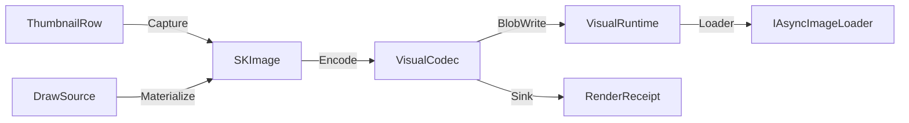

# [APPUI_VISUALS_OFFSCREEN]

Offscreen visuals are the package's raster rail: one DrawSource capsule projects every Skia canvas — host-leased or owned — through a Fin-railed Use, thumbnails and geometry previews materialize as SKImage through host-agnostic capture delegates, one codec surface encodes and decodes with content-hashed RenderReceipt evidence, and one SKDocument export surface delivers paged output to parameterized destinations. The page owns the draw capsule, the thumbnail and preview row families, the encode axis, the export spec with its destination union, and the RenderReceipt family the render-hash proof lanes consume. The package spine is SkiaSharp behind Avalonia.Skia leases, AsyncImageLoader display, and PanAndZoom preview navigation; HUD and viewport overlay drawing stays host-side.

## [1]-[INDEX]

| [INDEX] | [CLUSTER]          | [OWNS]                                                       |
| :-----: | :----------------- | :----------------------------------------------------------- |
|   [1]   | DRAW_CAPSULE       | Borrowed and owned Skia canvas projection on one Fin rail    |
|   [2]   | THUMBNAIL_PIPELINE | Host-agnostic capture rows, blob-backed cache, async display |
|   [3]   | PREVIEW_SURFACES   | Receipt-to-path preview rows, backplates, zoomable viewing   |
|   [4]   | ENCODE_IDENTITY    | Codec axis, content-hashed receipts, native asset identity   |
|   [5]   | DOCUMENT_EXPORT    | Paged SKDocument export to parameterized destinations        |

## [2]-[DRAW_CAPSULE]

- Owner: `DrawSource` [Union] · `Offscreen`
- Cases: Borrowed · Owned
- Entry: `public Fin<T> Use<T>(Func<SKCanvas, Fin<T>> draw)` — Fin rail
- Auto: in-tree visuals lease the live canvas through `ISkiaSharpApiLeaseFeature.Lease` at render scope and fold to Borrowed; offscreen pipelines construct Owned with the target `SKImageInfo` and Materialize a snapshot.
- Packages: SkiaSharp, Avalonia.Skia, Thinktecture.Runtime.Extensions, LanguageExt.Core
- Growth: one effect row extends the FX table, and the in-tree vehicle is one `ICustomDrawOperation` implementation — `Bounds`, `HitTest(Point)`, `Render(ImmediateDrawingContext)` with the canvas leased through `ISkiaSharpApiLeaseFeature.Lease()` folding to Borrowed — zero new surface.
- Boundary: `Offscreen` is the named boundary capsule — the using-scoped `SKSurface` create-and-dispose pair is the only place a Skia surface is owned; a Borrowed lease draws into the host's in-flight frame and never materializes, so Materialize folds that arm to the LeaseBound error row; transforms compose as `SKMatrix` values inside `Save`/`Restore` scopes and no mutated canvas state survives a projection.

```csharp signature
[Union(ConversionFromValue = ConversionOperatorsGeneration.None)]
public abstract partial record DrawSource {
    private DrawSource() { }
    public sealed record Borrowed(ISkiaSharpApiLease Lease) : DrawSource;
    public sealed record Owned(SKImageInfo Info) : DrawSource;

    public Fin<T> Use<T>(Func<SKCanvas, Fin<T>> draw) => Switch(
        state: draw,
        borrowed: static (paint, source) => paint(source.Lease.SkCanvas),
        owned: static (paint, source) => Offscreen.Rent(source.Info, paint));

    public Fin<SKImage> Materialize(Func<SKCanvas, Fin<Unit>> draw) => Switch(
        state: draw,
        borrowed: static (_, _) => Fin<SKImage>.Fail(Offscreen.LeaseBound),
        owned: static (paint, source) => Offscreen.Snapshot(source.Info, paint));
}

public static class Offscreen {
    public static readonly Error LeaseBound = Error.New("visuals/lease-bound: a borrowed host lease draws into the live frame and never materializes");

    public static Fin<T> Rent<T>(SKImageInfo info, Func<SKCanvas, Fin<T>> draw) {
        using SKSurface surface = SKSurface.Create(info);
        return draw(surface.Canvas);
    }

    public static Fin<SKImage> Snapshot(SKImageInfo info, Func<SKCanvas, Fin<Unit>> draw) {
        using SKSurface surface = SKSurface.Create(info);
        return draw(surface.Canvas).Map(_ => surface.Snapshot());
    }
}
```

| [INDEX] | [FX_ROW]       | [FACTORY]                      | [CONSUMER]                          |
| :-----: | :------------- | :----------------------------- | :---------------------------------- |
|   [1]   | runtime-shader | `SKRuntimeEffect.CreateShader` | animated backplates, gauge fills    |
|   [2]   | blur           | `SKImageFilter.CreateBlur`     | thumbnail elevation underlays       |
|   [3]   | dash           | `SKPathEffect.CreateDash`      | preview curve styling               |
|   [4]   | tint           | `SKColorFilter`                | classification and state recoloring |
|   [5]   | mask           | `SKMaskFilter`                 | preview edge fades                  |

## [3]-[THUMBNAIL_PIPELINE]

- Owner: `VisualRuntime` · `ThumbnailRow` · `Thumbnails`
- Entry: `public static IO<RenderReceipt> Refresh(VisualRuntime runtime, ThumbnailRow row, (double Scale, int PixelSize) variant)` — IO rail
- Auto: capture delegates discriminate on the host row — the rhino row rides `ViewCapture.CaptureToBitmap` through the Rasm.Rhino port, the gh2 row rides the Rasm.Grasshopper canvas-snapshot seam, and the empty host row materializes through `DrawSource.Owned`; display binds `AdvancedImage` to the runtime `Loader` with `FallbackImage` resolved from the row's placeholder and error keys; variant selection picks the table row whose Scale matches the mounted surface's scale fact.
- Receipt: every refresh lands one RenderReceipt of kind thumbnail carrying the blob artifact key as its destination.
- Packages: AsyncImageLoader.Avalonia, SkiaSharp, Rasm.Rhino (project), Rasm.Grasshopper (project), Rasm.AppHost (project), LanguageExt.Core, NodaTime
- Growth: one thumbnail row admits a new visual family; one variant row retunes scale and pixel policy values — zero new surface.
- Boundary: the memory cache is the `RamCachedWebImageLoader`-backed Loader and the durable cache is the blob lane behind the BlobWrite and BlobRead delegates — a second thumbnail cache is deleted; host bitmaps convert to `SKImage` exactly once at the port edge and no Eto or RhinoCommon bitmap type crosses into rows; the BundleWrite delegate is the support-contributor consequence and the Sink delegate is the receipt-sink envelope binding.

```csharp signature
public sealed record VisualRuntime(
    CorrelationId Correlation,
    ProfileRoots Roots,
    ClockPolicy Clocks,
    IAsyncImageLoader Loader,
    Func<string, ReadOnlyMemory<byte>, IO<string>> BlobWrite,
    Func<string, IO<ReadOnlyMemory<byte>>> BlobRead,
    Func<string, DataClassification, ReadOnlyMemory<byte>, IO<string>> BundleWrite,
    Func<ReadOnlyMemory<byte>, string> ContentHash,
    Func<RenderReceipt, IO<Unit>> Sink,
    Func<IO<Seq<NativeAssetFact>>> NativeIdentity);

public sealed record ThumbnailRow(
    string Key,
    string HostKind,
    Func<(double Scale, int PixelSize), IO<SKImage>> Capture,
    DataClassification Classification,
    string PlaceholderKey,
    string ErrorKey);

public static class Thumbnails {
    public static IO<RenderReceipt> Refresh(VisualRuntime runtime, ThumbnailRow row, (double Scale, int PixelSize) variant) =>
        from image in row.Capture(variant)
        from receipt in VisualCodec.Encode(runtime, image, VisualCodec.Png, "thumbnail", VariantKey(row, variant))
        select receipt;

    static string VariantKey(ThumbnailRow row, (double Scale, int PixelSize) variant) =>
        $"thumbnails/{row.Key}@{variant.Scale}x{variant.PixelSize}.png";
}
```



| [INDEX] | [VARIANT]      | [SCALE] | [PIXEL] |
| :-----: | :------------- | :------ | :------ |
|   [1]   | list           | 1.0     | 128     |
|   [2]   | list-retina    | 2.0     | 256     |
|   [3]   | gallery        | 1.0     | 256     |
|   [4]   | gallery-retina | 2.0     | 512     |

## [4]-[PREVIEW_SURFACES]

- Owner: `PreviewRow<TReceipt>`
- Entry: `public Fin<SKImage> Render(TReceipt receipt, SKImageInfo info)` — Fin rail
- Auto: zoomable previews mount inside `ZoomBorder` with `AutoFit` on load and `ZoomToRectangle` bound to the gesture rows; Underlay and Stroke delegates resolve once at row registration from the backplate table row and the paint-role key.
- Packages: SkiaSharp, PanAndZoom, LanguageExt.Core
- Growth: one preview row admits a new receipt family — geometry families from Compute mesh and curve receipt streams land as rows binding their Project folds; zero new surface.
- Boundary: Render is the named path-scope boundary capsule — the projected `SKPath` is using-scoped and never outlives the fold; HUD and viewport overlays stay host-side: Rhino and Grasshopper display conduits own all in-viewport drawing and AppUi never paints into a host viewport; TReceipt stays generic so no Compute receipt shape is re-modeled here.

```csharp signature
public sealed record PreviewRow<TReceipt>(
    string Key,
    Func<TReceipt, Fin<SKPath>> Project,
    string Backplate,
    string PaintRole,
    Func<SKCanvas, SKImageInfo, Fin<Unit>> Underlay,
    Func<SKCanvas, SKPath, Fin<Unit>> Stroke) {
    public Fin<SKImage> Render(TReceipt receipt, SKImageInfo info) =>
        Project(receipt).Bind(path => {
            using SKPath scoped = path;
            return new DrawSource.Owned(info).Materialize(canvas =>
                Underlay(canvas, info).Bind(_ => Stroke(canvas, scoped)));
        });
}
```

| [INDEX] | [BACKPLATE]  | [CELL] | [PAINT_ROLES]                     |
| :-----: | :----------- | :----- | :-------------------------------- |
|   [1]   | checkerboard | 8 px   | surface-check-a · surface-check-b |
|   [2]   | solid        | —      | surface                           |
|   [3]   | transparent  | —      | none                              |

## [5]-[ENCODE_IDENTITY]

- Owner: `RenderReceipt` · `NativeAssetFact` · `VisualCodec`
- Entry: `public static IO<RenderReceipt> Encode(VisualRuntime runtime, SKImage image, EncodeRow row, string kind, string key)` — IO rail
- Auto: the runtime NativeIdentity delegate is filled by the mount transaction's load-identity probe and yields one `NativeAssetFact` per loaded native (libSkiaSharp, libHarfBuzzSharp) with version, path, and RID; the evidence stream folds the facts with kind native-asset.
- Receipt: FrameHash is the whole-payload content hash through the runtime ContentHash delegate bound to the suite XxHash128 identity row; quality values are the encode-row axis values — lossless png at 100, perceptual jpeg and webp at 90.
- Packages: SkiaSharp, SkiaSharp.NativeAssets.macOS, SkiaSharp.NativeAssets.Win32, SkiaSharp.NativeAssets.Linux.NoDependencies, Rasm.AppHost (project), NodaTime, LanguageExt.Core
- Growth: one encode row admits a format; one policy value retunes quality — zero new surface.
- Boundary: Decode and Encode are the named native-disposal boundary capsules — the intermediate `SKBitmap`, the consumed `SKImage`, and the encoded `SKData` are using-scoped so a failing later clause never leaks a native handle, and Encode owns the image it consumes; per-format exporter classes are deleted with the encode rows as the absorbing axis; render-hash proof lanes compare FrameHash values rendered on Skia-backed headless rows where `UseHeadlessDrawing` false selects real Skia drawing.

```csharp signature
public sealed record RenderReceipt(
    string Kind,
    string Format,
    string FrameHash,
    long Bytes,
    Duration Elapsed,
    CorrelationId Correlation,
    Option<string> Destination);

public sealed record NativeAssetFact(string Library, string Version, string Path, string Rid);

public static class VisualCodec {
    public static readonly EncodeRow Png = new("png", SKEncodedImageFormat.Png, 100);
    public static readonly EncodeRow Jpeg = new("jpeg", SKEncodedImageFormat.Jpeg, 90);
    public static readonly EncodeRow Webp = new("webp", SKEncodedImageFormat.Webp, 90);

    public sealed record EncodeRow(string Key, SKEncodedImageFormat Format, int Quality);

    public static IO<SKImage> Decode(ReadOnlyMemory<byte> payload) =>
        IO.lift(() => {
            using SKBitmap bitmap = SKBitmap.Decode(payload.Span);
            return SKImage.FromBitmap(bitmap);
        });

    public static IO<RenderReceipt> Encode(VisualRuntime runtime, SKImage image, EncodeRow row, string kind, string key) =>
        from mark in IO.lift(runtime.Clocks.Mark)
        from bytes in IO.lift(() => {
            using SKImage scoped = image;
            using SKData encoded = scoped.Encode(row.Format, row.Quality);
            return encoded.ToArray();
        })
        from artifact in runtime.BlobWrite(key, bytes)
        from elapsed in IO.lift(() => runtime.Clocks.Elapsed(mark))
        let receipt = new RenderReceipt(kind, row.Key, runtime.ContentHash(bytes), bytes.LongLength, elapsed, runtime.Correlation, Optional(artifact))
        from _ in runtime.Sink(receipt)
        select receipt;
}
```

## [6]-[DOCUMENT_EXPORT]

- Owner: `VisualDestination` [Union] · `VisualExportSpec` · `VisualExport`
- Cases: FilePath · BlobLane · Bundle
- Entry: `public static IO<RenderReceipt> Export(VisualRuntime runtime, VisualExportSpec spec)` — IO rail
- Auto: the Bundle arm delivers visual artifacts through the runtime BundleWrite delegate with their classification — the support-contributor consequence; the FilePath arm receives its absolute path as a value from the picker intent and never computes paths; artifact scopes resolve from ProfileRoots.
- Receipt: one RenderReceipt of kind document per export with whole-payload content hash and the delivered destination key.
- Packages: SkiaSharp, SkiaSharp.HarfBuzz, Thinktecture.Runtime.Extensions, Rasm.AppHost (project), NodaTime, LanguageExt.Core
- Growth: one destination case extends delivery and breaks the Deliver dispatch at compile time; one page-size row extends the table; the content-to-page flow algorithm lands once its RESEARCH item clears — zero new surface.
- Boundary: Paged and Deliver are the named boundary capsules carrying statement bodies for SKDocument paging and byte delivery; `CreateXps` yields null where the Skia native carries no XPS backend, so the xps arm folds to the `XpsUnavailable` error row and pdf is the proven format on macOS and Linux profiles; pages arrive as precomposed draw folds over the DrawSource vocabulary — shaped text enters as the shaping rail's glyph output and chart snapshots enter as `SKImage` tiles; QuestPDF, ImageSharp, and Magick.NET stay deleted with `SKDocument` and the codec axis as the absorbing owners.

```csharp signature
[Union(ConversionFromValue = ConversionOperatorsGeneration.None)]
public abstract partial record VisualDestination {
    private VisualDestination() { }
    public sealed record FilePath(string AbsolutePath) : VisualDestination;
    public sealed record BlobLane(string ArtifactKey) : VisualDestination;
    public sealed record Bundle(string ArtifactName, DataClassification Classification) : VisualDestination;
}

public sealed record VisualExportSpec(
    string Format,
    float PageWidth,
    float PageHeight,
    Seq<Func<SKCanvas, Fin<Unit>>> Pages,
    VisualDestination Destination);

public static class VisualExport {
    public static readonly Error XpsUnavailable = Error.New("visuals/xps-unavailable: the loaded Skia native carries no XPS backend on this platform");

    public static IO<RenderReceipt> Export(VisualRuntime runtime, VisualExportSpec spec) =>
        from mark in IO.lift(runtime.Clocks.Mark)
        from payload in IO.lift(() => Paged(spec).ThrowIfFail())
        from destination in Deliver(runtime, spec.Destination, payload)
        from elapsed in IO.lift(() => runtime.Clocks.Elapsed(mark))
        let receipt = new RenderReceipt("document", spec.Format, runtime.ContentHash(payload), payload.LongLength, elapsed, runtime.Correlation, Optional(destination))
        from _ in runtime.Sink(receipt)
        select receipt;

    static Fin<byte[]> Paged(VisualExportSpec spec) {
        using MemoryStream sink = new();
        SKDocument? document = spec.Format == "xps" ? SKDocument.CreateXps(sink) : SKDocument.CreatePdf(sink);
        if (document is null) { return Fin.Fail<byte[]>(XpsUnavailable); }
        using SKDocument scoped = document;
        foreach (Func<SKCanvas, Fin<Unit>> page in spec.Pages) {
            page(scoped.BeginPage(spec.PageWidth, spec.PageHeight)).ThrowIfFail();
            scoped.EndPage();
        }
        scoped.Close();
        return sink.ToArray();
    }

    static IO<string> Deliver(VisualRuntime runtime, VisualDestination destination, byte[] payload) =>
        destination.Switch(
            state: (runtime, payload),
            filePath: static (ctx, file) => IO.lift(() => {
                File.WriteAllBytes(file.AbsolutePath, ctx.payload);
                return file.AbsolutePath;
            }),
            blobLane: static (ctx, blob) => ctx.runtime.BlobWrite(blob.ArtifactKey, ctx.payload),
            bundle: static (ctx, bundle) => ctx.runtime.BundleWrite(bundle.ArtifactName, bundle.Classification, ctx.payload));
}
```

| [INDEX] | [PAGE_ROW]       | [WIDTH_PT] | [HEIGHT_PT] |
| :-----: | :--------------- | :--------- | :---------- |
|   [1]   | a4-portrait      | 595        | 842         |
|   [2]   | a4-landscape     | 842        | 595         |
|   [3]   | letter-portrait  | 612        | 792         |
|   [4]   | letter-landscape | 792        | 612         |

## [7]-[RESEARCH]

- [PAGE_FLOW]: content-to-page flow layout model over `SKDocument` — flow folds, break policy, header and footer bands.
