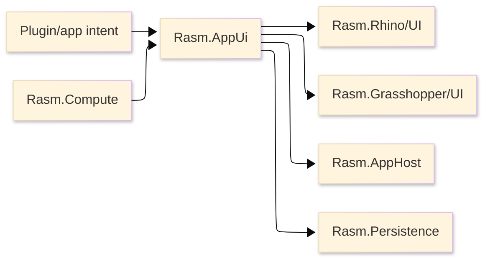

# [RASM_APPUI_ARCHITECTURE]

`Rasm.AppUi` is the product UI engine above `Rasm.Rhino/UI` and `Rasm.Grasshopper/UI`. It owns typed app intent, retained panels, screens, commands, live projections, charts, inspectors, theme, typography, icon assets, diagnostics, and UI receipts through one rail while host-native behavior stays in the Rhino and GH2 UI rails.

## [1]-[SYSTEM_SCOPE]



Text equivalent: product and plugin intent enters `Rasm.AppUi`; AppUi composes retained UI state and delegates host behavior to `Rasm.Rhino/UI` and `Rasm.Grasshopper/UI`; runtime scheduling, durable state, and compute progress flow through `Rasm.AppHost`, `Rasm.Persistence`, and `Rasm.Compute`.

| [INDEX] | [ITEM]                | [STATE]                                                 |
| :-----: | --------------------- | ------------------------------------------------------- |
|   [1]   | Folder                | Active build                                            |
|   [2]   | `.csproj`             | Present in `Workspace.slnx`                             |
|   [3]   | Production C#         | Source rails pending                                    |
|   [4]   | Package references    | Active direct; every pinned AppUi package is referenced |
|   [5]   | Host runtime evidence | Owner-local scenario receipts                           |

## [2]-[PUBLIC_RAIL_CONTRACT]

| [INDEX] | [CONCEPT]             | [OWNS]                                                                 | [DOES_NOT_OWN]                   |
| :-----: | --------------------- | ---------------------------------------------------------------------- | -------------------------------- |
|   [1]   | Shell                 | Product shell state, route, nav stack, visibility, mode                | Native window parenting          |
|   [2]   | Screen                | View identity, activation, validation, command availability            | Toolkit ViewModel public surface |
|   [3]   | Command               | User action intent, `CanExecute`, execution receipt                    | Rhino/GH2 undo mutation          |
|   [4]   | Input                 | Keyboard, pointer, drag-drop, clipboard intent                         | Global static input hooks        |
|   [5]   | Live View             | Read-only UI projection from AppHost/Persistence/Compute streams       | DynamicData public exposure      |
|   [6]   | Visual Request        | HUD, preview, overlay, thumbnail, and scene-mark intent                 | Toolkit-owned viewport drawing   |
|   [7]   | Chart / Dashboard     | Retained data-viz panels, axes, series, legends, interaction           | Viewport overlay rendering       |
|   [8]   | Table / Tree          | Flat tables, hierarchical tables, row selection, sort/filter state      | Persistence query ownership      |
|   [9]   | Inspector             | Object/property inspection, typed editors, validation, palette editing | Ad hoc property editors          |
|  [10]   | Theme                 | Control themes, resource tokens, dark/light/high-contrast variants     | Host application theme ownership |
|  [11]   | Typography            | Font roles, fallback chain, numeric/code/log text policy               | Single-font UI policy            |
|  [12]   | Icon / Asset Catalog  | Path icons, SVG assets, provider-generated catalogs, custom assets     | Provider-branded public API      |
|  [13]   | Dialog / Notification | In-panel modal, confirmation, toast, progress, support prompt surfaces | Independent `NSWindow` dialogs   |
|  [14]   | Accessibility         | Automation names, help text, peers, keyboard reachability              | Platform accessibility runtime   |
|  [15]   | Diagnostic Receipt    | UI lifecycle, focus, scale, disposal, screenshot, support evidence     | Generic receipt ledger           |

The public entry accepts typed app-surface operations as data and returns typed outcomes/receipts. Avalonia, ReactiveUI, DynamicData, SkiaSharp, and package-specific types stay internal unless a host API requires them at the boundary.

## [3]-[HOST_DELEGATION]

| [INDEX] | [APPUI_INTENT] | [RHINO_RAIL]                                     | [GH2_RAIL]                         | [FORBIDDEN_DUPLICATE]       |
| :-----: | -------------- | ------------------------------------------------ | ---------------------------------- | --------------------------- |
|   [1]   | Window/shell   | `RhinoUi.Use`, `UiIntent.Window`, `UiWindowSpec` | Editor/canvas rails as applicable  | New parent-window resolver  |
|   [2]   | Panel          | `PanelOp`                                        | GH2 editor surface rail            | Parallel panel registry     |
|   [3]   | Repaint        | `RedrawTarget`, Rhino UI paint rails             | `RepaintRequest`, paint hook rails | Manual redraw scheduler     |
|   [4]   | Host scope     | Rhino document scope                             | GH2 document/canvas scope          | Global static UI context    |
|   [5]   | Visuals        | `UiHud`, `UiCanvas`, marks/surfaces              | `DrawPlan`, `PaintScope`           | Toolkit-first host renderer |
|   [6]   | Undo/redo      | Host undo state and mutation rail                | GH2 document mutation rail         | AppUi undo stack            |
|   [7]   | Lifecycle      | Host rail disposal receipts                      | Subscription and hook disposal     | AppUi-owned host teardown   |

macOS support means coexistence inside RhinoWIP/GH2, not generic desktop success.

> [!CAUTION]
> Avalonia owns panel, dialog, and companion-window surfaces only. It never renders over the native viewport: native content composites above Avalonia, so HUDs and marks over the 3D scene render through the Rhino/GH display conduit only. AppUi SkiaSharp is thumbnails, retained charts, SVG assets, and offscreen draw only; viewport-overlay SkiaSharp lives in the Rhino/GH display conduit.

> [!CAUTION]
> Embedding rules:
- `MacOSPlatformOptions.DisableAvaloniaAppDelegate = true` is set before any Avalonia surface initializes.
- `CreateEmbeddableTopLevel()` is the retained-panel entry; `CreateEmbeddableWindow()` is not used on macOS.
- TFM is plain `net10.0`; NSView reparenting is an isolated P/Invoke shim over Avalonia `TryGetPlatformHandle()` and the Eto native handle.
- Software rendering validates embedding before the Metal path.
- Avalonia embeds as a child NSView inside the host `RasmPanel`; independent `NSWindow` surfaces are not AppUi primitives.
- `PanelHidden` resigns first responder and detaches Avalonia content before Eto disposal.
- `PanelShown` restores content and first responder.
- `NSWindowDidChangeBackingProperties` and `WhenActivated` refresh Retina scale.
- `TopLevel.Closed` completes before base dispose.
- GH2-Avalonia retained embedding starts only after a GH2 dockable panel-host API exists and the GH2 UI rail owns the host extension. Until then, GH2 surfaces are component input panels, toolbars, canvas paint hooks, and transient popups.

## [4]-[PACKAGE_MATRIX]

Version pins live in `Directory.Packages.props`; project references stay versionless. The AppUi package graph is one coupled runtime matrix, not independent package experiments.

| [INDEX] | [PACKAGE]                               | [ROLE]                                                                                             |
| :-----: | --------------------------------------- | -------------------------------------------------------------------------------------------------- |
|   [1]   | Host Eto / Rhino.UI assemblies          | Host shell, parent, modal, panel, focus, and native handle truth                                   |
|   [2]   | `Avalonia`                              | Retained app UI surface                                                                            |
|   [3]   | `Avalonia.Desktop`                      | macOS backend and embeddable top-level support                                                     |
|   [4]   | `Avalonia.Themes.Fluent`                | Official base theme and control-template root                                                      |
|   [5]   | `Avalonia.Fonts.Inter`                  | Bundled UI text face and initial default font collection                                           |
|   [6]   | `Avalonia.Controls.DataGrid`            | Flat tabular surfaces                                                                              |
|   [7]   | `Avalonia.Controls.TreeDataGrid`        | Hierarchical/tabular tree surfaces                                                                 |
|   [8]   | `Avalonia.Controls.ColorPicker`         | Color picker, palette, swatch, and material/color-editing surfaces                                 |
|   [9]   | `ReactiveUI`                            | ViewModel activation, commands, observable state, scheduler boundaries                             |
|  [10]   | `ReactiveUI.Avalonia`                   | ReactiveUI/Avalonia adapter                                                                        |
|  [11]   | `ReactiveUI.Validation`                 | Screen validation surface                                                                          |
|  [12]   | `System.Reactive`                       | Observable contracts and scheduler primitives                                                      |
|  [13]   | `DynamicData`                           | Internal live collection projection and change-set folding                                         |
|  [14]   | `SkiaSharp`                             | Thumbnails, retained charts, SVG asset rendering, and offscreen draw                               |
|  [15]   | `SkiaSharp.NativeAssets.macOS`          | Explicit macOS native package with native assets excluded when sharing the Rhino-compatible native |
|  [16]   | `SkiaSharp.HarfBuzz`                    | Text shaping over SkiaSharp                                                                        |
|  [17]   | `HarfBuzzSharp.NativeAssets.macOS`      | HarfBuzz native macOS asset                                                                        |
|  [18]   | `LiveChartsCore.SkiaSharpView.Avalonia` | Retained charts, dashboards, gauges, axes, legends, and chart interaction                          |
|  [19]   | `Svg.Controls.Skia.Avalonia`            | SVG asset rendering for retained panels and generated asset catalogs                               |
|  [20]   | `bodong.Avalonia.PropertyGrid`          | Integrated inspector/property-grid surface                                                         |
|  [21]   | `Xaml.Behaviors.Avalonia`               | Event triggers, key bindings, drag-drop, and behavior composition                                  |
|  [22]   | `DialogHost.Avalonia`                   | In-panel dialogs, confirmations, toasts, and transient prompts                                     |

### [4.1]-[REJECTED_PACKAGES]

| [INDEX] | [REJECTED_PACKAGE]                         | [REASON]                                                                                  |
| :-----: | ------------------------------------------ | ----------------------------------------------------------------------------------------- |
|   [1]   | `FluentAvaloniaUI`                         | Parallel control/theme suite; AppUi uses official Fluent theme plus owner-local controls   |
|   [2]   | `FluentIcons.Avalonia.Fluent`              | Pulls a parallel FluentAvaloniaUI/Avalonia 11/SkiaSharp 2.x graph                         |
|   [3]   | `Projektanker.Icons.Avalonia.MaterialDesign` | Material Design provider locks the icon identity to a non-native tooling aesthetic      |
|   [4]   | `Material.Icons.Avalonia`                  | Material Design provider; AppUi icon identity is path/SVG catalog first                   |
|   [5]   | `Material.Avalonia`                        | Full-theme takeover; conflicts with AppUi theme tokens and control-theme ownership        |
|   [6]   | `Dock.Avalonia`                            | Docking/floating-window owner conflicts with host-panel embedding                         |
|   [7]   | `ScottPlot.Avalonia`                       | Second retained chart stack; LiveCharts2 owns charts                                      |
|   [8]   | `MessageBox.Avalonia`                      | Window-style dialog owner; DialogHost owns in-panel dialogs                               |
|   [9]   | `Avalonia.Xaml.Interactions`               | Replaced by `Xaml.Behaviors.Avalonia`                                                     |

### [4.2]-[NATIVE_HAZARD]

> [!CAUTION]
> SkiaSharp-native coexistence is a host-load boundary. AppUi uses the Avalonia/LiveCharts/SVG SkiaSharp matrix and either shares a host-compatible native major with `<ExcludeAssets>native</ExcludeAssets>` or moves Skia rendering out of the in-process host path. `HarfBuzzSharp.NativeAssets.macOS` is carried independently for text shaping.

## [5]-[RAIL_OWNERS]

Layout is cohesive flat files: `Shell.cs`, `Screen.cs`, `Command.cs`, `Live.cs`, `Visual.cs`, `Chart.cs`, `Inspector.cs`, `Theme.cs`, `Typography.cs`, `Assets.cs`, and `Diagnostic.cs`. Each file is a deep owner block with canonical sections; no per-concept subfolders or package-wrapper files.

| [INDEX] | [FILE]          | [OWNER]                                                                                       |
| :-----: | --------------- | --------------------------------------------------------------------------------------------- |
|   [1]   | `Shell.cs`      | Route identity, navigation stack, shell mode, visibility, panel/screen composition             |
|   [2]   | `Screen.cs`     | ReactiveUI activation, validation, scheduler-bound binding, screen model projection            |
|   [3]   | `Command.cs`    | Command identity, `CanExecute`, execution, receipts, host lowering                             |
|   [4]   | `Live.cs`       | DynamicData-backed live projections and read-only snapshots                                    |
|   [5]   | `Visual.cs`     | Visual request algebra for thumbnails, previews, HUD intent, overlays, and offscreen graphics  |
|   [6]   | `Chart.cs`      | LiveCharts2 dashboards, gauges, axes, legends, chart interaction, scheduler-bound updates      |
|   [7]   | `Inspector.cs`  | Property grid, typed editors, validation slots, table/tree inspection surfaces                 |
|   [8]   | `Theme.cs`      | Fluent theme root, control themes, token catalog, host dark/light/high-contrast variants       |
|   [9]   | `Typography.cs` | Font roles, embedded font collections, fallback mappings, numeric/code/log text policy         |
|  [10]   | `Assets.cs`     | Path icon catalog, SVG asset catalog, provider-generated resources, custom asset registry      |
|  [11]   | `Diagnostic.cs` | UI lifecycle, host embedding, focus/scale/disposal/screenshot/support receipts                 |

## [6]-[TYPE_SHAPES]

### [6.1]-[SCHEDULER]

`RasmUiScheduler` is a sealed record that unifies Avalonia `Dispatcher`, ReactiveUI `RxApp.MainThreadScheduler`, and host-thread affinity. It is constructed once on the UI thread in `PlugIn.OnLoad` before live-projection work and passed into `AppHost.Boot(token, timeProvider, uiScheduler, ...)`.

```text conceptual
RasmUiScheduler
  Dispatcher   : Avalonia.Threading.Dispatcher
  RxScheduler  : IScheduler
```

### [6.2]-[SHELL]

`Shell` owns product UI route identity, navigation, panel composition, visibility, and mode. `AppState` is a durable-state snapshot owned by `Rasm.Persistence`; `Shell` is the retained UI state owner.

```text conceptual
Shell
  Route        : RouteId
  NavStack     : ImmutableStack<RouteId>
  Mode         : ShellMode
  Visibility   : ShellVisibility
  Panels       : ImmutableList<PanelSlot>
```

### [6.3]-[SCREEN]

`Screen<T>` is a `ReactiveValidationObject`; `T` is the domain model slice the screen projects. Toolkit base classes stay internal.

```text conceptual
Screen<T>
  ViewId       : ScreenId
  Model        : T
  Commands     : IReadOnlyList<Command>
  Validation   : ValidationContext
  Activator    : ViewModelActivator
```

### [6.4]-[COMMAND_AND_RECEIPT]

```text conceptual
Command
  Id           : CommandId
  Label        : string
  Icon         : IconKey
  CanExecute   : IObservable<bool>
  Execute      : ReactiveCommand<Unit, CommandReceipt>

CommandReceipt
  CommandId    : CommandId
  Outcome      : CommandOutcome
  HostDelegated: bool
  Elapsed      : TimeSpan
```

### [6.5]-[LIVE_VIEW]

`LiveView<T>` is DynamicData-backed. It exposes snapshots and selection-ready projections, never `SourceCache` or mutable change-set owners.

```text conceptual
LiveView<T>
  Items        : IObservable<IChangeSet<T, Guid>>
  Snapshot     : IObservable<IReadOnlyList<T>>
  Selection    : IObservable<SelectionState<Guid>>
```

### [6.6]-[CHART_DASHBOARD]

```text conceptual
ChartVm
  Series       : ObservableCollection<ISeries>
  Axes         : ObservableCollection<IAxis>
  Legend       : LegendPosition
  Interaction  : ChartInteraction
  UpdateOn     : RasmUiScheduler
```

### [6.7]-[INSPECTOR]

`Inspector<T>` owns property-grid binding, typed editor selection, table/tree details, validation projection, and command routing for editable object surfaces.

```text conceptual
Inspector<T>
  Subject      : T
  Editors      : IReadOnlyList<EditorSlot>
  Grid         : PropertyGridSurface
  Details      : TableTreeSurface
  Validation   : ValidationContext
```

### [6.8]-[THEME]

`ThemeRail` owns official Fluent theme installation, control-theme selection, token dictionaries, host dark/light synchronization, high-contrast variant, chart palette, icon stroke/fill policy, and viewport-overlay color tokens.

```text conceptual
ThemeRail
  Variant      : ThemeVariant
  Tokens       : ThemeTokenCatalog
  Controls     : ControlThemeCatalog
  ChartPalette : ChartPalette
  HostSync     : IObservable<HostThemeState>
```

### [6.9]-[TYPOGRAPHY]

`TypographyRail` owns font roles instead of a single font. Avalonia `ConfigureFonts` installs embedded font collections; `FontManagerOptions` defines fallback mappings; HarfBuzz shapes custom Skia text.

```text conceptual
TypographyRail
  Ui           : FontRole
  Numeric      : FontRole
  Code         : FontRole
  Log          : FontRole
  Chart        : FontRole
  Fallbacks    : IReadOnlyList<FontFallbackSlot>
```

Font roles:

| [INDEX] | [ROLE]  | [USE]                                                       |
| :-----: | ------- | ----------------------------------------------------------- |
|   [1]   | UI      | Labels, panels, menus, inspectors, dialogs                  |
|   [2]   | Numeric | Coordinates, dimensions, counts, measurements, chart ticks  |
|   [3]   | Code    | Expressions, formulas, serialized snippets, identifiers     |
|   [4]   | Log     | Diagnostics, support bundle previews, receipts              |
|   [5]   | Chart   | Axis labels, legends, annotations, compact dashboard text    |

### [6.10]-[ASSET_CATALOG]

`AssetCatalog` is path/SVG first. Providers generate or register path resources; product code consumes `IconKey`, `AssetKey`, and theme-aware vector resources.

```text conceptual
AssetCatalog
  Icons        : IReadOnlyDictionary<IconKey, IconGlyph>
  SvgAssets    : IReadOnlyDictionary<AssetKey, SvgAsset>
  CustomAssets : IReadOnlyDictionary<AssetKey, BinaryAsset>
  ThemeMap     : IReadOnlyDictionary<AssetKey, ThemeToken>
```

Provider order:

| [INDEX] | [PROVIDER]             | [USE]                                                                  |
| :-----: | ---------------------- | ---------------------------------------------------------------------- |
|   [1]   | Fluent UI System Icons | Primary professional tooling glyph language                            |
|   [2]   | Lucide                 | Secondary clean outline set for neutral tool actions                   |
|   [3]   | Phosphor               | Rich weight set for expressive states, fills, and status variants      |
|   [4]   | Tabler                 | Broad technical/tooling coverage                                       |
|   [5]   | Custom AppUi assets    | Geometry, graph, parameter, host, and product-specific glyphs          |

### [6.11]-[DIAGNOSTIC_RECEIPT]

`DiagnosticReceipt` is AppUi-owned; AppHost may correlate it but does not define it.

```text conceptual
DiagnosticReceipt
  PanelId        : PanelId
  Event          : DiagnosticEvent
  Timestamp      : NodaTime.Instant
  ParentHandle   : nint
  Scale          : double
  ScreenshotPath : string?
  Fault          : string?
```

## [7]-[COMPOSITION]

`PlugIn.OnLoad` is the composition root. It constructs `RasmUiScheduler` on the UI thread, calls `AppHost.Boot(token, timeProvider, uiScheduler, ...capabilities)`, receives `BootReceipt`, and hands `RasmRuntime` to AppUi to activate inbound observables.

Inbound contracts are typed and scheduler-bound:

| [INDEX] | [INBOUND]  | [SOURCE OWNER]     | [CONTRACT]                                                                                       |
| :-----: | ---------- | ------------------ | ------------------------------------------------------------------------------------------------ |
|   [1]   | Live state | `Rasm.Persistence` | `IObservable<AppState>` observed on `RasmUiScheduler.RxScheduler` before binding                 |
|   [2]   | Scheduling | `Rasm.AppHost`     | Background/runtime work dispatched via `RasmRuntime`; UI results marshal onto `RasmUiScheduler`  |
|   [3]   | Progress   | `Rasm.Compute`     | `IObservable<ComputeProgress>` observed on `RasmUiScheduler.RxScheduler`; faults surface as data |

View layer uses ReactiveUI (`ReactiveCommand`, `IObservable<T>`, activation, validation). Cross-folder work runs as `Eff<RT, T>` inside AppHost's runtime record. AppUi submits intents and consumes typed receipts and observables; it does not carry `Eff` directly.

## [8]-[CAPABILITY_MATRIX]

| [INDEX] | [CAPABILITY]                | [MECHANISM]                                                                                           |
| :-----: | --------------------------- | ----------------------------------------------------------------------------------------------------- |
|   [1]   | Retained panel shell        | Avalonia embeddable top level inside host `RasmPanel`                                                 |
|   [2]   | Multi-screen navigation     | `Shell` route + nav stack + ReactiveUI activation                                                     |
|   [3]   | Command palette             | `Command` catalog + path icons + key-binding behaviors                                                |
|   [4]   | Keyboard shortcuts          | `Xaml.Behaviors.Avalonia` scoped per `Screen`                                                         |
|   [5]   | Live dashboards             | LiveCharts2 series observed on `RasmUiScheduler`                                                      |
|   [6]   | Tables                      | `Avalonia.Controls.DataGrid`                                                                          |
|   [7]   | Hierarchical tables         | `Avalonia.Controls.TreeDataGrid`                                                                      |
|   [8]   | Inspectors                  | `bodong.Avalonia.PropertyGrid` integrated through `Inspector<T>`                                      |
|   [9]   | Settings / preferences      | `Screen<PreferencesModel>` + inspector/editor slots + Persistence store operation                     |
|  [10]   | Notifications / toasts      | `DialogHost.Avalonia` in-panel transient host                                                         |
|  [11]   | Dialogs / confirmations     | `DialogHost.Avalonia` in-panel modal host                                                             |
|  [12]   | Color and palette editing   | `Avalonia.Controls.ColorPicker` + theme token updates                                                 |
|  [13]   | Thumbnail/offscreen visuals | SkiaSharp surfaces owned by `Visual.cs`                                                               |
|  [14]   | SVG/vector assets           | `Svg.Controls.Skia.Avalonia` + path/SVG catalog                                                       |
|  [15]   | Viewport overlays           | Delegated to Rhino/GH display conduit through `VisualRequest`                                         |
|  [16]   | Undo-redo surfacing         | Host undo availability observed through host rails and surfaced through `Command.CanExecute`          |
|  [17]   | Drag-drop                   | Avalonia drag-drop + behaviors, routed through Eto for host-panel drops                               |
|  [18]   | Clipboard                   | Avalonia `IClipboard` injected into `Screen`                                                          |
|  [19]   | Theme variants              | Official Fluent theme + AppUi token/control-theme rail + host dark/light/high-contrast synchronization |
|  [20]   | Typography                  | Font roles, embedded font collections, fallback mappings, HarfBuzz shaping                            |
|  [21]   | Accessibility               | `AutomationProperties.Name/HelpText`, keyboard reachability, custom `AutomationPeer` surfaces         |
|  [22]   | Support diagnostics         | `DiagnosticReceipt` + screenshot/support artifact path                                                |

## [9]-[RUNTIME_EVIDENCE]

| [INDEX] | [STATE]        | [MEANING]                                    |
| :-----: | -------------- | -------------------------------------------- |
|   [1]   | Loaded         | Host process loads package/native assets     |
|   [2]   | Runtime-Proven | Owner receipt records host scenario evidence |

Evidence categories: RhinoWIP macOS load, GH2 coexistence where a host surface exists, host parent identity, focus/keyboard/z-order, Retina scale, native asset layout, GPU/frame-pacing coexistence with the viewport, retained-panel screenshot, viewport-overlay screenshot, disposal/unload, accessibility, and support-bundle diagnostics.

Test layers:

| [INDEX] | [LAYER]                  | [PROOF]                                                                 |
| :-----: | ------------------------ | ----------------------------------------------------------------------- |
|   [1]   | Pure managed specs       | Rail algebra, receipts, validation, theme tokens, typography roles      |
|   [2]   | Avalonia headless specs  | Templates, bindings, commands, control themes, automation properties    |
|   [3]   | Rhino runtime scenarios  | Panel load, NSView parent, focus, scale, screenshot, disposal           |
|   [4]   | GH2 runtime scenarios    | Canvas hooks, popups, toolbar actions, component panels, overlay routing |
|   [5]   | Visual captures          | Retained panels and viewport overlays captured separately               |

## [10]-[FRAMEWORK_REFERENCES]

| [INDEX] | [REFERENCE]                                                                                        | [USE]                                                   |
| :-----: | -------------------------------------------------------------------------------------------------- | ------------------------------------------------------- |
|   [1]   | [Avalonia macOS](https://docs.avaloniaui.net/docs/platform-specific-guides/macos)                  | macOS backend, native views, host-specific behavior     |
|   [2]   | [Avalonia native interop](https://docs.avaloniaui.net/docs/app-development/native-interop)         | Native handle and platform interop                      |
|   [3]   | [Avalonia embeddable TopLevel](https://docs.avaloniaui.net/docs/app-development/embedded-controls) | `CreateEmbeddableTopLevel()` API                        |
|   [4]   | [Avalonia themes](https://docs.avaloniaui.net/docs/styling/themes)                                 | Official Fluent theme and theme installation            |
|   [5]   | [Avalonia theme variants](https://docs.avaloniaui.net/docs/styling/theme-variants)                 | Dark/light/high-contrast variant flow                   |
|   [6]   | [Avalonia control themes](https://docs.avaloniaui.net/docs/styling/control-themes)                 | Replaceable control-level themes                        |
|   [7]   | [Avalonia icons](https://docs.avaloniaui.net/docs/graphics-animation/adding-icons)                 | Image, icon-font, and path-icon choices                 |
|   [8]   | [Avalonia PathIcon](https://docs.avaloniaui.net/controls/media/pathicon)                           | Recolorable vector icon rendering                       |
|   [9]   | [Avalonia custom fonts](https://docs.avaloniaui.net/docs/styling/custom-fonts)                     | Embedded font collections                               |
|  [10]   | [Avalonia FontManagerOptions](https://docs.avaloniaui.net/api/avalonia/media/fontmanageroptions)   | Default font and fallback mapping                       |
|  [11]   | [Avalonia TreeDataGrid](https://docs.avaloniaui.net/controls/data-display/structured-data/treedatagrid/) | Hierarchical and tabular data surface              |
|  [12]   | [ReactiveUI activation](https://www.reactiveui.net/documentation/handbook/when-activated/)         | Activation/disposal and scheduler                       |
|  [13]   | [DynamicData collections](https://www.reactiveui.net/docs/handbook/collections.html)               | Live projection and UI-scheduler binding                |
|  [14]   | [LiveCharts2 Avalonia](https://www.nuget.org/packages/LiveChartsCore.SkiaSharpView.Avalonia/)      | Charts and dashboards on SkiaSharp                      |
|  [15]   | [DialogHost.Avalonia](https://www.nuget.org/packages/DialogHost.Avalonia/)                         | In-panel dialogs and prompts                            |
