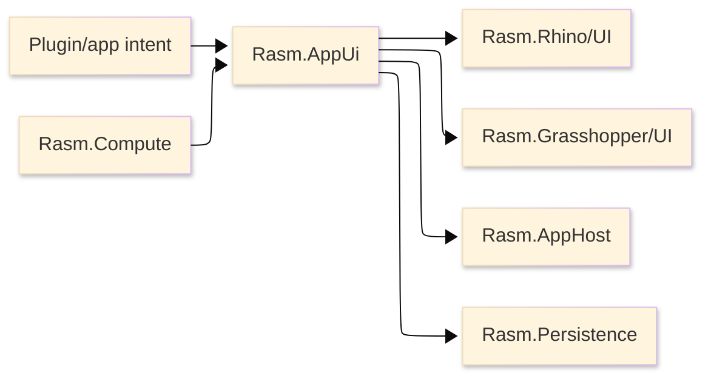

# [RASM_APPUI_ARCHITECTURE]

`Rasm.AppUi` is the product UI engine above `Rasm.Rhino/UI` and `Rasm.Grasshopper/UI`. It owns typed app intent, retained panels, screens, commands, live projections, charts, inspectors, theme, typography, assets, diagnostics, and UI lifecycle evidence through one rail while host-native behavior stays in the Rhino and GH2 UI rails.

## [1]-[SYSTEM_SCOPE]

Text equivalent: product and plugin intent enters AppUi; AppUi composes retained UI state and delegates host behavior to `Rasm.Rhino/UI` and `Rasm.Grasshopper/UI`; runtime scheduling, durable state, and compute progress flow through AppHost, Persistence, and Compute.

| [INDEX] | [ITEM]                | [STATE]                                                                  |
| :-----: | --------------------- | ------------------------------------------------------------------------ |
|   [1]   | Folder                | Active package setup                                                     |
|   [2]   | `.csproj`             | Present in `Workspace.slnx`                                              |
|   [3]   | Production C#         | Unified UI rail contract defined                                         |
|   [4]   | Package references    | Active direct, inherited global, closure, and rejected states classified |
|   [5]   | Host runtime evidence | Owner-local scenario receipts required                                   |

## [2]-[PUBLIC_RAIL_CONTRACT]

| [INDEX] | [CONCEPT]             | [OWNS]                                                                 | [DOES_NOT_OWN]                   |
| :-----: | --------------------- | ---------------------------------------------------------------------- | -------------------------------- |
|   [1]   | Shell                 | Product shell, companion shell, sidecar shell, route, nav stack, visibility, mode | Native window parenting          |
|   [2]   | Screen                | View identity, activation, validation, command availability            | Toolkit ViewModel public surface |
|   [3]   | Command               | User action intent, availability, execution receipt                    | Rhino/GH2 undo mutation          |
|   [4]   | Input                 | Keyboard, pointer, drag-drop, clipboard intent                         | Global static input hooks        |
|   [5]   | Live View             | Read-only UI projection from AppHost/Persistence/Compute streams       | DynamicData public exposure      |
|   [6]   | Visual Request        | HUD, preview, overlay, thumbnail, and scene-mark intent                | Toolkit-owned viewport drawing   |
|   [7]   | Chart / Dashboard     | Retained data-viz panels, axes, series, legends, interaction           | Viewport overlay rendering       |
|   [8]   | Table / Hierarchy     | Flat tables, hierarchical tables, row selection, sort/filter state     | Persistence query ownership      |
|   [9]   | Inspector             | Object/property inspection, typed editors, validation, palette editing | Ad hoc property editors          |
|  [10]   | Theme                 | Control themes, resource tokens, dark/light/high-contrast variants     | Host application theme ownership |
|  [11]   | Typography            | Font roles, fallback chain, numeric/code/log text policy               | Single-font UI policy            |
|  [12]   | Icon / Asset Catalog  | Path icons, SVG assets, provider-generated catalogs, custom assets     | Provider-branded public API      |
|  [13]   | Dialog / Notification | In-panel modal, confirmation, toast, progress, support prompt surfaces | Independent `NSWindow` dialogs   |
|  [14]   | Accessibility         | Automation names, help text, peers, keyboard reachability              | Platform accessibility runtime   |
|  [15]   | Diagnostic Evidence   | UI lifecycle, focus, scale, disposal, screenshot, support evidence     | Generic receipt ledger           |

The public entry accepts typed app-surface operations as data and returns typed outcomes/receipts. Avalonia, ReactiveUI, DynamicData, SkiaSharp, and package-specific types stay internal unless a host API requires them at the boundary.

## [3]-[HOST_DELEGATION]

Host delegation maps retained AppUi intent to the native rail that performs the host operation.

| [INDEX] | [APPUI_INTENT] | [RHINO_RAIL]           | [GH2_RAIL]             | [REJECT]        |
| :-----: | -------------- | ---------------------- | ---------------------- | --------------- |
|   [1]   | Window/shell   | window spec and parent | canvas chrome intent   | parent resolver |
|   [2]   | Panel          | panel operation        | event and chrome slots | panel registry  |
|   [3]   | Repaint        | redraw target          | repaint request        | redraw schedule |
|   [4]   | Host scope     | document scope         | document/canvas scope  | static context  |
|   [5]   | Visuals        | HUD and canvas marks   | canvas paint hooks     | toolkit render  |
|   [6]   | Undo/redo      | undo and mutation rail | document mutation rail | AppUi stack     |
|   [7]   | Lifecycle      | disposal receipts      | subscription disposal  | host teardown   |

Rhino rail examples include `RhinoUi.Use`, `UiIntent.Window`, `UiWindowSpec`, `PanelOp`, `RedrawTarget`, `UiHud`, and `UiCanvas`. GH2 rail examples include `GhUi.Canvas`, `GhUi.CanvasChrome`, `GhUi.Event`, `GrasshopperUiIntent`, `RepaintRequest`, and `Paint.Hook`.

macOS support means coexistence inside RhinoWIP/GH2, not generic desktop success.

> [!CAUTION]
> Avalonia owns retained panels, dialogs, companion windows, and sidecar shells. It never renders over the native viewport: native content composites above Avalonia, so HUDs and marks over the 3D scene render through the Rhino/GH display conduit only. AppUi SkiaSharp is thumbnails, retained charts, SVG assets, custom visuals, and offscreen draw only; viewport-overlay SkiaSharp lives in the Rhino/GH display conduit.

> [!CAUTION]
> Embedding rules:
- `MacOSPlatformOptions.DisableAvaloniaAppDelegate = true` is set before any Avalonia surface initializes.
- `CreateEmbeddableTopLevel()` is the retained-panel entry; `CreateEmbeddableWindow()` is not used on macOS.
- TFM is plain `net10.0`; NSView reparenting is isolated over Avalonia platform handles and the Eto native handle.
- Software rendering validates embedding before the Metal path.
- Avalonia embeds as a child NSView inside the host panel; independent `NSWindow` surfaces are not AppUi primitives.
- Hidden panels resign first responder and detach Avalonia content before Eto disposal.
- Shown panels restore content and first responder.
- Backing-property and activation events refresh Retina scale.
- Retained surface closed/disposed events complete before host panel disposal.
- GH2 retained UI uses existing GH2 canvas, popup, toolbar, component-panel, and overlay surfaces through `GhUi.Canvas`, `GhUi.CanvasChrome`, `GhUi.Event`, `GrasshopperUiIntent`, `RepaintRequest`, and `Paint.Hook`. A GH2 dockable retained-panel host is implemented as one host adapter over the same shell/screen/command/live/theme/asset rail.

## [4]-[PACKAGE_MATRIX]

Version pins live in `Directory.Packages.props`; project references stay versionless. The AppUi package graph is one coupled runtime matrix, not independent package experiments.

| [INDEX] | [PACKAGE]                               | [ROLE]                                                                               |
| :-----: | --------------------------------------- | ------------------------------------------------------------------------------------ |
|   [1]   | Host Eto / Rhino.UI assemblies          | Host shell, parent, modal, panel, focus, and native handle truth                     |
|   [2]   | `Avalonia`                              | Retained app UI surface                                                              |
|   [3]   | `Avalonia.Desktop`                      | macOS backend and embeddable top-level support                                       |
|   [4]   | `Avalonia.Themes.Fluent`                | Official base theme and control-template root                                        |
|   [5]   | `Avalonia.Fonts.Inter`                  | Bundled UI text face and initial default font collection                             |
|   [6]   | `Avalonia.Controls.DataGrid`            | Flat tables and AppUi-owned hierarchical row projections on OSS rails                |
|   [7]   | `Avalonia.Controls.ColorPicker`         | Color picker, palette, swatch, and material/color-editing surfaces                   |
|   [8]   | `ReactiveUI`                            | ViewModel activation, commands, observable state, scheduler boundaries               |
|   [9]   | `ReactiveUI.Avalonia`                   | ReactiveUI/Avalonia adapter selected for the current Avalonia/ReactiveUI graph       |
|  [10]   | `ReactiveUI.Validation`                 | Screen validation surface                                                            |
|  [11]   | `System.Reactive`                       | Observable contracts and scheduler primitives                                        |
|  [12]   | `DynamicData`                           | Internal live collection projection and change-set folding                           |
|  [13]   | `SkiaSharp`                             | Thumbnails, retained charts, SVG asset rendering, custom visuals, and offscreen draw |
|  [14]   | `SkiaSharp.NativeAssets.macOS`          | AppUi-carried macOS native Skia assets with runtime identity proof                   |
|  [15]   | `SkiaSharp.HarfBuzz`                    | Text shaping over SkiaSharp                                                          |
|  [16]   | `HarfBuzzSharp.NativeAssets.macOS`      | AppUi-carried macOS HarfBuzz assets with runtime identity proof                      |
|  [17]   | `LiveChartsCore.SkiaSharpView.Avalonia` | Retained charts, dashboards, gauges, axes, legends, and chart interaction            |
|  [18]   | `Svg.Controls.Skia.Avalonia`            | SVG asset rendering for retained panels and generated asset catalogs                 |
|  [19]   | `bodong.Avalonia.PropertyGrid`          | Integrated inspector/property-grid surface                                           |
|  [20]   | `Xaml.Behaviors.Avalonia`               | Event triggers, key bindings, drag-drop, and behavior composition                    |
|  [21]   | `DialogHost.Avalonia`                   | In-panel dialogs, confirmations, toasts, and transient prompts                       |

### [4.1]-[REJECTED_PACKAGES]

| [INDEX] | [REJECTED_PACKAGE]                           | [REASON]                                                                                 |
| :-----: | -------------------------------------------- | ---------------------------------------------------------------------------------------- |
|   [1]   | `FluentAvaloniaUI`                           | Parallel control/theme suite; AppUi uses official Fluent theme plus owner-local controls |
|   [2]   | `FluentIcons.Avalonia.Fluent`                | Pulls a parallel FluentAvaloniaUI/Avalonia 11/SkiaSharp 2.x graph                        |
|   [3]   | `Projektanker.Icons.Avalonia.MaterialDesign` | Material Design provider locks the icon identity to a non-native tooling aesthetic       |
|   [4]   | `Material.Icons.Avalonia`                    | Material Design provider; AppUi icon identity is path/SVG catalog first                  |
|   [5]   | `Material.Avalonia`                          | Full-theme takeover; conflicts with AppUi theme tokens and control-theme ownership       |
|   [6]   | `Dock.Avalonia`                              | Docking/floating-window owner conflicts with host-panel embedding                        |
|   [7]   | `ScottPlot.Avalonia`                         | Second retained chart stack; LiveCharts2 owns charts                                     |
|   [8]   | `MessageBox.Avalonia`                        | Window-style dialog owner; DialogHost owns in-panel dialogs                              |
|   [9]   | `Avalonia.Xaml.Interactions`                 | Replaced by `Xaml.Behaviors.Avalonia`                                                    |
|  [10]   | `Avalonia.Controls.TreeDataGrid`             | Cost-bearing/pro package path; hierarchical inspectors use OSS row projection rails      |
|  [11]   | `AvaloniaUI.Licensing`                       | License-key package is not part of OSS/no-cost AppUi graph                               |

### [4.2]-[NATIVE_HAZARD]

> [!CAUTION]
> SkiaSharp-native coexistence is a host-load boundary. AppUi carries its macOS Skia/HarfBuzz native assets through explicit package references. Central pins force one restored managed/native family; LiveCharts2 and SVG rendering are compatibility participants with lower dependency floors, not exact-version peers. Runtime evidence records copied native assets, loaded Skia/HarfBuzz identities, and duplicate-family conflict state.

## [5]-[LIFECYCLE_STATES]

AppUi lifecycle is one ordered state machine:

| [INDEX] | [STATE]            | [MEANING]                                                     | [ALLOWED_NEXT]                          |
| :-----: | ------------------ | ------------------------------------------------------------- | --------------------------------------- |
|   [1]   | Uninitialized      | No platform options, scheduler, retained surface, or assets   | PlatformConfigured                      |
|   [2]   | PlatformConfigured | macOS/Avalonia host options are locked                        | SchedulerCaptured, Faulted              |
|   [3]   | SchedulerCaptured  | UI dispatcher, Reactive scheduler, and host affinity align    | SurfaceCreated, Faulted                 |
|   [4]   | SurfaceCreated     | Embeddable retained surface exists inside host panel          | Bound, Hidden, Faulted                  |
|   [5]   | Bound              | Shell/screen/live/chart/theme/asset rails are attached        | Visible, Hidden, Draining, Faulted      |
|   [6]   | Visible            | Retained panel is visible and layout/rendering is active      | Focused, Hidden, ScaleChanged, Draining |
|   [7]   | Focused            | Keyboard/focus routing belongs to AppUi scheduler rail        | Visible, Hidden, ScaleChanged, Draining |
|   [8]   | Hidden             | Content is detached or inactive without leaking subscriptions | Visible, Draining                       |
|   [9]   | ScaleChanged       | Retina/font/layout metrics are refreshed                      | Visible, Focused, Faulted               |
|  [10]   | Draining           | New UI work is fenced and live subscriptions complete         | Disposing, Faulted                      |
|  [11]   | Disposing          | Retained surface closes before host panel disposal            | Disposed, Faulted                       |
|  [12]   | Disposed           | Terminal successful teardown                                  | Uninitialized for a new host boot       |
|  [13]   | Faulted            | Terminal or support-visible UI fault                          | Draining, Disposing                     |

Lifecycle evidence records host, panel identity, focus state, scale, thread/scheduler identity, native asset identity, screenshot artifacts, and disposal ordering.

## [6]-[RAIL_DOCTRINE]

| [INDEX] | [RAIL]      | [OWNS]                                                                                    |
| :-----: | ----------- | ----------------------------------------------------------------------------------------- |
|   [1]   | Shell       | Route identity, navigation stack, shell mode, visibility, panel/screen composition        |
|   [2]   | Screen      | ReactiveUI activation, validation, scheduler-bound binding, screen model projection       |
|   [3]   | Command     | Command identity, icon key, availability, execution, host lowering, receipts              |
|   [4]   | Live        | DynamicData-backed read-only projections, snapshots, selection state                      |
|   [5]   | Visual      | Thumbnail, preview, HUD intent, overlay intent, retained/offscreen Skia surfaces          |
|   [6]   | Chart       | LiveCharts2 series, axes, legends, gauges, dashboard interaction                          |
|   [7]   | Inspector   | Property grid, typed editor slots, validation projection, table/hierarchy inspection      |
|   [8]   | Theme       | Official Fluent theme, control themes, token catalogs, host theme synchronization         |
|   [9]   | Typography  | Font roles, embedded font collections, fallback mappings, numeric/code/log text policy    |
|  [10]   | Assets      | Path icon catalog, SVG asset catalog, provider-generated resources, custom asset registry |
|  [11]   | Diagnostics | Embedding, focus, scale, disposal, screenshot, support evidence                           |

These are owner rails, not required filenames. Implementation keeps each rail dense and polymorphic: new variants add rows, discriminants, generated catalogs, or folded projections to the owning rail before introducing new public surfaces.

## [7]-[TYPOGRAPHY]

Typography owns font roles instead of a single font. Avalonia font configuration installs embedded font collections; font manager policy defines fallback mappings; HarfBuzz shapes custom Skia text.

| [INDEX] | [ROLE]  | [USE]                                                      |
| :-----: | ------- | ---------------------------------------------------------- |
|   [1]   | UI      | Labels, panels, menus, inspectors, dialogs                 |
|   [2]   | Numeric | Coordinates, dimensions, counts, measurements, chart ticks |
|   [3]   | Code    | Expressions, formulas, serialized snippets, identifiers    |
|   [4]   | Log     | Diagnostics, support bundle previews, receipts             |
|   [5]   | Chart   | Axis labels, legends, annotations, compact dashboard text  |
|   [6]   | Symbol  | Geometry symbols, math signs, fallback glyphs              |

Inter remains the default UI face. Additional embedded font families enter through role tokens and fallback slots, not hardcoded control styles.

## [8]-[ASSET_AND_ICON_CATALOG]

Assets are source-neutral. Product code consumes `IconKey`, `AssetKey`, theme-aware vector resources, and binary/custom asset identities. It does not consume provider package names.

| [INDEX] | [SOURCE]                 | [CONTRACT]                                                                 |
| :-----: | ------------------------ | -------------------------------------------------------------------------- |
|   [1]   | Generated icon providers | License captured, path/SVG normalized, catalog generated, contrast checked |
|   [2]   | Custom embedded assets   | Resource identity, DPI policy, theme mapping, and support-export metadata  |
|   [3]   | External app resources   | Explicit resource provider adapter and stable asset keys                   |
|   [4]   | Host-provided resources  | Host resource adapter with stable asset keys                               |
|   [5]   | Runtime-loaded resources | Bounded paths, checksum, redaction class, and unload behavior              |

Provider order:

| [INDEX] | [PROVIDER]             | [USE]                                                             |
| :-----: | ---------------------- | ----------------------------------------------------------------- |
|   [1]   | Fluent UI System Icons | Primary professional tooling glyph language                       |
|   [2]   | Lucide                 | Secondary clean outline set for neutral tool actions              |
|   [3]   | Phosphor               | Rich weight set for expressive states, fills, and status variants |
|   [4]   | Tabler                 | Broad technical/tooling coverage                                  |
|   [5]   | Custom AppUi assets    | Geometry, graph, parameter, host, and product-specific glyphs     |

The asset rail must support adding/removing providers without public API changes. Provider changes regenerate catalogs and resource files; product UI code remains keyed by stable asset identities.

## [9]-[COMPOSITION]

Host app startup, companion-window startup, sidecar startup, and downstream app startup configure the UI platform, capture the scheduler boundary on the UI thread, compose AppHost runtime policy, bind store/compute observations, and activate retained UI surfaces through the same shell/screen rail. Inbound contracts are typed and scheduler-bound:

| [INDEX] | [INBOUND]  | [SOURCE_OWNER]     | [CONTRACT]                                                              |
| :-----: | ---------- | ------------------ | ----------------------------------------------------------------------- |
|   [1]   | Live state | `Rasm.Persistence` | Read-only app state observed on the UI scheduler before binding         |
|   [2]   | Scheduling | `Rasm.AppHost`     | Background/runtime work marshals UI results onto the scheduler boundary |
|   [3]   | Progress   | `Rasm.Compute`     | Progress is observed on the UI scheduler; faults surface as data        |

View layers use ReactiveUI activation, commands, validation, and observable state. Cross-folder work runs through AppHost runtime policy. AppUi submits intents and consumes typed receipts and observables. Rhino panels, GH2 host surfaces, companion windows, sidecar shells, and downstream apps differ by host adapter only.

## [10]-[CAPABILITY_MATRIX]

| [INDEX] | [CAPABILITY]                | [MECHANISM]                                                                                            |
| :-----: | --------------------------- | ------------------------------------------------------------------------------------------------------ |
|   [1]   | Retained shell              | Avalonia embeddable top level, companion window, sidecar shell, or downstream app shell                 |
|   [2]   | Multi-screen navigation     | Shell route + nav stack + ReactiveUI activation                                                        |
|   [3]   | Command palette             | Command catalog + path icons + key-binding behaviors                                                   |
|   [4]   | Keyboard shortcuts          | `Xaml.Behaviors.Avalonia` scoped per screen                                                            |
|   [5]   | Live dashboards             | LiveCharts2 series observed on the UI scheduler                                                        |
|   [6]   | Tables                      | `Avalonia.Controls.DataGrid`                                                                           |
|   [7]   | Hierarchical tables         | AppUi row models, grouping, expansion state, virtualization, and DataGrid presentation adapters        |
|   [8]   | Inspectors                  | `bodong.Avalonia.PropertyGrid` integrated through the inspector rail                                   |
|   [9]   | Settings / preferences      | Screen projection + inspector/editor slots + Persistence store operation                               |
|  [10]   | Notifications / toasts      | `DialogHost.Avalonia` in-panel transient host                                                          |
|  [11]   | Dialogs / confirmations     | `DialogHost.Avalonia` in-panel modal host                                                              |
|  [12]   | Color and palette editing   | `Avalonia.Controls.ColorPicker` + theme token updates                                                  |
|  [13]   | Thumbnail/offscreen visuals | SkiaSharp retained surfaces                                                                            |
|  [14]   | SVG/vector assets           | `Svg.Controls.Skia.Avalonia` + path/SVG catalog                                                        |
|  [15]   | Viewport overlays           | Delegated to Rhino/GH display conduit through visual intent                                            |
|  [16]   | Undo-redo surfacing         | Host undo availability observed through host rails and surfaced through command availability           |
|  [17]   | Drag-drop                   | Avalonia drag-drop + behaviors, routed through host-panel drops                                        |
|  [18]   | Clipboard                   | Avalonia clipboard surface injected at the screen boundary                                             |
|  [19]   | Theme variants              | Official Fluent theme + AppUi token/control-theme rail + host dark/light/high-contrast synchronization |
|  [20]   | Typography                  | Font roles, embedded font collections, fallback mappings, HarfBuzz shaping                             |
|  [21]   | Accessibility               | Automation names/help text, keyboard reachability, custom automation peer surfaces                     |
|  [22]   | Support diagnostics         | UI evidence + screenshot/support artifact path                                                         |

## [11]-[RUNTIME_EVIDENCE]

| [INDEX] | [STATE]        | [MEANING]                                |
| :-----: | -------------- | ---------------------------------------- |
|   [1]   | Loaded         | Host process loads package/native assets |
|   [2]   | Runtime-Proven | Owner receipt records host evidence      |

Evidence categories: RhinoWIP macOS load, GH2 coexistence where a host surface exists, host parent identity, focus/keyboard/z-order, Retina scale, copied native asset layout, loaded Skia/HarfBuzz identities, duplicate-family conflict state, GPU/frame-pacing coexistence with the viewport, retained-panel screenshot, viewport-overlay screenshot, disposal/unload, accessibility, and support-bundle diagnostics.

Test layers:

| [INDEX] | [LAYER]                 | [PROOF]                                                                  |
| :-----: | ----------------------- | ------------------------------------------------------------------------ |
|   [1]   | Pure managed specs      | Rail algebra, receipts, validation, theme tokens, typography roles       |
|   [2]   | Avalonia headless specs | Templates, bindings, commands, control themes, automation properties     |
|   [3]   | Rhino runtime scenarios | Panel load, NSView parent, focus, scale, screenshot, disposal            |
|   [4]   | GH2 runtime scenarios   | Canvas hooks, popups, toolbar actions, component panels, overlay routing |
|   [5]   | Visual captures         | Retained panels and viewport overlays captured separately                |
