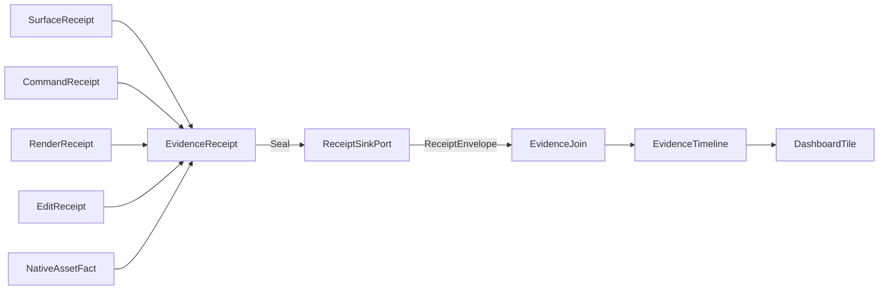

# [RASM_APPUI_ARCHITECTURE]

`Rasm.AppUi` composes one product UI rail above host-boundary packages. Every concern is one axis owner with a closed case family, one entrypoint family per rail, and growth as rows; the source tree, the receipt spine, the rail owners, and the cross-package seams below assemble from the transcription-complete signatures in `.planning/`.

## [1]-[SOURCE_TREE]

The planned non-flat implementation layout. Each leaf is one BUILD_ORDER transcription unit; the annotation after `#` names the owning page clusters whose signatures the file transcribes.

```text codemap
Rasm.AppUi/
├── Hosts/
│   ├── SurfaceVocabulary.cs    # SurfaceHost, SurfaceFact — surface-hosts#HOST_AXIS, surface-hosts#SCALE_FOCUS
│   └── SurfaceRail.cs          # Surfaces, EmbedCapsule, SurfaceScheduler, NativeAssets — surface-hosts#HOST_AXIS, surface-hosts#EMBED_CAPSULE, surface-hosts#SCHEDULER_BOUNDARY, surface-hosts#NATIVE_ASSETS
├── Shell/
│   └── ShellRail.cs            # NavRequest, ShellRoot, ShellDockFactory, ShellChrome, AdaptiveLayout — shell-navigation#ROUTING_SPINE, shell-navigation#DOCK_LAYOUTS, shell-navigation#SHELL_CHROME, shell-navigation#ADAPTIVE_LAYOUT
├── Screens/
│   └── ScreenRail.cs           # ScreenCatalog, ScreenBase, DerivedOps, ScreenValidation, ScreenState — screens-activation#SCREEN_CATALOG, screens-activation#ACTIVATION_SCOPES, screens-activation#DERIVED_STATE, screens-activation#VALIDATION_UX, screens-activation#SCREEN_STATE
├── Commands/
│   └── CommandRail.cs          # CommandIntent, CommandDeck, CommandGate, CommandExecution, CommandProjections — commands-availability#INTENT_TABLE, commands-availability#AVAILABILITY_ALGEBRA, commands-availability#EXECUTION_RECEIPTS, commands-availability#PALETTE_AND_REMOTE
├── LiveData/
│   └── LiveDataRail.cs         # DataSource, PipelineInputs, BindingCapsule, LiveDataOps — live-data#DATA_SOURCES, live-data#CHANGE_PIPELINES, live-data#BINDING_CAPSULE, live-data#AGGREGATION_SPINE
├── Tables/
│   └── TableRail.cs            # TableProjection, TableColumnRow, TableViewState, TableCommit — tables-hierarchy#GRID_SUBSTRATE, tables-hierarchy#VIEW_STATE, tables-hierarchy#TREE_FLATTEN, tables-hierarchy#GRID_COMMIT
├── Inspector/
│   └── InspectorRail.cs        # EditorFactory, InspectorSurface, EditGate, OptionsInspector, ConflictPane, CodePane — inspector-editing#INSPECTOR_SURFACE, inspector-editing#EDITOR_FACTORIES, inspector-editing#COMMIT_VALIDATION, inspector-editing#OPTIONS_INSPECTOR, inspector-editing#CONFLICT_RESOLUTION, inspector-editing#CODE_EDITING
├── Charts/
│   ├── ChartRail.cs            # ChartSeriesSpec, ChartAxisKind, ChartPolicy, ChartFolds, DashboardTile — charts-dashboards#SERIES_TABLE, charts-dashboards#AXES_SECTIONS, charts-dashboards#CHART_INTERACTION, charts-dashboards#STREAM_BINDING, charts-dashboards#DASHBOARD_TILES
│   └── CustomVisualRail.cs     # CustomVisual, ColorSpaceAxis — custom-visuals#SKIA_KINDS, custom-visuals#COLOR_SPACE (CustomVisual.Materialize composes DrawSource.Owned/VisualCodec; follows VisualRail)
├── Visuals/
│   └── VisualRail.cs           # DrawSource, Thumbnails, PreviewRow, VisualCodec, VisualExport, FlowBlock — visuals-offscreen#DRAW_CAPSULE, visuals-offscreen#THUMBNAIL_PIPELINE, visuals-offscreen#PREVIEW_SURFACES, visuals-offscreen#ENCODE_IDENTITY, visuals-offscreen#DOCUMENT_EXPORT
├── Theme/
│   ├── ThemeTokens.cs          # TokenRow, ThemeVariantRow, DensityRow — theme-tokens#TOKEN_CATALOG, theme-tokens#VARIANT_AXIS, theme-tokens#DENSITY_AXIS
│   └── ThemeRail.cs            # ThemeCell, ThemeRail — theme-tokens#CONTROL_THEMES
├── Typography/
│   └── TypographyRail.cs       # TypographyRole, FontChain, ShapingSurface, MarkdownProjection, TextMetricsPolicy — typography-shaping#ROLE_AXIS, typography-shaping#FONT_ADMISSION, typography-shaping#SHAPING_RAIL, typography-shaping#MARKDOWN_PROJECTION, typography-shaping#TEXT_METRICS
├── Assets/
│   ├── AssetCatalog.cs         # AssetKey, AssetCatalog, RasterAssets — icons-assets#ASSET_CATALOG, icons-assets#RASTER_ASSETS
│   └── IconRail.cs             # IconSource, IconSurface, SvgPipeline — icons-assets#ICON_AXIS, icons-assets#SVG_PIPELINE
├── Dialogs/
│   └── DialogRail.cs           # DialogIntent, DialogTopology, DialogSurface, ToastGate, PickOps — dialogs-notifications#DIALOG_INTENTS, dialogs-notifications#SESSION_ALGEBRA, dialogs-notifications#NOTIFICATIONS, dialogs-notifications#PICKERS_HOST_MODALITY
├── Input/
│   └── InteractionRail.cs      # GesturePolicy, BehaviorRail, PanZoomRow, DragPayload, ClipboardRow — input-interaction#HOTKEY_DERIVATION, input-interaction#BEHAVIOR_RAIL, input-interaction#POINTER_GESTURES, input-interaction#DRAG_CLIPBOARD
├── Motion/
│   └── MotionRail.cs           # MotionToken, MotionApplication, PhaseMotion, ReducedMotion — motion-tokens#MOTION_AXIS, motion-tokens#MOTION_APPLICATION, motion-tokens#PHASE_MAPPING, motion-tokens#REDUCED_MOTION
├── Access/
│   └── AccessRail.cs           # AccessOps, FocusOps, ContrastGate, AccessProof, SceneAccessNode, SpatialCue — accessibility#AUTOMATION_PEERS, accessibility#KEYBOARD_NAV, accessibility#CONTRAST_GATE, accessibility#COMPLIANCE_PROOF
├── Localization/
│   └── LocaleRail.cs           # LocaleRow, LocaleStrings, LocaleRuntime, MirrorPolicy, ShapedAnnotation, LiveCaption — localization-culture#LOCALE_AXIS, localization-culture#STRING_TABLES, localization-culture#CULTURE_COMPOSITION, localization-culture#RTL_MIRRORING
├── Evidence/
│   └── EvidenceRail.cs         # EvidenceReceipt, EvidenceJoin, Captures, ProofEngine, DevLoop, HudSample, FlameNode, SolveScrub, Repl — diagnostics-evidence#RECEIPT_UNION, diagnostics-evidence#CORRELATION_JOIN, diagnostics-evidence#CAPTURE_LANES, diagnostics-evidence#HEADLESS_DERIVATION, diagnostics-evidence#DEV_LOOP
├── Viewport/
│   └── ViewportPipeline.cs     # RenderPass, RenderGraph, MeshletCluster, ResidencyBudget, PathTracePass, SimVisual, Viewpoint, ViewportFault — viewport-pipeline#RENDER_GRAPH, viewport-pipeline#GEOMETRY_VIRTUAL, viewport-pipeline#RESIDENCY_BUDGET, viewport-pipeline#PATH_TRACE, viewport-pipeline#SIM_VISUAL, viewport-pipeline#VIEWPOINT_CODEC
├── Drafting/
│   └── DraftingRail.cs         # SheetSet, SheetSize, TitleBlock, Viewport2D, ProjectionBasis, Dimension, Annotation, GdtFrame, DraftEmit, DraftFault — drafting-sheets#SHEET_SET, drafting-sheets#PROJECTION, drafting-sheets#DIMENSIONING, drafting-sheets#DRAFT_EMIT
├── Notebook/
│   └── NotebookRail.cs         # NotebookCell, CapabilityPin, DependencyGraph, NotebookCrdt, CrdtOp, ReplayBundle, NotebookFault — notebook-document#CELL_MODEL, notebook-document#DEPENDENCY_GRAPH, notebook-document#CRDT_COEDIT, notebook-document#REPLAY_BUNDLE
└── Animation/
    └── AnimationRail.cs        # Track, Keyframe, Easing, Timeline, Playhead, TimelineSample, Scrub, Walkthrough — animation-timeline#TRACK_MODEL, animation-timeline#TIMELINE, animation-timeline#SCRUB, animation-timeline#WALKTHROUGH
```

Folders are namespace groups; the file count equals the BUILD_ORDER file set. New capability deepens the owning rail through rows, cases, and policy values inside an existing leaf, never a new file beside it.

## [2]-[SPINE]

Every sibling receipt folds into the one evidence union, seals through the HLC envelope, and re-enters the UI as timeline and dashboard rows — process-local, correlation-keyed, with skew bands rendered as uncertainty regions.



Text equivalent: surface, command, render, and edit receipts plus native-asset facts converge on `EvidenceReceipt`; the union seals to `ReceiptSinkPort`, which emits a `ReceiptEnvelope` into `EvidenceJoin`; the join produces an `EvidenceTimeline` that materializes as a `DashboardTile`.

## [3]-[RAILS]

Rails are owner surfaces, not filenames. New capability deepens the owning rail through rows, cases, and policy values before any public surface is added.

| [INDEX] | [RAIL] | [OWNERS] | [PAGE_CLUSTER] |
| :-----: | ------ | -------- | -------------- |
| [1] | surface hosts | SurfaceHost, Surfaces, EmbedCapsule, SurfaceScheduler, NativeAssets, SurfaceFact | surface-hosts#HOST_AXIS |
| [2] | shell + navigation | NavRequest, ShellRoot, ShellDockFactory, LayoutLedger, ShellChrome, AdaptiveLayout | shell-navigation#ROUTING_SPINE |
| [3] | screens | ScreenCatalog, ScreenBase, DerivedOps, ScreenValidation, ScreenState | screens-activation#SCREEN_CATALOG |
| [4] | commands | CommandIntent, CommandDeck, CommandGate, CommandExecution, CommandProjections | commands-availability#INTENT_TABLE |
| [5] | live data | DataSource, PipelineInputs, BindingCapsule, LiveDataOps | live-data#DATA_SOURCES |
| [6] | tables + hierarchy | TableColumnRow, TableViewState, TableProjection, TableCommit | tables-hierarchy#GRID_SUBSTRATE |
| [7] | inspector + editing | InspectorSurface, EditorFactory, EditGate, OptionsInspector, ConflictPane, ThreeWay, GeometryDiff, CodePane | inspector-editing#EDITOR_FACTORIES |
| [8] | charts + dashboards | ChartSeriesSpec, ChartAxisKind, ChartPolicy, ChartFolds, DashboardTile, CrossFilter, DimensionIndex, PolygonBrush, BoardState, GeoOverlay | charts-dashboards#SERIES_TABLE |
| [9] | offscreen visuals | DrawSource, Thumbnails, PreviewRow, VisualCodec, VisualExport, FlowBlock, OfficeExport | visuals-offscreen#DRAW_CAPSULE |
| [10] | theme | TokenRow, ThemeVariantRow, DensityRow, ThemeCell, ThemeRail | theme-tokens#TOKEN_CATALOG |
| [11] | typography | TypographyRole, FontChain, ShapingSurface, MarkdownProjection, TextMetricsPolicy | typography-shaping#ROLE_AXIS |
| [12] | icons + assets | IconSource, IconSurface, SvgPipeline, RasterAssets, AssetCatalog | icons-assets#ICON_AXIS |
| [13] | dialogs + notices | DialogIntent, DialogTopology, DialogSurface, ToastGate, PickOps | dialogs-notifications#DIALOG_INTENTS |
| [14] | input + interaction | GesturePolicy, BehaviorRail, PanZoomRow, DragPayload, ClipboardRow | input-interaction#HOTKEY_DERIVATION |
| [15] | motion | MotionToken, MotionApplication, PhaseMotion, ReducedMotion | motion-tokens#MOTION_AXIS |
| [16] | accessibility | AccessOps, FocusOps, ContrastGate, AccessProof, SceneAccessNode, SpatialCue | accessibility#CONTRAST_GATE |
| [17] | localization | LocaleRow, LocaleStrings, LocaleRuntime, MirrorPolicy, ShapedAnnotation, LiveCaption | localization-culture#LOCALE_AXIS |
| [18] | evidence | EvidenceReceipt, EvidenceJoin, Captures, ProofEngine, DevLoop, HudSample, FlameNode, SolveScrub, Repl | diagnostics-evidence#RECEIPT_UNION |
| [19] | viewport pipeline | RenderGraph, RenderPass, MeshletCluster, ResidencyBudget, PathTracePass, SimVisual, Viewpoint, ViewportFault | viewport-pipeline#RENDER_GRAPH |
| [20] | drafting + sheets | SheetSet, SheetSize, TitleBlock, Viewport2D, ProjectionBasis, Dimension, Annotation, DraftEmit, DraftFault | drafting-sheets#SHEET_SET |
| [21] | notebook document | NotebookCell, CapabilityPin, DependencyGraph, NotebookCrdt, ReplayBundle, NotebookFault | notebook-document#CELL_MODEL |
| [22] | animation timeline | Track, Keyframe, Easing, Timeline, Playhead, TimelineSample, Scrub, Walkthrough | animation-timeline#TRACK_MODEL |

## [4]-[DEPENDENCY_DIRECTION]

Consumed seams — mechanics live with the named owner; AppUi carries the consequence:

| [INDEX] | [SEAM] | [MECHANICS_OWNER] | [APPUI_CONSEQUENCE] |
| :-----: | ------ | ----------------- | ------------------- |
| [1] | drain order | AppHost lifecycle-and-drain rank bands | screens rank 10, layout flush rank 20 inside the 100s Interaction band via DrainParticipantPort |
| [2] | receipt sinks | AppHost runtime-ports ReceiptSinkPort | every AppUi receipt seals through the HLC envelope; EvidenceJoin consumes envelopes only |
| [3] | clock seam | AppHost time-and-deadlines ClockPolicy | all stamps, elapsed, and motion clocks; Surfaces.Mount carries ClockPolicy per the one-clock-seam ruling |
| [4] | UI scheduler | AppHost UiSchedulerPort | SurfaceScheduler.Port completes Marshal; Phases and Degradation arrive bound |
| [5] | degradation + capability | AppHost health-and-degradation | CommandGate availability fold; LocalOnly retires HostDocument rows structurally |
| [6] | runtime phases | AppHost RuntimePhase | toast suppression fold; draining suspends every bound screen |
| [7] | classification | AppHost DataClassification | column masking, filter/export exclusion, bundle artifact classification |
| [8] | options reload | AppHost ReloadClass/ReloadReceipt | options-inspector banner fold; locale republish under the transition class |
| [9] | profile + roots | AppHost ResolvedProfile/ProfileRoots | theme defaults per profile row, asset cache roots, artifact scopes |
| [10] | schedule + support + faults | AppHost ScheduleEntry, SupportContributorPort, FaultSource | layout checkpoint cadence, dock-layout support artifact, crash-restore offer |
| [11] | identity keys | Persistence IdentityPolicy | SourceCache key selectors — uuidv7, content hash, natural key |
| [12] | snapshot + blob lanes | Persistence snapshot-codecs, blob lane | layout blobs, screen state, thumbnails, dashboard layouts, render-hash baselines |
| [13] | conflict receipts | Persistence sync-collaboration | ConflictPane projection with four resolution intent keys |
| [14] | tabular export | Persistence Sep lane | TableExportSpec File/BlobLane destinations |
| [15] | progress phases | Compute progress-and-observation | PhaseMotion frozen map; conformance sweep fails on phase-set drift by design |
| [16] | receipt streams | Compute receipts-and-benchmarks | DataSource.ComputeReceiptStream, progress dialogs, provenance projection |
| [17] | host mount + document | Rasm.Rhino / Rasm.Grasshopper | SurfaceSeam columns, WatchEvent-to-HostDocumentFact projection, ViewCapture thumbnails, FileFormat tuples, DocumentEdit.Commit transaction routing |
| [18] | geometry payload | Compute GeometryPayload proto oneof | MeshSource projection feeds MeshletCluster.Build and Viewport2D.Project; never re-tessellated |
| [19] | field receipts | Compute field receipts | SimField projection feeds SimVisual render passes; never re-computed |
| [20] | capability registry | Compute capability-and-determinism | CapabilityPin verify and ReplayBundle bit-identity ride the settled checksum, not a notebook-local hash |
| [21] | shared GPU context | surface-hosts EMBED_CAPSULE platform lease | RenderGraph leases the host GRContext; no second context minted; SPIKE on the live host surface |
| [22] | host-shared device fabric | SurfaceSeam device delegate columns | InputFabric Map/Drive bind SpaceMouse/controller/gaze/voice/MIDI input and CNC/robot/haptic output at composition |

## [5]-[CROSS_PACKAGE_SEAMS]

Provided seams — AppUi owns the mechanics; consumers take the consequence:

| [INDEX] | [SEAM] | [APPUI_OWNER] | [CONSUMER] |
| :-----: | ------ | ------------- | ---------- |
| [1] | marshal completion | SurfaceScheduler.Port | AppHost UiSchedulerPort at the composition root |
| [2] | evidence wire | EvidenceReceipt + AppUiWireContext | app roots merge the context; TS dashboards ingest timelines |
| [3] | command wire | CommandIntent keys + command wire shapes | TS layer, deep links, remote invocation, journal replay |
| [4] | gesture conflicts | CommandDeck freeze-time conflict fold | input Bindings consumes the frozen deck first-wins |
| [5] | focus-walk execution | ProofEngine ProofCheck.FocusWalk | accessibility AccessAudit folds the engine result |
| [6] | visual egress split | tables ExportDestination (tabular text) · visuals VisualDestination (rendered media) | ratified two-owner split — distinct media, no overlap |
| [7] | viewpoint codec | Viewpoint + ViewpointCodec (BCF-compatible) | dashboard markup, cross-process coordination, and BCF tools share one portable view-state receipt |
| [8] | frame + replay wire | FrameReceipt wire · ReplayBundle manifest | web performance HUD reads frame budget; notebook replay reproduces bit-identically off the pinned manifest |

## [6]-[BOUNDARIES]

- AppUi owns product UI intent; Rasm.Rhino and Rasm.Grasshopper own native host behavior — viewport overlays, HUDs, document mutation, and command-line modality cross only as seam delegates and port tuples.
- AppUi owns retained composition and offscreen raster; Persistence owns store queries and durable state — blobs cross as opaque versioned payloads through port delegates.
- AppUi owns progress presentation; Compute owns execution and progress receipts.
- AppUi owns scheduler-bound UI observation; AppHost owns runtime scheduling, lifecycle, configuration, and the correlation spine.
- The viewport, simulation render, path trace, and residency owners are fence-complete GPU surfaces SPIKE-gated on the live host-shared `GRContext`; every owner ships its CPU/2D-Skia fallback today (composite raster, CPU meshlet cull, reference path tracer, CPU marching-cubes, blob-backed residency plan) so the rail is fully shaped now, never a deferred surface, and the GPU dispatch binds through the embed-capsule lease.
- Frame budget is the residency and render-graph invariant — a plan that would exceed the VRAM budget evicts before it admits and a pass overrunning the frame budget defers; an unbounded resident set or a wall-clock-paced frame is structurally impossible.
- Provider types (Avalonia, ReactiveUI, SkiaSharp, LiveCharts, Dock, Eto, OpenXML, host APIs) stay internal; the public vocabulary is the axis owners in [3].
