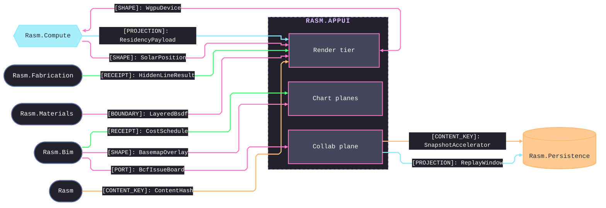
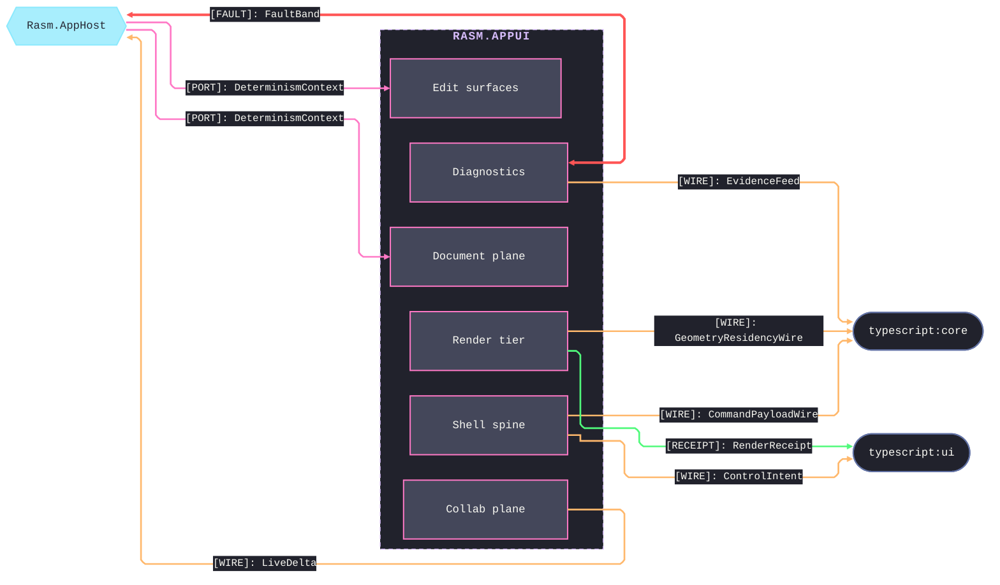

# [RASM_APPUI_ARCHITECTURE]

`Rasm.AppUi` maps the APP-PLATFORM Avalonia product-UI engine over the settled receipt spine and the GPU render surface: each sub-domain page is a UI capability unit lowering onto the one 6xxx `AppUiFaultBand` and aligning with peers by contract, never by reference.

## [01]-[DOMAIN_MAP]

```text codemap
Rasm.AppUi/
├── Shell/                # Host-mount axis and application shell spine
│   ├── Navigation.cs     # Routing spine with typed deep-link grammar over dockable layouts
│   ├── Screens.cs        # Screen catalog with ref-counted activation and OAPH-paced state
│   ├── Hosts.cs          # Host-neutral surface mounting with seam delegate columns
│   ├── Commands.cs       # Command vocabulary with availability algebra and total receipts
│   ├── Controls.cs       # ControlIntent union materialized through one control factory
│   ├── Solver.cs         # Layout-constraint Kiwi algebra solved by one custom panel
│   ├── Virtualization.cs # One virtual-window owner over change-sets and an extent ledger
│   ├── Dialogs.cs        # Typed-Fin dialog intents with dismissal-as-value and agnostic pickers
│   ├── Input.cs          # Command-derived hotkeys, behavior rows, pan-zoom canvas, device drivers
│   └── Accessibility.cs  # Automation identity, tab-order and trap law, one WCAG luminance gate
├── Render/               # Pure GPU-viewport and temporal tier
│   ├── Pipeline.cs       # Render-graph pass-DAG with per-backend targets and a resolve ladder
│   ├── Meshlets.cs       # Compute residency cluster consumption with hysteresis LOD and cull cut
│   ├── PathTrace.cs      # BVH, ReSTIR, and denoise oracle over the one light rig
│   ├── Shading.cs        # GPU shader cache per backend feeding the layered-BSDF shade pass
│   ├── Immersive.cs      # OpenXR stereo design-review and passthrough over the shared device
│   ├── Reality.cs        # Gaussian-splat and point-cloud capture over the one residency carrier
│   ├── Capture.cs        # Raster capsule, color-policy owner, vector-print arm, and encode rows
│   ├── Drafting.cs       # Sheet drafting with hidden-line consumption and one DWG/DXF write leg
│   └── Animation.cs      # Timeline keyframe-track union with track-owned interpolation
├── Charts/               # Chart, dashboard, and geo-basemap projection
│   ├── Dashboards.cs     # Chart series and axis rows with downsampled stream binding and brushing
│   ├── Custom.cs         # Custom-visual Skia layout algebra with a keyed color-policy projection
│   └── Basemap.cs        # Tiled basemap with Bim-owned overlays beside the viewport
├── Editing/              # Typed-edit surfaces over the model
│   ├── Inspector.cs      # Typed property inspection with ranked editor rows and diff3 conflict hunks
│   ├── Tables.cs         # Tabular and hierarchical projection routed through the virtual window
│   ├── Forms.cs          # Form-schema wizard through the control factory, batch-edit folding one receipt
│   ├── History.cs        # Revertible-op inverse algebra over the recorder and a durable-ledger arm
│   ├── LiveData.cs       # Reactive data spine over closed data-source cases and change-set operators
│   └── Graph.cs          # Node-editor parametric canvas with an admission gate and co-edit merge
├── Document/             # Reproducible document plane
│   ├── Notebook.cs       # Capability-pinned cells composing the recompute graph; co-editing; replay
│   ├── Media.cs          # Markdown inlines and codec rows on the one surface seam
│   └── Export.cs         # Paginated flow reports, PDF security and forms, an Office arm, a print arm
├── Collab/               # Live-collaboration plane over the durable Persistence spine
│   ├── Sync.cs           # Live-merge authority and the typed edit-intent stream onto the durable ledger
│   ├── Issues.cs         # openBIM issue board projection over the Bim BCF contract
│   └── Tour.cs           # Review tour as a camera-track projection with presenter-follow presence
├── Diagnostics/          # Evidence, proof, dev loop, and quality governance
│   ├── Evidence.cs       # Evidence-receipt union, correlation join, and the 6xxx fault registry
│   ├── Proof.cs          # Capture lanes, headless proof matrix, goldens, and a typed proof fault
│   ├── DevLoop.cs        # Hot-reload knobs, inspector, HUD, flamegraph, solve scrub, and a REPL
│   └── Governor.cs       # Perf-budget quality governor with timestamp attribution
└── Theme/                # Pure vocabulary tier: tokens, typography, motion, assets, locale
    ├── Tokens.cs         # Design-token engine with an OKLab ramp mix and atomic theme swap
    ├── Typography.cs     # Type roles, embedded-font admission, one shaping rail, live front-matter
    ├── Motion.cs         # Motion tokens with spring algebra and a progress-to-token map
    ├── Assets.cs         # Nameof-derived asset-key vocabulary with rank-fallback sourcing
    └── Locale.cs         # Locale rows over Resx, ICU, and time, a typed locale fault, live captioning
```

`Shell` owns the host-mount axis and application spine: the mount precedes the shell, the shell precedes the screens it routes. `Theme` is the pure vocabulary tier every literal traces to. `Render` owns the GPU-viewport and temporal tier, `Document` composes the AppHost recompute graph and owns every paginated output, and `Diagnostics` carries the 6xxx fault registry, the headless proof matrix, and the quality governor. `Collab/sync` holds the one live-merge authority every co-edited surface composes and the single typed `EditIntent` union that is durable truth on the Persistence ledger — no Loro byte crosses durable truth.

## [02]-[SEAMS]

Two fences split the seam map by counterpart role: the first binds the same-branch AEC peers, the kernel, and the durable store; the second binds the platform host and the TypeScript peers. Each collapsed edge stands for every contract between that owner and that partner at the load-bearing kind; the owning pages enumerate the rest.





`[PORT]` edges into `Editing` and `Document` are the one AppHost runtime port spine every surface composes at app composition, resolving through the one `Rasm.AppHost/Runtime` boundary. `[CONTENT_KEY]` edges are one idiom: every AppUi content-identity mint composes the kernel `ContentHash.Of` seed-zero entry, and Compute-minted residency and splat keys stay decode-only.

`Diagnostics ⇄ Rasm.AppHost` `[FAULT]` edge is the 6xxx `AppUiFaultBand` neighborhood: AppUi lowers every fault union onto its band and the AppHost lifecycle registry pins the reciprocal range, so fault codes never collide across the platform seam.

## [03]-[BOUNDARIES]

- `ChartAtlas` texture UV enters through the Fabrication nesting receipt.
- Bim `ElementSet` queries enter through Bim-owned receipt rows.
- `ScheduleNetwork` dashboards consume Bim planning receipts.
- Whisper.net owns translate-to-English captioning; broader translation binds through a locale service row.
- Kernel `Analyze` receipt projection enters inspector and dashboard surfaces through the receipt spine.
- `SurfaceHost.RhinoPanel` mounts only when a Rhino lease supplies `EmbedCapsule` and `RenderGraph.Lease`.

## [04]-[PROHIBITIONS]

Each prohibition names the owner region that forecloses it.

- NEVER runtime XAML for production views — `Surfaces.RejectRuntimeXaml` folds an `AvaloniaXamlLoader.Load` attempt into `SurfaceFault.MountRejected`, so views enter only through the `Configure<TApp>` compiled-XAML class.
- NEVER per-host `GpuBackend`/`GRContext` construction in a dispatch arm — Avalonia owns backend selection through `EmbedOptions.RenderingMode`.
- NEVER a per-surface image loader, telemetry sink, or receipt sink — every owner contributes through the one `AppUiTelemetry.Contribute` spine and `ReceiptSinkPort`.
- NEVER an `SKSurface` outside the `Offscreen` capsule — the capture capsule owns the one Skia draw boundary.
- NEVER ReactiveUI code-behind view binding — `BehaviorRail.Intent(ICommand)` is the single C# binding bridge, `BehaviorRail.RejectViewBinding` faulting rejected binder symbols.
- NEVER a second command, hotkey, palette, or conflict registry beside the one `CommandIntent` table and `CommandDeck.Freeze` — every menu, gesture, and remote verb is a derivation fold over the one table.
- NEVER a parallel control-generation or layout framework — control materialization is the one `ControlIntent` union through `ControlFactory`, and constraint layout is the one `LayoutConstraint` algebra solved by one `LayoutSolver` panel.
- NEVER a per-surface virtualizer — the one `VirtualWindow` owner over `DynamicData` change-sets owns every windowed surface.
- NEVER a generic `IReceipt` or ledger abstraction — every receipt stays its typed record sealed through `ReceiptSinkPort`.
- NEVER a fault code outside the `Diagnostics/evidence` `FAULT_TABLES` registry — every AppUi fault union's `Code` derives through its 6xxx `AppUiFaultBand` row.
- NEVER a Loro byte as durable truth — the durable collaboration stream is the one `Collab/sync` `EditIntent` union projected onto Persistence-owned `OpLogEntry` rows, and the Loro snapshot survives only as a content-keyed cold-start accelerator.
- NEVER a second revert vocabulary beside the one inverse algebra — `RevertibleOp` forward and inverse deltas fold across the client recorder window and the durable `OpLogEntry` inverse stream as two arms of one `RevertScope`.
- NEVER a second BCF or coordination owner inside AppUi — `Rasm.Bim/coordination` owns the openBIM semantics, and AppUi retains only the `Viewpoint` board projection.
- NEVER an AppUi-local content-identity mint beside the kernel `ContentHash.Of` — every AppUi content hash composes the one federation seed-zero entry.
- NEVER a local geodesy, solar-position, clustering, or recompute engine — Bim owns geodesy, Compute owns solar position and meshlet clustering, and the AppHost `RecomputeGraph` owns incremental recompute.
- CSP analyzer diagnostics are architecture pressure: fix the shape, refine the rule on a false positive, never suppress.
