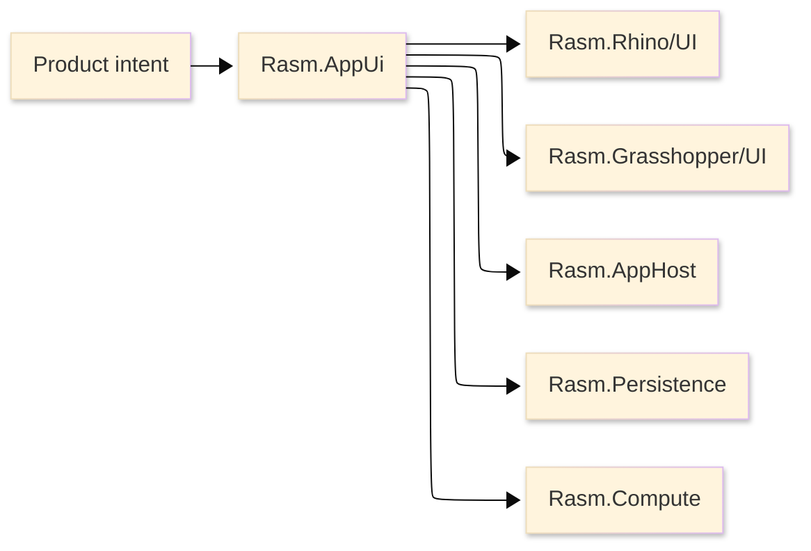

# [RASM_APPUI_ARCHITECTURE]

`Rasm.AppUi` owns product UI composition above host-boundary UI packages. The package is a manifest-backed project node with no production source; this page defines the architecture that source must enter.

## [1]-[SYSTEM_SCOPE]

Text equivalent: product intent enters AppUi; AppUi owns retained UI state and delegates host behavior to Rhino and Grasshopper UI packages while consuming AppHost, Persistence, and Compute contracts.

## [2]-[PROJECT_IDENTITY]

This table is a lookup by project fact.

| [INDEX] | [FACT]            | [VALUE]                               |
| :-----: | :---------------- | :------------------------------------ |
|   [1]   | Project file      | `Rasm.AppUi.csproj`                   |
|   [2]   | Host awareness    | Rhino, Grasshopper, Eto, macOS        |
|   [3]   | Source state      | no production `.cs` files             |
|   [4]   | Direct packages   | retained UI, live data, visuals, controls |
|   [5]   | Project contracts | Rasm, AppHost, Compute, Persistence, Rhino, Grasshopper |

## [3]-[REFERENCE_DIRECTION]

This table is a dependency law by project.

| [INDEX] | [PROJECT]          | [RELATION]                              |
| :-----: | :----------------- | :-------------------------------------- |
|   [1]   | `Rasm`             | kernel and vector source                |
|   [2]   | `Rasm.AppHost`     | runtime scheduling and lifecycle policy |
|   [3]   | `Rasm.Compute`     | progress and execution receipt contract |
|   [4]   | `Rasm.Persistence` | state projection and support artifacts  |
|   [5]   | `Rasm.Rhino`       | Rhino panel and display boundary        |
|   [6]   | `Rasm.Grasshopper` | GH2 canvas and component boundary       |

AppUi is the only package in this set with Rhino/GH/Eto/macOS build awareness. AppHost, Compute, and Persistence remain free of AppUi implementation references.

## [4]-[UI_RAILS]

This table is a lookup by AppUi rail.

| [INDEX] | [RAIL]      | [OWNS]                                  |
| :-----: | :---------- | :-------------------------------------- |
|   [1]   | Shell       | routes, nav stack, mode, visibility     |
|   [2]   | Screen      | activation, validation, projection      |
|   [3]   | Command     | intent, availability, receipts          |
|   [4]   | Live        | read-only projections and snapshots     |
|   [5]   | Visual      | thumbnails, preview, HUD intent         |
|   [6]   | Chart       | series, axes, legends, dashboards       |
|   [7]   | Inspector   | property grid and typed editors         |
|   [8]   | Theme       | Fluent base, tokens, control themes     |
|   [9]   | Typography  | roles, fallback, shaping                |
|  [10]   | Assets      | path icons, SVG, custom resources       |
|  [11]   | Diagnostics | focus, scale, disposal, screenshots     |

Rails are owner surfaces, not required filenames. New UI capability deepens the owning rail through catalog rows, discriminants, receipts, adapters, or folded projections before adding a public surface.

## [5]-[HOST_BOUNDARY]

- Avalonia owns retained panels, dialogs, companion windows, sidecar shells, and downstream app shells.
- Rhino and Grasshopper display conduits own viewport overlays, HUDs, marks, and native scene composition.
- Host panel handles, focus state, Retina scale, screenshot capture, native asset identity, and disposal order become AppUi diagnostic receipts.
- `System.Drawing.Common` is compile support for Rhino-aware projects, not AppUi public vocabulary.

## [6]-[CATALOGUE_TRUTH]

Package API facts live in [.reports/api](.reports/api/README.md). Architecture names rails, host boundaries, and project contracts; catalogue pages carry package assemblies, namespaces, usings, type families, operation families, and rejected provider stacks.

## [7]-[BOUNDARIES]

- AppUi owns product UI intent; host packages own native host behavior.
- AppUi owns retained UI composition; Persistence owns store queries and durable state.
- AppUi owns progress presentation; Compute owns execution and progress receipts.
- AppUi owns scheduler-bound UI observation; AppHost owns runtime scheduling policy.
