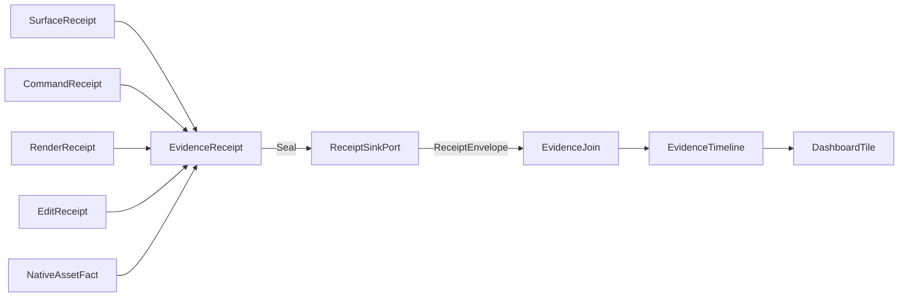

# [RASM_APPUI_ARCHITECTURE]

`Rasm.AppUi` composes one product UI rail above host-boundary packages. Every concern is one axis owner with a closed case family, one entrypoint family per rail, and growth as rows — the eighteen finalized planning pages under `.planning/` carry the transcription-complete signatures; this page states the assembled shape.

## [1]-[RAILS_AND_AXES]

| [INDEX] | [RAIL] | [OWNERS] | [SOURCE] |
| :-----: | ------ | -------- | -------- |
| [1] | surface hosts | SurfaceHost (7), Surfaces, EmbedCapsule, SurfaceScheduler, NativeAssets, SurfaceFact (4) | surface-hosts#HOST_AXIS |
| [2] | shell + navigation | NavRequest (5), ShellRoot, ShellDockFactory, LayoutLedger, ShellChrome, AdaptiveLayout | shell-navigation#ROUTING_SPINE |
| [3] | screens | ScreenCatalog, ScreenBase, DerivedOps, ScreenValidation, ScreenState | screens-activation#SCREEN_CATALOG |
| [4] | commands | CommandIntent + CommandDeck, CommandGate, CommandExecution, CommandProjections | commands-availability#INTENT_TABLE |
| [5] | live data | DataSource (6), PipelineInputs, BindingCapsule, LiveDataOps | live-data#DATA_SOURCES |
| [6] | tables + hierarchy | TableColumnRow, TableViewState, TableProjection (5), TableCommit | tables-hierarchy#GRID_SUBSTRATE |
| [7] | inspector + editing | InspectorSurface, EditorFactory (11), EditGate, OptionsInspector, ConflictPane, CodePane | inspector-editing#EDITOR_FACTORIES |
| [8] | charts + dashboards | ChartSeriesSpec (15), ChartAxisKind (5), ChartPolicy, ChartFolds, DashboardTile (4) | charts-dashboards#SERIES_TABLE |
| [9] | offscreen visuals | DrawSource (2), Thumbnails, PreviewRow, VisualCodec, VisualExport | visuals-offscreen#DRAW_CAPSULE |
| [10] | theme | TokenRow (5), ThemeVariantRow (4) × DensityRow (2), ThemeCell, ThemeRail | theme-tokens#TOKEN_CATALOG |
| [11] | typography | TypographyRole (10), FontChain, ShapingSurface, MarkdownProjection (7), TextMetricsPolicy | typography-shaping#ROLE_AXIS |
| [12] | icons + assets | IconSource (5), IconSurface, SvgPipeline, RasterAssets, AssetCatalog | icons-assets#ICON_AXIS |
| [13] | dialogs + notices | DialogIntent (6), DialogTopology, DialogSurface, ToastGate, PickOps | dialogs-notifications#DIALOG_INTENTS |
| [14] | input + interaction | GesturePolicy, BehaviorRail, PanZoomRow, DragPayload (5), ClipboardRow | input-interaction#HOTKEY_DERIVATION |
| [15] | motion | MotionToken (6), MotionApplication, PhaseMotion, ReducedMotion | motion-tokens#MOTION_AXIS |
| [16] | accessibility | AccessOps, FocusOps, ContrastGate, AccessProof | accessibility#CONTRAST_GATE |
| [17] | localization | LocaleRow (2), LocaleStrings, LocaleRuntime, MirrorPolicy | localization-culture#LOCALE_AXIS |
| [18] | evidence | EvidenceReceipt (7), EvidenceJoin, Captures, ProofEngine, DevLoop | diagnostics-evidence#RECEIPT_UNION |

Rails are owner surfaces, not filenames. New capability deepens the owning rail through rows, cases, and policy values before any public surface is added.

## [2]-[CROSS_PACKAGE_MATRIX]

Consumed seams — mechanics live with the named owner; AppUi carries the consequence (ledger SEAM_SPLITS entries):

| [INDEX] | [SEAM] | [MECHANICS_OWNER] | [APPUI_CONSEQUENCE] |
| :-----: | ------ | ----------------- | ------------------- |
| [1] | drain order | AppHost lifecycle-and-drain rank bands | screens rank 10, layout flush rank 20 inside the 100s Interaction band via DrainParticipantPort |
| [2] | receipt sinks | AppHost runtime-ports ReceiptSinkPort | every AppUi receipt seals through the HLC envelope; EvidenceJoin consumes envelopes only |
| [3] | clock seam | AppHost time-and-deadlines ClockPolicy | all stamps, elapsed, and motion clocks; Surfaces.Mount carries ClockPolicy per the one-clock-seam ruling |
| [4] | UI scheduler | AppHost UiSchedulerPort | SurfaceScheduler.Port completes Marshal; Phases and Degradation arrive bound |
| [5] | degradation + capability | AppHost health-and-degradation | CommandGate availability fold; LocalOnly retires HostDocument rows structurally |
| [6] | runtime phases | AppHost RuntimePhase | toast suppression fold; draining suspends every bound screen |
| [7] | classification | AppHost DataClassification | column masking, filter/export exclusion, bundle artifact classification |
| [8] | options reload | AppHost ReloadClass/ReloadReceipt | options-inspector banner fold; locale republish under the transition class |
| [9] | profile + roots | AppHost ResolvedProfile/ProfileRoots | theme defaults per profile row, asset cache roots, artifact scopes |
| [10] | schedule + support + faults | AppHost ScheduleEntry, SupportContributorPort, FaultSource | layout checkpoint cadence, dock-layout support artifact, crash-restore offer |
| [11] | identity keys | Persistence IdentityPolicy | SourceCache key selectors — uuidv7, content hash, natural key |
| [12] | snapshot + blob lanes | Persistence snapshot-codecs, blob lane | layout blobs, screen state, thumbnails, dashboard layouts, render-hash baselines |
| [13] | conflict receipts | Persistence sync-collaboration | ConflictPane projection with four resolution intent keys |
| [14] | tabular export | Persistence Sep lane | TableExportSpec File/BlobLane destinations |
| [15] | progress phases | Compute progress-and-observation | PhaseMotion frozen map; conformance sweep fails on phase-set drift by design |
| [16] | receipt streams | Compute receipts-and-benchmarks | DataSource.ComputeReceiptStream, progress dialogs, provenance projection |
| [17] | host mount + document | Rasm.Rhino / Rasm.Grasshopper | SurfaceSeam columns, WatchEvent-to-HostDocumentFact projection, ViewCapture thumbnails, FileFormat tuples, DocumentEdit.Commit transaction routing |

Provided seams — AppUi owns the mechanics; consumers take the consequence:

| [INDEX] | [SEAM] | [APPUI_OWNER] | [CONSUMER] |
| :-----: | ------ | ------------- | ---------- |
| [1] | marshal completion | SurfaceScheduler.Port | AppHost UiSchedulerPort at the composition root |
| [2] | evidence wire | EvidenceReceipt + AppUiWireContext | app roots merge the context; TS dashboards ingest timelines |
| [3] | command wire | CommandIntent keys + command wire shapes | TS layer, deep links, remote invocation, journal replay |
| [4] | gesture conflicts | CommandDeck freeze-time conflict fold | input Bindings consumes the frozen deck first-wins |
| [5] | focus-walk execution | ProofEngine ProofCheck.FocusWalk | accessibility AccessAudit folds the engine result |
| [6] | visual egress split | tables ExportDestination (tabular text) · visuals VisualDestination (rendered media) | ratified two-owner split — distinct media, no overlap |

## [3]-[RECEIPT_FLOW]

Every sibling receipt folds into the one evidence union, seals through the HLC envelope, and re-enters the UI as timeline and dashboard rows — process-local, correlation-keyed, with skew bands rendered as uncertainty regions.

## [4]-[BOUNDARIES]

- AppUi owns product UI intent; Rasm.Rhino and Rasm.Grasshopper own native host behavior — viewport overlays, HUDs, document mutation, and command-line modality cross only as seam delegates and port tuples.
- AppUi owns retained composition and offscreen raster; Persistence owns store queries and durable state — blobs cross as opaque versioned payloads through port delegates.
- AppUi owns progress presentation; Compute owns execution and progress receipts.
- AppUi owns scheduler-bound UI observation; AppHost owns runtime scheduling, lifecycle, configuration, and the correlation spine.
- Provider types (Avalonia, ReactiveUI, SkiaSharp, LiveCharts, Dock, Eto, host APIs) stay internal; the public vocabulary is the axis owners in [1].
