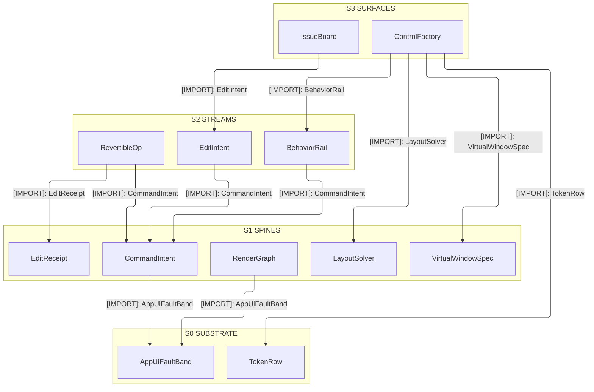
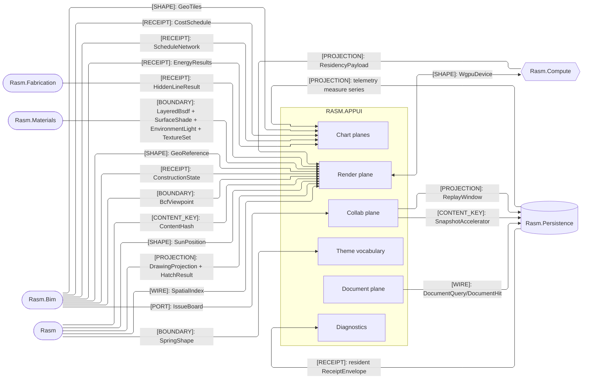
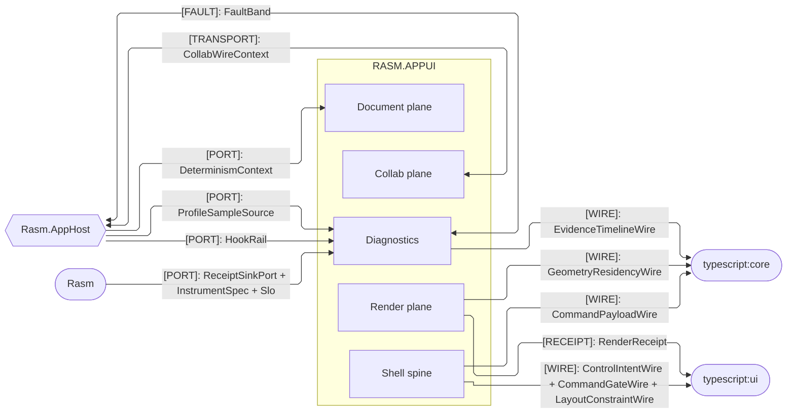

# [RASM_APPUI_ARCHITECTURE]

`Rasm.AppUi` maps the APP-PLATFORM Avalonia product-UI engine over the settled receipt spine and the GPU render surface: each sub-domain page is a UI capability unit lowering onto the one 6xxx `AppUiFaultBand`. S4 seats it as the consuming leaf: it references `{Rasm, Rasm.AppHost, Rasm.Compute, Rasm.Materials, Rasm.Persistence}` downward, re-owns none of their capability, and never becomes the composition root.

## [01]-[DOMAIN_MAP]

```text codemap
Rasm.AppUi/
├── Shell/                # Host-mount axis and application shell spine
│   ├── Navigation.cs     # Routing spine with typed deep-link grammar over dockable layouts
│   ├── Screens.cs        # Screen catalog with ref-counted activation and OAPH-paced state
│   ├── Hosts.cs          # Host-neutral surface mounting with seam delegate columns
│   ├── Commands.cs       # Command vocabulary with availability algebra and total receipts
│   ├── Controls.cs       # ControlIntent union materialized through one control factory
│   ├── Solver.cs         # Layout-constraint Kiwi algebra solved by one custom panel
│   ├── Virtualization.cs # One virtual-window owner over change-sets and an extent ledger
│   ├── Dialogs.cs        # Two-stack dialog intents, derived topology, notification plane, activity inbox
│   ├── Input.cs          # Command-derived hotkeys, behavior rows, pan-zoom canvas, device drivers
│   └── Accessibility.cs  # Automation identity, tab-order and trap law, one WCAG luminance gate
├── Render/               # Pure GPU-viewport and temporal plane
│   ├── Pipeline.cs       # Render-graph pass-DAG over per-backend GPU targets and the resolve ladder
│   ├── Meshlets.cs       # Compute residency cluster consumption with hysteresis LOD and cull cut
│   ├── PathTrace.cs      # BVH, ReSTIR, ray-cone LOD, denoise oracle, and the resolved environment dome
│   ├── Shading.cs        # Admitted shader roster, budgeted plane residency, and the layered-BSDF plus prefiltered-dome shade pass
│   ├── Immersive.cs      # OpenXR session machine, stereo review, passthrough, and spatial anchors over the shared device
│   ├── Reality.cs        # Gaussian-splat and point-cloud capture over the one residency carrier
│   ├── Capture.cs        # Raster capsule, color-policy owner, vector-print arm, and encode rows
│   ├── Drafting.cs       # Sheet drafting with hidden-line consumption and one DWG/DXF write leg
│   └── Animation.cs      # Timeline keyframe-track union with 4D schedule playback
├── Charts/               # Chart, dashboard, and geo-basemap projection
│   ├── Dashboards.cs     # Chart series and axis rows with downsampled stream binding and brushing
│   ├── Custom.cs         # Custom-visual Skia layout algebra with a keyed color-policy projection
│   ├── Basemap.cs        # Tiled basemap with Bim-owned overlays and EditManager redlining beside the viewport
│   ├── Telemetry.cs      # Telemetry board over instrument, SLO burn-rate, store-profile, and evidence-track tiles
│   └── Climate.cs        # AEC climate diagram folds — roses, sun paths, sky domes, comfort charts — and the polar split
├── Analysis/             # Sealed study results as a scene, a comparison, and one environmental coordinate
│   ├── Layers.cs         # Result layers over one payload with the probe channel, adoption site, and bake verbs
│   ├── Compare.cs        # Synced compare grid over option, analysis, and time under four shared channels
│   └── Context.cs        # One temporal-and-climate axis beside the pre-solve compute-budget meter
├── Editing/              # Typed-edit surfaces over the model
│   ├── Inspector.cs      # Typed property inspection with ranked editor rows and diff3 conflict hunks
│   ├── Tables.cs         # Tabular and hierarchical projection routed through the virtual window
│   ├── Forms.cs          # Sectioned form schema and chrome capsule, pending-commit posture, study recipes, batch fold
│   ├── History.cs        # Revertible-op inverse algebra over the recorder and a durable-ledger arm, and its scrubbable timeline surface
│   ├── LiveData.cs       # Reactive data spine: sourcing cases, filter and view algebra, optimistic overlay, design options
│   └── Graph.cs          # Node-editor parametric canvas with an admission gate and co-edit merge
├── Document/             # Reproducible document plane
│   ├── Notebook.cs       # Capability-pinned cells composing the recompute graph; co-editing; replay
│   ├── Media.cs          # Markdown blocks and codec rows for the one Surfaces.Mount crossing; transport, caption, gallery, diff seats
│   ├── Export.cs         # Paginated flow reports, PDF security forms and outline, Office and print arms, support-bundle rows
│   ├── Search.cs         # Typed search plane with ranked source-attributed results and its grouped results panel
│   └── Board.cs          # Infinite board composing view frames, stat cards, and sheets into a publishable deliverable
├── Collab/               # Live-collaboration plane over the durable Persistence spine
│   ├── Sync.cs           # Live-merge authority and the typed edit-intent stream onto the durable ledger
│   ├── Issues.cs         # openBIM issue board projection over the Bim BCF contract
│   ├── Tour.cs           # Review tour as a camera-track projection with presenter-follow presence
│   └── Session.cs        # Typed session governance gating edit-intent admission by role and membership
├── Diagnostics/          # Evidence, proof, dev loop, and quality governance
│   ├── Evidence.cs       # Evidence-receipt union, telemetry spine and fan, correlation join, 6xxx fault registry
│   ├── Proof.cs          # Capture lanes, headless proof matrix, frame-bench lanes, goldens, and a typed proof fault
│   ├── DevLoop.cs        # Hot-reload knobs, inspector, HUD, flamegraph, solve scrub, and a REPL
│   └── Governor.cs       # Perf-budget quality governor with timestamp attribution
├── Vfx/                  # Owned effects plane over the one draw capsule
│   ├── Material.cs       # Layer algebra, the sample-invalidation contract, and the per-draw filter rows
│   ├── Shader.cs         # SkSL program roster, uniform frames, path patterns, byte-ceiling recorded tiles
│   └── Compose.cs        # Closed composition slot vocabulary, keyframe mint, trigger maps, render-thread tick
└── Theme/                # Pure vocabulary: tokens, typography, motion, assets, locale
    ├── Tokens.cs         # Seed-generated token ladder with variant-scoped emission and atomic theme swap
    ├── Typography.cs     # Generated two-axis type table, capability-keyed face cabinet, itemizing shaping rail
    ├── Motion.cs         # Motion tokens with spring algebra and a progress-to-token map
    ├── Assets.cs         # Nameof-derived asset-key vocabulary with rank-fallback sourcing
    └── Locale.cs         # Locale rows over Resx, ICU, calendars, collation, the mirroring law, measurement format
```

`Shell` owns the host-mount axis and application spine — the mount precedes the shell, the shell precedes the screens it routes — and `Theme` is the pure vocabulary every literal traces to, with `Vfx` its executor: the effects plane draws what the token catalogue declares and owns no constant of its own. `Render` owns the GPU viewport and the temporal plane, `Document` the recompute graph and every paginated output, and `Diagnostics` the 6xxx fault registry, the proof matrix, the telemetry spine, and the quality governor. `Analysis` is the consuming leaf of that stack: it owns what a SEALED study becomes — a stacked result layer, a probed coordinate, a synced comparison, and the one environmental context every layer, diagram, and bound series reads — and computes no analysis value of its own, so `Rasm.Compute` stays the solver and this plane stays its reader. `Collab/sync` holds the one live-merge authority and the typed `EditIntent` union that is durable truth on the Persistence ledger — no Loro byte crosses durable truth.

## [02]-[STRATA]

Four member-resolved strata order the interior; `Diagnostics/Evidence` is the reciprocal hub — every owner derives its fault codes through `AppUiFaultBand` while `EvidenceReceipt` nests every producer's receipt record — so the hub seats S0 and the nesting reads as co-ownership, never an upward import; every consumption edge points down.

- S0 substrate — `AppUiFaultBand` 6xxx codes and the `AppUiTelemetry` dimension slots (`Diagnostics/Evidence`) over the kernel signal capsule.
- S0 vocabulary — pure `Theme` (`TokenKey`, `MotionToken`, `AssetKeys`); every visual literal traces here.
- S1 spines — one owner per fabric: the `CommandIntent` verb table with its `CommandDeck`, and the `VirtualWindowSpec` windowing fabric.
- S1 spines — the `LayoutSolver` constraint panel, the `EditReceipt` inspection rail, and the `RenderReceipt`/`RenderGraph` render spine.
- S2 streams — `BehaviorRail` binding, the `EditIntent`/`IntentLedger` live-merge authority (`Collab/Sync`), and the `RevertibleOp` inverse algebra.
- S3 surfaces — `ControlFactory` materializes every control over the spines and streams; `IssueBoard` projects over the intent ledger.
- S3 planes — notebook, export, screen, and analysis planes share the rungs; `ResultLayer` seats highest, reading spine, legend, and queue at once.


```mermaid
---
config:
  layout: elk
  flowchart:
    curve: linear
    padding: 25
---
flowchart TB
    accTitle: Rasm.AppUi interior strata
    accDescr: Four member-resolved strata from the control and issue surfaces through the binding, intent, and revert streams and the one-owner spines onto the fault-band and theme substrate, every consumption edge downward and naming one sourced type.
    subgraph S3["S3 SURFACES"]
        Factory[ControlFactory]
        Board[IssueBoard]
    end
    subgraph S2["S2 STREAMS"]
        Rail[BehaviorRail]
        Intent[EditIntent]
        Revert[RevertibleOp]
    end
    subgraph S1["S1 SPINES"]
        Command[CommandIntent]
        Virtual[VirtualWindowSpec]
        Solver[LayoutSolver]
        Inspect[EditReceipt]
        Graph[RenderGraph]
    end
    subgraph S0["S0 SUBSTRATE"]
        Fault[AppUiFaultBand]
        Token[TokenRow]
    end
    Factory -->|"[IMPORT]: VirtualWindowSpec"| Virtual
    Factory -->|"[IMPORT]: LayoutSolver"| Solver
    Factory -->|"[IMPORT]: BehaviorRail"| Rail
    Factory -->|"[IMPORT]: TokenRow"| Token
    Board -->|"[IMPORT]: EditIntent"| Intent
    Rail -->|"[IMPORT]: CommandIntent"| Command
    Revert -->|"[IMPORT]: CommandIntent"| Command
    Revert -->|"[IMPORT]: EditReceipt"| Inspect
    Intent -->|"[IMPORT]: CommandIntent"| Command
    Command -->|"[IMPORT]: AppUiFaultBand"| Fault
    Graph -->|"[IMPORT]: AppUiFaultBand"| Fault
```

## [03]-[SEAMS]

Two fences split the seam map by counterpart role: the first binds the same-branch AEC peers, the kernel, and the durable store; the second binds the platform host and the TypeScript peers. Each collapsed edge stands for every contract between that owner and that partner at the load-bearing kind; the owning pages enumerate the rest.


```mermaid
---
config:
  layout: elk
  flowchart:
    curve: linear
    padding: 25
---
flowchart LR
    accTitle: AppUi AEC-domain, render-source, and storage seams
    accDescr: AppUi render, chart, collaboration, theme, and diagnostics owners exchanging residency projections, receipts, boundaries, content keys, and shared-device shapes with the AEC peers Compute, Fabrication, Materials, Bim, the kernel, and the Persistence store.
    subgraph appui[RASM.APPUI]
        Render[Render plane]
        Charts[Chart planes]
        Collab[Collab plane]
        Document[Document plane]
        Theme[Theme vocabulary]
        Diagnostics[Diagnostics]
    end
    Compute{{Rasm.Compute}}
    Fabrication([Rasm.Fabrication])
    Materials([Rasm.Materials])
    Bim([Rasm.Bim])
    Rasm([Rasm])
    Persistence[(Rasm.Persistence)]
    Compute -->|"[PROJECTION]: ResidencyPayload"| Render
    Render <-->|"[SHAPE]: WgpuDevice"| Compute
    Fabrication -->|"[RECEIPT]: HiddenLineResult"| Render
    Materials -->|"[BOUNDARY]: LayeredBsdf + SurfaceShade + EnvironmentLight + TextureSet"| Render
    Rasm -->|"[CONTENT_KEY]: ContentHash"| Render
    Rasm -->|"[SHAPE]: SunPosition"| Render
    Rasm -->|"[PROJECTION]: DrawingProjection + HatchResult"| Render
    Rasm -->|"[WIRE]: SpatialIndex"| Render
    Rasm -->|"[BOUNDARY]: SpringShape"| Theme
    Bim -->|"[SHAPE]: GeoTiles"| Charts
    Bim -->|"[RECEIPT]: CostSchedule"| Charts
    Bim -->|"[RECEIPT]: ScheduleNetwork"| Charts
    Bim -->|"[RECEIPT]: EnergyResults"| Charts
    Persistence -->|"[PROJECTION]: telemetry measure series"| Charts
    Persistence -->|"[RECEIPT]: resident ReceiptEnvelope"| Diagnostics
    Bim -->|"[PORT]: IssueBoard"| Collab
    Collab -->|"[PROJECTION]: ReplayWindow"| Persistence
    Collab -->|"[CONTENT_KEY]: SnapshotAccelerator"| Persistence
    Document -->|"[WIRE]: DocumentQuery/DocumentHit"| Persistence
    Bim -->|"[RECEIPT]: ConstructionState"| Render
    Bim -->|"[BOUNDARY]: BcfViewpoint"| Render
    Bim -->|"[SHAPE]: GeoReference"| Render
```


```mermaid
---
config:
  layout: elk
  flowchart:
    curve: linear
    padding: 25
---
flowchart LR
    accTitle: AppUi platform-host and cross-runtime wire seams
    accDescr: AppUi owners exchanging wires, receipts, ports, transport, and the fault-band adjacency with the app host and the TypeScript peers.
    subgraph appui[RASM.APPUI]
        Shell[Shell spine]
        Render[Render plane]
        Document[Document plane]
        Collab[Collab plane]
        Diagnostics[Diagnostics]
    end
    AppHost{{Rasm.AppHost}}
    Rasm([Rasm])
    Core([typescript:core])
    Ui([typescript:ui])
    Shell -->|"[WIRE]: CommandPayloadWire"| Core
    Render -->|"[WIRE]: GeometryResidencyWire"| Core
    Diagnostics -->|"[WIRE]: EvidenceTimelineWire"| Core
    Shell -->|"[WIRE]: ControlIntentWire + CommandGateWire + LayoutConstraintWire"| Ui
    Render -->|"[RECEIPT]: RenderReceipt"| Ui
    AppHost -->|"[PORT]: DeterminismContext"| Document
    Diagnostics <-->|"[FAULT]: FaultBand"| AppHost
    Rasm -->|"[PORT]: ReceiptSinkPort + InstrumentSpec + Slo"| Diagnostics
    AppHost -->|"[PORT]: HookRail"| Diagnostics
    AppHost -->|"[PORT]: ProfileSampleSource"| Diagnostics
    Collab <-->|"[TRANSPORT]: CollabWireContext"| AppHost
```

- `[BOUNDARY]: LayeredBsdf + SurfaceShade + EnvironmentLight + TextureSet` into `Render` — the appearance edge, VALUES only.
- Materials lowers the layered BSDF and channel-value closure, presses or ingests the plane set, prefilters the dome, and resolves the solar disc.
- `Render/pathtrace` shades and draws the dome and its solar disc; `Render/shading` uploads planes and binds the prefiltered products.
- Appearance semantics stay Materials-side; Render supplies the point, the UV, the mip level, and the device.
- `[PORT]: DeterminismContext` into `Document` — the AppHost runtime port spine composed at app composition; `CapabilityPin` anchors it.
- `[PORT]` into `Diagnostics` — the observability spine; telemetry projects facts, never produces them.
- Owners seal evidence through kernel `ReceiptSinkPort`, declare instruments as `InstrumentSpec` rows, and bind objectives through the SLO algebra.
- AppHost's half of the edge is the `HookRail` receipt point the fan taps.
- Instrument rows contribute through `TelemetryContributorPort` on the `TelemetrySource.AppUi` meter.
- Evidence fan subscribes to the `HookRail` receipt point as one observe row.
- `[CONTENT_KEY]` edges are one idiom — every content-identity mint composes the kernel `ContentHash.Of` seed-zero entry.
- Compute-minted residency and splat keys stay decode-only.
- `[PROJECTION]: ReplayWindow` also serves the Render version-compare lane — values only, AppUi runs no ledger read.
- Persistence `ReplayWindow`/commit-DAG fold derives the `(ElementId, DiffClass)` classification `VersionGhost` renders as `VisibilityOverride` rows.
- `[RECEIPT]: ConstructionState` — `SchedulePlayback.FromSchedule` reads `ConstructionState.At`/`TaskKind` as Bim-owned 4D schedule values.
- `[PROJECTION]: telemetry measure series` into `Charts` — store tiles name a facet coordinate beside its rollup column on the Persistence series.
- Tiles reach the series through one injected read arrow.
- `[RECEIPT]: resident ReceiptEnvelope` into `Diagnostics` — the `EvidenceSource.Resident` arrow hands back message envelopes.
- Correlation join and billing accrual stay one fold over two sources.
- Profiling custody, the pg_stat slots, and the `store.<domain>.<verb>` grammar stay Persistence-side.
- `[TRANSPORT]: CollabWireContext` — `Collab/sync` frames each delta as a `CollabFrame`, W3C carrier and Loro bytes.
- Merge extracts the originating correlation; `CollabCarrier` binds the frame's getter/setter pair onto the AppHost `TraceContext` spine.
- AppHost's reciprocal is landed data: durable deltas ride `Wire/topics` `Topic.Collab` on the outbox leg, awareness frames `Topic.Presence`.
- `[PORT]: ProfileSampleSource` lands at `Diagnostics/devloop`, each sample keyed by correlation.
- Capture stays AppHost-side — Pyroscope span profiles, EventPipe CPU stacks; `FlameNode.Of` folds the samples into the frame tree.
- Feed rides an existing AppHost port row, never a new `PortCardinality` port.
- Samples carry the producer's symbolization posture, so AppUi renders the frames it received and resolves no address itself.

`Diagnostics ⇄ Rasm.AppHost` `[FAULT]` edge is the 6xxx `AppUiFaultBand` neighborhood: AppUi lowers every fault union onto its band and the AppHost lifecycle registry pins the reciprocal range, so fault codes never collide across the platform seam.

## [04]-[BOUNDARIES]

- Element selection enters as receipts scope-qualified at `Rasm.Bim` `Model/query` or `Rasm.Persistence` `Query/lane`; AppUi runs no query engine.
- Cost and schedule dashboards consume the Bim `CostSchedule` and `ScheduleNetwork` planning receipts as `Charts/dashboards` feed values.
- Caption capture and band rendering belong to `Document/media`; `Theme/locale` owns the caption language and translation policy the capture reads.
- Kernel `Analyze` receipt projection enters inspector and dashboard surfaces through the receipt spine.
- `SurfaceMount.Panel` mounts on an embedded host surface only when a Rhino lease supplies `EmbedCapsule` and the `Render/pipeline` GPU lease.
- `Surfaces` mount gate admits a production view only as its compiled-XAML class, so a runtime XAML load has no mount path.
- Avalonia owns GPU backend selection through `EmbedOptions.RenderingMode`; no dispatch arm constructs a per-host `GpuBackend` or `GRContext`.
- `ONE_WGPU_DEVICE` fixes the wgpu arity this folder mints — one core, one `Wgpu` view, one compositor-matched `Adapter`, `Device`, and `Queue`.
- Every binder — immersive session, shading arm, query-set owner, Compute dispatch — binds that leased pair and holds `nint` handles alone.
- `Offscreen` capsule owns the one Skia draw boundary and every `SKSurface` inside it.
- `DrawSource.Layered` is the one `SaveLayer` site; `Vfx/material` selects its ground arm and supplies its `LayerSpec`.
- `Vfx` EXECUTES the `Theme` material, wash, and motion rows; a value authored on an effects page is a second token source the swap never re-seeds.
- Runtime-SkSL compilation partitions by type domain — 3D appearance at `Render/shading`, 2D chrome at `Vfx/shader`, one cache each.
- `BehaviorRail` intent bridge is the single C# view-binding seam and rejects binder symbols, so ReactiveUI code-behind binding has no seam to enter.
- `AppUiTelemetry.Contribute` is the one spine every owner routes image-load, telemetry, and receipt facts through.
- Every receipt stays a typed record sealed at `ReceiptSinkPort`.
- `CommandIntent` table is the one verb registry — hotkey, palette, and conflict views are derivation folds over it.
- `ControlIntent` union through `ControlFactory` materializes every control.
- `LayoutConstraint` algebra solved by one `LayoutSolver` panel owns every layout.
- `VirtualWindow` over `DynamicData` change-sets owns every windowed surface.
- Every AppUi fault union derives its `Code` through its `AppUiFaultBand` row in the `Diagnostics/evidence` registry.
- Durable truth is the one `EditIntent` union projected onto Persistence-owned `OpLogEntry` rows.
- Loro snapshots survive only as content-keyed cold-start accelerators.
- `RevertibleOp` folds forward and inverse deltas across the recorder and the durable inverse stream.
- `Rasm.Bim` owns openBIM and coordination semantics; AppUi keeps the `Viewpoint` board projection alone.
- Every AppUi content hash composes the one kernel `ContentHash.Of` seed-zero entry, the branch's frozen content-key entry.
- Bim, the `Rasm` kernel, and the AppHost `RecomputeGraph` own geodesy, solar position, clustering, and recompute.
- `Rasm.Materials` owns appearance whole — channel roster, plane storage, decode ladder, sampler reconstruction, set admission, prefiltered dome.
- Render-side appearance machinery has no seam to enter; Render binds the values and holds the device.
- Texture-plane VRAM budgets at `Render/shading` under the byte-ceiling law `Render/meshlets` `ResidencyBudget` holds for geometry VRAM.
- Every analysis value projects a sealed receipt — `Analysis` mounts, probes, compares, and bakes what a study produced, solving nothing itself.
- `Analysis/context` `AnalysisContext` is the ONE environmental coordinate every layer, diagram, sun-position consumer, and bound series reads.
- `Shell/screens` `RunQueueSurface.AdoptIntent` reaches `Analysis/layers` `AnalysisLayers.Adopt`, the one construction site for a sealed study.
- Expressiveness partitions angular rendering at the polar split; `Charts/climate` states each family's verdict beside its structural reason.
