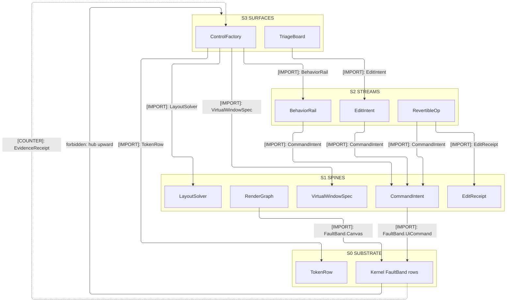
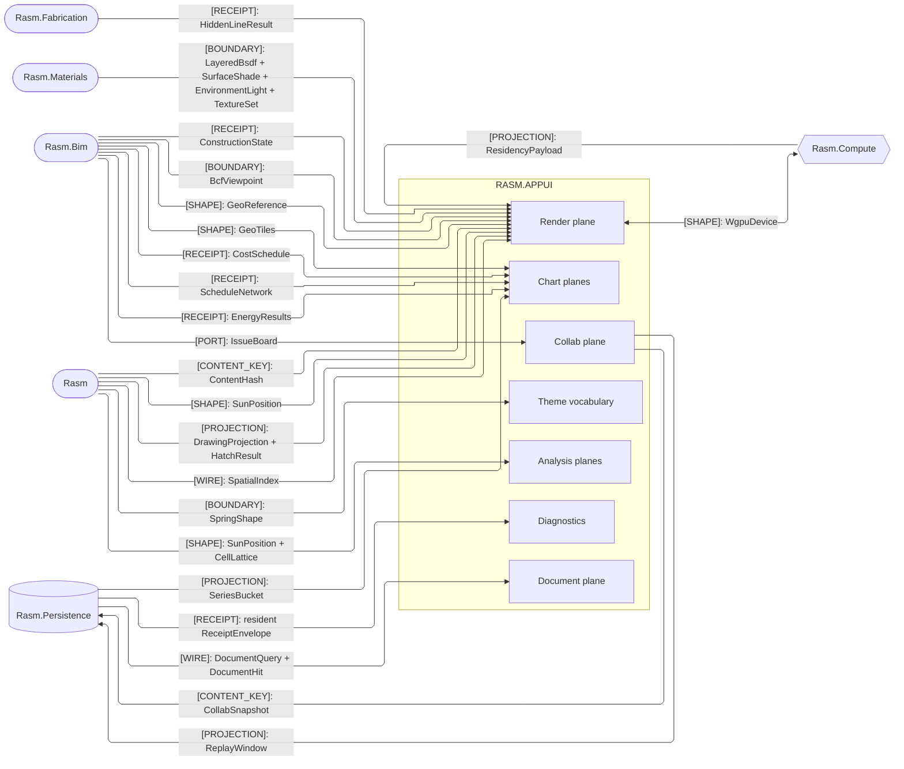
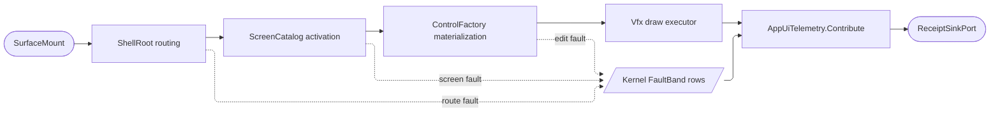

# [RASM_APPUI_ARCHITECTURE]

`Rasm.AppUi` maps the APP-PLATFORM Avalonia product surface over the settled receipt spine and the leased GPU device: one shell mounts every admitted host substrate, one control vocabulary materializes every surface, and each sub-domain fault family derives `RegistryFault<TCategory>` on its own kernel `FaultBand` row. S4 seats it as the consuming leaf — it references the platform peers downward, re-owns none of their capability, and never becomes the composition root.

## [01]-[DOMAIN_MAP]

```text codemap
Rasm.AppUi/
├── Shell/                # Host-mount axis and application shell spine
│   ├── Navigation.cs     # NavRequest union over the ShellRoot router; ShellDockFactory folds DockableRow rows through RegionProgram
│   ├── Screens.cs        # Frozen ScreenCatalog derivation table; ProductScreen owns activation, admission, and snapshot state
│   ├── Hosts.cs          # SurfaceMount union beside the profile-stated host class; one SurfaceSeam record carries the mount
│   ├── Commands.cs       # CommandIntent rows with payload union, the availability algebra seat, CommandDeck derivations
│   ├── Palette.cs        # Federated provider vocabulary, one merged rank fold, the binding editor over the frozen deck
│   ├── Queue.cs          # Run-queue surface: OutputState rows, Retriability-driven retry verbs, the queue instrument rows
│   ├── Controls.cs       # Closed ControlIntent [Union] seating arity, provider, modality, and emphasis as case columns
│   ├── Solver.cs         # LayoutConstraint equality, inequality, and priority algebra; the Cassowary-backed panel seat
│   ├── Virtualization.cs # VirtualWindow viewport-range realization at constant cost; control-recycling columns
│   ├── Dialogs.cs        # DialogIntent union over per-root Interaction seams; StackOwner binding and Fin-railed results
│   ├── Input.cs          # GesturePolicy chord derivation, behavior trigger and action rows, the frozen PanZoomRow family
│   └── Accessibility.cs  # ScreenCatalogRow automation columns, KeyboardNavigation reachability, the luminance gate fold
├── Render/               # GPU viewport, temporal plane, and the 2D documentation legs
│   ├── Pipeline.cs       # Pass-DAG over the leased GRContext; GpuBackend rows carry Target delegates over the GpuBinding union
│   ├── Viewpoint.cs      # Viewpoint receipt with the OverrideState vocabulary; the ViewRegistry named-view address space
│   ├── Meshlets.cs       # ResidencyMeshlet descriptor reads; selection owner for bindless residency, prefetch, and instancing
│   ├── PathTrace.cs      # BVH build-and-refit, ReSTIR reservoirs, progressive denoise; ShadeSeam off the Materials values
│   ├── Shading.cs        # ShaderAssetCache keyed per GpuBackend beside the byte-budgeted native texture-plane cache
│   ├── Immersive.cs      # OpenXR session machine on the leased Wgpu device; the immersive deck composition root
│   ├── Reality.cs        # SplatSource and PointCloudSource decodes off the residency carrier; the CapturePass projection
│   ├── Capture.cs        # DrawSource capsule with Fin-railed Use; thumbnail variants and content-hashed encode rows
│   ├── Measure.cs        # SectionDrag handles and MeasureSession reads over one shared world-to-screen projection arrow
│   ├── Drafting.cs       # SheetSet axis, Viewport2D frames, DraftDimension records, the DraftEmit format dispatch
│   ├── CadWrite.cs       # One SheetEntity-to-CadDocument fold behind the DwgWriter/DxfWriter/SvgWriter rows
│   └── Animation.cs      # Track union, Keyframe value-plus-motion-token carrier, Timeline deterministic playhead
├── Charts/               # Chart, dashboard, and geo-basemap projection
│   ├── Grammar.cs        # ChartDatum over the ChartMagnitude carrier; ChartSpec admission with axes, marks, and legends
│   ├── Ink.cs            # ChartChrome role fold, the ChartInk resolver, and the ChartCategory/ChartFault family
│   ├── Streams.cs        # ChartStream feed rows, the shape-checked TransformRow chain, ChartReducer order statistics
│   ├── Tiles.cs          # DashboardTile union over one TileSource axis; the mount fold and the WatchRule alert rows
│   ├── Boards.cs         # BoardContext value, the placement fold, snapshot migration, the cross-filter brush index
│   ├── Custom.cs         # CustomVisual frozen layout catalog binding one VisualPayload case per row
│   ├── Basemap.cs        # Mapsui MapControl with BasemapSource tile rows and NTS overlay rows; EditManager Apply verbs
│   ├── Telemetry.cs      # TelemetryBoard row pinning EvidenceFan, frame objectives, store-profile receipts, EvidenceJoin
│   └── Climate.cs        # Declared diagram family lowering onto the chart plane, each row carrying its polar-split verdict
├── Analysis/             # Sealed study results as a scene, a comparison, and one environmental coordinate
│   ├── Layers.cs         # ResultLayer stack with study, input-digest, and run-history columns; ResultDomain legend resolution
│   ├── Compare.cs        # CompareAxis vocabulary; per-cell coordinate-triple binding under the shared channel set
│   └── Context.cs        # AnalysisContext value: site, civil moment, grain, climate scenario; the BudgetMeter pre-solve gate
├── Editing/              # Typed-edit surfaces over the model
│   ├── Inspector.cs      # InspectorPolicy admission capsule, ranked EditorFactory rows, the EditFault/EditReceipt commit rail
│   ├── Conflict.cs       # ThreeWay region alignment carrying one HunkVerdict each; the HunkBands in-editor chrome
│   ├── CodePane.cs       # EditorInk correspondence, the RasmRegistry grammar locator, the CodePane custody chain
│   ├── Tables.cs         # TableColumnRow metadata family and the TableProjection fold across flat, tree, and grouped reads
│   ├── Forms.cs          # FormSchema typed sections over PropertyModels; the multi-selection batch-edit seat
│   ├── History.cs        # RevertDelta payloads with structural inverses over CancelableCommandRecorder and the ledger stream
│   ├── LiveData.cs       # DataSource axis with pacing policy, the filter and view-state pair, operator rows, OverlayRank merge
│   └── Graph.cs          # IDrawingNode/DrawingNodeEditor canvas, the QuikGraph cycle gate, LoroTree co-edit structure
├── Document/             # Reproducible document plane: the recompute projection and every paginated output
│   ├── Notebook.cs       # NotebookCell kind union with pinned capability fingerprints; code cells carry data only
│   ├── Media.cs          # MarkdownRenderer over typography rows, MediaSurface codec rows, the one Surfaces.Mount crossing
│   ├── Export.cs         # MigraDoc flow composition, PDFsharp policy hardening, OOXML writers, lcmsNET print-fidelity rows
│   ├── Search.cs         # SearchQuery closed request shape and SearchSource coverage rows projecting the landed owners
│   └── Board.cs          # BoardItem placement family: live frames with board-owned crop, stat cards, sheet frames, annotation
├── Collab/               # Live-collaboration plane over the durable Persistence spine
│   ├── Sync.cs           # CollabDoc LoroDoc container forest as live authority; the typed intent stream stays durable truth
│   ├── Presence.cs       # CollabWire frame transport on bounded channels; three presence channels and the overlay chrome
│   ├── Compare.cs        # TimeTravel inverse-intent revert and the two-cut compare session
│   ├── Issues.cs         # Issue composition of Viewpoint with the BCF topic; CommentLens, IssueRegister columns, IssueTile
│   ├── Tour.cs           # ReviewTour ordered TourStop sequence binding saved Viewpoints with dwell and motion tokens
│   └── Session.cs        # SessionRole rank rows, MembershipState lifecycle axis, MembershipOp verdict transitions
├── Diagnostics/          # Evidence, proof, dev loop, and quality governance
│   ├── Evidence.cs       # EvidenceReceipt case fold into the HLC-stamped sink; scope identity, dimensions, meter mount
│   ├── Proof.cs          # Capture, check, variant-density, benchmark, and replay cells off live catalogs; CsCheck and Verify seal
│   ├── DevLoop.cs        # Reload knob rows, the attach-config inspector row, HUD sample feed, FlameNode fold, solve scrub
│   └── Governor.cs       # PerfBudget fold over the GovernorState cell; hysteresis steps passes, residency, motion, XR together
├── Vfx/                  # Owned effects plane over the one draw capsule
│   ├── Material.cs       # Layer capsule bracketing draws over a compositor-painted ground; filter-term rows, the sample contract
│   ├── Shader.cs         # Compiled-once SkSL roster, the per-frame uniform frame, path-effect family, byte-ceiling tile cache
│   └── Compose.cs        # Slot vocabulary keyed by compositor property names; keyframe mint under the duration floor, trigger maps
└── Theme/                # Pure vocabulary every visual literal in the package resolves through
    ├── Tokens.cs         # Appearance seed rows folded into the TokenKey ladder; the Severity family, colormap catalog, variant and density axes
    ├── Semi.cs           # SemiSlot correspondence with SemiExclusion verdicts and the walked-roster conformance rail
    ├── Emission.cs       # Variant-partitioned dictionary emission; ThemeCell swap capsule; ThemeRail Styles chain; SkinRow table
    ├── Typography.cs     # TypographyRole rhythm rungs with the orthogonal TypeAxis; the itemizing shaping rail seat
    ├── Motion.cs         # MotionToken rows carrying one MotionTiming modality and a reduced-motion delegate each
    ├── Assets.cs         # IconRow registry of kernel AssetOrigins; IconSurface composes IconRender with pose and filter chain
    └── Locale.cs         # LocaleRow culture axis and the ResolvedLocale binding; per-script shaping, calendar-bound patterns
```

## [02]-[STRATA]

Member-resolved strata order the interior, and every consumption edge points down.

- S0 hub — `Diagnostics/Evidence` seats lowest; `EvidenceReceipt` NESTS producer receipts as co-ownership, so the fan adds no upward import.
- S0 substrate — fault families seat beside the hub, so a raising sub-domain adds a consumer and no code range collides with a sibling's.
- S0 vocabulary — pure `Theme`: every visual literal traces to a generated `TokenRow`, and the swap re-seeds atomically.
- S1 spines — one owner per fabric, so a second table serving one fabric is the forked-spine defect.
- S1 law — spines consume S0 alone and never each other, so the rank holds no lateral edge.
- S2 streams — streams fold spine facts into live authorities; `Collab/Sync` is the one concurrent-edit truth every surface reads.
- S3 surfaces — materialization is total: no screen body spells a control outside the factory, so S3 adds consumers and never vocabulary.
- S3 planes — notebook, export, screen, and analysis planes share the rungs; `ResultLayer` seats highest, reading spine, legend, and queue at once.


```mermaid
---
config:
  layout: elk
  flowchart:
    curve: linear
    padding: 25
---
flowchart TB
    accTitle: Rasm.AppUi interior strata
    accDescr: Which lower vocabulary each spine, stream, and surface owner consumes, and the EvidenceReceipt counter-edge the hub nests.
    subgraph S3["S3 SURFACES"]
        Factory[ControlFactory]
        Board[TriageBoard]
    end
    subgraph S2["S2 STREAMS"]
        Rail[BehaviorRail]
        Intent[EditIntent]
        Revert[RevertibleOp]
    end
    subgraph S1["S1 SPINES"]
        Command[CommandIntent]
        Virtual[VirtualWindowSpec]
        Solver[LayoutSolver]
        Inspect[EditReceipt]
        Graph[RenderGraph]
    end
    subgraph S0["S0 SUBSTRATE"]
        Fault[Kernel FaultBand rows]
        Token[TokenRow]
    end
    Factory e1@-->|"[IMPORT]: VirtualWindowSpec"| Virtual
    Factory e2@-->|"[IMPORT]: LayoutSolver"| Solver
    Factory e3@-->|"[IMPORT]: BehaviorRail"| Rail
    Factory e4@-->|"[IMPORT]: TokenRow"| Token
    Board e5@-->|"[IMPORT]: EditIntent"| Intent
    Rail e6@-->|"[IMPORT]: CommandIntent"| Command
    Revert e7@-->|"[IMPORT]: CommandIntent"| Command
    Revert e8@-->|"[IMPORT]: EditReceipt"| Inspect
    Intent e9@-->|"[IMPORT]: CommandIntent"| Command
    Command e10@-->|"[IMPORT]: FaultBand.UiCommand"| Fault
    Graph e11@-->|"[IMPORT]: FaultBand.Canvas"| Fault
    Fault e12@-.->|"[COUNTER]: EvidenceReceipt"| Factory
    Fault f1@-->|"forbidden: hub upward"| S3
```

## [03]-[SEAMS]

Seam fences split by counterpart role: the first binds the same-branch AEC peers, the kernel, and the durable store; the second binds the platform host and the TypeScript peers. Each collapsed edge stands for every contract between that owner and that partner at the load-bearing kind, and the rows below state the per-edge exceptions alone.


```mermaid
---
config:
  layout: elk
  flowchart:
    curve: linear
    padding: 25
---
flowchart LR
    accTitle: AppUi AEC-domain, render-source, and storage seams
    accDescr: Which projections, shapes, receipts, boundaries, ports, wires, and content keys cross between the AppUi owners and their C# peers.
    subgraph appui[RASM.APPUI]
        Render[Render plane]
        Charts[Chart planes]
        Collab[Collab plane]
        Document[Document plane]
        Analysis[Analysis planes]
        Theme[Theme vocabulary]
        Diagnostics[Diagnostics]
    end
    Compute{{Rasm.Compute}}
    Fabrication([Rasm.Fabrication])
    Materials([Rasm.Materials])
    Bim([Rasm.Bim])
    Rasm([Rasm])
    Persistence[(Rasm.Persistence)]
    Compute e1@-->|"[PROJECTION]: ResidencyPayload"| Render
    Render e2@<-->|"[SHAPE]: WgpuDevice"| Compute
    Fabrication e3@-->|"[RECEIPT]: HiddenLineResult"| Render
    Materials e4@-->|"[BOUNDARY]: LayeredBsdf + SurfaceShade + EnvironmentLight + TextureSet"| Render
    Rasm e5@-->|"[CONTENT_KEY]: ContentHash"| Render
    Rasm e6@-->|"[SHAPE]: SunPosition"| Render
    Rasm e7@-->|"[PROJECTION]: DrawingProjection + HatchResult"| Render
    Rasm e8@-->|"[WIRE]: SpatialIndex"| Render
    Rasm e9@-->|"[BOUNDARY]: SpringShape"| Theme
    Rasm e10@-->|"[SHAPE]: SunPosition + CellLattice"| Analysis
    Bim e11@-->|"[SHAPE]: GeoTiles"| Charts
    Bim e12@-->|"[RECEIPT]: CostSchedule"| Charts
    Bim e13@-->|"[RECEIPT]: ScheduleNetwork"| Charts
    Bim e14@-->|"[RECEIPT]: EnergyResults"| Charts
    Persistence e15@-->|"[PROJECTION]: SeriesBucket"| Charts
    Persistence e16@-->|"[RECEIPT]: resident ReceiptEnvelope"| Diagnostics
    Bim e17@-->|"[PORT]: IssueBoard"| Collab
    Collab e18@-->|"[PROJECTION]: ReplayWindow"| Persistence
    Collab e19@-->|"[CONTENT_KEY]: CollabSnapshot"| Persistence
    Persistence e20@-->|"[WIRE]: DocumentQuery + DocumentHit"| Document
    Bim e21@-->|"[RECEIPT]: ConstructionState"| Render
    Bim e22@-->|"[BOUNDARY]: BcfViewpoint"| Render
    Bim e23@-->|"[SHAPE]: GeoReference"| Render
```


```mermaid
---
config:
  layout: elk
  flowchart:
    curve: linear
    padding: 25
---
flowchart LR
    accTitle: AppUi platform-host and cross-runtime wire seams
    accDescr: AppUi owners exchanging wires, receipts, ports, transport, and the fault-band adjacency with the app host and the TypeScript peers.
    subgraph appui[RASM.APPUI]
        Shell[Shell spine]
        Render[Render plane]
        Document[Document plane]
        Collab[Collab plane]
        Diagnostics[Diagnostics]
    end
    AppHost{{Rasm.AppHost}}
    Rasm([Rasm])
    Core([typescript:core])
    Ui([typescript:ui])
    Shell e1@-->|"[WIRE]: CommandPayloadWire"| Core
    Render e2@-->|"[WIRE]: GeometryResidencyWire"| Core
    Diagnostics e3@-->|"[WIRE]: EvidenceTimelineWire"| Core
    Shell e4@-->|"[WIRE]: ControlIntentWire + CommandGateWire + LayoutConstraintWire"| Ui
    AppHost e5@-->|"[PORT]: DeterminismContext"| Document
    Diagnostics e6@<-->|"[FAULT]: FaultBand"| AppHost
    Rasm e7@-->|"[PORT]: ReceiptSinkPort + InstrumentSpec + Slo"| Diagnostics
    AppHost e8@-->|"[PORT]: HookRail"| Diagnostics
    AppHost e9@-->|"[PORT]: ProfileSampleSource"| Diagnostics
    Collab e10@<-->|"[TRANSPORT]: CollabWireContext"| AppHost
```

- `[BOUNDARY]: LayeredBsdf + SurfaceShade + EnvironmentLight + TextureSet` — Render supplies the point, the UV, the mip level, and the device.
- `[CONTENT_KEY]` edges collapse to one mint idiom, and Compute-minted residency and splat keys stay decode-only.
- `[PROJECTION]: ResidencyPayload` — clusters arrive decoded, so the path tracer builds its private BVH over their bounds and re-clusters nothing.
- `[PROJECTION]: ReplayWindow` — AppUi parameterizes the read and scans no ledger; the `(ElementId, DiffClass)` classification renders as overrides.
- `[PROJECTION]: SeriesBucket` — each store tile names its facet coordinate beside its rollup posture, reached through one injected read arrow.
- `[RECEIPT]: ConstructionState` — `SchedulePlayback.FromSchedule` reads `ConstructionState.At` and `TaskKind` as Bim-owned 4D schedule values.
- `[RECEIPT]: resident ReceiptEnvelope` — `EvidenceSource.Resident` hands back the envelopes the live sink held, so join and accrual stay one fold.
- `[SHAPE]: SunPosition + CellLattice` — `BudgetMeter` hands the cell ceiling to `CellLattice.Of`, so the previewed lattice IS the solved one.
- Profiling custody, the pg_stat slots, and the `store.<domain>.<verb>` grammar stay Persistence-side.
- `[PORT]: DeterminismContext` — AppHost composes its runtime port spine at app composition, and `CapabilityPin` anchors it.
- `[PORT]: ReceiptSinkPort + InstrumentSpec + Slo` — telemetry PROJECTS facts through `TelemetryContributorPort` on the `TelemetrySource.AppUi` meter.
- `[PORT]: HookRail` — AppHost's half is the receipt point the evidence fan taps as one observe subscription.
- `[PORT]: ProfileSampleSource` — capture stays AppHost-side and `FlameNode.Of` folds the arriving samples into the frame tree.
- Samples carry the producer's symbolization posture, so AppUi renders the frames it received and resolves no address itself.
- Feed rides an existing AppHost port row, never a new `PortCardinality` port.
- `[TRANSPORT]: CollabWireContext` — `Collab/presence` frames each delta with its W3C carrier beside the Loro bytes on bounded lanes.
- Merge extracts the originating correlation, and `CollabCarrier` binds the frame's getter and setter pair onto the AppHost `TraceContext` spine.
- AppHost's reciprocal is landed data: durable deltas ride `Topic.Collab` on the outbox leg and awareness frames ride `Topic.Presence`.
- `[FAULT]: FaultBand` — AppHost's lifecycle rows pin the reciprocal range, so no fault code collides across the platform seam.

## [04]-[INTERNAL]

One mount-then-route spine orders the interior: the mount precedes the shell, the shell precedes the screens it routes, and every screen reaches the draw executor through the control factory.


```mermaid
---
config:
  layout: elk
  flowchart:
    curve: linear
    padding: 25
---
flowchart LR
    accTitle: Rasm.AppUi mount-to-receipt spine
    accDescr: How a mounted surface routes through shell, screens, and controls onto the draw executor while faults converge on the band.
    Mount(["SurfaceMount"]) e1@--> Route["ShellRoot routing"]
    Route e2@--> Screen["ScreenCatalog activation"]
    Screen e3@--> Control["ControlFactory materialization"]
    Control e4@--> Draw["Vfx draw executor"]
    Draw e5@--> Spine["AppUiTelemetry.Contribute"]
    Spine e6@--> Sink(["ReceiptSinkPort"])
    Route f1@-.->|"route fault"| Band[/Kernel FaultBand rows/]
    Screen f2@-.->|"screen fault"| Band
    Control f3@-.->|"edit fault"| Band
    Band f4@--> Spine
```

- Faults lift where they are raised and converge on the kernel band ahead of the telemetry spine, so one seal carries route, screen, and edit alike.

## [05]-[BOUNDARIES]

- Element selection enters as receipts scope-qualified at `Rasm.Bim` `Model/query` or `Rasm.Persistence` `Query/lane`; AppUi runs no query engine.
- Cost and schedule boards consume the Bim `CostSchedule` and `ScheduleNetwork` planning receipts as `Charts/streams` plan-feed values.
- Caption capture and band rendering belong to `Document/media`; `Theme/locale` owns the caption language and translation policy the capture reads.
- Kernel `Analyze` receipt projection enters inspector and dashboard surfaces through the receipt spine.
- `SurfaceMount.Panel` mounts on an embedded host surface only when a Rhino lease supplies `EmbedCapsule` and the `Render/pipeline` GPU lease.
- `Surfaces` mount gate admits a production view only as its compiled-XAML class, so a runtime XAML load has no mount path.
- Avalonia owns GPU backend selection through `EmbedOptions.RenderingMode`; no dispatch arm constructs a per-host `GpuBackend` or `GRContext`.
- `ONE_WGPU_DEVICE` fixes the wgpu arity this folder mints — one core, one `Wgpu` view, one compositor-matched `Adapter`, `Device`, and `Queue`.
- Every binder — immersive session, shading arm, query-set owner, Compute dispatch — binds that leased pair and holds `nint` handles alone.
- `Offscreen` capsule owns the one Skia draw boundary and every `SKSurface` inside it.
- `DrawSource.Layered` is the one `SaveLayer` site; `Vfx/material` selects its ground arm and supplies its `LayerSpec`.
- `Vfx` EXECUTES the `Theme` material, wash, and motion rows; a value authored on an effects page is a second token source the swap never re-seeds.
- Runtime-SkSL compilation partitions by type domain — 3D appearance at `Render/shading`, 2D chrome at `Vfx/shader`, one cache each.
- `BehaviorRail` intent bridge is the single C# view-binding seam and rejects binder symbols, so ReactiveUI code-behind binding has no seam to enter.
- `AppUiTelemetry.Contribute` is the one spine every owner routes image-load, telemetry, and receipt facts through.
- Every receipt stays a typed record sealed at `ReceiptSinkPort`.
- `CommandIntent` table is the one verb registry — hotkey, palette, and conflict views are derivation folds over it.
- `ControlIntent` union through `ControlFactory` materializes every control.
- `LayoutConstraint` algebra solved by one `LayoutSolver` panel owns every layout.
- `VirtualWindow` over `DynamicData` change-sets owns every windowed surface.
- Every AppUi fault family takes its roster name from its kernel `FaultBand` row, and the offsets inside that row are frozen wire facts.
- Durable truth is the one `EditIntent` union projected onto Persistence-owned `OpLogEntry` rows.
- Loro snapshots survive only as content-keyed cold-start accelerators.
- `RevertibleOp` folds forward and inverse deltas across the recorder and the durable inverse stream.
- `Rasm.Bim` owns openBIM and coordination semantics; AppUi keeps the `Viewpoint` board projection alone.
- Every AppUi content hash composes the one kernel `ContentHash.Of` seed-zero entry, the branch's frozen content-key entry.
- Bim, the `Rasm` kernel, and the AppHost `RecomputeGraph` own geodesy, solar position, clustering, and recompute.
- `Rasm.Materials` owns appearance whole — channel roster, texture-plane storage, decode ladder, set admission, prefiltered dome, resolved solar disc.
- Render-side appearance machinery has no seam to enter; Render binds the values and holds the device.
- Texture-plane VRAM budgets at `Render/shading` under the byte-ceiling law `Render/meshlets` `ResidencyBudget` holds for geometry VRAM.
- Every analysis value projects a sealed receipt — `Analysis` mounts, probes, compares, and bakes what a study produced, solving nothing itself.
- `Analysis/context` `AnalysisContext` is the ONE environmental coordinate every layer, diagram, sun-position consumer, and bound series reads.
- `Shell/queue` `RunQueueSurface.AdoptIntent` reaches `Analysis/layers` `AnalysisLayers.Adopt`, the one construction site for a sealed study.
- Expressiveness partitions angular rendering at the polar split; `Charts/climate` states each family's verdict beside its structural reason.
