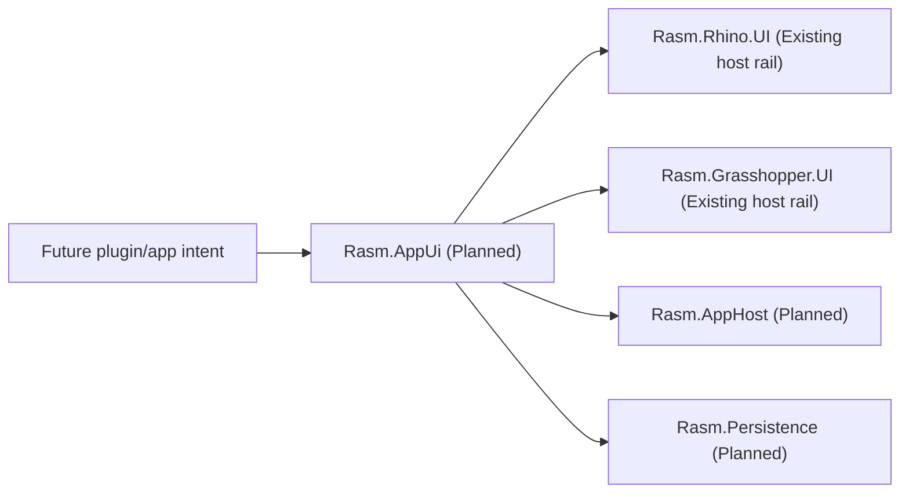

# [H1][RASM_APPUI_ARCHITECTURE]
>**Dictum:** *Product UI is one typed intent rail lowered through host-owned execution.*

 

`Rasm.AppUi` is a planned platform boundary above `Rasm.Rhino.UI` and `Rasm.Grasshopper.UI`. It captures product UI intent, state, visual requests, diagnostics, and receipts without duplicating Rhino/GH2 dispatch, repaint, undo, document affinity, or lifecycle policy.

---
## [1][CURRENT_STATUS]
>**Dictum:** *Planned nodes must be marked planned.*

 

| [INDEX] | [ITEM] | [STATE] |
| :-----: | ------ | ------- |
|   [1]   | Folder | Documentation stub |
|   [2]   | `.csproj` | Absent |
|   [3]   | Production C# | Absent |
|   [4]   | Candidate packages | Not in graph |
|   [5]   | Host runtime proof | Pending future source slice |

---
## [2][PUBLIC_RAIL_CONTRACT]
>**Dictum:** *The rail names product concepts, not toolkit classes.*

 

| [INDEX] | [CONCEPT] | [OWNS] | [DOES_NOT_OWN] |
| :-----: | --------- | ------ | -------------- |
|   [1]   | Shell | Product shell state, mode, route, visibility intent | Native window parenting |
|   [2]   | Screen | View identity, command availability, validation surface | Toolkit ViewModel base classes |
|   [3]   | Command | User action intent, result, receipt | Rhino/GH2 undo execution |
|   [4]   | Live View | Read-only projection from domain/AppHost/Persistence state | DynamicData public exposure |
|   [5]   | Visual Request | Chart, HUD, preview, overlay intent | Host paint hook lifecycle |
|   [6]   | Diagnostic Receipt | UI lifecycle, activation, focus, disposal, screenshot evidence | Generic receipt ledger |

The future public entry point should accept typed app-surface operations as data and return typed outcomes/receipts. Toolkit types stay internal unless a real consumer proves they must cross the boundary.

---
## [3][HOST_DELEGATION]
>**Dictum:** *AppUi aggregates; host rails execute.*

 

| [INDEX] | [APPUI_INTENT] | [RHINO_RAIL] | [GH2_RAIL] | [FORBIDDEN_DUPLICATE] |
| :-----: | -------------- | ------------ | ---------- | --------------------- |
|   [1]   | Window/shell | `RhinoUi.Use`, `UiIntent.Window`, `UiWindowSpec` | Editor/canvas rails as applicable | New parent-window resolver |
|   [2]   | Panel | `PanelOp` | GH2 editor surface rail | Parallel panel registry |
|   [3]   | Repaint | `RedrawTarget`, Rhino UI paint rails | `RepaintRequest`, paint hook rails | Manual redraw scheduler |
|   [4]   | Host scope | Rhino document scope | GH2 document/canvas scope | Global static UI context |
|   [5]   | Visuals | `UiHud`, `UiCanvas`, marks/surfaces | `DrawPlan`, `PaintScope` | Toolkit-first host renderer |
|   [6]   | Lifecycle | Host rail disposal receipts | Subscription and hook disposal | AppUi-owned host teardown |

macOS support means coexistence inside RhinoWIP/GH2, not generic desktop success.

---
## [4][CANDIDATES]
>**Dictum:** *Candidate packages describe possible implementation lanes.*

 

| [INDEX] | [CANDIDATE] | [ROLE] | [GATE] |
| :-----: | ----------- | ------ | ------ |
|   [1]   | Host Eto / Rhino.UI assemblies | Host shell, parent, modal, panel truth | Local RhinoWIP API proof |
|   [2]   | Avalonia | Retained app UI surface | RhinoWIP/GH2 coexistence proof |
|   [3]   | ReactiveUI | ViewModel activation, commands, scheduler boundaries | One-screen rail proof |
|   [4]   | ReactiveUI.Avalonia | Adapter candidate reselected at first consumer | Listed compatible package proof |
|   [5]   | DynamicData | Internal live collection projection | Read-only public projection proof |
|   [6]   | SkiaSharp | Custom visuals, thumbnails, offscreen render receipts | Native asset, Retina, disposal proof |
|   [7]   | ImGui.NET | Internal debug overlay only | Renderer/input/shutdown proof |

Do not mix MVVM idioms inside one screen stack.

---
## [5][PROOF_STATES]
>**Dictum:** *Runtime status is per host and per capability.*

 

| [INDEX] | [STATE] | [MEANING] |
| :-----: | ------- | --------- |
|   [1]   | Candidate | Named in docs, not in graph |
|   [2]   | Referenced | Versionless `PackageReference` exists in a project |
|   [3]   | Loaded | Host process loads package/native assets |
|   [4]   | Runtime-Proven | Owner receipt records host scenario evidence |
|   [5]   | Rejected | Proof fails or duplicates host rail |

Evidence categories: RhinoWIP macOS load, GH2 coexistence, host parent identity, focus/keyboard/z-order, Retina scale, native asset layout, screenshot, disposal/unload, accessibility, support-bundle diagnostics.

---
## [6][SOURCE_ANCHORS]
>**Dictum:** *Sources justify candidates; they do not pin versions.*

 

| [INDEX] | [SOURCE] | [USE] |
| :-----: | -------- | ----- |
|   [1]   | [Avalonia macOS](https://docs.avaloniaui.net/docs/platform-specific-guides/macos) | macOS backend and TFM considerations |
|   [2]   | [Avalonia native interop](https://docs.avaloniaui.net/docs/app-development/native-interop) | native embedding risk |
|   [3]   | [ReactiveUI activation](https://www.reactiveui.net/documentation/handbook/when-activated/) | activation/disposal contract |
|   [4]   | [DynamicData collections](https://www.reactiveui.net/docs/handbook/collections.html) | internal live projection guidance |
|   [5]   | [ReactiveUI.Avalonia NuGet](https://www.nuget.org/packages/ReactiveUI.Avalonia/) | adapter candidate reselection |
