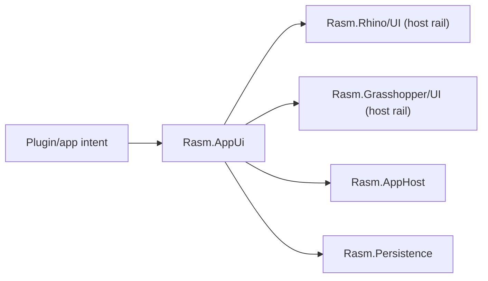

# [H1][RASM_APPUI_ARCHITECTURE]
>**Dictum:** *Product UI is one typed intent rail lowered through host-owned execution.*

<br>

`Rasm.AppUi` is the platform boundary above `Rasm.Rhino/UI` and `Rasm.Grasshopper/UI`. It captures product UI intent, state, visual requests, diagnostics, and receipts through one unified rail, without duplicating Rhino/GH2 dispatch, repaint, undo, document affinity, or lifecycle policy.

---
## [1][BUILD_STATUS]
>**Dictum:** *Build fully and unified from the first commit.*

<br>



| [INDEX] | [ITEM]                | [STATE]                  |
| :-----: | --------------------- | ------------------------ |
|   [1]   | Folder                | Active build             |
|   [2]   | `.csproj`             | Present in `Workspace.slnx` |
|   [3]   | Production C#         | In progress              |
|   [4]   | Package references    | Active direct; every pinned AppUi package is referenced |
|   [5]   | Host runtime evidence | Per host scenario        |

---
## [2][PUBLIC_RAIL_CONTRACT]
>**Dictum:** *The rail names product concepts, not toolkit classes.*

<br>

| [INDEX] | [CONCEPT]          | [OWNS]                                                            | [DOES_NOT_OWN]                 |
| :-----: | ------------------ | ----------------------------------------------------------------- | ------------------------------ |
|   [1]   | Shell              | Product shell state, mode, route, visibility intent               | Native window parenting        |
|   [2]   | Screen             | View identity, command availability, validation surface           | Toolkit ViewModel base classes |
|   [3]   | Command            | User action intent, result, receipt                               | Rhino/GH2 undo execution       |
|   [4]   | Live View          | Read-only projection from domain/AppHost/Persistence state        | DynamicData public exposure    |
|   [5]   | Visual Request     | HUD, preview, overlay intent over the viewport                    | Toolkit-owned viewport render  |
|   [6]   | Chart / Dashboard  | Retained data-viz panels: series, axes, interaction (LiveCharts2) | Viewport overlay rendering     |
|   [7]   | Diagnostic Receipt | UI lifecycle, activation, focus, disposal, screenshot evidence    | Generic receipt ledger         |

The public entry accepts typed app-surface operations as data and returns typed outcomes/receipts. Toolkit types stay internal; product concepts cross the boundary.

---
## [3][HOST_DELEGATION]
>**Dictum:** *AppUi aggregates; host rails execute.*

<br>

| [INDEX] | [APPUI_INTENT] | [RHINO_RAIL]                                     | [GH2_RAIL]                         | [FORBIDDEN_DUPLICATE]       |
| :-----: | -------------- | ------------------------------------------------ | ---------------------------------- | --------------------------- |
|   [1]   | Window/shell   | `RhinoUi.Use`, `UiIntent.Window`, `UiWindowSpec` | Editor/canvas rails as applicable  | New parent-window resolver  |
|   [2]   | Panel          | `PanelOp`                                        | GH2 editor surface rail            | Parallel panel registry     |
|   [3]   | Repaint        | `RedrawTarget`, Rhino UI paint rails             | `RepaintRequest`, paint hook rails | Manual redraw scheduler     |
|   [4]   | Host scope     | Rhino document scope                             | GH2 document/canvas scope          | Global static UI context    |
|   [5]   | Visuals        | `UiHud`, `UiCanvas`, marks/surfaces              | `DrawPlan`, `PaintScope`           | Toolkit-first host renderer |
|   [6]   | Lifecycle      | Host rail disposal receipts                      | Subscription and hook disposal     | AppUi-owned host teardown   |

macOS support means coexistence inside RhinoWIP/GH2, not generic desktop success.

[CRITICAL] Avalonia owns panel, dialog, and companion-window surfaces only. It never renders over the native viewport: native content always composites above Avalonia, so HUDs and marks over the 3D scene render through the Rhino/GH display conduit only — **AppUi SkiaSharp is thumbnails and offscreen draw only**; viewport-overlay SkiaSharp lives exclusively in the Rhino/GH display conduit.

[CRITICAL] Embedding rules — all mandatory, all host-fatal if violated:
- `MacOSPlatformOptions.DisableAvaloniaAppDelegate = true` — must be set before any Avalonia surface initializes; omission hands the `NSApplicationDelegate` slot to Avalonia and crashes the Rhino host process on load.
- Use `CreateEmbeddableTopLevel()`, not `CreateEmbeddableWindow()` — `CreateEmbeddableWindow` is unimplemented on macOS.
- TFM is plain `net10.0`; do not use `net10.0-macos`. NSView reparenting is an isolated P/Invoke shim: call `objc_msgSend` over Avalonia `TryGetPlatformHandle()` `IntPtr` and Eto's native handle to embed the Avalonia `TopLevel` as a child NSView — no `[SupportedOSPlatform]` attribute flood, no `net10.0-macos` TFM.
- Validate embedding with **Software rendering before Metal** — Metal path integration with the Rhino Metal command queue is unproven; verify software first, then promote.
- Embed as child NSView inside the host `RasmPanel`; never float an independent `NSWindow` — an independent window competes with the Rhino viewport for the macOS Metal command queue.
- On `PanelHidden`: resign first responder and set `Content = null` to detach Avalonia content before the Eto panel disposes; failing to resign first responder leaves keyboard routing broken after the panel reopens.
- On `PanelShown`: restore content and return first responder — Eto/Avalonia focus is not auto-coordinated.
- Refresh scale on `NSWindowDidChangeBackingProperties` and inside `WhenActivated` — Retina scale changes mid-session on external display connection/removal.
- Await `TopLevel.Closed` before calling base dispose — disposing the Eto parent before the Avalonia TopLevel closes causes a native handle double-free.
- [DEFERRED] GH2-Avalonia embedding: the current GH2 SDK (RhinoWIP, decompiled `Grasshopper2.dll`) exposes no dockable plugin-panel registration API — there is no `Grasshopper2.UI.IPanel` or `RegisterPanel` equivalent; the editor is one GH2-owned Eto `Form`, and plugin surfaces are per-component `InputPanel`, `Grasshopper2.UI.Toolbar`, canvas paint hooks, and transient `FloatingForm` popups — none a persistent host for a retained Avalonia `TopLevel`. The canvas NSView is reachable (`Editor.Instance.Canvas.ControlObject as NSView`, proven in `Rasm.Grasshopper/UI`), but no persistent panel host exists. Do not attempt GH2 embedding until a GH2 panel-host API ships; trigger: `uv run python -m tools.quality api query gh2 Panel` on each WIP drop. Rhino-panel embedding remains the supported path.

---
## [4][PACKAGES]
>**Dictum:** *Integrated packages compose into one paradigm, never side by side.*

<br>

### [4.1][CORE_MATRIX]

Version matrix is coupled: Avalonia ↔ ReactiveUI.Avalonia ↔ ReactiveUI ↔ DynamicData ↔ System.Reactive ↔ SkiaSharp (Avalonia-bundled, LiveCharts2-aligned) — all as one set, not each in isolation. Central pins live in `Directory.Packages.props`; `Rasm.AppUi.csproj` references the active matrix versionlessly.

| [INDEX] | [PACKAGE]                              | [ROLE]                                                               |
| :-----: | -------------------------------------- | -------------------------------------------------------------------- |
|   [1]   | Host Eto / Rhino.UI assemblies         | Host shell, parent, modal, panel truth                               |
|   [2]   | `Avalonia`                             | Retained app UI surface                                              |
|   [3]   | `Avalonia.Desktop`                     | macOS backend (required for buildable macOS target)                  |
|   [4]   | `Avalonia.Fonts.Inter`                 | Required Inter font for a buildable macOS app                        |
|   [5]   | `ReactiveUI`                           | ViewModel activation, commands, scheduler boundaries                 |
|   [6]   | `ReactiveUI.Avalonia`                  | ViewModel/Avalonia adapter                                           |
|   [7]   | `ReactiveUI.Validation`                | Validation surface mechanism for `Screen` type                       |
|   [8]   | `DynamicData`                          | Internal live collection projection, read-only public projection     |
|   [9]   | `SkiaSharp`                            | Thumbnails and offscreen draw only (see §4.3 native hazard)          |
|  [10]   | `SkiaSharp.NativeAssets.macOS`         | Explicit arm64 native — `<ExcludeAssets>native</ExcludeAssets>` to share Rhino's in-process `libSkiaSharp` once the Phase-0 gate confirms a matching major (§4.3) |
|  [11]   | `SkiaSharp.HarfBuzz`                   | Text shaping (HarfBuzz is NOT bundled by Rhino — safe to carry)      |
|  [12]   | `HarfBuzzSharp.NativeAssets.macOS`     | HarfBuzz arm64 native asset                                          |
|  [13]   | `LiveChartsCore.SkiaSharpView.Avalonia` | Retained data-viz: charts, dashboards, gauges, SkiaSharp-rendered  |
|  [14]   | `Avalonia.Controls.DataGrid`           | Tabular data surfaces                                                |
|  [15]   | `Avalonia.Controls.ColorPicker`        | Color picker / palette surfaces                                      |
|  [16]   | `bodong.Avalonia.PropertyGrid`         | Integrated inspector/property-grid surface; custom-editor surface stays the documented fallback (single-maintainer package) |
|  [17]   | `Xaml.Behaviors.Avalonia`              | MVVM event triggers and drag-drop (replaces deprecated `Avalonia.Xaml.Interactions`) |
|  [18]   | `Projektanker.Icons.Avalonia`          | Icon glyph host                                                      |
|  [19]   | `Projektanker.Icons.Avalonia.MaterialDesign` | Material Design icon set                                       |
|  [20]   | `Svg.Controls.Skia.Avalonia`           | SVG icon and asset rendering                                         |
|  [21]   | `DialogHost.Avalonia`                  | In-panel dialogs — no NSWindow required                              |

### [4.2][PACKAGE_REJECTIONS]

| [INDEX] | [REJECTED_PACKAGE]               | [REASON]                                                                                 |
| :-----: | -------------------------------- | ---------------------------------------------------------------------------------------- |
|   [1]   | `FluentAvaloniaUI`               | Targets Avalonia 11; incompatible with the Avalonia 12 matrix                            |
|   [2]   | `Material.Avalonia`              | Full-theme takeover; conflicts with the controlled theming strategy                      |
|   [3]   | `Dock.Avalonia`                  | Floats NSWindow for docking — violates the host-panel embedding rule                     |
|   [4]   | `Avalonia.Controls.TreeDataGrid` | Avalonia 11 + commercial license                                                         |
|   [5]   | `ScottPlot.Avalonia`             | Avalonia 11 floor; duplicates LiveCharts2 on the chart rail                              |
|   [6]   | `MessageBox.Avalonia`            | Nightly-only dependency; use `DialogHost.Avalonia` instead                               |
|   [7]   | `Avalonia.Xaml.Interactions`     | Deprecated; replaced by `Xaml.Behaviors.Avalonia`                                       |

### [4.3][NATIVE_HAZARD]

[CRITICAL] SkiaSharp-native coexistence splits into one SETTLED fact and one STILL-OPEN gate; do not conflate them. SETTLED (bridge-verify of RhinoWIP 9.0): Rhino ships NO managed `SkiaSharp.dll` — `libSkiaSharp.dylib` is used only at the C++ level inside `RhCore.framework`, and RhinoCommon / Eto / Grasshopper2 carry no SkiaSharp dependency, so no managed assembly clash exists. Our `SkiaSharp` equals `Avalonia.Skia`'s exact dependency, unified across LiveCharts2 and `Svg.Skia`. STILL-OPEN (Phase-0 native gate, separate from the managed fact): macOS `dlopen` coalesces by install name (`@rpath/libSkiaSharp.dylib`) and SkiaSharp has no symbol isolation — two copies of a different native major CANNOT co-load. THE GATE: confirm Rhino's bundled `libSkiaSharp` native major (`find /Applications/RhinoWIP.app -name 'libSkiaSharp*'`, or a `bridge verify` scenario reading `SkiaSharpVersion.Native`). If it matches our major: reference `SkiaSharp.NativeAssets.macOS` with `<ExcludeAssets>native</ExcludeAssets>` and share Rhino's loaded dylib — no second copy ships. If it differs: same-named dylibs cannot co-load and Avalonia 12 cannot downgrade Skia, so this is a hard build gate (offscreen/out-of-process Skia, or escalate). `HarfBuzzSharp.NativeAssets.macOS` is carried unconditionally — not in the Rhino bundle.

Layout: cohesive flat files — `Shell.cs`, `Screen.cs`, `Command.cs`, `Live.cs`, `Visual.cs`, `Chart.cs`, `Diagnostic.cs` — each with canonical sections; UI scheduler boundary co-locates with ReactiveUI activation in `Screen.cs`. No per-concept subfolders or mini-files.

---
## [5][TYPE_SHAPES]
>**Dictum:** *Named types have defined shapes before any code lands.*

<br>

### [5.1][SCHEDULER]

`RasmUiScheduler` — sealed record; unifies Avalonia `Dispatcher` and ReactiveUI `RxApp.MainThreadScheduler`. Constructed once on the UI thread in `PlugIn.OnLoad`, before any live-projection work. Passed into `AppHost.Boot(token, timeProvider, uiScheduler, …)` so AppHost references it without owning it — non-circular.

```
RasmUiScheduler
  Dispatcher   : Avalonia.Threading.Dispatcher   // ObserveOn / InvokeAsync
  RxScheduler  : IScheduler                      // RxApp.MainThreadScheduler wrapper
```

### [5.2][SHELL]

`Shell` — sealed record; product shell state, route identity, and nav-stack ownership. `AppState` (from Persistence) is an immutable point-in-time domain snapshot; `Shell` is the UI navigation and visibility layer — they do not collide.

```
Shell
  Route        : RouteId                          // discriminated union of named routes
  NavStack     : ImmutableStack<RouteId>          // activation history
  Mode         : ShellMode                        // Normal | Compact | Overlay
  Visibility   : ShellVisibility                  // Visible | Hidden | Minimized
```

Route = route identity + nav-stack owner + activation; Shell-state is not AppState.

### [5.3][SCREEN]

`Screen<T>` — `ReactiveValidationObject` (from `ReactiveUI.Validation`); `T` is the domain model slice the screen projects. Owns view identity, command availability, and the validation surface. Toolkit base type (`ReactiveObject`, `ReactiveValidationObject`) stays internal.

```
Screen<T>
  ViewId       : ScreenId                         // stable screen identity
  Model        : T                                // read-only domain slice
  Commands     : IReadOnlyList<Command>           // available commands in context
  Validation   : ValidationContext                // ReactiveUI.Validation surface
  Activator    : ViewModelActivator               // WhenActivated / CompositeDisposable
```

### [5.4][COMMAND_AND_RECEIPT]

```
Command
  Id           : CommandId                        // stable identity
  Label        : string
  CanExecute   : IObservable<bool>
  Execute      : ReactiveCommand<Unit, CommandReceipt>

CommandReceipt
  CommandId    : CommandId
  Outcome      : CommandOutcome                   // Ok | Cancelled | Faulted
  HostDelegated: bool                             // true = lowered to Rhino/GH2 rail
  Elapsed      : TimeSpan
```

### [5.5][LIVE_VIEW]

`LiveView<T>` — DynamicData-backed read-only projection. `T` is the projected model type. Subscriptions managed via `WhenActivated`/`CompositeDisposable`; disposal on `Screen` deactivation. Never exposes `SourceCache` or change-sets publicly.

```
LiveView<T>
  Items        : IObservable<IChangeSet<T, Guid>>  // internal; bound on UI scheduler
  Snapshot     : IObservable<IReadOnlyList<T>>     // public projection
```

### [5.6][CHART_DASHBOARD]

```
ChartVm
  Series       : ObservableCollection<ISeries>    // LiveCharts2 series
  Axes         : ObservableCollection<IAxis>      // X/Y axes
  Legend       : LegendPosition
  UpdateOn     : RasmUiScheduler                  // series updates marshalled onto UI scheduler
```

### [5.7][DIAGNOSTIC_RECEIPT]

`DiagnosticReceipt` is AppUi-owned; AppHost may reference/correlate it but does not define it.

```
DiagnosticReceipt
  PanelId      : PanelId
  Event        : DiagnosticEvent                  // Activated | Focused | Hidden | Disposed | Screenshot
  Timestamp    : NodaTime.Instant
  ParentHandle : nint                             // native NSView handle at event time
  Scale        : double                           // backing scale factor
  ScreenshotPath : string?                        // .artifacts path when Event = Screenshot
  Fault        : string?                          // non-null on Disposed with exception
```

### [5.8][APP_STATE_PROJECTION]

`AppState` is defined and owned by `Rasm.Persistence` — a minimal read-only sealed record (point-in-time snapshot). AppUi consumes it as `IObservable<AppState>` via `ObserveOn(RasmUiScheduler.RxScheduler)`. Fields consumed by AppUi (read-only, no write-back):

```
AppState
  ActivePresets   : ImmutableList<PresetKey>
  SessionMetadata : ImmutableList<SessionSummary>
  CacheStatus     : CacheStatusSummary
  SchemaVersion   : int
  OpCounts        : StoreOpCounts
```

### [5.9][PARADIGM]

View layer: ReactiveUI (`ReactiveCommand` / `IObservable<T>` / VMs). App-surface rail lowers typed operations → `CommandReceipt`. Cross-folder work runs as `Eff<RT, T>` inside AppHost's runtime record. AppUi submits intents and consumes typed receipts and observables — it never carries `Eff` directly.

---
## [6][COMPOSITION]
>**Dictum:** *One scheduler spine; inbound contracts parameterized, fired when siblings land.*

<br>

[CRITICAL] Bootstrap order: `PlugIn.OnLoad` is the composition root. Constructs `RasmUiScheduler` on the UI thread → calls `AppHost.Boot(token, timeProvider, uiScheduler, …capabilities)` → receives `BootReceipt` (runtime record + `DrainHandle`) → hands `RasmRuntime` to AppUi to activate inbound observables. `RasmUiScheduler` is AppUi-owned and AppHost-referenced — non-circular.

One canonical UI scheduler boundary (`RasmUiScheduler`) owns Avalonia `Dispatcher`, ReactiveUI scheduler, and host-thread affinity. Built in Phase 0 before any live-projection work. DynamicData change-sets observe on it before binding — off-thread observation yields cross-thread mutation. Background/runtime scheduling delegates to `Rasm.AppHost`; AppUi owns only the UI-thread boundary.

Inbound contracts are typed, built fully now, and ready to fire when the sibling lands — no sibling is required to exist first:

| [INDEX] | [INBOUND]  | [SOURCE OWNER]     | [CONTRACT]                                                                                                     |
| :-----: | ---------- | ------------------ | -------------------------------------------------------------------------------------------------------------- |
|   [1]   | Live state | `Rasm.Persistence` | `IObservable<AppState>` — `ObserveOn(RasmUiScheduler.RxScheduler)` then bind; never re-projected              |
|   [2]   | Scheduling | `Rasm.AppHost`     | Background/runtime work dispatched via `RasmRuntime`; UI marshals results onto `RasmUiScheduler`              |
|   [3]   | Progress   | `Rasm.Compute`     | `IObservable<ComputeProgress>` — `ObserveOn(RasmUiScheduler.RxScheduler)` before UI bind; cold, no `OnError` |

---
## [7][WORLD_CLASS_CAPABILITIES]
>**Dictum:** *Named product capabilities, built on the unified rail.*

<br>

| [INDEX] | [CAPABILITY]              | [MECHANISM]                                                                                      |
| :-----: | ------------------------- | ------------------------------------------------------------------------------------------------ |
|   [1]   | Settings / preferences UI | `Screen<PreferencesModel>` + custom editor surface; persisted through Persistence store operation |
|   [2]   | Notifications / toasts    | `DialogHost.Avalonia` in-panel toast host; no NSWindow; dismissed on timer or user action         |
|   [3]   | Undo-redo state surfacing | Observe host undo availability via `Rasm.Rhino/UI` observable; surface as `CanExecute` on undo/redo `Command` |
|   [4]   | Theming switch            | `HostUtils.RunningInDarkMode` polled on `WhenActivated` + reactive `ThemeVariant` toggle; follows Rhino dark/light |
|   [5]   | Keyboard shortcut registry | `Xaml.Behaviors.Avalonia` key-binding behaviors; scoped per `Screen`; no global static registry |
|   [6]   | Drag-drop                 | Avalonia drag-drop API + `Xaml.Behaviors.Avalonia` triggers; routed through Eto for host-panel drops |
|   [7]   | Clipboard                 | Avalonia `IClipboard` injected into `Screen`; no static access                                   |
|   [8]   | Accessibility             | `AutomationProperties.Name/HelpText` on every interactive control; `AutomationPeer` overrides for custom visuals |

---
## [8][RUNTIME_EVIDENCE]
>**Dictum:** *Runtime status is per host and per capability.*

<br>

| [INDEX] | [STATE]        | [MEANING]                                    |
| :-----: | -------------- | -------------------------------------------- |
|   [1]   | Loaded         | Host process loads package/native assets     |
|   [2]   | Runtime-Proven | Owner receipt records host scenario evidence |

Evidence categories: RhinoWIP macOS load, GH2 coexistence (DEFERRED — no GH2 plugin-panel host API in current RhinoWIP), host parent identity, focus/keyboard/z-order, Retina scale, native asset layout, GPU/frame-pacing coexistence with the viewport, screenshot, disposal/unload, accessibility, support-bundle diagnostics.

---
## [9][SOURCE_ANCHORS]
>**Dictum:** *Sources ground integration.*

<br>

| [INDEX] | [SOURCE]                                                                                      | [USE]                                          |
| :-----: | --------------------------------------------------------------------------------------------- | ---------------------------------------------- |
|   [1]   | [Avalonia macOS](https://docs.avaloniaui.net/docs/platform-specific-guides/macos)             | macOS backend and TFM considerations           |
|   [2]   | [Avalonia native interop](https://docs.avaloniaui.net/docs/app-development/native-interop)    | viewport coexistence and z-order               |
|   [3]   | [Avalonia embeddable TopLevel](https://docs.avaloniaui.net/docs/app-development/embedded-controls) | `CreateEmbeddableTopLevel()` API          |
|   [4]   | [ReactiveUI activation](https://www.reactiveui.net/documentation/handbook/when-activated/)    | activation/disposal and scheduler              |
|   [5]   | [DynamicData collections](https://www.reactiveui.net/docs/handbook/collections.html)          | live projection and UI-scheduler bind          |
|   [6]   | [ReactiveUI.Avalonia NuGet](https://www.nuget.org/packages/ReactiveUI.Avalonia/)              | ViewModel/Avalonia adapter                     |
|   [7]   | [LiveCharts2 Avalonia](https://www.nuget.org/packages/LiveChartsCore.SkiaSharpView.Avalonia/) | charts and dashboards on SkiaSharp             |
|   [8]   | [Xaml.Behaviors.Avalonia](https://www.nuget.org/packages/Xaml.Behaviors.Avalonia/)            | MVVM behaviors, event triggers, drag-drop      |
|   [9]   | [DialogHost.Avalonia](https://www.nuget.org/packages/DialogHost.Avalonia/)                    | in-panel dialog/toast host                     |
|  [10]   | [ReactiveUI.Validation](https://www.nuget.org/packages/ReactiveUI.Validation/)                | Screen validation surface                      |
|  [11]   | [Projektanker.Icons.Avalonia](https://www.nuget.org/packages/Projektanker.Icons.Avalonia/)    | icon glyph host + MaterialDesign pack          |
