# [BIM_EVENTS]

`Rasm.Bim` announces its settled domain facts as CloudEvents envelopes minted through the branch's ONE owner, `Rasm/Domain/event`. This page holds the announcement roster, the host-free wire payload per announced fact, and the observe subscription that projects a fired `Model/observability#HOOK_RAIL` `BimFact` onto an `EventMint` — so grammar, extension roster, mint funnel, format identity, and framing arrive settled and this folder re-declares none of them.

Announcement is a SUBSCRIPTION, never an emit inside a domain fold: a rail fires its hook point and this projection observes, so a fact reaches a broker exactly when the registry already carried it in-process and a rail carries no envelope custody. `Model/observability#HOOK_RAIL` owns the fact family, its address slots, and its closed vocabularies; this page owns the wire body and the attribute projection over it.

Wire posture is HOST-LOCAL, envelope-only: the `CloudNative.CloudEvents` envelope type crosses this folder's signatures and every codec identity is the kernel's. Transport bindings, broker retry, and delivery policy stay app-tier — the `Rasm.Persistence/Version/egress` sinks compose `CloudNative.CloudEvents.Kafka` and `.Amqp` against the kernel `EventFormat` rows, and the MQTT 5.0 leg is branch-owned at `Rasm.Compute/Runtime/ingest#BROKER_INGEST` because the CNCF MQTT binding is retired here. Faults route the `Model/faults#FAULT_BAND` `BimFault` arms BARE — every payload, subject, and slot defect lifts `Refused/BimReason.Codec` under one `event-<subject>-<defect>` detail grammar the raising site composes, while grammar, roster, and validator refusals stay the kernel's own `Fault` band.

## [01]-[INDEX]

- [02]-[EVENT_PROJECTION]: `BimAnnounce` the announced-fact roster over the kernel `EventType` grammar, the flat camelCase wire payloads over one source-generated `BimEventContext`, `BimEventPort` the composition seam a minted envelope leaves through, and `BimEventing` the observe subscription with its mint and its inverse admission.

## [02]-[EVENT_PROJECTION]

- Owner: `BimAnnounce` the closed `[SmartEnum<string>]` roster over the facts this package announces, each row carrying its kernel `EventType` and the hook point it observes; `BimEventPort` the composition seam carrying the producing `EventSource`, the handling grade, and the sink a minted envelope leaves through; `BimEventing` the projection owner — `Observe` the subscription set, `Mint` the total `BimFact`-to-envelope projection, and `Admit` its inverse; `BimEventContext` the source-generated STJ context over the flat wire payload records; `BimEventWire` the Mapperly outbound shape half beside `EventCodec`, its per-type converter set — named for the MESSAGE roster it serves, the codec mechanism staying the seam `Rasm.Element/Graph/wire#WIRE_CODEC` owner's (E-B4).
- Cases: five announced rows over the fourteen-case fact family — `committed` off `BimPoint.Committed`, `issue-mutated` off `BimPoint.IssueMutated`, `verdict-issued` off `BimPoint.Verdict`, `artifact-minted` off `BimPoint.Exported`, and `energy-minted` off `BimPoint.Emitted`. Every remaining case answers `None` on the same total projection: the three `Progress` streams are in-flight operator feedback rather than settled facts, the two veto points are decisions still under consultation, and `Imported`, `Lowered`, `Textured`, and `Degraded` are local-quality evidence whose consumer is the meter beside them — an announcement over any of them publishes a fact no peer acts on and no receipt stands behind.
- Entry: `BimEventing.Observe(BimEventPort port, IClock clock)` returns the ONE kernel `HookTap` row a composition hands `BimHooks.Live`, its `Scope` column naming the five announced seats so the rail attaches them ahead of the first fire and its own detach custody closes what the composition opened, the clock threaded so a fake-clock composition stamps deterministically; `BimEventing.Mint(BimFact fact, BimEventPort port, Instant at)` returns `Fin<Option<CloudEvent>>` — total over the family, an announced case projecting one `EventMint` through `EventEnvelope.Mint` and every other answering `None`; `BimEventing.Admit(CloudEvent envelope, Op key)` returns `Fin<BimFact>` — the inverse a consuming ingress reaches after `EventEnvelope.Decode`, dispatching on the envelope `Type`, re-admitting every host-crossing slot through its canonical gate, and re-proving the subject against the admitted fact's own derivation, landing the SAME case a fire produced because every wire record carries every slot its case holds.
- Auto: the mint carries NO trace read of its own — `EventEnvelope.Mint` stamps the creation-time W3C pair off the `TraceCarrier` this projection captures at the observe callback, which runs inside the emitter's own fire and therefore under the producing span, so causality arrives from the kernel carrier rather than a folder-local `Activity` read; an untraced composition stamps nothing and the envelope stays valid. Build-time provability splits the union⇄wire correspondence: `Riok.Mapperly` generates the outbound shape half from five declared partial signatures, so a fact that grows a column raises an `RMG` diagnostic where a hand-written constructor call answered with silence; the inbound half stays hand-written on member-level refutation — `Required`, `GuidText`, and `ArtifactKey` gate the ONE `string`→`string` type pair user mappings resolve by, so a generated inbound map re-spells every slot as a `[NamedMapping]`+`[MapProperty(Use = …)]` row at no LOC gain, a throwing codec replacing each slot's `Fin` verdict with exception control flow is the deleted form, a parse-then-validate intermediate destroys the spelling evidence `EventKey.Admit`'s round trip reads (a parsed `UInt128` cannot recover its wire form), and the `Type`-dispatched admission with its subject re-proof stays hand-written under every variant.
- Law: `id` is the producer's OPERATION identity and derives from the fact's own op key beside its subject, so a fire-site retry re-announces one id the receiver's `(source, id)` dedup absorbs while two distinct operations never collide; a content digest in that slot makes one payload emitted twice read as one operation, the identity confusion `Rasm/Domain/event#EVENT_GRAMMAR` forecloses.
- Law: `subject` carries the fact's own address in the kernel's ONE spelling wherever that address is a content key — `EventKey.Render` for a commit, an artifact, and a verdict's model — and carries the owning entity's identifier where content addressing keys nothing, which is the board topic alone. Any second rendering of a content key at this seam is the deleted form.
- Law: `dataref` rides every artifact announcement because this fabric carries NO payload bytes by construction: the announced body is addresses and tallies, the artifact itself lives in the content-keyed object plane, and `ref` IS the digest under the kernel spelling. Threshold, residence, retention, and reference-alone shipping are the consuming BINDING's five columns and none of them is spelled here.
- Law: `dataclassification` arrives as one `DataGrade` on the port rather than per row, because handling class is a property of the COMPOSITION's deployment and not of which fact fired — a per-row grade lets one deployment publish a commit at one class and a verdict at another with nothing reconciling them.
- Receipt: none minted here — the announced `BimFact` IS the projection of the owning rail's receipt (`BimCommit`, the board mutation, `IdsAudit`, `ModelEmit`, `EnergyReceipt`), the envelope adds address, trace, and handling facts alone, and a parallel event ledger beside those receipts is the deleted form.
- Packages: CloudNative.CloudEvents, Riok.Mapperly, LanguageExt.Core, NodaTime, Thinktecture.Runtime.Extensions, Rasm, Rasm.Element, BCL inbox (`System.Text.Json`, `System.Net.Mime`).
- Growth: a new announced fact is one `BimAnnounce` row, one wire record with its context row, one declared `Wire` partial signature the generator fills, one `Mint` arm, one `Admit` arm, and one `Observe` subscription — the fact itself, its address, and its fire site are `Model/observability#HOOK_RAIL`'s; a new envelope dimension is one `EventExtension` row at the kernel and one `Extensions` pair here; a new format, framing, or content mode is a kernel `EventFormat` column and reaches this page with no edit; never a per-transport announcement fork and never a second mint entry.
- Boundary: fire sites are the owning rails and each names its point in place — `Review/versioning#VERSION_GRAPH` fires `Committed` at the one `BimRepository.Seal` funnel, `Review/issues#BCF_ARCHIVE` fires `IssueMutated` per board mutation, `Review/validation#IDS_FACETS` fires `Verdict` per issued outcome, `Exchange/export#EXPORT_RAIL` fires `Exported` per sealed artifact, `Energy/exchange#ENERGY_EXCHANGE` fires `Emitted` per energy artifact — so this page holds zero fire calls and a rail reaching an envelope directly is the rejected form; encode, decode, framing, batch arity, and the formatter identity are `Rasm/Domain/event#FORMAT_CONTRACT`'s whole, so a body reaches a wire only through `EventEnvelope.Encode` at its consuming binding; the durable outbox row is `Rasm.Persistence`'s and the in-process fan is `Rasm.AppHost/Wire/topics`'s; the Python and TypeScript peers consume the structured-mode JSON body as plain CloudEvents, so no Bim type crosses and the envelope is the contract.

| [INDEX] | [ANNOUNCE]        | [POINT]                      | [SUBJECT]                     | [DATAREF]            |
| :-----: | :---------------- | :--------------------------- | :---------------------------- | :------------------- |
|  [01]   | `committed`       | `rasm.bim.review.committed`  | the commit content key        | none                 |
|  [02]   | `issue-mutated`   | `rasm.bim.review.issue`      | the board topic identifier    | none                 |
|  [03]   | `verdict-issued`  | `rasm.bim.review.verdict`    | the audited model content key | none                 |
|  [04]   | `artifact-minted` | `rasm.bim.exchange.exported` | the artifact content key      | the same content key |
|  [05]   | `energy-minted`   | `rasm.bim.energy.emitted`    | the artifact content key      | the same content key |

```csharp signature
// --- [RUNTIME_PRELUDE] --------------------------------------------------------------------
using System.Collections.Immutable;
using System.Diagnostics;
using System.Globalization;
using System.Net.Mime;
using System.Numerics;
using System.Text.Json;
using System.Text.Json.Serialization;
using System.Text.Json.Serialization.Metadata;
using CloudNative.CloudEvents;
using LanguageExt;
using NodaTime;
using Riok.Mapperly.Abstractions;
using Thinktecture;
using Rasm.Bim.Model;                        // BimFact, its set vocabularies, and the compact fault axes
using Rasm.Domain;                           // the ONE envelope algebra
using Rasm.Element.Projection;
using BimObserver = Rasm.Domain.HookTap<Rasm.Bim.Model.BimPoint, Rasm.Bim.Model.BimFact, Rasm.Domain.TelemetrySource>;
using static LanguageExt.Prelude;

namespace Rasm.Bim;

// --- [TYPES] ------------------------------------------------------------------------------
// Announced rows close what this package publishes, each carrying the kernel EventType its subject and fact
// segments compose. Segments never concatenate at a call site — EventType.Of assembles them — so a filter
// written at a subscription and a type minted here cannot disagree about the shape both claim, and the major
// moves only on a breaking body change rather than beside one.
[SmartEnum<string>]
[KeyMemberEqualityComparer<ComparerAccessors.StringOrdinal, string>]
[KeyMemberComparer<ComparerAccessors.StringOrdinal, string>]
public sealed partial class BimAnnounce {
    public static readonly BimAnnounce Committed = new("committed", Of("review", "committed"));
    public static readonly BimAnnounce IssueMutated = new("issue-mutated", Of("review", "issue-mutated"));
    public static readonly BimAnnounce VerdictIssued = new("verdict-issued", Of("review", "verdict-issued"));
    public static readonly BimAnnounce ArtifactMinted = new("artifact-minted", Of("exchange", "artifact-minted"));
    public static readonly BimAnnounce EnergyMinted = new("energy-minted", Of("energy", "artifact-minted"));

    // `bim` is the capability segment the branch telemetry roster already admits, so a board keyed on a metric
    // name and a subscription keyed on an event type join one vocabulary; the app-platform naming gate resolves
    // EventType.Domain against that same roster and refuses an unrostered subject at its declaration owner.
    const string Domain = "bim";

    const int Major = 1;

    public EventType Type { get; }

    static EventType Of(string subject, string fact) =>
        EventType.Of(domain: Domain, subject: subject, fact: fact, major: Major);

    public static Option<BimAnnounce> Resolve(string spelled) =>
        toSeq(Items).Find(row => StringComparer.Ordinal.Equals(row.Type.Value, spelled));
}

// --- [MODELS] -----------------------------------------------------------------------------
// Host-free wire payloads — the structured-mode data body per announced fact, camelCase through the context,
// content keys as the kernel's 32-hex rendering; the source-generated context keeps the formatter
// reflection-free. Records share NO base, because a common base forces STJ polymorphism and its `$type`
// discriminator then enters the body every peer parses as a flat camelCase record.
public sealed record CommittedWire(string CommitKey, ImmutableArray<string> Parents, string Branch, int Elements);
public sealed record IssueMutatedWire(string Topic, string Mutation, string? Comment, ImmutableArray<string> GlobalIds);
public sealed record VerdictIssuedWire(
    string Specification,
    int Spec,
    string Model,
    string Tier,
    string Outcome,
    string Severity,
    int Findings,
    ImmutableArray<string> GlobalIds);
public sealed record ArtifactMintedWire(string ContentKey, string Format, long Bytes, long ElapsedNanoseconds);
public sealed record EnergyMintedWire(string ArtifactKey, string Leg, string Format, int Warnings);

[JsonSourceGenerationOptions(PropertyNamingPolicy = JsonKnownNamingPolicy.CamelCase, DefaultIgnoreCondition = JsonIgnoreCondition.WhenWritingNull)]
[JsonSerializable(typeof(CommittedWire))]
[JsonSerializable(typeof(IssueMutatedWire))]
[JsonSerializable(typeof(VerdictIssuedWire))]
[JsonSerializable(typeof(ArtifactMintedWire))]
[JsonSerializable(typeof(EnergyMintedWire))]
public sealed partial class BimEventContext : JsonSerializerContext;

// --- [SERVICES] ---------------------------------------------------------------------------
// Composition seam: WHO produces, at WHICH handling class, and WHERE a minted envelope goes. Source is the
// producing capability rather than a host or deployment, so a redeployment re-authors no identity a consumer
// keyed on. Grade rides the port rather than each row because handling class is a property of the deployment;
// a per-row grade lets one composition publish two facts at two classes with nothing reconciling them.
// Emit is rail-shaped, so a refused sink parks point-attributed on the registry's own evidence cell exactly
// as every other observe tap's refusal does.
public sealed record BimEventPort(EventSource Source, DataGrade Grade, Func<CloudEvent, Fin<Unit>> Emit);

// --- [BOUNDARIES] -------------------------------------------------------------------------
// Mapperly owns the outbound SHAPE half — the generator fills these five bodies from member correspondence;
// `Admit` stays the hand-written inbound rail. Five signatures stand in for one `[MapDerivedType]` switch,
// because the wire records deliberately share no base.
[Mapper(RequiredMappingStrategy = RequiredMappingStrategy.Both)]
[UseStaticMapper(typeof(EventCodec))]
public static partial class BimEventWire {
    // Every signature leaves the op key unmapped on purpose: that key addresses the LOCAL operation a fire
    // ran under and reaches the envelope as its `correlation` extension, so carrying it into the body
    // publishes one causal identity twice under two vocabularies. Both renames stay explicit, so this
    // generator proves every other slot and a new column raises RMG rather than defaulting.
    [MapperIgnoreSource(nameof(BimFact.Committed.Key))]
    public static partial CommittedWire Wire(BimFact.Committed fact);

    [MapperIgnoreSource(nameof(BimFact.IssueMutated.Key))]
    public static partial IssueMutatedWire Wire(BimFact.IssueMutated fact);

    [MapperIgnoreSource(nameof(BimFact.Verdict.Key))]
    public static partial VerdictIssuedWire Wire(BimFact.Verdict fact);

    [MapperIgnoreSource(nameof(BimFact.Exported.Key))]
    [MapProperty(nameof(BimFact.Exported.Elapsed), nameof(ArtifactMintedWire.ElapsedNanoseconds))]
    public static partial ArtifactMintedWire Wire(BimFact.Exported fact);

    [MapperIgnoreSource(nameof(BimFact.Emitted.Key))]
    [MapProperty(nameof(BimFact.Emitted.Artifact), nameof(EnergyMintedWire.ArtifactKey))]
    public static partial EnergyMintedWire Wire(BimFact.Emitted fact);
}

// EventCodec holds the converters the generator resolves by type pair, each the ONE spelling of its crossing. The
// name is this folder's alone: the codec MECHANISM is the seam `Rasm.Element/Graph/wire#WIRE_CODEC` `WireCodec`,
// so a third same-named declaration beside it and the Materials one made one noun mean three things (E-B4).
// Content keys cross through the kernel renderer, so this folder holds no hex format string and the wire form
// a producer emits is byte-identical to the form `EventKey.Admit` proves on the way back. User mappings win
// over Mapperly's built-ins, so `UInt128` never falls to `ToString`.
public static class EventCodec {
    public static string Hex(UInt128 contentKey) => EventKey.Render(key: contentKey);
    public static string Hex(ContentAddress content) => content.ToValue();
    public static string Key(BimIssueMutation mutation) => mutation.Key;
    public static string? Text(Option<string> value) => value.Match(static v => v, static () => (string?)null);
    // Sets render off their VALUE, already sorted-distinct by construction, so the wire array is canonical
    // without a sort at the mapper and two fires of one fact render byte-identically.
    public static ImmutableArray<string> Keys(ContentKeySet keys) => [.. keys.Value.Map(Hex)];
    public static ImmutableArray<string> Texts(GlobalIdSet values) => [.. values.Value];
    // Nanoseconds cross LOSSLESS, so the inverse rebuilds the exact Duration the emitter measured; a seconds
    // double would round-trip a figure no producer published and make the admitted fact disagree with the
    // receipt it projects.
    public static long Nanos(Duration elapsed) => elapsed.ToInt64Nanoseconds();
}

// --- [OPERATIONS] -------------------------------------------------------------------------
public static class BimEventing {
    // Bodies cross as JSON and the content type is the serdes arrow's OWN media type read off the BCL
    // constant, never a literal a mint site guesses: the arrow here is the source-generated context, and a
    // format landing at the kernel changes the ENVELOPE framing while this row keeps naming the body.
    public static readonly string PayloadMedia = MediaTypeNames.Application.Json;

    // ONE tap row the composition hands the rail mint, narrowed by the kernel Scope column to the five announced
    // seats — the rail subscribes at composition ahead of the first fire, which Verdict requires: it is the Replay
    // point and the rail fans its held window to a fresh subscriber on attach, so a late mount would re-announce
    // that window as fresh facts under new envelopes a receiver"'s dedup never matches. Scoping on the row rather
    // than probing the point inside the body keeps the five-seat roster one declaration.
    public static BimObserver Observe(BimEventPort port, IClock clock) =>
        new(Name: Op.Of(name: "rasm.bim.announce"),
            Observe: fact => Mint(fact: fact, port: port, at: clock.GetCurrentInstant())
                .Bind(held => held.Match(Some: port.Emit, None: static () => Fin.Succ(unit))),
            Scope: Some(Seq(BimPoint.Committed, BimPoint.IssueMutated, BimPoint.Verdict, BimPoint.Exported, BimPoint.Emitted)));

    // TOTAL over the fact family: an announced case projects one EventMint and every other answers None, so
    // this posture is exhaustive at the compiler rather than stated in prose a new case can outrun. State
    // THREADS rather than closing over the port and the instant, because a captured pair allocates one
    // closure per arm on every fire this projection sits directly inside.
    public static Fin<Option<CloudEvent>> Mint(BimFact fact, BimEventPort port, Instant at) => fact.Switch(
        state:        (Port: port, At: at),
        progress:     static (_, _) => Fin.Succ(Option<CloudEvent>.None),
        imported:     static (_, _) => Fin.Succ(Option<CloudEvent>.None),
        lowered:      static (_, _) => Fin.Succ(Option<CloudEvent>.None),
        admission:    static (_, _) => Fin.Succ(Option<CloudEvent>.None),
        egress:       static (_, _) => Fin.Succ(Option<CloudEvent>.None),
        textured:     static (_, _) => Fin.Succ(Option<CloudEvent>.None),
        degraded:     static (_, _) => Fin.Succ(Option<CloudEvent>.None),
        committed:    static (s, c) => Announce(BimAnnounce.Committed, c, s.Port, s.At,
                          Body(BimEventWire.Wire(c), BimEventContext.Default.CommittedWire), Seq<(EventExtension, object)>()),
        issueMutated: static (s, i) => Announce(BimAnnounce.IssueMutated, i, s.Port, s.At,
                          Body(BimEventWire.Wire(i), BimEventContext.Default.IssueMutatedWire), Seq<(EventExtension, object)>()),
        verdict:      static (s, v) => Announce(BimAnnounce.VerdictIssued, v, s.Port, s.At,
                          Body(BimEventWire.Wire(v), BimEventContext.Default.VerdictIssuedWire),
                          Seq<(EventExtension, object)>((EventExtension.Severity, v.Severity))),
        exported:     static (s, e) => Announce(BimAnnounce.ArtifactMinted, e, s.Port, s.At,
                          Body(BimEventWire.Wire(e), BimEventContext.Default.ArtifactMintedWire), Referenced(e)),
        emitted:      static (s, m) => Announce(BimAnnounce.EnergyMinted, m, s.Port, s.At,
                          Body(BimEventWire.Wire(m), BimEventContext.Default.EnergyMintedWire), Referenced(m)));

    // `dataref` publishes the SAME address `subject` carries, so it derives from the one subject spelling rather
    // than a second rendering beside it, and a fact addressing nothing publishes no reference at all.
    static Seq<(EventExtension Row, object Value)> Referenced(BimFact fact) =>
        Subject(fact)
            .Map(static address => Seq<(EventExtension Row, object Value)>((EventExtension.DataRef, Reference(address))))
            .IfNone(Seq<(EventExtension Row, object Value)>());

    // Every announced row funnels HERE, so the construction shape is spelled once: the operation identity is a
    // time-ordered v7 minted off the instant this projection already threads — deterministic in its ordering
    // under a fake clock and distinct across two fires inside one tick — where a `<kind>:<subject>` spelling
    // makes two announcements of one fact about one address a single event `(source, id)` dedup then drops.
    // Handling grade and correlation ride as rostered extensions the deployment supplies,
    // and the kernel entry owns the roster, the trace stamp, and the one Validate() funnel. Causality reads
    // off the LIVE span because this body runs inside the emitter's own fire, which is the only moment that
    // producing context exists; a stamp taken at any later sink names the sender, never the producer.
    static Fin<Option<CloudEvent>> Announce(
        BimAnnounce row, BimFact fact, BimEventPort port, Instant at, JsonElement body,
        Seq<(EventExtension Row, object Value)> extensions) =>
        Subject(fact) switch {
            var subject => EventEnvelope.Mint(
                new EventMint(
                    Type: row.Type,
                    Source: port.Source,
                    Id: Guid.CreateVersion7(at.ToDateTimeOffset()).ToString("N", CultureInfo.InvariantCulture),
                    Subject: subject,
                    Time: at,
                    DataSchema: None,
                    DataContentType: Some(PayloadMedia),
                    Data: body,
                    Trace: TraceCarrier.Of(Activity.Current),
                    Extensions: extensions
                        .Add((EventExtension.DataClassification, port.Grade.Key))
                        .Add((EventExtension.Correlation, fact.Key.ToString()))),
                key: fact.Key)
                .Map(Some),
        };

    static JsonElement Body<T>(T wire, JsonTypeInfo<T> shape) => JsonSerializer.SerializeToElement(wire, shape);

    // `ref` IS the digest: a relative reference over the kernel's one content-key spelling, so the residence
    // port a composition binds resolves it and no absolute address naming a store enters the envelope.
    static Uri Reference(string contentKey) => new(contentKey, UriKind.Relative);

    // Subject derivation is spelled ONCE and every direction reads it — the mint, the identity, the reference,
    // and the inbound re-proof — so an address a mint stamped and an address an admission proves cannot drift
    // apart across an edit that touches one of them. An energy artifact addresses on the CONTENT-KEY head of
    // its `<content-key>:<format-key>` grammar, which `Energy/exchange#ENERGY_EXCHANGE` owns and proves at
    // mint, so this announcement subjects on one content-key spelling like every sibling row. The seven
    // progress-and-lifecycle arms address NOTHING and answer `None`: `subject` is optional under a non-empty
    // validator, so an empty-string fill is the one value that refuses at construction while reading on this
    // page as an address, and the inverse below compares presence against presence rather than `""` against a
    // slot the wire never carried.
    static Option<string> Subject(BimFact fact) => fact.Switch(
        committed:    static c => Some(EventKey.Render(key: c.CommitKey)),
        issueMutated: static i => Some(i.Topic),
        verdict:      static v => Some(v.Model.ToValue()),
        exported:     static e => Some(EventKey.Render(key: e.ContentKey)),
        emitted:      static m => Some(m.Artifact.Split(':') is [var head, ..] ? head : m.Artifact),
        progress:     static _ => None,
        imported:     static _ => None,
        lowered:      static _ => None,
        admission:    static _ => None,
        egress:       static _ => None,
        textured:     static _ => None,
        degraded:     static _ => None);

    // INVERSE a consuming ingress reaches after `EventEnvelope.Decode`: the type resolves its announced row,
    // that row's wire shape admits the body, every key, tally, identifier, and set re-enters through its
    // canonical gate, and the envelope subject must equal the admitted fact's own derived subject — so a
    // re-addressed envelope never passes as its payload and an unknown type rails BARE rather than
    // half-admitting a domain fact. Admission lands the SAME `BimFact` a fire produced because every wire
    // record carries every slot its case holds; a body that dropped one would force this rail to fabricate
    // evidence no producer published, which is why the elapsed measure crosses as exact nanoseconds.
    public static Fin<BimFact> Admit(CloudEvent envelope, Op key) =>
        Admit(Optional(envelope.Type), Optional(envelope.Subject), envelope.Data, key);

    // CloudEvents nullable attribute slots admit ONCE at this entry into Option, so the three coalesces the chain
    // below carried — each re-answering the same absence at its own arm — collapse into one boundary read and the
    // interior sees one shape. Type and Subject are that boundary owner"'s two nullable columns; every other slot
    // re-enters through its own canonical gate under Admitted.
    static Fin<BimFact> Admit(Option<string> type, Option<string> subject, object? body, Op key) =>
        type.Bind(BimAnnounce.Resolve)
            .ToFin(new BimFault.Refused(key, BimScope.Events, BimReason.Codec, string.Join(':', new object?[] { "event-type-miss", type.IfNone("") })))
            .Bind(row => body is JsonElement data
                ? Admitted(row, data, key)
                : Fin.Fail<BimFact>(new BimFault.Refused(key, BimScope.Events, BimReason.Codec, string.Join(':', new object?[] { "event-body-miss", type.IfNone("") }))))
            .Bind(fact => subject == Subject(fact)
                ? Fin.Succ(fact)
                : Fin.Fail<BimFact>(new BimFault.Refused(key, BimScope.Events, BimReason.Codec, string.Join(':', new object?[] { "event-subject-mismatch", subject.IfNone(""), Subject(fact).IfNone("") }))));

    static Fin<BimFact> Admitted(BimAnnounce row, JsonElement data, Op key) => row.Switch(
        state: (Data: data, Key: key),
        committed: static s => Wire(s.Data, BimEventContext.Default.CommittedWire, s.Key).Bind(w =>
            from commit in EventKey.Admit(w.CommitKey, s.Key)
            from parents in ContentKeys(w.Parents, "parents", s.Key)
            from branch in Required(w.Branch, "branch", s.Key)
            from elements in NonNegative(w.Elements, "elements", s.Key)
            select (BimFact)new BimFact.Committed(s.Key, commit, parents, branch, elements)),
        issueMutated: static s => Wire(s.Data, BimEventContext.Default.IssueMutatedWire, s.Key).Bind(w =>
            from topic in GuidText(w.Topic, "topic", s.Key)
            from mutation in IssueMutation(w.Mutation, s.Key)
            from comment in OptionalGuid(w.Comment, "comment", s.Key)
            from globalIds in GlobalIdSet.Admit(w.GlobalIds, s.Key)
            select (BimFact)new BimFact.IssueMutated(s.Key, topic, mutation, comment, globalIds)),
        verdictIssued: static s => Wire(s.Data, BimEventContext.Default.VerdictIssuedWire, s.Key).Bind(w =>
            from specification in Required(w.Specification, "specification", s.Key)
            from spec in NonNegative(w.Spec, "spec", s.Key)
            from model in Address(w.Model, s.Key)
            from tier in Required(w.Tier, "tier", s.Key)
            from outcome in VerdictOutcome(w.Outcome, s.Key)
            from severity in Severity(w.Severity, s.Key)
            from findings in NonNegative(w.Findings, "findings", s.Key)
            from globalIds in GlobalIdSet.Admit(w.GlobalIds, s.Key)
            select (BimFact)new BimFact.Verdict(
                s.Key, specification, spec, model, tier, outcome.Key, severity.Key, findings, globalIds)),
        artifactMinted: static s => Wire(s.Data, BimEventContext.Default.ArtifactMintedWire, s.Key).Bind(w =>
            from content in EventKey.Admit(w.ContentKey, s.Key)
            from spelled in Required(w.Format, "format", s.Key)
            from format in InterchangeFormat.Detect(spelled, s.Key)
            from bytes in NonNegative(w.Bytes, "bytes", s.Key)
            from elapsed in NonNegative(w.ElapsedNanoseconds, "elapsed", s.Key)
            select (BimFact)new BimFact.Exported(
                s.Key, content, format.Key, bytes, Duration.FromNanoseconds(elapsed))),
        energyMinted: static s => Wire(s.Data, BimEventContext.Default.EnergyMintedWire, s.Key).Bind(w =>
            from artifact in ArtifactKey.Admit(w.ArtifactKey, s.Key)
            from leg in Required(w.Leg, "leg", s.Key)
            from spelled in Required(w.Format, "format", s.Key)
            from format in InterchangeFormat.Detect(spelled, s.Key)
            from warnings in NonNegative(w.Warnings, "warnings", s.Key)
            select (BimFact)new BimFact.Emitted(s.Key, artifact.Value, leg, format.Key, warnings)));

    static Fin<IdsOutcome> VerdictOutcome(string? value, Op key) =>
        value is not null && IdsOutcome.TryGet(value, out var outcome)
            ? Fin.Succ(outcome)
            : Fin.Fail<IdsOutcome>(new BimFault.Refused(key, BimScope.Events, BimReason.Codec, string.Join(':', new object?[] { "event-slot-malformed", "outcome" })));

    static Fin<RuleSeverity> Severity(string? value, Op key) =>
        value is not null && RuleSeverity.TryGet(value, out var severity)
            ? Fin.Succ(severity)
            : Fin.Fail<RuleSeverity>(new BimFault.Refused(key, BimScope.Events, BimReason.Codec, string.Join(':', new object?[] { "event-slot-malformed", "severity" })));

    static Fin<T> Wire<T>(JsonElement data, JsonTypeInfo<T> shape, Op key) where T : class =>
        key.Catch(() => data.Deserialize(shape))
            .Bind(wire => wire is null
                ? Fin.Fail<T>(new BimFault.Refused(key, BimScope.Events, BimReason.Codec, string.Join(':', new object?[] { "event-body-miss", "payload-null" })))
                : Fin.Succ(wire));

    static Fin<BimIssueMutation> IssueMutation(string? value, Op key) =>
        value is not null && BimIssueMutation.TryGet(value, out var mutation)
            ? Fin.Succ(mutation)
            : Fin.Fail<BimIssueMutation>(new BimFault.Refused(key, BimScope.Events, BimReason.Codec, string.Join(':', new object?[] { "event-mutation-miss", value ?? "" })));

    // Slot-parameterized admissions carry their wire-slot name as a SUBJECT on their own roster row, which
    // gives this family one fixed grep prefix. Producer text NORMALIZES once at this boundary: surrounding
    // whitespace is a formatting artifact, never a semantic difference — emptiness after the trim fails.
    static Fin<string> Required(string? value, string slot, Op key) =>
        value?.Trim() is { Length: > 0 } trimmed
            ? Fin.Succ(trimmed)
            : Fin.Fail<string>(new BimFault.Refused(key, BimScope.Events, BimReason.Codec, string.Join(':', new object?[] { "event-slot-malformed", slot })));

    static Fin<T> NonNegative<T>(T value, string slot, Op key) where T : INumber<T> => value >= T.Zero
        ? Fin.Succ(value)
        : Fin.Fail<T>(new BimFault.Refused(key, BimScope.Events, BimReason.Codec, string.Join(':', new object?[] { "event-slot-negative", slot, value.ToString() ?? "" })));

    static Fin<string> GuidText(string? value, string slot, Op key) =>
        value is not null
        && Guid.TryParseExact(value, "D", out Guid parsed)
        && StringComparer.Ordinal.Equals(value, parsed.ToString("D"))
            ? Fin.Succ(value)
            : Fin.Fail<string>(new BimFault.Refused(key, BimScope.Events, BimReason.Codec, string.Join(':', new object?[] { "event-slot-malformed", slot, value ?? "" })));

    static Fin<Option<string>> OptionalGuid(string? value, string slot, Op key) => value is null
        ? Fin.Succ(Option<string>.None)
        : GuidText(value, slot, key).Map(Some);

    // Content-key admission proves ordering on the WIRE TEXT the outbound half emits, then mints through the
    // set owner, which re-normalizes on the numeric values; the two agree by construction because the kernel
    // rendering is fixed-width and therefore order-preserving.
    static Fin<ContentKeySet> ContentKeys(ImmutableArray<string> values, string slot, Op key) =>
        WireSet.Ordered(values)
            ? toSeq(values).TraverseM(value => EventKey.Admit(value, key)).As().Map(ContentKeySet.Of)
            : Fin.Fail<ContentKeySet>(new BimFault.Refused(key, BimScope.Events, BimReason.Codec, string.Join(':', new object?[] { "event-set-malformed", slot })));

    static Fin<ContentAddress> Address(string? hex, Op key) =>
        ContentAddress.Validate(hex, CultureInfo.InvariantCulture, out ContentAddress? address) is null
            ? Fin.Succ(address!)
            : Fin.Fail<ContentAddress>(new BimFault.Refused(key, BimScope.Events, BimReason.Codec, string.Join(':', new object?[] { "event-key-malformed", hex ?? "" })));
}
```

```mermaid
---
config:
  layout: elk
  flowchart:
    curve: linear
    padding: 25
---
flowchart LR
    accTitle: Bim announcements as observe subscriptions over the one fact family
    accDescr: An owning rail fires its declared hook point with a BimFact carrying the address the announcement subjects on; the events projection is mounted at composition as five observe subscriptions beside the telemetry tap, each arm projecting its fact onto a BimAnnounce row, a flat camelCase wire body, and the extension rows its evidence justifies; the kernel mint funnels grammar, roster, trace, and the specification validator onto one rail, and the consuming binding owns encode and framing. The inverse admission re-admits a decoded envelope and re-proves its subject.
    Rail["owning rail — Seal, board mutation, verdict, export, energy emit"] -->|Fire| Point["BimPoint — the declared hook point"]
    Point -->|observe| Tap["BimTelemetry.Tap — instrument projection"]
    Point -->|observe| Project["BimEventing.Observe — announcement subscription"]
    Project -->|BimAnnounce row + subject + body| Mint["EventEnvelope.Mint — kernel Validate funnel"]
    Mint -->|Fin CloudEvent| Port["BimEventPort.Emit — composition sink"]
    Port -.->|encode + framing| Binding["consuming binding owner"]
    Binding -.->|EventEnvelope.Decode| Admit["BimEventing.Admit — subject re-proof"]
```



## [03]-[RESEARCH]

(none)
