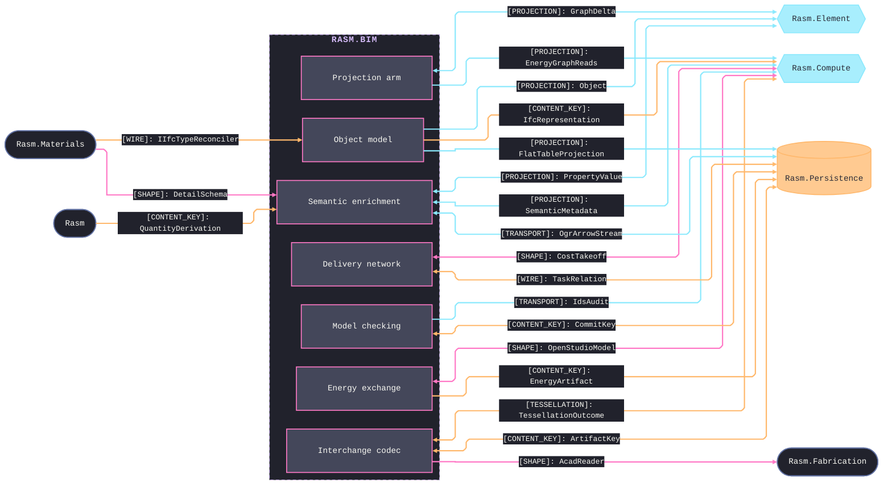
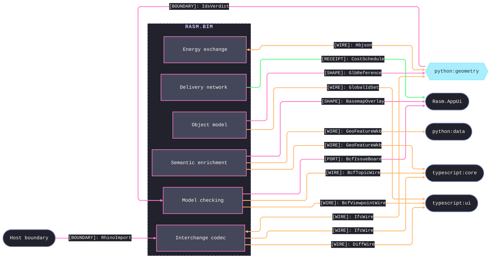

# [RASM_BIM_ARCHITECTURE]

Domain map of `Rasm.Bim` — the host-neutral BIM/IFC owner and the IFC arm of the `Rasm.Element` seam, depending up on `{Rasm, Rasm.Element}`. Each sub-domain folder maps to exactly one namespace, the `Projection/Semantic` `SemanticProjector : IElementProjection` lowers GeometryGym `DatabaseIfc` into the canonical `ElementGraph` while `IfcLegality : IGraphConstraint` owns IFC-semantic legality, and every sub-domain lowers its rejection onto the one `BimFault` band. Consumer-facing element is the seam `Bake(objectNode)` fold over the `ElementGraph`, never a parallel `BimModel` surface. Bim stays the sole GeometryGym/IFC owner and references no AEC peer — alignment travels through the shared seam graph and the content-keyed wire, with simulation Compute-owned and the Python IFC companion meeting only at the wire.

## [01]-[DOMAIN_MAP]

```text codemap
Rasm.Bim/
├── Model/                 # Host-neutral BIM object model and analytical model
│   ├── Elements.cs        # Generated IfcClass taxonomy and release-map vocabulary
│   ├── Query.cs           # Set-algebraic ElementPredicate query over the element set
│   ├── Spatial.cs         # Spatial-structure rank vocabulary and derived containment tree
│   ├── Zones.cs           # Many-to-many zone and program overlay
│   ├── Systems.cs         # MEP connectivity view, directed system trace, interference check
│   ├── Structural.cs      # Structural reader lowering restraints and loads onto neutral edges
│   └── Faults.cs          # BimFault closed-union entrypoint rail
├── Semantics/             # Element-bound semantic enrichment
│   ├── Properties.cs      # Pset/Qto template authority and bSDD-typed property classifier
│   ├── Classification.cs  # bSDD-bound classification axis over a live dictionary
│   ├── Composition.cs     # Bidirectional material projector across the seam graph
│   ├── Appearance.cs      # Surface-style lowering onto the seam appearance summary
│   ├── Connection.cs      # Realizing-element surface lowered onto seam detail bags
│   ├── GeoReference.cs    # Map-conversion and CRS lowering into the seam georeference
│   └── Geospatial.cs      # NTS simple-features algebra with GDAL/OGR vector and raster ingest
├── Planning/              # 4D/5D delivery network
│   ├── Schedule.cs        # 4D construction-task schedule over task-time intervals
│   └── Cost.cs            # 5D cost-and-resource estimate with rollup fold
├── Exchange/              # Universal interchange codec
│   ├── Format.cs          # Format, codec, and extension axis with frame normalization
│   ├── Import.cs          # Foreign-bytes ingest fold across the decode arms
│   ├── Export.cs          # Emit fold across scene, IFC, and subtree-availability bitstream
│   ├── Tessellation.cs    # Compute tessellation-companion bridge
│   ├── Reconstruct.cs     # Scan-to-BIM reconstruction over dual-engine LAS/LAZ ingest
│   └── Wire.cs            # Host-free IFC interchange artifact the Python and TypeScript peers decode
├── Energy/                # Building-energy-model exchange
│   ├── Exchange.cs        # Energy-op union apply over the exchange rail
│   ├── Projector.cs       # Raises HBJSON/DFJSON/OSM/gbXML/IDF evidence
│   └── Derive.cs          # BIM-to-BEM lowering across envelope, massing, and translation
├── Review/                # Model-checking and coordination
│   ├── Validation.cs      # IDS owner folding facet arms over the seam graph
│   ├── Issues.cs          # BCF issue exchange with .bcfzip codec and REST projection
│   ├── Diff.cs            # GlobalId-plus-content-key federation change-set
│   ├── Coordination.cs    # Clash rule engine, impact report, and sign-off vocabulary
│   └── Versioning.cs      # Content-addressed commit DAG and three-way merge
└── Projection/            # IFC arm of the Rasm.Element seam
    ├── Semantic.cs        # GeometryGym ingress fold plus IFC-legality graph constraint
    ├── Relations.cs       # Full IfcRel* roster and neutral-edge lowering
    └── Egress.cs          # IFC re-author with railed release and admission gates
```

Sub-domain dependency graph is acyclic: every sub-domain projects onto or reads the one seam `ElementGraph`, consuming the `Model/Query` `ElementPredicate` algebra and the `Semantics/Classification` axis as settled vocabulary, with residual and verdict state carried forward as input, never a return edge. Per-page wiring each projector composes lives on the owning implementation pages.

## [02]-[SEAMS]





Two fences partition by counterpart role: the same-branch AEC peers plus Compute and Persistence carry domain construction, analysis, and storage; the Python geometry and data runtimes, the TypeScript peers, the app shell, and the host boundary carry cross-runtime wire, presentation, and host interchange. Each collapsed edge stands for every contract between that sub-domain and that partner at the load-bearing kind, and the owning pages enumerate the rest.

`[CONTENT_KEY]` edges are one canonical idiom, not per-page schemes: every page that joins the federation, solver, cache, or diff lane derives a typed `UInt128` key through the ONE kernel seed-zero hasher — `ContentHash.Of` over the seam `CanonicalWriter` fold — and the Compute content-addressing lane joins the same content space, never a second identity scheme and never a downward `InterchangeIdentity` reference from Bim. A page deriving a new content key inherits this idiom and mints through the one kernel seed-zero `XxHash128` owner; a second identity scheme, a per-page hash function, or a `Guid`-keyed federation join is the named cross-folder drift defect. Per-page key tuples, and the pages that carry no parallel key, live on the owning implementation pages.

[HOST_BOUNDARY_EDGE]: the `Host boundary → Exchange` edge is single-sided, not an interior dependency. `Rasm.Rhino/Exchange` is strata-locked — every format dispatches through RhinoCommon `Rhino.FileIO.*`, references only the kernel `Rasm`, and composes exclusively at the app root; `Rasm.Bim` never names `Rasm.Rhino`. Edge resolves only where the app root binds the live host, projecting a `RhinoDoc` import to a host-neutral mesh plus `GlobalId` the `Exchange/import` fold admits as a wire payload — Bim owns the payload, Rhino owns the host-side production and adapter. Because the Rhino FileIO and the managed reader engines decode the same OBJ/STL/PLY/3MF/glTF/STEP bytes to divergent meshes, the app root declares per path which reader is authoritative; the two coexist and neither is gutted to feed the other.
