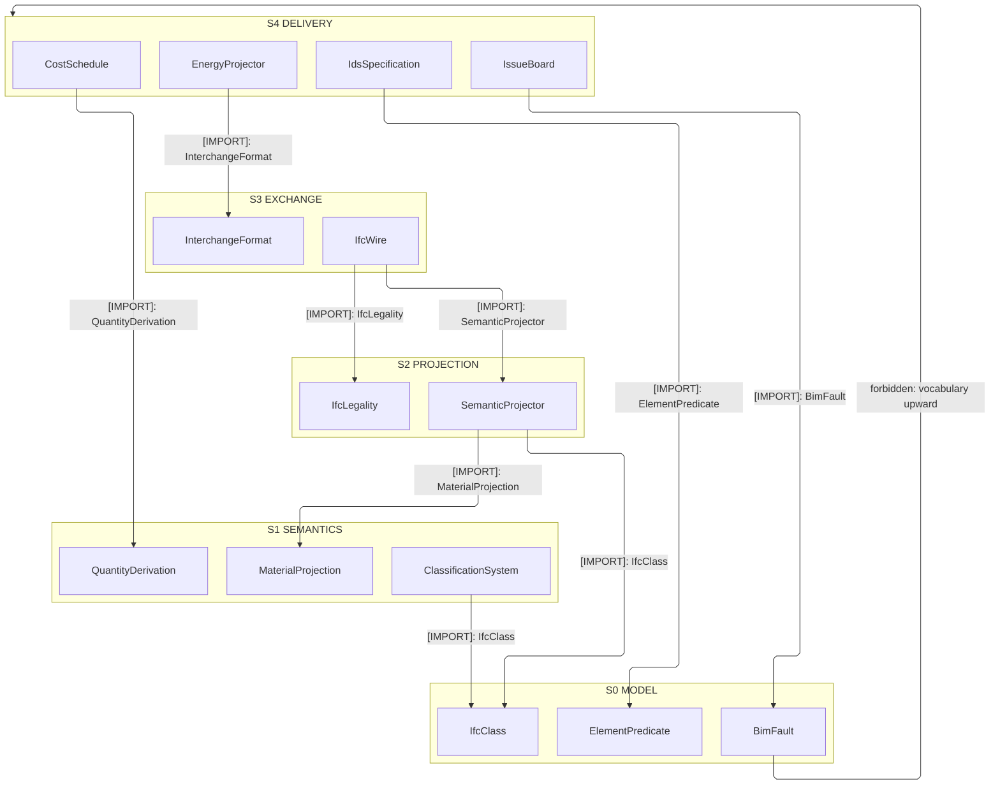
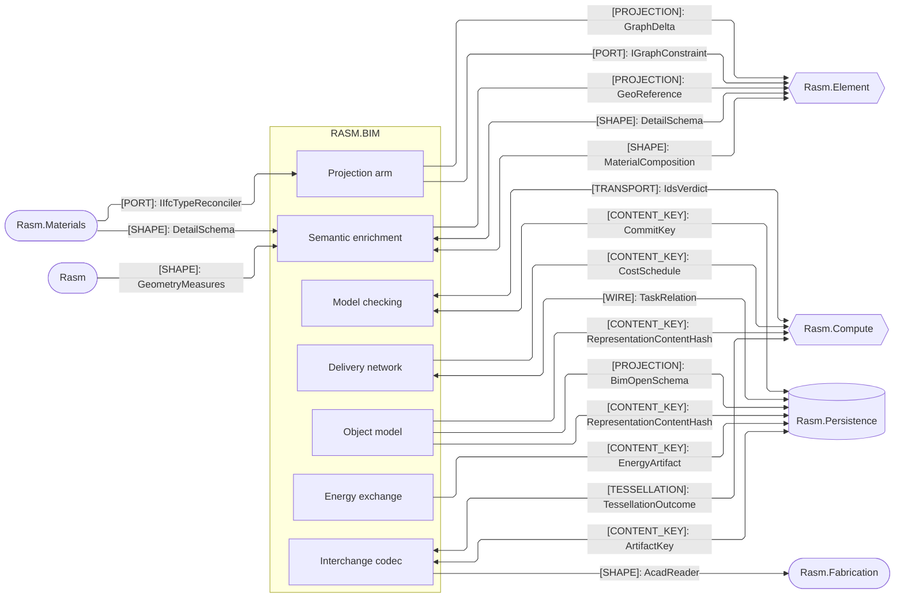
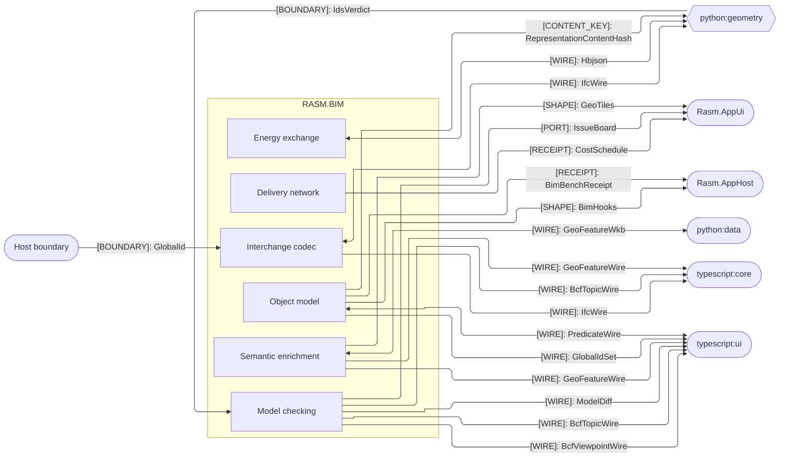

# [RASM_BIM_ARCHITECTURE]

Domain map of `Rasm.Bim`, the host-neutral BIM/IFC owner and IFC arm of the `Rasm.Element` seam. `Projection/Semantic` `SemanticProjector : IElementProjection` lowers GeometryGym `DatabaseIfc` into the canonical `ElementGraph`, `IfcLegality : IGraphConstraint` owns IFC-semantic legality, and every sub-domain rejects onto the one `BimFault` band. Consumer-facing element is the seam `Bake(objectNode)` fold, never a parallel `BimModel`; Bim stays the sole GeometryGym/IFC owner, references no AEC peer, and aligns through the shared seam graph and content-keyed wire with simulation Compute-owned.

## [01]-[DOMAIN_MAP]

```text codemap
Rasm.Bim/
├── Model/                 # Host-neutral BIM object model and analytical model
│   ├── Elements.cs        # Generated IfcClass taxonomy and release-map vocabulary
│   ├── Query.cs           # Set-algebraic ElementPredicate query, predicate wire, store push-down
│   ├── Spatial.cs         # Spatial rank vocabulary, containment tree, linear positioning
│   ├── Zones.cs           # Many-to-many zone and program overlay
│   ├── Systems.cs         # MEP connectivity view, directed system trace, interference check
│   ├── Structural.cs      # Structural reader lowering restraints and loads onto neutral edges
│   ├── Faults.cs          # BimFault closed-union entrypoint rail
│   └── Observability.cs   # Composition-scoped hook rail, meter owner, benchmark claim roster
├── Semantics/             # Element-bound semantic enrichment
│   ├── Properties.cs      # Pset/Qto template authority and bSDD-typed property classifier
│   ├── Classification.cs  # bSDD-bound classification axis over a live dictionary
│   ├── Composition.cs     # Bidirectional material projector across the seam graph
│   ├── Appearance.cs      # Surface-style lowering onto the seam appearance summary
│   ├── Connection.cs      # Realizing-element surface lowered onto seam detail bags
│   ├── GeoReference.cs    # Map-conversion and CRS lowering into the seam georeference
│   └── Geospatial.cs      # NTS simple-features algebra with GDAL/OGR vector and raster ingest
├── Planning/              # 4D/5D/6D delivery network
│   ├── Schedule.cs        # 4D construction-task schedule over task-time intervals
│   └── Cost.cs            # 5D cost-and-resource estimate and 6D carbon rollup
├── Exchange/              # Universal interchange codec
│   ├── Format.cs          # Format, codec, and extension axis with frame normalization
│   ├── Import.cs          # Foreign-bytes ingest fold across the decode arms
│   ├── Export.cs          # Emit fold across scene, IFC, and subtree-availability bitstream
│   ├── Tessellation.cs    # Compute tessellation-companion bridge
│   ├── Reconstruct.cs     # Scan-to-BIM reconstruction over dual-engine LAS/LAZ ingest
│   └── Wire.cs            # Host-free IFC interchange artifact the Python and TypeScript peers decode
├── Energy/                # Building-energy-model exchange
│   ├── Exchange.cs        # Energy-op union apply over the exchange rail
│   ├── Projector.cs       # Raises HBJSON/DFJSON/OSM/gbXML/IDF evidence
│   └── Derive.cs          # BIM-to-BEM lowering across envelope, massing, and translation
├── Review/                # Model-checking and coordination
│   ├── Validation.cs      # Two-tier QA owner — template-audit baseline beneath the IDS facet fold
│   ├── Issues.cs          # BCF issue exchange with .bcfzip codec and REST projection
│   ├── Diff.cs            # GlobalId-and-content-key federation change-set
│   ├── Coordination.cs    # Clash rule engine, impact report, and sign-off vocabulary
│   └── Versioning.cs      # Content-addressed commit DAG and three-way merge
└── Projection/            # IFC arm of the Rasm.Element seam
    ├── Semantic.cs        # GeometryGym ingress fold with IFC-legality graph constraint
    ├── Relations.cs       # Full IfcRel* roster and neutral-edge lowering
    └── Egress.cs          # IFC re-author with railed release and admission gates
```

Sub-domain dependency graph is acyclic: every sub-domain projects onto or reads the one seam `ElementGraph`, consuming the `Model/Query` `ElementPredicate` algebra and the `Semantics/Classification` axis as settled vocabulary, with residual and verdict state carried forward as input, never a return edge. Per-page wiring each projector composes lives on the owning implementation pages.

## [02]-[STRATA]

Strata order the sub-domains under the acyclic law — every cross-stratum consumption edge points down; `Review` and `Planning` co-seat on the delivery stratum, coordination reading the estimate and the schedule as same-stratum input, never a return edge.

- S0 `Model` — settled vocabulary consuming no sibling: the `BimFault` band-2600 union, the `ElementPredicate`/`ElementSet` query algebra, the generated `IfcClass` roster, the `IfcRepresentation` content key, and the `BimHooks`/`BimTelemetry`/`BimBenchClaim` observability rail whose `BimFact` payloads carry closed-vocabulary KEY strings so no upper stratum type leaks down.
- S1 `Semantics` — element-bound enrichment over the vocabulary: `MaterialProjection`, `QuantityDerivation`, the bSDD `ClassificationSystem` axis, and the `GeoModel` geospatial algebra.
- S2 `Projection` — the seam arm composing model and semantics: `SemanticProjector : IElementProjection`, `IfcLegality : IGraphConstraint`, the Materials-implemented `IIfcTypeReconciler` port, and the folder-internal `IIfcProfileStore` capture the egress re-author reads.
- S3 `Exchange` — the interchange codec over the projection arm: the `InterchangeFormat` axis, the `IfcWire` cross-runtime artifact, and the `TessellationRequest`/`TessellationOutcome` bridge.
- S4 `Energy` + `Review` + `Planning` — delivery tier over everything below: `EnergyProjector` and `EnergyArtifact`; `IdsSpecification`, `ModelDiff`, and `IssueBoard`; `ScheduleNetwork` and `CostSchedule` — coordination reads the estimate and the schedule as same-stratum input with no return edge.



## [03]-[SEAMS]





Two fences partition by counterpart role: the same-branch AEC peers with Compute and Persistence carry domain construction, analysis, and storage; the Python geometry and data runtimes, the TypeScript peers, the app shell, the app composition root (`Rasm.AppHost` composes the `BimHooks` rail per instance and admits the `Rasm.Bim` meter and source at its telemetry root), and the host boundary carry cross-runtime wire, presentation, and host interchange. Each collapsed edge stands for every contract between that sub-domain and that partner at the load-bearing kind, and the owning pages enumerate the rest. `GeoFeatureWkb` is the frozen wire spelling of the `GeoFeature`-row WKB crossing the `GeoWkb` bridge encodes toward the Python data peer, and `GeoFeatureWire` the frozen spelling of the `GeoFeature` crossing the TypeScript peers decode; `GeoWire` stays the interior projection owner behind both.

`[CONTENT_KEY]` edges are one canonical idiom, not per-page schemes: every page joining the federation, solver, cache, or diff lane derives a typed `UInt128` through the ONE kernel seed-zero hasher — `ContentHash.Of` over the seam `CanonicalWriter` fold — and the Compute content-addressing lane joins the same content space, never a downward `InterchangeIdentity` reference from Bim. A second scheme, a per-page hash, or a `Guid`-keyed join is the named cross-folder drift defect. Per-page key tuples and the pages carrying no parallel key live on the owning implementation pages.

[HOST_BOUNDARY_EDGE]: `Host boundary → Exchange` is single-sided, not an interior dependency — `Rasm.Bim` never names `Rasm.Rhino`, and the edge resolves only where the app root binds the live host, projecting a `RhinoDoc` import to a host-neutral mesh with `GlobalId` the `Exchange/import` fold admits as a wire payload. Bim owns the payload, Rhino the host-side production. Because Rhino FileIO and the managed readers decode the same OBJ/STL/PLY/3MF/glTF/STEP bytes to divergent meshes, the app root declares per path the authoritative reader; the two coexist, neither gutted for the other.
