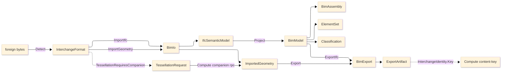

# [RASM_BIM_ARCHITECTURE]

`Rasm.Bim` is one host-neutral BIM-and-exchange engine: every interchange format is a row, every element a record discriminated by an `IfcClass` row, every query a predicate-union arm folded by one set algebra, every classification a keyed axis row — never a per-format importer, a per-element-type class, or a host-bound model. Mechanics live in the sub-domain-nested `.planning/` pages; this page is the atlas — the implementation source tree (the build order), the owner registry (the one owner-state surface), dependency direction, cross-package seams, the import-to-element spine, and the boundaries and prohibitions. Per-cluster package owners live on the planning-page cards; versions live in `Directory.Packages.props`.

## [1]-[SOURCE_TREE]

The planned namespaced implementation layout IS the build order: vocabulary owners before consumers, the exchange codec before the element model that projects from it. Each leaf is annotated with the owners it transcribes and the owning `<SubDomain>/<page>#CLUSTER`; sub-folders group the flat file set by concern axis.

```text codemap
Rasm.Bim/
├── Faults.cs                  # BimFault union (band 2600), InterchangeKeyPolicy ordinal accessor — Exchange/interchange#FORMAT_AXIS
├── Exchange/
│   └── Interchange.cs         # InterchangeFormat, InterchangeCodec, KhrExtension, KhrSlot, UpAxis, Handedness, StepProtocol, FrameNormalization, BimIo, BimExport, ImportedGeometry, IfcSemanticModel, ExportArtifact, InterchangePolicy, MeshCompression, TessellationRequest — Exchange/interchange#FORMAT_AXIS, #IMPORT_RAIL, #EXPORT_RAIL, #TESSELLATION_BRIDGE
└── Model/
    ├── Elements.cs            # IfcClass, BimElement, BimModel, BimModel.Project — Model/object-model#ELEMENT_MODEL
    ├── Classification.cs      # Classification, ClassificationCode, ClassificationRef, Classify — Model/object-model#CLASSIFICATION
    ├── Assembly.cs            # SpatialContainer, AssemblyRel, BimAssembly, Assemble — Model/object-model#ASSEMBLY
    └── ElementSet.cs          # ElementPredicate, ElementQuery, ElementSet, Query — Model/object-model#ELEMENT_SET
```

`Faults.cs` lands first — `BimFault` (band 2600) and `InterchangeKeyPolicy` are read by every owner. `Exchange/Interchange.cs` precedes `Model/` because the BIM object model projects from the `IfcSemanticModel` graph the exchange import rail produces. Within `Model/`, `Elements.cs` and `Classification.cs` precede `Assembly.cs` and `ElementSet.cs` (the assembly tree and the query algebra fold over the settled element and classification vocabularies). The geometry handle on `BimElement` binds the kernel `Rasm` geometry by reference; the content-key and the companion tessellation orchestration are consumed from `Rasm.Compute` at the seam, never built here.

## [2]-[OWNER_REGISTRY]

The single owner-state surface for the package. Implementation collapses to one owner per axis and one entrypoint family per rail; a format is a ROW, an element a RECORD discriminated by an `IfcClass` row, a query a PREDICATE-UNION arm, a classification a keyed AXIS row — never a new surface; a public type outside these owner regions is the named defect. `[STATE]` is `FINALIZED` where the owner is a transcription-complete fence with no open gate, `SPIKE` where the owner is fence-complete but its proof carries a residual cross-folder or cross-branch probe named in the page RESEARCH cluster; `QUEUED` where the owner card and growth axis are transcription-complete but the signature fence is depth-fill queued per the package scope. This is the ONLY place owner state lives — FEATURES, TASKLOG, and README route here.

| [INDEX] | [AXIS/RAIL]              | [OWNER]               | [KIND]                                | [CASES]                                             | [PAGE#CLUSTER]                       |  [STATE]  |
| :-----: | :---------------------- | :-------------------- | :------------------------------------ | :-------------------------------------------------- | :----------------------------------- | :-------: |
|   [1]   | bim fault family        | `BimFault`            | `[Union]` fault, band 2600            | model-rejected/codec-miss/spatial                   | Exchange/interchange#FORMAT_AXIS     | FINALIZED |
|   [2]   | key policy              | `InterchangeKeyPolicy` | comparer accessors                   | ordinal                                             | Exchange/interchange#FORMAT_AXIS     | FINALIZED |
|   [3]   | format axis             | `InterchangeFormat`   | `[SmartEnum<string>]`                 | 20 rows                                             | Exchange/interchange#FORMAT_AXIS     | FINALIZED |
|   [4]   | codec owner             | `InterchangeCodec`    | `[SmartEnum<string>]`                 | 8 rows                                              | Exchange/interchange#FORMAT_AXIS     | FINALIZED |
|   [5]   | glTF extension axis     | `KhrExtension`        | `[SmartEnum<string>]`                 | 13 rows                                             | Exchange/interchange#FORMAT_AXIS     | FINALIZED |
|   [6]   | frame normalization     | `FrameNormalization`  | static surface + `UpAxis`/`Handedness` | `Canonicalize`                                      | Exchange/interchange#FORMAT_AXIS     | FINALIZED |
|   [7]   | import/export fold      | `BimIo` / `BimExport` | boundary capsule + policy             | `ImportGeometry`/`ImportIfc`/`Export`/`ExportIfc`   | Exchange/interchange#IMPORT_RAIL     | FINALIZED |
|   [8]   | IFC semantic graph      | `IfcSemanticModel`    | record + nested rows                  | 6 entity-family projections                         | Exchange/interchange#IMPORT_RAIL     | FINALIZED |
|   [9]   | tessellation bridge     | `TessellationRequest` | record                                | `Plan` — `Fin`                                      | Exchange/interchange#TESSELLATION_BRIDGE | SPIKE |
|  [10]   | element class vocabulary | `IfcClass`           | `[SmartEnum<string>]`                 | closed buildingSMART element-class set              | Model/object-model#ELEMENT_MODEL     | QUEUED    |
|  [11]   | element model           | `BimElement` / `BimModel` | record + `Project` fold           | element record + projection                         | Model/object-model#ELEMENT_MODEL     | QUEUED    |
|  [12]   | element-set algebra     | `ElementSet`          | set-algebraic fold over `ElementPredicate` `[Union]` | `Query`/`Union`/`Intersect`/`Except`/`Where` | Model/object-model#ELEMENT_SET       | QUEUED    |
|  [13]   | classification axis     | `Classification`      | `[SmartEnum<string>]` + `ClassificationCode` value-object | standard-systems set                  | Model/object-model#CLASSIFICATION    | QUEUED    |
|  [14]   | host-neutral assembly   | `BimAssembly`         | record + `AssemblyRel` `[Union]` + `Assemble` fold | spatial tree + 5 relationship arms     | Model/object-model#ASSEMBLY          | QUEUED    |

One rail per entrypoint, named in the return type: `Fin<T>` where a band-2600 `BimFault` can route (import/export codec faults, classification code-shape mismatch, dangling spatial reference), a total carrier where the result admits no failure (`ElementSet.Query` over a settled model). `TessellationRequest` holds at SPIKE until the `csharp:Compute/interchange#TWO_HOP_TESSELLATION` orchestration and the `python:geometry/ifc-companion` companion-daemon protocol land — Bim owns only the request shape and consumes the re-imported GLB; the orchestration is a cross-folder seam, not a fence defect. The `Model/` owners hold at QUEUED: the owner cards and growth axes are transcription-complete, the signature fences are depth-fill queued per the package scope (the moved exchange semantics are decision-complete; the genuinely-new BIM object-model fences fill out in the queued depth pass).

## [3]-[DEPENDENCY_DIRECTION]

| [INDEX] | [PROJECT]          | [RELATION]                                                                  |
| :-----: | :----------------- | :------------------------------------------------------------------------- |
|   [1]   | `Rasm`             | kernel geometry source; `BimElement` binds the kernel geometry by reference |
|   [2]   | `Rasm.Compute`     | content-identity + companion tessellation rail consumed at the seam         |
|   [3]   | host packages      | no direct dependency (GeometryGym/SharpGLTF are managed AnyCPU IL)          |

`Rasm.Bim` references `Rasm` (the kernel); it is AEC-DOMAIN and depends only upward through the strata. It CONSUMES `Rasm.Compute` content-identity (`InterchangeIdentity.Key`) and the companion tessellation rail (`TWO_HOP_TESSELLATION`) at the cross-folder seam — the consumption is one-directional and minimal; Compute never references Bim, and Bim re-implements neither the content-key nor the tessellation orchestration. No host-boundary package (`Rasm.Rhino`/`Rasm.Grasshopper`) is referenced; the host-neutral IFC/exchange semantic model coexists with the Rhino-native capture at the universal contract, never by reference.

## [4]-[SEAMS]

Every two-folder fact splits by altitude: mechanics live at the named cluster, consequences land at the consumer. Intra-language seams ride `pkg/page#CLUSTER`; the cross-language consequences ride the Tier-0 `region-map/seam-splits.md`.

| [INDEX] | [SEAM]                         | [MECHANICS_AT]                              | [CONSEQUENCE_AT]                                                                          |
| :-----: | :----------------------------- | :----------------------------------------- | :--------------------------------------------------------------------------------------- |
|   [1]   | interchange content identity   | Compute/interchange#CONTENT_ADDRESSING     | `ExportArtifact.ContentKey` and `TessellationRequest.IfcContentKey` consume `InterchangeIdentity.Key`; Bim mints no second identity scheme |
|   [2]   | companion tessellation rail    | Compute/interchange#TWO_HOP_TESSELLATION   | Bim `TessellationRequest.Plan` builds the request shape; Compute issues it over the companion rpc and re-imports the GLB; Bim mints no transport |
|   [3]   | companion transport leg        | Compute/remote-lane#TRANSPORT_AXIS         | the tessellation request rides Compute's existing companion rpc, host-local in posture; never a second wire |
|   [4]   | kernel geometry handle         | Bim/Model/object-model#ELEMENT_MODEL       | `BimElement` binds the `Rasm` kernel geometry by reference; never re-tessellates, never carries a host-bound geometry type |
|   [5]   | IFC semantic graph projection  | Bim/Exchange/interchange#IMPORT_RAIL       | `BimModel.Project` folds the `IfcSemanticModel` graph into the host-neutral element model; the graph is the in-process semantic owner, never a tessellated BRep |
|   [6]   | universal-vs-Rhino coexistence | Bim/Exchange/interchange#FORMAT_AXIS       | the host-neutral IFC/exchange semantic model and the Rhino-native `csharp:Rasm.Rhino/Exchange` Make2D/sheet/native-file capture coexist at the universal contract; neither is thinned to feed the other |
|   [7]   | Python ifcopenshell wire       | python:geometry/ifc-companion              | Bim meets ifcopenshell only at the wire — the `IFC → IfcOpenShell → GLB` two-hop evaluation Python owns, reached through the Compute companion rpc; Bim re-imports the GLB, never the Python evaluation |

## [5]-[SPINE]



Text equivalent: foreign bytes resolve to one `InterchangeFormat` row through `Detect`; `BimIo` dispatches a managed glTF/mesh decode to `ImportedGeometry`, an in-process IFC ingest to `IfcSemanticModel`, or a companion tessellation request through `TessellationRequest` (issued by Compute, re-imported as `ImportedGeometry`); `BimModel.Project` folds the semantic graph into the host-neutral element collection; `BimAssembly`, `ElementSet`, and `Classification` compose over the model; `BimExport` emits `ExportArtifact` bytes the Compute content-key addresses.

## [6]-[BOUNDARIES]

- `Rasm.Bim` is the host-neutral owner of the UNIVERSAL IFC/exchange SEMANTIC model and the host-neutral BIM object model; it is NOT a tessellation kernel, a content-addressing owner, a wire-transport owner, or a Rhino drafting surface.
- The Rhino-native `csharp:Rasm.Rhino/Exchange` and `Rasm.Rhino` drafting stay rich Rhino features and are NOT thinned: Rhino owns Make2D, sheet layout, and native file I/O; `Rasm.Bim` independently owns the universal IFC/exchange semantic model. The two COEXIST — Rhino-native capture and host-neutral semantics — meeting only at the universal contract, and neither is gutted to feed the other.
- Content-identity and the tessellation orchestration are CONSUMED, never re-minted: `ExportArtifact.ContentKey` and `TessellationRequest.IfcContentKey` consume the `Compute/interchange#CONTENT_ADDRESSING` `InterchangeIdentity.Key`, and the two-hop tessellation request rides the `Compute/interchange#TWO_HOP_TESSELLATION` orchestration over the existing companion transport.
- The BIM object model is HOST-NEUTRAL: `BimElement` binds the `Rasm` kernel geometry by reference and a RhinoCommon `Brep`/`Mesh`/`Layer` field on any model owner is the named seam violation; the host boundary expresses the native surface, this package expresses the universal contract, they meet only at the contract.
- GeometryGym carries no tessellation kernel (the catalogue boundary fact): an IFC row's geometry request routes to the companion tessellation bridge, never a managed in-process BRep evaluation.
- Bim meets `python:geometry/ifc-companion` ifcopenshell only at the wire: Python owns the offline `IFC → IfcOpenShell → GLB` evaluation companion; Bim re-imports the GLB through the glTF import rail, never the Python evaluation.

## [7]-[PROHIBITIONS]

The closed NEVER list — the deleted patterns the owner registry forecloses.

- NEVER a per-format importer/exporter family (`GltfImporter`/`IfcImporter`/`GltfExporter`); format selection is `InterchangeFormat` row data resolved through `Detect`.
- NEVER a per-element-type class (`WallElement`/`SlabElement`/`ColumnElement`); a `BimElement` is one record discriminated by an `IfcClass` row.
- NEVER a `Get<Dimension>` operation family (`GetWalls`/`GetByLevel`/`GetByMaterial`); one polymorphic `ElementSet.Query` discriminates on the `ElementQuery` predicate expression.
- NEVER a per-classification-system classifier type; the `Classification` standard systems are one keyed axis.
- NEVER a managed in-process IFC/STEP tessellator; geometry evaluation on an IFC/AP242/native row routes to the companion tessellation bridge.
- NEVER a second content-identity scheme or a second blob owner; consume `Compute/interchange#CONTENT_ADDRESSING` and the Persistence blob lane.
- NEVER a second tessellation transport or wire vocabulary; the request rides Compute's existing companion rpc.
- NEVER a RhinoCommon type on a host-neutral model signature; the geometry handle is the kernel `Rasm` geometry by reference.
- NEVER thin or reference-gut the Rhino-native `csharp:Rasm.Rhino/Exchange` drafting/Make2D/native-file capture; the host-neutral semantic model coexists with it at the universal contract.
- NEVER a generic `IModel`/`IElement` abstraction; `BimElement` is the single element shape and the `ElementPredicate`/`AssemblyRel` cases stay typed unions.
