# [COMPUTE_ASSESSMENT]

Rasm.Compute assessment rail: the C#-first discipline-analysis spine that reads the concrete `Rasm.Element` `ElementGraph` DIRECTLY (above the seam, no `IElementProjection` — Compute is APP-PLATFORM consuming the AEC-domain seam upward), routes one polymorphic `AssessmentRequest` over the seam `Discipline` to a discipline runner, folds the discipline-specific input into ONE uniform `AssessmentResult` fact stream, content-keys it on the `(input subgraph, route, discipline policy)` triple through the seam `CanonicalWriter`+`ContentAddress` (the ONE kernel `XxHash128` seed-zero rail — no second hasher), and writes it back as a seam `Node.Assessment` node wrapping an `AssessmentPayload`, attached to every target through the neutral `Assign` edge (sub-kind `AssignKind.Assessment` — the C5 edge algebra, never an IFC-named `AssignsToAssessment`) — one `GraphDelta` the caller applies. The spine is content-addressed end to end: an identical `(subgraph, route, discipline policy)` re-addresses the assessment node already on the graph, so a `RerunPolicy.CacheFirst` `Assess` short-circuits to a 412-noop (an empty delta) and `RerunPolicy.Force` is the one traced recompute, so a token-metered or compute-heavy route is never silently re-run. The page owns the `AssessmentRoute` standard-code axis, the `AssessmentRequest` discipline-input union, the uniform `AssessmentResult`/`AssessmentFact`/`AssessmentVerdict` carrier, the `RerunPolicy` cache axis, the `Analysis.Assess` dispatch-and-writeback entry returning one `Assessed` (the delta plus the `ComputeReceipt.Assessment` minted in ONE pass), the `(subgraph, route, policy)` content-key, the three new `ComputeFault` band-2200 cases (`2217+`), and the `ComputeReceipt.Assessment` outcome case. Every runner (`Analysis/structural`, `Analysis/physics`, `Analysis/energy`, `Analysis/lifecycle`) reads the concrete graph, composes the relocated `Analysis/aggregator` multi-ply engine where a layered property is needed, and returns the one fact stream this spine writes back — closed-form physics, FE solves, the energy subprocess, and the EC3 read live in the runners, NEVER in the seam. The discipline vocabulary, the typed value family (`PropertyValue`/`MeasureValue`/`PropertyName`/`Dimension`), the `Node.Assessment` case and its `AssessmentPayload`, the `GraphDelta` merge type with its `Put`/`Link` builders, the neutral `Assign` edge, the `CanonicalWriter`, and the `ContentAddress` value-object arrive settled from `Rasm.Element`; Compute decodes and writes, never re-mints them.

## [01]-[INDEX]

- [01]-[ROUTE_AXIS]: the `AssessmentRoute` `[SmartEnum<string>]` standard-code rows carrying the seam `Discipline` and the citation, and the `AssessmentVerdict` ratio-banded outcome.
- [02]-[REQUEST_FAMILY]: the `AssessmentRequest` `[Union]` discipline-input cases, the shared `Targets`/`Route` abstract reads (the seam `Node.Id` idiom) with the `CanonicalBytes` content-key policy fold, and the uniform `AssessmentResult`/`AssessmentFact` fact-stream carrier.
- [03]-[DISPATCH_WRITEBACK]: the `Analysis.Assess` route-to-runner dispatch returning one `Assessed`, the `RerunPolicy` content-addressed cache short-circuit, the `(input subgraph, route, discipline policy)` content-key composed through the seam `CanonicalWriter`+`ContentAddress`, the `Node.Assessment`+`AssessmentPayload` write-back `GraphDelta` over the neutral `Assign`/`Assessment` edge, the three `ComputeFault` cases, and the `ComputeReceipt.Assessment` outcome.

## [02]-[ROUTE_AXIS]

- Owner: `AssessmentRoute` `[SmartEnum<string>]` the standard-code axis under the settled `ComparerAccessors.StringOrdinal` accessor, each row carrying the seam `Discipline` it serves, the human `Standard` citation, and the machine `SolverVersion` solver/standard-revision token; `AssessmentVerdict` `[SmartEnum<string>]` the ratio-banded outcome with a `Critical` column and the `FromRatio` projection.
- Cases: structural rows `aisc360`/`en1993`/`en1992`/`nds`/`en1995`/`aci318`/`tms402`/`aisi-s100`; thermal rows `iso6946`/`en13788`; acoustic row `iso12354`; fire rows `en1993-1-2`/`en1992-1-2`; energy row `energyplus`; environmental row `en15978`; cost row `cost-in-place` — every analysis route a row carrying its `Discipline`, citation, and `SolverVersion`, never a parallel per-discipline enum; `AssessmentVerdict` rows `satisfied`/`marginal`/`exceeded`/`not-applicable`.
- Entry: the route is a value the `AssessmentRequest` case carries and the content-key folds; `AssessmentVerdict.FromRatio(double ratio, double marginBand)` bands a governing utilization/criticality ratio into the outcome — `> 1.0` exceeded, `>= marginBand` marginal, finite-and-below satisfied, non-finite not-applicable, so a verdict is DERIVED from the governing ratio, never a stored flag that drifts from it.
- Packages: Thinktecture.Runtime.Extensions, Rasm.Element (project — `Discipline`), BCL inbox.
- Growth: a new design code or standard is one `AssessmentRoute` row carrying its `Discipline`, citation, and `SolverVersion`; a closed-form revision (an EN/AISC edition bump in the hand-rolled kernel, an EnergyPlus or EC3 solver bump) is one bumped `SolverVersion` token on the existing row; a new discipline is one seam `Discipline` row plus the routes that serve it — the route axis widens by data and the dispatch `Switch` breaks at compile time until the new discipline's runner arm exists; zero new surface.
- Boundary: the route `Discipline` is the seam vocabulary, never re-declared here — a Compute-local discipline enum is the deleted form; the route `Key` AND `SolverVersion` are load-bearing content-key components (changing the code OR bumping the solver revision re-keys the assessment) so both are smart-enum row data folded by `Analysis.ContentKey`, never a free string; the `SolverVersion` is the machine solver/standard-revision token DISTINCT from the human `Standard` citation, realizing the seam `Assessment/assessment` "the `AnalysisRoute` token OR the `InputKey` MUST fold the solver tool+version" obligation for EVERY route — a closed-form edition bump or an EnergyPlus 25.2.0→26.1.0 solver change re-keys to a fresh node rather than false-hitting a prior version's `Computed` result; `AssessmentVerdict` is derived from the governing ratio at projection time so the receipt verdict and the fact stream cannot disagree.

```csharp signature
// --- [TYPES] -------------------------------------------------------------------------------
[SmartEnum<string>]
[KeyMemberEqualityComparer<ComparerAccessors.StringOrdinal, string>]
[KeyMemberComparer<ComparerAccessors.StringOrdinal, string>]
public sealed partial class AssessmentRoute {
    public static readonly AssessmentRoute Aisc360   = new("aisc360",     Discipline.Structural,    "AISC 360-22",            solver: "aisc360-22");
    public static readonly AssessmentRoute En1993    = new("en1993",      Discipline.Structural,    "EN 1993-1-1:2005",       solver: "en1993-1-1:2005");
    public static readonly AssessmentRoute En1992    = new("en1992",      Discipline.Structural,    "EN 1992-1-1:2004",       solver: "en1992-1-1:2004");
    public static readonly AssessmentRoute Nds       = new("nds",         Discipline.Structural,    "NDS 2018",               solver: "nds-2018");
    public static readonly AssessmentRoute En1995    = new("en1995",      Discipline.Structural,    "EN 1995-1-1:2004",       solver: "en1995-1-1:2004");
    public static readonly AssessmentRoute Aci318    = new("aci318",      Discipline.Structural,    "ACI 318-19",             solver: "aci318-19");
    public static readonly AssessmentRoute Tms402    = new("tms402",      Discipline.Structural,    "TMS 402-22",             solver: "tms402-22");
    public static readonly AssessmentRoute AisiS100  = new("aisi-s100",   Discipline.Structural,    "AISI S100-16",           solver: "aisi-s100-16");
    public static readonly AssessmentRoute Iso6946   = new("iso6946",     Discipline.Thermal,       "ISO 6946:2017",          solver: "iso6946:2017");
    public static readonly AssessmentRoute En13788   = new("en13788",     Discipline.Thermal,       "EN ISO 13788:2012",      solver: "en-iso-13788:2012");
    public static readonly AssessmentRoute Iso12354  = new("iso12354",    Discipline.Acoustic,      "ISO 12354-1:2017",       solver: "iso12354-1:2017");
    public static readonly AssessmentRoute En1993Fire = new("en1993-1-2", Discipline.Fire,          "EN 1993-1-2:2005",       solver: "en1993-1-2:2005");
    public static readonly AssessmentRoute En1992Fire = new("en1992-1-2", Discipline.Fire,          "EN 1992-1-2:2004",       solver: "en1992-1-2:2004");
    public static readonly AssessmentRoute EnergyPlus = new("energyplus", Discipline.Energy,        "EnergyPlus 25.2 / ISO 52016", solver: "energyplus-25.2.0");
    public static readonly AssessmentRoute En15978   = new("en15978",     Discipline.Environmental, "EN 15978:2011",          solver: "en15978:2011+ec3");
    public static readonly AssessmentRoute CostInPlace = new("cost-in-place", Discipline.Cost,      "in-place unit cost",     solver: "cost-in-place-1");

    public Discipline Discipline { get; }
    public string Standard { get; }
    // The machine solver/standard-revision token folded into the (subgraph, route, policy) content key (Analysis.ContentKey),
    // SEPARATE from the human Standard citation: a closed-form revision (an EN/AISC edition bump in the hand-rolled
    // BuildingPhysics/StructuralAnalysis kernel, an EnergyPlus solver bump, an EC3 method change) increments THIS token so a
    // re-assessment re-keys to a fresh Assessment node rather than false-hitting a prior version's Computed result —
    // realizing the seam Assessment/assessment "the AnalysisRoute token OR the InputKey MUST fold the solver tool+version"
    // contract for EVERY route. The energy POLICY ExpectedVersion (CanonicalBytes) is the orthogonal deployment-binary axis.
    public string SolverVersion { get; }
}

[SmartEnum<string>]
[KeyMemberEqualityComparer<ComparerAccessors.StringOrdinal, string>]
public sealed partial class AssessmentVerdict {
    public static readonly AssessmentVerdict Satisfied     = new("satisfied",      critical: false);
    public static readonly AssessmentVerdict Marginal      = new("marginal",       critical: false);
    public static readonly AssessmentVerdict Exceeded      = new("exceeded",       critical: true);
    public static readonly AssessmentVerdict NotApplicable = new("not-applicable", critical: false);

    public bool Critical { get; }

    public static AssessmentVerdict FromRatio(double ratio, double marginBand = 0.95) =>
        !double.IsFinite(ratio) ? NotApplicable
        : ratio > 1.0           ? Exceeded
        : ratio >= marginBand   ? Marginal
        : Satisfied;
}
```

## [03]-[REQUEST_FAMILY]

- Owner: `AssessmentRequest` `[Union]` the discipline-input axis — one case per discipline carrying its target `NodeId` set, its `AssessmentRoute`, and the discipline policy; the shared `Targets`/`Route` reads are abstract overrides each case satisfies positionally (the seam `Node.Id` idiom, never a per-field `Switch`) with `Discipline` derived from the route, and the `CanonicalBytes` policy fold contributes the discipline input to the content key; `AssessmentResult` the ONE uniform outcome carrier (its `Discipline`/`Verdict`/`At` all derived, and an optional `ResultBlob` content key to the heavy discipline artifact); `AssessmentFact` the typed neutral `(PropertyName, PropertyValue)` fact the runners emit and the write-back stores, its factory family TOTAL over the seam `PropertyValue` cases (`Measure`/`Ratio`/`Text`/`Flag`/`Reference`/`Bounded`/`Enumerated`/`List`/`Table`) so any discipline emits a scalar, a demand/capacity interval, a per-band list, or a classified rating without hand-building a `PropertyValue`.
- Cases: `Structural(targets, route, combinations, policy)` · `Thermal(targets, route, climate)` · `Acoustic(targets, route, requiredRw)` · `Fire(targets, route, exposure, requiredMinutes, utilization)` · `Energy(targets, route, weather, policy)` · `Carbon(targets, route, query)` · `Cost(targets, route, currency)` — the discipline-SPECIFIC input is the case payload; the RESULT is the uniform `AssessmentResult` fact stream every runner returns, so a `StructuralResult`/`ThermalResult` parallel result family is the rejected form collapsed onto one fact stream with `(PropertyName, PropertyValue)` slot/kind metadata.
- Entry: a runner consumes one `AssessmentRequest` case and returns `Fin<AssessmentResult>`; `AssessmentResult.Of(route, facts, governingRatio, provenance, resultBlob)` mints the carrier deriving the `Verdict` from the governing ratio and `At` from the `Provenance` so the verdict, the facts, and the timestamp share one source — `resultBlob` defaults to `None` (a closed-form route stores no heavy artifact); a subprocess/solver route passes the object-store content key of its EnergyPlus SQLite or FEA result set ONCE the dispatch threads an injected artifact sink — today the 4-arg `Run(graph, request, geometry, clocks)` threads the `GeometrySource` ingress port but no egress sink, so even a subprocess route threads `None` and the scratch artifact is ephemeral (the gap `Analysis/energy` documents; realizing it threads a sink through `Assess`/`Run` + the four runners, a deferred cross-stratum capability whose owner is an architecture decision, not a per-page edit).
- Packages: Thinktecture.Runtime.Extensions, LanguageExt.Core, Rasm.Element (project — `NodeId`, `PropertyName`, `PropertyValue`, `Interpolation`, `MeasureValue`, `Dimension`, `Provenance`, `Discipline`), NodaTime, BCL inbox.
- Growth: a new discipline is one `AssessmentRequest` case carrying its typed input plus one dispatch arm — the generated `Switch` breaks at compile time until the arm exists; a new fact on any discipline is one `AssessmentFact` row in the runner's fold (the factory family already total over the seam `PropertyValue` cases), never a new result type or a structured value flattened to a string; zero new surface.
- Boundary: arity discriminates on the case payload shape (the discipline input), never a name suffix or a mode flag; `Targets` is a seam `NodeId` set so a runner reads only the reachable target subgraph and never invents node identities; the discipline policy (combinations, climate, weather, query) is the case payload, never an ambient global; `AssessmentFact.Value` is the seam `PropertyValue` union (a `Measure(MeasureValue)` carries the SI scalar and unit) so a fact is typed and unit-bearing, never a bare double the consumer must re-interpret; a utilization/criticality ratio is a dimensionless `Measure` (`MeasureValue.OfSi(Dimension.Dimensionless, …)`), NEVER a `Bounded` — the seam `Bounded` is the lower/upper/setpoint interval shape, not a scalar; `AssessmentResult.Discipline` is DERIVED from `Route.Discipline`, `Verdict` from the governing ratio, and `At` from `Provenance.At` (one source each, never a stored field that drifts — a stored `At` beside `Provenance.At` is the duplicate the derivation deletes); the heavy discipline artifact (the EnergyPlus SQLite, the FEA result set) is referenced by the optional `ResultBlob` content key — the runner writes it to the object store through an injected artifact sink the dispatch threads and the write-back threads the key onto the seam payload, never an inlined heavy payload on the result or the node, so egress is parameterized the same way ingress is (the sink is a pending dispatch capability — the current 4-arg `Run(graph, request, geometry, clocks)` threads the geometry ingress but no sink, the gap `Analysis/energy` documents); the uniform `AssessmentResult` IS the discipline-specific result shape — discipline-specificity lives in the FACTS, not in parallel carriers.

```csharp signature
// --- [MODELS] ------------------------------------------------------------------------------
// The typed neutral fact every runner emits: a (PropertyName, PropertyValue) pair the write-back folds into the
// Node.Assessment Results bag. The factory family is TOTAL over the seam PropertyValue union, so a discipline emits ANY
// typed result through one factory — a scalar Measure, a dimensionless Ratio, Text, a Flag, a graph Reference, a Bounded
// demand/capacity interval, an Enumerated rating class, a per-band List, or a defining->defined Table — never a
// hand-built PropertyValue and never a structured result flattened to a string. A ratio is a DIMENSIONLESS Measure (the
// seam Bounded is the lower/upper/setpoint interval shape, NOT a scalar), so every numeric ratio reads uniformly off
// PropertyValue.Measure.Value.Si while a genuine interval (a demand vs capacity band) rides Bounded.
public readonly record struct AssessmentFact(PropertyName Name, PropertyValue Value) {
    public static AssessmentFact Measure(string name, MeasureValue value)     => new(PropertyName.Create(name), new PropertyValue.Measure(value));
    public static AssessmentFact Ratio(string name, double value)             => new(PropertyName.Create(name), new PropertyValue.Measure(MeasureValue.OfSi(Dimension.Dimensionless, value)));
    public static AssessmentFact Text(string name, string value)             => new(PropertyName.Create(name), new PropertyValue.Text(value));
    public static AssessmentFact Flag(string name, bool value)               => new(PropertyName.Create(name), new PropertyValue.Boolean(value));
    public static AssessmentFact Reference(string name, NodeId target)        => new(PropertyName.Create(name), new PropertyValue.Reference(target));
    public static AssessmentFact Bounded(string name, Option<MeasureValue> lower, Option<MeasureValue> upper, Option<MeasureValue> setpoint) => new(PropertyName.Create(name), new PropertyValue.Bounded(lower, upper, setpoint));
    public static AssessmentFact Enumerated(string name, string chosen, Seq<string> allowed) => new(PropertyName.Create(name), new PropertyValue.Enumerated(Seq(chosen), allowed));
    public static AssessmentFact List(string name, Seq<PropertyValue> values) => new(PropertyName.Create(name), new PropertyValue.List(values));
    public static AssessmentFact Table(string name, Seq<(PropertyValue Defining, PropertyValue Defined)> rows) => new(PropertyName.Create(name), new PropertyValue.Table(rows, Interpolation.NotDefined));
}

// Discipline/Verdict/At are DERIVED, never stored duplicates: Discipline from Route, Verdict from the governing ratio at
// mint, At from Provenance — so the verdict, the fact stream, and the timestamp share one source (a stored At beside
// Provenance.At is the drift the Discipline/Verdict derivation already deletes). The optional ResultBlob is the content key
// of the heavy discipline artifact (the EnergyPlus SQLite, the FEA result set) the runner writes to the object store through
// an injected artifact sink the dispatch threads — None for a closed-form route, the blob key for a subprocess/solver route
// ONCE that sink lands (pending: the 4-arg Run threads the geometry ingress but no sink) — onto the seam AssessmentPayload.ResultBlob so a
// consumer fetches the full artifact by content key off the baked element, never an inlined heavy payload on the node.
public sealed record AssessmentResult(
    AssessmentRoute Route,
    Seq<AssessmentFact> Facts,
    AssessmentVerdict Verdict,
    double GoverningRatio,
    Option<UInt128> ResultBlob,
    Provenance Provenance) {
    public Discipline Discipline => Route.Discipline;
    public Instant At => Provenance.At;

    public static AssessmentResult Of(AssessmentRoute route, Seq<AssessmentFact> facts, double governingRatio, Provenance provenance, Option<UInt128> resultBlob = default) =>
        new(route, facts, AssessmentVerdict.FromRatio(governingRatio), governingRatio, resultBlob, provenance);
}

[Union(ConversionFromValue = ConversionOperatorsGeneration.None)]
public abstract partial record AssessmentRequest {
    private AssessmentRequest() { }

    // Every case carries the assessed Targets and the AssessmentRoute as its first two positionals, so the shared reads
    // are the union's own abstract overrides (the seam Node.Id idiom) — NOT a 7-arm Switch repeating one field read per
    // case. Discipline derives from the route (one source).
    public abstract Seq<NodeId> Targets { get; }
    public abstract AssessmentRoute Route { get; }

    public sealed record Structural(Seq<NodeId> Targets, AssessmentRoute Route, Seq<LoadCombinationSpec> Combinations, StructuralPolicy Policy) : AssessmentRequest;
    public sealed record Thermal(Seq<NodeId> Targets, AssessmentRoute Route, BoundaryClimate Climate) : AssessmentRequest;
    public sealed record Acoustic(Seq<NodeId> Targets, AssessmentRoute Route, double RequiredRw) : AssessmentRequest;
    public sealed record Fire(Seq<NodeId> Targets, AssessmentRoute Route, FireExposure Exposure, double RequiredMinutes, double Utilization) : AssessmentRequest;
    public sealed record Energy(Seq<NodeId> Targets, AssessmentRoute Route, WeatherRef Weather, EnergyPolicy Policy) : AssessmentRequest;
    public sealed record Carbon(Seq<NodeId> Targets, AssessmentRoute Route, CarbonQuery Query) : AssessmentRequest;
    public sealed record Cost(Seq<NodeId> Targets, AssessmentRoute Route, string Currency) : AssessmentRequest;

    public Discipline Discipline => Route.Discipline;

    // The discipline-specific policy folds into the content key — the route + target subgraph alone never identify the
    // analysis INPUT, so a re-run under a CHANGED policy (a different load combination, boundary climate, fire
    // requirement, weather file, EnergyPlus version, energy setpoint/internal-load, LCIA method + per-material OMF, or
    // currency) re-keys rather than returning a stale cache hit, realizing the seam's "InputKey from the assessed inputs'
    // content (… the load case)" contract. EVERY result-determining field contributes — the EnergyPlus policy ExpectedVersion
    // (the DEPLOYMENT-BINARY version, the orthogonal finer axis to the route-level SolverVersion Analysis.ContentKey folds for
    // every route: the route token pins the canonical solver, the policy version the actual configured binary, both re-keying),
    // AND the heating/cooling setpoints and lighting/equipment internal loads (the OSM-model
    // simulation drivers), AND the energy EXECUTION ROUTE (the local in-process OSM build and a Pollination cloud
    // recipe over the Bim-lowered HBJSON are two different model derivations, so the provider discriminant plus the
    // cloud owner/project/platform/job-descriptor coordinates re-key — a cloud result never false-hits a local one;
    // the descriptor folds VERBATIM, so the Cloud case's canonical-descriptor law holds it token-free: content-keyed
    // input refs only, no local path/signed URL/timestamp/auth or SDK Local* provisioning column — a volatile token
    // over-keys and silently re-runs a metered cloud job),
    // AND the carbon OmfByMaterial per-ply category overrides (a different EC3 category yields a
    // different declaration), so a setpoint, load, route, or category edit re-keys and never reuses the prior result; NEVER the
    // discovery paths (ConfiguredDir/ExecutableName — provisioning, not analysis identity). Every variable-length
    // sequence (load combinations, per-case factors, per-material OMF) is COUNT-PREFIXED and sorted by key, so the
    // projection is self-delimiting (two different-arity policies can never concatenate to one byte stream — the
    // ContentAddress.OfGraph discipline) and order-stable; the Acoustic RequiredRw acceptance target rides the key so a changed target re-keys. Shares the seam CanonicalWriter the (subgraph, route) bytes ride.
    public void CanonicalBytes(CanonicalWriter w) => Switch(
        structural: r => {
            w.String(r.Policy.Backend.Key).Double(r.Policy.DeflectionLimitRatio).Ordinal(r.Policy.StationCount).Ordinal(r.Combinations.Count);
            foreach (LoadCombinationSpec combo in r.Combinations.OrderBy(static c => c.Label, StringComparer.Ordinal)) {
                w.String(combo.Label).Ordinal(combo.Factors.Count);
                foreach (var (kase, factor) in combo.Factors.OrderBy(static f => f.Key.Key, StringComparer.Ordinal)) { w.String(kase.Key).Double(factor); }
            }
            return w;
        },
        thermal:  r => w.Double(r.Climate.InteriorTempC).Double(r.Climate.InteriorRh).Double(r.Climate.ExteriorTempC).Double(r.Climate.ExteriorRh).Double(r.Climate.TargetUValueWM2K),
        acoustic: r => w.Double(r.RequiredRw),
        fire:     r => w.String(r.Exposure.Key).Double(r.RequiredMinutes).Double(r.Utilization),
        energy:   r => r.Policy.Route.Switch(
                        subprocess: _ => w.String("local"),
                        cloud:      c => w.String("cloud").String(c.Owner).String(c.Project).String(c.Platform).String(c.JobDescriptor))
                        .String(r.Weather.EpwPath).String(r.Weather.Station).String(r.Policy.Toolchain.ExpectedVersion)
                        .Double(r.Policy.TargetEui).Double(r.Policy.HeatingSetpointC).Double(r.Policy.CoolingSetpointC).Double(r.Policy.LightingPowerWM2).Double(r.Policy.EquipmentPowerWM2),
        carbon:   r => {
            w.String(r.Query.Omf).String(r.Query.Method.Key).Double(r.Query.TargetKgCo2e).Ordinal(r.Query.OmfByMaterial.Count);
            foreach (var (material, omf) in r.Query.OmfByMaterial.OrderBy(static p => p.Key, StringComparer.Ordinal)) { w.String(material).String(omf); }
            return w;
        },
        cost:     r => w.String(r.Currency));
}
```

## [04]-[DISPATCH_WRITEBACK]

- Owner: `Analysis` the static dispatch-and-writeback entry; `RerunPolicy` the `[SmartEnum<string>]` cache axis (`CacheFirst`/`Force`); `Assessed` the one-pass outcome (the `GraphDelta` plus the `ComputeReceipt.Assessment`); the `(input subgraph, route, discipline policy)` content-key composed through the seam `Rasm.Element/Projection/address#CANONICAL_WRITER` `CanonicalWriter` hashed by the `Rasm.Element/Projection/address#CONTENT_ADDRESS` `ContentAddress.Of` over the ONE kernel `XxHash128` seed-zero rail; the `Node.Assessment`+`AssessmentPayload` write-back `GraphDelta`; the three new `ComputeFault` band-2200 cases (`AssessmentInputMissing` 2217, `ToolchainUnresolved` 2218, `AnalysisRunFailed` 2219, the block above the Symbolic-lane `2213..2216`); the `ComputeReceipt.Assessment` outcome case.
- Entry: `public static Fin<Assessed> Assess(ElementGraph graph, AssessmentRequest request, GeometrySource geometry, RerunPolicy rerun, CorrelationId correlation, ClockPolicy clocks)` — `Fin<T>` aborts onto the `ComputeFault` band; the entry content-keys the `(subgraph, route, policy)`, short-circuits a `CacheFirst` hit (the content-addressed `Node.Assessment` already on the graph) to a 412-noop `Assessed` carrying an empty delta and the cache receipt, else `Run` routes the request case to its discipline runner through the generated total `Switch` (threading the seam `GeometrySource` port to the geometry-reading Structural/Energy runners so they resolve the analytical `AxisCurve`/`FootprintPolygon` one-hop by content key, the closed-form runners taking none), `WriteBack` folds the result into one content-addressed `Node.Assessment` node assigned to every target through the neutral `Assign`/`Assessment` edge; `Receipt` projects the run onto the `ComputeReceipt.Assessment` case — the delta and the receipt minted in ONE pass so the run never repeats for the receipt. The `GeometrySource` is the app-wired ingress dual of the `ResultBlob` egress sink: the seam owns the decode CONTRACT, the app composition root binds it over the Persistence object-store byte-stream (`Rasm.Rhino`/`Rasm.Grasshopper` today), and a closed-form-only composition threads `GeometrySource.None`.
- Auto: the content-key composes the seam `Rasm.Element/Projection/address#CANONICAL_WRITER` `CanonicalWriter` — the route `Key`, then each PRESENT target's seam `Node.ToCanonicalBytes(Header.Tolerance)` (H7, an absent target contributing its id so a missing input re-keys) in `NodeId`-ordinal order, then the request's discipline policy through `AssessmentRequest.CanonicalBytes` (the load combinations, the climate, the weather + EnergyPlus version + setpoints/internal loads + execution route, the fire requirement, the LCIA method) — hashed through the seam `Rasm.Element/Projection/address#CONTENT_ADDRESS` `ContentAddress.Of` over the ONE kernel `XxHash128` seed-zero rail the geometry hash, the snapshot spine, and `Runtime/admission` `Digest` already ride, never a second hasher and never a non-zero seed; the assessment `NodeId` is the seam self-hash `NodeId.Content` over the `Node.Assessment` `(Discipline, Route, InputKey)` canonical projection (the InputKey being THIS content key) — the H7 form `ContentAddress.Verify` recomputes, NEVER `NodeId.OfContent(key)`/the raw InputKey (an id `Verify` cannot reproduce from `node.ToCanonicalBytes`, the deleted form) — so a re-assessment of an unchanged subgraph addresses the same node, a `CacheFirst` `Assess` resolves it and returns the 412-noop empty delta, and the Persistence object store dedups the persisted artifact on the same key; the verdict rides the `Node.Assessment` `Results` bag as an `Enumerated` (chosen + allowed set) and the governing ratio as a dimensionless `Measure`, both DERIVED from the governing ratio so the receipt verdict and the stored verdict cannot diverge.
- Receipt: the `Assessment` `ComputeReceipt` case carries the discipline key, the route key, the content-key, the verdict key, the governing ratio, and the admitted flag; a fresh run stamps the measured `Elapsed`, a `CacheFirst` hit a zero `Elapsed` with the verdict re-derived from the cached ratio through `AssessmentVerdict.FromRatio` (one source, never a stored flag that drifts); faults project through the one `FaultDetail` wire family at the server edge.
- Packages: Thinktecture.Runtime.Extensions, LanguageExt.Core, NodaTime, Rasm.Element (project — `ElementGraph`, `Node`, `NodeId`/`NodeId.Content`/`NodeId.Rooted`, `GraphDelta`, `Relationship`, `AssignKind`, `AssessmentPayload`/`AssessmentPayload.Computed`/`AssessmentPayload.Pending`, `AnalysisRoute`, `AssessmentOutcome`, `GeometrySource` the analytical-geometry resolution port threaded to the geometry-reading runners, `PropertyName`, `PropertyValue`, `MeasureValue`, `Dimension`, the `Projection/address#CANONICAL_WRITER` `CanonicalWriter` + the `Projection/address#CONTENT_ADDRESS` `ContentAddress`, `Provenance`), Rasm (kernel — `Op.Of` the WriteBack diagnostic key the seam `Computed` factory rails on), BCL inbox — the content hash composes the seam `Projection/address#CONTENT_ADDRESS` `ContentAddress` (the kernel `XxHash128`), so the page admits no `System.IO.Hashing`.
- Growth: a new discipline runner is one `Run` arm (the generated `Switch` breaks until it exists); a new fault is one `ComputeFault` case at the next-free 2200 code (`2221+`); a new cache modality is one `RerunPolicy` row; the assessment outcome rides the one `ComputeReceipt.Assessment` case — a parallel assessment fault union or a second receipt union is the rejected form per the package prohibition set.
- Boundary: the runner reads the CONCRETE `ElementGraph` directly — Compute is APP-PLATFORM above the AEC-domain seam, so it consumes `Rasm.Element` upward and never goes through `IElementProjection` (that interface is the AEC-domain projector seam, not an analysis read path); the write-back produces a `GraphDelta` the CALLER applies (`graph.Apply(delta, key)` → `Fin<ElementGraph>`) so this owner never mutates a graph in place — the seam owns the immutable apply; the assessment node wraps a seam `AssessmentPayload` keyed by the `(Discipline, AnalysisRoute, InputKey)` triple (Compute's `AssessmentRoute.Key` admitted through `AnalysisRoute.Create` into the opaque seam token, the `InputKey` the content-key, the `Computed` outcome carrying `None` failure `Diagnostic`) whose typed `Results` bag (the "everything baked in" payload a wire consumer reads in one hop off the baked `Element`) carries every `(PropertyName, PropertyValue)` fact plus the derived verdict and governing ratio, attached to every target through the neutral `Assign` edge (sub-kind `AssignKind.Assessment`) — the C5 edge algebra Compute composes via `GraphDelta.Link`, never an IFC-named `AssignsToAssessment` and never a re-minted seam edge; the `AssessmentInputMissing` fault rails when a target subgraph lacks a node/property/section a route requires AND when the target set is empty (the degenerate under-specification — railed at `Assess` ingress before any content-key or dispatch work, never a runner folding zero members to a `0.0`-ratio `Satisfied` orphan), an under-specified element a typed fault the caller surfaces, never a silently-defaulted assessment; a forced re-run past a content-key hit is the explicit `RerunPolicy.Force` (the cache-vs-recompute decision is a stated policy value, never a silent recompute of a token-metered or compute-heavy route) and a `CacheFirst` hit returns the 412-noop `Assessed` with `CacheHit` set so the dedup is traced; the persisted `AssessmentPayload` is a content-keyed artifact registered in the Persistence `Version/retention#RETENTION_CLASSES` `blob` class (content-keyed identity scheme, full-history-reachable, GC-protected) through the object-store lane, so a historical assessment a prior snapshot references survives the retention sweep and an identical `(subgraph, route, policy)` re-assessment dedups as a 412-noop — never a per-assessment retention table or a second blob class.

```csharp signature
// --- [TYPES] -------------------------------------------------------------------------------
// The cache-vs-recompute policy the caller STATES: CacheFirst short-circuits an identical (subgraph, route, policy) to the
// 412-noop the content-addressed assessment node already on the graph proves; Force is the ONE traced recompute, so a
// token-metered EC3 query or a compute-heavy EnergyPlus subprocess is never silently re-run.
[SmartEnum<string>]
[KeyMemberEqualityComparer<ComparerAccessors.StringOrdinal, string>]
public sealed partial class RerunPolicy {
    public static readonly RerunPolicy CacheFirst = new("cache-first");
    public static readonly RerunPolicy Force      = new("force");
}

// --- [MODELS] ------------------------------------------------------------------------------
// The assessment outcome rides the one ComputeReceipt union (Runtime/receipts owns it) — a partial case, never a
// second receipt union; the inherited init members (Correlation/Lane/Substrate/AllocationClass/Elapsed) stamp at mint.
// Declared before Assessed, which carries it.
public abstract partial record ComputeReceipt {
    public sealed record Assessment(string Discipline, string Route, UInt128 Key, string Verdict, double GoverningRatio, bool Admitted) : ComputeReceipt;
}

// The spine outcome minted in ONE pass: the GraphDelta the caller applies plus the ComputeReceipt.Assessment the
// telemetry rail emits, so the run is never repeated to obtain the receipt; CacheHit marks the 412-noop (an empty
// delta from a content-key hit) as operator-visible evidence, never a silent skip.
public sealed record Assessed(GraphDelta Delta, ComputeReceipt.Assessment Receipt, bool CacheHit);

// --- [ERRORS] ------------------------------------------------------------------------------
// The assessment cases extend the one ComputeFault band as a partial on the Runtime/admission owner
// (admission owns the 2200..2212 core; the Symbolic lane owns 2213..2216; the analysis block is the next-free 2217..2219) —
// never a parallel AssessmentFault union; every fault crosses the wire through the one FaultDetail family.
public abstract partial record ComputeFault {
    public sealed record AssessmentInputMissing : ComputeFault { public AssessmentInputMissing(string detail) : base(detail, 2217) { } }
    public sealed record ToolchainUnresolved : ComputeFault { public ToolchainUnresolved(string detail) : base(detail, 2218) { } }
    public sealed record AnalysisRunFailed : ComputeFault { public AnalysisRunFailed(string detail) : base(detail, 2219) { } }
}

// --- [OPERATIONS] --------------------------------------------------------------------------
public static class Analysis {
    static readonly PropertyName VerdictKey = PropertyName.Create("verdict");
    static readonly PropertyName GoverningRatioKey = PropertyName.Create("governing-ratio");

    // Content-key the (subgraph, route, policy); on a CacheFirst hit return the 412-noop the content-addressed Node.Assessment
    // already on the graph proves (empty delta + cache receipt), else Run -> WriteBack -> Receipt in ONE pass so the
    // run never repeats for the receipt. The returned Assessed.Delta the caller applies (graph.Apply(delta, key)).
    public static Fin<Assessed> Assess(ElementGraph graph, AssessmentRequest request, GeometrySource geometry, RerunPolicy rerun, CorrelationId correlation, ClockPolicy clocks) {
        // A no-target request is the degenerate under-specification: a runner would fold zero members to a 0.0 governing
        // ratio (a Satisfied verdict) and WriteBack would orphan that misleading assessment with no Assign edge — so an
        // empty target set rails the typed fault BEFORE any content-key or dispatch work, never a silently-defaulted pass.
        if (request.Targets.IsEmpty) { return Fin.Fail<Assessed>(new ComputeFault.AssessmentInputMissing($"<assessment-no-targets:{request.Route.Key}>")); }
        ContentAddress key = ContentKey(graph, request);
        Instant started = clocks.Now;
        // The CacheFirst lookup resolves the SAME content-addressed node WriteBack mints — the self-hash of the assessment
        // node's (Discipline, Route, InputKey) canonical projection through NodeId.Content (the H7 form ContentAddress.Verify
        // recomputes), NEVER NodeId.OfContent(key)/InputKey (an id Verify cannot reproduce from node.ToCanonicalBytes). The
        // InputKey is THIS content key (key.Value); the lookup folds the triple through the one AssessmentNodeId owner.
        NodeId nodeId = AssessmentNodeId(request.Route.Discipline, AnalysisRoute.Create(request.Route.Key), key.Value, graph.Header.Tolerance);
        Option<Node.Assessment> cached = rerun == RerunPolicy.CacheFirst ? graph.Find<Node.Assessment>(nodeId) : None;
        return cached.Match(
            Some: hit => Fin.Succ(new Assessed(GraphDelta.Empty, CacheReceipt(hit, key, correlation), CacheHit: true)),
            None: () => Run(graph, request, geometry, clocks).Bind(result =>
                WriteBack(request, result, key, graph.Header.Tolerance).Map(delta => new Assessed(
                    delta, Receipt(result, key, correlation, clocks.Now - started), CacheHit: false))));
    }

    // The (subgraph, route, policy) content key: the seam CanonicalWriter folds the route Key, the target COUNT (so two
    // different-arity target sets can never concatenate to one byte stream — the ContentAddress.OfGraph self-delimiting
    // discipline), then per target in NodeId order a present/absent TAG plus either the PRESENT target's
    // Node.ToCanonicalBytes(Header.Tolerance) or the ABSENT target's id (a missing input re-keys rather than silently
    // resolving a subset — honouring the "never a silently-defaulted assessment" boundary), then the request's discipline
    // policy through AssessmentRequest.CanonicalBytes, hashed through ContentAddress.Of over the ONE kernel XxHash128
    // seed-zero rail (Projection/address#CONTENT_ADDRESS) — never a raw hasher, a second algorithm, or a non-zero seed.
    // A present target contributes its CONTENT only (no id), so two structurally-identical targets under one route+policy
    // share one assessment; the present/absent tag keeps a content blob and an id string from ever colliding.
    public static ContentAddress ContentKey(ElementGraph graph, AssessmentRequest request) {
        CanonicalWriter writer = new(graph.Header.Tolerance);
        // The route Key AND the route SolverVersion both fold the key: the Key is the route identity, the SolverVersion the
        // solver tool/standard-revision so a closed-form edition bump (EN/AISC in the hand-rolled kernel) or an EnergyPlus/EC3
        // solver bump re-keys to a fresh Assessment node rather than false-hitting a prior version's Computed result — the
        // seam Assessment/assessment "AnalysisRoute token OR InputKey MUST fold the solver tool+version" contract, for EVERY route.
        writer.String(request.Route.Key).String(request.Route.SolverVersion).Ordinal(request.Targets.Count);
        foreach (NodeId id in request.Targets.OrderBy(static t => t.Value, StringComparer.Ordinal)) {
            graph.Find(id).Match(
                Some: node => writer.Bool(true).Raw(node.ToCanonicalBytes(graph.Header.Tolerance).Span),
                None: () => writer.Bool(false).String(id.Value));
        }
        request.CanonicalBytes(writer);
        return ContentAddress.Of(writer.ToBytes().Span);
    }

    // The GeometrySource port (the seam content-key -> analytical-shape resolver the app wires over the object-store
    // byte-stream) threads ONLY to the runners that read analytical geometry — Structural pulls the member AxisCurve and
    // Energy the bounding-surface FootprintPolygon by `member.Representations.Axis`/`.FootPrint`; the closed-form physics,
    // carbon, and cost runners read no geometry, so they take no port (a uniform-signature pass-through of an unread
    // resource would be ceremony). A closed-form-only composition threads GeometrySource.None at the Assess call site.
    static Fin<AssessmentResult> Run(ElementGraph graph, AssessmentRequest request, GeometrySource geometry, ClockPolicy clocks) =>
        request.Switch(
            structural: r => StructuralAnalysis.Run(graph, r, geometry, clocks),
            thermal:    r => BuildingPhysics.RunThermal(graph, r, clocks),
            acoustic:   r => BuildingPhysics.RunAcoustic(graph, r, clocks),
            fire:       r => BuildingPhysics.RunFire(graph, r, clocks),
            energy:     r => EnergySimulation.Run(graph, r, geometry, clocks),
            carbon:     r => LifecycleAssessment.RunCarbon(graph, r, clocks),
            cost:       r => LifecycleAssessment.RunCost(graph, r, clocks));

    // Build the seam Node.Assessment from the uniform fact stream plus the derived verdict (an Enumerated chosen+allowed
    // set) and governing ratio (a dimensionless Measure), then attach it to every target through the neutral Assign edge
    // (sub-kind Assessment) — the C5 edge algebra, never an IFC-named AssignsToAssessment. The payload is authored through
    // the PUBLIC AssessmentPayload.Computed factory (the seam ctor is private and the public Rehydrate is the coherence-railed
    // decoder gate, not a producer authoring path, so a positional `new AssessmentPayload(...)` is the deleted form), Fin-bound here: the verdict+ratio
    // entries guarantee the bag is non-empty, so the factory's empty-bag rail never fires, but the Fin is still threaded
    // (the Op.Of() key tags the unreachable diagnostic). The node id is the SELF-HASH of the assessment's (Discipline,
    // Route, InputKey) projection through the AssessmentNodeId owner (NodeId.Content, the H7 form ContentAddress.Verify
    // recomputes) — NEVER NodeId.OfContent(InputKey), whose stored id Verify cannot reproduce — so a re-assessment of an
    // unchanged subgraph re-addresses the same node and a rehydrate Verify holds; the runner's heavy artifact (the
    // EnergyPlus SQLite, the FEA result set) rides result.ResultBlob onto the payload (None for a closed-form route).
    static Fin<GraphDelta> WriteBack(AssessmentRequest request, AssessmentResult result, ContentAddress key, double tolerance) {
        AnalysisRoute route = AnalysisRoute.Create(result.Route.Key);
        NodeId nodeId = AssessmentNodeId(result.Discipline, route, key.Value, tolerance);
        Map<PropertyName, PropertyValue> results = result.Facts
            .Fold(Map<PropertyName, PropertyValue>(), static (bag, fact) => bag.AddOrUpdate(fact.Name, fact.Value))
            .AddOrUpdate(VerdictKey, new PropertyValue.Enumerated(Seq(result.Verdict.Key), AssessmentVerdict.Items.ToSeq().Map(static v => v.Key)))
            .AddOrUpdate(GoverningRatioKey, new PropertyValue.Measure(MeasureValue.OfSi(Dimension.Dimensionless, result.GoverningRatio)));
        return AssessmentPayload.Computed(result.Discipline, route, key.Value, results, result.ResultBlob, result.Provenance, Op.Of())
            .Map(payload => request.Targets.Fold(
                GraphDelta.Empty.Put(new Node.Assessment(nodeId, payload)),
                (delta, target) => delta.Link(new Relationship.Assign(target, nodeId, AssignKind.Assessment))));
    }

    // The ONE content-addressed assessment-NodeId owner the CacheFirst lookup and the WriteBack mint share — the seam
    // self-hash NodeId.Content over the Node.Assessment (Discipline, Route, InputKey) canonical projection (Graph/element
    // ToCanonicalBytes excludes the id AND every non-keying field — Outcome/Results/Diagnostic/Provenance/ResultBlob — so a
    // Pending probe over the triple hashes byte-identically to the final Computed node, and the provenance is irrelevant).
    // This is the H7 NodeId.Content form ContentAddress.Verify recomputes on rehydrate; NodeId.OfContent(InputKey) stored
    // the raw InputKey as the id, which Verify (hash(node.ToCanonicalBytes) over the triple) could never reproduce.
    static NodeId AssessmentNodeId(Discipline discipline, AnalysisRoute route, UInt128 inputKey, double tolerance) =>
        NodeId.Content(new Node.Assessment(NodeId.Rooted(), AssessmentPayload.Pending(discipline, route, inputKey, default)).ToCanonicalBytes(tolerance).Span);

    static ComputeReceipt.Assessment Receipt(AssessmentResult result, ContentAddress key, CorrelationId correlation, Duration elapsed) =>
        new(result.Discipline.Key, result.Route.Key, key.Value, result.Verdict.Key, result.GoverningRatio, Admitted: !result.Verdict.Critical) {
            Correlation = correlation, Lane = WorkLane.Background, Substrate = Substrate.CpuTensor, AllocationClass = AllocationClass.PooledMemory, Elapsed = elapsed,
        };

    // The 412-noop receipt: a CacheFirst hit re-derives the verdict from the cached payload's stored governing ratio
    // through the same AssessmentVerdict.FromRatio the fresh run uses (verdict and ratio share one source, never a
    // stored flag that drifts), so a deduped assessment still emits a faithful zero-elapsed receipt with no re-solve.
    static ComputeReceipt.Assessment CacheReceipt(Node.Assessment hit, ContentAddress key, CorrelationId correlation) {
        double ratio = hit.Payload.Result(GoverningRatioKey).Bind(static v => v is PropertyValue.Measure m ? Some(m.Value.Si) : None).IfNone(0.0);
        AssessmentVerdict verdict = AssessmentVerdict.FromRatio(ratio);
        return new(hit.Payload.Discipline.Key, hit.Payload.Route.Value, key.Value, verdict.Key, ratio, Admitted: !verdict.Critical) {
            Correlation = correlation, Lane = WorkLane.Background, Substrate = Substrate.CpuTensor, AllocationClass = AllocationClass.PooledMemory, Elapsed = Duration.Zero,
        };
    }
}
```



```mermaid
---
config:
  layout: elk
  look: neo
  theme: base
---
flowchart LR
    accTitle: Rasm.Compute assessment rail
    accDescr: A polymorphic assessment request plus a rerun policy routes over the seam discipline to a discipline runner that reads the concrete element graph; the spine content-keys the input subgraph and route, returns a cache-first 412-noop when the content-addressed assessment node already exists, else the runner folds its discipline-specific input into one uniform assessment-result fact stream and the spine writes one content-addressed assessment node back to the graph attached to every target through the neutral assign edge with sub-kind assessment, returning one assessed value carrying the graph delta the caller applies and the compute-receipt the telemetry rail emits.
    AssessmentRequest["AssessmentRequest + RerunPolicy"] -->|Assess| Analysis["Analysis"]
    ElementGraph["ElementGraph (Rasm.Element)"] -->|read concrete| Analysis
    Analysis -->|ContentKey| Dedup{"content-addressed node present?"}
    Dedup -->|CacheFirst hit| Noop["Assessed: empty delta + cache receipt (412-noop)"]
    Dedup -->|miss / Force| Runner["Structural / Physics / Energy / Lifecycle runner"]
    Runner -->|AssessmentResult fact stream| WriteBack["WriteBack + Receipt"]
    Runner -.->|Fin fail| ComputeFault["ComputeFault 2217+"]
    WriteBack -->|Assessed| Out["GraphDelta (Node.Assessment + Assign/Assessment) + ComputeReceipt.Assessment"]
    Out -->|caller Apply delta, key| ElementGraph
```

## [05]-[RESEARCH]

- [SEAM_VOCABULARY]: the assessment rail composes the `Rasm.Element` seam vocabulary as settled imports — `ElementGraph` (the `Header` + `Nodes:FrozenDictionary<NodeId,Node>` + `Edges:ImmutableArray<Relationship>` + incidence index + `Find`/`Find<T>`/`Bake`/`Apply`), `Node.Assessment` (the case wrapping the generic `AssessmentPayload` keyed by `Discipline` + `InputKey` + `Provenance`, its typed `Results` bag the analysis evidence and its optional `ResultBlob` the content key to the heavy artifact the write-back threads from the runner), `NodeId.Content(canonicalBytes)` (the non-rooted self-hash mint over the `Node.Assessment` `(Discipline, Route, InputKey)` projection — the H7 form `ContentAddress.Verify` recomputes, NOT `NodeId.OfContent(InputKey)`) and `NodeId.Rooted()` (the neutral probe id, excluded from the canonical bytes), `PropertyValue`/`MeasureValue`/`PropertyName`/`Dimension` (the typed value family — a ratio is a dimensionless `Measure`, never a `Bounded`), `GraphDelta` (the one merge type with the `Put`/`Link` builders), the neutral `Assign` edge with `AssignKind.Assessment` (the C5 edge algebra the assessment rides — NOT an IFC `AssignsToAssessment`), `CanonicalWriter`/`ContentAddress` (the canonical byte writer and the `[ValueObject<UInt128>]` over the kernel seed-zero hash), `Node.ToCanonicalBytes(tolerance)` (the H7 canonical projection the content-key folds), and `Discipline` (the one `[SmartEnum<string>]` Structural/Thermal/Energy/Acoustic/Fire/Environmental/Cost). Compute decodes and writes these; the seam owns their declaration. Ripple counterpart: `Rasm.Element` `Assessment/assessment` (the seam `AssessmentPayload`/`Node.Assessment` owner) and `Graph/delta` (the `GraphDelta` `Put`/`Link` builders + the `Relationship.Assign`/`AssignKind.Assessment` edge).
- [ABOVE_THE_SEAM_READ]: the analysis runners read the CONCRETE `ElementGraph` directly — this is the `§4E` "above the seam, no interface" rail. `IElementProjection` is the AEC-domain projector seam (Bim's `SemanticProjector`, Materials' `ComponentProjector`) that LOWERS a foreign source INTO the graph; the analysis rail consumes the ALREADY-BAKED graph and never implements or invokes that interface. Compute references `Rasm.Element` (the shared lower stratum, the same upward-consuming shape as referencing the kernel), never the AEC-domain peers `Rasm.Materials`/`Rasm.Bim` — alignment travels through the seam graph, not a sibling project reference.
- [CONTENT_KEY_PARITY]: the `(input subgraph, route, discipline policy)` content-key composes the seam `Rasm.Element/Projection/address#CANONICAL_WRITER` `CanonicalWriter` (the route `Key` AND the route `SolverVersion` — the solver/standard-revision token so a closed-form edition or EnergyPlus/EC3 solver bump re-keys, the seam `Assessment/assessment` solver-version obligation — then each target's seam `Node.ToCanonicalBytes(Header.Tolerance)` — the H7 fixed-IEEE-754 / tolerance-quantized / attribute-ordered projection, in `NodeId`-ordinal order, then the discipline policy through `AssessmentRequest.CanonicalBytes`) and hashes the bytes through `Rasm.Element/Projection/address#CONTENT_ADDRESS` `ContentAddress.Of` over the kernel seed-zero `XxHash128` — the ONE hasher the `Runtime/codecs#CONTENT_ADDRESSING` rail, the geometry hash, and the Persistence artifact index already ride — so the key is stable across runtimes and the float-bearing golden-vector parity corpus covers it; Compute composes the seam `ContentAddress` (the kernel hasher), never a raw `XxHash128` instance, a second algorithm, or a non-zero seed — the `§4-RT` SURVIVED seed-zero single-algorithm discipline.
- [CACHE_DEDUP]: the assessment is content-addressed end to end — the seam self-hash `NodeId.Content` over the `Node.Assessment` `(Discipline, Route, InputKey)` projection (the InputKey the `(subgraph, route, policy)` content key) makes an identical re-assessment address the SAME `Node.Assessment`, so a `RerunPolicy.CacheFirst` `Assess` resolves the existing node and returns the 412-noop `Assessed` (an empty `GraphDelta` + the cache receipt with the verdict re-derived from the stored ratio), and `RerunPolicy.Force` is the one traced recompute; the mint is the H7 `NodeId.Content` form `ContentAddress.Verify` recomputes (NEVER `NodeId.OfContent(InputKey)`, whose stored id `Verify` cannot reproduce); the in-graph dedup and the Persistence object-store 412-noop share the one content key, so a token-metered EC3 carbon query or a compute-heavy EnergyPlus subprocess is never silently re-run — realizing the seam `Assessment/assessment` content-keyed-cache / `IsStaleFor` discipline on the analysis side. Ripple counterpart: `Rasm.Persistence` `Version/retention` (the `blob` retention class the persisted `AssessmentPayload` registers in) and `Rasm.Element` `Assessment/assessment` (the `(InputKey, Route)` cache discipline).
- [FACT_STREAM_COLLAPSE]: the uniform `AssessmentResult` fact stream is the doctrinal collapse of seven parallel discipline-result records into one `(PropertyName, PropertyValue)` slot/kind carrier — a structural check emits `utilization`/`limit-state`/`governing-member` facts, a thermal run `u-value`/`condensation-risk` facts, an energy run `eui`/`source-eui`/`end-use:heating`/`end-use:cooling`/`hours-simulated` facts (the uniform `end-use:<category>` family plus the source totals and the annual-completeness validity hours), all into the same stream the write-back stores; the discipline-specificity is the fact set, not the carrier, so a new discipline never mints a new result type. The pattern mirrors the `Runtime/receipts` one-fact-union discipline.
- [RECEIPT_FAULT_BAND]: the assessment outcome is one `ComputeReceipt.Assessment` case and the faults extend the one `ComputeFault` 2200 band at `2217+` (the 2200..2212 core is `Runtime/admission`-owned and the Symbolic lane owns 2213..2216, so the analysis block is the next-free 2217..2219) — never a parallel union — so a device/symbolic/learning/constitutive fault and an assessment fault still cross the wire through the one `FaultDetail` family the `Runtime/channels` projection owns. Ripple counterpart: `Runtime/admission` (the `ComputeFault` band registry) carries the analysis block in its band custody and `Runtime/receipts` (the `ComputeReceipt` union index) carries the `Assessment` case as the `[JsonDerivedType]` registration and the wire projection, both owning the registry while this discipline page declares the partial cases.
