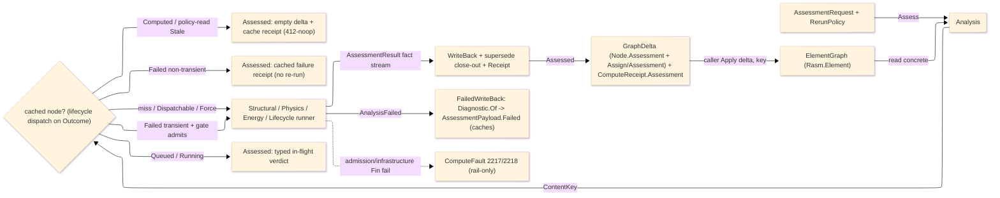

# [COMPUTE_ASSESSMENT]

Rasm.Compute assessment rail: the C#-first discipline-analysis spine that reads the concrete `Rasm.Element` `ElementGraph` directly — above the seam, no `IElementProjection`, Compute being app-platform consuming the AEC-domain seam upward. One polymorphic `AssessmentRequest` routes over the seam `Discipline` to a discipline runner that folds its discipline-specific input into ONE uniform `AssessmentResult` fact stream; the spine content-keys the `(input subgraph, route, discipline policy)` triple through the seam `CanonicalWriter`+`ContentAddress` (the one kernel `XxHash128` seed-zero rail) and writes the result back as a seam `Node.Assessment` wrapping an `AssessmentPayload`, attached to every target through the neutral `Assign` edge (sub-kind `AssignKind.Assessment`, never an IFC-named `AssignsToAssessment`) — one `GraphDelta` the caller applies. Every runner (`Analysis/structural`/`physics`/`energy`/`lifecycle`/`circulation`/`daylight`) reads the concrete graph and composes the relocated `Analysis/aggregator` engine where a layered property is needed; the closed-form physics, FE solves, energy subprocess, and EC3 read live in the runners, never the seam.

Assess is content-addressed AND lifecycle-aware: a `RerunPolicy.CacheFirst` inspects the cached payload's seam `AssessmentOutcome` before short-circuiting — `Computed` the 412-noop, `Stale` read-or-recompute under policy, `Failed` served from cache (a deterministic failure never re-runs; a `Diagnostic.Kind.Transient` one re-dispatches through the bounded retry gate over `Provenance.Attempt`/`Provenance.At`), `Queued`/`Running` a typed in-flight disposition, `Force` the one traced recompute — so a token-metered or compute-heavy route is never silently re-run. A runner `AnalysisFailed(SolvePhase, FailureKind, Detail, Code)` is a CACHED fact lowered through the seam `Diagnostic.Of` into `AssessmentPayload.Failed` under the same content-keyed id, while `AssessmentInputMissing`/`ToolchainUnresolved` stay rail-only. `Analysis.Sweep` is the second rail entry — a reconciler that stale-marks drifted `Computed` rows through `IsStaleFor`→`Advance(Stale)`, closes the staleness over the recorded `DependsOn` DAG, dispatches every `Dispatchable` row over the `Runtime/scheduling#JOB_GRAPH` `JobGraph`, supersedes the drifted predecessor in the same delta (exactly one usable node per `(discipline, route)`), and reconciles orphaned in-flight rows (a dead worker → `Cancelled` → Pending re-dispatch); the heavy discipline artifact rides the `AssessmentSink` egress port (the `GeometrySource` ingress dual) onto the Persistence blob lane through `ArtifactIndexRow.Admit` under `ArtifactKind.Assessment`. Seam vocabulary arrives settled from `Rasm.Element` — the `Discipline`, the typed value family (`PropertyValue`/`MeasureValue`/`PropertyName`/`Dimension`), `Node.Assessment`/`AssessmentPayload`, `GraphDelta` with its `Put`/`Link` builders, the `Assign` edge, `CanonicalWriter`, and `ContentAddress`; Compute decodes and writes, never re-mints them.

## [01]-[INDEX]

- [01]-[ROUTE_AXIS]: the `AssessmentRoute` `[SmartEnum<string>]` standard-code rows carrying the seam `Discipline` and the citation, and the `AssessmentVerdict` ratio-banded outcome.
- [02]-[REQUEST_FAMILY]: the `AssessmentRequest` `[Union]` discipline-input cases, the shared `Targets`/`Route` abstract reads (the seam `Node.Id` idiom) with the `CanonicalBytes` content-key policy fold, and the uniform `AssessmentResult`/`AssessmentFact` fact-stream carrier.
- [03]-[DISPATCH_WRITEBACK]: the `Analysis.Assess` route-to-runner dispatch returning one `Assessed` with its lifecycle-aware `CacheFirst`, the Failed write-back, the bounded `Transient` retry gate, the `Analysis.Sweep` reconciler over the `JobGraph` (stale-marking, dispatch, supersede close-out, orphan recovery), the `AssessmentSink` `ResultBlob` egress port, the `(input subgraph, route, discipline policy)` content-key composed through the seam `CanonicalWriter`+`ContentAddress`, the `Node.Assessment`+`AssessmentPayload` write-back `GraphDelta` over the neutral `Assign`/`Assessment` edge, the three `ComputeFault` cases (`AnalysisFailed` the typed `(SolvePhase, FailureKind)` carrier in the 2219 slot), and the `ComputeReceipt.Assessment` outcome with its failure/retry/seismic columns.

## [02]-[ROUTE_AXIS]

- Owner: `AssessmentRoute` `[SmartEnum<string>]` the standard-code axis, each row carrying the seam `Discipline` it serves, the human `Standard` citation, and the machine `SolverVersion` revision token; `AssessmentVerdict` `[SmartEnum<string>]` the ratio-banded outcome with a `Critical` column and the `FromRatio` projection.
- Cases: structural/thermal/acoustic/fire/energy/environmental/cost/seismic/circulation/daylight routes, each a row carrying its `Discipline`, citation, and `SolverVersion` (the seismic rows over the `arpack-shift-invert` sparse modal, the circulation/daylight rows the once-runnerless seam rows now served) — never a parallel per-discipline enum; `AssessmentVerdict` rows `satisfied`/`marginal`/`exceeded`/`not-applicable`.
- Entry: the route is a value the `AssessmentRequest` case carries and the content-key folds; `AssessmentVerdict.FromRatio(ratio, marginBand)` bands a governing utilization/criticality ratio (`>1.0` exceeded, `≥marginBand` marginal, finite-below satisfied, non-finite not-applicable), so a verdict is derived from the ratio, never a stored flag that drifts.
- Packages: Thinktecture.Runtime.Extensions, Rasm.Element (project — `Discipline`), BCL inbox.
- Growth: a new design code is one `AssessmentRoute` row carrying its `Discipline`, citation, and `SolverVersion`; a closed-form or solver revision is one bumped `SolverVersion` on the existing row; a new discipline is one seam `Discipline` row plus its routes, the dispatch `Switch` breaking until the runner arm exists; zero new surface.
- Boundary: the route `Discipline` is the seam vocabulary, never re-declared — a Compute-local discipline enum is the deleted form; the route `Key` AND `SolverVersion` are load-bearing content-key components (a code change or a solver-revision bump re-keys) folded by `Analysis.ContentKey`, never free strings; the `SolverVersion` is the machine revision token distinct from the human `Standard` citation, realizing the seam's "the `AnalysisRoute` token OR the `InputKey` MUST fold the solver tool+version" obligation for every route — a closed-form edition or EnergyPlus/EC3 solver change re-keys to a fresh node rather than false-hitting a prior `Computed` result; `AssessmentVerdict` derives from the governing ratio at projection so the receipt verdict and the fact stream cannot disagree.

```csharp signature
// --- [TYPES] -------------------------------------------------------------------------------
[SmartEnum<string>]
[KeyMemberEqualityComparer<ComparerAccessors.StringOrdinal, string>]
[KeyMemberComparer<ComparerAccessors.StringOrdinal, string>]
public sealed partial class AssessmentRoute {
    public static readonly AssessmentRoute Aisc360   = new("aisc360",     Discipline.Structural,    "AISC 360-22",            solver: "aisc360-22");
    public static readonly AssessmentRoute En1993    = new("en1993",      Discipline.Structural,    "EN 1993-1-1:2005",       solver: "en1993-1-1:2005");
    public static readonly AssessmentRoute En1992    = new("en1992",      Discipline.Structural,    "EN 1992-1-1:2004",       solver: "en1992-1-1:2004");
    public static readonly AssessmentRoute Nds       = new("nds",         Discipline.Structural,    "NDS 2018",               solver: "nds-2018");
    public static readonly AssessmentRoute En1995    = new("en1995",      Discipline.Structural,    "EN 1995-1-1:2004",       solver: "en1995-1-1:2004");
    public static readonly AssessmentRoute Aci318    = new("aci318",      Discipline.Structural,    "ACI 318-19",             solver: "aci318-19");
    public static readonly AssessmentRoute Tms402    = new("tms402",      Discipline.Structural,    "TMS 402-22",             solver: "tms402-22");
    public static readonly AssessmentRoute AisiS100  = new("aisi-s100",   Discipline.Structural,    "AISI S100-16",           solver: "aisi-s100-16");
    public static readonly AssessmentRoute Iso6946   = new("iso6946",     Discipline.Thermal,       "ISO 6946:2017",          solver: "iso6946:2017");
    public static readonly AssessmentRoute En13788   = new("en13788",     Discipline.Thermal,       "EN ISO 13788:2012",      solver: "en-iso-13788:2012");
    public static readonly AssessmentRoute Iso12354  = new("iso12354",    Discipline.Acoustic,      "ISO 12354-1:2017",       solver: "iso12354-1:2017");
    public static readonly AssessmentRoute En1993Fire = new("en1993-1-2", Discipline.Fire,          "EN 1993-1-2:2005",       solver: "en1993-1-2:2005");
    public static readonly AssessmentRoute En1992Fire = new("en1992-1-2", Discipline.Fire,          "EN 1992-1-2:2004",       solver: "en1992-1-2:2004");
    public static readonly AssessmentRoute EnergyPlus = new("energyplus", Discipline.Energy,        "EnergyPlus 25.2 / ISO 52016", solver: "energyplus-25.2.0");
    public static readonly AssessmentRoute En15978   = new("en15978",     Discipline.Environmental, "EN 15978:2011",          solver: "en15978:2011+ec3");
    public static readonly AssessmentRoute CostInPlace = new("cost-in-place", Discipline.Cost,      "in-place unit cost",     solver: "cost-in-place-1");
    public static readonly AssessmentRoute En1998   = new("en1998",      Discipline.Seismic,       "EN 1998-1:2004",         solver: "en1998-1:2004");
    public static readonly AssessmentRoute Asce7    = new("asce7",       Discipline.Seismic,       "ASCE 7-22",              solver: "asce7-22");
    public static readonly AssessmentRoute IbcEgress = new("ibc-egress", Discipline.Circulation,   "IBC 2024 Ch.10",         solver: "ibc-2024-ch10");
    public static readonly AssessmentRoute EnEgress = new("en-egress",   Discipline.Circulation,   "EN egress / national annexes", solver: "en-egress-1");
    public static readonly AssessmentRoute En17037  = new("en17037",     Discipline.Daylight,      "EN 17037:2018",          solver: "en17037:2018");

    public Discipline Discipline { get; }
    public string Standard { get; }
    // The machine solver/standard-revision token folded into the (subgraph, route, policy) content key, SEPARATE from the human
    // Standard citation: a closed-form edition bump, an EnergyPlus solver bump, or an EC3 method change increments THIS token so a
    // re-assessment re-keys rather than false-hitting a prior version's Computed result. The energy POLICY ExpectedVersion is the orthogonal deployment-binary axis.
    public string SolverVersion { get; }
}

[SmartEnum<string>]
[KeyMemberEqualityComparer<ComparerAccessors.StringOrdinal, string>]
public sealed partial class AssessmentVerdict {
    public static readonly AssessmentVerdict Satisfied     = new("satisfied",      critical: false);
    public static readonly AssessmentVerdict Marginal      = new("marginal",       critical: false);
    public static readonly AssessmentVerdict Exceeded      = new("exceeded",       critical: true);
    public static readonly AssessmentVerdict NotApplicable = new("not-applicable", critical: false);

    public bool Critical { get; }

    public static AssessmentVerdict FromRatio(double ratio, double marginBand = 0.95) =>
        !double.IsFinite(ratio) ? NotApplicable
        : ratio > 1.0           ? Exceeded
        : ratio >= marginBand   ? Marginal
        : Satisfied;
}
```

## [03]-[REQUEST_FAMILY]

- Owner: `AssessmentRequest` `[Union]` the discipline-input axis — one case per discipline carrying its target `NodeId` set, its `AssessmentRoute`, and the discipline policy; the shared `Targets`/`Route` reads are abstract overrides each case satisfies positionally (the seam `Node.Id` idiom), `Discipline` derived from the route, and `CanonicalBytes` contributes the discipline input to the content key; `AssessmentResult` the one uniform outcome carrier (its `Discipline`/`Verdict`/`At` all derived, an optional `ResultBlob` keying the heavy artifact); `AssessmentFact` the typed neutral `(PropertyName, PropertyValue)` fact, its factory family total over the seam `PropertyValue` cases so any discipline emits a scalar, a demand/capacity interval, a per-band list, or a classified rating without hand-building a `PropertyValue`.
- Cases: one case per discipline carrying its specific input — `Structural` (with the optional `SeismicSpec` selecting the response-spectrum route), `Thermal`, `Acoustic`, `Fire`, `Energy`, `Carbon`, `Cost`, `Circulation`, `Daylight`; the RESULT is the uniform `AssessmentResult` fact stream every runner returns, so a `StructuralResult`/`ThermalResult` parallel family is the rejected form collapsed onto one fact stream with `(PropertyName, PropertyValue)` slot/kind metadata.
- Entry: a runner consumes one `AssessmentRequest` case and returns `Fin<AssessmentResult>`; `AssessmentResult.Of(route, facts, governingRatio, provenance, resultBlob)` derives the `Verdict` from the ratio and `At` from `Provenance` so verdict, facts, and timestamp share one source — `resultBlob` defaults `None` (a closed-form route stores no artifact); a subprocess/solver route stores its EnergyPlus SQLite or FEA result set through the `AssessmentSink` egress port the dispatch threads (the `GeometrySource` ingress dual), landing content-addressed on the Persistence blob lane through `ArtifactIndexRow.Admit` under `ArtifactKind.Assessment`.
- Packages: Thinktecture.Runtime.Extensions, LanguageExt.Core, Rasm.Element (project — `NodeId`, `PropertyName`, `PropertyValue`, `Interpolation`, `MeasureValue`, `Dimension`, `Provenance`, `Discipline`), NodaTime, BCL inbox.
- Growth: a new discipline is one `AssessmentRequest` case plus one dispatch arm — the generated `Switch` breaks until it exists; a new fact on any discipline is one `AssessmentFact` row in the runner's fold (the factory family already total over the seam `PropertyValue` cases), never a new result type or a structured value flattened to a string; zero new surface.
- Boundary: arity discriminates on the case payload shape, never a name suffix or mode flag; `Targets` is a seam `NodeId` set so a runner reads only the reachable subgraph and never invents identities; the discipline policy (combinations, climate, weather, query) is the case payload, never an ambient global; `AssessmentFact.Value` is the seam `PropertyValue` union (a `Measure` carries the SI scalar and unit) so a fact is typed and unit-bearing, never a bare double; a utilization/criticality ratio is a dimensionless `Measure`, NEVER a `Bounded` (the seam `Bounded` is the lower/upper/setpoint interval, not a scalar); `Discipline`/`Verdict`/`At` are derived (a stored `At` beside `Provenance.At` is the deleted duplicate); the heavy artifact is referenced by the optional `ResultBlob` content key the runner writes through the threaded `AssessmentSink` (`ArtifactIndexRow.Admit` onto the Persistence blob lane), never an inlined payload — the sink threads ONLY to the artifact-bearing runners (structural, energy, lifecycle) as the `GeometrySource` threads only to the geometry-reading ones, a closed-form-only composition threading `AssessmentSink.None`; the uniform `AssessmentResult` IS the discipline-specific result — specificity lives in the FACTS, not parallel carriers.

```csharp signature
// --- [MODELS] ------------------------------------------------------------------------------
// The typed neutral fact every runner emits: a (PropertyName, PropertyValue) pair the write-back folds into the Node.Assessment
// Results bag. The factory family covers the seam PropertyValue union (Measure/Ratio/Text/Flag/Reference/Bounded/Enumerated/List/Table)
// — never a hand-built PropertyValue nor a structured result flattened to a string. Factories over an admitted value are TOTAL;
// the raw-scalar mints are Fin (the seam MeasureValue.OfSi finite gate). A ratio is a DIMENSIONLESS Measure, never a Bounded interval.
public readonly record struct AssessmentFact(PropertyName Name, PropertyValue Value) {
    public static AssessmentFact Measure(string name, MeasureValue value)     => new(PropertyName.Create(name), new PropertyValue.Measure(value));
    // The railed raw-scalar mints: the seam OfSi finite gate rails a NaN/∞ scalar BEFORE it becomes a fact, so every discipline
    // threads Fin at its own fold; Rows is the first-fault collector a multi-mint fact block traverses.
    public static Fin<AssessmentFact> Measure(string name, Dimension dimension, double si) => MeasureValue.OfSi(dimension, si).Map(value => Measure(name, value));
    public static Fin<AssessmentFact> Ratio(string name, double value)        => Measure(name, Dimension.Dimensionless, value);
    public static Fin<Seq<AssessmentFact>> Rows(params Fin<AssessmentFact>[] facts) => facts.ToSeq().TraverseM(identity).As();
    public static AssessmentFact Text(string name, string value)             => new(PropertyName.Create(name), new PropertyValue.Text(value));
    public static AssessmentFact Flag(string name, bool value)               => new(PropertyName.Create(name), new PropertyValue.Boolean(value));
    public static AssessmentFact Reference(string name, NodeId target)        => new(PropertyName.Create(name), new PropertyValue.Reference(target));
    public static AssessmentFact Bounded(string name, Option<MeasureValue> lower, Option<MeasureValue> upper, Option<MeasureValue> setpoint) => new(PropertyName.Create(name), new PropertyValue.Bounded(lower, upper, setpoint));
    public static AssessmentFact Enumerated(string name, string chosen, Seq<string> allowed) => new(PropertyName.Create(name), new PropertyValue.Enumerated(Seq(chosen), allowed));
    public static AssessmentFact List(string name, Seq<PropertyValue> values) => new(PropertyName.Create(name), new PropertyValue.List(values));
    public static AssessmentFact Table(string name, Seq<(PropertyValue Defining, PropertyValue Defined)> rows) => new(PropertyName.Create(name), new PropertyValue.Table(rows, Interpolation.NotDefined));
}

// Discipline/Verdict/At are DERIVED, never stored: Discipline from Route, Verdict from the governing ratio at mint, At from
// Provenance (a stored At beside Provenance.At is the drift the derivation deletes). The optional ResultBlob keys the heavy
// artifact (EnergyPlus SQLite, FEA result set) the runner writes through the threaded sink onto AssessmentPayload.ResultBlob — None for a closed-form route.
public sealed record AssessmentResult(
    AssessmentRoute Route,
    Seq<AssessmentFact> Facts,
    AssessmentVerdict Verdict,
    double GoverningRatio,
    Option<UInt128> ResultBlob,
    Provenance Provenance) {
    public Discipline Discipline => Route.Discipline;
    public Instant At => Provenance.At;

    public static AssessmentResult Of(AssessmentRoute route, Seq<AssessmentFact> facts, double governingRatio, Provenance provenance, Option<UInt128> resultBlob = default) =>
        new(route, facts, AssessmentVerdict.FromRatio(governingRatio), governingRatio, resultBlob, provenance);
}

[Union(ConversionFromValue = ConversionOperatorsGeneration.None)]
public abstract partial record AssessmentRequest {
    private AssessmentRequest() { }

    // Every case carries Targets and the AssessmentRoute as its first two positionals, so the shared reads are the union's own
    // abstract overrides (the seam Node.Id idiom), never a per-case Switch. Discipline derives from the route.
    public abstract Seq<NodeId> Targets { get; }
    public abstract AssessmentRoute Route { get; }

    public sealed record Structural(Seq<NodeId> Targets, AssessmentRoute Route, Seq<LoadCombinationSpec> Combinations, StructuralPolicy Policy, Option<SeismicSpec> Seismic = default) : AssessmentRequest;
    public sealed record Thermal(Seq<NodeId> Targets, AssessmentRoute Route, BoundaryClimate Climate) : AssessmentRequest;
    public sealed record Acoustic(Seq<NodeId> Targets, AssessmentRoute Route, double RequiredRw) : AssessmentRequest;
    public sealed record Fire(Seq<NodeId> Targets, AssessmentRoute Route, FireExposure Exposure, double RequiredMinutes, double Utilization) : AssessmentRequest;
    public sealed record Energy(Seq<NodeId> Targets, AssessmentRoute Route, WeatherRef Weather, EnergyPolicy Policy) : AssessmentRequest;
    public sealed record Carbon(Seq<NodeId> Targets, AssessmentRoute Route, CarbonQuery Query) : AssessmentRequest;
    public sealed record Cost(Seq<NodeId> Targets, AssessmentRoute Route, string Currency) : AssessmentRequest;
    public sealed record Circulation(Seq<NodeId> Targets, AssessmentRoute Route, EgressPolicy Policy, Map<NodeId, OccupancyClass> Occupancies) : AssessmentRequest;
    public sealed record Daylight(Seq<NodeId> Targets, AssessmentRoute Route, Option<WeatherRef> Weather, double RequiredSunHours, Seq<LocalDate> DesignDays) : AssessmentRequest;

    public Discipline Discipline => Route.Discipline;

    // The discipline-specific policy folds into the content key so a re-run under a CHANGED policy (load combination, climate,
    // fire requirement, weather file, EnergyPlus version, setpoint/internal-load, LCIA method + per-material OMF, or currency)
    // re-keys rather than returning a stale hit — realizing the seam's "InputKey from the assessed inputs' content" contract.
    // The energy policy ExpectedVersion (the DEPLOYMENT-BINARY version) folds beside the route-level SolverVersion, both re-keying,
    // and the energy EXECUTION ROUTE re-keys too (a local in-process OSM build and a Pollination cloud recipe are different
    // derivations, so the provider discriminant + cloud owner/project/platform/job-descriptor fold — a cloud result never false-hits
    // a local one; the descriptor folds VERBATIM, content-keyed input refs only, no local path/URL/timestamp/auth token that would
    // over-key and silently re-run a metered job); NEVER the discovery paths (ConfiguredDir/ExecutableName — provisioning, not identity).
    // Every variable-length sequence (load combinations, per-case factors, per-material OMF) is COUNT-PREFIXED and sorted by key,
    // so the projection is self-delimiting and order-stable; the Acoustic RequiredRw acceptance target rides the key. Shares the seam CanonicalWriter.
    public void CanonicalBytes(CanonicalWriter w) => Switch(
        structural: r => {
            w.String(r.Policy.Formulation.Key).Double(r.Policy.DeflectionLimitRatio).Ordinal(r.Policy.StationCount)
                .Double(r.Policy.StirrupSpacing).Double(r.Policy.CotTheta);
            r.Seismic.IfSome(spec => w.String(spec.Spectrum.Key).String(spec.Combination.Key).Double(spec.ParticipationFloor)
                .String(spec.Policy.SiteClass).Double(spec.Policy.Pga).Double(spec.Policy.SoilFactor).Double(spec.Policy.Behavior).Double(spec.Policy.DampingRatio)
                .Double(spec.Policy.Tb).Double(spec.Policy.Tc).Double(spec.Policy.Td).Double(spec.Policy.Sds).Double(spec.Policy.Sd1).Double(spec.Policy.T1).Double(spec.Policy.TLong));
            w.Ordinal(r.Combinations.Count);
            foreach (LoadCombinationSpec combo in r.Combinations.OrderBy(static c => c.Label, StringComparer.Ordinal)) {
                w.String(combo.Label).Ordinal(combo.Factors.Count);
                foreach (var (kase, factor) in combo.Factors.OrderBy(static f => f.Key.Key, StringComparer.Ordinal)) { w.String(kase.Key).Double(factor); }
            }
            return w;
        },
        thermal:  r => w.Double(r.Climate.InteriorTempC).Double(r.Climate.InteriorRh).Double(r.Climate.ExteriorTempC).Double(r.Climate.ExteriorRh).Double(r.Climate.TargetUValueWM2K),
        acoustic: r => w.Double(r.RequiredRw),
        fire:     r => w.String(r.Exposure.Key).Double(r.RequiredMinutes).Double(r.Utilization),
        energy:   r => r.Policy.Route.Switch(
                        subprocess: _ => w.String("local"),
                        cloud:      c => w.String("cloud").String(c.Owner).String(c.Project).String(c.Platform).String(c.JobDescriptor))
                        .String(r.Weather.EpwPath).String(r.Weather.Station).String(r.Policy.Toolchain.ExpectedVersion)
                        .Double(r.Policy.TargetEui).Double(r.Policy.HeatingSetpointC).Double(r.Policy.CoolingSetpointC).Double(r.Policy.LightingPowerWM2).Double(r.Policy.EquipmentPowerWM2),
        carbon:   r => {
            w.String(r.Query.Omf).String(r.Query.Method.Key).Double(r.Query.TargetKgCo2e).Ordinal(r.Query.OmfByMaterial.Count);
            foreach (var (material, omf) in r.Query.OmfByMaterial.OrderBy(static p => p.Key, StringComparer.Ordinal)) { w.String(material).String(omf); }
            return w;
        },
        cost:     r => w.String(r.Currency),
        circulation: r => {
            w.Double(r.Policy.AllowableTravelM).Double(r.Policy.AllowableDeadEndM).Double(r.Policy.AllowableCommonPathM)
                .Double(r.Policy.MinimumClearWidthM).Double(r.Policy.CapacityPerMetreWidth).Ordinal(r.Occupancies.Count);
            foreach (var (space, occupancy) in r.Occupancies.OrderBy(static p => p.Key.Value, StringComparer.Ordinal)) { w.String(space.Value).String(occupancy.Key); }
            return w;
        },
        daylight: r => {
            r.Weather.IfSome(weather => w.String(weather.EpwPath).String(weather.Station));
            w.Bool(r.Weather.IsSome).Double(r.RequiredSunHours).Ordinal(r.DesignDays.Count);
            foreach (LocalDate day in r.DesignDays) { w.String(LocalDatePattern.Iso.Format(day)); }
            return w;
        });
}
```

## [04]-[DISPATCH_WRITEBACK]

- Owner: `Analysis` the static entry carrying both rail entries — `Assess` (one request) and `Sweep` (the reconciler); `RerunPolicy` the `[SmartEnum<string>]` cache-and-retry axis (`CacheFirst`/`AllowStale`/`Force`, each row its stale-reading column and bounded `MaxAttempts`/`RetryBackoff`); `Assessed` the one-pass outcome (the `GraphDelta`, the `ComputeReceipt.Assessment`, the `AssessmentDisposition`); `AssessmentDisposition` the disposition vocabulary (`fresh`/`cache-hit`/`stale-read`/`cached-failure`/`retry`/`in-flight`); `AssessmentSink` the `ResultBlob` egress port; the `(subgraph, route, policy)` content-key through the seam `CanonicalWriter`+`ContentAddress`; the write-back `GraphDelta` with its supersede close-out; the three `ComputeFault` cases (`AssessmentInputMissing` 2217, `ToolchainUnresolved` 2218, `AnalysisFailed` 2219 above the Symbolic `2213..2216`); the `ComputeReceipt.Assessment` case with its failure/retry/seismic columns.
- Entry: `Assess(graph, request, geometry, sink, rerun, correlation, clocks)` content-keys the `(subgraph, route, policy)` and resolves the `Node.Assessment` through the LIFECYCLE dispatch — `Computed` the 412-noop, `Stale` read-or-recompute, `Failed` the cached failure unless the bounded `Transient` gate admits a `retry`, `Queued`/`Running` the in-flight disposition, `Force` always recompute; a recompute routes `Run` through the generated total `Switch`, a success folding `WriteBack` (fresh node + `Assign` edges + supersede close-out) and an `AnalysisFailed` folding `FailedWriteBack` (the typed fault lowered through `Diagnostic.Of` into `AssessmentPayload.Failed` under the same id). `Sweep(graph, requests, geometry, sink, jobs, context, correlation, clocks)` is the reconciler — STALE-MARKING (flip `IsStaleFor`-true `Computed` rows through `Advance`), DISPATCH (every `Dispatchable` row lowers to a `JobNode` run through `JobGraph.Reconcile`, skipping Queued/Running), and ORPHAN RECOVERY (a dead worker's in-flight row → `Advance(Cancelled)` → Pending re-dispatch); `Receipt` mints the `ComputeReceipt.Assessment` in the ONE pass. `GeometrySource`/`AssessmentSink` are the app-wired ingress/egress duals, a closed-form-only composition threading `.None`.
- Auto: the content-key composes the seam `CanonicalWriter` — the route `Key`, each present target's `Node.ToCanonicalBytes(Header.Tolerance)` (an absent target contributing its id) in `NodeId`-ordinal order, then the policy through `AssessmentRequest.CanonicalBytes` — hashed through `ContentAddress.Of` over the one kernel `XxHash128` seed-zero rail the geometry hash and snapshot spine already ride, never a second hasher or non-zero seed; the assessment `NodeId` is the seam self-hash `NodeId.Content` over the `(Discipline, Route, InputKey)` projection (the H7 form `ContentAddress.Verify` recomputes, NEVER `NodeId.OfContent(key)` whose stored id `Verify` cannot reproduce), so a re-assessment of an unchanged subgraph addresses the same node and dedups; the verdict rides the `Results` bag as an `Enumerated` and the ratio as a dimensionless `Measure`, both derived so the receipt and stored verdicts cannot diverge.
- Receipt: the `ComputeReceipt.Assessment` case carries the discipline/route/content/verdict keys, the governing ratio, and the admitted flag PLUS the failure (`Phase`/`FailureKind`/`Transient`), retry (`Attempt`), and seismic (`Participation`/`Combination`) columns — all mirrored 1:1 by the `Runtime/receipts` `AssessmentWire`; a fresh run stamps the measured `Elapsed`, a `CacheFirst` hit a zero `Elapsed` with the verdict re-derived from the cached ratio, a cached-failure hit `failed` on the verdict column beside the cached `Diagnostic`; faults cross the wire through the one `Runtime/wire#FAULT_PROJECTION` `FaultWire` family.
- Packages: Thinktecture.Runtime.Extensions, LanguageExt.Core, NodaTime, Rasm.Element (project — `ElementGraph`, `Node`, `NodeId`/`NodeId.Content`/`NodeId.Rooted`, `GraphDelta`, `Relationship`, `AssignKind`, `AssessmentPayload`/`.Computed`/`.Pending`/`.Failed`/`.Advance`/`.IsStaleFor`, `AnalysisRoute`, `AssessmentOutcome` (the 8-row lifecycle with `Usable`/`Terminal`/`Dispatchable`/`Coherent`/`Next`), `SolvePhase`, `FailureKind`, `Diagnostic`/`Diagnostic.Of`, `Provenance` with its additive `Attempt` ordinal, `GeometrySource`, `PropertyName`, `PropertyValue`, `MeasureValue`, `Dimension`, `CanonicalWriter`, `ContentAddress`), Rasm (kernel — `Op.Of` the WriteBack diagnostic key), BCL inbox — the content hash composes the seam `ContentAddress`, so the page admits no `System.IO.Hashing`.
- Growth: a new discipline runner is one `Run` arm (the `Switch` breaks until it exists); a new fault is one `ComputeFault` case at the next-free 2200 code (`2221+`) plus its band-registry row (the wire crossing automatic — `FaultWire.Pack` uniform over the band); a new cache/retry modality is one `RerunPolicy` row, a new disposition one `AssessmentDisposition` row, a new receipt column one init member plus one `AssessmentWire` field; the outcome rides the one `ComputeReceipt.Assessment` case — a parallel fault union, a second receipt union, or a parallel re-solve engine beside the `JobGraph` is the rejected form.
- Boundary: the runner reads the CONCRETE `ElementGraph` directly — Compute is APP-PLATFORM above the AEC-domain seam, so it consumes `Rasm.Element` upward and never goes through `IElementProjection` (that interface is the AEC-domain projector seam, not an analysis read path); the write-back produces a `GraphDelta` the CALLER applies (`graph.Apply(delta, key)` → `Fin<ElementGraph>`) so this owner never mutates a graph in place — the seam owns the immutable apply; the assessment node wraps a seam `AssessmentPayload` keyed by the `(Discipline, AnalysisRoute, InputKey)` triple (Compute's `AssessmentRoute.Key` admitted through `AnalysisRoute.Create` into the opaque seam token, the `InputKey` the content-key, the `Computed` outcome carrying `None` failure `Diagnostic`) whose typed `Results` bag (the "everything baked in" payload a wire consumer reads in one hop off the baked `Element`) carries every `(PropertyName, PropertyValue)` fact plus the derived verdict and governing ratio, attached to every target through the neutral `Assign` edge (sub-kind `AssignKind.Assessment`) — the C5 edge algebra Compute composes via `GraphDelta.Link`, never an IFC-named `AssignsToAssessment` and never a re-minted seam edge; the `AssessmentInputMissing` fault rails when a target subgraph lacks a node/property/section a route requires AND when the target set is empty (the degenerate under-specification — railed at `Assess` ingress before any content-key or dispatch work, never a runner folding zero members to a `0.0`-ratio `Satisfied` orphan), an under-specified element a typed fault the caller surfaces, never a silently-defaulted assessment; a forced re-run past a content-key hit is the explicit `RerunPolicy.Force` (the cache-vs-recompute decision is a stated policy value, never a silent recompute of a token-metered or compute-heavy route) and a `Computed` hit returns the 412-noop `Assessed` with the `cache-hit` disposition so the dedup is traced; the cache dispatch is LIFECYCLE-AWARE — the seam `AssessmentOutcome` columns decide, never a blanket node-exists check (the blanket hit that read a cached Failed/Stale/in-flight node as satisfied is the deleted defect): `Usable` gates readability, `Terminal` settles the key, `Dispatchable` marks re-solvability, and every flip runs through the seam `Advance` against the row's `Next()` adjacency — a Compute-side lifecycle enum is the deleted form; a runner `AnalysisFailed` CACHES — the typed `(Phase, Kind)` lowers through `Diagnostic.Of` (its `Option<int> Code` slot carrying the foreign exit/HTTP status, never smuggled through the message) into `AssessmentPayload.Failed` under the same content-keyed id, so the deterministic failure is a first-class cached fact the next `Assess` serves without re-running, while `AssessmentInputMissing`/`ToolchainUnresolved` (admission/infrastructure) stay rail-only and never cache; the retry gate is BOUNDED — `Diagnostic.Kind.Transient` (true only on the seam `Resource`/`Timeout` rows) admits a re-dispatch only below the policy `MaxAttempts` (the seam `Provenance.Attempt` audit ordinal, content-key-inert because the `CanonicalBytes` projection folds only the `(Discipline, Route, InputKey)` triple) and past the `Provenance.At`-age `RetryBackoff` floor, never an unbounded re-dispatch loop, and a non-transient Failed re-runs only through an explicit Pending re-request (the seam's own law); the `Sweep` composes the `Runtime/scheduling#JOB_GRAPH` `JobGraph` as its execution substrate — `JobState` (job lifecycle) and `AssessmentOutcome` (node lifecycle) stay ORTHOGONAL, mapped at the sweep boundary only, and a parallel re-solve engine or a sweep that only dispatches (no stale-marking, no supersede, no orphan recovery) is half the contract and the deleted form; the supersede close-out holds the seam one-usable-node law — a re-solve writes the fresh node under the fresh key and flips the drifted usable predecessor `Superseded` in the SAME delta; the persisted `AssessmentPayload` is a content-keyed artifact registered in the Persistence `Version/retention#RETENTION_CLASSES` `blob` class (content-keyed identity scheme, full-history-reachable, GC-protected) through the object-store lane, so a historical assessment a prior snapshot references survives the retention sweep and an identical `(subgraph, route, policy)` re-assessment dedups as a 412-noop — never a per-assessment retention table or a second blob class.

```csharp signature
// --- [TYPES] -------------------------------------------------------------------------------
// The cache-and-retry policy the caller STATES, each row carrying its behavior columns: ReadsStale gates
// whether a Usable-but-drifted Stale row serves or recomputes; MaxAttempts caps the Transient retry on the
// seam Provenance.Attempt ordinal and RetryBackoff floors the Provenance.At age — the BOUNDED gate, never an
// unbounded re-dispatch loop. Force is the ONE traced recompute, so a token-metered EC3 query or a
// compute-heavy EnergyPlus subprocess is never silently re-run.
[SmartEnum<string>]
[KeyMemberEqualityComparer<ComparerAccessors.StringOrdinal, string>]
public sealed partial class RerunPolicy {
    public static readonly RerunPolicy CacheFirst = new("cache-first", readsStale: false, maxAttempts: 3, retryBackoff: Duration.FromMinutes(5));
    public static readonly RerunPolicy AllowStale = new("allow-stale", readsStale: true, maxAttempts: 3, retryBackoff: Duration.FromMinutes(5));
    public static readonly RerunPolicy Force      = new("force",       readsStale: false, maxAttempts: 0, retryBackoff: Duration.Zero);

    public bool ReadsStale { get; }
    public int MaxAttempts { get; }
    public Duration RetryBackoff { get; }
}

// HOW the outcome resolved — operator-visible evidence, never a silent skip: fresh runs, the 412-noop
// cache hit, the policy-allowed stale read, the served cached failure, the gate-admitted transient retry,
// and the typed in-flight verdict a Queued/Running row returns.
[SmartEnum<string>]
[KeyMemberEqualityComparer<ComparerAccessors.StringOrdinal, string>]
public sealed partial class AssessmentDisposition {
    public static readonly AssessmentDisposition Fresh = new("fresh");
    public static readonly AssessmentDisposition CacheHit = new("cache-hit");
    public static readonly AssessmentDisposition StaleRead = new("stale-read");
    public static readonly AssessmentDisposition CachedFailure = new("cached-failure");
    public static readonly AssessmentDisposition Retry = new("retry");
    public static readonly AssessmentDisposition InFlight = new("in-flight");
}

// The ResultBlob egress port — the GeometrySource ingress dual: Store lands the heavy discipline artifact
// (the eplusout.sql, the FEA result set) content-addressed on the Persistence blob lane through
// ArtifactIndexRow.Admit under the ArtifactKind.Assessment row (retention-governed, reusable, never an
// orphan blob no index owns) and returns the content key the result threads onto AssessmentPayload.ResultBlob.
// The app composition root binds it; a closed-form-only composition threads None (never invoked there).
public sealed record AssessmentSink(Func<ReadOnlyMemory<byte>, Fin<UInt128>> Store) {
    public static readonly AssessmentSink None = new(static _ => Fin.Fail<UInt128>(new ComputeFault.AssessmentInputMissing("<assessment-sink-unbound>")));
}

// --- [MODELS] ------------------------------------------------------------------------------
// The assessment outcome rides the one ComputeReceipt union (Runtime/receipts owns it) — a partial case, never a
// second receipt union; the inherited init members (Correlation/Lane/Substrate/AllocationClass/Elapsed) stamp at mint.
// Declared before Assessed, which carries it.
public abstract partial record ComputeReceipt {
    // The failure columns (Phase/FailureKind/Transient — populated from the Diagnostic on a failure
    // disposition), the retry Attempt ordinal, and the seismic-route Participation/Combination columns all
    // ride init members beside the positional core; the Runtime/receipts AssessmentWire mirrors them 1:1.
    public sealed record Assessment(string Discipline, string Route, UInt128 Key, string Verdict, double GoverningRatio, bool Admitted) : ComputeReceipt {
        public Option<string> Phase { get; init; }
        public Option<string> FailureKind { get; init; }
        public bool Transient { get; init; }
        public int Attempt { get; init; }
        public Option<double> Participation { get; init; }
        public Option<string> Combination { get; init; }
    }
}

// The spine outcome minted in ONE pass: the GraphDelta the caller applies plus the ComputeReceipt.Assessment the
// telemetry rail emits, so the run is never repeated to obtain the receipt; the Disposition names HOW it
// resolved (fresh/cache-hit/stale-read/cached-failure/retry/in-flight) as operator-visible evidence, never a
// silent skip — CacheHit derives from it.
public sealed record Assessed(GraphDelta Delta, ComputeReceipt.Assessment Receipt, AssessmentDisposition Disposition) {
    public bool CacheHit => Disposition != AssessmentDisposition.Fresh && Disposition != AssessmentDisposition.Retry;
}

// The Sweep outcome: the reconciliation delta (stale flips, supersede close-outs, orphan cancels) plus the
// per-dispatch Assessed set the JobGraph run produced.
public sealed record Swept(GraphDelta Reconciliation, Seq<Assessed> Dispatched, int StaleMarked, int Orphaned, int Superseded);

// --- [ERRORS] ------------------------------------------------------------------------------
// The assessment cases extend the one ComputeFault band as a partial on the Runtime/admission owner
// (admission owns the 2200..2212 core; the Symbolic lane owns 2213..2216; the analysis block is the next-free 2217..2219) —
// never a parallel AssessmentFault union; every fault crosses the wire through the one FaultDetail family.
public abstract partial record ComputeFault {
    public sealed record AssessmentInputMissing : ComputeFault { public AssessmentInputMissing(string detail) : base(detail, 2217) { } }
    public sealed record ToolchainUnresolved : ComputeFault { public ToolchainUnresolved(string detail) : base(detail, 2218) { } }

    // The ONE typed runner-failure case on the 2219 slot:
    // SolvePhase/FailureKind are the SEAM rows — Admission|Solve|Extraction|Publication and
    // Input|Numeric|Resource|Timeout|Aborted|Foreign with Transient derived true only on Resource/Timeout —
    // never a Compute-local phase/kind enum; Code carries the foreign exit/HTTP status into the seam
    // Diagnostic's own Option<int> slot, never smuggled through the message; the interpolated detail
    // survives as the message payload, never the discriminant.
    public sealed record AnalysisFailed(SolvePhase Phase, FailureKind Kind, string Detail, Option<int> Code = default) : ComputeFault(Detail, 2219);
}

// --- [OPERATIONS] --------------------------------------------------------------------------
public static class Analysis {
    static readonly PropertyName VerdictKey = PropertyName.Create("verdict");
    static readonly PropertyName GoverningRatioKey = PropertyName.Create("governing-ratio");

    // Content-key the (subgraph, route, policy); resolve the content-addressed Node.Assessment through the
    // LIFECYCLE dispatch (never a blanket node-exists hit), else Run -> WriteBack -> Receipt in ONE pass so the
    // run never repeats for the receipt. The returned Assessed.Delta the caller applies (graph.Apply(delta, key)).
    public static Fin<Assessed> Assess(ElementGraph graph, AssessmentRequest request, GeometrySource geometry, AssessmentSink sink, RerunPolicy rerun, CorrelationId correlation, ClockPolicy clocks) {
        // A no-target request is the degenerate under-specification: a runner would fold zero members to a 0.0 governing
        // ratio (a Satisfied verdict) and WriteBack would orphan that misleading assessment with no Assign edge — so an
        // empty target set rails the typed fault BEFORE any content-key or dispatch work, never a silently-defaulted pass.
        if (request.Targets.IsEmpty) { return Fin.Fail<Assessed>(new ComputeFault.AssessmentInputMissing($"<assessment-no-targets:{request.Route.Key}>")); }
        ContentAddress key = ContentKey(graph, request);
        // The lookup resolves the SAME content-addressed node WriteBack mints — the self-hash of the assessment
        // node's (Discipline, Route, InputKey) canonical projection through NodeId.Content (the H7 form ContentAddress.Verify
        // recomputes), NEVER NodeId.OfContent(key)/InputKey (an id Verify cannot reproduce from node.ToCanonicalBytes).
        NodeId nodeId = AssessmentNodeId(request.Route.Discipline, AnalysisRoute.Create(request.Route.Key), key.Value, graph.Header.Tolerance);
        Option<Node.Assessment> cached = rerun == RerunPolicy.Force ? None : graph.Find<Node.Assessment>(nodeId);
        return cached.Match(
            Some: hit => Cached(graph, request, hit, key, geometry, sink, rerun, correlation, clocks),
            None: () => Fresh(graph, request, key, geometry, sink, correlation, clocks, attempt: 0, AssessmentDisposition.Fresh));
    }

    // The lifecycle dispatch over the cached payload's seam AssessmentOutcome — the columns decide, never a
    // blanket hit: Computed noops, Stale reads only under the stale-reading policy row (it is Dispatchable, so
    // CacheFirst recomputes it), Failed serves the CACHED failure unless the BOUNDED Transient gate admits a
    // retry, and the in-flight Queued/Running rows return the typed in-flight disposition (never re-dispatched
    // here — the Sweep's orphan reconciliation owns a dead worker's wreckage).
    static Fin<Assessed> Cached(ElementGraph graph, AssessmentRequest request, Node.Assessment hit, ContentAddress key, GeometrySource geometry, AssessmentSink sink, RerunPolicy rerun, CorrelationId correlation, ClockPolicy clocks) {
        AssessmentOutcome outcome = hit.Payload.Outcome;
        if (outcome == AssessmentOutcome.Computed) { return Fin.Succ(new Assessed(GraphDelta.Empty, CacheReceipt(hit, key, correlation), AssessmentDisposition.CacheHit)); }
        if (outcome == AssessmentOutcome.Stale) {
            return rerun.ReadsStale
                ? Fin.Succ(new Assessed(GraphDelta.Empty, CacheReceipt(hit, key, correlation), AssessmentDisposition.StaleRead))
                : Fresh(graph, request, key, geometry, sink, correlation, clocks, hit.Payload.Provenance.Attempt, AssessmentDisposition.Fresh);
        }
        if (outcome == AssessmentOutcome.Failed || outcome == AssessmentOutcome.Cancelled) {
            bool transient = hit.Payload.Diagnostic.Map(static d => d.Kind.Transient).IfNone(false);
            bool underCap = hit.Payload.Provenance.Attempt < rerun.MaxAttempts;
            bool pastBackoff = clocks.Now - hit.Payload.Provenance.At >= rerun.RetryBackoff;
            return transient && underCap && pastBackoff
                ? Fresh(graph, request, key, geometry, sink, correlation, clocks, hit.Payload.Provenance.Attempt + 1, AssessmentDisposition.Retry)
                : Fin.Succ(new Assessed(GraphDelta.Empty, FailureReceipt(hit, key, correlation), AssessmentDisposition.CachedFailure));
        }
        // Queued/Running: Dispatchable=false — the typed in-flight verdict, the outcome key on the receipt column.
        return Fin.Succ(new Assessed(GraphDelta.Empty, InFlightReceipt(hit, key, correlation), AssessmentDisposition.InFlight));
    }

    // The recompute: a runner SUCCESS folds through WriteBack (fresh node + Assign edges + the supersede
    // close-out); a runner AnalysisFailed folds through FailedWriteBack — the typed (Phase, Kind, Code) lowers
    // through the seam Diagnostic.Of into AssessmentPayload.Failed persisting the Failed node under the SAME
    // content-keyed id, so the deterministic failure caches; every OTHER fault (admission/infrastructure —
    // AssessmentInputMissing, ToolchainUnresolved, cancellation) stays rail-only and never caches.
    static Fin<Assessed> Fresh(ElementGraph graph, AssessmentRequest request, ContentAddress key, GeometrySource geometry, AssessmentSink sink, CorrelationId correlation, ClockPolicy clocks, int attempt, AssessmentDisposition disposition) {
        Instant started = clocks.Now;
        return Run(graph, request, geometry, sink, clocks).Match(
            Succ: result => WriteBack(graph, request, result, key, graph.Header.Tolerance).Map(delta => new Assessed(
                delta, Receipt(result, key, correlation, clocks.Now - started) with { Attempt = attempt }, disposition)),
            Fail: error => error is ComputeFault.AnalysisFailed failed
                ? FailedWriteBack(graph, request, failed, key, attempt, correlation, clocks)
                : Fin.Fail<Assessed>(error));
    }

    // The Failed write-back: the typed AnalysisFailed lowers through the seam Diagnostic.Of (phase, kind,
    // message, key — the Option<int> Code riding the Diagnostic's own slot) into AssessmentPayload.Failed under
    // the SAME content-keyed id, attached to every target exactly as a Computed node is, so the failure is a
    // first-class cached fact the next Assess serves; the receipt carries verdict `failed` beside the
    // Phase/FailureKind/Transient columns and the attempt ordinal (the seam Provenance.Attempt audit column,
    // content-key-inert by the CanonicalBytes triple-only projection).
    static Fin<Assessed> FailedWriteBack(ElementGraph graph, AssessmentRequest request, ComputeFault.AnalysisFailed failed, ContentAddress key, int attempt, CorrelationId correlation, ClockPolicy clocks) {
        AnalysisRoute route = AnalysisRoute.Create(request.Route.Key);
        NodeId nodeId = AssessmentNodeId(request.Route.Discipline, route, key.Value, graph.Header.Tolerance);
        Provenance provenance = new("rasm.compute", request.Route.Key, request.Route.SolverVersion, clocks.Now, Attempt: attempt);
        return Diagnostic.Of(failed.Phase, failed.Kind, failed.Detail, Op.Of(), failed.Code)
            .Map(diagnostic => AssessmentPayload.Failed(request.Route.Discipline, route, key.Value, diagnostic, provenance, DependsOnOf(graph, request)))
            .Map(payload => request.Targets.Fold(
                Supersede(graph, request.Route, nodeId, GraphDelta.Empty.Put(new Node.Assessment(nodeId, payload))),
                (delta, target) => delta.Link(new Relationship.Assign(target, nodeId, AssignKind.Assessment))))
            .Map(delta => new Assessed(
                delta,
                new ComputeReceipt.Assessment(request.Route.Discipline.Key, request.Route.Key, key.Value, "failed", double.NaN, Admitted: false) {
                    Correlation = correlation, Lane = WorkLane.Background, Substrate = Substrate.CpuTensor, AllocationClass = AllocationClass.PooledMemory, Elapsed = Duration.Zero,
                    Phase = Some(failed.Phase.Key), FailureKind = Some(failed.Kind.Key), Transient = failed.Kind.Transient, Attempt = attempt,
                },
                AssessmentDisposition.Fresh));
    }

    // The (subgraph, route, policy) content key: the seam CanonicalWriter folds the route Key, the target COUNT (so two
    // different-arity target sets can never concatenate to one byte stream — the ContentAddress.OfGraph self-delimiting
    // discipline), then per target in NodeId order a present/absent TAG plus either the PRESENT target's
    // Node.ToCanonicalBytes(Header.Tolerance) or the ABSENT target's id (a missing input re-keys rather than silently
    // resolving a subset — honouring the "never a silently-defaulted assessment" boundary), then the request's discipline
    // policy through AssessmentRequest.CanonicalBytes, hashed through ContentAddress.Of over the ONE kernel XxHash128
    // seed-zero rail (Projection/address#CONTENT_ADDRESS) — never a raw hasher, a second algorithm, or a non-zero seed.
    // A present target contributes its CONTENT only (no id), so two structurally-identical targets under one route+policy
    // share one assessment; the present/absent tag keeps a content blob and an id string from ever colliding.
    public static ContentAddress ContentKey(ElementGraph graph, AssessmentRequest request) {
        CanonicalWriter writer = new(graph.Header.Tolerance);
        // The route Key AND the route SolverVersion both fold the key: the Key is the route identity, the SolverVersion the
        // solver tool/standard-revision so a closed-form edition bump (EN/AISC in the hand-rolled kernel) or an EnergyPlus/EC3
        // solver bump re-keys to a fresh Assessment node rather than false-hitting a prior version's Computed result — the
        // seam Assessment/assessment "AnalysisRoute token OR InputKey MUST fold the solver tool+version" contract, for EVERY route.
        writer.String(request.Route.Key).String(request.Route.SolverVersion).Ordinal(request.Targets.Count);
        foreach (NodeId id in request.Targets.OrderBy(static t => t.Value, StringComparer.Ordinal)) {
            graph.Find(id).Match(
                Some: node => writer.Bool(true).Raw(node.ToCanonicalBytes(graph.Header.Tolerance).Span),
                None: () => writer.Bool(false).String(id.Value));
        }
        request.CanonicalBytes(writer);
        return ContentAddress.Of(writer.ToBytes().Span);
    }

    // The GeometrySource port (the seam content-key -> analytical-shape resolver the app wires over the object-store
    // byte-stream) threads ONLY to the runners that read analytical geometry — Structural pulls the member AxisCurve and
    // Energy the bounding-surface FootprintPolygon by `member.Representations.Axis`/`.FootPrint`; the closed-form physics,
    // carbon, and cost runners read no geometry, so they take no port (a uniform-signature pass-through of an unread
    // resource would be ceremony). A closed-form-only composition threads GeometrySource.None at the Assess call site.
    static Fin<AssessmentResult> Run(ElementGraph graph, AssessmentRequest request, GeometrySource geometry, AssessmentSink sink, ClockPolicy clocks) =>
        request.Switch(
            structural: r => StructuralAnalysis.Run(graph, r, geometry, sink, clocks),
            thermal:    r => BuildingPhysics.RunThermal(graph, r, clocks),
            acoustic:   r => BuildingPhysics.RunAcoustic(graph, r, clocks),
            fire:       r => BuildingPhysics.RunFire(graph, r, clocks),
            energy:     r => EnergySimulation.Run(graph, r, geometry, sink, clocks),
            carbon:     r => LifecycleAssessment.RunCarbon(graph, r, sink, clocks),
            cost:       r => LifecycleAssessment.RunCost(graph, r, sink, clocks),
            circulation: r => CirculationAnalysis.Run(graph, r, geometry, clocks),
            daylight:   r => DaylightAnalysis.Run(graph, r, geometry, clocks));

    // Build the seam Node.Assessment from the uniform fact stream plus the derived verdict (an Enumerated chosen+allowed
    // set) and governing ratio (a dimensionless Measure), then attach it to every target through the neutral Assign edge
    // (sub-kind Assessment) — the C5 edge algebra, never an IFC-named AssignsToAssessment. The payload is authored through
    // the PUBLIC AssessmentPayload.Computed factory (the seam ctor is private and the public Rehydrate is the coherence-railed
    // decoder gate, not a producer authoring path, so a positional `new AssessmentPayload(...)` is the deleted form), Fin-bound here: the verdict+ratio
    // entries guarantee the bag is non-empty, so the factory's empty-bag rail never fires, but the Fin is still threaded
    // (the Op.Of() key tags the unreachable diagnostic). The node id is the SELF-HASH of the assessment's (Discipline,
    // Route, InputKey) projection through the AssessmentNodeId owner (NodeId.Content, the H7 form ContentAddress.Verify
    // recomputes) — NEVER NodeId.OfContent(InputKey), whose stored id Verify cannot reproduce — so a re-assessment of an
    // unchanged subgraph re-addresses the same node and a rehydrate Verify holds; the runner's heavy artifact (the
    // EnergyPlus SQLite, the FEA result set) rides result.ResultBlob onto the payload (None for a closed-form route).
    static Fin<GraphDelta> WriteBack(ElementGraph graph, AssessmentRequest request, AssessmentResult result, ContentAddress key, double tolerance) {
        AnalysisRoute route = AnalysisRoute.Create(result.Route.Key);
        NodeId nodeId = AssessmentNodeId(result.Discipline, route, key.Value, tolerance);
        // The governing ratio re-crosses the seam OfSi finite gate (Fin — a NaN/∞ runner ratio rails rather than
        // entering the bag); the verdict Enumerated members are TYPED PropertyValue.Text scalars per the seam's
        // typed-member Enumerated contract, never a Seq<string> flattening.
        return MeasureValue.OfSi(Dimension.Dimensionless, result.GoverningRatio)
            .Map(ratio => result.Facts
                .Fold(Map<PropertyName, PropertyValue>(), static (bag, fact) => bag.AddOrUpdate(fact.Name, fact.Value))
                .AddOrUpdate(VerdictKey, new PropertyValue.Enumerated(
                    Seq<PropertyValue>(new PropertyValue.Text(result.Verdict.Key)),
                    AssessmentVerdict.Items.ToSeq().Map(static v => (PropertyValue)new PropertyValue.Text(v.Key))))
                .AddOrUpdate(GoverningRatioKey, new PropertyValue.Measure(ratio)))
            .Bind(results => AssessmentPayload.Computed(result.Discipline, route, key.Value, results, result.ResultBlob, result.Provenance, Op.Of(), DependsOnOf(graph, request)))
            .Map(payload => request.Targets.Fold(
                Supersede(graph, result.Route, nodeId, GraphDelta.Empty.Put(new Node.Assessment(nodeId, payload))),
                (delta, target) => delta.Link(new Relationship.Assign(target, nodeId, AssignKind.Assessment))));
    }

    // The recorded analysis-DAG edge data: every request target that IS an upstream Assessment receipt (a composed
    // route folds prior outputs into its InputKey through the same content-key fold) lands in the payload's
    // DependsOn set, so the sweep's staleness closure walks RECORDED edges instead of re-deriving the dependency.
    static Seq<NodeId> DependsOnOf(ElementGraph graph, AssessmentRequest request) =>
        request.Targets.Filter(id => graph.Find<Node.Assessment>(id).IsSome);

    // The supersede close-out — the seam one-usable-node law: a re-solve under a fresh key flips every drifted
    // USABLE predecessor on the same (discipline, route) to Superseded IN THE SAME DELTA (the legal
    // Computed/Stale → Superseded edges), so exactly one usable node survives per (discipline, route) and the
    // predecessor's bag stays readable history. The fresh node itself (same id on a Force re-run) is skipped.
    static GraphDelta Supersede(ElementGraph graph, AssessmentRoute route, NodeId fresh, GraphDelta delta) =>
        Rows(graph, route)
            .Filter(row => row.Id != fresh && row.Payload.Outcome.Usable)
            .Fold(delta, (acc, row) => row.Payload.Advance(AssessmentOutcome.Superseded, Op.Of())
                .Match(Succ: superseded => acc.Put(new Node.Assessment(row.Id, superseded)), Fail: _ => acc));

    // Every baked assessment row on one (discipline, route) — the reconciliation read the stale-marking,
    // supersede, and orphan folds share.
    static Seq<Node.Assessment> Rows(ElementGraph graph, AssessmentRoute route) =>
        graph.Nodes.Values.ToSeq()
            .Choose(static node => node is Node.Assessment assessment ? Some(assessment) : None)
            .Filter(row => row.Payload.Discipline == route.Discipline && StringComparer.Ordinal.Equals(row.Payload.Route.Value, route.Key));

    // The ONE content-addressed assessment-NodeId owner the CacheFirst lookup and the WriteBack mint share — the seam
    // self-hash NodeId.Content over the Node.Assessment (Discipline, Route, InputKey) canonical projection (Graph/element
    // ToCanonicalBytes excludes the id AND every non-keying field — Outcome/Results/Diagnostic/Provenance/ResultBlob — so a
    // Pending probe over the triple hashes byte-identically to the final Computed node, and the provenance is irrelevant).
    // This is the H7 NodeId.Content form ContentAddress.Verify recomputes on rehydrate; NodeId.OfContent(InputKey) stored
    // the raw InputKey as the id, which Verify (hash(node.ToCanonicalBytes) over the triple) could never reproduce.
    static NodeId AssessmentNodeId(Discipline discipline, AnalysisRoute route, UInt128 inputKey, double tolerance) =>
        NodeId.Content(new Node.Assessment(NodeId.Rooted(), AssessmentPayload.Pending(discipline, route, inputKey, default)).ToCanonicalBytes(tolerance).Span);

    static ComputeReceipt.Assessment Receipt(AssessmentResult result, ContentAddress key, CorrelationId correlation, Duration elapsed) =>
        new(result.Discipline.Key, result.Route.Key, key.Value, result.Verdict.Key, result.GoverningRatio, Admitted: !result.Verdict.Critical) {
            Correlation = correlation, Lane = WorkLane.Background, Substrate = Substrate.CpuTensor, AllocationClass = AllocationClass.PooledMemory, Elapsed = elapsed,
        };

    // The 412-noop receipt: a CacheFirst hit re-derives the verdict from the cached payload's stored governing ratio
    // through the same AssessmentVerdict.FromRatio the fresh run uses (verdict and ratio share one source, never a
    // stored flag that drifts), so a deduped assessment still emits a faithful zero-elapsed receipt with no re-solve.
    static ComputeReceipt.Assessment CacheReceipt(Node.Assessment hit, ContentAddress key, CorrelationId correlation) {
        double ratio = hit.Payload.Result(GoverningRatioKey).Bind(static v => v is PropertyValue.Measure m ? Some(m.Value.Si) : None).IfNone(0.0);
        AssessmentVerdict verdict = AssessmentVerdict.FromRatio(ratio);
        return new(hit.Payload.Discipline.Key, hit.Payload.Route.Value, key.Value, verdict.Key, ratio, Admitted: !verdict.Critical) {
            Correlation = correlation, Lane = WorkLane.Background, Substrate = Substrate.CpuTensor, AllocationClass = AllocationClass.PooledMemory, Elapsed = Duration.Zero,
        };
    }

    // The cached-failure receipt: the outcome key on the verdict column beside the CACHED Diagnostic's
    // Phase/FailureKind/Transient columns and the attempt ordinal — the deterministic failure served as a
    // first-class fact with zero re-run.
    static ComputeReceipt.Assessment FailureReceipt(Node.Assessment hit, ContentAddress key, CorrelationId correlation) =>
        new(hit.Payload.Discipline.Key, hit.Payload.Route.Value, key.Value, hit.Payload.Outcome.Key, double.NaN, Admitted: false) {
            Correlation = correlation, Lane = WorkLane.Background, Substrate = Substrate.CpuTensor, AllocationClass = AllocationClass.PooledMemory, Elapsed = Duration.Zero,
            Phase = hit.Payload.Diagnostic.Map(static d => d.Phase.Key),
            FailureKind = hit.Payload.Diagnostic.Map(static d => d.Kind.Key),
            Transient = hit.Payload.Diagnostic.Map(static d => d.Kind.Transient).IfNone(false),
            Attempt = hit.Payload.Provenance.Attempt,
        };

    // The typed in-flight verdict: a Queued/Running row is (Usable:false, Terminal:false, Dispatchable:false) —
    // neither served nor re-dispatched here; the outcome key rides the verdict column.
    static ComputeReceipt.Assessment InFlightReceipt(Node.Assessment hit, ContentAddress key, CorrelationId correlation) =>
        new(hit.Payload.Discipline.Key, hit.Payload.Route.Value, key.Value, hit.Payload.Outcome.Key, double.NaN, Admitted: false) {
            Correlation = correlation, Lane = WorkLane.Background, Substrate = Substrate.CpuTensor, AllocationClass = AllocationClass.PooledMemory, Elapsed = Duration.Zero,
        };

    // --- [SWEEP] -----------------------------------------------------------------------------
    // The second Analysis-rail entry on the ONE spine — a RECONCILER, not a dispatcher alone: (1) STALE-MARK —
    // fold every baked assessment row against the CURRENT graph, recomputing each request's input key through
    // the one content-key fold and flipping IsStaleFor-true Computed rows Stale (the legal Computed -> Stale
    // edge) — without this fold the sweep finds zero Stale rows forever — then close the drift over the recorded
    // DependsOn DAG so every downstream Computed dependent of a Stale/Superseded upstream flips in the same pass; (2) ORPHAN-RECOVER — a Queued/Running
    // row whose content key resolves to NO live job in the reconciler's prior-state map is a dead worker's
    // wreckage: Advance(Cancelled) with the transient (Solve, Resource) abort Diagnostic, re-dispatched through
    // the legal Cancelled -> Pending edge; (3) DISPATCH — every Outcome.Dispatchable row plus every
    // never-assessed request lowers to a JobNode (id the content-key hex, InputBytes the canonical bytes, the
    // runner an Assess closure) and the set runs through the JobGraph.Reconcile content-key engine under
    // fair-share; Queued/Running rows are structurally skipped (Dispatchable=false). JobState and
    // AssessmentOutcome stay ORTHOGONAL — mapped at this boundary only.
    public static Fin<Swept> Sweep(ElementGraph graph, Seq<AssessmentRequest> requests, GeometrySource geometry, AssessmentSink sink, JobGraph jobs, SweepContext context, CorrelationId correlation, ClockPolicy clocks) {
        var keyed = requests.Map(request => (Request: request, Key: ContentKey(graph, request)));
        GraphDelta reconciliation = GraphDelta.Empty;
        int stale = 0, orphaned = 0, superseded = 0;
        Seq<NodeId> drifted = Seq<NodeId>();   // the stale/superseded frontier the DependsOn closure fold walks
        Seq<(AssessmentRequest Request, ContentAddress Key)> dispatchable = Seq<(AssessmentRequest, ContentAddress)>();
        foreach (var (request, key) in keyed) {
            NodeId nodeId = AssessmentNodeId(request.Route.Discipline, AnalysisRoute.Create(request.Route.Key), key.Value, graph.Header.Tolerance);
            // Stale-mark every drifted Computed sibling on this (discipline, route): the row's OWN key differs
            // from the current input key, so it is readable history awaiting re-solve.
            foreach (Node.Assessment row in Rows(graph, request.Route)) {
                if (row.Payload.Outcome == AssessmentOutcome.Computed && row.Payload.IsStaleFor(key.Value)) {
                    row.Payload.Advance(AssessmentOutcome.Stale, Op.Of()).IfSucc(flipped => { reconciliation = reconciliation.Put(new Node.Assessment(row.Id, flipped)); drifted = drifted.Add(row.Id); stale++; });
                }
                // Orphan recovery: an in-flight row with no live job reconciles to Cancelled and re-dispatches.
                if ((row.Payload.Outcome == AssessmentOutcome.Queued || row.Payload.Outcome == AssessmentOutcome.Running) && !context.LiveJobs.ContainsKey($"{row.Payload.InputKey:x32}")) {
                    Diagnostic.Of(SolvePhase.Solve, FailureKind.Resource, "<sweep-orphan:worker-lost>", Op.Of())
                        .Bind(abort => row.Payload.Advance(AssessmentOutcome.Cancelled, Op.Of(), Some(abort)))
                        .IfSucc(cancelled => { reconciliation = reconciliation.Put(new Node.Assessment(row.Id, cancelled)); orphaned++; });
                }
            }
            // Dispatch: the row for THIS key is absent (never assessed) or Dispatchable (Pending/Stale) — an
            // in-flight or terminal-served row is structurally skipped.
            bool dispatch = graph.Find<Node.Assessment>(nodeId).Match(
                Some: static row => row.Payload.Outcome.Dispatchable,
                None: static () => true);
            if (dispatch) { dispatchable = dispatchable.Add((request, key)); }
        }
        // STALENESS CLOSURE — the recorded DependsOn DAG propagates the drift: a Computed row whose upstream
        // receipt flipped Stale (this sweep) or already sits Stale/Superseded on the graph is itself drifted
        // evidence, flipped through the same legal Computed -> Stale edge, and the fixpoint walks the WHOLE
        // downstream cone in one sweep — never one frontier level per sweep cycle. The recorded edge set makes
        // this a pure graph walk; re-deriving the dependency from the content-key fold is the deleted form.
        Seq<NodeId> priorDrift = graph.Nodes.Values.ToSeq()
            .Choose(static n => n is Node.Assessment a && (a.Payload.Outcome == AssessmentOutcome.Stale || a.Payload.Outcome == AssessmentOutcome.Superseded) ? Some(a.Id) : None);
        Seq<NodeId> frontier = drifted + priorDrift;
        while (!frontier.IsEmpty) {
            Seq<Node.Assessment> downstream = graph.Nodes.Values.ToSeq()
                .Choose(static n => n is Node.Assessment a ? Some(a) : None)
                .Filter(row => row.Payload.Outcome == AssessmentOutcome.Computed
                    && !drifted.Contains(row.Id)
                    && row.Payload.DependsOn.Exists(frontier.Contains));
            frontier = Seq<NodeId>();
            foreach (Node.Assessment row in downstream) {
                row.Payload.Advance(AssessmentOutcome.Stale, Op.Of()).IfSucc(flipped => { reconciliation = reconciliation.Put(new Node.Assessment(row.Id, flipped)); drifted = drifted.Add(row.Id); frontier = frontier.Add(row.Id); stale++; });
            }
        }
        Seq<JobNode> nodes = dispatchable.Map(entry => new JobNode(
            $"{entry.Key.Value:x32}", context.Intent, Seq<string>(), context.Tenant,
            Speculative: false, Preemptible: true, FairShareWeight: 1, AcceleratorAffinity: None,
            MemoryBudgetBytes: context.MemoryBudgetBytes, InputBytes: ContentBytes(entry.Key)));
        // The JobGraph is the execution substrate — content-key Reconcile re-runs only moved keys; each node's
        // injected runner closes over Assess so the dispatch IS the one spine entry, never a parallel engine.
        return context.RunJobs(jobs, nodes, dispatchable.Map(entry =>
                fun(() => Assess(graph, entry.Request, geometry, sink, RerunPolicy.Force, correlation, clocks))))
            .Map(dispatched => new Swept(reconciliation, dispatched, stale, orphaned, superseded));
    }

    static ReadOnlyMemory<byte> ContentBytes(ContentAddress key) {
        byte[] bytes = new byte[16];
        BinaryPrimitives.WriteUInt128LittleEndian(bytes, key.Value);
        return bytes;
    }
}

// The sweep's scheduling context: the AdmittedIntent/tenant identity the JobNodes carry, the per-node memory
// budget, the reconciler's prior live-job map (the orphan check), and the RunJobs adapter binding the
// JobGraph.Reconcile run to the per-node Assess closures — the JobState <-> AssessmentOutcome mapping lives
// HERE at the boundary, nowhere else.
public sealed record SweepContext(
    AdmittedIntent Intent,
    TenantId Tenant,
    long MemoryBudgetBytes,
    HashMap<string, JobState> LiveJobs,
    Func<JobGraph, Seq<JobNode>, Seq<Func<Fin<Assessed>>>, Fin<Seq<Assessed>>> RunJobs);
```



## [05]-[RESEARCH]

- [SEAM_VOCABULARY]: the assessment rail composes the `Rasm.Element` seam vocabulary as settled imports — `ElementGraph` (the `Header` + `Nodes:FrozenDictionary<NodeId,Node>` + `Edges:ImmutableArray<Relationship>` + incidence index + `Find`/`Find<T>`/`Bake`/`Apply`), `Node.Assessment` (the case wrapping the generic `AssessmentPayload` keyed by `Discipline` + `InputKey` + `Provenance`, its typed `Results` bag the analysis evidence and its optional `ResultBlob` the content key to the heavy artifact the write-back threads from the runner), `NodeId.Content(canonicalBytes)` (the non-rooted self-hash mint over the `Node.Assessment` `(Discipline, Route, InputKey)` projection — the H7 form `ContentAddress.Verify` recomputes, NOT `NodeId.OfContent(InputKey)`) and `NodeId.Rooted()` (the neutral probe id, excluded from the canonical bytes), `PropertyValue`/`MeasureValue`/`PropertyName`/`Dimension` (the typed value family — a ratio is a dimensionless `Measure`, never a `Bounded`), `GraphDelta` (the one merge type with the `Put`/`Link` builders), the neutral `Assign` edge with `AssignKind.Assessment` (the C5 edge algebra the assessment rides — NOT an IFC `AssignsToAssessment`), `CanonicalWriter`/`ContentAddress` (the canonical byte writer and the `[ValueObject<UInt128>]` over the kernel seed-zero hash), `Node.ToCanonicalBytes(tolerance)` (the H7 canonical projection the content-key folds), and `Discipline` (the one `[SmartEnum<string>]` Structural/Thermal/Energy/Acoustic/Fire/Environmental/Cost). Compute decodes and writes these; the seam owns their declaration. Ripple counterpart: `Rasm.Element` `Assessment/assessment` (the seam `AssessmentPayload`/`Node.Assessment` owner) and `Graph/delta` (the `GraphDelta` `Put`/`Link` builders + the `Relationship.Assign`/`AssignKind.Assessment` edge).
- [ABOVE_THE_SEAM_READ]: the analysis runners read the CONCRETE `ElementGraph` directly — this is the `§4E` "above the seam, no interface" rail. `IElementProjection` is the AEC-domain projector seam (Bim's `SemanticProjector`, Materials' `ComponentProjector`) that LOWERS a foreign source INTO the graph; the analysis rail consumes the ALREADY-BAKED graph and never implements or invokes that interface. Compute references `Rasm.Element` (the shared lower stratum, the same upward-consuming shape as referencing the kernel), never the AEC-domain peers `Rasm.Materials`/`Rasm.Bim` — alignment travels through the seam graph, not a sibling project reference.
- [CONTENT_KEY_PARITY]: the `(input subgraph, route, discipline policy)` content-key composes the seam `Rasm.Element/Projection/address#CANONICAL_WRITER` `CanonicalWriter` (the route `Key` AND the route `SolverVersion` — the solver/standard-revision token so a closed-form edition or EnergyPlus/EC3 solver bump re-keys, the seam `Assessment/assessment` solver-version obligation — then each target's seam `Node.ToCanonicalBytes(Header.Tolerance)` — the H7 fixed-IEEE-754 / tolerance-quantized / attribute-ordered projection, in `NodeId`-ordinal order, then the discipline policy through `AssessmentRequest.CanonicalBytes`) and hashes the bytes through `Rasm.Element/Projection/address#CONTENT_ADDRESS` `ContentAddress.Of` over the kernel seed-zero `XxHash128` — the ONE hasher the `Runtime/codecs#CONTENT_ADDRESSING` rail, the geometry hash, and the Persistence artifact index already ride — so the key is stable across runtimes and the float-bearing golden-vector parity corpus covers it; Compute composes the seam `ContentAddress` (the kernel hasher), never a raw `XxHash128` instance, a second algorithm, or a non-zero seed — the `§4-RT` SURVIVED seed-zero single-algorithm discipline.
- [CACHE_DEDUP]: the assessment is content-addressed end to end — the seam self-hash `NodeId.Content` over the `Node.Assessment` `(Discipline, Route, InputKey)` projection (the InputKey the `(subgraph, route, policy)` content key) makes an identical re-assessment address the SAME `Node.Assessment`, so a `RerunPolicy.CacheFirst` `Assess` resolves the existing node and returns the 412-noop `Assessed` (an empty `GraphDelta` + the cache receipt with the verdict re-derived from the stored ratio), and `RerunPolicy.Force` is the one traced recompute; the mint is the H7 `NodeId.Content` form `ContentAddress.Verify` recomputes (NEVER `NodeId.OfContent(InputKey)`, whose stored id `Verify` cannot reproduce); the in-graph dedup and the Persistence object-store 412-noop share the one content key, so a token-metered EC3 carbon query or a compute-heavy EnergyPlus subprocess is never silently re-run — realizing the seam `Assessment/assessment` content-keyed-cache / `IsStaleFor` discipline on the analysis side. Ripple counterpart: `Rasm.Persistence` `Version/retention` (the `blob` retention class the persisted `AssessmentPayload` registers in) and `Rasm.Element` `Assessment/assessment` (the `(InputKey, Route)` cache discipline).
- [FACT_STREAM_COLLAPSE]: the uniform `AssessmentResult` fact stream is the doctrinal collapse of seven parallel discipline-result records into one `(PropertyName, PropertyValue)` slot/kind carrier — a structural check emits `utilization`/`limit-state`/`governing-member` facts, a thermal run `u-value`/`condensation-risk` facts, an energy run `eui`/`source-eui`/`end-use:heating`/`end-use:cooling`/`hours-simulated` facts (the uniform `end-use:<category>` family plus the source totals and the annual-completeness validity hours), all into the same stream the write-back stores; the discipline-specificity is the fact set, not the carrier, so a new discipline never mints a new result type. The pattern mirrors the `Runtime/receipts` one-fact-union discipline.
- [LIFECYCLE_DISCHARGE]: this rebuild discharges the Element seam's named Compute-consumer obligation (`Rasm.Element/Assessment/assessment` names "the Rasm.Compute sweep" and "a Diagnostic.Kind.Transient policy in Compute" as its consumer): the lifecycle-aware `CacheFirst` reads the seam `AssessmentOutcome` columns, the Failed write-back lowers the typed `AnalysisFailed` through `Diagnostic.Of` into `AssessmentPayload.Failed`, the bounded retry gate reads `Diagnostic.Kind.Transient` against the policy-row `MaxAttempts`/`RetryBackoff` over the seam `Provenance.Attempt` ordinal (the authorized additive Element audit column — content-key-inert because `CanonicalBytes` folds only the `(Discipline, Route, InputKey)` triple), and the `Sweep` owns the flips the seam assigns Compute — `IsStaleFor` → `Advance(Stale)`, the supersede close-out, the orphan `Advance(Cancelled)` → Pending re-dispatch. The `AssessmentSink` lands the heavy artifact on the Persistence blob lane through `ArtifactIndexRow.Admit` under the `ArtifactKind.Assessment` row — the authorized 1-row Persistence growth-law admission (`Store/cache` roster), mirroring the `Model/sessions` EpContext proof shape.
- [RECEIPT_FAULT_BAND]: the assessment outcome is one `ComputeReceipt.Assessment` case and the faults extend the one `ComputeFault` 2200 band at `2217+` (the 2200..2212 core is `Runtime/admission`-owned and the Symbolic lane owns 2213..2216, so the analysis block is 2217..2219 — `AssessmentInputMissing`/`ToolchainUnresolved`/`AnalysisFailed`, the typed case inheriting the retired stringly slot) — never a parallel union — so a device/symbolic/learning/constitutive fault and an assessment fault still cross the wire through the one `FaultDetail` family the `Runtime/wire` projection owns. Ripple counterpart: `Runtime/admission` (the `ComputeFault` band registry) carries the analysis block in its band custody and `Runtime/receipts` (the `ComputeReceipt` union index) carries the `Assessment` case as the `[JsonDerivedType]` registration and the wire projection, both owning the registry while this discipline page declares the partial cases.
