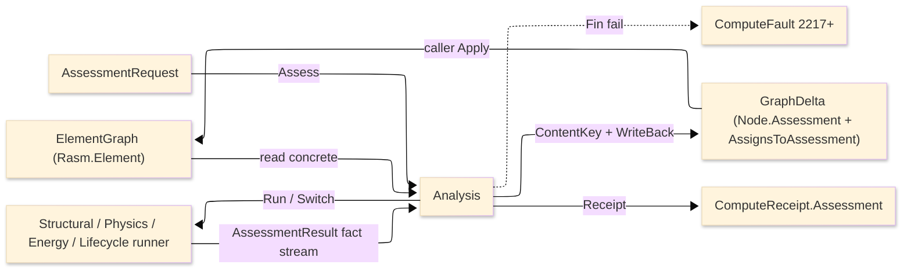

# [COMPUTE_ASSESSMENT]

Rasm.Compute assessment rail: the C#-first discipline-analysis spine that reads the concrete `Rasm.Element` `ElementGraph` DIRECTLY (above the seam, no `IElementProjection` — Compute is APP-PLATFORM consuming the AEC-domain seam upward), routes one polymorphic `AssessmentRequest` over the seam `Discipline` to a discipline runner, folds the discipline-specific input into ONE uniform `AssessmentResult` fact stream, content-keys it on the `(input subgraph, route)` pair, and writes it back as a seam `Node.Assessment` node attached to every target through the neutral `AssignsToAssessment` edge — one `GraphDelta` the caller applies. The page owns the `AssessmentRoute` standard-code axis, the `AssessmentRequest` discipline-input union, the uniform `AssessmentResult`/`AssessmentFact`/`AssessmentVerdict` carrier, the `Analysis.Assess` dispatch-and-writeback entry, the `(input, route)` content-key over the kernel `XxHash128` seeded by the route `Key`, the three new `ComputeFault` band-2200 cases (`2217+`), and the `ComputeReceipt.Assessment` outcome case. Every runner (`Analysis/structural`, `Analysis/physics`, `Analysis/energy`, `Analysis/lifecycle`) reads the concrete graph, composes the relocated `Analysis/aggregator` multi-ply engine where a layered property is needed, and returns the one fact stream this spine writes back — closed-form physics, FE solves, the energy subprocess, and the EC3 read live in the runners, NEVER in the seam. The discipline vocabulary, the typed value family (`PropertyValue`/`MeasureValue`/`PropertyName`), the `Node.Assessment` case, the `GraphDelta` merge type, and the `ContentAddress` value-object arrive settled from `Rasm.Element`; Compute decodes and writes, never re-mints them.

## [01]-[INDEX]

- [01]-[ROUTE_AXIS]: the `AssessmentRoute` `[SmartEnum<string>]` standard-code rows carrying the seam `Discipline` and the citation, and the `AssessmentVerdict` ratio-banded outcome.
- [02]-[REQUEST_FAMILY]: the `AssessmentRequest` `[Union]` discipline-input cases, the shared `Targets`/`Route`/`Discipline` projection, and the uniform `AssessmentResult`/`AssessmentFact` fact-stream carrier.
- [03]-[DISPATCH_WRITEBACK]: the `Analysis.Assess` route-to-runner dispatch, the `(input subgraph, route)` content-key, the `Node.Assessment` write-back `GraphDelta`, the three `ComputeFault` cases, and the `ComputeReceipt.Assessment` outcome.

## [02]-[ROUTE_AXIS]

- Owner: `AssessmentRoute` `[SmartEnum<string>]` the standard-code axis under the settled `ComputeKeyPolicy` ordinal accessor, each row carrying the seam `Discipline` it serves and the human citation; `AssessmentVerdict` `[SmartEnum<string>]` the ratio-banded outcome with a `Critical` column and the `FromRatio` projection.
- Cases: structural rows `aisc360`/`en1993`/`en1992`/`nds`/`aci318`/`tms402`/`aisi-s100`; thermal rows `iso6946`/`en13788`; acoustic row `iso12354`; fire rows `en1993-1-2`/`en1992-1-2`; energy row `energyplus`; environmental row `en15978`; cost row `cost-in-place` — every analysis route a row carrying its `Discipline` and citation, never a parallel per-discipline enum; `AssessmentVerdict` rows `satisfied`/`marginal`/`exceeded`/`not-applicable`.
- Entry: the route is a value the `AssessmentRequest` case carries and the content-key folds; `AssessmentVerdict.FromRatio(double ratio, double marginBand)` bands a governing utilization/criticality ratio into the outcome — `> 1.0` exceeded, `>= marginBand` marginal, finite-and-below satisfied, non-finite not-applicable, so a verdict is DERIVED from the governing ratio, never a stored flag that drifts from it.
- Packages: Thinktecture.Runtime.Extensions, Rasm.Element (project — `Discipline`), BCL inbox.
- Growth: a new design code or standard is one `AssessmentRoute` row carrying its `Discipline` and citation; a new discipline is one seam `Discipline` row plus the routes that serve it — the route axis widens by data and the dispatch `Switch` breaks at compile time until the new discipline's runner arm exists; zero new surface.
- Boundary: the route `Discipline` is the seam vocabulary, never re-declared here — a Compute-local discipline enum is the deleted form; the route key is a load-bearing content-key component (changing the code re-keys the assessment) so the key is the smart-enum `Key`, never a free string; `AssessmentVerdict` is derived from the governing ratio at projection time so the receipt verdict and the fact stream cannot disagree.

```csharp signature
// --- [TYPES] -------------------------------------------------------------------------------
[SmartEnum<string>]
[KeyMemberEqualityComparer<ComputeKeyPolicy, string>]
[KeyMemberComparer<ComputeKeyPolicy, string>]
public sealed partial class AssessmentRoute {
    public static readonly AssessmentRoute Aisc360   = new("aisc360",     Discipline.Structural,    "AISC 360-22");
    public static readonly AssessmentRoute En1993    = new("en1993",      Discipline.Structural,    "EN 1993-1-1:2005");
    public static readonly AssessmentRoute En1992    = new("en1992",      Discipline.Structural,    "EN 1992-1-1:2004");
    public static readonly AssessmentRoute Nds       = new("nds",         Discipline.Structural,    "NDS 2018");
    public static readonly AssessmentRoute Aci318    = new("aci318",      Discipline.Structural,    "ACI 318-19");
    public static readonly AssessmentRoute Tms402    = new("tms402",      Discipline.Structural,    "TMS 402-22");
    public static readonly AssessmentRoute AisiS100  = new("aisi-s100",   Discipline.Structural,    "AISI S100-16");
    public static readonly AssessmentRoute Iso6946   = new("iso6946",     Discipline.Thermal,       "ISO 6946:2017");
    public static readonly AssessmentRoute En13788   = new("en13788",     Discipline.Thermal,       "EN ISO 13788:2012");
    public static readonly AssessmentRoute Iso12354  = new("iso12354",    Discipline.Acoustic,      "ISO 12354-1:2017");
    public static readonly AssessmentRoute En1993Fire = new("en1993-1-2", Discipline.Fire,          "EN 1993-1-2:2005");
    public static readonly AssessmentRoute En1992Fire = new("en1992-1-2", Discipline.Fire,          "EN 1992-1-2:2004");
    public static readonly AssessmentRoute EnergyPlus = new("energyplus", Discipline.Energy,        "EnergyPlus 25.2 / ISO 52016");
    public static readonly AssessmentRoute En15978   = new("en15978",     Discipline.Environmental, "EN 15978:2011");
    public static readonly AssessmentRoute CostInPlace = new("cost-in-place", Discipline.Cost,      "in-place unit cost");

    public Discipline Discipline { get; }
    public string Standard { get; }
}

[SmartEnum<string>]
[KeyMemberEqualityComparer<ComputeKeyPolicy, string>]
public sealed partial class AssessmentVerdict {
    public static readonly AssessmentVerdict Satisfied     = new("satisfied",      critical: false);
    public static readonly AssessmentVerdict Marginal      = new("marginal",       critical: false);
    public static readonly AssessmentVerdict Exceeded      = new("exceeded",       critical: true);
    public static readonly AssessmentVerdict NotApplicable = new("not-applicable", critical: false);

    public bool Critical { get; }

    public static AssessmentVerdict FromRatio(double ratio, double marginBand = 0.95) =>
        !double.IsFinite(ratio) ? NotApplicable
        : ratio > 1.0           ? Exceeded
        : ratio >= marginBand   ? Marginal
        : Satisfied;
}
```

## [03]-[REQUEST_FAMILY]

- Owner: `AssessmentRequest` `[Union]` the discipline-input axis — one case per discipline carrying its target `NodeId` set, its `AssessmentRoute`, and the discipline policy; the shared `Targets`/`Route`/`Discipline` projection folds over the generated `Switch`; `AssessmentResult` the ONE uniform outcome carrier; `AssessmentFact` the typed neutral `(PropertyName, PropertyValue)` fact the runners emit and the write-back stores.
- Cases: `Structural(targets, route, combinations, policy)` · `Thermal(targets, route, climate)` · `Acoustic(targets, route)` · `Fire(targets, route, exposure, requiredMinutes, utilization)` · `Energy(targets, route, weather, policy)` · `Carbon(targets, route, query)` · `Cost(targets, route, currency)` — the discipline-SPECIFIC input is the case payload; the RESULT is the uniform `AssessmentResult` fact stream every runner returns, so a `StructuralResult`/`ThermalResult` parallel result family is the rejected form collapsed onto one fact stream with `(PropertyName, PropertyValue)` slot/kind metadata.
- Entry: a runner consumes one `AssessmentRequest` case and returns `Fin<AssessmentResult>`; `AssessmentResult.Of(route, facts, governingRatio, provenance, at)` mints the carrier deriving the `Verdict` from the governing ratio so the verdict and the facts share one source.
- Packages: Thinktecture.Runtime.Extensions, LanguageExt.Core, Rasm.Element (project — `NodeId`, `PropertyName`, `PropertyValue`, `Provenance`, `Discipline`), NodaTime, BCL inbox.
- Growth: a new discipline is one `AssessmentRequest` case carrying its typed input plus one dispatch arm — the generated `Switch` breaks at compile time until the arm exists; a new fact on any discipline is one `(PropertyName, PropertyValue)` row in the runner's fold, never a new result type; zero new surface.
- Boundary: arity discriminates on the case payload shape (the discipline input), never a name suffix or a mode flag; `Targets` is a seam `NodeId` set so a runner reads only the reachable target subgraph and never invents node identities; the discipline policy (combinations, climate, weather, query) is the case payload, never an ambient global; `AssessmentFact.Value` is the seam `PropertyValue` union (a `Measure(MeasureValue)` carries the SI scalar and unit) so a fact is typed and unit-bearing, never a bare double the consumer must re-interpret; the uniform `AssessmentResult` IS the discipline-specific result shape — discipline-specificity lives in the FACTS, not in parallel carriers.

```csharp signature
// --- [MODELS] ------------------------------------------------------------------------------
public readonly record struct AssessmentFact(PropertyName Name, PropertyValue Value) {
    public static AssessmentFact Measure(string name, MeasureValue value) => new(PropertyName.Of(name), PropertyValue.Measure(value));
    public static AssessmentFact Ratio(string name, double value)         => new(PropertyName.Of(name), PropertyValue.Bounded(value, 0.0, double.PositiveInfinity));
    public static AssessmentFact Text(string name, string value)          => new(PropertyName.Of(name), PropertyValue.Text(value));
    public static AssessmentFact Flag(string name, bool value)            => new(PropertyName.Of(name), PropertyValue.Boolean(value));
    public static AssessmentFact Reference(string name, NodeId target)    => new(PropertyName.Of(name), PropertyValue.Reference(target));
}

public sealed record AssessmentResult(
    Discipline Discipline,
    AssessmentRoute Route,
    Seq<AssessmentFact> Facts,
    AssessmentVerdict Verdict,
    double GoverningRatio,
    Provenance Provenance,
    Instant At) {
    public static AssessmentResult Of(AssessmentRoute route, Seq<AssessmentFact> facts, double governingRatio, Provenance provenance, Instant at) =>
        new(route.Discipline, route, facts, AssessmentVerdict.FromRatio(governingRatio), governingRatio, provenance, at);
}

[Union(ConversionFromValue = ConversionOperatorsGeneration.None)]
public abstract partial record AssessmentRequest {
    private AssessmentRequest() { }

    public sealed record Structural(Seq<NodeId> Targets, AssessmentRoute Route, Seq<LoadCombinationSpec> Combinations, StructuralPolicy Policy) : AssessmentRequest;
    public sealed record Thermal(Seq<NodeId> Targets, AssessmentRoute Route, BoundaryClimate Climate) : AssessmentRequest;
    public sealed record Acoustic(Seq<NodeId> Targets, AssessmentRoute Route) : AssessmentRequest;
    public sealed record Fire(Seq<NodeId> Targets, AssessmentRoute Route, FireExposure Exposure, double RequiredMinutes, double Utilization) : AssessmentRequest;
    public sealed record Energy(Seq<NodeId> Targets, AssessmentRoute Route, WeatherRef Weather, EnergyPolicy Policy) : AssessmentRequest;
    public sealed record Carbon(Seq<NodeId> Targets, AssessmentRoute Route, CarbonQuery Query) : AssessmentRequest;
    public sealed record Cost(Seq<NodeId> Targets, AssessmentRoute Route, string Currency) : AssessmentRequest;

    public AssessmentRoute Route => this.Switch(
        structural: static r => r.Route, thermal: static r => r.Route, acoustic: static r => r.Route, fire: static r => r.Route,
        energy:     static r => r.Route, carbon:  static r => r.Route, cost:     static r => r.Route);

    public Seq<NodeId> Targets => this.Switch(
        structural: static r => r.Targets, thermal: static r => r.Targets, acoustic: static r => r.Targets, fire: static r => r.Targets,
        energy:     static r => r.Targets, carbon:  static r => r.Targets, cost:     static r => r.Targets);

    public Discipline Discipline => Route.Discipline;
}
```

## [04]-[DISPATCH_WRITEBACK]

- Owner: `Analysis` the static dispatch-and-writeback entry; the `(input subgraph, route)` content-key over the kernel `XxHash128` seeded by the route `Key`; the `Node.Assessment` write-back `GraphDelta`; the three new `ComputeFault` band-2200 cases (`AssessmentInputMissing` 2217, `ToolchainUnresolved` 2218, `AnalysisRunFailed` 2219, the block above the Symbolic-lane `2213..2216`); the `ComputeReceipt.Assessment` outcome case.
- Entry: `public static Fin<GraphDelta> Assess(ElementGraph graph, AssessmentRequest request, CorrelationId correlation, ClockPolicy clocks)` — `Fin<T>` aborts; `Run` routes the request case to its discipline runner through the generated total `Switch`, `WriteBack` content-keys the result and folds it into one `Node.Assessment` node assigned to every target; `Receipt` projects the run onto the package `ComputeReceipt.Assessment` case for the telemetry rail.
- Auto: the content-key derives from the canonical bytes of the target subgraph (each target's seam `Node.ToCanonicalBytes()`, H7) seeded by the route `Key`, so an identical `(subgraph, route)` is a cache hit and a 412-noop on the Persistence object store — the same `XxHash128` seed-zero discipline the kernel and `Runtime/admission` `Digest` already ride, never a second hasher; the assessment `NodeId` is content-addressed from that key so a re-assessment of an unchanged subgraph addresses the same node.
- Receipt: the `Assessment` `ComputeReceipt` case carries the discipline key, the route key, the content-key, the verdict key, the governing ratio, and the admitted flag; faults project through the one `FaultDetail` wire family at the server edge.
- Packages: Thinktecture.Runtime.Extensions, LanguageExt.Core, System.IO.Hashing, NodaTime, Rasm.Element (project — `ElementGraph`, `Node`, `NodeId`, `GraphDelta`, `Relationship`, `ContentAddress`, `Provenance`), BCL inbox.
- Growth: a new discipline runner is one `Run` arm (the generated `Switch` breaks until it exists); a new fault is one `ComputeFault` case at the next-free 2200 code (`2220+`); the assessment outcome rides the one `ComputeReceipt.Assessment` case — a parallel assessment fault union or a second receipt union is the rejected form per the package prohibition set.
- Boundary: the runner reads the CONCRETE `ElementGraph` directly — Compute is APP-PLATFORM above the AEC-domain seam, so it consumes `Rasm.Element` upward and never goes through `IElementProjection` (that interface is the AEC-domain projector seam, not an analysis read path); the write-back produces a `GraphDelta` the CALLER applies (`graph.Apply(delta)` → `Fin<ElementGraph>`) so this owner never mutates a graph in place — the seam owns the immutable apply; the assessment node carries the typed `(PropertyName, PropertyValue)` fact bag (the "everything baked in" payload a wire consumer reads in one hop) keyed by `Discipline` + content-key + `Provenance`, attached to every target through the neutral `AssignsToAssessment` edge the seam mints (Compute never re-mints the seam edge algebra); the `AssessmentInputMissing` fault rails when a target subgraph lacks a node/property/section a route requires (an under-specified element is a typed fault the caller surfaces, never a silently-defaulted assessment); a forced re-run past a cache hit is legal only as a traced policy on the request, never a silent recompute of a token-metered or compute-heavy route; the persisted `Assessment.Result` payload is a content-keyed artifact registered in the Persistence `Version/retention#RETENTION_CLASSES` `blob` class (content-keyed identity scheme, full-history-reachable, GC-protected) through the object-store lane, so a historical assessment a prior snapshot references survives the retention sweep and an identical `(subgraph, route)` re-assessment dedups as a 412-noop — never a per-assessment retention table or a second blob class.

```csharp signature
// --- [ERRORS] ------------------------------------------------------------------------------
// The assessment cases extend the one ComputeFault band as a partial on the Runtime/admission owner
// (admission owns the 2200..2212 core; the Symbolic lane owns 2213..2216; the analysis block is the next-free 2217..2219) —
// never a parallel AssessmentFault union; every fault crosses the wire through the one FaultDetail family.
public abstract partial record ComputeFault {
    public sealed record AssessmentInputMissing : ComputeFault { public AssessmentInputMissing(string detail) : base(detail, 2217) { } }
    public sealed record ToolchainUnresolved : ComputeFault { public ToolchainUnresolved(string detail) : base(detail, 2218) { } }
    public sealed record AnalysisRunFailed : ComputeFault { public AnalysisRunFailed(string detail) : base(detail, 2219) { } }
}

// --- [SERVICES] ----------------------------------------------------------------------------
// The assessment outcome rides the one ComputeReceipt union (Runtime/receipts owns it) — a partial case, never a
// second receipt union; the inherited init members (Correlation/Lane/Substrate/AllocationClass/Elapsed) stamp at mint.
public abstract partial record ComputeReceipt {
    public sealed record Assessment(string Discipline, string Route, UInt128 Key, string Verdict, double GoverningRatio, bool Admitted) : ComputeReceipt;
}

// --- [OPERATIONS] --------------------------------------------------------------------------
public static class Analysis {
    public static Fin<GraphDelta> Assess(ElementGraph graph, AssessmentRequest request, CorrelationId correlation, ClockPolicy clocks) =>
        Run(graph, request, clocks).Map(result => WriteBack(graph, request, result));

    static Fin<AssessmentResult> Run(ElementGraph graph, AssessmentRequest request, ClockPolicy clocks) =>
        request.Switch(
            structural: r => StructuralAnalysis.Run(graph, r, clocks),
            thermal:    r => BuildingPhysics.RunThermal(graph, r, clocks),
            acoustic:   r => BuildingPhysics.RunAcoustic(graph, r, clocks),
            fire:       r => BuildingPhysics.RunFire(graph, r, clocks),
            energy:     r => EnergySimulation.Run(graph, r, clocks),
            carbon:     r => LifecycleAssessment.RunCarbon(graph, r, clocks),
            cost:       r => LifecycleAssessment.RunCost(graph, r, clocks));

    static GraphDelta WriteBack(ElementGraph graph, AssessmentRequest request, AssessmentResult result) {
        ContentAddress key = ContentKey(graph, request);
        Node.Assessment node = new(result.Discipline, key, result.Provenance, result.Facts.Map(static f => (f.Name, f.Value)), result.Verdict.Key, result.GoverningRatio, result.At);
        return GraphDelta.Empty.WithNode(NodeId.OfContent(key), node).Assigning(request.Targets, NodeId.OfContent(key));
    }

    public static ContentAddress ContentKey(ElementGraph graph, AssessmentRequest request) =>
        ContentAddress.Of(SubgraphHash(graph, request.Targets, request.Route.Key));

    static UInt128 SubgraphHash(ElementGraph graph, Seq<NodeId> targets, string routeKey) {
        XxHash128 hash = new(seed: unchecked((long)(ulong)XxHash128.HashToUInt128(MemoryMarshal.AsBytes(routeKey.AsSpan()))));
        foreach (NodeId id in targets.OrderBy(static t => t.Value, StringComparer.Ordinal)) {
            graph.Find(id).IfSome(node => hash.Append(node.ToCanonicalBytes().Span));
        }
        return hash.GetCurrentHashAsUInt128();
    }

    public static ComputeReceipt.Assessment Receipt(AssessmentResult result, ContentAddress key, CorrelationId correlation, Duration elapsed) =>
        new(result.Discipline.Key, result.Route.Key, key.Value, result.Verdict.Key, result.GoverningRatio, Admitted: !result.Verdict.Critical) {
            Correlation = correlation, Lane = WorkLane.Background, Substrate = Substrate.CpuTensor, AllocationClass = AllocationClass.PooledMemory, Elapsed = elapsed,
        };
}
```



## [05]-[RESEARCH]

- [SEAM_VOCABULARY]: the assessment rail composes the `Rasm.Element` seam vocabulary as settled imports — `ElementGraph` (the `Header` + `Nodes:FrozenDictionary<NodeId,Node>` + `Relationships:Seq<Relationship>` + incidence index + `Find`/`Bake`/`Apply`), `Node.Assessment` (the generic typed-payload case keyed by `Discipline` + `ContentAddress` + `Provenance`), `NodeId.OfContent(ContentAddress)` (the non-rooted content-addressed id, H6), `PropertyValue`/`MeasureValue`/`PropertyName` (the typed value family), `GraphDelta` (the one merge type with the `WithNode`/`Assigning` builder over the neutral `AssignsToAssessment` edge, C5), `ContentAddress` (the `[ValueObject<UInt128>]` over the kernel seed-zero hash), `Node.ToCanonicalBytes()` (the H7 canonical projection the content-key folds), and `Discipline` (the one `[SmartEnum<string>]` Structural/Thermal/Energy/Acoustic/Fire/Environmental/Cost). Compute decodes and writes these; the seam owns their declaration. Ripple counterpart: `Rasm.Element` `Assessment/assessment` (the seam `Node.Assessment` + `AssignsToAssessment` owner) and `Graph/delta` (the `GraphDelta` builder).
- [ABOVE_THE_SEAM_READ]: the analysis runners read the CONCRETE `ElementGraph` directly — this is the `§4E` "above the seam, no interface" rail. `IElementProjection` is the AEC-domain projector seam (Bim's `SemanticProjector`, Materials' `MaterialProjector`) that LOWERS a foreign source INTO the graph; the analysis rail consumes the ALREADY-BAKED graph and never implements or invokes that interface. Compute references `Rasm.Element` (the shared lower stratum, the same upward-consuming shape as referencing the kernel), never the AEC-domain peers `Rasm.Materials`/`Rasm.Bim` — alignment travels through the seam graph, not a sibling project reference.
- [CONTENT_KEY_PARITY]: the `(input subgraph, route)` content-key folds each target's seam `Node.ToCanonicalBytes()` (the H7 fixed-IEEE-754 / tolerance-quantized / attribute-ordered projection) into the kernel `XxHash128` SEEDED by the route `Key` — the same `XxHash128` hasher the `Runtime/codecs#CONTENT_ADDRESSING` rail and the Persistence artifact index already ride — so the key is stable across runtimes and the float-bearing golden vector parity corpus covers it; Compute composes the kernel hasher, never a second algorithm.
- [FACT_STREAM_COLLAPSE]: the uniform `AssessmentResult` fact stream is the doctrinal collapse of seven parallel discipline-result records into one `(PropertyName, PropertyValue)` slot/kind carrier — a structural check emits `utilization`/`limit-state`/`governing-member` facts, a thermal run `u-value`/`condensation-risk` facts, an energy run `eui`/`heating-demand`/`cooling-demand` facts, all into the same stream the write-back stores; the discipline-specificity is the fact set, not the carrier, so a new discipline never mints a new result type. The pattern mirrors the `Runtime/receipts` one-fact-union discipline.
- [RECEIPT_FAULT_BAND]: the assessment outcome is one `ComputeReceipt.Assessment` case and the faults extend the one `ComputeFault` 2200 band at `2217+` (the 2200..2212 core is `Runtime/admission`-owned and the Symbolic lane owns 2213..2216, so the analysis block is the next-free 2217..2219) — never a parallel union — so a device/symbolic/learning/constitutive fault and an assessment fault still cross the wire through the one `FaultDetail` family the `Runtime/channels` projection owns. Ripple counterpart: `Runtime/admission` (the `ComputeFault` band registry) carries the analysis block in its band custody and `Runtime/receipts` (the `ComputeReceipt` union index) carries the `Assessment` case as the `[JsonDerivedType]` registration and the wire projection, both owning the registry while this discipline page declares the partial cases.
