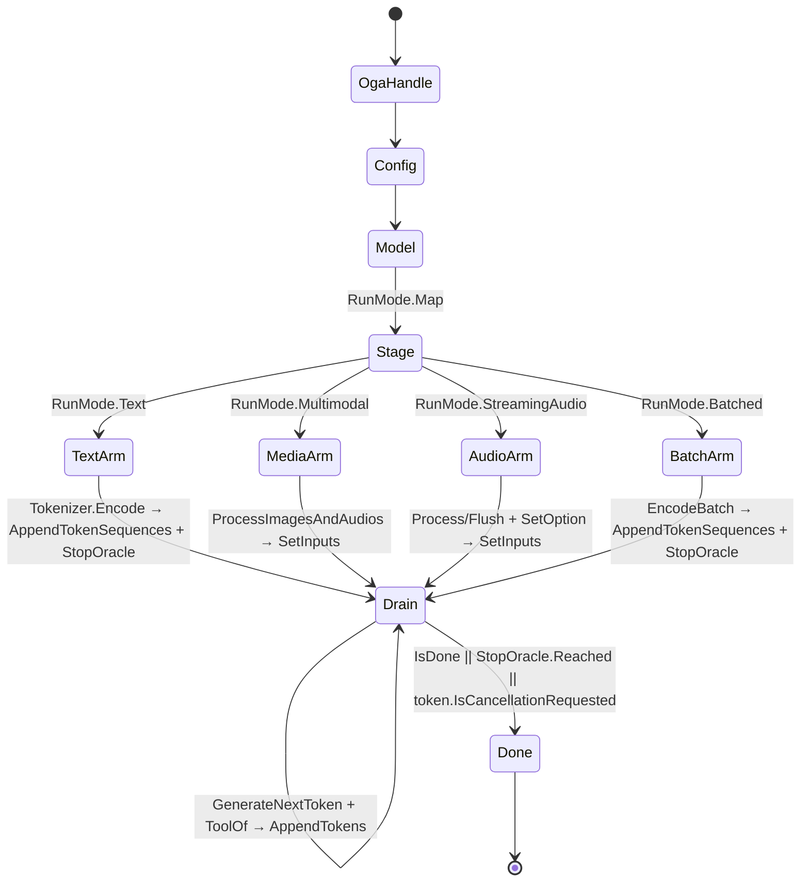

# [COMPUTE_GENERATIVE]

Rasm.Compute model generative run: the ORT-GenAI token-streaming generative owner over text/multimodal/streaming-audio/batched shapes with EOS oracle, decoder-hardware pins, in-memory model admission, the LoRA hot-swap registry, and the tool-call arm. The page owns the `GenerationPolicy` search-option and prompt-assembly record with its `SearchKey`/`GuidanceKind`/`RunMode` axes, the `DecoderPin`/`ModelData`/`ToolRequest`/`StopOracle`/`MultiModalAssets` carriers, the `AdapterSet` LoRA registry, and the `GenerativeRun` boundary capsule with its `Stream`/`Stage`/`Collect`/`Receipt` fold over Microsoft.ML.OnnxRuntimeGenAI; the generative handle chain rides `Microsoft.ML.OnnxRuntimeGenAI` and the streaming abstraction `Microsoft.Extensions.AI.Abstractions`, the `ModelIdentity` from `Model/identity#MODEL_IDENTITY`, the `ExecutionProvider` from `Model/providers#EP_AXIS`, the AppHost `CancelScope`/`ClockPolicy` and control dispatch, and `NodaTime` arrive settled. The `Generate` receipt is the catalogued 8-field case at `Runtime/receipts#RECEIPT_UNION`, and a remote generative run crosses solely through the `Runtime/channels#PROTO_VOCABULARY` `Generate` rpc.

## [1]-[INDEX]

- [1]-[GENERATIVE_RUN]: ORT-GenAI token-streaming owner; one staged-input drain fold; EOS oracle; decoder-hardware pins; in-memory model admission; search-option table; guidance; multimodal, streaming-audio, and batched shapes; tool-call arm.

## [2]-[GENERATIVE_RUN]

- Owner: `GenerationPolicy` search-option and prompt-assembly record carrying the `SearchKey` `[SmartEnum<string>]` recognized-key axis, the `GenerationPolicy.SearchRows` value table, the decoder-hardware-pin column, the in-memory model-data column, and the tool registry; `GuidanceKind` `[SmartEnum<string>]` structured-output constraint rows; `RunMode` `[SmartEnum<string>]` text/multimodal/streaming-audio/batched generative-shape rows; `Adapters`-backed `AdapterSet` LoRA hot-swap registry; `StopOracle` the EOS/BOS/PAD set read once at stream open; `GenerativeRun` boundary capsule owning the ORT-GenAI handle chain, one staged-input drain fold, the LoRA-activation arm, the streaming-audio arm, the batched arm, and the tool-call arm over Microsoft.ML.OnnxRuntimeGenAI.
- Cases: `GuidanceKind` rows none · json-schema · regex · lark-grammar · choice; `SearchKey` rows num_beams · length_penalty · repetition_penalty · top_k · top_p · temperature · do_sample · max_length · min_length · early_stopping; `RunMode` rows text · multimodal · streaming-audio · batched.
- Entry: `public static async IAsyncEnumerable<string> Stream(ModelIdentity model, string modelDir, GenerationPolicy policy, string prompt, ExecutionProvider ep, Option<AdapterSet> adapters, [EnumeratorCancellation] CancellationToken token)` — the stream yields incremental decoded pieces; a `OnnxRuntimeGenAIException` lifts into `ComputeFault.ModelRejected` at the boundary so domain code never sees the native exception, and a cancelled stream lifts into `ComputeFault.Cancelled`/`DeadlineExpired` through the `Collect` rail, never a raw `OperationCanceledException` past the boundary.
- Auto: the search-option fold folds the `GenerationPolicy.SearchRows` value table over the `SearchKey` axis through `GeneratorParams.SetSearchOption(string, double)` for every numeric row and `SetSearchOption(string, bool)` for every flag row — no string-valued overload exists, the recognized key strings (`num_beams`/`length_penalty`/`repetition_penalty`/`top_k`/`top_p`/`temperature`/`do_sample`/`max_length`/`min_length`/`early_stopping`) live as `SearchKey.Key` not as call-site literals, and `Echo` reads any row back through `GetSearchNumber(string)`/`GetSearchBool(string)` for the receipt; `Guidance` writes through `GeneratorParams.SetGuidance(string type, string data, bool enableFFTokens)` before `Generator` construction so a constrained run can only emit syntactically valid tokens; the config opens from a directory through `new Config(modelDir)` OR, when the policy carries in-memory model bytes, through `config.AddModelData(filename, bytes)` + optional `config.Overlay(json)` before `new Model(config)` (with `RemoveModelData(filename)` the retract arm), so an in-memory model is admitted without a model directory; the decoder-hardware pins write through `config.SetDecoderProviderOptionsHardwareDeviceType`/`HardwareDeviceId`/`HardwareVendorId` when the policy targets a specific decoder device (with the `Clear*` family the retract path); the LoRA arm loads each named adapter once through `Adapters.LoadAdapter(path, name)` and activates the policy's adapter mid-generation through `Generator.SetActiveAdapter(Adapters, string)` so a fine-tune swap is a name on the policy, never a second model load; the prompt assembles through `Tokenizer.ApplyChatTemplate(template, messages, tools, add_generation_prompt)` then `Encode`, so system prompt, history, retrieved context, and tool schemas serialize through the native template primitive, never a hand-rolled string concat; the `StopOracle` reads `Tokenizer.GetEosTokenIds()` (plus `GetBosTokenId()`/`GetPadTokenId()` for prompt assembly) once at stream open, and the ONE drain loop staged by the `RunMode` fold honors `StopOracle.Reached(sequence)` beside `IsDone()` over `GetSequence(0UL)[^1]`; the tool-call arm scans the decoded piece against the policy's tool registry, surfaces a decoded tool request to the AppHost control dispatch, and re-feeds the typed result through `Generator.AppendTokens(ReadOnlySpan<int>)`/`AppendTokenSequences(Sequences)` or rewinds a partial turn through `RewindTo(ulong)`, threading the real tool-call and constrained-token counts into the `Generate` receipt.
- Receipt: the `Generate` `ComputeReceipt` case carries model checksum, EP (whose `Precision.Key` rides the `ExecutionProvider` key so a quantized run is receipt-distinct), model-type from `Model.GetModelType()`, token count read back through `Generator.TokenCount()`, tokens-per-second, the `GuidanceKind` dimension, the constrained-token count, and the tool-call count — the catalogued 8-field `Generate` case at `Runtime/receipts#RECEIPT_UNION`; the `RunMode` and active-adapter dimensions ride the `rasm.compute.generate.tokens` instrument tags (`run.mode`, `lora.adapter`) rather than minting receipt fields, so a `RunMode`/adapter receipt column is a `receipts-and-benchmarks` owner change, never invented here; the `streaming` `ProgressPhase` and a `StreamSegment` receipt emit per chunk.
- Packages: Microsoft.ML.OnnxRuntimeGenAI, Microsoft.Extensions.AI.Abstractions, Microsoft.ML.OnnxRuntime, NodaTime, Thinktecture.Runtime.Extensions, LanguageExt.Core, Rasm.AppHost (project), BCL inbox
- Growth: a new search option is one `SearchKey` row plus one `SearchRows` value entry folded into the `SetSearchOption` rail — never a new fence statement; a new output constraint is one `GuidanceKind` row; a new generative shape is one `RunMode` row whose staged-input arm rides the one drain fold (the streaming-audio row adds the `StreamingProcessor.Process`/`Flush` VAD-chunked arm with its `SetOption` VAD/chunk policy column, the batched row adds the `Tokenizer.EncodeBatch`/`Sequences.NumSequences` fan-out, both composing the same generator and the same drain); a new fine-tune is one named adapter on `AdapterSet`; an in-memory model injected without a model directory is one `GenerationPolicy.ModelData` column folded into `Config.AddModelData`; the built-in `OnnxRuntimeGenAIChatClient : IChatClient` composes the same handle chain when the M.E.AI streaming abstraction is the consumer; zero new surface.
- Boundary: token-streaming is a run mode on this owned model lane composing the session and EP spine and is HOST-LOCAL — the cluster carries no TS_PROJECTION; a remote generative run crosses solely through the EXISTING `Runtime/channels#PROTO_VOCABULARY` `Generate` rpc (`GenerateRequest` → `TokenChunk` server-stream) projected once as the `ComputeServiceShape.generate` `MethodShape` at `remote-lane`, never re-projected here, and the decoded token pieces and `IAsyncEnumerable<string>` stream are interior types that never sit between wire and rail; a `GenerativeService`, `ChatClient`, `Conversation`, or `PromptService` is the rejected form, and the `Tokenizer`/`TokenizerStream` are session assets, never a tokenizer service family; every ORT-GenAI type is `IDisposable` wrapping a native handle and the `using` order is LIFO with `OgaHandle` outermost (process-global init/teardown); `Adapters : SafeHandle` is created per `Model` and lives for the adapter set's lifetime, released through `ReleaseHandle`→`OgaDestroyAdapters` at the `SafeHandle` GC boundary, so `AdapterSet` holds it for the model's resident lifetime and never re-creates per generation; the recognized `SetSearchOption` key strings are not validated at the managed boundary and an unrecognized key faults `OnnxRuntimeGenAIException` from native — the `SearchKey` axis is the managed registry the binary itself does not carry, so a literal key string at a call site is the named defect; spans returned by `GetSequence`/`GetNextTokens` are views over native memory owned by the live `Generator` — the newest token copies out before the next iteration and never retains past the loop, and `GetNextTokens()` (most-recently-generated span) is distinct from `GetSequence(ulong)` (full-sequence view); the EOS oracle is the `StopOracle` built once from `Tokenizer.GetEosTokenIds()` and honored beside `IsDone()` in the drain — a loop that honors only `IsDone()` is the named defect because a model with multiple EOS ids stops at the first matched id; cancellation is classified through the `Collect` rail by scope provenance into `ComputeFault.Cancelled`/`DeadlineExpired` and surfaced through the `Fin` rail — `token.ThrowIfCancellationRequested()` escaping the rail unclassified is the rejected form, so the drain polls `token.IsCancellationRequested` and breaks, and `Collect` catches `OperationCanceledException` beside `OnnxRuntimeGenAIException`; provider selection rides `Config.AppendProvider`/`SetProviderOption` before `new Model(config)` as a policy column, with the decoder-hardware pin riding `Config.SetDecoderProviderOptionsHardwareDeviceType`/`HardwareDeviceId`/`HardwareVendorId` when a decoder must target a specific device, never per-generation, and int8/int4 model quantization is a packaged genai-format model property (the `genai_config.json` the `Config(modelDir)` opens already carries the quantized weight layout) never a managed quantization knob here — the EP-side quantization knobs live on `Model/providers#EP_AXIS`, never a second quantization owner on this cluster; `Config.Overlay(json)` is the JSON-overlay column for a runtime config patch and `Config.AddModelData`/`RemoveModelData` admit/retract in-memory model bytes when no model directory exists; the EOS/BOS/PAD oracle rides `Tokenizer.GetEosTokenIds()`/`GetBosTokenId()`/`GetPadTokenId()` read once at stream open, never re-read per token; the tool-call arm surfaces a decoded tool request to the AppHost control dispatch and re-feeds the typed result through `Generator.AppendTokens(ReadOnlySpan<int>)`/`AppendTokenSequences(Sequences)` or rewinds a partial turn through `RewindTo(ulong)`, with the conversation and turn state owned by the caller, never here, and the real tool-call/constrained-token counts thread into the `Generate` receipt — a receipt hardcoding `0, 0` for those slots is the named defect; grammar-constrained structured output is enforced at generation through `SetGuidance` and a managed JSON-schema validator over the output is the rejected form; the `RunMode.Multimodal` image/audio-token row is a live `Stream` dispatch arm on the same handle chain — `MultiModalProcessor(Model)`, `StreamingProcessor`, `Images`/`Audios`, `NamedTensors`, `Tensor`, and `ElementType` are all public in the 0.14.1 managed assembly, so the multimodal arm stages `Images.Load(paths)`/`Audios.Load(paths)` through `MultiModalProcessor.ProcessImagesAndAudios(prompt, images, audios)` into a `NamedTensors` batch fed to `Generator.SetInputs(NamedTensors)` (a single named tensor injects through `SetModelInput(string, Tensor)` over a `Tensor(IntPtr, long[], ElementType)`) and decodes through the processor's own `CreateStream()`/`Decode(ReadOnlySpan<int>)`, never the text-mode `Tokenizer` seam; the `RunMode.StreamingAudio` row drives `StreamingProcessor.Process(float[])` per audio chunk — `null` until a VAD boundary, then `Flush()` drains the final fragment — feeding the same `Generator.SetInputs` and processor decode, with VAD and chunk policy threaded through `StreamingProcessor.SetOption(key, value)`/`GetOption(key)` (never a hard-defaulted VAD), never a second audio owner; the `RunMode.Batched` row drives `Tokenizer.EncodeBatch(string[])` → `Sequences` fed via `AppendTokenSequences`, fanning out over `Sequences.NumSequences` and decoding each through `Tokenizer.DecodeBatch(sequences)`, the highest-throughput generative shape on one generator; a second multimodal owner beside this `Stream` arm or a hand-rolled image-preprocessing kernel is the rejected form, and the only remaining `[GENAI_MULTIMODAL]` residual is a live vision-language genai-format asset for runtime validation.

```csharp signature
[SmartEnum<string>]
[KeyMemberEqualityComparer<ModelKeyPolicy, string>]
[KeyMemberComparer<ModelKeyPolicy, string>]
public sealed partial class GuidanceKind {
    public static readonly GuidanceKind None = new("none", type: "");
    public static readonly GuidanceKind JsonSchema = new("json-schema", type: "json_schema");
    public static readonly GuidanceKind Regex = new("regex", type: "regex");
    public static readonly GuidanceKind LarkGrammar = new("lark-grammar", type: "lark_grammar");
    public static readonly GuidanceKind Choice = new("choice", type: "choice");

    public string Type { get; }
}

[SmartEnum<string>]
[KeyMemberEqualityComparer<ModelKeyPolicy, string>]
[KeyMemberComparer<ModelKeyPolicy, string>]
public sealed partial class SearchKey {
    public static readonly SearchKey NumBeams = new("num_beams", flag: false);
    public static readonly SearchKey LengthPenalty = new("length_penalty", flag: false);
    public static readonly SearchKey RepetitionPenalty = new("repetition_penalty", flag: false);
    public static readonly SearchKey TopK = new("top_k", flag: false);
    public static readonly SearchKey TopP = new("top_p", flag: false);
    public static readonly SearchKey Temperature = new("temperature", flag: false);
    public static readonly SearchKey DoSample = new("do_sample", flag: true);
    public static readonly SearchKey MaxLength = new("max_length", flag: false);
    public static readonly SearchKey MinLength = new("min_length", flag: false);
    public static readonly SearchKey EarlyStopping = new("early_stopping", flag: true);

    public bool Flag { get; }
}

[SmartEnum<string>]
[KeyMemberEqualityComparer<ModelKeyPolicy, string>]
[KeyMemberComparer<ModelKeyPolicy, string>]
public sealed partial class RunMode {
    public static readonly RunMode Text = new("text", multimodal: false, streamingAudio: false, batched: false);
    public static readonly RunMode Multimodal = new("multimodal", multimodal: true, streamingAudio: false, batched: false);
    public static readonly RunMode StreamingAudio = new("streaming-audio", multimodal: true, streamingAudio: true, batched: false);
    public static readonly RunMode Batched = new("batched", multimodal: false, streamingAudio: false, batched: true);

    public bool Multimodal { get; }
    public bool StreamingAudio { get; }
    public bool Batched { get; }
}

public sealed record MultiModalAssets(Seq<string> ImagePaths, Seq<string> AudioPaths, Seq<float[]> AudioChunks, Seq<string> BatchPrompts) {
    public static readonly MultiModalAssets None = new(Seq<string>(), Seq<string>(), Seq<float[]>(), Seq<string>());
}

public sealed record DecoderPin(string Provider, string HardwareDeviceType, uint HardwareDeviceId, uint HardwareVendorId) {
    public void Apply(Config config) {
        config.SetDecoderProviderOptionsHardwareDeviceType(Provider, HardwareDeviceType);
        config.SetDecoderProviderOptionsHardwareDeviceId(Provider, HardwareDeviceId);
        config.SetDecoderProviderOptionsHardwareVendorId(Provider, HardwareVendorId);
    }

    public void Clear(Config config) {
        config.ClearDecoderProviderOptionsHardwareDeviceType(Provider);
        config.ClearDecoderProviderOptionsHardwareDeviceId(Provider);
        config.ClearDecoderProviderOptionsHardwareVendorId(Provider);
    }
}

public sealed record ModelData(string Filename, byte[] Bytes, string OverlayJson);

public sealed record ToolRequest(string Name, ReadOnlyMemory<int> ResultTokens);

public readonly record struct StopOracle(Set<int> EosIds, int BosId, int PadId) {
    public static StopOracle Read(Tokenizer tokenizer) =>
        new(toSeq(tokenizer.GetEosTokenIds().ToArray()).ToSet(), tokenizer.GetBosTokenId(), tokenizer.GetPadTokenId());

    public bool Reached(ReadOnlySpan<int> sequence) => sequence.Length > 0 && EosIds.Contains(sequence[^1]);
}

public sealed record GenerationPolicy(
    FrozenDictionary<SearchKey, double> SearchRows,
    RunMode Mode,
    GuidanceKind Guidance,
    string GuidanceData,
    bool FastForwardTokens,
    Option<string> Adapter,
    string SystemPrompt,
    string ChatTemplate,
    Seq<(string Role, string Content)> History,
    Seq<string> RetrievedContext,
    string Tools,
    Set<string> ToolNames,
    Option<DecoderPin> Decoder,
    Option<ModelData> InMemory,
    MultiModalAssets Assets) {
    public static readonly GenerationPolicy Canonical = new(
        SearchRows: new Dictionary<SearchKey, double> {
            [SearchKey.MaxLength] = 512.0, [SearchKey.MinLength] = 0.0, [SearchKey.Temperature] = 0.7,
            [SearchKey.TopP] = 0.9, [SearchKey.TopK] = 50.0, [SearchKey.RepetitionPenalty] = 1.0,
            [SearchKey.DoSample] = 1.0, [SearchKey.NumBeams] = 1.0, [SearchKey.LengthPenalty] = 1.0,
            [SearchKey.EarlyStopping] = 0.0,
        }.ToFrozenDictionary(),
        Mode: RunMode.Text, Guidance: GuidanceKind.None, GuidanceData: "", FastForwardTokens: false, Adapter: None,
        SystemPrompt: "", ChatTemplate: "", History: Seq<(string, string)>(), RetrievedContext: Seq<string>(), Tools: "",
        ToolNames: Set<string>(), Decoder: None, InMemory: None, Assets: MultiModalAssets.None);

    public static GenerationPolicy Beam(int beams, double lengthPenalty = 1.0) =>
        Canonical with {
            SearchRows = new Dictionary<SearchKey, double>(Canonical.SearchRows) {
                [SearchKey.NumBeams] = beams, [SearchKey.DoSample] = 0.0,
                [SearchKey.LengthPenalty] = lengthPenalty, [SearchKey.EarlyStopping] = 1.0,
            }.ToFrozenDictionary(),
        };

    public Config OpenConfig(string modelDir) {
        var config = new Config(modelDir);
        InMemory.Iter(data => {
            config.AddModelData(data.Filename, data.Bytes);
            if (data.OverlayJson.Length > 0) { config.Overlay(data.OverlayJson); }
        });
        Decoder.Iter(pin => pin.Apply(config));
        return config;
    }

    public void Apply(GeneratorParams generatorParams) {
        SearchRows.Iter(row => {
            if (row.Key.Flag) { generatorParams.SetSearchOption(row.Key.Key, row.Value != 0.0); }
            else { generatorParams.SetSearchOption(row.Key.Key, row.Value); }
        });
        if (Guidance != GuidanceKind.None) {
            generatorParams.SetGuidance(Guidance.Type, GuidanceData, FastForwardTokens);
        }
    }

    public FrozenDictionary<SearchKey, double> Echo(GeneratorParams generatorParams) =>
        SearchRows.Keys.ToFrozenDictionary(
            static key => key,
            key => key.Flag ? (generatorParams.GetSearchBool(key.Key) ? 1.0 : 0.0) : generatorParams.GetSearchNumber(key.Key));

    public Option<ToolRequest> ToolOf(string piece) =>
        ToolNames.Find(name => piece.Contains(name, StringComparison.Ordinal)).Map(name => new ToolRequest(name, ReadOnlyMemory<int>.Empty));

    public string Messages(string prompt) =>
        JsonSerializer.Serialize(
            (Seq(("system", SystemPrompt)) + History + Seq(("user", $"{string.Join('\n', RetrievedContext)}\n{prompt}")))
                .Map(static turn => new { role = turn.Item1, content = turn.Item2 }));
}

public sealed class AdapterSet : IDisposable {
    readonly Adapters adapters;
    Set<string> loaded = Set<string>();

    public AdapterSet(Model model) => adapters = new Adapters(model);

    public Fin<AdapterSet> Load(string name, string adapterPath) {
        if (loaded.Contains(name)) { return Fin.Succ(this); }
        if (!File.Exists(adapterPath)) { return Fin.Fail<AdapterSet>(new ComputeFault.ExtensionAssetMissing(adapterPath)); }
        adapters.LoadAdapter(adapterPath, name);
        loaded = loaded.Add(name);
        return Fin.Succ(this);
    }

    public Fin<Unit> Unload(string name) {
        if (!loaded.Contains(name)) { return Fin.Succ(unit); }
        adapters.UnloadAdapter(name);
        loaded = loaded.Remove(name);
        return Fin.Succ(unit);
    }

    public void Activate(Generator generator, string name) => generator.SetActiveAdapter(adapters, name);

    public void Dispose() => adapters.Dispose();
}

public static class GenerativeRun {
    public static async IAsyncEnumerable<string> Stream(ModelIdentity model, string modelDir, GenerationPolicy policy, string prompt, ExecutionProvider ep, Option<AdapterSet> adapters, [EnumeratorCancellation] CancellationToken token) {
        using var oga = new OgaHandle();
        using var config = policy.OpenConfig(modelDir);
        if (ep != ExecutionProvider.Cpu) {
            config.AppendProvider(ep.Key);
            ep.Options.Iter(option => config.SetProviderOption(ep.Key, option.Key, option.Value));
        }
        using var session = new Model(config);
        using var generatorParams = new GeneratorParams(session);
        policy.Apply(generatorParams);
        using var generator = new Generator(session, generatorParams);
        adapters.Iter(set => policy.Adapter.Iter(name => set.Activate(generator, name)));

        var staged = Stage(session, generator, policy, prompt);
        var stop = staged.Stop;
        using (staged.Decoder) {
            while (!generator.IsDone()) {
                if (token.IsCancellationRequested) { throw new OperationCanceledException(token); }
                generator.GenerateNextToken();
                var sequence = generator.GetSequence(0UL);
                if (stop.Case is StopOracle oracle && oracle.Reached(sequence)) { break; }
                var piece = staged.Decode(sequence[^1]);
                if (policy.ToolOf(piece).Case is ToolRequest call && !call.ResultTokens.IsEmpty) {
                    generator.AppendTokens(call.ResultTokens.Span);
                }
                yield return piece;
            }
        }
    }

    sealed record StagedRun(TokenizerStream Decoder, Func<int, string> Decode, Option<StopOracle> Stop);

    static StagedRun Stage(Model session, Generator generator, GenerationPolicy policy, string prompt) =>
        policy.Mode.Switch(
            state: (Session: session, Generator: generator, Policy: policy, Prompt: prompt),
            text: static s => {
                var tokenizer = new Tokenizer(s.Session);
                var stop = StopOracle.Read(tokenizer);
                var stream = tokenizer.CreateStream();
                using var encoded = tokenizer.Encode(tokenizer.ApplyChatTemplate(s.Policy.ChatTemplate, s.Policy.Messages(s.Prompt), s.Policy.Tools, true));
                s.Generator.AppendTokenSequences(encoded);
                return new StagedRun(stream, stream.Decode, Some(stop));
            },
            multimodal: static s => {
                var processor = new MultiModalProcessor(s.Session);
                var stream = processor.CreateStream();
                using var images = Images.Load(s.Policy.Assets.ImagePaths.ToArray());
                using var audios = Audios.Load(s.Policy.Assets.AudioPaths.ToArray());
                using var batch = processor.ProcessImagesAndAudios(s.Policy.Messages(s.Prompt), images, audios);
                s.Generator.SetInputs(batch);
                return new StagedRun(stream, stream.Decode, None);
            },
            streamingAudio: static s => {
                var processor = new StreamingProcessor(s.Session);
                if (!s.Policy.Assets.AudioChunks.IsEmpty) { processor.SetOption("vad", "1"); }
                var stream = new MultiModalProcessor(s.Session).CreateStream();
                s.Policy.Assets.AudioChunks.Iter(chunk => { if (processor.Process(chunk) is NamedTensors chunkTensors) { using (chunkTensors) { s.Generator.SetInputs(chunkTensors); } } });
                if (processor.Flush() is NamedTensors final) { using (final) { s.Generator.SetInputs(final); } }
                return new StagedRun(stream, stream.Decode, None);
            },
            batched: static s => {
                var tokenizer = new Tokenizer(s.Session);
                var stop = StopOracle.Read(tokenizer);
                var stream = tokenizer.CreateStream();
                using var encoded = tokenizer.EncodeBatch(s.Policy.Assets.BatchPrompts.ToArray());
                s.Generator.AppendTokenSequences(encoded);
                return new StagedRun(stream, stream.Decode, Some(stop));
            });

    public static ComputeReceipt.Generate Receipt(ModelIdentity model, ExecutionProvider ep, string modelType, GenerationPolicy policy, CorrelationId correlation, ulong tokenCount, int constrainedTokens, int toolCalls, Duration elapsed) =>
        new(model.Key, ep, modelType, checked((int)tokenCount),
            elapsed.TotalSeconds > 0.0 ? tokenCount / elapsed.TotalSeconds : 0.0,
            policy.Guidance.Key, constrainedTokens, toolCalls) {
            Correlation = correlation, Lane = WorkLane.Background, Substrate = Substrate.Onnx, AllocationClass = AllocationClass.NativeOrt, Elapsed = elapsed,
        };

    public static async Task<Fin<Seq<string>>> Collect(ModelIdentity model, string modelDir, GenerationPolicy policy, string prompt, ExecutionProvider ep, Option<AdapterSet> adapters, CancelScope scope, CancellationToken token) {
        var pieces = Seq<string>();
        try {
            await foreach (var piece in Stream(model, modelDir, policy, prompt, ep, adapters, token)) {
                pieces = pieces.Add(piece);
            }
            return Fin.Succ(pieces);
        }
        catch (OperationCanceledException) {
            return Fin.Fail<Seq<string>>(scope.Deadline is { IsSome: true, Case: CancellationTokenSource expired } && expired.IsCancellationRequested
                ? new ComputeFault.DeadlineExpired(scope.Provenance)
                : new ComputeFault.Cancelled(scope.Provenance));
        }
        catch (OnnxRuntimeGenAIException error) {
            return Fin.Fail<Seq<string>>(new ComputeFault.ModelRejected(error.Message));
        }
    }
}
```



## [3]-[RESEARCH]

- [GENAI_LIVE_STREAM]: the full multi-token generative loop and the LoRA hot-swap (`Adapters.LoadAdapter`/`UnloadAdapter` + `Generator.SetActiveAdapter`) run against an operator-provisioned genai-format model asset (`genai_config.json` + ONNX weights + tokenizer + optional `.onnx_adapter` files); int8/int4 quantization is a packaged property of the exported graph, never a managed re-quantization pass. The open leaf is the live-asset run; the member shapes (`SearchKey`/`StopOracle`/`DecoderPin`/`GenerationPolicy.ToolOf`/`EncodeBatch`) are authored in the cluster fences.
- [GENAI_MULTIMODAL]: the `RunMode.Multimodal`/`StreamingAudio`/`Batched` arms run against a vision-language genai-format asset (image/audio processor config + ONNX weights) to validate the staged-tensor shapes against the exported graph and to decide whether image/audio token counts earn a `Runtime/receipts#RECEIPT_UNION` measured column beyond the `rasm.compute.generate.tokens` `run.mode` tag. The `MultiModalProcessor`/`StreamingProcessor`/`Images.Load`/`Audios.Load`/`NamedTensors` staging is authored in the `Stage` fold.
```
