# [COMPUTE_GENERATIVE]

Rasm.Compute model generative run: the ORT-GenAI token-streaming owner emits one polymorphic `GenerationEvent` stream — incremental `Piece`, resolved `ToolInvoked`, terminal `Completed` carrying the run tally — over `GenerationInput.Text`/`Multimodal`/`StreamingAudio`/`Batched` shapes from one staged-input drain, with per-sequence token/text stop oracles, the genai provider/decoder-device override, content-admitted in-memory model and LoRA assets, and a tool-call arm that detects a constrained call, awaits the consumer resolver, and re-feeds the typed result. It owns the `GenerationPolicy` search/prompt policy with its `SearchKey`/`GuidanceKind` axes, the `GenerationInput` payload family and derived `RunMode`, the `DecoderPin`/`ModelData`/`StopOracle`/`ToolPolicy` carriers, the `GenerationEvent` `[Union]` + `GenerationTally`/`GenerationOutcome` result family, the `AdapterSet` LoRA registry, and the `GenerativeRun` boundary capsule whose process-global `OgaHandle`, fingerprint-keyed resident `Config`→`Model`→`AdapterSet` lease, per-call `GeneratorParams`→`Generator` chain, `Stage` fold, `Drain`, `Collect`, and `Receipt` ride `Microsoft.ML.OnnxRuntimeGenAI`.

Streaming abstraction `Microsoft.Extensions.AI.Abstractions` arrives settled (the built-in `OnnxRuntimeGenAIChatClient : IChatClient` composes the same handle chain), the `ExecutionProvider` from `Model/providers#EP_AXIS` and `ModelIdentity` from `Model/identity#MODEL_IDENTITY` ride the `Generate` receipt, and the AppHost `CancelScope`/`CorrelationId` and `NodaTime` `Duration` arrive settled. `Generate` is the catalogued receipt case at `Runtime/receipts#RECEIPT_UNION` (whose `GuidanceKind` field this page owns), and a remote generative run crosses solely through the `Runtime/wire#PROTO_VOCABULARY` `Generate` rpc (`GenerateRequest` → `TokenChunk`).

## [01]-[GENERATIVE_RUN]

- [01]-[GENERATIVE_RUN]: ORT-GenAI owner emitting one `GenerationEvent` stream from one staged drain; fingerprint-keyed resident `Config`/`Model`/`AdapterSet` lease; per-sequence EOS oracle; genai provider/decoder pins; in-memory model admission; search-option table; guidance; multimodal, streaming-audio, and batched shapes; resolver-backed tool-call arm.

## [02]-[GENERATIVE_RUN]

- Owner: `GenerationPolicy` is the one search-option and prompt-assembly policy — the behavior-bearing `SearchKey` recognized-key/value-domain axis, `SearchRows`, `GuidanceKind`, text stop rows, prompt-assembly columns, `ToolPolicy`, `DecoderPin`, admitted `ModelData`, and admitted `AdapterAsset` roster. `GenerationInput` is the case-correct per-run payload family and derives its `RunMode`; `GenerationEvent` is the one streamed unit (`Piece` | `ToolInvoked` | `Completed`); `GenerationOutcome` is the one collected result (per-sequence pieces + `GenerationTally`); `AdapterSet` is the LoRA hot-swap registry over `Adapters : SafeHandle`, created against its resident `Model`; `GenerativeRun` owns the process-global `OgaHandle`, `UInt128` content-fingerprint resident map, per-call `GeneratorParams`→`Generator` chain, `Stage` fold, and one `Lease`/`Unload`/`Drain`/`Collect`/`Receipt`.
- Cases: `GuidanceKind` rows none · json-schema · regex · lark-grammar (the three LLGuidance constrained-decoding types plus the unconstrained row; no native `choice` type exists, so an enumerated choice rides a `json-schema` enum or a `regex` alternation); `SearchKey` rows num_beams · length_penalty · repetition_penalty · top_k · top_p · temperature · do_sample · max_length · min_length · early_stopping; `GenerationInput` cases text · multimodal · streaming-audio · batched; `GenerationEvent` cases Piece · ToolInvoked · Completed.
- Entry: `Stream(modelDir, policy, input, clocks, token)` leases the fingerprint-keyed resident, stages the payload case, yields incremental `Piece(sequence, index, text)`, surfaces a resolved `ToolInvoked(sequence, tool)`, and closes with `Completed(tally)`; it carries no `ModelIdentity`/`ExecutionProvider` — the provider rides the model's `genai_config.json` or the `DecoderPin` and identity/EP ride the `Receipt`, so a `Stream` re-deriving a provider string from an `ExecutionProvider.Key` is the deleted form. `Collect` runs the drain to `Fin<GenerationOutcome>` and classifies cancellation/native faults; `Receipt` projects the outcome's real tally onto the `Generate` case.
- Auto: `Conforms(input)` admits finite `SearchRows` through each delegate-backed `SearchKey.Accepts`, nonblank `RuntimeOptions`, ordered `min_length <= max_length`, nonblank unique stop sequences, case-local assets, content-verified unique adapters, and tools only on guided text runs without competing text stops. `Apply` folds admitted search rows through the numeric/bool `SetSearchOption` overloads; `Echo` reads native values back. `DecoderPin.Apply` clears packaged providers before appending its override, so the pin never becomes an accidental fallback. `Generator.SetRuntimeOption` folds every runtime row after generator construction. Owned in-memory bytes enter through `AddModelData` and retract through `RemoveModelData` after `Model` construction. `Fingerprint` length-frames every model file, adapter content key, decoder option, and in-memory identity into `ContentHash.Of`; path reuse after asset mutation never aliases a resident. Non-copyable `ResidentLease` instances count active streams under `Gate`; `Unload` evicts only idle zero-lease residents. Prompt assembly rides `ApplyChatTemplate` then `Encode`; `StopOracle` reads model EOS ids and withholds the maximal text-stop prefix per sequence so a stop split across token pieces never leaks.
- Receipt: the `Generate` `ComputeReceipt` case carries model checksum, EP (whose `Precision.Key` rides the `ExecutionProvider` key so a quantized run is receipt-distinct), model type from `Model.GetModelType()`, generated-token count, tokens-per-second from `tally.Tokens / elapsed`, the `GuidanceKind` dimension, the constrained-token count, and the tool-call count — all read from `GenerationOutcome.Tally`, never caller-supplied, so a receipt hardcoding `0, 0` for the constrained/tool slots is structurally impossible; the run rides `Substrate.GenAi` (never the `Onnx` inference row), `WorkLane.Background`, and `AllocationClass.NativeOrt`; `RunMode` and active-adapter ride the `rasm.compute.generate.tokens` instrument tags (`run.mode`, `lora.adapter`) rather than receipt fields, so a `RunMode`/adapter receipt column is a `receipts-and-benchmarks` owner change; the run advances the `Runtime/progress#PROGRESS_CELL` cell to the `Streaming` `ProgressPhase` with the running token count on the `ProgressMark.Segments` slot while the terminal `Generate` receipt carries the token total, so a per-chunk `StreamSegment` receipt is the rejected form (that receipt addresses a content-keyed artifact stream — the windowed-inference `Chunked` run — which a token stream never produces).
- Packages: Microsoft.ML.OnnxRuntimeGenAI, Microsoft.Extensions.AI.Abstractions, Microsoft.ML.OnnxRuntime, NodaTime, Thinktecture.Runtime.Extensions, LanguageExt.Core, Rasm (project, `Domain.ContentHash`), Rasm.AppHost (project), BCL inbox (System.Text.Json, System.Collections.Frozen)
- Growth: a new search option is one behavior-complete `SearchKey` row plus one `SearchRows` value; a new output constraint is one `GuidanceKind` row; a new generative shape is one payload-bearing `GenerationInput` case whose `Stage` arm rides the one drain; a new fine-tune is one admitted `AdapterAsset` row loaded once on the resident's `AdapterSet` and selected by `Adapter` name; a new stream observation is one `GenerationEvent` case folded into the total `Switch`; a new tool is one name + one `ToolPolicy.Resolve` arm; an in-memory model is one admitted `ModelData` value folded into `Config.AddModelData`; zero new surface.
- Boundary: token-streaming is a run mode on this host-local lane; the cluster carries no `TS_PROJECTION`, and remote generation crosses solely through `Runtime/wire#PROTO_VOCABULARY` `Generate` (`GenerateRequest` → `TokenChunk`). `OgaHandle` is process-global on `GenerativeRun.Runtime`, while every per-call genai handle is disposed LIFO. `Config`/`Model`/`AdapterSet` residents stay alive while `GenerativeResident.Leases > 0`; idempotent `ResidentLease.Dispose` decrements the hold once, so an idle sweep cannot dispose a model under an active `Generator`. Recognized `SetSearchOption` keys and value domains live on `SearchKey`; a literal key or unconstrained numeric row is rejected. `GetNextTokens()` must equal the staged batch width and copies before the next native iteration. `StopOracle` ends each sequence on its first model EOS or complete configured text stop beside `IsDone()`. `Collect` classifies cancellation, deadline, native, and typed rail failures. Genai provider selection rides `genai_config.json` or `DecoderPin`, never `ExecutionProvider.Key`; CoreML remains an inference EP, not a genai provider. Tool-calling is a guided single-sequence text capability: decoded text preceding `{` emits immediately, the candidate call span remains buffered, `Resolve(Some)` appends the encoded tool result and emits only `ToolInvoked`, while an unknown call or `Resolve(None)` rewinds then faults without leaking call fragments as `Piece` or repeating the same deterministic rejection forever. `GenerationInput.Multimodal` stages `ProcessImagesAndAudios`; `GenerationInput.StreamingAudio` stages `StreamingProcessor.Process`/`Flush`; `GenerationInput.Batched` stages `EncodeBatch` and one `TokenizerStream` per sequence. Each arm feeds the same generator and drain.

```csharp signature
[SmartEnum<string>]
[KeyMemberEqualityComparer<ComparerAccessors.StringOrdinal, string>]
[KeyMemberComparer<ComparerAccessors.StringOrdinal, string>]
public sealed partial class GuidanceKind {
    public static readonly GuidanceKind None = new("none", type: "");
    public static readonly GuidanceKind JsonSchema = new("json-schema", type: "json_schema");
    public static readonly GuidanceKind Regex = new("regex", type: "regex");
    public static readonly GuidanceKind LarkGrammar = new("lark-grammar", type: "lark_grammar");

    public string Type { get; }
}

[SmartEnum<string>]
[KeyMemberEqualityComparer<ComparerAccessors.StringOrdinal, string>]
[KeyMemberComparer<ComparerAccessors.StringOrdinal, string>]
public sealed partial class SearchKey {
    public static readonly SearchKey NumBeams = new("num_beams", flag: false, accepts: static value => value >= 1.0 && value == Math.Truncate(value));
    public static readonly SearchKey LengthPenalty = new("length_penalty", flag: false, accepts: static value => value > 0.0);
    public static readonly SearchKey RepetitionPenalty = new("repetition_penalty", flag: false, accepts: static value => value > 0.0);
    public static readonly SearchKey TopK = new("top_k", flag: false, accepts: static value => value >= 0.0 && value == Math.Truncate(value));
    public static readonly SearchKey TopP = new("top_p", flag: false, accepts: static value => value is > 0.0 and <= 1.0);
    public static readonly SearchKey Temperature = new("temperature", flag: false, accepts: static value => value > 0.0);
    public static readonly SearchKey DoSample = new("do_sample", flag: true, accepts: static value => value is 0.0 or 1.0);
    public static readonly SearchKey MaxLength = new("max_length", flag: false, accepts: static value => value >= 1.0 && value == Math.Truncate(value));
    public static readonly SearchKey MinLength = new("min_length", flag: false, accepts: static value => value >= 0.0 && value == Math.Truncate(value));
    public static readonly SearchKey EarlyStopping = new("early_stopping", flag: true, accepts: static value => value is 0.0 or 1.0);

    public bool Flag { get; }

    [UseDelegateFromConstructor]
    public partial bool Accepts(double value);
}

[SmartEnum<string>]
[KeyMemberEqualityComparer<ComparerAccessors.StringOrdinal, string>]
[KeyMemberComparer<ComparerAccessors.StringOrdinal, string>]
public sealed partial class RunMode {
    public static readonly RunMode Text = new("text");
    public static readonly RunMode Multimodal = new("multimodal");
    public static readonly RunMode StreamingAudio = new("streaming-audio");
    public static readonly RunMode Batched = new("batched");
}

[Union(ConversionFromValue = ConversionOperatorsGeneration.None)]
public abstract partial record GenerationInput {
    private GenerationInput() { }

    public sealed record Text(string Prompt) : GenerationInput;
    public sealed record Multimodal(string Prompt, Seq<string> ImagePaths, Seq<string> AudioPaths) : GenerationInput;
    public sealed record StreamingAudio(string Prompt, Seq<float[]> Chunks, FrozenDictionary<string, string> ProcessorOptions) : GenerationInput;
    public sealed record Batched(Seq<string> Prompts) : GenerationInput;

    public RunMode Mode => Switch(
        text: static _ => RunMode.Text,
        multimodal: static _ => RunMode.Multimodal,
        streamingAudio: static _ => RunMode.StreamingAudio,
        batched: static _ => RunMode.Batched);
}

public sealed record DecoderPin(
    string Provider,
    string HardwareDeviceType,
    uint HardwareDeviceId,
    uint HardwareVendorId,
    FrozenDictionary<string, string> ProviderOptions) {
    public void Apply(Config config) {
        config.ClearProviders();
        config.AppendProvider(Provider);
        ProviderOptions.Iter(option => config.SetProviderOption(Provider, option.Key, option.Value));
        config.SetDecoderProviderOptionsHardwareDeviceType(Provider, HardwareDeviceType);
        config.SetDecoderProviderOptionsHardwareDeviceId(Provider, HardwareDeviceId);
        config.SetDecoderProviderOptionsHardwareVendorId(Provider, HardwareVendorId);
    }

    public void Clear(Config config) {
        config.ClearDecoderProviderOptionsHardwareDeviceType(Provider);
        config.ClearDecoderProviderOptionsHardwareDeviceId(Provider);
        config.ClearDecoderProviderOptionsHardwareVendorId(Provider);
    }
}

public sealed class ModelData {
    private ModelData(string filename, byte[] bytes, string overlayJson, UInt128 contentKey) =>
        (Filename, Bytes, OverlayJson, ContentKey) = (filename, bytes, overlayJson, contentKey);

    public string Filename { get; }
    public ReadOnlyMemory<byte> Bytes { get; }
    public string OverlayJson { get; }
    public UInt128 ContentKey { get; }

    public static Fin<ModelData> Admit(string filename, ReadOnlyMemory<byte> bytes, string overlayJson) {
        if (string.IsNullOrWhiteSpace(filename) || bytes.IsEmpty) { return Fin.Fail<ModelData>(new ComputeFault.ModelRejected("<model-data>")); }
        byte[] owned = bytes.ToArray();
        return overlayJson.Length is 0
            ? Fin.Succ(new ModelData(filename, owned, overlayJson, ContentHash.Of(owned)))
            : Try.lift(() => JsonNode.Parse(overlayJson) is JsonObject).Run()
                .MapFail(error => new ComputeFault.ModelRejected($"<model-overlay:{error.Message}>"))
                .Bind(valid => valid
                    ? Fin.Succ(new ModelData(filename, owned, overlayJson, ContentHash.Of(owned)))
                    : Fin.Fail<ModelData>(new ComputeFault.ModelRejected("<model-overlay:not-object>")));
    }

    public void Add(Config config) => config.AddModelData(Filename, Bytes.ToArray());
    public void Retract(Config config) => config.RemoveModelData(Filename);
}

public sealed class AdapterAsset {
    private AdapterAsset(string name, string path, UInt128 contentKey) => (Name, Path, ContentKey) = (name, path, contentKey);

    public string Name { get; }
    public string Path { get; }
    public UInt128 ContentKey { get; }

    public static Fin<AdapterAsset> Admit(string name, string path) =>
        string.IsNullOrWhiteSpace(name) || !File.Exists(path)
            ? Fin.Fail<AdapterAsset>(new ComputeFault.ExtensionAssetMissing(path))
            : Try.lift(() => new AdapterAsset(name, path, ContentHash.Of(File.ReadAllBytes(path))))
                .Run()
                .MapFail(error => new ComputeFault.ExtensionAssetMissing($"{path}:{error.Message}"));

    public Fin<Unit> Verify() =>
        Try.lift(() => ContentHash.Of(File.ReadAllBytes(Path))).Run()
            .MapFail(error => new ComputeFault.ExtensionAssetMissing($"{Path}:{error.Message}"))
            .Bind(current => current == ContentKey
                ? Fin.Succ(unit)
                : Fin.Fail<Unit>(new ComputeFault.ExtensionAssetMissing($"{Path}:content-changed")));
}

public sealed record ToolRequest(string Name, string Arguments);

public sealed record ToolPolicy(
    string Schemas,
    Set<string> Names,
    Func<ToolRequest, CancellationToken, ValueTask<Option<string>>> Resolve) {
    public static readonly ToolPolicy None =
        new("", Set<string>(), static (_, _) => ValueTask.FromResult<Option<string>>(None));

    public Fin<Option<ToolRequest>> Detect(string text) {
        int open = text.IndexOf('{');
        return Names.IsEmpty || open < 0
            ? Fin.Succ(Option<ToolRequest>.None)
            : Try.lift(() => JsonNode.Parse(text[open..])).Run().Match(
                Succ: node => node?["name"]?.GetValue<string>() is string name && Names.Contains(name)
                    ? Fin.Succ(Some(new ToolRequest(name, node["arguments"]?.ToJsonString() ?? "")))
                    : Fin.Fail<Option<ToolRequest>>(new ComputeFault.ModelRejected("<tool-call-rejected>")),
                Fail: static _ => Fin.Succ(Option<ToolRequest>.None));
    }
}

public readonly record struct StopOracle(Set<int> EosIds, FrozenSet<string> Text, int MaxTextLength, int BosId, int PadId) {
    public static StopOracle Read(Tokenizer tokenizer, Seq<string> text) =>
        new(toSeq(tokenizer.GetEosTokenIds().ToArray()).ToSet(), text.ToFrozenSet(StringComparer.Ordinal), text.Fold(0, static (length, value) => Math.Max(length, value.Length)), tokenizer.GetBosTokenId(), tokenizer.GetPadTokenId());

    public bool Reached(int token) => EosIds.Contains(token) || token == PadId;
    public bool Skips(int token) => token == BosId;

    public (string Emit, string Tail, bool Reached) Feed(string tail, string piece) {
        string combined = tail + piece;
        int stop = Text.Fold(-1, (earliest, candidate) => {
            int index = combined.IndexOf(candidate, StringComparison.Ordinal);
            return index >= 0 && (earliest < 0 || index < earliest) ? index : earliest;
        });
        if (stop >= 0) { return (combined[..stop], "", true); }
        int retained = Math.Min(Math.Max(0, MaxTextLength - 1), combined.Length);
        return (combined[..(combined.Length - retained)], combined[(combined.Length - retained)..], false);
    }
}

public sealed record GenerationTally(int Tokens, int ConstrainedTokens, int ToolCalls, string ModelType) {
    public static readonly GenerationTally Empty = new(0, 0, 0, "");
}

[Union]
public abstract partial record GenerationEvent {
    private GenerationEvent() { }

    public sealed record Piece(int Sequence, long Index, string Text) : GenerationEvent;

    public sealed record ToolInvoked(int Sequence, string Tool) : GenerationEvent;

    public sealed record Completed(GenerationTally Tally) : GenerationEvent;
}

public sealed record GenerationOutcome(HashMap<int, Seq<string>> Sequences, GenerationTally Tally) {
    public string Text => string.Concat(Sequences.Find(0).IfNone(static () => Seq<string>()));
}

public sealed record GenerationPolicy(
    FrozenDictionary<SearchKey, double> SearchRows,
    FrozenDictionary<string, string> RuntimeOptions,
    GuidanceKind Guidance,
    string GuidanceData,
    Seq<string> StopSequences,
    bool FastForwardTokens,
    Option<string> Adapter,
    Seq<AdapterAsset> AdapterPaths,
    string SystemPrompt,
    string ChatTemplate,
    Seq<(string Role, string Content)> History,
    Seq<string> RetrievedContext,
    ToolPolicy Tools,
    Option<DecoderPin> Decoder,
    Option<ModelData> InMemory) {
    public static readonly GenerationPolicy Canonical = new(
        SearchRows: new Dictionary<SearchKey, double> {
            [SearchKey.MaxLength] = 512.0, [SearchKey.MinLength] = 0.0, [SearchKey.Temperature] = 0.7,
            [SearchKey.TopP] = 0.9, [SearchKey.TopK] = 50.0, [SearchKey.RepetitionPenalty] = 1.0,
            [SearchKey.DoSample] = 1.0, [SearchKey.NumBeams] = 1.0, [SearchKey.LengthPenalty] = 1.0,
            [SearchKey.EarlyStopping] = 0.0,
        }.ToFrozenDictionary(),
        RuntimeOptions: FrozenDictionary<string, string>.Empty,
        Guidance: GuidanceKind.None, GuidanceData: "", StopSequences: Seq<string>(), FastForwardTokens: false, Adapter: None,
        AdapterPaths: Seq<AdapterAsset>(),
        SystemPrompt: "", ChatTemplate: "", History: Seq<(string, string)>(), RetrievedContext: Seq<string>(),
        Tools: ToolPolicy.None, Decoder: None, InMemory: None);

    public Fin<Unit> Conforms(GenerationInput input) {
        bool rowsConform = SearchRows.ForAll(static row => double.IsFinite(row.Value) && row.Key.Accepts(row.Value));
        bool runtimeConforms = RuntimeOptions.ForAll(static row => row.Key.Length > 0 && row.Value.Length > 0);
        double minimum = SearchRows.Find(SearchKey.MinLength).IfNone(0.0);
        double maximum = SearchRows.Find(SearchKey.MaxLength).IfNone(double.PositiveInfinity);
        bool adaptersConform = AdapterPaths.Map(static row => row.Name).Distinct().Count == AdapterPaths.Count
            && Adapter.ForAll(name => AdapterPaths.Exists(row => row.Name == name));
        bool guidanceConforms = Guidance == GuidanceKind.None ? GuidanceData.Length is 0 : GuidanceData.Length > 0;
        bool stopsConform = StopSequences.ForAll(static value => !string.IsNullOrEmpty(value)) && StopSequences.Distinct().Count == StopSequences.Count;
        bool toolsConform = Tools.Names.IsEmpty
            || input is GenerationInput.Text && Guidance != GuidanceKind.None && Tools.Schemas.Length > 0 && StopSequences.IsEmpty
                && Tools.Names.ForAll(static name => !string.IsNullOrWhiteSpace(name));
        bool decoderConforms = Decoder.ForAll(static pin => !string.IsNullOrWhiteSpace(pin.Provider)
            && !string.IsNullOrWhiteSpace(pin.HardwareDeviceType)
            && pin.ProviderOptions.ForAll(static row => row.Key.Length > 0 && row.Value.Length > 0));
        bool promptsConform = History.ForAll(static turn => (turn.Role is "system" or "user" or "assistant" or "tool") && turn.Content.Length > 0)
            && RetrievedContext.ForAll(static context => context.Length > 0);
        bool shapeConforms = input.Switch(
            text: static _ => true,
            multimodal: static assets => (!assets.ImagePaths.IsEmpty || !assets.AudioPaths.IsEmpty)
                && assets.ImagePaths.ForAll(File.Exists) && assets.AudioPaths.ForAll(File.Exists),
            streamingAudio: static assets => !assets.Chunks.IsEmpty
                && assets.Chunks.ForAll(static chunk => chunk.Length > 0 && Array.TrueForAll(chunk, float.IsFinite))
                && assets.ProcessorOptions.ForAll(static row => row.Key.Length > 0 && row.Value.Length > 0),
            batched: static assets => !assets.Prompts.IsEmpty && assets.Prompts.ForAll(static prompt => prompt.Length > 0));
        bool modelDataConforms = InMemory.ForAll(static data => data.Filename.Length > 0 && !data.Bytes.IsEmpty);
        return rowsConform && runtimeConforms && minimum <= maximum && adaptersConform && guidanceConforms && stopsConform && toolsConform
            && decoderConforms && promptsConform && shapeConforms && modelDataConforms
            ? AdapterPaths.Traverse(asset => asset.Verify().ToValidation()).As().ToFin().Map(static _ => unit)
            : Fin.Fail<Unit>(new ComputeFault.ModelRejected("Generation policy violates its search, guidance, adapter, or run-shape invariant."));
    }

    public static GenerationPolicy Beam(int beams, double lengthPenalty = 1.0) =>
        Canonical with {
            SearchRows = new Dictionary<SearchKey, double>(Canonical.SearchRows) {
                [SearchKey.NumBeams] = beams, [SearchKey.DoSample] = 0.0,
                [SearchKey.LengthPenalty] = lengthPenalty, [SearchKey.EarlyStopping] = 1.0,
            }.ToFrozenDictionary(),
        };

    public Config OpenConfig(string modelDir) {
        Config config = new(modelDir);
        try {
            InMemory.Iter(data => {
                data.Add(config);
                if (data.OverlayJson.Length > 0) { config.Overlay(data.OverlayJson); }
            });
            Decoder.Iter(pin => pin.Apply(config));
            return config;
        }
        catch {
            config.Dispose();
            throw;
        }
    }

    public void Apply(GeneratorParams generatorParams) {
        SearchRows.Iter(row => {
            if (row.Key.Flag) { generatorParams.SetSearchOption(row.Key.Key, row.Value != 0.0); }
            else { generatorParams.SetSearchOption(row.Key.Key, row.Value); }
        });
        if (Guidance != GuidanceKind.None) {
            generatorParams.SetGuidance(Guidance.Type, GuidanceData, FastForwardTokens);
        }
    }

    public FrozenDictionary<SearchKey, double> Echo(GeneratorParams generatorParams) =>
        SearchRows.Keys.ToFrozenDictionary(
            static key => key,
            key => key.Flag ? (generatorParams.GetSearchBool(key.Key) ? 1.0 : 0.0) : generatorParams.GetSearchNumber(key.Key));

    public string Messages(string prompt) =>
        JsonSerializer.Serialize(
            ((SystemPrompt.Length > 0 ? Seq((Role: "system", Content: SystemPrompt)) : Seq<(string Role, string Content)>())
                + History
                + (RetrievedContext.IsEmpty ? Seq<(string Role, string Content)>() : Seq((Role: "system", Content: string.Join('\n', RetrievedContext))))
                + Seq((Role: "user", Content: prompt)))
            .Map(static turn => new { role = turn.Role, content = turn.Content }).ToArray());
}

public sealed class AdapterSet : IDisposable {
    readonly Adapters adapters;
    Set<string> loaded = Set<string>();

    public AdapterSet(Model model) => adapters = new Adapters(model);

    public Fin<AdapterSet> Load(AdapterAsset asset) {
        if (loaded.Contains(asset.Name)) { return Fin.Succ(this); }
        return asset.Verify().Bind(_ => Try.lift(() => {
            adapters.LoadAdapter(asset.Path, asset.Name);
            loaded = loaded.Add(asset.Name);
            return this;
        }).Run().MapFail(error => new ComputeFault.ExtensionAssetMissing($"{asset.Path}:{error.Message}")));
    }

    public Fin<Unit> Unload(string name) {
        if (!loaded.Contains(name)) { return Fin.Succ(unit); }
        return Try.lift(() => {
            adapters.UnloadAdapter(name);
            loaded = loaded.Remove(name);
            return unit;
        }).Run().MapFail(error => new ComputeFault.ModelRejected($"<adapter-unload:{name}:{error.Message}>"));
    }

    public Fin<Unit> Activate(Generator generator, string name) =>
        Try.lift(() => { generator.SetActiveAdapter(adapters, name); return unit; }).Run()
            .MapFail(error => new ComputeFault.ModelRejected($"<adapter-activate:{name}:{error.Message}>"));

    public void Dispose() => adapters.Dispose();
}

public static class GenerativeRun {
    sealed class GenerativeResident(Config config, Model session, AdapterSet adapters, Instant lastUsed) {
        public Config Config { get; } = config;
        public Model Session { get; } = session;
        public AdapterSet Adapters { get; } = adapters;
        public Instant LastUsed { get; set; } = lastUsed;
        public int Leases { get; set; }
    }

    sealed class ResidentLease(UInt128 key, GenerativeResident resident, ClockPolicy clocks) : IDisposable {
        int disposed;

        public GenerativeResident Resident { get; } = resident;

        public void Dispose() {
            if (Interlocked.Exchange(ref disposed, 1) is 0) { Release(key, clocks.Now); }
        }
    }

    static readonly OgaHandle Runtime = new();
    static HashMap<UInt128, GenerativeResident> Residents = HashMap<UInt128, GenerativeResident>();
    static readonly Lock Gate = new();

    static UInt128 Fingerprint(string modelDir, GenerationPolicy policy) {
        Seq<KeyValuePair<string, string>> files = toSeq(
            Directory.EnumerateFiles(modelDir, "*", SearchOption.AllDirectories)
                .Order(StringComparer.Ordinal)
                .Select(path => new KeyValuePair<string, string>(
                    $"model:{Path.GetRelativePath(modelDir, path)}",
                    $"{ContentHash.Of(File.ReadAllBytes(path)):x32}"))
                .ToArray());
        Seq<KeyValuePair<string, string>> adapters = policy.AdapterPaths
            .OrderBy(static row => row.Name)
            .Map(static row => new KeyValuePair<string, string>(
                $"adapter:{row.Name}", $"{row.ContentKey:x32}"));
        Seq<KeyValuePair<string, string>> rows = files
            + policy.Decoder.Map(static pin => Seq(
                new KeyValuePair<string, string>("provider", pin.Provider),
                new("hw-type", pin.HardwareDeviceType),
                new("hw-device", pin.HardwareDeviceId.ToString(CultureInfo.InvariantCulture)),
                new("hw-vendor", pin.HardwareVendorId.ToString(CultureInfo.InvariantCulture)))
                + toSeq(pin.ProviderOptions.OrderBy(static row => row.Key)
                    .Select(static row => new KeyValuePair<string, string>($"provider-option:{row.Key}", row.Value))
                    .ToArray())).IfNone(Seq<KeyValuePair<string, string>>())
            + policy.InMemory.Map(static data => Seq(
                new KeyValuePair<string, string>("model-data", data.Filename),
                new("model-hash", $"{data.ContentKey:x32}"),
                new("overlay", data.OverlayJson))).IfNone(Seq<KeyValuePair<string, string>>())
            + adapters;
        ArrayBufferWriter<byte> preimage = new();
        rows.Iter(row => { Frame(preimage, row.Key); Frame(preimage, row.Value); });
        return ContentHash.Of(preimage.WrittenSpan);
    }

    static void Frame(ArrayBufferWriter<byte> preimage, string value) {
        int bytes = Encoding.UTF8.GetByteCount(value);
        BinaryPrimitives.WriteInt32LittleEndian(preimage.GetSpan(4), bytes);
        preimage.Advance(4);
        preimage.Advance(Encoding.UTF8.GetBytes(value, preimage.GetSpan(bytes)));
    }

    static ResidentLease Lease(string modelDir, GenerationPolicy policy, ClockPolicy clocks) {
        Instant now = clocks.Now;
        UInt128 key = Fingerprint(modelDir, policy);
        lock (Gate) {
            if (Residents.Find(key).Case is GenerativeResident held) {
                held.LastUsed = now;
                held.Leases++;
                return new ResidentLease(key, held, clocks);
            }
            Config config = policy.OpenConfig(modelDir);
            try {
                Model session = new(config);
                try {
                    if (Fingerprint(modelDir, policy) != key) {
                        Fin.Fail<Unit>(new ComputeFault.ModelRejected("<generative-resident-input-changed>")).ThrowIfFail();
                    }
                    policy.InMemory.Iter(data => data.Retract(config));
                    AdapterSet adapterSet = new(session);
                    try {
                        policy.AdapterPaths.Iter(row => adapterSet.Load(row).ThrowIfFail());
                        GenerativeResident resident = new(config, session, adapterSet, now) { Leases = 1 };
                        Residents = Residents.Add(key, resident);
                        return new ResidentLease(key, resident, clocks);
                    }
                    catch {
                        adapterSet.Dispose();
                        throw;
                    }
                }
                catch {
                    session.Dispose();
                    throw;
                }
            }
            catch {
                config.Dispose();
                throw;
            }
        }
    }

    static void Release(UInt128 key, Instant now) {
        lock (Gate) {
            Residents.Find(key).Iter(held => { held.Leases--; held.LastUsed = now; });
        }
    }

    public static Seq<UInt128> Unload(Instant idleBefore) {
        Seq<(UInt128 Key, GenerativeResident Held)> evicted = Seq<(UInt128 Key, GenerativeResident Held)>();
        lock (Gate) {
            evicted = toSeq(Residents.ToSeq()
                .Filter(pair => pair.Item2.Leases is 0 && pair.Item2.LastUsed < idleBefore)
                .Map(static pair => (pair.Item1, pair.Item2)));
            Residents = evicted.Fold(Residents, static (map, pair) => map.Remove(pair.Key));
        }
        evicted.Iter(static pair => { pair.Held.Adapters.Dispose(); pair.Held.Session.Dispose(); pair.Held.Config.Dispose(); });
        return evicted.Map(static pair => pair.Key);
    }

    public static int Drain() => Unload(Instant.MaxValue).Count;

    public static async IAsyncEnumerable<GenerationEvent> Stream(
        string modelDir, GenerationPolicy policy, GenerationInput input, ClockPolicy clocks, [EnumeratorCancellation] CancellationToken token) {
        _ = Runtime;
        policy.Conforms(input).ThrowIfFail();
        using ResidentLease lease = Lease(modelDir, policy, clocks);
        GenerativeResident resident = lease.Resident;
        Model session = resident.Session;
        using GeneratorParams generatorParams = new(session);
        policy.Apply(generatorParams);
        using Generator generator = new(session, generatorParams);
        policy.RuntimeOptions.Iter(option => generator.SetRuntimeOption(option.Key, option.Value));
        policy.Adapter.Iter(name => resident.Adapters.Activate(generator, name).ThrowIfFail());

        using StagedRun staged = Stage(session, generator, policy, input);
        int[] next = new int[staged.Width];
        long[] indices = new long[staged.Width];
        bool[] stopped = new bool[staged.Width];
        string[] tails = new string[staged.Width];
        Array.Fill(tails, "");
        ulong floor = generator.TokenCount();
        string pending = "";
        int tokens = 0;
        int constrained = 0;
        int toolCalls = 0;
        while (!generator.IsDone()) {
            token.ThrowIfCancellationRequested();
            generator.GenerateNextToken();
            if (generator.GetNextTokens().Length != staged.Width) {
                Fin.Fail<Unit>(new ComputeFault.ModelRejected("Generator token width differs from the staged sequence width.")).ThrowIfFail();
            }
            generator.GetNextTokens().CopyTo(next);
            for (int s = 0; s < staged.Width; s++) {
                if (stopped[s]) { continue; }
                int emitted = next[s];
                if (staged.Stop.Skips(emitted)) { continue; }
                if (staged.Stop.Reached(emitted)) {
                    if (tails[s].Length > 0) { yield return new GenerationEvent.Piece(s, indices[s]++, tails[s]); tails[s] = ""; }
                    stopped[s] = true;
                    continue;
                }
                string decoded = staged.Decoders[s].Decode(emitted);
                (string Emit, string Tail, bool Reached) stop = staged.Stop.Feed(tails[s], decoded);
                tails[s] = stop.Tail;
                string piece = stop.Emit;
                if (stop.Reached) { stopped[s] = true; }
                tokens++;
                if (policy.Guidance != GuidanceKind.None) { constrained++; }
                if (piece.Length is 0) { continue; }
                if (staged.Width == 1 && !policy.Tools.Names.IsEmpty && staged.Encoder.Case is Tokenizer encoder) {
                    int open = pending.Length is 0 ? piece.IndexOf("{", StringComparison.Ordinal) : -1;
                    if (pending.Length is 0 && open < 0) {
                        yield return new GenerationEvent.Piece(s, indices[s]++, piece);
                        continue;
                    }
                    if (pending.Length is 0 && open >= 0) {
                        ulong current = generator.TokenCount();
                        floor = current is 0UL ? 0UL : current - 1UL;
                        if (open > 0) { yield return new GenerationEvent.Piece(s, indices[s]++, piece[..open]); }
                    }
                    pending += open >= 0 ? piece[open..] : piece;
                    Fin<Option<ToolRequest>> detected = policy.Tools.Detect(pending);
                    if (detected.IsFail) {
                        generator.RewindTo(floor);
                        detected.Map(static _ => unit).ThrowIfFail();
                    }
                    if (detected.Case is Option<ToolRequest> admitted && admitted.Case is ToolRequest call) {
                        if ((await policy.Tools.Resolve(call, token)).Case is string resultText) {
                            using (Sequences encoded = encoder.Encode(resultText)) { generator.AppendTokens(encoded[0UL]); }
                            floor = generator.TokenCount();
                            toolCalls++;
                            pending = "";
                            yield return new GenerationEvent.ToolInvoked(0, call.Name);
                        } else {
                            generator.RewindTo(floor);
                            Fin.Fail<Unit>(new ComputeFault.ModelRejected($"<tool-resolution-rejected:{call.Name}>")).ThrowIfFail();
                        }
                    }
                    continue;
                }
                yield return new GenerationEvent.Piece(s, indices[s]++, piece);
            }
            if (Array.TrueForAll(stopped, static done => done)) { break; }
        }
        for (int sequence = 0; sequence < tails.Length; sequence++) {
            if (tails[sequence].Length > 0) { yield return new GenerationEvent.Piece(sequence, indices[sequence]++, tails[sequence]); }
        }
        if (pending.Length > 0) {
            Fin.Fail<Unit>(new ComputeFault.ModelRejected("Generation ended with an incomplete tool-call span.")).ThrowIfFail();
        }
        yield return new GenerationEvent.Completed(new GenerationTally(tokens, constrained, toolCalls, session.GetModelType()));
    }

    sealed record StagedRun(Seq<TokenizerStream> Decoders, Option<Tokenizer> Encoder, StopOracle Stop, Seq<IDisposable> Owned, int Width) : IDisposable {
        public void Dispose() => Owned.Rev().Iter(static handle => handle.Dispose());
    }

    sealed class StageScope : IDisposable {
        Seq<IDisposable> owned = Seq<IDisposable>();

        public T Hold<T>(T handle) where T : IDisposable {
            owned = owned.Add(handle);
            return handle;
        }

        public Seq<IDisposable> Transfer() {
            Seq<IDisposable> transferred = owned;
            owned = Seq<IDisposable>();
            return transferred;
        }

        public void Dispose() => owned.Rev().Iter(static handle => handle.Dispose());
    }

    static StagedRun Stage(Model session, Generator generator, GenerationPolicy policy, GenerationInput input) =>
        input.Switch(
            state: (Session: session, Generator: generator, Policy: policy),
            text: static (s, text) => {
                using StageScope scope = new();
                Tokenizer tokenizer = scope.Hold(new Tokenizer(s.Session));
                StopOracle stop = StopOracle.Read(tokenizer, s.Policy.StopSequences);
                TokenizerStream stream = scope.Hold(tokenizer.CreateStream());
                using Sequences encoded = tokenizer.Encode(tokenizer.ApplyChatTemplate(
                    s.Policy.ChatTemplate, s.Policy.Messages(text.Prompt), s.Policy.Tools.Schemas, add_generation_prompt: true));
                s.Generator.AppendTokenSequences(encoded);
                return new StagedRun(Seq(stream), Some(tokenizer), stop, scope.Transfer(), 1);
            },
            multimodal: static (s, multimodal) => {
                using StageScope scope = new();
                Tokenizer tokenizer = scope.Hold(new Tokenizer(s.Session));
                StopOracle stop = StopOracle.Read(tokenizer, s.Policy.StopSequences);
                MultiModalProcessor processor = scope.Hold(new MultiModalProcessor(s.Session));
                TokenizerStream stream = scope.Hold(processor.CreateStream());
                using Images images = Images.Load(multimodal.ImagePaths.ToArray());
                using Audios audios = Audios.Load(multimodal.AudioPaths.ToArray());
                using NamedTensors batch = processor.ProcessImagesAndAudios(
                    tokenizer.ApplyChatTemplate(s.Policy.ChatTemplate, s.Policy.Messages(multimodal.Prompt), s.Policy.Tools.Schemas, add_generation_prompt: true), images, audios);
                s.Generator.SetInputs(batch);
                return new StagedRun(Seq(stream), None, stop, scope.Transfer(), 1);
            },
            streamingAudio: static (s, streamingAudio) => {
                using StageScope scope = new();
                Tokenizer tokenizer = scope.Hold(new Tokenizer(s.Session));
                StopOracle stop = StopOracle.Read(tokenizer, s.Policy.StopSequences);
                using Sequences prompt = tokenizer.Encode(tokenizer.ApplyChatTemplate(
                    s.Policy.ChatTemplate, s.Policy.Messages(streamingAudio.Prompt), s.Policy.Tools.Schemas, add_generation_prompt: true));
                s.Generator.AppendTokenSequences(prompt);
                StreamingProcessor processor = scope.Hold(new StreamingProcessor(s.Session));
                streamingAudio.ProcessorOptions.Iter(option => processor.SetOption(option.Key, option.Value));
                MultiModalProcessor decode = scope.Hold(new MultiModalProcessor(s.Session));
                TokenizerStream stream = scope.Hold(decode.CreateStream());
                streamingAudio.Chunks.Iter(chunk => { if (processor.Process(chunk) is NamedTensors ready) { using (ready) { s.Generator.SetInputs(ready); } } });
                if (processor.Flush() is NamedTensors tail) { using (tail) { s.Generator.SetInputs(tail); } }
                return new StagedRun(Seq(stream), None, stop, scope.Transfer(), 1);
            },
            batched: static (s, batched) => {
                using StageScope scope = new();
                Tokenizer tokenizer = scope.Hold(new Tokenizer(s.Session));
                StopOracle stop = StopOracle.Read(tokenizer, s.Policy.StopSequences);
                using Sequences encoded = tokenizer.EncodeBatch(batched.Prompts.ToArray());
                s.Generator.AppendTokenSequences(encoded);
                int width = (int)encoded.NumSequences;
                Seq<TokenizerStream> decoders = toSeq(Enumerable.Range(0, width).Select(_ => scope.Hold(tokenizer.CreateStream())).ToArray());
                return new StagedRun(decoders, Some(tokenizer), stop, scope.Transfer(), width);
            });

    public static async Task<Fin<GenerationOutcome>> Collect(
        string modelDir, GenerationPolicy policy, GenerationInput input, ClockPolicy clocks, CancelScope scope) {
        HashMap<int, Seq<string>> map = HashMap<int, Seq<string>>();
        GenerationTally tally = GenerationTally.Empty;
        try {
            await foreach (GenerationEvent ev in Stream(modelDir, policy, input, clocks, scope.Source.Token)) {
                (HashMap<int, Seq<string>> Map, GenerationTally Tally) step = ev.Switch(
                    piece: p => (Map: map.AddOrUpdate(p.Sequence, acc => acc.Add(p.Text), Seq(p.Text)), Tally: tally),
                    toolInvoked: _ => (Map: map, Tally: tally),
                    completed: c => (Map: map, Tally: c.Tally));
                map = step.Map;
                tally = step.Tally;
            }
            return Fin.Succ(new GenerationOutcome(map, tally));
        }
        catch (OperationCanceledException) {
            return Fin.Fail<GenerationOutcome>(scope.Deadline is { IsSome: true, Case: CancellationTokenSource expired } && expired.IsCancellationRequested
                ? new ComputeFault.DeadlineExpired(scope.Provenance)
                : new ComputeFault.Cancelled(scope.Provenance));
        }
        catch (OnnxRuntimeGenAIException error) {
            return Fin.Fail<GenerationOutcome>(new ComputeFault.ModelRejected(error.Message));
        }
        catch (ErrorException error) {
            return Fin.Fail<GenerationOutcome>(error.ToError());
        }
        catch (IOException error) {
            return Fin.Fail<GenerationOutcome>(new ComputeFault.ModelRejected(error.Message));
        }
        catch (UnauthorizedAccessException error) {
            return Fin.Fail<GenerationOutcome>(new ComputeFault.ModelRejected(error.Message));
        }
        catch (Exception error) when (error is ArgumentException or InvalidOperationException or OverflowException or JsonException) {
            return Fin.Fail<GenerationOutcome>(new ComputeFault.ModelRejected(error.Message));
        }
    }

    public static ComputeReceipt.Generate Receipt(
        ModelIdentity model, ExecutionProvider ep, GenerationPolicy policy, GenerationOutcome outcome, CorrelationId correlation, Duration elapsed) =>
        new(model.Key, ep, outcome.Tally.ModelType, outcome.Tally.Tokens,
            elapsed.TotalSeconds > 0.0 ? outcome.Tally.Tokens / elapsed.TotalSeconds : 0.0,
            policy.Guidance, outcome.Tally.ConstrainedTokens, outcome.Tally.ToolCalls) {
            Scope = new ReceiptScope.Execution(correlation, WorkLane.Background, Substrate.GenAi, AllocationClass.NativeOrt, elapsed),
        };
}
```

```mermaid
---
config:
  theme: base
  look: classic
  themeVariables:
    darkMode: true
    fontFamily: "SF Mono, Menlo, Cascadia Mono, Segoe UI Mono, Consolas, monospace"
    useGradient: false
    dropShadow: "none"
    background: "#282A36"
    primaryColor: "#44475A"
    primaryTextColor: "#F8F8F2"
    primaryBorderColor: "#BD93F9"
    mainBkg: "#44475A"
    nodeBorder: "#BD93F9"
    lineColor: "#FF79C6"
    textColor: "#F8F8F2"
    titleColor: "#D6BCFA"
    clusterBkg: "#21222C"
    clusterBorder: "#D6BCFA"
    compositeBackground: "#21222C"
    compositeTitleBackground: "#282A36"
    compositeBorder: "#D6BCFA"
    altBackground: "#282A36"
    edgeLabelBackground: "#21222C"
    labelBackgroundColor: "#21222C"
  themeCSS: ".nodeLabel{font-size:13px;font-weight:500}.edgeLabel{font-size:12px;font-weight:500}.cluster-label .nodeLabel{font-size:13.5px;font-weight:700;letter-spacing:.08em;color:#D6BCFA}.transition{stroke-width:2px}.note-edge{stroke-width:1.5px}.node rect,.node circle,.node path,.node .outer-path{stroke-width:1.5px;filter:none!important}.statediagram-cluster rect.outer{stroke:#D6BCFA;stroke-width:1px!important;stroke-dasharray:5 4}.statediagram-state rect.divider{stroke:#D6BCFA;stroke-width:1px;stroke-dasharray:5 4;fill:#282A36}[id*='barbEnd'] path{fill:#FF79C6;stroke:#FF79C6;transform:scale(.4);transform-origin:14px 7px}.state-start{r:3.4px;fill:#FF79C6;stroke:#FF79C6}.node[id*='_end'] .outer-path{transform-box:fill-box;transform-origin:center;transform:scale(.48)}.edgeLabel rect{transform-box:fill-box;transform-origin:center;transform:scale(1.1,1.2)}"
---
stateDiagram-v2
    accTitle: Generative resident and staged drain lifecycle
    accDescr: A process-global runtime leases a content-keyed model resident, stages one run mode, drains tokens with optional tool resolution, and emits completion.
    [*] --> Runtime : process-global OgaHandle (held once)
    Runtime --> Resident : Lease (content fingerprint over model + adapters + DecoderPin + ModelData)
    Resident --> Resident : resident Config + Model + AdapterSet, LastUsed touch
    Resident --> Stage : GenerationInput.Switch (per-call GeneratorParams + Generator)
    Stage --> TextArm : RunMode.Text
    Stage --> MediaArm : RunMode.Multimodal
    Stage --> AudioArm : RunMode.StreamingAudio
    Stage --> BatchArm : RunMode.Batched
    TextArm --> Drain : ApplyChatTemplate + Encode + AppendTokenSequences (Width 1)
    MediaArm --> Drain : ProcessImagesAndAudios + SetInputs (Width 1)
    AudioArm --> Drain : ApplyChatTemplate + Encode + AppendTokenSequences + Process/Flush + SetInputs (Width 1)
    BatchArm --> Drain : EncodeBatch + AppendTokenSequences (Width N, N decoders)
    Drain --> Drain : GenerateNextToken + GetNextTokens[s] + StopOracle.Reached -> Piece
    Drain --> Tool : Width 1 + ToolPolicy.Detect
    Tool --> Drain : Resolve(Some) -> AppendTokens + ToolInvoked | reject -> RewindTo + typed fault
    Drain --> Completed : IsDone || all stopped || ThrowIfCancellationRequested
    Completed --> [*] : GenerationEvent.Completed(tally)
```



## [03]-[RESEARCH]

<!-- source-only: research row template:
[TOKEN]-[OPEN|BLOCKED]: <exact question>; <verification route>.
-->

- [GENAI_LIVE_STREAM]-[BLOCKED]: does the full multi-token loop — per-sequence `StopOracle`, LoRA hot-swap via `Adapters.LoadAdapter`/`UnloadAdapter` + `Generator.SetActiveAdapter`, and a real tool-call round-trip through `ToolPolicy.Resolve` + `Generator.AppendTokens`/`RewindTo` — drive correctly against a live asset; run against an operator-provisioned genai-format asset (`genai_config.json` + ONNX weights + tokenizer + optional `.onnx_adapter` files).
- [GENAI_MULTIMODAL]-[BLOCKED]: do the `RunMode.Multimodal`/`StreamingAudio`/`Batched` staged-tensor shapes match the exported graph, and do image/audio token counts earn a `Runtime/receipts#RECEIPT_UNION` measured column beyond the `rasm.compute.generate.tokens` `run.mode` tag; run against an operator-provisioned vision-language genai-format asset (image/audio processor config + ONNX weights).
