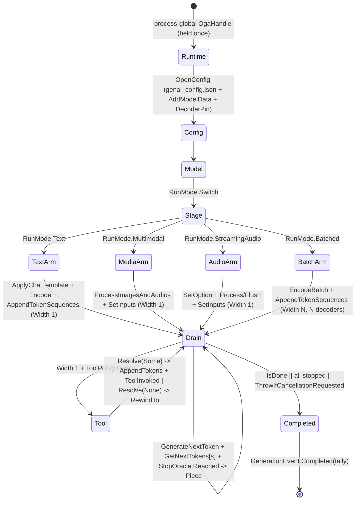

# [COMPUTE_GENERATIVE]

Rasm.Compute model generative run: the ORT-GenAI token-streaming owner that emits ONE polymorphic `GenerationEvent` stream — incremental `Piece`, resolved `ToolInvoked`, terminal `Completed` carrying the run tally — over text, multimodal, streaming-audio, and batched generative shapes from a single staged-input drain, with a per-sequence EOS oracle, the genai provider/decoder-device override, in-memory model admission, the LoRA hot-swap registry, and a real tool-call arm that detects a constrained call, awaits the consumer resolver, and re-feeds the typed result. The page owns the `GenerationPolicy` search-option and prompt-assembly record with its `SearchKey`/`GuidanceKind`/`RunMode` axes, the `DecoderPin`/`ModelData`/`StopOracle`/`MultiModalAssets`/`ToolPolicy` carriers, the `GenerationEvent` `[Union]` + `GenerationTally`/`GenerationOutcome` result family, the `AdapterSet` LoRA registry, and the `GenerativeRun` boundary capsule whose process-global `OgaHandle`, per-call `Config`→`Model`→`Generator` chain, `Stage` fold, `Drain`, `Collect`, and `Receipt` ride `Microsoft.ML.OnnxRuntimeGenAI`. The streaming abstraction `Microsoft.Extensions.AI.Abstractions` arrives settled (the built-in `OnnxRuntimeGenAIChatClient : IChatClient` composes the same handle chain), the `ExecutionProvider` from `Model/providers#EP_AXIS` and `ModelIdentity` from `Model/identity#MODEL_IDENTITY` ride the `Generate` receipt, and the AppHost `CancelScope`/`CorrelationId` and `NodaTime` `Duration` arrive settled. The `Generate` receipt is the catalogued case at `Runtime/receipts#RECEIPT_UNION` (whose `GuidanceKind` field this page owns), and a remote generative run crosses solely through the `Runtime/channels#PROTO_VOCABULARY` `Generate` rpc (`GenerateRequest` → `TokenChunk`).

## [01]-[GENERATIVE_RUN]

- [01]-[GENERATIVE_RUN]: ORT-GenAI owner emitting one `GenerationEvent` stream from one staged drain; per-sequence EOS oracle; genai provider/decoder pins; in-memory model admission; search-option table; guidance; multimodal, streaming-audio, and batched shapes; resolver-backed tool-call arm.

## [02]-[GENERATIVE_RUN]

- Owner: `GenerationPolicy` is the one search-option and prompt-assembly record — it carries the `SearchKey` `[SmartEnum<string>]` recognized-key axis, the `SearchRows` value table, the `GuidanceKind` constraint, the `RunMode` generative-shape selector, the prompt-assembly columns, the `ToolPolicy` tool registry, the `DecoderPin` genai provider/device override, the `ModelData` in-memory bytes, and the `MultiModalAssets` media inputs. `GenerationEvent` is the one streamed unit (`Piece` | `ToolInvoked` | `Completed`); `GenerationOutcome` is the one collected result (per-sequence pieces + `GenerationTally`). `AdapterSet` is the LoRA hot-swap registry over `Adapters : SafeHandle`; `GenerativeRun` is the boundary capsule owning the process-global `OgaHandle`, the per-call handle chain, the `Stage` fold, the one `Drain`, `Collect`, and `Receipt`.
- Cases: `GuidanceKind` rows none · json-schema · regex · lark-grammar (the three LLGuidance constrained-decoding types plus the unconstrained row; no native `choice` type exists — an enumerated choice rides a `json-schema` enum or a `regex` alternation); `SearchKey` rows num_beams · length_penalty · repetition_penalty · top_k · top_p · temperature · do_sample · max_length · min_length · early_stopping; `RunMode` rows text · multimodal · streaming-audio · batched; `GenerationEvent` cases Piece · ToolInvoked · Completed.
- Entry: `public static async IAsyncEnumerable<GenerationEvent> Stream(string modelDir, GenerationPolicy policy, string prompt, Option<AdapterSet> adapters, [EnumeratorCancellation] CancellationToken token)` yields incremental `Piece(sequence, index, text)`, surfaces a resolved `ToolInvoked(sequence, tool)`, and closes with `Completed(tally)`; `Stream` carries no `ModelIdentity`/`ExecutionProvider` (the provider rides the model's `genai_config.json` or the `DecoderPin`, and identity/EP ride the `Receipt`), so a `Stream` that re-derives a provider string from an `ExecutionProvider.Key` is the deleted form. `Collect` runs the drain to `Fin<GenerationOutcome>` and classifies cancellation/native faults; `Receipt` projects the outcome's real tally onto the `Generate` case.
- Auto: the search-option fold folds `SearchRows` over the `SearchKey` axis through `GeneratorParams.SetSearchOption(string, double)` for every numeric row and `SetSearchOption(string, bool)` for every flag row (no string-valued overload exists), the recognized key strings live as `SearchKey.Key` never as call-site literals, and `Echo` reads any applied row back through `GetSearchNumber(string)`/`GetSearchBool(string)` so a consumer can verify the native-clamped effective config; `Guidance` writes through `GeneratorParams.SetGuidance(string type, string data, bool enableFFTokens)` before `Generator` construction so a constrained run can only emit syntactically valid tokens; the config opens from a directory through `new Config(modelDir)` (which reads the packaged `genai_config.json` provider) OR, when the policy carries in-memory model bytes, through `config.AddModelData(filename, bytes)` + optional `config.Overlay(json)`, with `RemoveModelData(filename)` the retract counterpart on the `Config` surface; the genai provider/device override rides `DecoderPin.Apply` — `config.AppendProvider(provider)` then `config.SetProviderOption` per option then `config.SetDecoderProviderOptionsHardwareDeviceType`/`HardwareDeviceId`/`HardwareVendorId` (with the `Clear*` family the retract path), so a specific genai decoder device is pinned without re-deriving an ORT execution-provider name; the LoRA arm loads each named adapter once through `Adapters.LoadAdapter(path, name)` and activates the policy's adapter through `Generator.SetActiveAdapter(Adapters, string)` so a fine-tune swap is a name on the policy, never a second model load; the prompt assembles through `Tokenizer.ApplyChatTemplate(template, messages, tools, add_generation_prompt)` then `Encode`, so system prompt, history, retrieved context, and tool schemas serialize through the native template primitive, never a hand-rolled concat; the `StopOracle` reads `Tokenizer.GetEosTokenIds()` (plus `GetBosTokenId()`/`GetPadTokenId()`) once at stream open for EVERY mode (the EOS ids are model-level, read through a `Tokenizer` even when a `MultiModalProcessor` owns decode); the one `Drain` advances `Generator.GenerateNextToken()`, reads the per-sequence newest token through `Generator.GetNextTokens()` (length = batch width), decodes token `s` through its own per-sequence `TokenizerStream`, and honors `StopOracle.Reached(token)` per sequence beside `IsDone()`; the tool-call arm (text width only) accumulates the constrained decoded span, parses a complete `{"name", "arguments"}` call through `ToolPolicy.Detect`, awaits `ToolPolicy.Resolve` (the consumer contract), re-feeds the encoded result through `Generator.AppendTokens(ReadOnlySpan<int>)` on a resolved call or drops the partial turn through `Generator.RewindTo(ulong)` on a rejected one, and threads the real tool-call count into the terminal tally.
- Receipt: the `Generate` `ComputeReceipt` case carries model checksum (`ModelIdentity.Key`), EP (whose `Precision.Key` rides the `ExecutionProvider` key so a quantized run is receipt-distinct), model type from `Model.GetModelType()` captured into the tally, the generated-token count, tokens-per-second derived from `tally.Tokens / elapsed.TotalSeconds`, the `GuidanceKind` dimension (the smart-enum instance the case field types, never its key string), the constrained-token count, and the tool-call count — all read from `GenerationOutcome.Tally`, never caller-supplied, so a receipt hardcoding `0, 0` for the constrained/tool slots is structurally impossible; the run rides `Substrate.GenAi` (the dedicated genai substrate row, never the `Onnx` inference row), `WorkLane.Background`, and `AllocationClass.NativeOrt`; the `RunMode` and active-adapter dimensions ride the `rasm.compute.generate.tokens` instrument tags (`run.mode`, `lora.adapter`) rather than minting receipt fields, so a `RunMode`/adapter receipt column is a `receipts-and-benchmarks` owner change; the run advances the `Runtime/progress#PROGRESS_CELL` cell to the `Streaming` `ProgressPhase` as each token emits — the running token count rides the `ProgressMark.Segments` slot the progress cell commits — while the streamed-token total is the generated-token count the one terminal `Generate` receipt already carries, so a per-chunk `StreamSegment` receipt is the rejected form (that receipt addresses a content-keyed artifact stream — the windowed-inference `Chunked` run, the residency payload, the field/tile codec — which a token stream never produces).
- Packages: Microsoft.ML.OnnxRuntimeGenAI, Microsoft.Extensions.AI.Abstractions, Microsoft.ML.OnnxRuntime, NodaTime, Thinktecture.Runtime.Extensions, LanguageExt.Core, Rasm.AppHost (project), BCL inbox (System.Text.Json, System.Collections.Frozen)
- Growth: a new search option is one `SearchKey` row plus one `SearchRows` entry folded into the `SetSearchOption` rail — never a new fence statement; a new output constraint is one `GuidanceKind` row; a new generative shape is one `RunMode` row whose `Stage` arm rides the one `Drain` (the streaming-audio row adds the `StreamingProcessor.Process`/`Flush` chunked input arm with its `MultiModalAssets.ProcessorOptions` VAD/chunk column, the batched row adds the `Tokenizer.EncodeBatch`/`NumSequences` fan-out feeding per-sequence `TokenizerStream` decoders, both composing the same generator and the same drain); a new fine-tune is one named adapter on `AdapterSet`; a new stream observation is one `GenerationEvent` case folded into the total `Switch` (the `Generate` rpc maps `Piece`→`TokenChunk{piece, token_index}` and `Completed`→`TokenChunk{done}`, while `ToolInvoked` stays host-local); a new tool is one name + one `ToolPolicy.Resolve` arm on the policy; an in-memory model is one `ModelData` column folded into `Config.AddModelData`; the built-in `OnnxRuntimeGenAIChatClient : IChatClient` composes the same handle chain when the M.E.AI streaming abstraction is the consumer; zero new surface.
- Boundary: token-streaming is a run mode on this owned model lane composing the session and provider spine and is HOST-LOCAL — the cluster carries no TS_PROJECTION; a remote generative run crosses solely through the EXISTING `Runtime/channels#PROTO_VOCABULARY` `Generate` rpc (`GenerateRequest` → `TokenChunk` server-stream, single-sequence) projected once as the `ComputeServiceShape.generate` `MethodShape` at `remote-lane`, never re-projected here, and the `GenerationEvent` stream is the interior type that never sits between wire and rail; a `GenerativeService`, `ChatClient`, `Conversation`, or `PromptService` is the rejected form, and the `Tokenizer`/`TokenizerStream`/`MultiModalProcessor` are session assets, never a tokenizer service family; the `OgaHandle` is process-global and is held ONCE on `GenerativeRun.Runtime` (its `Dispose` calls `OgaShutdown` tearing down the whole native runtime, so a per-`Stream` `new OgaHandle()` would shut the runtime down under a concurrent generation and is the named defect — process teardown disposes it through the AppHost drain or the finalizer), while every per-call genai handle (`Config`, `Model`, `GeneratorParams`, `Generator`, and each `StagedRun` member) is `IDisposable` and disposed LIFO; `Adapters : SafeHandle` is created per `Model` and released through `ReleaseHandle`→`OgaDestroyAdapters` at the GC boundary, so `AdapterSet` holds it for the model's resident lifetime and never re-creates per generation; the recognized `SetSearchOption` key strings are not validated at the managed boundary and an unrecognized key faults `OnnxRuntimeGenAIException` from native — the `SearchKey` axis is the managed registry the binary does not carry, so a literal key string at a call site is the named defect; `GetNextTokens()` returns a per-sequence newest-token span (length = batch width) over native memory owned by the live `Generator` and is the drain's incremental decode primitive, while `GetSequence(ulong)` is the full-sequence view (the M.E.AI client's own loop decodes `GetSequence(0)`'s last token) — both copy out before the next iteration and never retain past the loop; the per-sequence EOS oracle is the `StopOracle` built once from `Tokenizer.GetEosTokenIds()` and honored beside `IsDone()` so a model with multiple EOS ids or a batch whose sequences finish at different steps stops each sequence at its own first matched id — a loop honoring only `IsDone()` is the named defect because it over-runs early-finishing sequences; cancellation is honored through `token.ThrowIfCancellationRequested()` inside the drain and classified by `Collect` through the `CancelScope` provenance into `ComputeFault.Cancelled`/`DeadlineExpired` over the `Fin` rail, while `OnnxRuntimeGenAIException` lifts to `ComputeFault.ModelRejected` — a raw `OperationCanceledException` escaping the rail unclassified is the rejected form, so `Collect` catches `OperationCanceledException` beside `OnnxRuntimeGenAIException`; the genai provider rides the model's packaged `genai_config.json` by default and the `DecoderPin` override on `Config.AppendProvider`/`SetProviderOption` plus the decoder hardware pins, never per generation, and the genai provider name set (CPU default, CUDA/DML/QNN on a carrying RID) is distinct from the ORT `ExecutionProvider` inference EP names (CoreML is not a genai provider, so on `osx-arm64` a genai run is CPU and the `ExecutionProvider ep` is the `Receipt` evidence, not a managed `AppendProvider(ep.Key)` argument) — coupling the genai provider string to the ORT EP key is the named defect; the GenAI native runtime resolving (the process-global `OgaHandle` dylib loading) is what a composition root folds into the `genai` substrate-capability key on `Runtime/admission#SUBSTRATE_AXIS` `SelectionContext.Providers` — present iff the GenAI dylib loads — so the `Substrate.GenAi` `!Providers.Contains(Key)` gate the generate eligible chain reads is fed the one `genai` substrate key, never a genai provider name (CPU/CUDA/DML/QNN) pushed into `Providers`; int8/int4 model quantization is a packaged genai-format model property (the `genai_config.json` carries the quantized weight layout) never a managed quantization knob, so the EP-side quantization knobs live on `Model/providers#EP_AXIS` and a second quantization owner here is the rejected form; the tool-call arm is the host-local two-way capability — `ToolPolicy.Detect` parses a complete call only over a guidance-constrained span (so a managed JSON-schema validator beside `SetGuidance` is the rejected form), `ToolPolicy.Resolve` is the consumer contract that executes the named tool and returns the formatted result text (`None` rejects, rewinding the partial turn), and `Generator.AppendTokens`/`RewindTo` are global over the generator so tool-calling is the text-shape capability gated on the single sequence plus the `Tokenizer` result-encoder seam (`staged.Encoder`) — the multimodal, streaming-audio, and batched shapes carry no tool arm (a `Width > 1` batch because `RewindTo`/`AppendTokens` cannot target one sequence of a batch, the media shapes because decode runs through the `MultiModalProcessor` not the text encoder); grammar-constrained structured output is enforced at generation through `SetGuidance` and the constrained-token count is the per-token increment while `Guidance != None`; the `RunMode.Multimodal` arm stages `Images.Load(paths)`/`Audios.Load(paths)` through `MultiModalProcessor.ProcessImagesAndAudios(prompt, images, audios)` into a `NamedTensors` batch fed to `Generator.SetInputs(NamedTensors)` and decodes through the processor's own `CreateStream()`/`Decode(ReadOnlySpan<int>)`, never the text-mode `Tokenizer` decode seam, and holds both the `Tokenizer` (template + EOS) and the `MultiModalProcessor` (media + decode) as disposed `StagedRun.Owned` members; the `RunMode.StreamingAudio` arm drives `StreamingProcessor.Process(float[])` per chunk (null until a VAD boundary, then `Flush()`), threads VAD/chunk policy through `MultiModalAssets.ProcessorOptions` folded over `StreamingProcessor.SetOption(key, value)`/`GetOption(key)` (never a hard-coded `"vad"` literal), and holds BOTH the `StreamingProcessor` (input chunking — it has no `CreateStream`) and a `MultiModalProcessor` (output decode stream) as disposed members; the `RunMode.Batched` arm drives `Tokenizer.EncodeBatch(string[])` → `AppendTokenSequences`, fans out over `Sequences.NumSequences` into one `TokenizerStream` per sequence, and the drain emits a `Piece` tagged by sequence index — `Tokenizer.DecodeBatch` is the encoded-batch echo decoder, never the streamed-output decoder, so a drain that reads only `GetSequence(0)` while claiming a batch fan-out is the named defect; a second multimodal owner beside the `Stage` fold or a hand-rolled image-preprocessing kernel is the rejected form, and the only remaining `[GENAI_MULTIMODAL]` residual is a live vision-language genai-format asset for runtime validation.

```csharp signature
[SmartEnum<string>]
[KeyMemberEqualityComparer<ComparerAccessors.StringOrdinal, string>]
[KeyMemberComparer<ComparerAccessors.StringOrdinal, string>]
public sealed partial class GuidanceKind {
    public static readonly GuidanceKind None = new("none", type: "");
    public static readonly GuidanceKind JsonSchema = new("json-schema", type: "json_schema");
    public static readonly GuidanceKind Regex = new("regex", type: "regex");
    public static readonly GuidanceKind LarkGrammar = new("lark-grammar", type: "lark_grammar");

    public string Type { get; }
}

[SmartEnum<string>]
[KeyMemberEqualityComparer<ComparerAccessors.StringOrdinal, string>]
[KeyMemberComparer<ComparerAccessors.StringOrdinal, string>]
public sealed partial class SearchKey {
    public static readonly SearchKey NumBeams = new("num_beams", flag: false);
    public static readonly SearchKey LengthPenalty = new("length_penalty", flag: false);
    public static readonly SearchKey RepetitionPenalty = new("repetition_penalty", flag: false);
    public static readonly SearchKey TopK = new("top_k", flag: false);
    public static readonly SearchKey TopP = new("top_p", flag: false);
    public static readonly SearchKey Temperature = new("temperature", flag: false);
    public static readonly SearchKey DoSample = new("do_sample", flag: true);
    public static readonly SearchKey MaxLength = new("max_length", flag: false);
    public static readonly SearchKey MinLength = new("min_length", flag: false);
    public static readonly SearchKey EarlyStopping = new("early_stopping", flag: true);

    public bool Flag { get; }
}

[SmartEnum<string>]
[KeyMemberEqualityComparer<ComparerAccessors.StringOrdinal, string>]
[KeyMemberComparer<ComparerAccessors.StringOrdinal, string>]
public sealed partial class RunMode {
    public static readonly RunMode Text = new("text");
    public static readonly RunMode Multimodal = new("multimodal");
    public static readonly RunMode StreamingAudio = new("streaming-audio");
    public static readonly RunMode Batched = new("batched");
}

public sealed record MultiModalAssets(
    Seq<string> ImagePaths,
    Seq<string> AudioPaths,
    Seq<float[]> AudioChunks,
    Seq<string> BatchPrompts,
    FrozenDictionary<string, string> ProcessorOptions) {
    public static readonly MultiModalAssets None =
        new(Seq<string>(), Seq<string>(), Seq<float[]>(), Seq<string>(), FrozenDictionary<string, string>.Empty);
}

public sealed record DecoderPin(
    string Provider,
    string HardwareDeviceType,
    uint HardwareDeviceId,
    uint HardwareVendorId,
    FrozenDictionary<string, string> ProviderOptions) {
    public void Apply(Config config) {
        config.AppendProvider(Provider);
        ProviderOptions.Iter(option => config.SetProviderOption(Provider, option.Key, option.Value));
        config.SetDecoderProviderOptionsHardwareDeviceType(Provider, HardwareDeviceType);
        config.SetDecoderProviderOptionsHardwareDeviceId(Provider, HardwareDeviceId);
        config.SetDecoderProviderOptionsHardwareVendorId(Provider, HardwareVendorId);
    }

    public void Clear(Config config) {
        config.ClearDecoderProviderOptionsHardwareDeviceType(Provider);
        config.ClearDecoderProviderOptionsHardwareDeviceId(Provider);
        config.ClearDecoderProviderOptionsHardwareVendorId(Provider);
    }
}

public sealed record ModelData(string Filename, byte[] Bytes, string OverlayJson);

public sealed record ToolRequest(string Name, string Arguments);

public sealed record ToolPolicy(
    string Schemas,
    Set<string> Names,
    Func<ToolRequest, CancellationToken, ValueTask<Option<string>>> Resolve) {
    public static readonly ToolPolicy None =
        new("", Set<string>(), static (_, _) => ValueTask.FromResult<Option<string>>(None));

    public Option<ToolRequest> Detect(string text) {
        var open = text.IndexOf('{');
        return Names.IsEmpty || open < 0
            ? None
            : Try.lift(() => JsonNode.Parse(text[open..])).Run().Match(
                Succ: node => node?["name"]?.GetValue<string>() is string name && Names.Contains(name)
                    ? Some(new ToolRequest(name, node["arguments"]?.ToJsonString() ?? ""))
                    : Option<ToolRequest>.None,
                Fail: static _ => Option<ToolRequest>.None);
    }
}

public readonly record struct StopOracle(Set<int> EosIds, int BosId, int PadId) {
    public static StopOracle Read(Tokenizer tokenizer) =>
        new(toSeq(tokenizer.GetEosTokenIds().ToArray()).ToSet(), tokenizer.GetBosTokenId(), tokenizer.GetPadTokenId());

    public bool Reached(int token) => EosIds.Contains(token);
}

public sealed record GenerationTally(int Tokens, int ConstrainedTokens, int ToolCalls, string ModelType) {
    public static readonly GenerationTally Empty = new(0, 0, 0, "");
}

[Union]
public abstract partial record GenerationEvent {
    private GenerationEvent() { }

    public sealed record Piece(int Sequence, long Index, string Text) : GenerationEvent;

    public sealed record ToolInvoked(int Sequence, string Tool) : GenerationEvent;

    public sealed record Completed(GenerationTally Tally) : GenerationEvent;
}

public sealed record GenerationOutcome(HashMap<int, Seq<string>> Sequences, GenerationTally Tally) {
    public string Text => string.Concat(Sequences.Find(0).IfNone(static () => Seq<string>()));
}

public sealed record GenerationPolicy(
    FrozenDictionary<SearchKey, double> SearchRows,
    RunMode Mode,
    GuidanceKind Guidance,
    string GuidanceData,
    bool FastForwardTokens,
    Option<string> Adapter,
    string SystemPrompt,
    string ChatTemplate,
    Seq<(string Role, string Content)> History,
    Seq<string> RetrievedContext,
    ToolPolicy Tools,
    Option<DecoderPin> Decoder,
    Option<ModelData> InMemory,
    MultiModalAssets Assets) {
    public static readonly GenerationPolicy Canonical = new(
        SearchRows: new Dictionary<SearchKey, double> {
            [SearchKey.MaxLength] = 512.0, [SearchKey.MinLength] = 0.0, [SearchKey.Temperature] = 0.7,
            [SearchKey.TopP] = 0.9, [SearchKey.TopK] = 50.0, [SearchKey.RepetitionPenalty] = 1.0,
            [SearchKey.DoSample] = 1.0, [SearchKey.NumBeams] = 1.0, [SearchKey.LengthPenalty] = 1.0,
            [SearchKey.EarlyStopping] = 0.0,
        }.ToFrozenDictionary(),
        Mode: RunMode.Text, Guidance: GuidanceKind.None, GuidanceData: "", FastForwardTokens: false, Adapter: None,
        SystemPrompt: "", ChatTemplate: "", History: Seq<(string, string)>(), RetrievedContext: Seq<string>(),
        Tools: ToolPolicy.None, Decoder: None, InMemory: None, Assets: MultiModalAssets.None);

    public static GenerationPolicy Beam(int beams, double lengthPenalty = 1.0) =>
        Canonical with {
            SearchRows = new Dictionary<SearchKey, double>(Canonical.SearchRows) {
                [SearchKey.NumBeams] = beams, [SearchKey.DoSample] = 0.0,
                [SearchKey.LengthPenalty] = lengthPenalty, [SearchKey.EarlyStopping] = 1.0,
            }.ToFrozenDictionary(),
        };

    public Config OpenConfig(string modelDir) {
        var config = new Config(modelDir);
        InMemory.Iter(data => {
            config.AddModelData(data.Filename, data.Bytes);
            if (data.OverlayJson.Length > 0) { config.Overlay(data.OverlayJson); }
        });
        Decoder.Iter(pin => pin.Apply(config));
        return config;
    }

    public void Apply(GeneratorParams generatorParams) {
        SearchRows.Iter(row => {
            if (row.Key.Flag) { generatorParams.SetSearchOption(row.Key.Key, row.Value != 0.0); }
            else { generatorParams.SetSearchOption(row.Key.Key, row.Value); }
        });
        if (Guidance != GuidanceKind.None) {
            generatorParams.SetGuidance(Guidance.Type, GuidanceData, FastForwardTokens);
        }
    }

    public FrozenDictionary<SearchKey, double> Echo(GeneratorParams generatorParams) =>
        SearchRows.Keys.ToFrozenDictionary(
            static key => key,
            key => key.Flag ? (generatorParams.GetSearchBool(key.Key) ? 1.0 : 0.0) : generatorParams.GetSearchNumber(key.Key));

    public string Messages(string prompt) =>
        JsonSerializer.Serialize(
            ((SystemPrompt.Length > 0 ? Seq((Role: "system", Content: SystemPrompt)) : Seq<(string Role, string Content)>())
                + History
                + (RetrievedContext.IsEmpty ? Seq<(string Role, string Content)>() : Seq((Role: "system", Content: string.Join('\n', RetrievedContext))))
                + Seq((Role: "user", Content: prompt)))
            .Map(static turn => new { role = turn.Role, content = turn.Content }).ToArray());
}

public sealed class AdapterSet : IDisposable {
    readonly Adapters adapters;
    Set<string> loaded = Set<string>();

    public AdapterSet(Model model) => adapters = new Adapters(model);

    public Fin<AdapterSet> Load(string name, string adapterPath) {
        if (loaded.Contains(name)) { return Fin.Succ(this); }
        if (!File.Exists(adapterPath)) { return Fin.Fail<AdapterSet>(new ComputeFault.ExtensionAssetMissing(adapterPath)); }
        adapters.LoadAdapter(adapterPath, name);
        loaded = loaded.Add(name);
        return Fin.Succ(this);
    }

    public Fin<Unit> Unload(string name) {
        if (!loaded.Contains(name)) { return Fin.Succ(unit); }
        adapters.UnloadAdapter(name);
        loaded = loaded.Remove(name);
        return Fin.Succ(unit);
    }

    public void Activate(Generator generator, string name) => generator.SetActiveAdapter(adapters, name);

    public void Dispose() => adapters.Dispose();
}

public static class GenerativeRun {
    static readonly OgaHandle Runtime = new();

    public static async IAsyncEnumerable<GenerationEvent> Stream(
        string modelDir, GenerationPolicy policy, string prompt, Option<AdapterSet> adapters, [EnumeratorCancellation] CancellationToken token) {
        _ = Runtime;
        using var config = policy.OpenConfig(modelDir);
        using var session = new Model(config);
        using var generatorParams = new GeneratorParams(session);
        policy.Apply(generatorParams);
        using var generator = new Generator(session, generatorParams);
        adapters.Iter(set => policy.Adapter.Iter(name => set.Activate(generator, name)));

        using var staged = Stage(session, generator, policy, prompt);
        var next = new int[staged.Width];
        var indices = new long[staged.Width];
        var stopped = new bool[staged.Width];
        var floor = generator.TokenCount();
        var pending = "";
        var tokens = 0;
        var constrained = 0;
        var toolCalls = 0;
        while (!generator.IsDone()) {
            token.ThrowIfCancellationRequested();
            generator.GenerateNextToken();
            generator.GetNextTokens().CopyTo(next);
            for (var s = 0; s < staged.Width; s++) {
                if (stopped[s]) { continue; }
                var emitted = next[s];
                if (staged.Stop.Reached(emitted)) { stopped[s] = true; continue; }
                var piece = staged.Decoders[s].Decode(emitted);
                tokens++;
                if (policy.Guidance != GuidanceKind.None) { constrained++; }
                if (staged.Width == 1 && !policy.Tools.Names.IsEmpty && staged.Encoder.Case is Tokenizer encoder) {
                    pending += piece;
                    if (policy.Tools.Detect(pending).Case is ToolRequest call) {
                        if ((await policy.Tools.Resolve(call, token)).Case is string resultText) {
                            using (var encoded = encoder.Encode(resultText)) { generator.AppendTokens(encoded[0UL]); }
                            floor = generator.TokenCount();
                            toolCalls++;
                            pending = "";
                            yield return new GenerationEvent.ToolInvoked(0, call.Name);
                        } else {
                            generator.RewindTo(floor);
                            pending = "";
                        }
                        continue;
                    }
                }
                yield return new GenerationEvent.Piece(s, indices[s]++, piece);
            }
            if (Array.TrueForAll(stopped, static done => done)) { break; }
        }
        yield return new GenerationEvent.Completed(new GenerationTally(tokens, constrained, toolCalls, session.GetModelType()));
    }

    sealed record StagedRun(Seq<TokenizerStream> Decoders, Option<Tokenizer> Encoder, StopOracle Stop, Seq<IDisposable> Owned, int Width) : IDisposable {
        public void Dispose() => Owned.Rev().Iter(static handle => handle.Dispose());
    }

    static StagedRun Stage(Model session, Generator generator, GenerationPolicy policy, string prompt) =>
        policy.Mode.Switch(
            state: (Session: session, Generator: generator, Policy: policy, Prompt: prompt),
            text: static s => {
                var tokenizer = new Tokenizer(s.Session);
                var stop = StopOracle.Read(tokenizer);
                var stream = tokenizer.CreateStream();
                using var encoded = tokenizer.Encode(tokenizer.ApplyChatTemplate(
                    s.Policy.ChatTemplate, s.Policy.Messages(s.Prompt), s.Policy.Tools.Schemas, add_generation_prompt: true));
                s.Generator.AppendTokenSequences(encoded);
                return new StagedRun(Seq(stream), Some(tokenizer), stop, Seq<IDisposable>(tokenizer, stream), 1);
            },
            multimodal: static s => {
                var tokenizer = new Tokenizer(s.Session);
                var stop = StopOracle.Read(tokenizer);
                var processor = new MultiModalProcessor(s.Session);
                var stream = processor.CreateStream();
                using var images = Images.Load(s.Policy.Assets.ImagePaths.ToArray());
                using var audios = Audios.Load(s.Policy.Assets.AudioPaths.ToArray());
                using var batch = processor.ProcessImagesAndAudios(
                    tokenizer.ApplyChatTemplate(s.Policy.ChatTemplate, s.Policy.Messages(s.Prompt), s.Policy.Tools.Schemas, add_generation_prompt: true), images, audios);
                s.Generator.SetInputs(batch);
                return new StagedRun(Seq(stream), None, stop, Seq<IDisposable>(tokenizer, processor, stream), 1);
            },
            streamingAudio: static s => {
                var tokenizer = new Tokenizer(s.Session);
                var stop = StopOracle.Read(tokenizer);
                var input = new StreamingProcessor(s.Session);
                s.Policy.Assets.ProcessorOptions.Iter(option => input.SetOption(option.Key, option.Value));
                var decode = new MultiModalProcessor(s.Session);
                var stream = decode.CreateStream();
                s.Policy.Assets.AudioChunks.Iter(chunk => { if (input.Process(chunk) is NamedTensors ready) { using (ready) { s.Generator.SetInputs(ready); } } });
                if (input.Flush() is NamedTensors tail) { using (tail) { s.Generator.SetInputs(tail); } }
                return new StagedRun(Seq(stream), None, stop, Seq<IDisposable>(tokenizer, input, decode, stream), 1);
            },
            batched: static s => {
                var tokenizer = new Tokenizer(s.Session);
                var stop = StopOracle.Read(tokenizer);
                using var encoded = tokenizer.EncodeBatch(s.Policy.Assets.BatchPrompts.ToArray());
                s.Generator.AppendTokenSequences(encoded);
                var width = (int)encoded.NumSequences;
                var decoders = toSeq(Enumerable.Range(0, width).Select(_ => tokenizer.CreateStream()).ToArray());
                return new StagedRun(decoders, Some(tokenizer), stop,
                    Seq<IDisposable>(tokenizer) + decoders.Map(static stream => (IDisposable)stream), width);
            });

    public static async Task<Fin<GenerationOutcome>> Collect(
        string modelDir, GenerationPolicy policy, string prompt, Option<AdapterSet> adapters, CancelScope scope, CancellationToken token) {
        var map = HashMap<int, Seq<string>>();
        var tally = GenerationTally.Empty;
        try {
            await foreach (var ev in Stream(modelDir, policy, prompt, adapters, token)) {
                var step = ev.Switch(
                    piece: p => (Map: map.AddOrUpdate(p.Sequence, acc => acc.Add(p.Text), Seq(p.Text)), Tally: tally),
                    toolInvoked: _ => (Map: map, Tally: tally),
                    completed: c => (Map: map, Tally: c.Tally));
                map = step.Map;
                tally = step.Tally;
            }
            return Fin.Succ(new GenerationOutcome(map, tally));
        }
        catch (OperationCanceledException) {
            return Fin.Fail<GenerationOutcome>(scope.Deadline is { IsSome: true, Case: CancellationTokenSource expired } && expired.IsCancellationRequested
                ? new ComputeFault.DeadlineExpired(scope.Provenance)
                : new ComputeFault.Cancelled(scope.Provenance));
        }
        catch (OnnxRuntimeGenAIException error) {
            return Fin.Fail<GenerationOutcome>(new ComputeFault.ModelRejected(error.Message));
        }
    }

    public static ComputeReceipt.Generate Receipt(
        ModelIdentity model, ExecutionProvider ep, GenerationPolicy policy, GenerationOutcome outcome, CorrelationId correlation, Duration elapsed) =>
        new(model.Key, ep, outcome.Tally.ModelType, outcome.Tally.Tokens,
            elapsed.TotalSeconds > 0.0 ? outcome.Tally.Tokens / elapsed.TotalSeconds : 0.0,
            policy.Guidance, outcome.Tally.ConstrainedTokens, outcome.Tally.ToolCalls) {
            Correlation = correlation, Lane = WorkLane.Background, Substrate = Substrate.GenAi, AllocationClass = AllocationClass.NativeOrt, Elapsed = elapsed,
        };
}
```



## [03]-[RESEARCH]

- [GENAI_LIVE_STREAM]: the full multi-token generative loop, the per-sequence `StopOracle`, and the LoRA hot-swap (`Adapters.LoadAdapter`/`UnloadAdapter` + `Generator.SetActiveAdapter`) run against an operator-provisioned genai-format model asset (`genai_config.json` + ONNX weights + tokenizer + optional `.onnx_adapter` files); int8/int4 quantization is a packaged property of the exported graph, never a managed re-quantization pass. The open leaf is the live-asset run, including a real tool-call round-trip through `ToolPolicy.Resolve` + `Generator.AppendTokens`/`RewindTo`; the member shapes (`SearchKey`/`StopOracle`/`DecoderPin`/`GenerationEvent`/`GetNextTokens`/`EncodeBatch`) are authored in the cluster fences.
- [GENAI_MULTIMODAL]: the `RunMode.Multimodal`/`StreamingAudio`/`Batched` arms run against a vision-language genai-format asset (image/audio processor config + ONNX weights) to validate the staged-tensor shapes against the exported graph and to decide whether image/audio token counts earn a `Runtime/receipts#RECEIPT_UNION` measured column beyond the `rasm.compute.generate.tokens` `run.mode` tag. The `MultiModalProcessor`/`StreamingProcessor`/`Images.Load`/`Audios.Load`/`NamedTensors` staging and the dual-processor (input chunking + output decode) disposal discipline are authored in the `Stage` fold.
```
