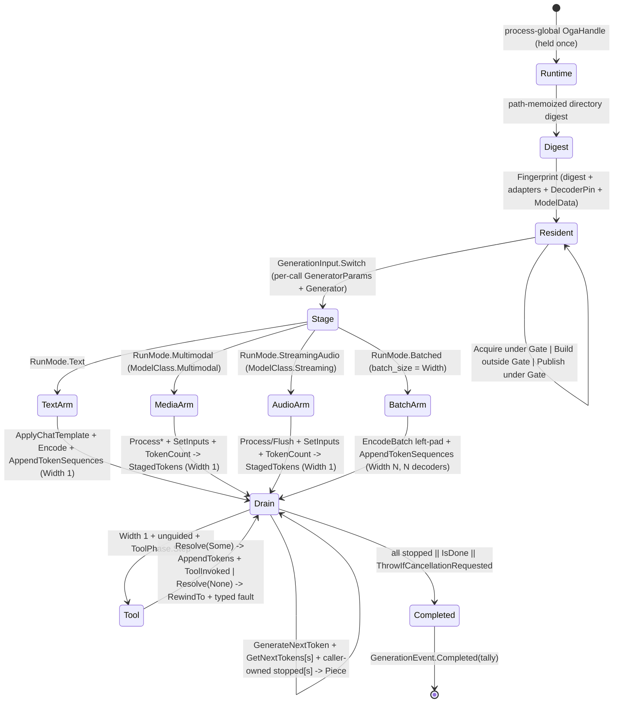

# [COMPUTE_GENERATIVE]

Rasm.Compute model generative run: the ORT-GenAI token-streaming owner emits one polymorphic `GenerationEvent` stream — incremental `Piece`, resolved `ToolInvoked`, terminal `Completed` carrying the run tally — over `GenerationInput.Text`/`Multimodal`/`StreamingAudio`/`Batched` shapes from one staged-input drain, with caller-owned per-sequence stop state, the genai provider/decoder-device override, content-admitted in-memory model and LoRA assets, a `ToolPhase` row machine that detects a free-text call, awaits the consumer resolver, and re-feeds the typed result, and a conversation-scoped `GenerativeSession` that retains the live KV prefix across turns. It owns the `GenerationPolicy` search/prompt policy with its `SearchKey`/`GuidanceKind`/`RuntimeOption` axes, the `GenerationInput` payload family with its derived `RunMode` and staged `Width`, the `ModelClass` native-capability table, the `DecoderPin`/`ModelData`/`StopOracle`/`ToolPolicy` carriers, the `GenerationEvent` `[Union]` + `GenerationTally`/`GenerationOutcome` result family, the `AdapterSet` LoRA registry, and the `GenerativeRun` boundary capsule whose process-global `OgaHandle`, fingerprint-keyed resident `Config`→`Model`→`AdapterSet` lease, per-call `GeneratorParams`→`Generator` chain, `Stage` fold, `Drain`, `Collect`, and `Receipt` ride `Microsoft.ML.OnnxRuntimeGenAI`.

Streaming abstraction `Microsoft.Extensions.AI.Abstractions` arrives settled (the built-in `OnnxRuntimeGenAIChatClient : IChatClient` composes the same handle chain), the `ExecutionProvider` from `Model/providers#EP_AXIS` and `ModelIdentity` from `Model/identity#MODEL_IDENTITY` ride the `Generate` receipt, and the AppHost `CancelScope`, the kernel `CorrelationId` (`Rasm/Domain/telemetry#CAUSAL_FRAME`), and `NodaTime` `Duration`/`Instant` arrive settled. `Generate` is the catalogued receipt case at `Runtime/receipts#RECEIPT_UNION` (whose `GuidanceKind` and `StagedTokens` fields this page owns), the cold-build-outside-lock-publish-under-lock resident discipline arrives settled from `Model/sessions#SESSION_CAPSULE`, and a remote generative run crosses solely through the `Runtime/wire#PROTO_VOCABULARY` `Generate` rpc (`GenerateRequest` → `TokenChunk`).

## [01]-[INDEX]

- [02]-[GENERATIVE_RUN]: ORT-GenAI owner emitting one `GenerationEvent` stream from one staged drain; fingerprint-keyed resident `Config`/`Model`/`AdapterSet` lease with a memoized directory digest; caller-owned per-sequence stop state; genai provider/decoder pins; in-memory model admission; search-option table with the mandatory derived `batch_size`; guidance; the `ModelClass` capability gate over the multimodal, streaming-audio, and batched shapes.
- [03]-[TOKEN_DRAIN]: one `Drain` loop over `GenerateNextToken`/`GetNextTokens`; the `ToolPhase` row machine and its `ToolStep` decisions; `Collect` fault classification and the `Receipt` projection.
- [04]-[GENERATIVE_SESSION]: conversation-scoped KV retention — one live `Generator` per conversation, turns appended through `AppendTokens`, the conversation-wide budget, and the idle-sweep drain.

## [02]-[GENERATIVE_RUN]

- Owner: `GenerationPolicy` is the one search-option and prompt-assembly policy — the behavior-bearing `SearchKey` recognized-key/value-domain axis, `SearchRows`, `GuidanceKind`, admitted `RuntimeOption` rows, text stop rows, prompt-assembly columns, `ToolPolicy`, `DecoderPin`, admitted `ModelData`, the `MediaTokenReserve` staging column, and the admitted `AdapterAsset` roster. `GenerationInput` is the case-correct per-run payload family deriving both `RunMode` and the staged `Width`; `ModelClass` is the native-capability table keyed on `Model.GetModelType()`; `GenerationEvent` is the one streamed unit (`Piece` | `ToolInvoked` | `Completed`); `GenerationOutcome` is the one collected result (per-sequence pieces + `GenerationTally`); `AdapterSet` is the LoRA hot-swap registry over `Adapters : SafeHandle`, created against its resident `Model`; `GenerativeRun` owns the process-global `OgaHandle`, the path-keyed directory-digest memo, the `UInt128` content-fingerprint resident map, the per-call `GeneratorParams`→`Generator` chain, the `Stage` fold, one `Lease`/`Unload`/`Drain`, and the `Stream`/`Collect`/`Receipt`/`OpenSession` entries the later clusters spell.
- Cases: `GuidanceKind` rows none · json-schema · regex · lark-grammar (the three LLGuidance constrained-decoding types and the unconstrained row; no native `choice` type exists, so an enumerated choice rides a `json-schema` enum or a `regex` alternation); `SearchKey` rows batch_size · num_beams · length_penalty · repetition_penalty · top_k · top_p · temperature · do_sample · max_length · min_length · early_stopping; `GenerationInput` cases text · multimodal · streaming-audio · batched; `ModelClass` rows generic · vision-language · speech-stream, each carrying multimodal, streaming-audio, and rewind capability; `GenerationEvent` cases Piece · ToolInvoked · Completed.
- Entry: `Stream(modelDir, policy, input, clock, token)` leases the fingerprint-keyed resident, stages the payload case, yields incremental `Piece(sequence, index, text)`, surfaces a resolved `ToolInvoked(sequence, tool)`, and closes with `Completed(tally)`; it carries no `ModelIdentity`/`ExecutionProvider` — the provider rides the model's `genai_config.json` or the `DecoderPin` and identity/EP ride the `Receipt`, so a `Stream` re-deriving a provider string from an `ExecutionProvider.Key` is the deleted form.
- Auto: `Conforms(input)` admits finite `SearchRows` through each delegate-backed `SearchKey.Accepts`, ordered `min_length <= max_length`, nonblank unique stop sequences, case-local assets, content-verified unique adapters, and tools only on unguided single-sequence text runs without competing text stops; `batch_size` is derived, so a caller row declaring it is refused. `Apply` folds the effective rows — declared set, derived `batch_size`, multimodal `max_length` reserve — through the numeric/bool `SetSearchOption` overloads; `Echo` reads native values back over the same effective key set. `DecoderPin.Apply` clears packaged providers before appending its override, so the pin never becomes an accidental fallback. `Generator.SetRuntimeOption` folds every admitted `RuntimeOption` after generator construction. Owned in-memory bytes enter through `AddModelData` and retract through `RemoveModelData` after `Model` construction. `Fingerprint` folds the path-memoized directory digest with every adapter content key, decoder option, and in-memory identity into `ContentHash.Of`. Non-copyable `ResidentLease` instances count active streams under `Gate`; `Unload` evicts only idle zero-lease residents and drops the digest of every path no resident still backs. Prompt assembly rides `ApplyChatTemplate` then `Encode`; `StopOracle` reads model EOS, pad, and turn-boundary ids and withholds the maximal text-stop prefix per sequence so a stop split across token pieces never leaks.
- Law: `IsDone()` answers the WHOLE batch, never one sequence — a sequence that emits EOS at step 1 leaves it false while the batch runs on, and every finished sequence then emits PAD at full batch width for every remaining step. Per-sequence stop therefore rides the caller-owned `stopped[]` array, `GetNextTokens().Length` equals the staged width on every step, and a terminal EOS or PAD is consumed without advancing the tally, so a stop token never counts as generated text.
- Law: `batch_size` is a MANDATORY recognized `SetSearchOption` key — absent, staging faults `input sequences count does not match batch size` — and it is DERIVED from `GenerationInput.Width`, never declared: the batched arm sets the staged width and every other arm sets one. `EncodeBatch` left-pads a ragged batch to its longest member, `TokenCount()` is one batch-wide scalar rather than a per-sequence read, and `RewindTo` on a batch wider than one admits only `0` while any restart faults — so a batched run has NO restart and the tool arm's `Width == 1` gate is what keeps the rewind rail reachable.
- Law: `ModelClass` gates every native processor the shape reaches. `StreamingProcessor` binds the speech-stream row alone, `MultiModalProcessor` binds only a row declaring multimodal, and a model type the table does not carry falls to the generic row — so an unrostered multimodal model REFUSES staging rather than reaching a processor the native layer never registered. Neither media row declares rewind, which is why tools admit only on a rewinding class. Batched multimodal is unreachable by construction — one image tag admits one prompt — and refuses typed rather than staging a batch the graph cannot carry.
- Law: `max_length` is the native TOTAL sequence length and a multimodal stage commits its media tokens at `SetInputs`, BEFORE the first step, so a budget shorter than the staged total faults at staging rather than at the drain. `MediaTokenReserve` is the measured per-media staged-token reserve — resolution-invariant and linear in media count — and `Apply` widens the multimodal and streaming rows by it while every other arm passes the declared budget through.
- Law: genai provider names are case-sensitive native strings the packaged runtime resolves at `Model` construction. `CoreML` builds and generates on this runtime; `XNNPACK` refuses `not supported in this build` on osx-arm64; an unresolvable name faults at construction. `DecoderPin` therefore carries the native name verbatim and never a translated `ExecutionProvider.Key`.
- Receipt: the `Generate` `ComputeReceipt` case carries model checksum, EP (whose `Precision.Key` rides the `ExecutionProvider` key so a quantized run is receipt-distinct), model type from `Model.GetModelType()`, generated-token count, tokens-per-second from `tally.Tokens / elapsed`, the `GuidanceKind` dimension, the constrained-token count, the tool-call count, and the `StagedTokens` media column — all read from `GenerationOutcome.Tally`, never caller-supplied, so a receipt hardcoding `0, 0` for the constrained/tool slots is structurally impossible; the run rides `Substrate.GenAi` (never the `Onnx` inference row), `WorkLane.Background`, and `AllocationClass.NativeOrt`; the `Mode` and `Adapter` receipt columns carry the `RunMode` key and the active LoRA adapter, and the `Runtime/receipts` projection fan tags `rasm.compute.generate.tokens` from them (`run.mode`, `lora.adapter`, `guidance`) so every instrument dimension derives from a receipt field; the run advances the `Runtime/progress#PROGRESS_CELL` cell to the `Streaming` `ProgressPhase` with the running token count on the `ProgressMark.Segments` slot while the terminal `Generate` receipt carries the token total, so a per-chunk `StreamSegment` receipt is the rejected form (that receipt addresses a content-keyed artifact stream — the windowed-inference `Chunked` run — which a token stream never produces).
- Packages: Microsoft.ML.OnnxRuntimeGenAI, Microsoft.Extensions.AI.Abstractions, Microsoft.ML.OnnxRuntime, NodaTime, Thinktecture.Runtime.Extensions, LanguageExt.Core, Rasm (project, `Domain.ContentHash`), Rasm.AppHost (project), BCL inbox (System.Text.Json, System.Collections.Frozen)
- Growth: a new search option is one behavior-complete `SearchKey` row with one `SearchRows` value; a new output constraint is one `GuidanceKind` row; a new generative shape is one payload-bearing `GenerationInput` case whose `Stage` arm rides the one drain; a model type whose native capability differs from the generic floor is one `ModelClass` row; a new fine-tune is one admitted `AdapterAsset` row loaded once on the resident's `AdapterSet` and selected by `Adapter` name; a new stream observation is one `GenerationEvent` case folded into the total `Switch`; a new tool is one name + one `ToolPolicy.Resolve` arm; an in-memory model is one admitted `ModelData` value folded into `Config.AddModelData`; zero new surface.
- Boundary: token-streaming is a run mode on this host-local lane; the cluster carries no `TS_PROJECTION`, and remote generation crosses solely through `Runtime/wire#PROTO_VOCABULARY` `Generate` (`GenerateRequest` → `TokenChunk`). `OgaHandle` is process-global on `GenerativeRun.Runtime`, while every per-call genai handle is disposed LIFO. Cold `Config`/`Model`/`AdapterSet` construction runs OUTSIDE `Gate` and publishes under it, so a race costs one redundant build instead of a serialized fleet and the loser disposes its own build; residents and digests are immutable-map values replaced through `SetItem`, never mutable setters. `Config`/`Model`/`AdapterSet` residents stay alive while `GenerativeResident.Leases > 0`; idempotent `ResidentLease.Dispose` decrements the hold once, so an idle sweep cannot dispose a model under an active `Generator`. Recognized `SetSearchOption` keys and value domains live on `SearchKey`; a literal key or unconstrained numeric row is rejected. `SetRuntimeOption` accepts an unknown key SILENTLY and `terminate_session` ABORTS the process uncatchably mid-drain, so `RuntimeOption.Admit` refuses the banned key and no other construction path exists — the abort is structurally unspellable rather than documented. `Generator.GetOutput`/`GetInput` SIGSEGV on a name the live graph does not carry, so the drain surface spells neither and a logits probe rides a model-class gate on a profiling path. `Generator.GetSequence(index)` performs no native range check — an out-of-range index returns sequence 0 — so any read gates `index < Width` first; the drain reads `GetNextTokens()` alone. `GenerationPolicy.FastForwardTokens` has no spelling: `enableFFTokens` COMMITS tokens `GetNextTokens()` never surfaces (a measured 85-token count over 83 steps, the streamed decode missing schema keys the committed sequence held), so the flag is pinned false at the one `SetGuidance` call. Genai provider selection rides `genai_config.json` or `DecoderPin`, never `ExecutionProvider.Key`. Guidance and tools are mutually exclusive by typed admission: under `SetGuidance` the native `AppendTokens` admits only grammar-satisfying spans and rejects a free-text tool result with a parser error, so a guided run carries no tool roster and an unguided one carries no grammar.

```csharp signature
// --- [TYPES] -----------------------------------------------------------------------------
[SmartEnum<string>]
[KeyMemberEqualityComparer<ComparerAccessors.StringOrdinal, string>]
[KeyMemberComparer<ComparerAccessors.StringOrdinal, string>]
public sealed partial class GuidanceKind {
    public static readonly GuidanceKind None = new("none", type: "");
    public static readonly GuidanceKind JsonSchema = new("json-schema", type: "json_schema");
    public static readonly GuidanceKind Regex = new("regex", type: "regex");
    public static readonly GuidanceKind LarkGrammar = new("lark-grammar", type: "lark_grammar");

    public string Type { get; }
}

[SmartEnum<string>]
[KeyMemberEqualityComparer<ComparerAccessors.StringOrdinal, string>]
[KeyMemberComparer<ComparerAccessors.StringOrdinal, string>]
public sealed partial class SearchKey {
    // MANDATORY and DERIVED: staging faults `input sequences count does not match batch size` when the key is
    // absent, and its value is the staged width, so `Conforms` refuses a caller row and `Apply` stamps it.
    public static readonly SearchKey BatchSize = new("batch_size", flag: false, accepts: static value => value >= 1.0 && value == Math.Truncate(value));
    public static readonly SearchKey NumBeams = new("num_beams", flag: false, accepts: static value => value >= 1.0 && value == Math.Truncate(value));
    public static readonly SearchKey LengthPenalty = new("length_penalty", flag: false, accepts: static value => value > 0.0);
    public static readonly SearchKey RepetitionPenalty = new("repetition_penalty", flag: false, accepts: static value => value > 0.0);
    public static readonly SearchKey TopK = new("top_k", flag: false, accepts: static value => value >= 0.0 && value == Math.Truncate(value));
    public static readonly SearchKey TopP = new("top_p", flag: false, accepts: static value => value is > 0.0 and <= 1.0);
    public static readonly SearchKey Temperature = new("temperature", flag: false, accepts: static value => value > 0.0);
    public static readonly SearchKey DoSample = new("do_sample", flag: true, accepts: static value => value is 0.0 or 1.0);
    public static readonly SearchKey MaxLength = new("max_length", flag: false, accepts: static value => value >= 1.0 && value == Math.Truncate(value));
    public static readonly SearchKey MinLength = new("min_length", flag: false, accepts: static value => value >= 0.0 && value == Math.Truncate(value));
    public static readonly SearchKey EarlyStopping = new("early_stopping", flag: true, accepts: static value => value is 0.0 or 1.0);

    public bool Flag { get; }

    [UseDelegateFromConstructor]
    public partial bool Accepts(double value);
}

[SmartEnum<string>]
[KeyMemberEqualityComparer<ComparerAccessors.StringOrdinal, string>]
[KeyMemberComparer<ComparerAccessors.StringOrdinal, string>]
public sealed partial class RunMode {
    public static readonly RunMode Text = new("text");
    public static readonly RunMode Multimodal = new("multimodal");
    public static readonly RunMode StreamingAudio = new("streaming-audio");
    public static readonly RunMode Batched = new("batched");
}

// Native capability keyed on `Model.GetModelType()`. Rows exist only where capability differs from the plain
// decoder floor, and `Of` falls to that floor for an unrostered type, so an unknown model refuses a processor
// it may not have registered rather than reaching native code that would fault or corrupt the run.
[SmartEnum<string>]
[KeyMemberEqualityComparer<ComparerAccessors.StringOrdinal, string>]
[KeyMemberComparer<ComparerAccessors.StringOrdinal, string>]
public sealed partial class ModelClass {
    public static readonly ModelClass Generic = new("<generic>", multimodal: false, streaming: false, rewinds: true);
    public static readonly ModelClass VisionLanguage = new("phi3v", multimodal: true, streaming: false, rewinds: false);
    public static readonly ModelClass SpeechStream = new("nemotron_speech", multimodal: true, streaming: true, rewinds: false);

    public bool Multimodal { get; }
    public bool Streaming { get; }
    public bool Rewinds { get; }

    public static ModelClass Of(Model session) =>
        TryGet(session.GetModelType(), out ModelClass? row) ? row : Generic;
}

[Union(ConversionFromValue = ConversionOperatorsGeneration.None)]
public abstract partial record GenerationInput {
    private GenerationInput() { }

    public sealed record Text(string Prompt) : GenerationInput;
    public sealed record Multimodal(string Prompt, Seq<string> ImagePaths, Seq<string> AudioPaths) : GenerationInput;
    public sealed record StreamingAudio(string Prompt, Seq<float[]> Chunks, FrozenDictionary<string, string> ProcessorOptions) : GenerationInput;
    public sealed record Batched(Seq<string> Prompts) : GenerationInput;

    public RunMode Mode => Switch(
        text: static _ => RunMode.Text,
        multimodal: static _ => RunMode.Multimodal,
        streamingAudio: static _ => RunMode.StreamingAudio,
        batched: static _ => RunMode.Batched);

    // Staged batch width IS the `batch_size` value and the drain's per-sequence array length; the batched arm
    // reads it from the prompt roster because `EncodeBatch` left-pads to that exact count.
    public int Width => Switch(
        text: static _ => 1,
        multimodal: static _ => 1,
        streamingAudio: static _ => 1,
        batched: static assets => assets.Prompts.Count);

    // Media items whose staged tokens the native layer commits before the first step.
    public int Media => Switch(
        text: static _ => 0,
        multimodal: static assets => assets.ImagePaths.Count + assets.AudioPaths.Count,
        streamingAudio: static assets => assets.Chunks.Count,
        batched: static _ => 0);
}

// --- [MODELS] ----------------------------------------------------------------------------
public sealed record DecoderPin(
    string Provider,
    string HardwareDeviceType,
    uint HardwareDeviceId,
    uint HardwareVendorId,
    FrozenDictionary<string, string> ProviderOptions) {
    // Provider names are case-sensitive native strings resolved at `Model` construction; the pin clears the
    // packaged set first so an unresolvable override faults there rather than silently running the packaged EP.
    public void Apply(Config config) {
        config.ClearProviders();
        config.AppendProvider(Provider);
        ProviderOptions.Iter(option => config.SetProviderOption(Provider, option.Key, option.Value));
        config.SetDecoderProviderOptionsHardwareDeviceType(Provider, HardwareDeviceType);
        config.SetDecoderProviderOptionsHardwareDeviceId(Provider, HardwareDeviceId);
        config.SetDecoderProviderOptionsHardwareVendorId(Provider, HardwareVendorId);
    }
}

// `SetRuntimeOption` validates NOTHING managed-side and accepts an unknown key silently, while the one key that
// does act — `terminate_session` — aborts the PROCESS mid-drain with no catchable exception and no receipt. The
// banned set is therefore an admission gate, not a documented caution: there is no other way to build the row.
public sealed record RuntimeOption {
    static readonly FrozenSet<string> Banned = FrozenSet.Create(StringComparer.Ordinal, "terminate_session");

    private RuntimeOption(string key, string value) => (Key, Value) = (key, value);

    public string Key { get; }
    public string Value { get; }

    public static Fin<RuntimeOption> Admit(string key, string value) =>
        string.IsNullOrWhiteSpace(key) || string.IsNullOrWhiteSpace(value) || Banned.Contains(key)
            ? Fin.Fail<RuntimeOption>(new ComputeFault.ModelRejected($"<runtime-option:{key}>"))
            : Fin.Succ(new RuntimeOption(key, value));
}

public sealed class ModelData {
    private ModelData(string filename, byte[] bytes, string overlayJson, UInt128 contentKey) =>
        (Filename, Bytes, OverlayJson, ContentKey) = (filename, bytes, overlayJson, contentKey);

    public string Filename { get; }
    public ReadOnlyMemory<byte> Bytes { get; }
    public string OverlayJson { get; }
    public UInt128 ContentKey { get; }

    public static Fin<ModelData> Admit(string filename, ReadOnlyMemory<byte> bytes, string overlayJson) {
        if (string.IsNullOrWhiteSpace(filename) || bytes.IsEmpty) { return Fin.Fail<ModelData>(new ComputeFault.ModelRejected("<model-data>")); }
        byte[] owned = bytes.ToArray();
        return overlayJson.Length is 0
            ? Fin.Succ(new ModelData(filename, owned, overlayJson, ContentHash.Of(owned)))
            : Try.lift(() => JsonNode.Parse(overlayJson) is JsonObject).Run()
                .MapFail(error => new ComputeFault.ModelRejected($"<model-overlay:{error.Message}>"))
                .Bind(valid => valid
                    ? Fin.Succ(new ModelData(filename, owned, overlayJson, ContentHash.Of(owned)))
                    : Fin.Fail<ModelData>(new ComputeFault.ModelRejected("<model-overlay:not-object>")));
    }

    public void Add(Config config) => config.AddModelData(Filename, Bytes.ToArray());
    public void Retract(Config config) => config.RemoveModelData(Filename);
}

public sealed class AdapterAsset {
    private AdapterAsset(string name, string path, UInt128 contentKey) => (Name, Path, ContentKey) = (name, path, contentKey);

    public string Name { get; }
    public string Path { get; }
    public UInt128 ContentKey { get; }

    public static Fin<AdapterAsset> Admit(string name, string path) =>
        string.IsNullOrWhiteSpace(name) || !File.Exists(path)
            ? Fin.Fail<AdapterAsset>(new ComputeFault.ExtensionAssetMissing(path))
            : Try.lift(() => new AdapterAsset(name, path, ContentHash.Of(File.ReadAllBytes(path))))
                .Run()
                .MapFail(error => new ComputeFault.ExtensionAssetMissing($"{path}:{error.Message}"));

    public Fin<Unit> Verify() =>
        Try.lift(() => ContentHash.Of(File.ReadAllBytes(Path))).Run()
            .MapFail(error => new ComputeFault.ExtensionAssetMissing($"{Path}:{error.Message}"))
            .Bind(current => current == ContentKey
                ? Fin.Succ(unit)
                : Fin.Fail<Unit>(new ComputeFault.ExtensionAssetMissing($"{Path}:content-changed")));
}

public sealed record ToolRequest(string Name, string Arguments);

public sealed record ToolPolicy {
    private ToolPolicy(string schemas, Set<string> names, Func<ToolRequest, CancellationToken, ValueTask<Option<string>>> resolve) =>
        (Schemas, Names, Resolve) = (schemas, names, resolve);

    public string Schemas { get; }
    public Set<string> Names { get; }
    public Func<ToolRequest, CancellationToken, ValueTask<Option<string>>> Resolve { get; }

    public static readonly ToolPolicy None =
        new("", Set<string>(), static (_, _) => ValueTask.FromResult<Option<string>>(None));

    // `ApplyChatTemplate` takes the schema blob as raw JSON text and the native template pass rejects malformed
    // input; a template carrying no tools block ignores the argument entirely, so a silently-inert roster is the
    // failure this admission catches — the JSON proves once here rather than at every prompt assembly.
    public static Fin<ToolPolicy> Admit(string schemas, Set<string> names, Func<ToolRequest, CancellationToken, ValueTask<Option<string>>> resolve) =>
        names.IsEmpty || resolve is null || names.Exists(string.IsNullOrWhiteSpace)
            ? Fin.Fail<ToolPolicy>(new ComputeFault.ModelRejected("<tool-policy-roster>"))
            : Try.lift(() => JsonNode.Parse(schemas) is not null).Run()
                .MapFail(error => new ComputeFault.ModelRejected($"<tool-schemas:{error.Message}>"))
                .Bind(valid => valid
                    ? Fin.Succ(new ToolPolicy(schemas, names, resolve))
                    : Fin.Fail<ToolPolicy>(new ComputeFault.ModelRejected("<tool-schemas:empty>")));

    // Parseable JSON naming no admitted tool is PROSE, not a rejected call — a model narrating a JSON example is
    // ordinary output, and faulting there turns a well-formed answer into a run failure. Absence of a detection
    // is the only signal; the reject rail belongs to a resolver that declines an admitted name.
    public Option<ToolRequest> Detect(string text) {
        int open = text.IndexOf('{', StringComparison.Ordinal);
        return Names.IsEmpty || open < 0
            ? Option<ToolRequest>.None
            : Try.lift(() => JsonNode.Parse(text[open..])).Run().Match(
                Succ: node => node?["name"]?.GetValue<string>() is string name && Names.Contains(name)
                    ? Some(new ToolRequest(name, node["arguments"]?.ToJsonString() ?? ""))
                    : Option<ToolRequest>.None,
                Fail: static _ => Option<ToolRequest>.None);
    }
}

public readonly record struct StopOracle(Set<int> EosIds, Set<int> TurnIds, FrozenSet<string> Text, int MaxTextLength, int BosId, int PadId) {
    public static StopOracle Read(Tokenizer tokenizer, Seq<string> text) =>
        new(toSet(tokenizer.GetEosTokenIds().ToArray()), Probe(tokenizer), text.ToFrozenSet(StringComparer.Ordinal),
            text.Fold(0, static (length, value) => Math.Max(length, value.Length)), tokenizer.GetBosTokenId(), tokenizer.GetPadTokenId());

    // Turn-boundary ids THROW when the model defines none, so each is a probe rather than a read: a chat model
    // marking turn ends carries its own token and one that does not ends a turn on the EOS set alone.
    static Set<int> Probe(Tokenizer tokenizer) =>
        Seq<Func<int>>(tokenizer.GetEotTokenId, tokenizer.GetEorTokenId)
            .Fold(Set<int>(), static (ids, read) => Try.lift(read).Run().Match(Succ: ids.Add, Fail: static _ => ids));

    // Finished sequences keep emitting PAD at full batch width, so PAD is a stop exactly as EOS is.
    public bool Reached(int token) => EosIds.Contains(token) || token == PadId;
    public bool Ends(int token) => Reached(token) || TurnIds.Contains(token);
    public bool Skips(int token) => token == BosId;

    public (string Emit, string Tail, bool Reached) Feed(string tail, string piece) {
        string combined = tail + piece;
        int stop = Text.Fold(-1, (earliest, candidate) => {
            int index = combined.IndexOf(candidate, StringComparison.Ordinal);
            return index >= 0 && (earliest < 0 || index < earliest) ? index : earliest;
        });
        if (stop >= 0) { return (combined[..stop], "", true); }
        int retained = Math.Min(Math.Max(0, MaxTextLength - 1), combined.Length);
        return (combined[..(combined.Length - retained)], combined[(combined.Length - retained)..], false);
    }
}

// `StagedTokens` is the multimodal staging total read once off `Generator.TokenCount()` after `SetInputs`; it is
// `None` on every text-only run, so the receipt column separates prompt cost from media cost per run.
public sealed record GenerationTally(int Tokens, int ConstrainedTokens, int ToolCalls, string ModelType, Option<int> StagedTokens) {
    public static readonly GenerationTally Empty = new(0, 0, 0, "", None);
}

[Union]
public abstract partial record GenerationEvent {
    private GenerationEvent() { }

    public sealed record Piece(int Sequence, long Index, string Text) : GenerationEvent;

    public sealed record ToolInvoked(int Sequence, string Tool) : GenerationEvent;

    public sealed record Completed(GenerationTally Tally) : GenerationEvent;
}

public sealed record GenerationOutcome(HashMap<int, Seq<string>> Sequences, GenerationTally Tally) {
    public string Text => string.Concat(Sequences.Find(0).IfNone(static () => Seq<string>()));
}

public sealed record GenerationPolicy(
    FrozenDictionary<SearchKey, double> SearchRows,
    Seq<RuntimeOption> RuntimeOptions,
    GuidanceKind Guidance,
    string GuidanceData,
    Seq<string> StopSequences,
    int MediaTokenReserve,
    Option<string> Adapter,
    Seq<AdapterAsset> AdapterPaths,
    string SystemPrompt,
    string ChatTemplate,
    Seq<(string Role, string Content)> History,
    Seq<string> RetrievedContext,
    ToolPolicy Tools,
    Option<DecoderPin> Decoder,
    Option<ModelData> InMemory) {
    public static readonly GenerationPolicy Canonical = new(
        SearchRows: new Dictionary<SearchKey, double> {
            [SearchKey.MaxLength] = 512.0, [SearchKey.MinLength] = 0.0, [SearchKey.Temperature] = 0.7,
            [SearchKey.TopP] = 0.9, [SearchKey.TopK] = 50.0, [SearchKey.RepetitionPenalty] = 1.0,
            [SearchKey.DoSample] = 1.0, [SearchKey.NumBeams] = 1.0, [SearchKey.LengthPenalty] = 1.0,
            [SearchKey.EarlyStopping] = 0.0,
        }.ToFrozenDictionary(),
        RuntimeOptions: Seq<RuntimeOption>(),
        Guidance: GuidanceKind.None, GuidanceData: "", StopSequences: Seq<string>(),
        // Measured staged tokens per media item — resolution-invariant and linear in count — rounded up so the
        // native total admits the stage; the value is a budget ceiling, so over-reserving only loosens the cap.
        MediaTokenReserve: 2600,
        Adapter: None,
        AdapterPaths: Seq<AdapterAsset>(),
        SystemPrompt: "", ChatTemplate: "", History: Seq<(string, string)>(), RetrievedContext: Seq<string>(),
        Tools: ToolPolicy.None, Decoder: None, InMemory: None);

    public Fin<Unit> Conforms(GenerationInput input) {
        bool rowsConform = SearchRows.ForAll(static row => double.IsFinite(row.Value) && row.Key.Accepts(row.Value))
            && !SearchRows.ContainsKey(SearchKey.BatchSize);
        double minimum = SearchRows.Find(SearchKey.MinLength).IfNone(0.0);
        double maximum = SearchRows.Find(SearchKey.MaxLength).IfNone(double.PositiveInfinity);
        bool adaptersConform = AdapterPaths.Map(static row => row.Name).Distinct().Count == AdapterPaths.Count
            && Adapter.ForAll(name => AdapterPaths.Exists(row => row.Name == name));
        bool guidanceConforms = Guidance == GuidanceKind.None ? GuidanceData.Length is 0 : GuidanceData.Length > 0;
        bool stopsConform = StopSequences.ForAll(static value => !string.IsNullOrEmpty(value)) && StopSequences.Distinct().Count == StopSequences.Count;
        // Guidance and tools are MUTUALLY EXCLUSIVE: a guided generator's `AppendTokens` admits only spans the
        // grammar derives, so re-feeding a free-text tool result faults the parser. Detection reads free text.
        bool toolsConform = Tools.Names.IsEmpty
            || (input is GenerationInput.Text && Guidance == GuidanceKind.None && Tools.Schemas.Length > 0 && StopSequences.IsEmpty);
        bool decoderConforms = Decoder.ForAll(static pin => !string.IsNullOrWhiteSpace(pin.Provider)
            && !string.IsNullOrWhiteSpace(pin.HardwareDeviceType)
            && pin.ProviderOptions.ForAll(static row => row.Key.Length > 0 && row.Value.Length > 0));
        bool promptsConform = History.ForAll(static turn => (turn.Role is "system" or "user" or "assistant" or "tool") && turn.Content.Length > 0)
            && RetrievedContext.ForAll(static context => context.Length > 0);
        bool shapeConforms = MediaTokenReserve > 0 && input.Switch(
            text: static _ => true,
            multimodal: static assets => (!assets.ImagePaths.IsEmpty || !assets.AudioPaths.IsEmpty)
                && assets.ImagePaths.ForAll(File.Exists) && assets.AudioPaths.ForAll(File.Exists),
            streamingAudio: static assets => !assets.Chunks.IsEmpty
                && assets.Chunks.ForAll(static chunk => chunk.Length > 0 && Array.TrueForAll(chunk, float.IsFinite))
                && assets.ProcessorOptions.ForAll(static row => row.Key.Length > 0 && row.Value.Length > 0),
            batched: static assets => !assets.Prompts.IsEmpty && assets.Prompts.ForAll(static prompt => prompt.Length > 0));
        bool modelDataConforms = InMemory.ForAll(static data => data.Filename.Length > 0 && !data.Bytes.IsEmpty);
        return rowsConform && minimum <= maximum && adaptersConform && guidanceConforms && stopsConform && toolsConform
            && decoderConforms && promptsConform && shapeConforms && modelDataConforms
            ? AdapterPaths.Traverse(asset => asset.Verify().ToValidation()).As().ToFin().Map(static _ => unit)
            : Fin.Fail<Unit>(new ComputeFault.ModelRejected("Generation policy violates its search, guidance, adapter, or run-shape invariant."));
    }

    public static GenerationPolicy Beam(int beams, double lengthPenalty = 1.0) =>
        Canonical with {
            SearchRows = new Dictionary<SearchKey, double>(Canonical.SearchRows) {
                [SearchKey.NumBeams] = beams, [SearchKey.DoSample] = 0.0,
                [SearchKey.LengthPenalty] = lengthPenalty, [SearchKey.EarlyStopping] = 1.0,
            }.ToFrozenDictionary(),
        };

    // Effective rows carry the declared set and two DERIVED columns: the mandatory staged `batch_size`, and
    // media reserve folded into `max_length`, which is the native TOTAL length a media stage exceeds before its
    // first step. Both derive from the input, so no caller can declare them out of step with the run shape.
    public FrozenDictionary<SearchKey, double> Effective(GenerationInput input) =>
        new Dictionary<SearchKey, double>(SearchRows) {
            [SearchKey.BatchSize] = input.Width,
            [SearchKey.MaxLength] = SearchRows.Find(SearchKey.MaxLength).IfNone(0.0) + ((double)MediaTokenReserve * input.Media),
        }.ToFrozenDictionary();

    public void Apply(GeneratorParams generatorParams, GenerationInput input) {
        Effective(input).Iter(row => {
            if (row.Key.Flag) { generatorParams.SetSearchOption(row.Key.Key, row.Value != 0.0); }
            else { generatorParams.SetSearchOption(row.Key.Key, row.Value); }
        });
        // `enableFFTokens` COMMITS tokens `GetNextTokens()` never surfaces, so the streamed decode loses spans the
        // committed sequence holds — the flag is pinned false and carries no policy column.
        if (Guidance != GuidanceKind.None) {
            generatorParams.SetGuidance(Guidance.Type, GuidanceData, enableFFTokens: false);
        }
    }

    public FrozenDictionary<SearchKey, double> Echo(GeneratorParams generatorParams, GenerationInput input) =>
        Effective(input).Keys.ToFrozenDictionary(
            static key => key,
            key => key.Flag ? (generatorParams.GetSearchBool(key.Key) ? 1.0 : 0.0) : generatorParams.GetSearchNumber(key.Key));

    // In-memory bytes enter the `Config` and the decoder pin overrides the packaged provider set BEFORE `Model`
    // construction, because both are construction-time facts the native loader reads once.
    public Config OpenConfig(string modelDir) {
        Config config = new(modelDir);
        try {
            InMemory.Iter(data => {
                data.Add(config);
                if (data.OverlayJson.Length > 0) { config.Overlay(data.OverlayJson); }
            });
            Decoder.Iter(pin => pin.Apply(config));
            return config;
        }
        catch {
            config.Dispose();
            throw;
        }
    }

    public string Messages(string prompt) =>
        JsonSerializer.Serialize(
            ((SystemPrompt.Length > 0 ? Seq((Role: "system", Content: SystemPrompt)) : Seq<(string Role, string Content)>())
                + History
                + (RetrievedContext.IsEmpty ? Seq<(string Role, string Content)>() : Seq((Role: "system", Content: string.Join('\n', RetrievedContext))))
                + Seq((Role: "user", Content: prompt)))
            .Map(static turn => new { role = turn.Role, content = turn.Content }).ToArray());
}

// --- [SERVICES] --------------------------------------------------------------------------
// `Adapters : SafeHandle` releases at the GC boundary AND through `Dispose()`, so the set is disposed
// deterministically with its resident rather than left to finalization under an unloading load context.
public sealed class AdapterSet : IDisposable {
    readonly Adapters adapters;
    Set<string> loaded = Set<string>();

    public AdapterSet(Model model) => adapters = new Adapters(model);

    public Fin<AdapterSet> Load(AdapterAsset asset) {
        if (loaded.Contains(asset.Name)) { return Fin.Succ(this); }
        return asset.Verify().Bind(_ => Try.lift(() => {
            adapters.LoadAdapter(asset.Path, asset.Name);
            loaded = loaded.Add(asset.Name);
            return this;
        }).Run().MapFail(error => new ComputeFault.ExtensionAssetMissing($"{asset.Path}:{error.Message}")));
    }

    // `UnloadAdapter` and `SetActiveAdapter` THROW on a name the set never loaded, so the loaded-set guard is
    // what keeps an unknown name a typed no-op and a typed fault rather than a native throw crossing the drain.
    public Fin<Unit> Unload(string name) {
        if (!loaded.Contains(name)) { return Fin.Succ(unit); }
        return Try.lift(() => {
            adapters.UnloadAdapter(name);
            loaded = loaded.Remove(name);
            return unit;
        }).Run().MapFail(error => new ComputeFault.ModelRejected($"<adapter-unload:{name}:{error.Message}>"));
    }

    public Fin<Unit> Activate(Generator generator, string name) =>
        loaded.Contains(name)
            ? Try.lift(() => { generator.SetActiveAdapter(adapters, name); return unit; }).Run()
                .MapFail(error => new ComputeFault.ModelRejected($"<adapter-activate:{name}:{error.Message}>"))
            : Fin.Fail<Unit>(new ComputeFault.ModelRejected($"<adapter-unloaded:{name}>"));

    public void Dispose() => adapters.Dispose();
}
```

<!-- SPIKE: the POSITIVE LoRA hot-swap path — `LoadAdapter` succeeding on a real `.onnx_adapter` payload and `SetActiveAdapter` measurably changing the drained tokens mid-run — is asset-gated and converges only on an operator-provisioned fine-tune. Its deterministic floor above ships whole: loaded-set guard, typed unload/activate refusals, and content-verified asset roster are all proven on the failure rails. -->

```csharp signature
// --- [COMPOSITION] -----------------------------------------------------------------------
public static partial class GenerativeRun {
    sealed record GenerativeResident(string ModelDir, Config Config, Model Session, AdapterSet Adapters, Instant LastUsed, int Leases);

    sealed class ResidentLease(UInt128 key, GenerativeResident resident, IClock clock) : IDisposable {
        int disposed;

        public GenerativeResident Resident { get; } = resident;

        public void Dispose() {
            if (Interlocked.Exchange(ref disposed, 1) is 0) { Release(key, clock.GetCurrentInstant()); }
        }
    }

    static readonly OgaHandle Runtime = new();
    static HashMap<UInt128, GenerativeResident> Residents = HashMap<UInt128, GenerativeResident>();
    static HashMap<string, UInt128> Digests = HashMap<string, UInt128>();
    static readonly Lock Gate = new();

    // Model directories run to tens of gigabytes of weights, so hashing one on EVERY lease turns a warm hit
    // into a full re-read. Each digest memoizes per path and lives exactly as long as a resident backs that
    // path: a cold open re-reads the directory and compares, so an asset mutated while no resident holds the
    // path re-keys on its next lease, and a mutation under a live resident cannot matter — bytes already loaded.
    static UInt128 Digest(string modelDir) {
        lock (Gate) {
            if (Digests.Find(modelDir).Case is UInt128 held) { return held; }
        }
        UInt128 fresh = DirectoryDigest(modelDir);
        lock (Gate) {
            Digests = Digests.AddOrUpdate(modelDir, fresh);
            return fresh;
        }
    }

    static UInt128 DirectoryDigest(string modelDir) {
        ArrayBufferWriter<byte> preimage = new();
        toSeq(Directory.EnumerateFiles(modelDir, "*", SearchOption.AllDirectories)
                .Order(StringComparer.Ordinal)
                .Select(path => new KeyValuePair<string, string>(
                    Path.GetRelativePath(modelDir, path),
                    $"{ContentHash.Of(File.ReadAllBytes(path)):x32}"))
                .ToArray())
            .Iter(row => { Frame(preimage, row.Key); Frame(preimage, row.Value); });
        return ContentHash.Of(preimage.WrittenSpan);
    }

    static UInt128 Fingerprint(UInt128 digest, GenerationPolicy policy) {
        Seq<KeyValuePair<string, string>> rows =
            Seq(new KeyValuePair<string, string>("model", $"{digest:x32}"))
            + policy.Decoder.Map(static pin => Seq(
                new KeyValuePair<string, string>("provider", pin.Provider),
                new("hw-type", pin.HardwareDeviceType),
                new("hw-device", pin.HardwareDeviceId.ToString(CultureInfo.InvariantCulture)),
                new("hw-vendor", pin.HardwareVendorId.ToString(CultureInfo.InvariantCulture)))
                + toSeq(pin.ProviderOptions.OrderBy(static row => row.Key, StringComparer.Ordinal)
                    .Select(static row => new KeyValuePair<string, string>($"provider-option:{row.Key}", row.Value))
                    .ToArray())).IfNone(Seq<KeyValuePair<string, string>>())
            + policy.InMemory.Map(static data => Seq(
                new KeyValuePair<string, string>("model-data", data.Filename),
                new("model-hash", $"{data.ContentKey:x32}"),
                new("overlay", data.OverlayJson))).IfNone(Seq<KeyValuePair<string, string>>())
            + toSeq(policy.AdapterPaths.OrderBy(static row => row.Name, StringComparer.Ordinal))
                .Map(static row => new KeyValuePair<string, string>($"adapter:{row.Name}", $"{row.ContentKey:x32}"));
        ArrayBufferWriter<byte> preimage = new();
        rows.Iter(row => { Frame(preimage, row.Key); Frame(preimage, row.Value); });
        return ContentHash.Of(preimage.WrittenSpan);
    }

    static void Frame(ArrayBufferWriter<byte> preimage, string value) {
        int bytes = Encoding.UTF8.GetByteCount(value);
        BinaryPrimitives.WriteInt32LittleEndian(preimage.GetSpan(4), bytes);
        preimage.Advance(4);
        preimage.Advance(Encoding.UTF8.GetBytes(value, preimage.GetSpan(bytes)));
    }

    // COLD builds run OUTSIDE `Gate`: a `Model` construction compiles the graph for its provider, and holding the
    // one lock across it stalls every lease of every other model. Two threads racing one key both build, `Publish`
    // seats the first, and the loser disposes its own build — one redundant build, never two live models forking
    // one adapter set.
    static ResidentLease Lease(string modelDir, GenerationPolicy policy, IClock clock) {
        UInt128 digest = Digest(modelDir);
        UInt128 key = Fingerprint(digest, policy);
        if (Acquire(key, clock).Case is ResidentLease held) { return held; }
        return Publish(key, modelDir, digest, Build(modelDir, digest, policy), clock);
    }

    static Option<ResidentLease> Acquire(UInt128 key, IClock clock) {
        lock (Gate) {
            if (Residents.Find(key).Case is not GenerativeResident resident) { return None; }
            GenerativeResident touched = resident with { LastUsed = clock.GetCurrentInstant(), Leases = resident.Leases + 1 };
            Residents = Residents.SetItem(key, touched);
            return Some(new ResidentLease(key, touched, clock));
        }
    }

    static (Config Config, Model Session, AdapterSet Adapters) Build(string modelDir, UInt128 digest, GenerationPolicy policy) {
        Config config = policy.OpenConfig(modelDir);
        try {
            Model session = new(config);
            try {
                if (DirectoryDigest(modelDir) != digest) {
                    Fin.Fail<Unit>(new ComputeFault.ModelRejected("<generative-resident-input-changed>")).ThrowIfFail();
                }
                policy.InMemory.Iter(data => data.Retract(config));
                AdapterSet adapterSet = new(session);
                try {
                    policy.AdapterPaths.Iter(row => adapterSet.Load(row).ThrowIfFail());
                    return (config, session, adapterSet);
                }
                catch { adapterSet.Dispose(); throw; }
            }
            catch { session.Dispose(); throw; }
        }
        catch { config.Dispose(); throw; }
    }

    static ResidentLease Publish(UInt128 key, string modelDir, UInt128 digest, (Config Config, Model Session, AdapterSet Adapters) built, IClock clock) {
        Instant now = clock.GetCurrentInstant();
        lock (Gate) {
            if (Residents.Find(key).Case is GenerativeResident raced) {
                GenerativeResident touched = raced with { LastUsed = now, Leases = raced.Leases + 1 };
                Residents = Residents.SetItem(key, touched);
                built.Adapters.Dispose();
                built.Session.Dispose();
                built.Config.Dispose();
                return new ResidentLease(key, touched, clock);
            }
            GenerativeResident fresh = new(modelDir, built.Config, built.Session, built.Adapters, now, Leases: 1);
            Residents = Residents.Add(key, fresh);
            Digests = Digests.AddOrUpdate(modelDir, digest);
            return new ResidentLease(key, fresh, clock);
        }
    }

    static void Release(UInt128 key, Instant now) {
        lock (Gate) {
            Residents.Find(key).Iter(held => Residents = Residents.SetItem(key, held with { Leases = held.Leases - 1, LastUsed = now }));
        }
    }

    public static Seq<UInt128> Unload(Instant idleBefore) {
        Seq<(UInt128 Key, GenerativeResident Held)> evicted;
        lock (Gate) {
            evicted = Residents.AsIterable()
                .Filter(pair => pair.Value.Leases is 0 && pair.Value.LastUsed < idleBefore)
                .Map(static pair => (Key: pair.Key, Held: pair.Value))
                .ToSeq();
            Residents = evicted.Fold(Residents, static (map, pair) => map.Remove(pair.Key));
            // Digests survive only while some resident still backs their path, so a re-lease after eviction
            // re-reads the directory and a mutated asset cannot alias the evicted resident's key.
            Digests = toSeq(Digests.Keys)
                .Filter(path => !Residents.AsIterable().Exists(pair => pair.Value.ModelDir == path))
                .Fold(Digests, static (map, path) => map.Remove(path));
        }
        evicted.Iter(static pair => { pair.Held.Adapters.Dispose(); pair.Held.Session.Dispose(); pair.Held.Config.Dispose(); });
        return evicted.Map(static pair => pair.Key);
    }

    public static int Drain() => Unload(Instant.MaxValue).Count;

    sealed record StagedRun(Seq<TokenizerStream> Decoders, Option<Tokenizer> Encoder, StopOracle Stop, Option<int> StagedTokens, Seq<IDisposable> Owned, int Width) : IDisposable {
        public void Dispose() => Owned.Rev().Iter(static handle => handle.Dispose());
    }

    sealed class StageScope : IDisposable {
        Seq<IDisposable> owned = Seq<IDisposable>();

        public T Hold<T>(T handle) where T : IDisposable {
            owned = owned.Add(handle);
            return handle;
        }

        public Seq<IDisposable> Transfer() {
            Seq<IDisposable> transferred = owned;
            owned = Seq<IDisposable>();
            return transferred;
        }

        public void Dispose() => owned.Rev().Iter(static handle => handle.Dispose());
    }

    // Each arm stages its own payload, gates the native processor it needs on the model's declared class, and
    // returns the ONE drain shape; media arms read `TokenCount()` immediately after `SetInputs`, which is their
    // only moment where the staged media total is observable.
    static Fin<StagedRun> Stage(Model session, Generator generator, GenerationPolicy policy, GenerationInput input) =>
        input.Switch(
            state: (Session: session, Generator: generator, Policy: policy, Class: ModelClass.Of(session)),
            text: static (s, text) => {
                using StageScope scope = new();
                Tokenizer tokenizer = scope.Hold(new Tokenizer(s.Session));
                StopOracle stop = StopOracle.Read(tokenizer, s.Policy.StopSequences);
                if (!s.Policy.Tools.Names.IsEmpty && !s.Class.Rewinds) {
                    return Fin.Fail<StagedRun>(new ComputeFault.ModelRejected($"<tools-need-rewind:{s.Session.GetModelType()}>"));
                }
                TokenizerStream stream = scope.Hold(tokenizer.CreateStream());
                using Sequences encoded = tokenizer.Encode(tokenizer.ApplyChatTemplate(
                    s.Policy.ChatTemplate, s.Policy.Messages(text.Prompt), s.Policy.Tools.Schemas, add_generation_prompt: true));
                s.Generator.AppendTokenSequences(encoded);
                return Fin.Succ(new StagedRun(Seq(stream), Some(tokenizer), stop, None, scope.Transfer(), 1));
            },
            multimodal: static (s, multimodal) => {
                using StageScope scope = new();
                if (!s.Class.Multimodal) { return Fin.Fail<StagedRun>(new ComputeFault.ModelRejected($"<multimodal-unregistered:{s.Session.GetModelType()}>")); }
                Tokenizer tokenizer = scope.Hold(new Tokenizer(s.Session));
                StopOracle stop = StopOracle.Read(tokenizer, s.Policy.StopSequences);
                MultiModalProcessor processor = scope.Hold(new MultiModalProcessor(s.Session));
                TokenizerStream stream = scope.Hold(processor.CreateStream());
                string prompt = tokenizer.ApplyChatTemplate(
                    s.Policy.ChatTemplate, s.Policy.Messages(multimodal.Prompt), s.Policy.Tools.Schemas, add_generation_prompt: true);
                // `Images.Load`/`Audios.Load` FAULT on an empty path set, so the loader and the processor arm both
                // dispatch on which side actually carries media; a single always-both call is the deleted form.
                Option<Images> images = multimodal.ImagePaths.IsEmpty ? None : Some(scope.Hold(Images.Load(multimodal.ImagePaths.ToArray())));
                Option<Audios> audios = multimodal.AudioPaths.IsEmpty ? None : Some(scope.Hold(Audios.Load(multimodal.AudioPaths.ToArray())));
                using NamedTensors batch = (images.Case, audios.Case) switch {
                    (Images seen, Audios heard) => processor.ProcessImagesAndAudios(prompt, seen, heard),
                    (Images seen, _) => processor.ProcessImages(prompt, seen),
                    (_, Audios heard) => processor.ProcessAudios(prompt, heard),
                    _ => throw new UnreachableException(),
                };
                s.Generator.SetInputs(batch);
                return Fin.Succ(new StagedRun(Seq(stream), None, stop, Some(checked((int)s.Generator.TokenCount())), scope.Transfer(), 1));
            },
            streamingAudio: static (s, streamingAudio) => {
                using StageScope scope = new();
                if (!s.Class.Streaming) { return Fin.Fail<StagedRun>(new ComputeFault.ModelRejected($"<streaming-audio-unbound:{s.Session.GetModelType()}>")); }
                Tokenizer tokenizer = scope.Hold(new Tokenizer(s.Session));
                StopOracle stop = StopOracle.Read(tokenizer, s.Policy.StopSequences);
                using Sequences prompt = tokenizer.Encode(tokenizer.ApplyChatTemplate(
                    s.Policy.ChatTemplate, s.Policy.Messages(streamingAudio.Prompt), s.Policy.Tools.Schemas, add_generation_prompt: true));
                s.Generator.AppendTokenSequences(prompt);
                StreamingProcessor processor = scope.Hold(new StreamingProcessor(s.Session));
                streamingAudio.ProcessorOptions.Iter(option => processor.SetOption(option.Key, option.Value));
                MultiModalProcessor decode = scope.Hold(new MultiModalProcessor(s.Session));
                TokenizerStream stream = scope.Hold(decode.CreateStream());
                streamingAudio.Chunks.Iter(chunk => { if (processor.Process(chunk) is NamedTensors ready) { using (ready) { s.Generator.SetInputs(ready); } } });
                if (processor.Flush() is NamedTensors tail) { using (tail) { s.Generator.SetInputs(tail); } }
                return Fin.Succ(new StagedRun(Seq(stream), None, stop, Some(checked((int)s.Generator.TokenCount())), scope.Transfer(), 1));
            },
            batched: static (s, batched) => {
                using StageScope scope = new();
                // One media prompt owns one image tag, so a batch of media prompts has no staged shape at all;
                // refusing here keeps the impossible combination out of the drain rather than in a native fault.
                if (s.Class.Multimodal) { return Fin.Fail<StagedRun>(new ComputeFault.ModelRejected($"<batched-multimodal:{s.Session.GetModelType()}>")); }
                Tokenizer tokenizer = scope.Hold(new Tokenizer(s.Session));
                StopOracle stop = StopOracle.Read(tokenizer, s.Policy.StopSequences);
                // `EncodeBatch` LEFT-PADS a ragged batch to its longest member, so the encoded width equals the
                // prompt count and the derived `batch_size` the params already carry.
                using Sequences encoded = tokenizer.EncodeBatch(batched.Prompts.ToArray());
                s.Generator.AppendTokenSequences(encoded);
                int width = (int)encoded.NumSequences;
                Seq<TokenizerStream> decoders = toSeq(Enumerable.Range(0, width).Select(_ => scope.Hold(tokenizer.CreateStream())).ToArray());
                return Fin.Succ(new StagedRun(decoders, Some(tokenizer), stop, None, scope.Transfer(), width));
            });
}
```


```mermaid
stateDiagram-v2
    accTitle: Generative resident and staged drain lifecycle
    accDescr: A process-global runtime leases a content-keyed model resident built outside the lock, stages one run mode under its model-class gate, drains tokens through the tool-phase machine, and emits completion.
    [*] --> Runtime : process-global OgaHandle (held once)
    Runtime --> Digest : path-memoized directory digest
    Digest --> Resident : Fingerprint (digest + adapters + DecoderPin + ModelData)
    Resident --> Resident : Acquire under Gate | Build outside Gate | Publish under Gate
    Resident --> Stage : GenerationInput.Switch (per-call GeneratorParams + Generator)
    Stage --> TextArm : RunMode.Text
    Stage --> MediaArm : RunMode.Multimodal (ModelClass.Multimodal)
    Stage --> AudioArm : RunMode.StreamingAudio (ModelClass.Streaming)
    Stage --> BatchArm : RunMode.Batched (batch_size = Width)
    TextArm --> Drain : ApplyChatTemplate + Encode + AppendTokenSequences (Width 1)
    MediaArm --> Drain : Process* + SetInputs + TokenCount -> StagedTokens (Width 1)
    AudioArm --> Drain : Process/Flush + SetInputs + TokenCount -> StagedTokens (Width 1)
    BatchArm --> Drain : EncodeBatch left-pad + AppendTokenSequences (Width N, N decoders)
    Drain --> Drain : GenerateNextToken + GetNextTokens[s] + caller-owned stopped[s] -> Piece
    Drain --> Tool : Width 1 + unguided + ToolPhase.Step
    Tool --> Drain : Resolve(Some) -> AppendTokens + ToolInvoked | Resolve(None) -> RewindTo + typed fault
    Drain --> Completed : all stopped || IsDone || ThrowIfCancellationRequested
    Completed --> [*] : GenerationEvent.Completed(tally)
```

## [03]-[TOKEN_DRAIN]

- Owner: `ToolPhase` the `[SmartEnum<string>]` whose two rows own the whole free-text tool state machine as delegate-backed behavior; `ToolStep` the `[Union]` decision each row returns; `GenerativeRun.Stream` the one drain loop; `GenerativeRun.Collect` the fault-classifying fold onto `Fin<GenerationOutcome>`; `GenerativeRun.Receipt` the tally projection onto `ComputeReceipt.Generate`.
- Cases: `ToolPhase` rows free (no candidate span open — text leaves as it decodes) · buffering (a `{` opened a candidate span — nothing leaves until it parses or the drain flushes it); `ToolStep` cases `Pass(Lead, Next, Pending)` (lead text emits, the phase and buffer carry forward) · `Invoke(Lead, Call)` (a call resolved — lead text emits, then the resolver runs).
- Entry: `Stream(modelDir, policy, input, clock, token)` is the one drain; `phase.Step(policy, pending, piece)` is the one tool decision, and the loop owns exactly the three effects a row cannot: the `yield`, the awaited `Resolve`, and the native `AppendTokens`/`RewindTo` pair.
- Auto: the loop copies `GetNextTokens()` before the next native iteration, skips BOS, consumes a stop token without advancing the tally, folds each decoded piece through `StopOracle.Feed` for the withheld text-stop prefix, and breaks the moment every sequence is stopped rather than waiting on the batch-wide `IsDone()`. Tool handling engages only at `Width == 1` with a non-empty roster and an encoder in hand, so the batched and media arms reach `Piece` directly.
- Receipt: `Receipt` projects the collected tally whole — token count, tokens per second over the measured `Duration`, guidance dimension, constrained and tool counts, and the `StagedTokens` media column that stays null on a text-only run.
- Packages: Microsoft.ML.OnnxRuntimeGenAI, Thinktecture.Runtime.Extensions, LanguageExt.Core, NodaTime, Rasm.AppHost (project, `CancelScope`), BCL inbox (System.Text.Json)
- Growth: a new tool-detection posture is one `ToolPhase` row with one `ToolStep` arm; a new terminal classification is one `catch` arm on `Collect` mapping onto an existing `ComputeFault`; zero new surface.
- Boundary: the phase rows are PURE — they read the policy and the buffered text and return a decision, so no row yields, awaits, or touches native state, and the loop is the one effectful seat. Rewind floor stamps at the transition INTO a candidate span (`TokenCount() - 1`, the token that opened it), so a declined resolution rewinds exactly the call span and never the turn before it. Any buffered span still open when the drain ends FLUSHES as a `Piece`: an unfinished `{…` was never a call, and withholding it silently drops generated text. `RewindTo` is reachable only because the tool leg gates on `Width == 1` and on a `ModelClass` declaring rewind; a batched run admits only `RewindTo(0)` and faults on restart, and a non-rewinding class refuses the roster at `Stage`.

```csharp signature
// --- [TYPES] -----------------------------------------------------------------------------
[Union(ConversionFromValue = ConversionOperatorsGeneration.None)]
public abstract partial record ToolStep {
    private ToolStep() { }

    // `Lead` is the text ahead of any candidate span and emits immediately; `Pending` is the buffer carried
    // into the next step, empty whenever `Next` is the free row.
    public sealed record Pass(string Lead, ToolPhase Next, string Pending) : ToolStep;

    public sealed record Invoke(string Lead, ToolRequest Call) : ToolStep;

    // Candidate spans OPEN on a step where the phase leaves the free row, or where a whole call parses in one
    // piece — and the loop stamps its rewind floor at exactly that token.
    public bool Opens => Switch(
        pass: static step => step.Next != ToolPhase.Free,
        invoke: static _ => true);
}

[SmartEnum<string>]
[KeyMemberEqualityComparer<ComparerAccessors.StringOrdinal, string>]
[KeyMemberComparer<ComparerAccessors.StringOrdinal, string>]
public sealed partial class ToolPhase {
    // Row bodies defer behind the constructor delegate, so a row naming a sibling row reads it after both
    // materialize; an eager field reference here would capture null.
    public static readonly ToolPhase Free = new("free", static (policy, _, piece) =>
        piece.IndexOf('{', StringComparison.Ordinal) switch {
            < 0 => new ToolStep.Pass(piece, Free, ""),
            var open when policy.Detect(piece[open..]).Case is ToolRequest call => new ToolStep.Invoke(piece[..open], call),
            var open => new ToolStep.Pass(piece[..open], Buffering, piece[open..]),
        });

    public static readonly ToolPhase Buffering = new("buffering", static (policy, pending, piece) => {
        string span = pending + piece;
        return policy.Detect(span).Case is ToolRequest call
            ? new ToolStep.Invoke("", call)
            : new ToolStep.Pass("", Buffering, span);
    });

    [UseDelegateFromConstructor]
    public partial ToolStep Step(ToolPolicy policy, string pending, string piece);
}

// --- [OPERATIONS] ------------------------------------------------------------------------
public static partial class GenerativeRun {
    public static async IAsyncEnumerable<GenerationEvent> Stream(
        string modelDir, GenerationPolicy policy, GenerationInput input, IClock clock, [EnumeratorCancellation] CancellationToken token) {
        _ = Runtime;
        policy.Conforms(input).ThrowIfFail();
        using ResidentLease lease = Lease(modelDir, policy, clock);
        GenerativeResident resident = lease.Resident;
        Model session = resident.Session;
        using GeneratorParams generatorParams = new(session);
        policy.Apply(generatorParams, input);
        using Generator generator = new(session, generatorParams);
        policy.RuntimeOptions.Iter(option => generator.SetRuntimeOption(option.Key, option.Value));
        policy.Adapter.Iter(name => resident.Adapters.Activate(generator, name).ThrowIfFail());

        using StagedRun staged = Stage(session, generator, policy, input).ThrowIfFail();
        int[] next = new int[staged.Width];
        long[] indices = new long[staged.Width];
        // Caller-owned per-sequence stop: `IsDone()` answers the whole batch, so a sequence that reached EOS is
        // tracked HERE and its PAD emissions are consumed without reaching a decoder or the tally.
        bool[] stopped = new bool[staged.Width];
        string[] tails = new string[staged.Width];
        Array.Fill(tails, "");
        bool tooling = staged.Width == 1 && !policy.Tools.Names.IsEmpty && staged.Encoder.IsSome;
        ToolPhase phase = ToolPhase.Free;
        string pending = "";
        ulong floor = generator.TokenCount();
        int tokens = 0;
        int constrained = 0;
        int toolCalls = 0;
        while (!generator.IsDone()) {
            token.ThrowIfCancellationRequested();
            generator.GenerateNextToken();
            if (generator.GetNextTokens().Length != staged.Width) {
                Fin.Fail<Unit>(new ComputeFault.ModelRejected("Generator token width differs from the staged sequence width.")).ThrowIfFail();
            }
            generator.GetNextTokens().CopyTo(next);
            for (int s = 0; s < staged.Width; s++) {
                if (stopped[s]) { continue; }
                int emitted = next[s];
                if (staged.Stop.Skips(emitted)) { continue; }
                if (staged.Stop.Reached(emitted)) {
                    if (tails[s].Length > 0) { yield return new GenerationEvent.Piece(s, indices[s]++, tails[s]); tails[s] = ""; }
                    stopped[s] = true;
                    continue;
                }
                string decoded = staged.Decoders[s].Decode(emitted);
                (string Emit, string Tail, bool Reached) stop = staged.Stop.Feed(tails[s], decoded);
                tails[s] = stop.Tail;
                string piece = stop.Emit;
                if (stop.Reached) { stopped[s] = true; }
                tokens++;
                if (policy.Guidance != GuidanceKind.None) { constrained++; }
                if (piece.Length is 0) { continue; }
                if (!tooling) { yield return new GenerationEvent.Piece(s, indices[s]++, piece); continue; }
                ToolStep step = phase.Step(policy.Tools, pending, piece);
                // Floor stamps at the transition OUT of the free phase: the current token is the one that
                // opened the candidate span, so a declined resolution rewinds the span alone.
                if (phase == ToolPhase.Free && step.Opens) {
                    ulong current = generator.TokenCount();
                    floor = current is 0UL ? 0UL : current - 1UL;
                }
                if (step is ToolStep.Pass pass) {
                    phase = pass.Next;
                    pending = pass.Pending;
                    if (pass.Lead.Length > 0) { yield return new GenerationEvent.Piece(s, indices[s]++, pass.Lead); }
                    continue;
                }
                ToolStep.Invoke invoke = (ToolStep.Invoke)step;
                if (invoke.Lead.Length > 0) { yield return new GenerationEvent.Piece(s, indices[s]++, invoke.Lead); }
                Option<string> resolved = await policy.Tools.Resolve(invoke.Call, token);
                if (resolved.IsNone) {
                    generator.RewindTo(floor);
                    Fin.Fail<Unit>(new ComputeFault.ModelRejected($"<tool-resolution-rejected:{invoke.Call.Name}>")).ThrowIfFail();
                }
                using (Sequences encoded = staged.Encoder.Case is Tokenizer encoder ? encoder.Encode(resolved.IfNone("")) : throw new UnreachableException()) {
                    generator.AppendTokens(encoded[0UL]);
                }
                floor = generator.TokenCount();
                toolCalls++;
                phase = ToolPhase.Free;
                pending = "";
                yield return new GenerationEvent.ToolInvoked(s, invoke.Call.Name);
            }
            if (Array.TrueForAll(stopped, static done => done)) { break; }
        }
        for (int sequence = 0; sequence < tails.Length; sequence++) {
            if (tails[sequence].Length > 0) { yield return new GenerationEvent.Piece(sequence, indices[sequence]++, tails[sequence]); }
        }
        // Unfinished candidate spans are prose that happened to open a brace, so each leaves as text rather
        // than faulting a run whose output is otherwise complete.
        if (pending.Length > 0) { yield return new GenerationEvent.Piece(0, indices[0]++, pending); }
        yield return new GenerationEvent.Completed(
            new GenerationTally(tokens, constrained, toolCalls, session.GetModelType(), staged.StagedTokens));
    }

    public static async Task<Fin<GenerationOutcome>> Collect(
        string modelDir, GenerationPolicy policy, GenerationInput input, IClock clock, CancelScope scope) {
        HashMap<int, Seq<string>> map = HashMap<int, Seq<string>>();
        GenerationTally tally = GenerationTally.Empty;
        try {
            await foreach (GenerationEvent ev in Stream(modelDir, policy, input, clock, scope.Source.Token)) {
                (HashMap<int, Seq<string>> Map, GenerationTally Tally) step = ev.Switch(
                    piece: p => (Map: map.AddOrUpdate(p.Sequence, acc => acc.Add(p.Text), Seq(p.Text)), Tally: tally),
                    toolInvoked: _ => (Map: map, Tally: tally),
                    completed: c => (Map: map, Tally: c.Tally));
                map = step.Map;
                tally = step.Tally;
            }
            return Fin.Succ(new GenerationOutcome(map, tally));
        }
        catch (OperationCanceledException) {
            return Fin.Fail<GenerationOutcome>(scope.Deadline is { IsSome: true, Case: CancellationTokenSource expired } && expired.IsCancellationRequested
                ? new ComputeFault.DeadlineExpired(scope.Provenance)
                : new ComputeFault.Cancelled(scope.Provenance));
        }
        catch (OnnxRuntimeGenAIException error) {
            return Fin.Fail<GenerationOutcome>(new ComputeFault.ModelRejected(error.Message));
        }
        catch (ErrorException error) {
            return Fin.Fail<GenerationOutcome>(error.ToError());
        }
        catch (IOException error) {
            return Fin.Fail<GenerationOutcome>(new ComputeFault.ModelRejected(error.Message));
        }
        catch (UnauthorizedAccessException error) {
            return Fin.Fail<GenerationOutcome>(new ComputeFault.ModelRejected(error.Message));
        }
        catch (Exception error) when (error is ArgumentException or InvalidOperationException or OverflowException or JsonException) {
            return Fin.Fail<GenerationOutcome>(new ComputeFault.ModelRejected(error.Message));
        }
    }

    public static ComputeReceipt.Generate Receipt(
        ModelIdentity model, ExecutionProvider ep, GenerationPolicy policy, GenerationInput input,
        GenerationOutcome outcome, CorrelationId correlation, Duration elapsed) =>
        new(model.Key, ep, outcome.Tally.ModelType, input.Mode.Key,
            policy.Adapter.Match<string?>(Some: static name => name, None: static () => null),
            outcome.Tally.Tokens,
            elapsed.TotalSeconds > 0.0 ? outcome.Tally.Tokens / elapsed.TotalSeconds : 0.0,
            policy.Guidance, outcome.Tally.ConstrainedTokens, outcome.Tally.ToolCalls) {
            Scope = new ReceiptScope.Execution(correlation, WorkLane.Background, Substrate.GenAi, AllocationClass.NativeOrt, elapsed),
            StagedTokens = outcome.Tally.StagedTokens.Match<int?>(Some: static staged => staged, None: static () => null),
        };
}
```

## [04]-[GENERATIVE_SESSION]

- Owner: `GenerativeSession` the conversation-scoped capsule holding one live `Generator`, its tokenizer, decoder, stop oracle, and cumulative tally beside the resident lease that keeps its `Model` alive; `GenerativeChat` the conversation-keyed registry with its `Gate`-serialized open, single-flight turn admission, and idle sweep.
- Law: a chat turn re-sent through `Stream` re-encodes and re-prefills EVERY prior turn, so turn N costs the whole transcript and a conversation costs O(turns²) prefill. This capsule keeps the `Generator` — and with it the native KV prefix — alive between turns and appends only the new turn's tokens through `AppendTokens`, so turn N costs turn N.
- Entry: `GenerativeChat.Open(conversation, modelDir, policy, clock)` admits one session per conversation key; `session.Turn(prompt, token)` yields the same `GenerationEvent` stream one turn at a time; `GenerativeChat.Sweep(idleBefore)` disposes idle conversations and returns the keys it drained.
- Auto: `OpenSession` refuses a guided policy and a tool roster, because a grammar spans one completion and the tool arm needs a rewind floor, and neither survives a handle deliberately outliving the run. Opening turns render the whole preamble through `GenerationPolicy.Messages` since nothing is resident yet; every later turn renders its own delimiters and the generation prompt alone, and the decoded pieces append to `History` as the conversation record rather than as material to re-encode. `Turn` ends on `StopOracle.Ends` — the EOS set, PAD, or a probed turn-boundary id — so a chat model that marks turn ends stops on its own token.
- Receipt: each turn projects its own `ComputeReceipt.Generate` through `GenerativeRun.Receipt` over the turn's tally; the session's cumulative `Total` is the conversation's running tally and lands no receipt of its own.
- Packages: Microsoft.ML.OnnxRuntimeGenAI, NodaTime, LanguageExt.Core, Thinktecture.Runtime.Extensions
- Growth: a new conversation-scoped column is one field on the capsule; a new eviction posture is one predicate on `Sweep`; zero new surface.
- Boundary: `Width` is 1 BY CONSTRUCTION — the session never stages a batch, because `RewindTo` on a wider batch admits only `0` and a restart faults, so a batched conversation has no recovery rail at all. There is NO restart and NO rewind on this handle: a conversation that must fork or retract a turn opens a second session against the same resident rather than rewinding a prefix whose media-class models refuse to rewind. `max_length` is the CONVERSATION budget, not a per-turn one, because the native counter spans the retained prefix; an exhausted budget ends the session and the next turn refuses typed rather than silently producing nothing. One turn at a time: a `Generator` is one native cursor, so a second concurrent turn on one session refuses typed instead of interleaving two token streams into one prefix. `Sweep` disposes the session's handles LIFO and then releases the resident lease, so a swept conversation can never leave a `Generator` outliving its `Model`.

```csharp signature
// --- [SERVICES] --------------------------------------------------------------------------
public sealed class GenerativeSession : IDisposable {
    // Handles dispose LIFO down to the resident lease, so a `Generator` can never outlive the `Model` it reads.
    readonly Seq<IDisposable> owned;
    readonly Generator generator;
    readonly Tokenizer tokenizer;
    readonly TokenizerStream decoder;
    readonly StopOracle stop;
    readonly GenerationPolicy policy;
    readonly string modelType;
    int turning;
    int disposed;

    internal GenerativeSession(
        Seq<IDisposable> owned, Generator generator, Tokenizer tokenizer, TokenizerStream decoder,
        StopOracle stop, GenerationPolicy policy, string modelType) =>
        (this.owned, this.generator, this.tokenizer, this.decoder, this.stop, this.policy, this.modelType) =
        (owned, generator, tokenizer, decoder, stop, policy, modelType);

    public Seq<(string Role, string Content)> History { get; private set; } = Seq<(string, string)>();

    public GenerationTally Total { get; private set; } = GenerationTally.Empty;

    public Instant LastUsed { get; internal set; }

    // Retained prefix length: the whole point of the capsule, and the budget every turn spends against.
    public ulong Prefix => generator.TokenCount();

    // ONE turn at a time. A `Generator` is a single native cursor over one KV prefix, so two concurrent turns
    // interleave their tokens into one sequence and corrupt both transcripts with no native complaint.
    public async IAsyncEnumerable<GenerationEvent> Turn(string prompt, [EnumeratorCancellation] CancellationToken token) {
        if (Interlocked.Exchange(ref turning, 1) is not 0) {
            Fin.Fail<Unit>(new ComputeFault.ModelRejected("<conversation-turn-in-flight>")).ThrowIfFail();
        }
        try {
            if (generator.IsDone()) {
                Fin.Fail<Unit>(new ComputeFault.ModelRejected($"<conversation-budget-exhausted:{Prefix}>")).ThrowIfFail();
            }
            // Only the NEW turn crosses the encoder. The opening turn renders the whole preamble — system prompt,
            // declared history, retrieved context — because nothing is resident yet; every later turn renders its
            // own delimiters and the generation prompt ALONE, since re-templating the accumulated transcript would
            // re-encode and re-prefill exactly the prefix the capsule exists to keep.
            using (Sequences encoded = tokenizer.Encode(tokenizer.ApplyChatTemplate(
                policy.ChatTemplate,
                History.IsEmpty ? policy.Messages(prompt) : TurnMessage(prompt),
                policy.Tools.Schemas,
                add_generation_prompt: true))) {
                generator.AppendTokens(encoded[0UL]);
            }
            string tail = "";
            long index = 0;
            int tokens = 0;
            Seq<string> spoken = Seq<string>();
            while (!generator.IsDone()) {
                token.ThrowIfCancellationRequested();
                generator.GenerateNextToken();
                int emitted = generator.GetNextTokens()[0];
                if (stop.Skips(emitted)) { continue; }
                if (stop.Ends(emitted)) {
                    if (tail.Length > 0) { spoken = spoken.Add(tail); yield return new GenerationEvent.Piece(0, index++, tail); }
                    break;
                }
                (string Emit, string Tail, bool Reached) fed = stop.Feed(tail, decoder.Decode(emitted));
                tail = fed.Tail;
                tokens++;
                if (fed.Emit.Length > 0) { spoken = spoken.Add(fed.Emit); yield return new GenerationEvent.Piece(0, index++, fed.Emit); }
                if (fed.Reached) { break; }
            }
            History = History.Add(("user", prompt)).Add(("assistant", string.Concat(spoken)));
            Total = Total with { Tokens = Total.Tokens + tokens };
            yield return new GenerationEvent.Completed(new GenerationTally(tokens, 0, 0, modelType, None));
        }
        finally {
            Interlocked.Exchange(ref turning, 0);
        }
    }

    static string TurnMessage(string prompt) =>
        JsonSerializer.Serialize(new[] { new { role = "user", content = prompt } });

    public void Dispose() {
        if (Interlocked.Exchange(ref disposed, 1) is not 0) { return; }
        owned.Rev().Iter(static handle => handle.Dispose());
    }
}

// --- [COMPOSITION] -----------------------------------------------------------------------
public static partial class GenerativeRun {
    // Sessions take the SAME fingerprint-keyed resident lease a one-shot run takes, so a conversation and a
    // batch share one loaded `Model` and the lease alone is what keeps it past either one's idle sweep.
    public static Fin<GenerativeSession> OpenSession(string modelDir, GenerationPolicy policy, IClock clock) {
        GenerationInput shape = new GenerationInput.Text("");
        // Guidance and tools both need a generator scoped to one run — a grammar spans one completion and the
        // tool arm needs a rewind floor — so neither survives a handle deliberately outliving the run.
        if (policy.Guidance != GuidanceKind.None || !policy.Tools.Names.IsEmpty) {
            return Fin.Fail<GenerativeSession>(new ComputeFault.ModelRejected("<conversation-policy>"));
        }
        return policy.Conforms(shape).Bind(_ => Try.lift(() => {
            using StageScope scope = new();
            ResidentLease lease = scope.Hold(Lease(modelDir, policy, clock));
            GeneratorParams parameters = scope.Hold(new GeneratorParams(lease.Resident.Session));
            policy.Apply(parameters, shape);
            Generator generator = scope.Hold(new Generator(lease.Resident.Session, parameters));
            policy.RuntimeOptions.Iter(option => generator.SetRuntimeOption(option.Key, option.Value));
            policy.Adapter.Iter(name => lease.Resident.Adapters.Activate(generator, name).ThrowIfFail());
            Tokenizer tokenizer = scope.Hold(new Tokenizer(lease.Resident.Session));
            TokenizerStream decoder = scope.Hold(tokenizer.CreateStream());
            return new GenerativeSession(
                scope.Transfer(), generator, tokenizer, decoder,
                StopOracle.Read(tokenizer, policy.StopSequences), policy, lease.Resident.Session.GetModelType());
        }).Run().MapFail(static error => (Error)new ComputeFault.ModelRejected($"<conversation-open:{error.Message}>")));
    }
}

public static class GenerativeChat {
    static HashMap<string, GenerativeSession> Conversations = HashMap<string, GenerativeSession>();
    static readonly Lock Gate = new();

    public static Fin<GenerativeSession> Open(string conversation, string modelDir, GenerationPolicy policy, IClock clock) {
        if (string.IsNullOrWhiteSpace(conversation)) {
            return Fin.Fail<GenerativeSession>(new ComputeFault.ModelRejected("<conversation-key>"));
        }
        lock (Gate) {
            if (Conversations.Find(conversation).Case is GenerativeSession held) {
                held.LastUsed = clock.GetCurrentInstant();
                return Fin.Succ(held);
            }
        }
        return GenerativeRun.OpenSession(modelDir, policy, clock).Map(session => Seat(conversation, session, clock));
    }

    static GenerativeSession Seat(string conversation, GenerativeSession session, IClock clock) {
        lock (Gate) {
            if (Conversations.Find(conversation).Case is GenerativeSession raced) {
                session.Dispose();
                raced.LastUsed = clock.GetCurrentInstant();
                return raced;
            }
            session.LastUsed = clock.GetCurrentInstant();
            Conversations = Conversations.Add(conversation, session);
            return session;
        }
    }

    public static Seq<string> Sweep(Instant idleBefore) {
        Seq<(string Key, GenerativeSession Held)> evicted;
        lock (Gate) {
            evicted = Conversations.AsIterable()
                .Filter(pair => pair.Value.LastUsed < idleBefore)
                .Map(static pair => (Key: pair.Key, Held: pair.Value))
                .ToSeq();
            Conversations = evicted.Fold(Conversations, static (map, pair) => map.Remove(pair.Key));
        }
        evicted.Iter(static pair => pair.Held.Dispose());
        return evicted.Map(static pair => pair.Key);
    }
}
```

## [05]-[RESEARCH]

<!-- source-only: research row template:
[TOKEN]-[OPEN|BLOCKED]: <exact question>; <verification route>.
-->

(none)
