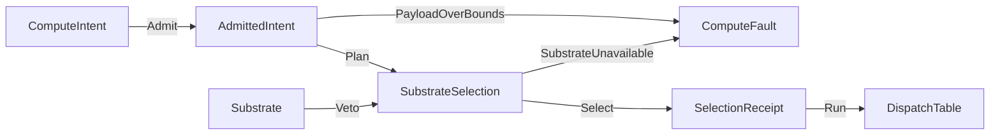

# [COMPUTE_ADMISSION]

Rasm.Compute admits every substrate-routed execution request through one `ComputeIntent` union with a nested `Spec` policy record, routes it over one `Substrate` axis (cpu-tensor, device-wgpu, onnx, genai, remote-grpc) whose capability needs, browser exclusion, provider gates, cost ranks, payload caps, and load tie-breaks are row columns, and dispatches through generated total Switches — selection folds over row data, never an if-ladder, and every walk lands a `SelectionReceipt`. Each intent's eligible chain IS its degrade order (device->cpu->remote, onnx->remote, genai->remote), so a vetoed row degrades to the next without a parallel per-row fallback successor. This owner holds the intent vocabulary, the substrate axis, the `ComputeFault` family in the 2200 code band, and the dispatch spine.

Discipline lanes own their own typed entry folds — `Solver/contract` `Solve`, `Stats/estimator` `Fit`, `Symbolic/expression` `Compile`, `Analysis/assessment` `Assess` — never re-entering this boundary; they rejoin the package only at the one `ComputeReceipt` union, the 2200-band `ComputeFault`, and the `Runtime/scheduling` `LaneRuntime`. Dispatch composes Thinktecture vocabularies, LanguageExt rails, NodaTime instants, and the settled AppHost vocabulary.

## [01]-[INDEX]

- [01]-[INTENT_FAMILY]: seven intent cases, one shared `Spec` record, one boundary admission fold.
- [02]-[SUBSTRATE_AXIS]: five substrate rows (incl. device-wgpu GPGPU); capability needs, browser exclusion, provider gates, ranks, caps, load as columns.
- [03]-[DISPATCH_SPINE]: fault band 2200, ordered selection fold, total dispatch, selection receipt.

## [02]-[INTENT_FAMILY]

- Owner: `ComputeIntent` `[Union]` cases with the nested `Spec` shared-policy record; `AdmittedIntent` the evidence carrier whose private constructor makes `Admit` the only mint — the admission fold lives ON the carrier, so an unadmitted intent structurally cannot reach `Plan`, `Enqueue`, or `DispatchTable.Run`, which all take `AdmittedIntent`.
- Cases: TensorOp | ModelInfer | RemoteCall | UnitProject | SymbolicProject | Pipeline | Generate; `Spec` carries deadline row, lane row, allocation row, cache-policy row, payload caps, forced-substrate `Option`, progress-subscription `Option`, and one inseparable `(Allotted, Provenance)` override.
- Entry: `public static Fin<AdmittedIntent> AdmittedIntent.Admit(ComputeIntent intent, ComputeIntent.Spec spec, CorrelationId correlation, CancelScope parent, IClock clock, TimeProvider time)` — `Fin<T>` aborts; admission runs exactly once at the boundary and interiors never re-validate; the byte and element caps are independent gates, so `Bounded` accumulates both violations through the `Validation` applicative pair before `ToFin` widens once — a first-fail cap gate that hides the second breach is the rejected form.
- Auto: the intent digest derives from the operation symbol plus payload bytes and feeds every selection receipt; the admitted `CancelScope` child binds the allotted deadline so expiry rides the linked token.
- Packages: Thinktecture.Runtime.Extensions, LanguageExt.Core, NodaTime, System.IO.Hashing, BCL inbox
- Growth: one intent case breaks every total Switch at compile time; one shared policy value lands as one `Spec` field; zero new surface.
- Boundary: arity discriminates on the case payload shape — one value, a buffered span handle, or a stream handle — so name suffixes and mode flags never arise; payload spans admit at the edge into `ReadOnlyMemory<byte>` handles owned by the declared allocation row; `Budget` couples every deadline override to non-empty provenance and admission rejects non-positive durations; a pipeline shares one `Spec`, digest, deadline, scope, and correlation while `Projected` re-measures each child for substrate payload gates without minting new boundary evidence; the intent's model field is the XxHash128 checksum, its rich identity record a model-lane concern; `Generate` carries that checksum, the prompt, and the model-lane `GenerationPolicy` (search options, guidance constraint, prompt-assembly inputs) so token streaming admits through the one fold like every intent — a separate `GenerateRequest` path or a chat-client surface never arises; `IClock` and `TimeProvider` cross from the app composition as neutral clock primitives because the App-owned `ClockPolicy` record never crosses downward into this APP-PLATFORM owner.

```csharp signature
[Union(ConversionFromValue = ConversionOperatorsGeneration.None)]
public abstract partial record ComputeIntent {
    private ComputeIntent() { }

    public sealed record TensorOp(TensorOpFamily Family, ReadOnlyMemory<byte> Operands, ImmutableArray<nint> Shape) : ComputeIntent;

    public sealed record ModelInfer(UInt128 Model, ReadOnlyMemory<byte> Input, ImmutableArray<nint> Shape) : ComputeIntent;

    public sealed record RemoteCall(ComputeEndpoint Endpoint, string Method, ReadOnlyMemory<byte> Payload) : ComputeIntent;

    public sealed record UnitProject(QuantityFamily Family, double Value, string Unit, string TargetUnit) : ComputeIntent;

    // Symbolic quantity projection: a unit-bearing FORMULA (not a flat scalar) enters the same intent rail — the
    // expression, its per-symbol dimension declarations, the numeric bindings, and the target unit — dispatched
    // onto the Symbolic lane's dimension proof + compiled evaluation + unit projection chain.
    public sealed record SymbolicProject(SymbolicExpr Formula, Map<string, string> Dimensions, Map<string, double> Bindings, string TargetUnit) : ComputeIntent;

    public sealed record Pipeline(Seq<ComputeIntent> Stages) : ComputeIntent;

    public sealed record Generate(UInt128 Model, string Prompt, GenerationPolicy Policy) : ComputeIntent;

    public sealed record Spec(
        DeadlineClass Deadline,
        WorkLane Lane,
        AllocationClass Allocation,
        CachePolicy Cache,
        Option<(Duration Allotted, string Provenance)> Budget = default,
        Option<long> ByteCap = default,
        Option<long> ElementCap = default,
        Option<Substrate> Forced = default,
        Option<SubscriptionPolicy> Progress = default);
}

public sealed record AdmittedIntent {
    private AdmittedIntent(
        ComputeIntent intent,
        ComputeIntent.Spec spec,
        UInt128 digest,
        long payloadBytes,
        Instant deadlineAt,
        CorrelationId correlation,
        CancelScope scope) {
        Intent = intent;
        Spec = spec;
        Digest = digest;
        PayloadBytes = payloadBytes;
        DeadlineAt = deadlineAt;
        Correlation = correlation;
        Scope = scope;
    }

    public ComputeIntent Intent { get; }

    public ComputeIntent.Spec Spec { get; }

    public UInt128 Digest { get; }

    public long PayloadBytes { get; }

    public Instant DeadlineAt { get; }

    public CorrelationId Correlation { get; }

    public CancelScope Scope { get; }

    public static Fin<AdmittedIntent> Admit(
        ComputeIntent intent,
        ComputeIntent.Spec spec,
        CorrelationId correlation,
        CancelScope parent,
        IClock clock,
        TimeProvider time) =>
        from measured in Measured(intent)
        from bytes in Bounded(measured, spec)
        from allotted in Budgeted(spec)
        select new AdmittedIntent(
            intent,
            spec,
            Derived(intent),
            bytes,
            clock.GetCurrentInstant() + allotted,
            correlation,
            parent.Derive(nameof(AdmittedIntent), time, Some(allotted)));

    private static Fin<Duration> Budgeted(ComputeIntent.Spec spec) =>
        spec.Budget.Match(
            Some: static budget => budget.Allotted <= Duration.Zero || string.IsNullOrWhiteSpace(budget.Provenance)
                ? Fin.Fail<Duration>(new ComputeFault.Text($"budget:{budget.Provenance}:{budget.Allotted}"))
                : Fin.Succ(budget.Allotted),
            None: () => Fin.Succ(spec.Deadline.Allotted));

    internal Fin<AdmittedIntent> Projected(ComputeIntent child) =>
        Measured(child).Map(measured => new AdmittedIntent(child, Spec, Digest, measured.Bytes, DeadlineAt, Correlation, Scope));

    private static Fin<long> Bounded((long Bytes, long Elements) measured, ComputeIntent.Spec spec) =>
        (Gate(spec.ByteCap, measured.Bytes, "bytes"), Gate(spec.ElementCap, measured.Elements, "elements"))
            .Apply(static (bytes, _) => bytes).As().ToFin();

    private static K<Validation<Error>, long> Gate(Option<long> cap, long measured, string axis) =>
        cap.Match(
            Some: bound => bound < 0L
                ? Fin.Fail<long>(new ComputeFault.PayloadOverBounds($"{axis}:negative-cap:{bound}")).ToValidation()
                : measured > bound
                    ? Fin.Fail<long>(new ComputeFault.PayloadOverBounds($"{axis}:{measured}:{bound}")).ToValidation()
                    : Fin.Succ(measured).ToValidation(),
            None: () => Fin.Succ(measured).ToValidation());

    private static Fin<(long Bytes, long Elements)> Measured(ComputeIntent intent) =>
        intent.Switch(
            tensorOp: static op => Shaped(op.Operands.Length, op.Shape),
            modelInfer: static op => Shaped(op.Input.Length, op.Shape),
            remoteCall: static op => Fin.Succ(((long)op.Payload.Length, 0L)),
            unitProject: static _ => Fin.Succ((0L, 1L)),
            symbolicProject: static op => Fin.Succ((0L, (long)Math.Max(1, op.Bindings.Count))),
            generate: static op => Fin.Succ(((long)Encoding.UTF8.GetByteCount(op.Prompt), 0L)),
            pipeline: static line => line.Stages.IsEmpty
                ? Fin.Fail<(long, long)>(new ComputeFault.PayloadOverBounds("pipeline:empty"))
                : line.Stages.TraverseM(static child => Measured(child)).As().Bind(Summed));

    private static Fin<(long Bytes, long Elements)> Shaped(int bytes, ImmutableArray<nint> shape) =>
        Try.lift(() => (
            Bytes: (long)bytes,
            Elements: shape.Aggregate(1L, static (product, dimension) =>
                dimension > 0
                    ? checked(product * (long)dimension)
                    : throw new InvalidDataException($"shape:non-positive:{dimension}")))).Run()
            .MapFail(static error => new ComputeFault.PayloadOverBounds(error.Message));

    private static Fin<(long Bytes, long Elements)> Summed(Seq<(long Bytes, long Elements)> measured) =>
        Try.lift(() => measured.Fold(
            (Bytes: 0L, Elements: 0L),
            static (sum, next) => (checked(sum.Bytes + next.Bytes), checked(sum.Elements + next.Elements)))).Run()
            .MapFail(static error => new ComputeFault.PayloadOverBounds($"pipeline:overflow:{error.Message}"));

    private static UInt128 Derived(ComputeIntent intent) =>
        intent.Switch(
            tensorOp: static op => Seeded(op.Family.Key, op.Operands.Span),
            modelInfer: static op => Seeded(op.Model.ToString("x32", CultureInfo.InvariantCulture), op.Input.Span),
            remoteCall: static op => Seeded(op.Method, op.Payload.Span),
            unitProject: static op => Scalar(op),
            // Formula identity folds the canonical expression content key, the ordinal-sorted declarations and
            // bindings, and the target unit — two structurally identical projections share one digest.
            symbolicProject: static op => Seeded(
                $"{op.Formula.ContentKey:x32}|{string.Join(',', op.Dimensions.OrderBy(static d => d.Key, StringComparer.Ordinal).Map(static d => $"{d.Key}={d.Value}"))}>{op.TargetUnit}",
                MemoryMarshal.AsBytes<double>([.. op.Bindings.OrderBy(static b => b.Key, StringComparer.Ordinal).Map(static b => CanonicalForm.Scalar(b.Value))])),
            generate: static op => Seeded(op.Model.ToString("x32", CultureInfo.InvariantCulture), Encoding.UTF8.GetBytes(op.Prompt)),
            pipeline: static line => Combined(line.Stages.Map(Derived)));

    private static UInt128 Seeded(string operation, ReadOnlySpan<byte> payload) =>
        XxHash128.HashToUInt128(payload, unchecked((long)XxHash3.HashToUInt64(Encoding.UTF8.GetBytes(operation))));

    private static UInt128 Scalar(ComputeIntent.UnitProject op) {
        Span<byte> payload = stackalloc byte[sizeof(double)];
        BinaryPrimitives.WriteDoubleLittleEndian(payload, CanonicalForm.Scalar(op.Value));
        return Seeded($"{op.Family.Key}|{op.Unit}>{op.TargetUnit}", payload);
    }

    private static UInt128 Combined(Seq<UInt128> digests) {
        byte[] payload = new byte[digests.Count * 16];
        ignore(digests.Fold(0, (offset, digest) => {
            BinaryPrimitives.WriteUInt128LittleEndian(payload.AsSpan(offset, 16), digest);
            return offset + 16;
        }));
        return XxHash128.HashToUInt128(payload);
    }
}
```

## [03]-[SUBSTRATE_AXIS]

- Owner: `Substrate` `[SmartEnum<string>]` rows under the `ComparerAccessors.StringOrdinal` accessor, each carrying the capability-need, browser-exclusion, provider-gate, rank, sheddable, and payload-cap columns its one derived `Veto` folds; `SelectionContext` resolved selection inputs; `BenchmarkRank` boot-frozen rank projection.
- Cases: cpu-tensor, device-wgpu (GPGPU compute-shader dispatch over the shared `ONE_WGPU_DEVICE`, ordered before `cpu-tensor` in the tensor-op eligible chain), onnx (one EP-parameterized row — EP variance is model-lane row data, never substrate-row twins), genai (token-streaming over the model-lane GenAI session), remote-grpc.
- Entry: `public Option<string> Veto(SelectionContext context)` — `Option<T>` carries the rejection reason, `None` admits; one derived body folds the browser-exclusion, capability-need, and provider-gate columns so the five rows share one veto and onnx/device/genai availability is the one `!Providers.Contains(Key)` shape, never five parallel delegates.
- Auto: `EffectiveRank` reads the boot-frozen `BenchmarkRank` projection, falling through to the static cost rank on a host-fingerprint mismatch; `SelectionContext.Providers` arrives boot-frozen from the host probe — the ORT probe contributes `onnx` when the runtime reports an execution provider, the device boot `device-wgpu`, the GenAI dylib probe `genai`; warm-start affinity reorders the eligible chain so a cold companion routes to the node holding the matching EP-context blob, one column picking host-vs-companion-vs-farm exactly as it picks cpu-vs-onnx, never an `if (warm)` branch; `LoadRank` is the third tie-break key (rank -> warm-affinity -> load), reading per-node load from the AppHost `PeerRoster` health so the least-loaded of rank-equal-and-warm nodes wins; `Forecast` is the duration-forecast column composed at the root off the fingerprint-matched `Runtime/receipts#BENCHMARK_CLAIMS` medians (band by `BenchmarkClaim.BandOf(PayloadBytes)`, substrate by row key), so `DeadlineVeto` answers "can this finish inside its allotment" before dispatch and an unmeetable local row degrades down the same chain every other veto rides.
- Packages: Thinktecture.Runtime.Extensions, LanguageExt.Core, Microsoft.ML.OnnxRuntime, BCL inbox
- Growth: one substrate row — key, capability need, browser exclusion, provider gate, rank, payload cap, sheddable flag — absorbs a new execution substrate; `device-wgpu` is exactly that one row (ordered before `cpu-tensor` in the tensor-op chain, sheddable, provider-gated on its `Providers` key), so the device thrust spawns no parallel device-state machine and no second `SelectionReceipt` — admission, dispatch, and receipt read device-ness from the same `OrtResidency.DeviceResident` discriminant the CPU path uses; warm-start affinity and `LoadRank` are columns the fold already reads, so farm load-and-offload needs no `FarmRouter`; zero new surface.
- Boundary: wasm is a platform predicate column — `OperatingSystem.IsBrowser` excludes the onnx and device-wgpu rows while cpu-tensor and remote-grpc admit it, so a wasm substrate row never arises; the boot-frozen `Providers` set carries the available keys (`onnx` iff the ORT runtime reports an execution provider, `device-wgpu` iff the shared `ONE_WGPU_DEVICE` adapter resolves, `genai` iff the GenAI dylib loads), so those three rows share the one `!Providers.Contains(Key)` gate and a differently-shaped set read never arises; `device-wgpu` vetoes itself when its key is absent and the tensor-op chain orders it before `cpu-tensor`, so a device-unavailable tensor intent degrades to the CPU GEMM through the same ordered `Chain` fold, keeping the degrade total; `SubstrateSelection` consumes the one per-`WorkLane` `ShedVerdict` the AppHost `LaneGuard` mints from the atomic `DegradationReading` (the `Runtime/admission ← csharp:Rasm.AppHost` `ONE_DEGRADATION_SHED_VERDICT` seam) — resolved once by the governor for the admitted `Spec.Lane` and carried on `SelectionContext.Shed` exactly as `DegradationLevel` rides `SelectionContext.Level`, so the seam couples to the `ShedVerdict(WorkLane, DegradationLevel, bool Shed)` shape and the interior reads `Shed`/`Lane`/`Level`, never the `DegradationCell` it derives from (governor interior stays AppHost-side); `Sheddable` marks the local-compute rows (cpu-tensor, device-wgpu), and `SelectionContext.ShedVeto` folds the lane-shed-AND-sheddable veto into the same `Routed` composition the `Veto`/`VetoPayload` rejections ride, carrying lane and level into the hop reason (`shed:{Lane}:{Level}`) as receipt evidence, so a shed lane degrades a sheddable device op to `remote-grpc` or, when no row admits, reuses `SubstrateUnavailable` with the full hop trail — a device-only backpressure path, a whole-op short-circuit that discards the chain evidence, a bare-`bool` projection that drops the lane/level facts, and a Compute-side re-derivation of the shed all reject, the verdict minted once at the governor and consumed here as a column, never an `if (shed)` ladder; the same device descriptor gates the ONNX Runtime Mac execution-provider residency so a model-lane device tensor and a tensor-lane device kernel resolve one allocator on one physical device; substrate predicates read the retained `Capability` set so remote health rides the AppHost degradation fold and a second health probe is the named defect — Rhino-absent folds to `DegradationLevel.LocalOnly` and the remote row vetoes through `Capability.RemoteCompute`; the remote payload cap composes `GrpcChannelPolicy.Canonical.MaxSendBytes`, never a re-declared literal; warm-start affinity reorders only within the rank-equal tier (a tie-breaker, never a rank override) and `LoadRank` breaks ties only beneath affinity; the genai row vetoes itself when its key is absent (a second GenAI health probe is the named defect), and the generate chain orders genai before remote-grpc and never `cpu-tensor` so a genai-unavailable token stream degrades remote; a forced-substrate selector arriving as wire text admits through `Substrate.Admit`, which lifts generated `TryGet` onto `Fin<Substrate>` before populating `Spec.Forced`.

```csharp signature

public sealed record BenchmarkRank(string HostFingerprint, HashMap<string, int> Ranks) {
    public Option<int> For(Substrate row, string fingerprint) =>
        string.Equals(HostFingerprint, fingerprint, StringComparison.Ordinal) ? Ranks.Find(row.Key) : None;
}

public sealed record SelectionContext(
    DegradationLevel Level,
    ShedVerdict Shed,
    FrozenSet<string> Providers,
    string Fingerprint,
    Option<BenchmarkRank> Ranks,
    FrozenSet<string> WarmAffinity,
    FrozenDictionary<string, double> Loads,
    Func<Substrate, AdmittedIntent, Option<Duration>> Forecast,
    IClock Clock) {
    public int EffectiveRank(Substrate row) => Ranks.Bind(ranks => ranks.For(row, Fingerprint)).IfNone(row.Rank);

    public int AffinityRank(Substrate row) => WarmAffinity.Contains(row.Key) ? 0 : 1;

    public double LoadRank(Substrate row) =>
        Loads.TryGetValue(row.Key, out double load) && double.IsFinite(load) && load >= 0d ? load : double.PositiveInfinity;

    public Option<string> ShedVeto(Substrate row) =>
        Shed.Shed && row.Sheddable ? Some($"shed:{Shed.Lane}:{Shed.Level.Key}") : None;

    public Option<string> DeadlineVeto(Substrate row, AdmittedIntent admitted) {
        Duration remaining = admitted.DeadlineAt - Clock.GetCurrentInstant();
        return remaining <= Duration.Zero
            ? Some($"deadline:expired:{remaining}")
            : Forecast(row, admitted).Filter(median => median > Duration.Zero && remaining < median)
                .Map(median => $"deadline:forecast:{median}:remaining:{remaining}");
    }
}

[SmartEnum<string>]
[KeyMemberEqualityComparer<ComparerAccessors.StringOrdinal, string>]
[KeyMemberComparer<ComparerAccessors.StringOrdinal, string>]
public sealed partial class Substrate {
    public static readonly Substrate CpuTensor = new("cpu-tensor", needs: Capability.LocalCompute, browserExcluded: false, providerGated: false, rank: 0, payloadCapBytes: null, sheddable: true);
    public static readonly Substrate DeviceWgpu = new("device-wgpu", needs: Capability.LocalCompute, browserExcluded: true, providerGated: true, rank: 0, payloadCapBytes: null, sheddable: true);
    public static readonly Substrate Onnx = new("onnx", needs: Capability.LocalCompute, browserExcluded: true, providerGated: true, rank: 1, payloadCapBytes: null, sheddable: false);
    public static readonly Substrate GenAi = new("genai", needs: Capability.LocalCompute, browserExcluded: true, providerGated: true, rank: 1, payloadCapBytes: null, sheddable: false);
    public static readonly Substrate RemoteGrpc = new("remote-grpc", needs: Capability.RemoteCompute, browserExcluded: false, providerGated: false, rank: 2, payloadCapBytes: GrpcChannelPolicy.Canonical.MaxSendBytes, sheddable: false);

    private readonly long? payloadCapBytes;

    public Capability Needs { get; }

    public bool BrowserExcluded { get; }

    public bool ProviderGated { get; }

    public int Rank { get; }

    public bool Sheddable { get; }

    public Option<long> PayloadCap => Optional(payloadCapBytes);

    public static Fin<Substrate> Admit(string key) =>
        TryGet(key, out Substrate? row) && row is { } admitted
            ? Fin.Succ(admitted)
            : Fin.Fail<Substrate>(new ComputeFault.SubstrateUnavailable($"unknown-substrate:{key}"));

    public Option<string> Veto(SelectionContext context) =>
        BrowserExcluded && OperatingSystem.IsBrowser() ? Some(nameof(OperatingSystem.IsBrowser))
        : !context.Level.Permits(Needs) ? Some(Needs.Key)
        : ProviderGated && !context.Providers.Contains(Key) ? Some(Key)
        : None;

    public Option<string> VetoPayload(long bytes) =>
        PayloadCap is { IsSome: true, Case: long cap } && bytes > cap ? Some($"{bytes}:{cap}") : None;
}
```

## [04]-[DISPATCH_SPINE]

- Owner: `ComputeFault` fault family on the doctrine `Expected` shape with the dual-tier `Create` contract in the 2200 code band beside LifecycleFault 1200 and HopFault 4500; `SelectionHop` and `SelectionReceipt` evidence records; `SubstrateSelection` ordered-predicate fold; `DispatchTable` total row dispatch.
- Cases: Text plus the twelve domain cases SubstrateUnavailable | PayloadOverBounds | DeadlineExpired | Cancelled | ShutdownDrained | ModelRejected | ExtensionAssetMissing | EndpointUnreachable | RetryOwnerConflict | AllocationOverClass | EquivalenceMiss | CacheCorrupt — this owner declares the 2200..2212 core; discipline pages extend the SAME band as partial `ComputeFault` records on this owner, never a parallel fault union.
- Band custody: 2200..2212 core (here); 2213..2216 Symbolic lane (`Symbolic/expression` `SymbolicFault` ParseRejected/SymbolUndefined/NonDifferentiable 2213..2215 + `Symbolic/dimensional` DimensionMismatch 2216); 2217..2219 analysis lane (`Analysis/assessment` AssessmentInputMissing/ToolchainUnresolved/AnalysisFailed); 2220..2223 scheduling lane (`Runtime/scheduling` GraphCyclic/GraphRejected/GraphStalled/CheckpointRejected); next-free 2224. `Runtime/wire#FAULT_PROJECTION` mirrors every band row.
- Second custody: the Remote `WireFault` 4520..4532 wire sub-band (`Runtime/wire#FAULT_PROJECTION`) is Compute's SECOND custody — distinct from this 2200 band and from the AppHost `HopFault` 4500 hop band — recorded here beside the primary map and pinned reciprocally in the sibling registries.
- Foreign neighborhoods (PINNED mirror rows — a foreign band change is a row edit on both ends, never prose): AppHost 1xxx lifecycle + 4100..4810 wire/coordination (its `CoordinationFault` re-banded to 4540 around Compute's 4520..4532); AppUi 6xxx; Persistence 5xxx / 771x / 82xx..83xx; the AEC 23xx..27xx registry — each registry pins Compute's two custodies (2200..2223, 4520..4532), so cross-package band disjointness is checkable from both ends.
- Entry: `public static Fin<Seq<SelectionReceipt>> Plan(AdmittedIntent admitted, SelectionContext context)` — `Fin<T>` aborts; the pipeline case folds its stages sequentially with short-circuit and the stage receipts share the parent correlation and digest.
- Auto: every selection walk materializes one `SelectionReceipt` — evaluated rows, rejection reasons, fallback hops, forced bypass, warm-affinity influence, final route — and the receipts page carries it to the sink as the Selection case of the package receipt union, so a farm hop proves itself on the same receipt rail every other hop rides.
- Receipt: `SelectionReceipt` — correlation, digest, route, hop evidence, forced `Option`, warm-affinity flag, `Instant` stamp.
- Packages: Thinktecture.Runtime.Extensions, LanguageExt.Core, NodaTime, BCL inbox
- Growth: one fault case breaks every total Switch at compile time; one new substrate row costs one delegate field on `DispatchTable` and the generated row Switch breaks until it exists; zero new surface.
- Boundary: every fault case projects through the remote-lane FaultDetail wire family at the server edge, never a bare status-code-plus-string terminal; cancellation classifies in one conversion arm from `CancelScope` provenance and the deadline instant so user cancel, deadline expiry, and shutdown drain stay distinct, drain-derived scopes carrying `RuntimePhase.Draining.Key` as a provenance segment; a detected second retry owner raises RetryOwnerConflict toward the Conflict receipt — the AppHost keyed Polly hop owns retry, stacking never occurs here; forced substrate replaces the ordered preference chain but still rides every capability, shed, payload, and deadline veto, so policy cannot bypass safety; dispatch delegates bind at composition through `DispatchTable` because execution capsules carry runtime state no static row column owns; substrate ranking chooses the execution family only — `Runtime/transport#TRANSPORT_AXIS` owns endpoint selection inside `remote-grpc`, and substrate-keyed load or affinity never claims node-level farm routing.

```csharp signature
[Union(ConversionFromValue = ConversionOperatorsGeneration.None)]
public abstract partial record ComputeFault : Expected, IValidationError<ComputeFault> {
    private ComputeFault(string detail, int code) : base(detail, code, None) { }

    public static ComputeFault Create(string message) => new Text(message);

    public static ComputeFault OfCancellation(CancelScope scope, Instant deadlineAt, Instant now) =>
        now >= deadlineAt ? new DeadlineExpired(scope.Provenance)
        : scope.Provenance.Contains(RuntimePhase.Draining.Key, StringComparison.Ordinal) ? new ShutdownDrained(scope.Provenance)
        : new Cancelled(scope.Provenance);

    public sealed record Text : ComputeFault { public Text(string detail) : base(detail, 2200) { } }
    public sealed record SubstrateUnavailable : ComputeFault { public SubstrateUnavailable(string detail) : base(detail, 2201) { } }
    public sealed record PayloadOverBounds : ComputeFault { public PayloadOverBounds(string detail) : base(detail, 2202) { } }
    public sealed record DeadlineExpired : ComputeFault { public DeadlineExpired(string provenance) : base(provenance, 2203) { } }
    public sealed record Cancelled : ComputeFault { public Cancelled(string provenance) : base(provenance, 2204) { } }
    public sealed record ShutdownDrained : ComputeFault { public ShutdownDrained(string provenance) : base(provenance, 2205) { } }
    public sealed record ModelRejected : ComputeFault { public ModelRejected(string detail) : base(detail, 2206) { } }
    public sealed record ExtensionAssetMissing : ComputeFault { public ExtensionAssetMissing(string detail) : base(detail, 2207) { } }
    public sealed record EndpointUnreachable : ComputeFault { public EndpointUnreachable(string detail) : base(detail, 2208) { } }
    public sealed record RetryOwnerConflict : ComputeFault { public RetryOwnerConflict(string detail) : base(detail, 2209) { } }
    public sealed record AllocationOverClass : ComputeFault { public AllocationOverClass(string detail) : base(detail, 2210) { } }
    public sealed record EquivalenceMiss : ComputeFault { public EquivalenceMiss(string detail) : base(detail, 2211) { } }
    public sealed record CacheCorrupt : ComputeFault { public CacheCorrupt(string detail) : base(detail, 2212) { } }
}

public readonly record struct SelectionHop(Substrate Row, Option<string> Rejection);

public sealed record SelectionReceipt(
    CorrelationId Correlation,
    UInt128 Digest,
    Substrate Route,
    Seq<SelectionHop> Hops,
    Option<Substrate> Forced,
    bool WarmAffinity,
    Instant At);

public static class SubstrateSelection {
    // Intent-specific eligibility owns fallback membership; row policy owns ordering within that closed set.
    public static Seq<Substrate> Eligible(ComputeIntent intent) =>
        intent.Switch(
            tensorOp: static _ => Seq(Substrate.DeviceWgpu, Substrate.CpuTensor, Substrate.RemoteGrpc),
            modelInfer: static _ => Seq(Substrate.Onnx, Substrate.RemoteGrpc),
            remoteCall: static _ => Seq(Substrate.RemoteGrpc),
            unitProject: static _ => Seq(Substrate.CpuTensor),
            symbolicProject: static _ => Seq(Substrate.CpuTensor),
            generate: static _ => Seq(Substrate.GenAi, Substrate.RemoteGrpc),
            pipeline: static _ => Seq<Substrate>());

    public static Fin<Seq<SelectionReceipt>> Plan(AdmittedIntent admitted, SelectionContext context) =>
        admitted.Intent is ComputeIntent.Pipeline line
            ? line.Stages.TraverseM(stage => admitted.Projected(stage).Bind(projected => Plan(projected, context))).As()
                .Map(static nested => nested.Fold(Seq<SelectionReceipt>(), static (acc, stage) => acc + stage))
            : Select(admitted, context).Map(static receipt => Seq(receipt));

    public static Fin<SelectionReceipt> Select(AdmittedIntent admitted, SelectionContext context) =>
        Routed(
            admitted,
            context,
            admitted.Spec.Forced.Map(static forced => Seq(forced)).IfNone(() => Chain(Eligible(admitted.Intent), context)),
            admitted.Spec.Forced);

    private static Seq<Substrate> Chain(Seq<Substrate> eligible, SelectionContext context) =>
        toSeq(eligible.OrderBy(context.EffectiveRank).ThenBy(context.AffinityRank).ThenBy(context.LoadRank));

    private static Fin<SelectionReceipt> Routed(
        AdmittedIntent admitted,
        SelectionContext context,
        Seq<Substrate> chain,
        Option<Substrate> forced) =>
        Receipted(admitted, context, forced, chain.Fold(
            (Route: Option<Substrate>.None, Hops: Seq<SelectionHop>()),
            (acc, row) => acc.Route.IsSome ? acc
                : (row.Veto(context) | context.ShedVeto(row) | row.VetoPayload(admitted.PayloadBytes) | context.DeadlineVeto(row, admitted)) is { IsSome: true, Case: string reason }
                    ? (acc.Route, acc.Hops.Add(new SelectionHop(row, Some(reason))))
                    : (Some(row), acc.Hops.Add(new SelectionHop(row, None)))));

    private static Fin<SelectionReceipt> Receipted(
        AdmittedIntent admitted,
        SelectionContext context,
        Option<Substrate> forced,
        (Option<Substrate> Route, Seq<SelectionHop> Hops) walked) =>
        walked.Route
            .ToFin(new ComputeFault.SubstrateUnavailable(string.Join(',', walked.Hops.Map(static hop => hop.Row.Key))))
            .Map(route => new SelectionReceipt(
                admitted.Correlation,
                admitted.Digest,
                route,
                walked.Hops,
                forced,
                context.AffinityRank(route) == 0,
                context.Clock.GetCurrentInstant()));
}

public sealed record DispatchTable(
    Func<AdmittedIntent, IO<Unit>> CpuTensor,
    Func<AdmittedIntent, IO<Unit>> DeviceWgpu,
    Func<AdmittedIntent, IO<Unit>> Onnx,
    Func<AdmittedIntent, IO<Unit>> GenAi,
    Func<AdmittedIntent, IO<Unit>> RemoteGrpc) {
    public IO<Unit> Run(SelectionReceipt selection, AdmittedIntent admitted) =>
        selection.Route.Switch(
            state: (Table: this, Work: admitted),
            cpuTensor: static s => s.Table.CpuTensor(s.Work),
            deviceWgpu: static s => s.Table.DeviceWgpu(s.Work),
            onnx: static s => s.Table.Onnx(s.Work),
            genAi: static s => s.Table.GenAi(s.Work),
            remoteGrpc: static s => s.Table.RemoteGrpc(s.Work));
}
```



## [05]-[RESEARCH]

<!-- source-only: research row template:
[TOKEN]-[OPEN|BLOCKED]: <exact question>; <verification route>.
-->

(none)
