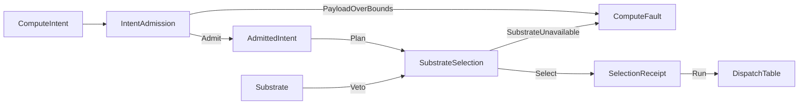

# [COMPUTE_ADMISSION]

Rasm.Compute admits every substrate-routed execution request through one six-case `ComputeIntent` union with one nested `Spec` policy record, routes it over one five-row `Substrate` axis (cpu-tensor, device-wgpu, onnx, genai, remote-grpc) whose capability needs, browser exclusion, provider gates, cost ranks, payload caps, and load tie-breaks are row columns, and dispatches through generated total Switches — selection is a fold over row data, never an if-ladder, and every walk lands a `SelectionReceipt`. The per-intent eligible chain IS the degrade order (device->cpu->remote, onnx->remote, genai->remote), so a vetoed row degrades to the next without a parallel per-row fallback successor. The discipline lanes own their own typed entry folds — `Solver/contract` `Solve`, `Stats/estimator` `Fit`, `Symbolic/expression` `Compile`, `Analysis/assessment` `Assess` — and never re-enter this boundary; they rejoin the package only at the one `ComputeReceipt` union, the `ComputeFault` 2200 band this page custodies, and the `Runtime/scheduling` `LaneRuntime`. The page owns the intent vocabulary, the substrate axis, the `ComputeFault` family in the 2200 code band, and the dispatch spine over Thinktecture vocabularies, LanguageExt rails, NodaTime instants, and the settled AppHost vocabulary.

## [01]-[INDEX]

- [01]-[INTENT_FAMILY]: six intent cases, one shared `Spec` record, one boundary admission fold.
- [02]-[SUBSTRATE_AXIS]: five substrate rows (incl. device-wgpu GPGPU); capability needs, browser exclusion, provider gates, ranks, caps, load as columns.
- [03]-[DISPATCH_SPINE]: fault band 2200, ordered selection fold, total dispatch, selection receipt.

## [02]-[INTENT_FAMILY]

- Owner: `ComputeIntent` `[Union]` six cases with the nested `Spec` shared-policy record; `AdmittedIntent` admitted carrier; `IntentAdmission` boundary fold.
- Cases: TensorOp | ModelInfer | RemoteCall | UnitProject | Pipeline | Generate; `Spec` carries deadline row, lane row, allocation row, cache-policy row, payload caps, forced-substrate `Option`, progress-subscription `Option`.
- Entry: `public static Fin<AdmittedIntent> Admit(ComputeIntent intent, ComputeIntent.Spec spec, CorrelationId correlation, CancelScope parent, ClockPolicy clocks)` — `Fin<T>` aborts; admission runs exactly once at the boundary and interiors never re-validate.
- Auto: the intent digest derives from operation symbol plus payload bytes and feeds the model-lane cache key and every receipt correlation; the admitted `CancelScope` child binds the allotted deadline so expiry rides the linked token.
- Packages: Thinktecture.Runtime.Extensions, LanguageExt.Core, NodaTime, System.IO.Hashing, BCL inbox
- Growth: one intent case breaks every total Switch at compile time; one shared policy value lands as one `Spec` field; zero new surface.
- Boundary: arity discriminates on the case payload shape — one value, a buffered span handle, or a stream handle — and name suffixes or mode flags are the deleted forms; payload spans admit at the edge into `ReadOnlyMemory<byte>` handles owned by the declared allocation row; an `Allotted` override past the `DeadlineClass` row allotment is legal only as a traced literal at the declaring row; the pipeline case shares one `Spec` and one correlation across its stages; the model identity field is the XxHash128 model checksum — the rich identity record stays a model-lane concern; the `Generate` case carries the model checksum, the prompt, and the model-lane `GenerationPolicy` (search options, guidance constraint, prompt-assembly inputs) so token-streaming admits through the one admission fold the same as every intent — a separate `GenerateRequest` admission path or a chat-client surface is the deleted form.

```csharp signature
[Union(ConversionFromValue = ConversionOperatorsGeneration.None)]
public abstract partial record ComputeIntent {
    private ComputeIntent() { }

    public sealed record TensorOp(TensorOpFamily Family, ReadOnlyMemory<byte> Operands, ImmutableArray<nint> Shape) : ComputeIntent;

    public sealed record ModelInfer(UInt128 Model, ReadOnlyMemory<byte> Input, ImmutableArray<nint> Shape) : ComputeIntent;

    public sealed record RemoteCall(ComputeEndpoint Endpoint, string Method, ReadOnlyMemory<byte> Payload) : ComputeIntent;

    public sealed record UnitProject(QuantityFamily Family, double Value, string Unit, string TargetUnit) : ComputeIntent;

    public sealed record Pipeline(Seq<ComputeIntent> Stages) : ComputeIntent;

    public sealed record Generate(UInt128 Model, string Prompt, GenerationPolicy Policy) : ComputeIntent;

    public sealed record Spec(
        DeadlineClass Deadline,
        WorkLane Lane,
        AllocationClass Allocation,
        CachePolicy Cache,
        Option<Duration> Allotted = default,
        Option<long> ByteCap = default,
        Option<long> ElementCap = default,
        Option<Substrate> Forced = default,
        Option<SubscriptionPolicy> Progress = default);
}

public sealed record AdmittedIntent(
    ComputeIntent Intent,
    ComputeIntent.Spec Spec,
    UInt128 Digest,
    long PayloadBytes,
    Instant DeadlineAt,
    CorrelationId Correlation,
    CancelScope Scope);

public static class IntentAdmission {
    public static Fin<AdmittedIntent> Admit(ComputeIntent intent, ComputeIntent.Spec spec, CorrelationId correlation, CancelScope parent, ClockPolicy clocks) =>
        from bytes in Bounded(Measured(intent), spec)
        let allotted = spec.Allotted.IfNone(spec.Deadline.Allotted)
        select new AdmittedIntent(intent, spec, Digest(intent), bytes, clocks.Now + allotted, correlation, parent.Derive(nameof(IntentAdmission), clocks.Time, Some(allotted)));

    static Fin<long> Bounded((long Bytes, long Elements) measured, ComputeIntent.Spec spec) =>
        spec.ByteCap is { IsSome: true, Case: long byteCap } && measured.Bytes > byteCap
            ? Fin.Fail<long>(new ComputeFault.PayloadOverBounds($"bytes:{measured.Bytes}:{byteCap}"))
        : spec.ElementCap is { IsSome: true, Case: long elementCap } && measured.Elements > elementCap
            ? Fin.Fail<long>(new ComputeFault.PayloadOverBounds($"elements:{measured.Elements}:{elementCap}"))
        : Fin.Succ(measured.Bytes);

    static (long Bytes, long Elements) Measured(ComputeIntent intent) =>
        intent.Switch(
            tensorOp: static op => ((long)op.Operands.Length, op.Shape.Aggregate(1L, static (acc, dim) => acc * dim)),
            modelInfer: static op => ((long)op.Input.Length, op.Shape.Aggregate(1L, static (acc, dim) => acc * dim)),
            remoteCall: static op => ((long)op.Payload.Length, 0L),
            unitProject: static _ => (0L, 1L),
            generate: static op => ((long)Encoding.UTF8.GetByteCount(op.Prompt), 0L),
            pipeline: static line => line.Stages.Map(Measured).Fold((Bytes: 0L, Elements: 0L), static (acc, next) => (acc.Bytes + next.Bytes, acc.Elements + next.Elements)));

    static UInt128 Digest(ComputeIntent intent) =>
        intent.Switch(
            tensorOp: static op => Seeded(op.Family.Key, op.Operands.Span),
            modelInfer: static op => Seeded(op.Model.ToString(), op.Input.Span),
            remoteCall: static op => Seeded(op.Method, op.Payload.Span),
            unitProject: static op => Seeded($"{op.Family.Key}|{op.Unit}>{op.TargetUnit}", MemoryMarshal.AsBytes<double>([op.Value])),
            generate: static op => Seeded(op.Model.ToString(), MemoryMarshal.AsBytes(op.Prompt.AsSpan())),
            pipeline: static line => XxHash128.HashToUInt128(MemoryMarshal.AsBytes(line.Stages.Map(Digest).ToArray().AsSpan())));

    static UInt128 Seeded(string operation, ReadOnlySpan<byte> payload) =>
        XxHash128.HashToUInt128(payload, unchecked((long)XxHash3.HashToUInt64(MemoryMarshal.AsBytes(operation.AsSpan()))));
}
```

## [03]-[SUBSTRATE_AXIS]

- Owner: `Substrate` `[SmartEnum<string>]` five rows under the `ComparerAccessors.StringOrdinal` accessor, each carrying the capability-need, browser-exclusion, provider-gate, rank, sheddable, and payload-cap columns its one derived `Veto` folds; `SelectionContext` resolved selection inputs; `BenchmarkRank` boot-frozen rank projection.
- Cases: cpu-tensor, device-wgpu (GPGPU compute-shader dispatch over the shared `ONE_WGPU_DEVICE`, ordered before `cpu-tensor` in the tensor-op eligible chain), onnx (one EP-parameterized row — EP variance is model-lane row data, never substrate-row twins), genai (token-streaming over the model-lane GenAI session), remote-grpc.
- Entry: `public Option<string> Veto(SelectionContext context)` — `Option<T>` carries the rejection reason; `None` admits the row; one derived body folds the browser-exclusion, capability-need, and provider-gate columns so the five rows share one veto and the onnx/device/genai availability is the one `!Providers.Contains(Key)` shape, never five parallel delegates over incompatible set reads.
- Auto: `EffectiveRank` reads the boot-frozen `BenchmarkRank` projection and falls through to the static cost rank when the host fingerprint mismatches; the available substrate-capability keys arrive boot-frozen in `SelectionContext.Providers` from the host environment probe — the model-lane ORT probe contributes the `onnx` key when the runtime reports an execution provider, the device boot the `device-wgpu` key, the GenAI dylib probe the `genai` key; the warm-start affinity column reorders the eligible chain so a cold companion routes to the node holding the matching EP-context blob — the same fold that picks cpu-vs-onnx picks host-vs-companion-vs-farm because the discriminant is a column, never an `if (warm)` branch; the `LoadRank` column is the third tie-break key (rank → warm-affinity → load) reading the per-node load value from the AppHost `PeerRoster` health so among rank-equal-and-warm nodes the least-loaded wins.
- Packages: Thinktecture.Runtime.Extensions, LanguageExt.Core, Microsoft.ML.OnnxRuntime, BCL inbox
- Growth: one substrate row — key, capability need, browser exclusion, provider gate, rank, payload cap, sheddable flag — absorbs a new execution substrate; the `device-wgpu` GPGPU row is exactly that one row (a column on the existing axis, ordered before `cpu-tensor` in the tensor-op eligible chain, sheddable under host saturation, provider-gated on its boot-frozen `Providers` key), so the device thrust never spawns a parallel device-state machine or a second `SelectionReceipt` — admission, dispatch, and receipt all read device-ness from the same `OrtResidency.DeviceResident` discriminant the CPU path already uses; warm-start affinity and the `LoadRank` load value are columns the selection fold already reads, so farm load-and-offload lands without a `FarmRouter`; zero new surface.
- Boundary: wasm is a platform predicate column — `OperatingSystem.IsBrowser` structurally excludes the onnx and device-wgpu rows while cpu-tensor and remote-grpc admit it, and a wasm substrate row is the deleted form; the boot-frozen `Providers` set carries the available substrate keys — `onnx` present iff the ORT runtime reports an execution provider, `device-wgpu` iff the shared `ONE_WGPU_DEVICE` adapter resolves, `genai` iff the GenAI dylib loads — so the device-wgpu, onnx, and genai rows share the one `!Providers.Contains(Key)` provider gate and a row reading the set with a different shape (an emptiness test beside a key-membership test) is the deleted form; the `device-wgpu` row vetoes itself when its boot-frozen `Providers` key is absent and the tensor-op eligible chain orders it before `cpu-tensor` so a device-unavailable tensor intent degrades to the CPU GEMM through the same ordered `Chain` fold (never a throw or a parallel device-admission path), keeping the degrade chain total; the `SubstrateSelection` fold consumes the one per-`WorkLane` `ShedVerdict` the AppHost `LaneGuard` mints from the atomic `DegradationReading` (the `Runtime/admission ← csharp:Rasm.AppHost` `ONE_DEGRADATION_SHED_VERDICT` seam) — the verdict is resolved once by the AppHost governor for the admitted intent's `Spec.Lane` and carried on `SelectionContext.Shed` exactly as the settled `DegradationLevel` vocabulary already rides `SelectionContext.Level`, so the seam couples to the `ShedVerdict(WorkLane, DegradationLevel, bool Shed)` shape and the interior reads the verdict's `Shed`/`Lane`/`Level`, never the `DegradationCell` it derives from (the governor interior stays AppHost-side; only the minted verdict crosses); the `Sheddable` column marks the local-compute rows (cpu-tensor and device-wgpu) that a saturated host backs off, and `SelectionContext.ShedVeto` folds the lane-shed-AND-sheddable veto into the same `Routed` veto composition the `Veto`/`VetoPayload` rejections already ride — carrying the verdict's lane and level into the hop reason (`shed:{Lane}:{Level}`) as receipt evidence rather than a bare flag — so a shed lane degrades a sheddable device op to its non-sheddable successor (`remote-grpc` offloads the work off the saturated host) or, when no row admits, reuses the existing `SubstrateUnavailable` fault toward the same `SelectionReceipt` with the full hop trail — a device-only backpressure path, a whole-op short-circuit that discards the chain evidence, a bare-`bool` projection that drops the lane/level receipt facts, and a Compute-side re-derivation of the shed from raw saturation are the deleted forms because the verdict is minted once at the in-process governor and consumed here as a column the fold reads, never re-computed nor branched on with an `if (shed)` ladder; the same shared device descriptor the device-wgpu row resolves also gates the ONNX Runtime Mac execution-provider residency so a model-lane device tensor and a tensor-lane device kernel resolve the same allocator on the same physical device through this one discriminant; substrate predicates read the retained `Capability` set so remote health rides the AppHost degradation fold and a second health probe is the named defect — Rhino-absent folds to `DegradationLevel.LocalOnly` and the remote row vetoes itself through `Capability.RemoteCompute`; the remote payload cap composes `GrpcChannelPolicy.Canonical.MaxSendBytes`, never a re-declared literal; warm-start affinity reorders only within the rank-equal tier so a benchmark rank never loses to an affinity preference — affinity is a tie-breaker column, never a rank override, and the `LoadRank` load value breaks ties only beneath affinity so a least-loaded node never outranks a warm one; the genai row vetoes itself when its boot-frozen `Providers` key is absent (the GenAI native dylib unresolved) — its veto reads the same `!Providers.Contains(Key)` gate the onnx and device-wgpu rows share and a second GenAI health probe is the named defect, and the generate eligible chain orders genai before remote-grpc and never `cpu-tensor` so a genai-unavailable token stream degrades remote.

```csharp signature

public sealed record BenchmarkRank(string HostFingerprint, HashMap<string, int> Ranks) {
    public Option<int> For(Substrate row, string fingerprint) =>
        string.Equals(HostFingerprint, fingerprint, StringComparison.Ordinal) ? Ranks.Find(row.Key) : None;
}

public sealed record SelectionContext(
    DegradationLevel Level,
    ShedVerdict Shed,
    FrozenSet<string> Providers,
    string Fingerprint,
    Option<BenchmarkRank> Ranks,
    FrozenSet<string> WarmAffinity,
    FrozenDictionary<string, double> Loads,
    ClockPolicy Clocks) {
    public int EffectiveRank(Substrate row) => Ranks.Bind(ranks => ranks.For(row, Fingerprint)).IfNone(row.Rank);

    public int AffinityRank(Substrate row) => WarmAffinity.Contains(row.Key) ? 0 : 1;

    public double LoadRank(Substrate row) => Loads.TryGetValue(row.Key, out double load) ? load : 0.0;

    public Option<string> ShedVeto(Substrate row) =>
        Shed.Shed && row.Sheddable ? Some($"shed:{Shed.Lane}:{Shed.Level.Key}") : None;
}

[SmartEnum<string>]
[KeyMemberEqualityComparer<ComparerAccessors.StringOrdinal, string>]
[KeyMemberComparer<ComparerAccessors.StringOrdinal, string>]
public sealed partial class Substrate {
    public static readonly Substrate CpuTensor = new("cpu-tensor", needs: Capability.LocalCompute, browserExcluded: false, providerGated: false, rank: 0, payloadCapBytes: null, sheddable: true);
    public static readonly Substrate DeviceWgpu = new("device-wgpu", needs: Capability.LocalCompute, browserExcluded: true, providerGated: true, rank: 0, payloadCapBytes: null, sheddable: true);
    public static readonly Substrate Onnx = new("onnx", needs: Capability.LocalCompute, browserExcluded: true, providerGated: true, rank: 1, payloadCapBytes: null, sheddable: false);
    public static readonly Substrate GenAi = new("genai", needs: Capability.LocalCompute, browserExcluded: true, providerGated: true, rank: 1, payloadCapBytes: null, sheddable: false);
    public static readonly Substrate RemoteGrpc = new("remote-grpc", needs: Capability.RemoteCompute, browserExcluded: false, providerGated: false, rank: 2, payloadCapBytes: GrpcChannelPolicy.Canonical.MaxSendBytes, sheddable: false);

    private readonly long? payloadCapBytes;

    public Capability Needs { get; }

    public bool BrowserExcluded { get; }

    public bool ProviderGated { get; }

    public int Rank { get; }

    public bool Sheddable { get; }

    public Option<long> PayloadCap => Optional(payloadCapBytes);

    // Five rows, one derived veto: a browser-excluded row rejects under wasm, any row rejects when the degradation
    // level withholds its capability, and a provider-gated row rejects on !Providers.Contains(Key) — one body, never
    // five parallel delegates, and the onnx/device/genai availability is the single key-membership shape.
    public Option<string> Veto(SelectionContext context) =>
        BrowserExcluded && OperatingSystem.IsBrowser() ? Some(nameof(OperatingSystem.IsBrowser))
        : !context.Level.Permits(Needs) ? Some(Needs.Key)
        : ProviderGated && !context.Providers.Contains(Key) ? Some(Key)
        : None;

    public Option<string> VetoPayload(long bytes) =>
        PayloadCap is { IsSome: true, Case: long cap } && bytes > cap ? Some($"{bytes}:{cap}") : None;
}
```

## [04]-[DISPATCH_SPINE]

- Owner: `ComputeFault` fault family on the doctrine `Expected` shape with the dual-tier `Create` contract in the 2200 code band beside LifecycleFault 1200 and HopFault 4500; `SelectionHop` and `SelectionReceipt` evidence records; `SubstrateSelection` ordered-predicate fold; `DispatchTable` total row dispatch.
- Cases: Text plus the twelve domain cases SubstrateUnavailable | PayloadOverBounds | DeadlineExpired | Cancelled | ShutdownDrained | ModelRejected | ExtensionAssetMissing | EndpointUnreachable | RetryOwnerConflict | AllocationOverClass | EquivalenceMiss | CacheCorrupt — this owner declares the 2200..2212 core; discipline pages extend the SAME band as partial `ComputeFault` records on this owner, never a parallel fault union.
- Band custody: 2200..2212 core (here); 2213..2216 Symbolic lane (`Symbolic/expression` `SymbolicFault` ParseRejected/SymbolUndefined/NonDifferentiable 2213..2215 + `Symbolic/dimensional` DimensionMismatch 2216); 2217..2219 analysis lane (`Analysis/assessment` AssessmentInputMissing/ToolchainUnresolved/AnalysisRunFailed); 2220 scheduling lane (`Runtime/scheduling` GraphCyclic); next-free 2221 — the band registry every new discipline fault reads to claim the next code and never collide.
- Entry: `public static Fin<Seq<SelectionReceipt>> Plan(AdmittedIntent admitted, SelectionContext context)` — `Fin<T>` aborts; the pipeline case folds its stages sequentially with short-circuit and the stage receipts share the parent correlation and digest.
- Auto: every selection walk materializes one `SelectionReceipt` — evaluated rows, rejection reasons, fallback hops, forced bypass, warm-affinity influence, final route — and the receipts page carries it to the sink as the Selection case of the package receipt union, so a farm hop proves itself on the same receipt rail every other hop rides.
- Receipt: `SelectionReceipt` — correlation, digest, route, hop evidence, forced `Option`, warm-affinity flag, `Instant` stamp.
- Packages: Thinktecture.Runtime.Extensions, LanguageExt.Core, NodaTime, BCL inbox
- Growth: one fault case breaks every total Switch at compile time; one new substrate row costs one delegate field on `DispatchTable` and the generated row Switch breaks until it exists; zero new surface.
- Boundary: every fault case projects through the remote-lane FaultDetail wire family at the server edge — a status code plus string is never the terminal shape; cancellation classifies in one conversion arm from `CancelScope` provenance and the deadline instant so user cancel, deadline expiry, and shutdown drain stay distinct cases, and drain-derived scopes carry `RuntimePhase.Draining.Key` as a provenance segment; a detected second retry owner raises RetryOwnerConflict toward the Conflict receipt — the AppHost keyed Polly hop owns retry and stacking never occurs here; forced substrate is the only selection bypass and it is recorded, never silent; dispatch delegates bind at composition through `DispatchTable` because execution capsules carry runtime state no static row column owns.

```csharp signature
[Union(ConversionFromValue = ConversionOperatorsGeneration.None)]
public abstract partial record ComputeFault : Expected, IValidationError<ComputeFault> {
    private ComputeFault(string detail, int code) : base(detail, code, None) { }

    public static ComputeFault Create(string message) => new Text(message);

    public static ComputeFault OfCancellation(CancelScope scope, Instant deadlineAt, Instant now) =>
        now >= deadlineAt ? new DeadlineExpired(scope.Provenance)
        : scope.Provenance.Contains(RuntimePhase.Draining.Key, StringComparison.Ordinal) ? new ShutdownDrained(scope.Provenance)
        : new Cancelled(scope.Provenance);

    public sealed record Text : ComputeFault { public Text(string detail) : base(detail, 2200) { } }
    public sealed record SubstrateUnavailable : ComputeFault { public SubstrateUnavailable(string detail) : base(detail, 2201) { } }
    public sealed record PayloadOverBounds : ComputeFault { public PayloadOverBounds(string detail) : base(detail, 2202) { } }
    public sealed record DeadlineExpired : ComputeFault { public DeadlineExpired(string provenance) : base(provenance, 2203) { } }
    public sealed record Cancelled : ComputeFault { public Cancelled(string provenance) : base(provenance, 2204) { } }
    public sealed record ShutdownDrained : ComputeFault { public ShutdownDrained(string provenance) : base(provenance, 2205) { } }
    public sealed record ModelRejected : ComputeFault { public ModelRejected(string detail) : base(detail, 2206) { } }
    public sealed record ExtensionAssetMissing : ComputeFault { public ExtensionAssetMissing(string detail) : base(detail, 2207) { } }
    public sealed record EndpointUnreachable : ComputeFault { public EndpointUnreachable(string detail) : base(detail, 2208) { } }
    public sealed record RetryOwnerConflict : ComputeFault { public RetryOwnerConflict(string detail) : base(detail, 2209) { } }
    public sealed record AllocationOverClass : ComputeFault { public AllocationOverClass(string detail) : base(detail, 2210) { } }
    public sealed record EquivalenceMiss : ComputeFault { public EquivalenceMiss(string detail) : base(detail, 2211) { } }
    public sealed record CacheCorrupt : ComputeFault { public CacheCorrupt(string detail) : base(detail, 2212) { } }
}

public readonly record struct SelectionHop(Substrate Row, Option<string> Rejection);

public sealed record SelectionReceipt(
    CorrelationId Correlation,
    UInt128 Digest,
    Substrate Route,
    Seq<SelectionHop> Hops,
    Option<Substrate> Forced,
    bool WarmAffinity,
    Instant At);

public static class SubstrateSelection {
    // The per-intent substrate preference order IS the degrade chain — device->cpu->remote for a tensor op, onnx->remote
    // for a model infer, genai->remote for a generate — so a vetoed row degrades to the next in this one declared order;
    // a per-row fallback-successor column is the rejected form (intent-specific edges cannot live on a single row).
    public static Seq<Substrate> Eligible(ComputeIntent intent) =>
        intent.Switch(
            tensorOp: static _ => Seq(Substrate.DeviceWgpu, Substrate.CpuTensor, Substrate.RemoteGrpc),
            modelInfer: static _ => Seq(Substrate.Onnx, Substrate.RemoteGrpc),
            remoteCall: static _ => Seq(Substrate.RemoteGrpc),
            unitProject: static _ => Seq(Substrate.CpuTensor),
            generate: static _ => Seq(Substrate.GenAi, Substrate.RemoteGrpc),
            pipeline: static _ => Seq<Substrate>());

    public static Fin<Seq<SelectionReceipt>> Plan(AdmittedIntent admitted, SelectionContext context) =>
        admitted.Intent is ComputeIntent.Pipeline line
            ? line.Stages.TraverseM(stage => Plan(admitted with { Intent = stage }, context)).As()
                .Map(static nested => nested.Fold(Seq<SelectionReceipt>(), static (acc, stage) => acc + stage))
            : Select(admitted, context).Map(static receipt => Seq(receipt));

    public static Fin<SelectionReceipt> Select(AdmittedIntent admitted, SelectionContext context) =>
        admitted.Spec.Forced is { IsSome: true, Case: Substrate forced }
            ? Fin.Succ(new SelectionReceipt(admitted.Correlation, admitted.Digest, forced, Seq<SelectionHop>(), Some(forced), false, context.Clocks.Now))
            : Routed(admitted, context, Chain(Eligible(admitted.Intent), context));

    static Seq<Substrate> Chain(Seq<Substrate> eligible, SelectionContext context) =>
        toSeq(eligible.OrderBy(context.EffectiveRank).ThenBy(context.AffinityRank).ThenBy(context.LoadRank));

    static Fin<SelectionReceipt> Routed(AdmittedIntent admitted, SelectionContext context, Seq<Substrate> chain) =>
        Receipted(admitted, context, chain.Fold(
            (Route: Option<Substrate>.None, Hops: Seq<SelectionHop>()),
            (acc, row) => acc.Route.IsSome ? acc
                : (row.Veto(context) | context.ShedVeto(row) | row.VetoPayload(admitted.PayloadBytes)) is { IsSome: true, Case: string reason }
                    ? (acc.Route, acc.Hops.Add(new SelectionHop(row, Some(reason))))
                    : (Some(row), acc.Hops.Add(new SelectionHop(row, None)))));

    static Fin<SelectionReceipt> Receipted(AdmittedIntent admitted, SelectionContext context, (Option<Substrate> Route, Seq<SelectionHop> Hops) walked) =>
        walked.Route
            .ToFin(new ComputeFault.SubstrateUnavailable(string.Join(',', walked.Hops.Map(static hop => hop.Row.Key))))
            .Map(route => new SelectionReceipt(admitted.Correlation, admitted.Digest, route, walked.Hops, None, context.AffinityRank(route) == 0, context.Clocks.Now));
}

public sealed record DispatchTable(
    Func<AdmittedIntent, IO<Unit>> CpuTensor,
    Func<AdmittedIntent, IO<Unit>> DeviceWgpu,
    Func<AdmittedIntent, IO<Unit>> Onnx,
    Func<AdmittedIntent, IO<Unit>> GenAi,
    Func<AdmittedIntent, IO<Unit>> RemoteGrpc) {
    public IO<Unit> Run(SelectionReceipt selection, AdmittedIntent admitted) =>
        selection.Route.Switch(
            state: (Table: this, Work: admitted),
            cpuTensor: static s => s.Table.CpuTensor(s.Work),
            deviceWgpu: static s => s.Table.DeviceWgpu(s.Work),
            onnx: static s => s.Table.Onnx(s.Work),
            genAi: static s => s.Table.GenAi(s.Work),
            remoteGrpc: static s => s.Table.RemoteGrpc(s.Work));
}
```


