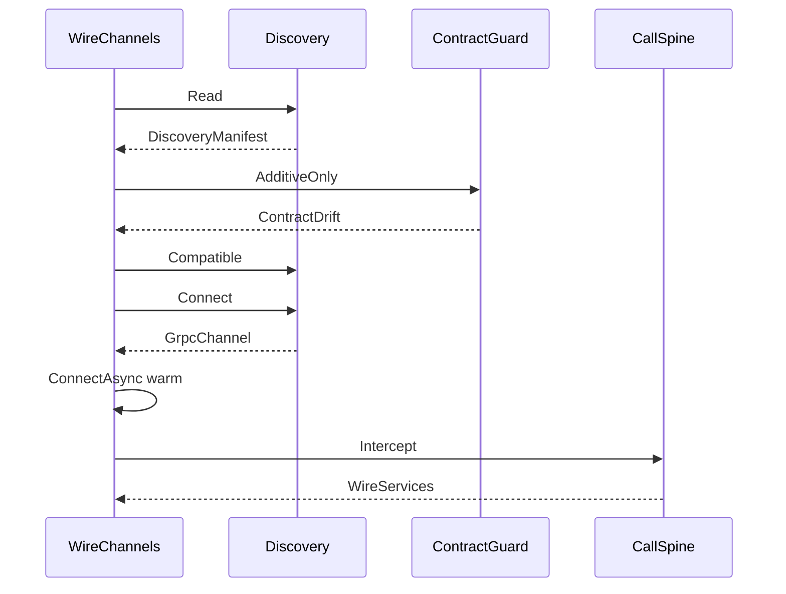

# [COMPUTE_CHANNELS]

Rasm.Compute owns the suite wire vocabulary: five proto services compiled GrpcServices=Client in this package and GrpcServices=Server at app roots, one descriptor-diff contract-evolution law detecting field-shape, rpc-shape, oneof-membership, enum-surface, reserved-number, packed-flip, and nested-type drift behind one canonical XxHash128 projection-checksum gate, one FaultDetail family carrying every typed fault across the wire with a total seventeen-code `StatusCode` fold and an in-band conflict decode arm, five `RemoteTransport` rows with streaming-capability columns and a typed connectivity-transition fold warmed through `ConnectAsync`, the canonical `GrpcChannelPolicy` channel-tuning owner whose `HttpVersionPosture` resolves the HTTP/2-versus-HTTP/3-forward channel-option pair from the host QUIC verdict, a five-row `CredentialPolicy` axis behind one stamping interceptor minting per-call identity through `AsyncAuthInterceptor`, and a claim-gated `CompressionProviders` encoding axis projecting the inbox `ICompressionProvider` rows. The flagship `DocumentService`↔`DocumentTransaction` parity seam is wire-complete here: the remote-lane `WireDocument` surface folds the deadline budget, the `Bounded` payload pre-check, the `Classify` fault rail, and receipt emission into the same canonical operation set field-for-field across in-process and cross-process, so a transaction executed locally and one executed over the channel return the identical typed receipt and decode the same in-band conflict. The ArtifactSync frame law owns the 64 KiB `FrameEdge` fold with per-frame Crc32, whole-artifact XxHash128 identity, the `IBufferMessage` zero-alloc parse-merge-write fast path over a `RecyclableMemoryStream` writer face whose pool events fold to the staging-evidence sink, a `FieldCodec<T>` per-payload encoding row, and a `FieldMask` partial-update APPLY leg over `Merge`/`Union`; the browser TS posture projects the whole suite wire as type-only contracts. Channel policy values arrive settled on `GrpcChannelPolicy.Canonical`; discovery, retry ownership, deadlines, correlation, degradation, and receipt sinks compose from the AppHost spine. The package spine is Google.Protobuf, Grpc.Tools, Grpc.Net.Client, Grpc.Net.Client.Web, Microsoft.AspNetCore.TestHost (test-only InProcess handler), NodaTime.Serialization.Protobuf, Microsoft.IO.RecyclableMemoryStream, CommunityToolkit.HighPerformance, System.IO.Hashing, Thinktecture.Runtime.Extensions, LanguageExt.Core, and NodaTime.

## [01]-[INDEX]

- [01]-[PROTO_VOCABULARY]: five wire services, canonical geometry messages, the `DocumentService`↔`DocumentTransaction` parity seam, one polymorphic field-mask projection, `Any` polymorphic envelope, JSON edge, generated-client capsule.
- [02]-[CONTRACT_EVOLUTION]: descriptor-diff drift law over field/rpc/oneof/enum/reserved/packed/nested surface behind one canonical projection-checksum gate, parse hardening, reserved-number policy, field-mask read guard.
- [03]-[FAULT_PROJECTION]: one `FaultDetail` family plus a total seventeen-code `StatusCode`→`WireFault` `FrozenDictionary` rail, an in-band transaction-conflict decode arm, and a conflict receipt pack.
- [04]-[TRANSPORT_AXIS]: five transport rows, streaming capability, keepalive/pooling/affinity/reconnect columns, the canonical `GrpcChannelPolicy` tuning owner, the RID-gated HTTP/3-forward version posture, channel warm-up, typed connectivity-transition fold, grpc-web binary framing, in-process test handler, dial dispatch, redial law; the injected `BsddPort` bSDD REST transport the Bim classification leg binds.
- [05]-[CALL_POLICY]: five credential rows minting per-call identity, three compression rows, one five-arity stamping interceptor threading the `HopTotal` deadline budget, per-call compression/credential edge, payload edge.
- [06]-[ARTIFACT_FRAMES]: suite frame law — 64 KiB frames, `Crc32`, whole-artifact `XxHash128`, zero-copy wrap, pooled-stream buffer fast path, manager-event evidence subscription, `FieldCodec` payload row, mask-driven partial-update apply, transaction wire choreography.
- [07]-[TS_PROJECTION]: browser wire posture, fault and frame contracts, method shapes, transaction-parity shape, field-mask read.

## [02]-[PROTO_VOCABULARY]

- Owner: the five service contracts and the canonical geometry message family declared in the remote-lane owner folder; `WireServices` — the channel-scoped generated-client capsule carrying one polymorphic `Mask` projection and the `Unpack` typed-fault projection; `WireDocument` — the flagship `DocumentService`↔`DocumentTransaction` parity surface folding budget, `Bounded` pre-check, `Classify`, and receipt emission into the canonical operation set field-for-field across in-process and cross-process.
- Cases: ComputeService, DocumentService, ControlService, ArtifactSync, grpc.health.v1.Health — google/rpc/status.proto and grpc.health.v1 compile verbatim beside the owned files.
- Auto: Grpc.Tools compiles GrpcServices=Client at build with `PrivateAssets=all`, `Access=Internal` for package-internal generated types and `Access=Public` only where the contract crosses the package boundary; app roots compile the same files GrpcServices=Server and emit the descriptor set that feeds connect-es codegen and the manifest checksum.
- Packages: Google.Protobuf, Grpc.Tools, Grpc.Net.Client, NodaTime.Serialization.Protobuf
- Flagship: `WireDocument` is the `DocumentService`↔`DocumentTransaction` parity owner — `ExecuteTransaction` carries the in-process `DocumentTransaction` verb set field-for-field through one budget-bounded, fault-classified, receipt-emitting forwarder, so the same canonical operation set, the same `TransactionReceipt`, and the same wire choreography produce the identical typed receipt whether the transaction runs through the in-process handler or across the channel; the dedup window equals the `DeadlineClass.HopTotal` allotment so the one retry owner's horizon gates the idempotency edge on both legs, the response mirrors the typed receipt through `WireDocument.Receipt`, and a non-exceptional in-band conflict decodes through `WireDocument.Conflict` reading the `TransactionReceipt.conflict=5` slot onto the typed `WireFault` rail with no parallel response DTO and no hand-rolled per-consumer projection.
- Growth: one rpc row on an existing service or one numbered message field absorbs a new wire fact; the browser collaboration decomposition (server-stream down, unary chunked up) is designed-only growth of one rpc row per direction; zero new surface.
- Boundary: temporal values cross as Timestamp and protobuf Duration through `ToTimestamp`/`ToProtobufDuration` outward and `ToInstant`/`ToNodaDuration` inward — BCL DateTime never sits between wire and rail; calendar-bearing capture and schedule facts cross as `Google.Type` commons through `ToDate`/`ToTimeOfDay`/`ToProtobufDayOfWeek` outward and `ToLocalDate`/`ToLocalTime`/`ToIsoDayOfWeek` inward, so a serialized date string never sits between wire and rail; FieldMask carries the read projection and the partial-update write leg through one polymorphic `WireServices.Mask` entrypoint that discriminates on input shape — an `int`-span admits a field-number-validated NAME-path mask through `FieldMask.FromFieldNumbers<QueryResponse>` (the typed overload resolving each number to its field NAME via `FindFieldByNumber` against the generated descriptor, never a free string path) and a `string`-span admits a caller-path mask through the non-throwing `FieldMask.FromString` re-guarded by one load-bearing `FieldMask.IsValid(QueryResponse.Descriptor, mask)` gate against the generated descriptor, both `Normalize`d to canonical sorted-deduplicated form and unified on `Fin<FieldMask>` so an unknown path or number faults at the edge rather than silently dropping or throwing past it — the same partial-read mask the web-fed Query feed consumes, never a per-tile request DTO or a second mask carrier; Any with TypeRegistry carries polymorphic artifact envelopes through `WireServices.Unpack` over `Any.TryUnpack<T>` keyed by `Any.Is(descriptor)` projecting the typed fault, while outbound packing rides `Any.Pack` directly at the one staging site (`FrameEdge.Transaction`) — a rename-forward `Pack` wrapper is the deleted form; Empty carries signals; `JsonFormatter` and `JsonParser` with the same TypeRegistry are the dashboard edge over the identical generated messages — a parallel web DTO family is the deleted form; `ExecuteTransaction` defends its idempotency edge by `Clone` on the dedup-window receipt rather than mutating the cached message in place — a shared-mutable cached message is the deleted form; `OriginalNameAttribute` reconciles a proto field name to its diverged C# name at the descriptor surface so the contract-evolution key reads the proto name, never the generated identifier; the proto geometry family is the single binary wire geometry, with NetTopologySuite as the store boundary projection, GeoJSON as the JSON projection, and RhinoCommon as the host projection; ArtifactSync carries the wire leg only — sync state, diffing, and transfer manifests are store mechanics; the `Solve`/`Generate` rpcs carry the numeric-lane decomposition and generative-run legs field-for-field with no second request shape, and the `GraphDiff`/`SubtreeFetch` rpcs carry the content-key delta wire shape only — the set-difference computation is `Rasm.Persistence/Version/ledger#CHANGEFEED` (the `TransferSet` closure-minus-held fold over the `Closure` descendant content-key manifest), so Compute owns the wire frame and Persistence's ledger owns the diff algebra.

```csharp signature
public sealed record WireServices(
    GrpcChannel Channel,
    ComputeService.ComputeServiceClient Compute,
    DocumentService.DocumentServiceClient Document,
    ControlService.ControlServiceClient Control,
    ArtifactSync.ArtifactSyncClient Artifacts,
    Health.HealthClient Health) : IDisposable {
    public static Fin<FieldMask> Mask(params ReadOnlySpan<int> fieldNumbers) =>
        Try.lift(() => FieldMask.FromFieldNumbers<QueryResponse>(fieldNumbers.ToArray()).Normalize()).Run()
            .MapFail(static error => new ComputeFault.PayloadOverBounds($"unknown query field-number: {error.Message}"));

    public static Fin<FieldMask> Mask(params ReadOnlySpan<string> paths) =>
        FieldMask.FromString(string.Join(',', paths.ToArray())) is var mask && FieldMask.IsValid(QueryResponse.Descriptor, mask)
            ? Fin.Succ(mask.Normalize())
            : Fin.Fail<FieldMask>(new ComputeFault.PayloadOverBounds($"unknown query path in [{string.Join(',', paths.ToArray())}]"));

    public static Fin<T> Unpack<T>(Any envelope) where T : class, IMessage<T>, new() =>
        envelope.TryUnpack<T>(out var artifact)
            ? Fin.Succ(artifact)
            : Fin.Fail<T>(new ComputeFault.PayloadOverBounds($"any-envelope {Any.GetTypeName(envelope.TypeUrl)} not {new T().Descriptor.FullName}"));

    public void Dispose() => Channel.Dispose();
}

public static class WireDocument {
    public static Task<Fin<TransactionReceipt>> ExecuteTransaction(WireServices services, TransactionRequest request, Instant deadline, CancellationToken token) =>
        CallSpine.Bounded(request).Match(
            Succ: bounded => CallSpine.Awaited(services.Document.ExecuteTransactionAsync(bounded, CallSpine.Options(deadline, token)).ResponseAsync),
            Fail: static error => Task.FromResult(Fin.Fail<TransactionReceipt>(error)));

    public static Task<Fin<QueryResponse>> Query(WireServices services, QueryRequest request, FieldMask projection, Instant deadline, CancellationToken token) =>
        CallSpine.Awaited(services.Document.QueryAsync(request with { Mask = projection }, CallSpine.Options(deadline, token)).ResponseAsync);

    public static IAsyncEnumerable<DocumentEvent> Watch(WireServices services, WatchRequest request, Instant deadline, CancellationToken token) =>
        services.Document.DocumentEvents(request, CallSpine.Options(deadline, token)).ResponseStream.ReadAllAsync(token);

    public static TransactionReceipt Receipt(TransactionReceipt wire, ByteString idempotencyKey) =>
        wire.IdempotencyKey == idempotencyKey ? wire : wire.Clone();

    public static Option<WireFault> Conflict(TransactionReceipt receipt) =>
        receipt.Committed || receipt.Conflict is null
            ? None
            : Some(WireFault.Decode(receipt.Conflict));
}
```

| [INDEX] | [SERVICE]       | [RPC]              | [SHAPE]       | [MESSAGES]                               | [LAW]                                                                                                                                                                                                                                                                                                                                                             |
| :-----: | --------------- | ------------------ | ------------- | ---------------------------------------- | ----------------------------------------------------------------------------------------------------------------------------------------------------------------------------------------------------------------------------------------------------------------------------------------------------------------------------------------------------------------- |
|  [01]   | ComputeService  | Infer              | unary         | InferRequest → InferResponse             | payload caps pre-checked at the call edge; faults ride FaultDetail                                                                                                                                                                                                                                                                                                |
|  [02]   | ComputeService  | Progress           | server-stream | ProgressRequest → ProgressUpdate         | phase enum mirrors the nine phase keys 1:1, keyed by correlation                                                                                                                                                                                                                                                                                                  |
|  [03]   | ComputeService  | Capabilities       | unary         | Empty → ComputeCapabilities              | substrate rows, EP rows, model inventory, payload caps, contract metadata — Compute capability rows only                                                                                                                                                                                                                                                          |
|  [04]   | DocumentService | Capabilities       | unary         | Empty → DocumentCapabilities             | verb inventory and document scope                                                                                                                                                                                                                                                                                                                                 |
|  [05]   | DocumentService | DocumentEvents     | server-stream | WatchRequest → DocumentEvent             | watch-fact stream feeding the live-data spine                                                                                                                                                                                                                                                                                                                     |
|  [06]   | DocumentService | ExecuteTransaction | unary         | TransactionRequest → TransactionReceipt  | flagship parity: idempotency key; server dedup window equals the DeadlineClass.HopTotal allotment — the one retry owner's horizon; the forwarder folds Bounded+budget+Classify+receipt; the receipt mirrors the DocumentTransaction typed receipt field-for-field through `WireDocument.Receipt` and the in-band conflict decodes through `WireDocument.Conflict` |
|  [07]   | DocumentService | Query              | unary         | QueryRequest → QueryResponse             | read verb with FieldMask projection via `WireServices.Mask`                                                                                                                                                                                                                                                                                                       |
|  [08]   | DocumentService | CaptureEvents      | client-stream | CaptureFrame → CaptureSummary            | per-frame HLC idempotency keys; Http2 and UnixDomainSocket rows only                                                                                                                                                                                                                                                                                              |
|  [09]   | ControlService  | CaptureSupport     | unary         | Empty → CaptureSupportReply              | projects the SupportManifest receipt                                                                                                                                                                                                                                                                                                                              |
|  [10]   | ControlService  | SetDegradation     | unary         | SetDegradationRequest → DegradationReply | level key lands on the one override rail — the OperatorOverride consequence                                                                                                                                                                                                                                                                                       |
|  [11]   | ControlService  | ReloadOptions      | unary         | Empty → ReloadReply                      | projects the ReloadReceipt                                                                                                                                                                                                                                                                                                                                        |
|  [12]   | ArtifactSync    | Sync               | bidi          | ArtifactFrame → ArtifactFrame            | frame law below; FieldMask partials; Any artifact envelopes                                                                                                                                                                                                                                                                                                       |
|  [13]   | Health          | Check              | unary         | HealthCheckRequest → HealthCheckResponse | maps from the HealthChecks registry via the WireHealthRow tag predicate; substrate predicate and node selection read it                                                                                                                                                                                                                                           |
|  [14]   | Health          | Watch              | server-stream | HealthCheckRequest → HealthCheckResponse | compiled verbatim from the well-known proto                                                                                                                                                                                                                                                                                                                       |
|  [15]   | ComputeService  | Solve              | unary         | SolveRequest → SolveResponse             | carries the numeric-lane dense or sparse decomposition field-for-field; faults ride FaultDetail; the row-block shard sub-solve dials this rpc                                                                                                                                                                                                                     |
|  [16]   | ComputeService  | Generate           | server-stream | GenerateRequest → TokenChunk             | the remote token-streaming leg riding the Progress-class server-stream pattern, keyed by correlation; faults ride FaultDetail                                                                                                                                                                                                                                     |
|  [17]   | ComputeService  | GraphDiff          | unary         | GraphDiffRequest → GraphDiffResponse     | content-key delta over two Closure hashes; the set-difference algebra is `Rasm.Persistence/Version/ledger#CHANGEFEED` (`TransferSet`/`Closure`), this carries the wire shape only                                                                                                                                                                                                             |
|  [18]   | ComputeService  | SubtreeFetch       | server-stream | SubtreeFetchRequest → GraphChunk         | partial-graph checkout streaming the content-addressed subtree the GraphDiff added-set names                                                                                                                                                                                                                                                                      |

| [INDEX] | [MESSAGE]           | [FIELDS]                                                                                                                                                                         | [ALIGNS]                                                                                                                                                                               |
| :-----: | ------------------- | -------------------------------------------------------------------------------------------------------------------------------------------------------------------------------- | -------------------------------------------------------------------------------------------------------------------------------------------------------------------------------------- |
|  [01]   | GeometryPayload     | oneof kind: point_cloud=1, mesh=2, voxel=3; symbolic_dims=4 repeated                                                                                                             | envelope for Infer payloads and artifacts                                                                                                                                              |
|  [02]   | PointCloudTensor    | count=1 int64; channels=2 int32; dtype=3 string; data=4 bytes                                                                                                                    | point-cloud N×C encoding row                                                                                                                                                           |
|  [03]   | MeshTensor          | vertex_count=1 int64; vertices=2 bytes; face_count=3 int64; faces=4 bytes                                                                                                        | mesh vertex N×3 and face F×3 rows                                                                                                                                                      |
|  [04]   | VoxelTensor         | dims=1 repeated int64; dtype=2 string; data=3 bytes                                                                                                                              | voxel NCHW row                                                                                                                                                                         |
|  [05]   | SymbolicDim         | name=1 string; bound=2 int64                                                                                                                                                     | symbolic-dim binding row                                                                                                                                                               |
|  [06]   | TransactionRequest  | idempotency_key=1 bytes; ops=2 repeated Any; expected_epoch=3 uint64; hlc_physical=4 google.protobuf.Timestamp; hlc_logical=5 uint64; correlation=6 string                       | flagship: the in-process `DocumentTransaction` verb set field-for-field, ops as polymorphic Any envelopes                                                                              |
|  [07]   | TransactionReceipt  | idempotency_key=1 bytes; committed=2 bool; new_epoch=3 uint64; applied=4 repeated string; conflict=5 FaultDetail; hlc_physical=6 google.protobuf.Timestamp; hlc_logical=7 uint64 | flagship: mirrors the `DocumentTransaction` typed receipt field-for-field; the `conflict` slot carries the FaultDetail the retry owner decodes through `WireDocument.Conflict` in band |
|  [08]   | QueryRequest        | scope=1 string; predicate=2 Struct; cursor=3 string; mask=4 google.protobuf.FieldMask                                                                                            | read verb carrying the field-mask projection                                                                                                                                           |
|  [09]   | QueryResponse       | rows=1 repeated Struct; cursor=2 string; total=3 int64                                                                                                                           | masked read result; the mask names the projected columns                                                                                                                               |
|  [10]   | SolveRequest        | matrix=1 GeometryPayload; rhs=2 bytes; factorization_kind=3 string; sparse_format=4 string; shard_tile=5 int32                                                                   | numeric-lane decomposition request field-for-field                                                                                                                                     |
|  [11]   | SolveResponse       | solution=1 bytes; provider=2 string; decomposition=3 string; rows=4 int64; cols=5 int64; nnz=6 int64                                                                             | numeric-lane solve result + Factorization-receipt evidence                                                                                                                             |
|  [12]   | GenerateRequest     | model_checksum=1 string; prompt=2 string; max_length=3 double; guidance_kind=4 string; guidance_data=5 string; tools=6 string                                                    | generative-run request mirroring GenerationPolicy                                                                                                                                      |
|  [13]   | TokenChunk          | piece=1 string; token_index=2 int64; done=3 bool                                                                                                                                 | one decoded token piece per server-stream frame                                                                                                                                        |
|  [14]   | GraphDiffRequest    | base_hash=1 string; target_hash=2 string                                                                                                                                         | content-key delta over two Closure hashes                                                                                                                                              |
|  [15]   | GraphDiffResponse   | added=1 repeated string; removed=2 repeated string                                                                                                                               | added/removed content-key set                                                                                                                                                          |
|  [16]   | SubtreeFetchRequest | content_keys=1 repeated string                                                                                                                                                   | partial-graph checkout request                                                                                                                                                         |
|  [17]   | GraphChunk          | content_key=1 string; payload=2 bytes; ordinal=3 int64                                                                                                                           | one content-addressed subtree node per frame                                                                                                                                           |

## [03]-[CONTRACT_EVOLUTION]

- Owner: `ContractDrift` `[Union]` three-way drift classification; `ContractGuard` — descriptor surface fold over field/rpc/oneof/enum/reserved/packed shape recursing nested message and enum types, classifier delegate, descriptor publication path, proto-name reconciliation, canonical projection checksum, field-mask read guard; `ParseGuard` — inbound parse-hardening policy record carrying the bounded-reader factory, the proto2 `ExtensionRegistry`, and the dynamic open-envelope admission.
- Cases: Identical, Additive (tolerated), Breaking (typed rejection carrying the missing or retyped surface rows).
- Entry: `AdditiveOnly(Seq<ByteString> local, Func<string, Fin<Seq<ByteString>>> peerSetOf)` — the delegate `Discovery.Compatible` consumes; checksum equality or additive drift admits, breaking drift rejects on the hop fault rail.
- Packages: Google.Protobuf, Thinktecture.Runtime.Extensions, LanguageExt.Core, System.IO.Hashing, Rasm.AppHost (project), BCL inbox
- Growth: a removed field becomes one reserved row carrying its number range — `message.ToProto().ReservedRange` projects each `Start`-`End` span into the surface set so numbers never return to use and a removed-then-reclaimed number classifies Breaking; one surface-projection row absorbs a new descriptor dimension — packed-encoding flip, nested-type retype, oneof-membership change; the host↔companion capability negotiation and per-node EP-option bag ride the `Struct`/`Value`/`ListValue` open-envelope column under the same additive-only contract — open within an additive-only contract, never a drift escape hatch; zero new surface.
- Boundary: contract identity is the serialized descriptor set built through `FileDescriptor.BuildFromByteStrings` at startup and published beside the discovery manifest at `DescriptorPath`; the descriptor key reads the proto field name reconciled through `OriginalNameAttribute` so a diverged C# identifier never enters the surface set; the manifest checksum is the canonical projection digest — `ContractGuard.Checksum` builds the descriptors, folds the ordered `Surface(...)` `FrozenSet<string>` the classifier already computes through `InDeclarationOrder()` into one UTF-8 byte stream, and `XxHash128.Hash`es that, so two generators emitting semantically-identical descriptors checksum-match while the doctrine-rejected raw `SerializedData` hash (non-canonical across generator versions) never enters; the `AdditiveOnly` gate admits on checksum equality before any descriptor parse and only descends into `Build`+`Classify` when the digests diverge, so an equal-descriptor peer never pays the surface-set diff and a checksum mismatch never admits on its own — descriptor-diff is the second gate behind the checksum gate, never a replacement for it; the surface fold reads seven diff-relevant dimensions, recursing nested types so a phase enum nested in a message and a nested-message field retype are both visible — field number-type-cardinality-packing-oneof-jsonname through `MessageDescriptor.Fields.InDeclarationOrder()` with `FieldDescriptor.IsPacked`, the reserved-range set through `MessageDescriptor.ToProto().ReservedRange`, oneof membership through `Oneofs`, the enum value set through `EnumTypes`/`NestedTypes` recursion with `EnumValueDescriptor.Number`, and rpc input-output-streaming shape through `ServiceDescriptor.Methods` with `MethodDescriptor.InputType`/`OutputType`/`IsClientStreaming`/`IsServerStreaming` — so a duplex→unary flip, a request-message retyping, a oneof-membership change, an enum-value removal (top-level or nested), a `[packed=true]`→`[packed=false]` flip on a repeated scalar, and a removed-then-reclaimed field number each detect as breaking, never only a removed message; `UnknownFieldSet` retention stays at the generated-parser default so forward-decoded payloads re-serialize with unknown fields intact — a discard-configured parser is the rejected form; `ParseGuard.Canonical` builds the inbound reader through `CodedInputStream.CreateWithLimits` so the size and recursion bounds are applied at construction, never held as inert numbers, symmetric with the send-side PayloadOverBounds pre-check; the proto2 `ExtensionRegistry` resolves declared extensions at the same parse boundary, and the `Struct` open envelope admits a forward-compatible option bag without a proto regen per option — a held-but-unapplied limit and a bare `CodedInputStream` construction are the deleted forms.

```csharp signature
[Union(ConversionFromValue = ConversionOperatorsGeneration.None)]
public abstract partial record ContractDrift {
    private ContractDrift() { }

    public sealed record Identical : ContractDrift;
    public sealed record Additive(Seq<string> Added) : ContractDrift;
    public sealed record Breaking(Seq<string> Missing) : ContractDrift;
}

public sealed record ParseGuard(int SizeLimitBytes, int RecursionLimit, ExtensionRegistry Extensions) {
    public static readonly ParseGuard Canonical = new(
        SizeLimitBytes: GrpcChannelPolicy.Canonical.MaxReceiveBytes,
        RecursionLimit: 100,
        Extensions: new ExtensionRegistry());

    public Fin<T> Read<T>(MessageParser<T> parser, ReadOnlySequence<byte> payload) where T : IBufferMessage, IMessage<T> =>
        Try.lift(() => parser.ParseFrom(CodedInputStream.CreateWithLimits(payload.ToArray(), SizeLimitBytes, RecursionLimit))).Run()
            .MapFail(static error => new ComputeFault.PayloadOverBounds(error.Message));

    public static Struct Envelope(HashMap<string, Value> options) =>
        options.Fold(new Struct(), static (envelope, entry) => { envelope.Fields[entry.Key] = entry.Value; return envelope; });
}

public static class ContractGuard {
    public static string DescriptorPath(ProfileRoots roots, int pid) =>
        Path.Join(roots.AppRoot, "discovery", $"rasm-{pid}.pb");

    public static Fin<string> Checksum(Seq<ByteString> serialized) =>
        Build(serialized).Map(static files => Convert.ToHexStringLower(
            XxHash128.Hash(Encoding.UTF8.GetBytes(string.Join(';', Surface(files).OrderBy(static row => row, StringComparer.Ordinal))))));

    public static Fin<Seq<FileDescriptor>> Build(Seq<ByteString> serialized) =>
        Try.lift(() => FileDescriptor.BuildFromByteStrings(serialized).ToSeq())
            .Run()
            .MapFail(static error => new HopFault.ChecksumBreaking(error.Message));

    public static ContractDrift Classify(Seq<FileDescriptor> local, Seq<FileDescriptor> peer) =>
        (Required: Surface(local), Offered: Surface(peer)) switch {
            var sets when sets.Required.Except(sets.Offered).ToSeq() is { IsEmpty: false } missing => new ContractDrift.Breaking(missing),
            var sets when sets.Offered.Except(sets.Required).ToSeq() is { IsEmpty: false } added => new ContractDrift.Additive(added),
            _ => new ContractDrift.Identical(),
        };

    public static Func<string, string, bool> AdditiveOnly(Seq<ByteString> local, Func<string, Fin<Seq<ByteString>>> peerSetOf) =>
        (localChecksum, peerChecksum) =>
            (Checksum(local).Map(digest => digest == localChecksum && peerChecksum == localChecksum).IfFail(false)) ||
            (from peerBytes in peerSetOf(peerChecksum) from peerFiles in Build(peerBytes) from localFiles in Build(local) select Classify(localFiles, peerFiles))
                .Map(static drift => drift is not ContractDrift.Breaking)
                .IfFail(false);

    static FrozenSet<string> Surface(Seq<FileDescriptor> files) =>
        files.Bind(static file => file.MessageTypes.ToSeq().Bind(MessageSurface)
                .Concat(file.EnumTypes.ToSeq().Map(EnumSurface))
                .Concat(RpcSurface(file)))
            .ToFrozenSet(StringComparer.Ordinal);

    static Seq<string> MessageSurface(MessageDescriptor message) =>
        message.Fields.InDeclarationOrder().ToSeq()
            .Map(field => $"{message.FullName}.{field.Name}={field.FieldNumber}:{field.FieldType}:{(field.IsRepeated ? "R" : "S")}:{(field.IsPacked ? "P" : "-")}:{field.ContainingOneof?.Name ?? "-"}:{field.JsonName}")
            .Concat(message.Oneofs.ToSeq().Map(oneof => $"{message.FullName}~{oneof.Name}=[{string.Join(',', oneof.Fields.OrderBy(static f => f.FieldNumber).Select(static f => f.FieldNumber))}]"))
            .Concat(message.ToProto().ReservedRange.ToSeq().Map(range => $"{message.FullName}.reserved:{range.Start}-{range.End}"))
            .Concat(message.NestedTypes.ToSeq().Bind(MessageSurface))
            .Concat(message.EnumTypes.ToSeq().Map(EnumSurface));

    static string EnumSurface(EnumDescriptor enumeration) =>
        $"{enumeration.FullName}=[{string.Join(',', enumeration.Values.OrderBy(static v => v.Number).Select(static v => $"{v.Name}:{v.Number}"))}]";

    static Seq<string> RpcSurface(FileDescriptor file) =>
        file.Services.ToSeq().Bind(static service => service.Methods.ToSeq()
            .Map(method => $"{service.FullName}/{method.Name}:{method.InputType.FullName}->{method.OutputType.FullName}:{(method.IsClientStreaming ? "C" : "U")}{(method.IsServerStreaming ? "S" : "U")}"));
}
```

## [04]-[FAULT_PROJECTION]

- Owner: `WireFault` `[Union]` — the client-edge typed rail that the one FaultDetail message family decodes onto from both the trailer path and the in-band receipt slot; the server edge packs FaultDetail at app roots; `WireFault.PackConflict` mints the FaultDetail the flagship transaction-conflict receipt carries and `WireFault.Decode(FaultDetail)` is the inverse arm reading it back onto the typed rail.
- Cases: `Cancelled`, `DeadlineExpired`, `Unreachable` (carrying the residual `StatusCode`), `InvalidRequest`, `NotFound`, `Conflict`, `PermissionDenied`, `Exhausted`, `Unauthenticated`, `Internal`, `OutOfRange`, `DataLoss`, `Unimplemented` — thirteen union arms deriving `Expected` so the typed rail lifts into `Fin`/`Eff` with no bridge, each carrying its own code in the wire-fault sub-band 4520-4532 (distinct from the HopFault 4500 hop band); every typed wire-fault family — ComputeFault (band 2200), HopFault (band 4500), store faults at their app roots — packs into the same FaultDetail rows and the client decodes them back, while `Classify` lands the residual `StatusCode` taxonomy on these arms with no fallthrough but the structurally-non-fault `OK`/`Unknown` codes.
- Entry: `Decode(RpcException error)` — `Option<FaultDetail>` from the status-details trailer; `Decode(FaultDetail detail)` — the in-band arm projecting a receipt-carried FaultDetail onto the typed `Conflict` arm (the transaction-conflict slot is definitionally a conflict, the band code, package, and case preserved in the detail string); `Classify` converts the residual StatusCode taxonomy into the typed rail through the `StatusRail` `FrozenDictionary<StatusCode, Func<string, WireFault>>` fold keyed by the non-sequential numeric code, never 17 hand arms.
- Packages: Google.Protobuf, Grpc.Net.Client, LanguageExt.Core, Thinktecture.Runtime.Extensions
- Growth: one evidence map row per new fault family; one `StatusRail` entry per residual code reclassification; the in-band `Decode(FaultDetail)` arm reads any new FaultDetail-bearing receipt slot onto the typed rail; zero new surface.
- Boundary: a gRPC status code plus string is never the terminal error shape — the server edge packs FaultDetail into `google.rpc.Status` details, the client edge unpacks back onto the typed rail from the trailer, and TS reconstructs the identical literal-discriminated union; the Conflict receipt is the retry-owner complement of this law and the flagship transaction-conflict path is its consumer — `WireFault.PackConflict` builds the FaultDetail the `TransactionReceipt.conflict` slot carries through the message body (not a trailer) and `WireFault.Decode(FaultDetail)` reads it back onto the typed `Conflict` arm so the retry owner reads the typed conflict off the receipt rather than re-deriving it from a status string or hand-rolling a per-consumer projection — the non-exceptional in-band conflict and the exceptional trailer fault both terminate on the one typed rail; the `StatusCode` taxonomy is non-sequential by value (`OK=0`..`Unauthenticated=16`, `Aborted=10`, `Unavailable=14`, `OutOfRange=11`, `DataLoss=15`) so the fold keys by the numeric value through a `FrozenDictionary`, never by ordinal position — an ordinal-indexed table is the deleted form; the fourteen fault-bearing codes (`Cancelled`..`DataLoss`) each carry their own arm and only the two structurally-non-fault success/indeterminate codes (`OK`, `Unknown`) fall to `Unreachable` carrying the spelled code, so the table is total over the failure taxonomy without enumerating the OK success arm as a typed fault.

```csharp signature
[Union(ConversionFromValue = ConversionOperatorsGeneration.None)]
public abstract partial record WireFault : Expected, IValidationError<WireFault> {
    private WireFault(string detail, int code) : base(detail, code, None) { }

    public static WireFault Create(string message) => new Internal(message);

    public sealed record Cancelled(string Detail) : WireFault(Detail, 4520);
    public sealed record DeadlineExpired(string Detail) : WireFault(Detail, 4521);
    public sealed record Unreachable(StatusCode Code, string Detail) : WireFault($"{Code}:{Detail}", 4522);
    public sealed record InvalidRequest(string Detail) : WireFault(Detail, 4523);
    public sealed record NotFound(string Detail) : WireFault(Detail, 4524);
    public sealed record Conflict(string Detail) : WireFault(Detail, 4525);
    public sealed record PermissionDenied(string Detail) : WireFault(Detail, 4526);
    public sealed record Exhausted(string Detail) : WireFault(Detail, 4527);
    public sealed record Unauthenticated(string Detail) : WireFault(Detail, 4528);
    public sealed record Internal(string Detail) : WireFault(Detail, 4529);
    public sealed record OutOfRange(string Detail) : WireFault(Detail, 4530);
    public sealed record DataLoss(string Detail) : WireFault(Detail, 4531);
    public sealed record Unimplemented(string Detail) : WireFault(Detail, 4532);

    public const string DetailsTrailer = "grpc-status-details-bin";

    public static Option<FaultDetail> Decode(RpcException error) =>
        Optional(error.Trailers.GetValueBytes(DetailsTrailer))
            .Map(static bytes => Google.Rpc.Status.Parser.ParseFrom(bytes))
            .Bind(static rich => rich.Details.ToSeq()
                .Filter(static any => any.Is(FaultDetail.Descriptor)).HeadOrNone()
                .Map(static any => any.Unpack<FaultDetail>()));

    public static WireFault Decode(FaultDetail detail) =>
        new Conflict($"{detail.Package}#{detail.Case}({detail.Code}): {detail.Message}");

    public static FaultDetail PackConflict(string package, int code, string @case, string message, CorrelationId correlation, Instant hlc) =>
        new() {
            Package = package, Code = code, Case = @case, Message = message,
            Correlation = correlation.ToString(), HlcPhysical = hlc.ToTimestamp(), HlcLogical = 0,
        };

    static readonly FrozenDictionary<StatusCode, Func<string, WireFault>> StatusRail =
        new Dictionary<StatusCode, Func<string, WireFault>> {
            [StatusCode.Cancelled] = static detail => new Cancelled(detail),
            [StatusCode.DeadlineExceeded] = static detail => new DeadlineExpired(detail),
            [StatusCode.InvalidArgument] = static detail => new InvalidRequest(detail),
            [StatusCode.NotFound] = static detail => new NotFound(detail),
            [StatusCode.AlreadyExists] = static detail => new Conflict(detail),
            [StatusCode.Aborted] = static detail => new Conflict(detail),
            [StatusCode.FailedPrecondition] = static detail => new Conflict(detail),
            [StatusCode.PermissionDenied] = static detail => new PermissionDenied(detail),
            [StatusCode.Unauthenticated] = static detail => new Unauthenticated(detail),
            [StatusCode.ResourceExhausted] = static detail => new Exhausted(detail),
            [StatusCode.Internal] = static detail => new Internal(detail),
            [StatusCode.OutOfRange] = static detail => new OutOfRange(detail),
            [StatusCode.DataLoss] = static detail => new DataLoss(detail),
            [StatusCode.Unimplemented] = static detail => new Unimplemented(detail),
            [StatusCode.Unavailable] = static detail => new Unreachable(StatusCode.Unavailable, detail),
        }.ToFrozenDictionary();

    public static WireFault Classify(RpcException error) =>
        StatusRail.TryGetValue(error.StatusCode, out var make)
            ? make(error.Status.Detail)
            : new Unreachable(error.StatusCode, error.Status.Detail);
}
```

[FaultDetail]:
- Fields: package=1 string; code=2 int32; case=3 string; message=4 string; evidence=5 map<string,string>; correlation=6 string; hlc_physical=7 google.protobuf.Timestamp; hlc_logical=8 uint64

## [05]-[TRANSPORT_AXIS]

- Owner: `RemoteTransport` `[SmartEnum<string>]` five rows with streaming, credential, affinity, and dial columns; `GrpcChannelPolicy` the canonical channel-tuning record centralizing send/receive caps, reconnect backoff, pooled-idle, keepalive, multiplexing, and the HTTP-version posture so a single literal-free policy value seeds every `GrpcChannelOptions` site; `HttpVersionPosture` `[Union]` the two-case HTTP-version family resolving the BCL `HttpVersion`/`HttpVersionPolicy` channel-option pair from the host QUIC verdict; `WireKeyPolicy` ordinal comparer accessor; `StreamShape` and `NodeSelection` row vocabularies; `WireTransition` `[Union]` the typed prior→next connectivity-transition family the receipt carries; `ComputeEndpoint` endpoint identity record; `WireChannels` — attach, open, warm-via-`ConnectAsync`, observe-via-connectivity-fold, redial; the in-process row consumes the `TestServer.CreateHandler` handler seam.
- Cases: Http2; Http3 (the QUIC byte path admitting unary/server/client/duplex over TLS only, dial-gated on `HttpVersionPosture.QuicCapable` so the row exists on every host but faults Excluded where the RID exposes no QUIC TLS); GrpcWeb (unary and server-stream only, `GrpcWebMode.GrpcWeb` binary — the text mode is the rejected google-client-only spelling); UnixDomainSocket (discovery manifest consumption, peer-credential and 0700-directory law); InProcess (injected handler from the test composition root — the handler source is the `Microsoft.AspNetCore.TestHost` `TestServer.CreateHandler` seam, admitted test-only, dialing `GrpcChannel.ForAddress` against the in-memory pipeline with no socket).
- Entry: `Open(ComputeEndpoint endpoint, CallSpine spine)` — `IO<Fin<WireServices>>`; admission proves credential row membership before the dial column runs and warms the channel through `ConnectAsync` before returning so the first deadline-bearing call does not pay connection latency inside its budget.
- Receipt: channel-state transitions and redial evidence emit through `ReceiptSinkPort.Send` keyed by the endpoint correlation; the `ConnectivityState` fold projects `Idle`/`Connecting`/`Ready`/`TransientFailure`/`Shutdown` into the typed `WireTransition` prior→next rows the receipt carries; storeEpoch drift after redial is its own evidence row.
- Packages: Grpc.Net.Client, Grpc.Net.Client.Web, Microsoft.AspNetCore.TestHost (test-only), Thinktecture.Runtime.Extensions, LanguageExt.Core, Rasm.AppHost (project), BCL inbox (`System.Net.Http.HttpClient`/`HttpVersion`/`HttpVersionPolicy`, `System.Net.Quic.QuicConnection`, `System.Text.Json.JsonSerializer`)
- Growth: one row absorbs a new byte path — the Windows-only `NamedPipe` (`PipeSecurity` ACL) and the bearer-plus-DACL `TcpLoopback` rows are dropped from the live macOS axis and their security-law member spelling stays the design record on `[PIPE_SECURITY]`, re-entering as one row each only on a host whose RID admits the byte path, the `PipeSecurity` ACL for the pipe and the DACL plus bearer for the loopback never blurred into one credential shape; the `Http3` row is the forward QUIC byte path, present on the axis but dial-gated on `HttpVersionPosture.QuicCapable` so it activates only on a RID whose `QuicConnection.IsSupported` resolves the msquic asset — the live macOS axis carries it forward-only because no QUIC TLS provider ships on macOS, so the row dials Excluded there while the same `HttpVersionPosture.ForHost` verdict keeps the Http2 row's `HttpVersion` at `Version20`; one `HttpVersionPosture` case absorbs a new version negotiation posture; one `NodeSelection` case absorbs a new farm strategy; one `WireTransition` case absorbs a new connectivity-state pairing; zero new surface.
- Boundary: `GrpcChannelPolicy` is the canonical channel-tuning owner on this fence and `WireChannels` is the named boundary capsule consuming it; keepalive, pooled-idle, multiplexing, reconnect-backoff, the HTTP-version posture, and the 4 MiB caps read from `GrpcChannelPolicy.Canonical` and are never re-declared — the `KeepAlivePingDelay`/`KeepAlivePingTimeout`/`EnableMultipleHttp2Connections` values are BCL `SocketsHttpHandler` members threaded from the channel-policy owner and the `KeepAlivePingPolicy = HttpKeepAlivePingPolicy.WithActiveRequests` is the BCL keepalive enum (not a `Grpc.Net.Client` member) so idle-pool connections never burn pings without an in-flight request, the `InitialReconnectBackoff`/`MaxReconnectBackoff` channel-option values (1 s / 120 s defaults) bound the exponential redial curve so a flapping endpoint reconnects on a backoff envelope rather than a hot loop, and a redeclared gRPC-package keepalive member is the deleted form (no such member exists on the `Grpc.Net.Client` or `Grpc.Core.Api` surface); the HTTP-version leg is the `HttpVersion`/`HttpVersionPolicy` `GrpcChannelOptions` pair (BCL `System.Net.Http` `Version`/`HttpVersionPolicy`, not a gRPC-package member) projected from `GrpcChannelPolicy.Canonical.Version.Wire` so the `Http2Default` posture pins `HttpVersion.Version20` exact and the `Http3Forward` posture pins `HttpVersion.Version30` with `HttpVersionPolicy.RequestVersionOrHigher` to negotiate down when the peer lacks QUIC, the posture self-resolves through `HttpVersionPosture.ForHost` reading `QuicConnection.IsSupported` (the msquic-asset RID gate) ANDed against `!OperatingSystem.IsMacOS()` so the live macOS axis stays HTTP/2 exact and never advertises an HTTP/3 ALPN it cannot terminate, while a host whose RID exposes QUIC TLS lands the `Http3` row and the `Version30` posture from one verdict — a per-call HTTP-version knob, a handler-level `GrpcWebHandler.HttpVersion` override (the obsolete spelling superseded by the channel-options pair), and a forced `Version30` on a QUIC-absent host are the deleted forms; client-side HTTP/2 flow-control windows are the app-root Kestrel `Http2Limits` SERVER leg, never a `GrpcChannelOptions` client column, so the only client-side stream knob here is `EnableMultipleHttp2Connections` and a client flow-control window member is the deleted form; connectivity is a held state machine — `Open` calls `GrpcChannel.ConnectAsync` to warm the channel to Ready before the first deadline-bearing call so connection latency never lands inside a call budget, and a cold channel dialed without the warm leg is the deleted form (connectivity warm-up and observation are both unavailable when the channel wraps a caller-supplied `HttpClient`, so the InProcess test row skips the warm leg by construction); channel pooling rides one `GrpcChannel` per `ComputeEndpoint` with `PooledConnectionIdleTimeout` set `Infinite` and `EnableMultipleHttp2Connections` true so a single warm channel multiplexes every stub call and a per-call channel is the deleted form, and the warm channel is reused across redials until the storeEpoch re-handshake replaces it; `DisableResolverServiceConfig` stays true so a resolver-supplied service config can never override the root-declared no-retry posture, complementing the never-set `GrpcChannelOptions.ServiceConfig`; ArtifactSync bidi and CaptureEvents client-stream are structurally excluded on the GrpcWeb row — intent admission faults a stream shape the row cannot carry — because `GrpcWebMode.GrpcWeb` binary framing carries unary (request-chunked up, response framed down) and server-stream (genuine binary server-streaming over Fetch with trailers restored after the message frames) only, while `GrpcWebMode.GrpcWebText` base64 framing is the rejected google-client-only spelling that the binary mode supersedes on this host; reconnect on UnixDomainSocket is redial-only with the storeEpoch re-handshake after redial; a failed attach folds to the LocalOnly consequence — substrate predicates read the retained Capability set, never a second health probe; `NodeSelection.ModelWarmupAffinity` populates the endpoint affinity column from the warm-start session fingerprint so a cold companion routes to the node holding the matching EP-context blob, and the experimental resolver and balancer config surface never enters — node affinity rides endpoint identity rows, never a `ServiceConfig` load-balancing policy; this endpoint affinity is the single warm-start column the `SubstrateSelection.Plan` fold reads — `WarmAffinity` marking an endpoint affine through `nodeWarmBlobs.Contains(warmStartFingerprint)` projects the `RemoteGrpc.Key` into `SelectionContext.WarmAffinity` so the selection fold's `AffinityRank` tie-breaker reads the same warm fact from one substrate-keyed set inside the rank-equal tier, never a second affinity notion parallel to endpoint identity and never a rank override; the `Observe` loop reads `GrpcChannel.State` and parks on `WaitForStateChangedAsync` as state-wait-reread, folding each prior→observed `ConnectivityState` pairing into a typed `WireTransition` the receipt carries rather than polling or projecting to a bare string label; the bSDD dictionary fetch is a REST transport distinct from the gRPC axis — `BsddTransport.Fetch<TResponse>` issues `GET /api/Class/v1?Uri={classUri}` against the buildingSMART bSDD service through a typed `HttpClient` under the same `DeadlineClass.HopTotal` budget the gRPC call edge reads and deserializes the JSON body onto a caller-supplied response shape, so Compute owns the in-process request issue and response stream while staying response-DTO-agnostic (the generic `Fetch<TResponse>` names no AEC-domain type) and the Bim `Semantics/classification#BSDD_RESOLUTION` `BsddPort.Fetch`/`BsddClass.Of` owns the wire DTO and the projection, the Bim side owning ONLY the `BsddPort` interface, the `BsddClassResponse` wire shape, and the `LocalShape` degrade — a transport miss returns the typed `EndpointUnreachable` fault the app-root `BsddPort` adapter degrades to its `LocalShape` on, never a Compute-side local fallback, and Compute mints no Bim-side transport and no bSDD response record (Compute owns the channel, Bim owns the response projection); the app composition root that references both packages closes `Fetch<BsddClassResponse>` and adapts it into the Bim `BsddPort`, so the strata law holds with neither package depending on the other — the app-platform Compute never references the AEC-domain Bim to satisfy this seam and the AEC-domain Bim never references the app-platform Compute, and a Bim-minted bSDD transport, a Compute-side bSDD response record, or a direct cross-package reference in either direction is the rejected form.

```csharp signature
public sealed class WireKeyPolicy : IEqualityComparerAccessor<string>, IComparerAccessor<string> {
    public static IEqualityComparer<string> EqualityComparer => StringComparer.Ordinal;
    public static IComparer<string> Comparer => StringComparer.Ordinal;
}

[Union(ConversionFromValue = ConversionOperatorsGeneration.None)]
public abstract partial record HttpVersionPosture {
    private HttpVersionPosture() { }

    public sealed record Http2Default : HttpVersionPosture;
    public sealed record Http3Forward : HttpVersionPosture;

    public static readonly bool QuicCapable = QuicConnection.IsSupported && !OperatingSystem.IsBrowser();
    public static readonly bool Http3Negotiable = QuicCapable && !OperatingSystem.IsMacOS();

    public static HttpVersionPosture ForHost() => Http3Negotiable ? new Http3Forward() : new Http2Default();

    public (Version Version, HttpVersionPolicy Policy) Wire => Switch(
        http2Default: static _ => (HttpVersion.Version20, HttpVersionPolicy.RequestVersionExact),
        http3Forward: static _ => (HttpVersion.Version30, HttpVersionPolicy.RequestVersionOrHigher));
}

public sealed record GrpcChannelPolicy(
    TimeSpan PooledConnectionIdle,
    TimeSpan KeepAlivePingDelay,
    TimeSpan KeepAlivePingTimeout,
    bool EnableMultipleHttp2Connections,
    int MaxSendBytes,
    int MaxReceiveBytes,
    TimeSpan InitialReconnectBackoff,
    TimeSpan MaxReconnectBackoff,
    HttpVersionPosture Version) {
    public static readonly GrpcChannelPolicy Canonical = new(
        PooledConnectionIdle: Timeout.InfiniteTimeSpan,
        KeepAlivePingDelay: TimeSpan.FromSeconds(60),
        KeepAlivePingTimeout: TimeSpan.FromSeconds(30),
        EnableMultipleHttp2Connections: true,
        MaxSendBytes: 4 * 1024 * 1024,
        MaxReceiveBytes: 4 * 1024 * 1024,
        InitialReconnectBackoff: TimeSpan.FromSeconds(1),
        MaxReconnectBackoff: TimeSpan.FromSeconds(120),
        Version: HttpVersionPosture.ForHost());
}

[Flags]
public enum StreamShape { Unary = 1, ServerStream = 2, ClientStream = 4, Bidi = 8 }

public enum NodeSelection { RoundRobin, LeastLoaded, ModelWarmupAffinity }

public sealed record ComputeEndpoint(
    Uri Address, RemoteTransport Transport, CredentialPolicy Credential, CorrelationId Correlation,
    Option<DiscoveryManifest> Peer = default, Option<NodeSelection> Affinity = default, Option<Func<HttpMessageHandler>> Handler = default,
    Seq<AsyncAuthInterceptor> Mints = default);

[Union(ConversionFromValue = ConversionOperatorsGeneration.None)]
public abstract partial record WireTransition {
    private WireTransition() { }

    public sealed record Connecting(ConnectivityState Prior) : WireTransition;
    public sealed record Ready(ConnectivityState Prior) : WireTransition;
    public sealed record Degraded(ConnectivityState Prior) : WireTransition;
    public sealed record Closed(ConnectivityState Prior) : WireTransition;
    public sealed record Idle(ConnectivityState Prior) : WireTransition;

    public static WireTransition Of(ConnectivityState prior, ConnectivityState next) => next switch {
        ConnectivityState.Idle => new Idle(prior),
        ConnectivityState.Connecting => new Connecting(prior),
        ConnectivityState.Ready => new Ready(prior),
        ConnectivityState.TransientFailure => new Degraded(prior),
        ConnectivityState.Shutdown => new Closed(prior),
        _ => new Idle(prior),
    };

    public string Label => Switch(
        connecting: static c => $"<connecting:{c.Prior}>",
        ready: static r => $"<ready:{r.Prior}>",
        degraded: static d => $"<transient-failure:{d.Prior}>",
        closed: static s => $"<shutdown:{s.Prior}>",
        idle: static i => $"<idle:{i.Prior}>");
}

[SmartEnum<string>]
[KeyMemberEqualityComparer<WireKeyPolicy, string>]
[KeyMemberComparer<WireKeyPolicy, string>]
public sealed partial class RemoteTransport {
    public static readonly RemoteTransport Http2 = new("http2", streams: StreamShape.Unary | StreamShape.ServerStream | StreamShape.ClientStream | StreamShape.Bidi, credentials: Seq(CredentialPolicy.Tls, CredentialPolicy.Mtls, CredentialPolicy.Bearer, CredentialPolicy.Composed), affinity: true, warms: true, dial: static endpoint => Fin.Succ(GrpcChannel.ForAddress(endpoint.Address, WireChannels.Canonical(endpoint))));
    public static readonly RemoteTransport Http3 = new("http3", streams: StreamShape.Unary | StreamShape.ServerStream | StreamShape.ClientStream | StreamShape.Bidi, credentials: Seq(CredentialPolicy.Tls, CredentialPolicy.Mtls, CredentialPolicy.Composed), affinity: true, warms: true, dial: static endpoint => HttpVersionPosture.QuicCapable ? Fin.Succ(GrpcChannel.ForAddress(endpoint.Address, WireChannels.Canonical(endpoint))) : Fin.Fail<GrpcChannel>(new HopFault.Excluded(nameof(Http3))));
    public static readonly RemoteTransport GrpcWeb = new("grpc-web", streams: StreamShape.Unary | StreamShape.ServerStream, credentials: Seq(CredentialPolicy.Bearer, CredentialPolicy.Tls), affinity: false, warms: true, dial: static endpoint => Fin.Succ(GrpcChannel.ForAddress(endpoint.Address, WireChannels.Web(endpoint))));
    public static readonly RemoteTransport UnixDomainSocket = new("uds", streams: StreamShape.Unary | StreamShape.ServerStream | StreamShape.ClientStream | StreamShape.Bidi, credentials: Seq(CredentialPolicy.InsecureLoopback), affinity: false, warms: true, dial: static endpoint => endpoint.Peer.ToFin(new HopFault.StaleManifest(endpoint.Address.AbsoluteUri)).Map(static peer => Discovery.Connect(peer, GrpcChannelPolicy.Canonical)));
    public static readonly RemoteTransport InProcess = new("in-process", streams: StreamShape.Unary | StreamShape.ServerStream | StreamShape.ClientStream | StreamShape.Bidi, credentials: Seq(CredentialPolicy.InsecureLoopback), affinity: false, warms: false, dial: static endpoint => endpoint.Handler.ToFin(new HopFault.Excluded(nameof(InProcess))).Map(static handler => GrpcChannel.ForAddress(endpoint.Address, new GrpcChannelOptions { HttpHandler = handler() })));
    public StreamShape Streams { get; }
    public Seq<CredentialPolicy> Credentials { get; }
    public bool Affinity { get; }
    public bool Warms { get; }
    public Func<ComputeEndpoint, Fin<GrpcChannel>> Dial { get; }

    public bool Carries(StreamShape shape) => Streams.HasFlag(shape);
}

public static class WireChannels {
    public static GrpcChannelOptions Canonical(ComputeEndpoint endpoint) => new() {
        Credentials = endpoint.Credential.Channel(endpoint.Mints),
        CompressionProviders = CompressionProviders.Register,
        MaxSendMessageSize = GrpcChannelPolicy.Canonical.MaxSendBytes, MaxReceiveMessageSize = GrpcChannelPolicy.Canonical.MaxReceiveBytes,
        DisableResolverServiceConfig = true,
        InitialReconnectBackoff = GrpcChannelPolicy.Canonical.InitialReconnectBackoff,
        MaxReconnectBackoff = GrpcChannelPolicy.Canonical.MaxReconnectBackoff,
        HttpVersion = GrpcChannelPolicy.Canonical.Version.Wire.Version, HttpVersionPolicy = GrpcChannelPolicy.Canonical.Version.Wire.Policy,
        HttpHandler = new SocketsHttpHandler {
            PooledConnectionIdleTimeout = GrpcChannelPolicy.Canonical.PooledConnectionIdle,
            KeepAlivePingDelay = GrpcChannelPolicy.Canonical.KeepAlivePingDelay,
            KeepAlivePingTimeout = GrpcChannelPolicy.Canonical.KeepAlivePingTimeout,
            KeepAlivePingPolicy = HttpKeepAlivePingPolicy.WithActiveRequests,
            EnableMultipleHttp2Connections = GrpcChannelPolicy.Canonical.EnableMultipleHttp2Connections,
        },
    };

    public static GrpcChannelOptions Web(ComputeEndpoint endpoint) => new() {
        Credentials = endpoint.Credential.Channel(endpoint.Mints),
        HttpVersion = HttpVersion.Version11, HttpVersionPolicy = HttpVersionPolicy.RequestVersionExact,
        MaxSendMessageSize = GrpcChannelPolicy.Canonical.MaxSendBytes, MaxReceiveMessageSize = GrpcChannelPolicy.Canonical.MaxReceiveBytes,
        HttpHandler = new GrpcWebHandler(GrpcWebMode.GrpcWeb, endpoint.Handler.IfNone(static () => new HttpClientHandler())()),
    };

    public static Fin<ComputeEndpoint> Attach(ProfileRoots roots, int pid, JsonTypeInfo<DiscoveryManifest> contract, CorrelationId correlation, string localChecksum, Func<string, string, bool> additiveOnly) =>
        Discovery.Read(roots, pid, contract)
            .Bind(peer => Discovery.Compatible(peer, localChecksum, additiveOnly))
            .Map(peer => new ComputeEndpoint(new UriBuilder(Uri.UriSchemeHttp, "localhost").Uri, RemoteTransport.UnixDomainSocket, CredentialPolicy.InsecureLoopback, correlation, Peer: peer));

    public static ComputeEndpoint InMemory(Func<HttpMessageHandler> testHandler, CorrelationId correlation) =>
        new(new UriBuilder(Uri.UriSchemeHttp, "localhost").Uri, RemoteTransport.InProcess, CredentialPolicy.InsecureLoopback, correlation, Handler: Some(testHandler));

    public static ComputeEndpoint WarmAffinity(ComputeEndpoint endpoint, FrozenSet<string> nodeWarmBlobs, string warmStartFingerprint) =>
        endpoint.Transport.Affinity && nodeWarmBlobs.Contains(warmStartFingerprint)
            ? endpoint with { Affinity = Some(NodeSelection.ModelWarmupAffinity) }
            : endpoint;

    public static IO<Fin<WireServices>> Open(ComputeEndpoint endpoint, CallSpine spine) =>
        (from _credential in guard(endpoint.Transport.Credentials.Contains(endpoint.Credential), new HopFault.Excluded(endpoint.Credential.ToString()))
         from channel in endpoint.Transport.Dial(endpoint)
         select channel).Match(
            Succ: channel => Warm(channel, endpoint.Transport.Warms).Map(warm => Fin.Succ(Clients(warm.CreateCallInvoker().Intercept(spine), warm))),
            Fail: error => IO.pure(Fin.Fail<WireServices>(error)));

    public static IO<Unit> Observe(GrpcChannel channel, Func<WireTransition, IO<Unit>> record) =>
        Pump(channel, channel.State, record);

    public static IO<Fin<WireServices>> Redial(ComputeEndpoint endpoint, WireServices stale, CallSpine spine, Func<DiscoveryManifest, Fin<DiscoveryManifest>> rehandshake) =>
        IO.lift(fun(stale.Dispose))
            .Bind(_ => endpoint.Peer.ToFin(new HopFault.StaleManifest(endpoint.Address.AbsoluteUri))
                .Bind(rehandshake)
                .Match(
                    Succ: peer => Open(endpoint with { Peer = peer }, spine),
                    Fail: error => IO.pure(Fin.Fail<WireServices>(error))));

    static IO<GrpcChannel> Warm(GrpcChannel channel, bool warms) =>
        warms
            ? IO.liftAsync(async () => { await channel.ConnectAsync().ConfigureAwait(false); return channel; })
            : IO.pure(channel);

    static IO<Unit> Pump(GrpcChannel channel, ConnectivityState prior, Func<WireTransition, IO<Unit>> record) =>
        IO.liftAsync(async () => { await channel.WaitForStateChangedAsync(prior).ConfigureAwait(false); return channel.State; })
            .Bind(next => record(WireTransition.Of(prior, next)).Map(_ => next))
            .Bind(next => Pump(channel, next, record));

    static WireServices Clients(CallInvoker invoker, GrpcChannel channel) =>
        new(channel,
            new ComputeService.ComputeServiceClient(invoker),
            new DocumentService.DocumentServiceClient(invoker),
            new ControlService.ControlServiceClient(invoker),
            new ArtifactSync.ArtifactSyncClient(invoker),
            new Health.HealthClient(invoker));
}

// The bSDD REST capsule Compute owns over its channel: a typed HttpClient surface that issues GET
// /api/Class/v1?Uri={classUri} against the buildingSMART bSDD dictionary and deserializes the JSON body onto a
// caller-supplied response shape. Compute owns the in-process request issue and response stream (the bSDD
// endpoint, the Uri= query construction, the hop budget) but stays response-DTO-agnostic: Fetch is generic in
// TResponse so this app-platform capsule names no AEC-domain type, and the bSDD wire shape — the Bim
// Semantics/classification#BSDD_RESOLUTION BsddClassResponse grounded against the buildingSMART ClassContract.v1
// (Uri/Code/Name/ClassType/Definition + the ClassProperty[] carrying
// Code/Name/PropertyCode/DataType/PropertySet/PredefinedValue/IsRequired) — is closed in at the app composition
// root that references both packages, where transport.Fetch<BsddClassResponse> is adapted into the Bim-owned
// BsddPort the BsddResolution live-wire leg binds and BsddClass.Of projects. Compute mints no second response
// record and no bSDD-side projection, and the strata law holds the right way: the AEC-domain Bim owns the
// BsddPort contract and the LocalShape degrade, the app-platform Compute owns the channel, and neither
// references the other (app-platform never depends on AEC-domain to satisfy this seam, AEC-domain never depends
// on app-platform — the app root binds the two). The bSDD service is REST, distinct from the gRPC
// RemoteTransport axis, so this is a typed HttpClient capsule reading the same DeadlineClass.HopTotal budget the
// gRPC call edge reads, the camelCase JSON contract pinned on a single static JsonSerializerOptions rather than
// re-derived per call; a Compute-minted bSDD response record, a Compute-side local fallback, and a per-call
// JsonSerializerOptions are the rejected forms.
public sealed class BsddTransport(HttpClient client, Duration deadline) {
    public static readonly Uri BsddBase = new("https://api.bsdd.buildingsmart.org/api/Class/v1");

    static readonly JsonSerializerOptions Wire = new(JsonSerializerDefaults.Web) { PropertyNameCaseInsensitive = true };

    // Issues GET /api/Class/v1?Uri={classUri} under the hop deadline and deserializes the bSDD JSON onto the
    // caller-supplied TResponse; a transport miss or malformed body returns the typed EndpointUnreachable fault
    // the app-root BsddPort adapter degrades to LocalShape on, never a Compute-side local fallback. Network I/O
    // is deferred Task<Fin<TResponse>> work — the await threads through the typed-fault HTTP bridge with no
    // blocking sync-over-async hop, the app-root adapter closing TResponse to the Bim BsddClassResponse.
    public Task<Fin<TResponse>> Fetch<TResponse>(string classUri) =>
        CallSpine.AwaitedHttp(classUri, async (uri, token) => {
            using var request = new HttpRequestMessage(HttpMethod.Get, new UriBuilder(BsddBase) { Query = $"Uri={Uri.EscapeDataString(uri)}" }.Uri);
            using var linked = CancellationTokenSource.CreateLinkedTokenSource(token);
            linked.CancelAfter(deadline.ToTimeSpan());
            using var response = await client.SendAsync(request, HttpCompletionOption.ResponseHeadersRead, linked.Token).ConfigureAwait(false);
            return response.IsSuccessStatusCode
                ? Fin.Succ(await JsonSerializer.DeserializeAsync<TResponse>(await response.Content.ReadAsStreamAsync(linked.Token).ConfigureAwait(false), Wire, linked.Token).ConfigureAwait(false)
                    ?? throw new InvalidOperationException("<bsdd-empty-body>"))
                : Fin.Fail<TResponse>(new ComputeFault.EndpointUnreachable($"<bsdd:{(int)response.StatusCode}:{uri}>"));
        });
}
```



## [06]-[CALL_POLICY]

- Owner: `CredentialPolicy` `[SmartEnum<string>]` five rows projecting `ChannelCredentials` and minting per-call identity through `AsyncAuthInterceptor`; `CompressionProviders` `[SmartEnum<string>]` the claim-gated encoding axis projecting inbox `ICompressionProvider` rows; `CallSpine` — the one client interceptor stamping correlation, traceparent, the `DeadlineClass.HopTotal` budget, and the per-call compression and credential edges across all five client call shapes, plus the deadline, payload, and awaited-fault edges.
- Cases: InsecureLoopback (UnixDomainSocket-scoped), Tls, Mtls (client certificate rides the handler TLS options row), Bearer (browser; per-call token minted through `CallCredentials.FromInterceptor(AsyncAuthInterceptor)` reading the `AuthInterceptorContext.ServiceUrl`/`MethodName` and composed onto the channel through `ChannelCredentials.Create`), Composed (farm node dialing a hub; ≥2 per-call identity mints stacked through `CallCredentials.Compose(params CallCredentials[])` and bound to the TLS channel through `ChannelCredentials.Create`, a single-mint sequence collapsing to the bare `FromInterceptor` bind and an empty sequence to the plain `SecureSsl` channel). `CompressionProviders` rows: Identity (the default no-op `"identity"` accept-encoding), Gzip (`GzipCompressionProvider`), Deflate (`DeflateCompressionProvider` wrapping `ZLibStream` for zlib framing). `CallSpine` interceptor overrides: `BlockingUnaryCall`, `AsyncUnaryCall`, `AsyncServerStreamingCall`, `AsyncClientStreamingCall`, `AsyncDuplexStreamingCall` — the full `Grpc.Core.Interceptors.Interceptor` client family, one `Stamped` projection feeding every shape.
- Entry: `Options(Instant deadline, CancellationToken token)` — the intent deadline Instant projects to DateTime exactly at this edge; `Bounded` is the `CalculateSize` pre-check faulting PayloadOverBounds before serialization; `Awaited(Task<TResponse>, CallSpine)` captures the response onto `Fin<TResponse>` through `WireFault.Classify` so a thrown `RpcException` lands on the typed rail at the one fold; `WithIdentity` is the per-call `CallCredentials` bind through `CallOptions.WithCredentials` for a call that mints a fresh identity outside the channel-bound mint.
- Auto: every generated stub call crosses the interceptor — correlation metadata, W3C traceparent, the budgeted deadline, and per-call receipt capture stamp without hand-threaded Metadata; the same `Stamped` projection runs for blocking unary, async unary, server-stream, client-stream, and duplex because the four request-and-context arities all route through one context rewrite.
- Receipt: per-call route, byte sizes, deadline outcome, and negotiated encoding evidence emit through `ReceiptSinkPort.Send` at the interceptor seam.
- Packages: Grpc.Net.Client, Grpc.Net.Common (inbox `Grpc.Net.Compression.ICompressionProvider`/`GzipCompressionProvider`/`DeflateCompressionProvider`), Google.Protobuf, Thinktecture.Runtime.Extensions, LanguageExt.Core, NodaTime, BCL inbox (`System.IO.Compression.CompressionLevel`), Rasm.AppHost (project)
- Growth: one credential row per new trust shape (Composed stacks N identity mints, never a new surface); one `CompressionProviders` row per new wire encoding; a custom zstd/brotli codec is one `CompressionProviders` row whose `Provider` returns a host-implemented `ICompressionProvider` projecting the new `EncodingName`, never a package admission — the inbox `Gzip`/`Deflate` providers and a single hand-implemented codec row span the encoding axis; the compression flip resolves through `CompressionProviders.Winning(payloadBytes, substrate, host, claims)` which folds the `BenchmarkClaim` rows of the `wire-compression` family, matches the running `HostFingerprint` and the payload `Band`, reads the winning `Route`-keyed `CompressionProviders` row, and drops the `Identity` no-op, then `CallSpine.Compressed` stamps the per-call `grpc-internal-encoding-request` metadata key (the `RequestEncodingKey` const) with the winning `CompressionProviders.Key` onto the call options, against the channel-side `GrpcChannelOptions.CompressionProviders` registration that `CompressionProviders.Register` materializes from the axis rows — the winning encoding is a claim-gated `Option<CompressionProviders>`, so an absent or stale claim leaves the call uncompressed and a per-call default-on knob is the deleted form; zero new surface.
- Boundary: the deadline budget threads through `CallOptions.WithDeadline(DateTime)` and `WithCancellationToken(CancellationToken)` at the `Options` edge and the interceptor re-stamps `WithHeaders` once per call so the `DeadlineClass.HopTotal` allotment — the one retry owner's horizon — projects to the `CallOptions.Deadline` DateTime on every shape without a per-call-shape branch; the deadline is held as the `Deadline` `DateTime?`, never re-projected past the `Options` edge; the awaited response captures onto `Fin<TResponse>` through `Awaited` so the one `WireFault.Classify` arm converts a thrown `RpcException` and the typed rail never leaks an exception past the call edge — a per-call `try`/`catch` ladder is the deleted form; the Bearer token is minted per call through `CallCredentials.FromInterceptor` reading the `AsyncAuthInterceptor` token producer, never a pre-built credential cached past its expiry — a stale cached token is the deleted form, and `CredentialPolicy.Mint` is the canonical producer factory binding the `AuthInterceptorContext` to one token source so every credential row reaches the same mint shape; `GrpcChannelOptions.ServiceConfig` is never set and `DisableResolverServiceConfig` is true — the whole retry, hedging, and load-balancing config surface is experimental and a second retry owner; the AppHost keyed pipeline owns the hop retry and a detected second owner emits Conflict evidence instead of stacking; `UnsafeUseInsecureChannelCallCredentials` is never set; `ThrowOperationCanceledOnCancellation` stays unset — `RpcException` conversion lives in the one `WireFault.Classify` arm; the per-call `grpc-internal-encoding-request` key is stamped by value only and the channel-side `GrpcChannelOptions.CompressionProviders` list is the sole registration site so a second per-call provider registration is the deleted form.

```csharp signature
[SmartEnum<string>]
[KeyMemberEqualityComparer<WireKeyPolicy, string>]
[KeyMemberComparer<WireKeyPolicy, string>]
public sealed partial class CredentialPolicy {
    public static readonly CredentialPolicy InsecureLoopback = new("insecure-loopback", channel: static _ => ChannelCredentials.Insecure);
    public static readonly CredentialPolicy Tls = new("tls", channel: static _ => ChannelCredentials.SecureSsl);
    public static readonly CredentialPolicy Mtls = new("mtls", channel: static _ => ChannelCredentials.SecureSsl);
    public static readonly CredentialPolicy Bearer = new("bearer", channel: static mints => mints.HeadOrNone().Match(
        Some: static mint => ChannelCredentials.Create(ChannelCredentials.SecureSsl, CallCredentials.FromInterceptor(mint)),
        None: static () => ChannelCredentials.SecureSsl));
    public static readonly CredentialPolicy Composed = new("composed", channel: static mints => mints.Match(
        Empty: static () => ChannelCredentials.SecureSsl,
        Head: static mint => ChannelCredentials.Create(ChannelCredentials.SecureSsl, CallCredentials.FromInterceptor(mint)),
        Tail: static (head, tail) => ChannelCredentials.Create(
            ChannelCredentials.SecureSsl,
            CallCredentials.Compose(head.Cons(tail).Map(CallCredentials.FromInterceptor).ToArray()))));

    public Func<Seq<AsyncAuthInterceptor>, ChannelCredentials> Channel { get; }

    public static AsyncAuthInterceptor Mint(Func<AuthInterceptorContext, CancellationToken, ValueTask<string>> token, string header = "authorization") =>
        async (context, metadata) => metadata.Add(header, $"Bearer {await token(context, context.CancellationToken).ConfigureAwait(false)}");
}

[SmartEnum<string>]
[KeyMemberEqualityComparer<WireKeyPolicy, string>]
[KeyMemberComparer<WireKeyPolicy, string>]
public sealed partial class CompressionProviders {
    public static readonly CompressionProviders Identity = new("identity", provider: static () => Option<ICompressionProvider>.None);
    public static readonly CompressionProviders Gzip = new("gzip", provider: static () => Some<ICompressionProvider>(new GzipCompressionProvider(CompressionLevel.Fastest)));
    public static readonly CompressionProviders Deflate = new("deflate", provider: static () => Some<ICompressionProvider>(new DeflateCompressionProvider(CompressionLevel.Fastest)));

    public Func<Option<ICompressionProvider>> Provider { get; }

    public string EncodingName => Provider().Match(Some: static p => p.EncodingName, None: static () => Key);

    public static IList<ICompressionProvider> Register =>
        Items.ToSeq().Choose(static row => row.Provider()).ToList();

    public const string ClaimFamily = "wire-compression";

    public static Option<CompressionProviders> Winning(long payloadBytes, Substrate substrate, HostFingerprint host, Seq<BenchmarkClaim> claims) =>
        claims.Find(claim =>
                claim.Family == ClaimFamily && claim.Substrate == substrate && !claim.Stale(host) &&
                claim.Band == BenchmarkClaim.BandOf(payloadBytes))
            .Bind(static claim => TryGet(claim.Route, out var row) ? Optional(row) : None)
            .Filter(static row => row != Identity);
}

public sealed class CallSpine(CorrelationId correlation, Func<string> traceparent, Func<DeadlineClass, TimeSpan> allotted) : Interceptor {
    public const string CorrelationKey = "rasm-correlation";
    public const string TraceparentKey = "traceparent";
    public const string RequestEncodingKey = "grpc-internal-encoding-request";

    public static CallOptions Options(Instant deadline, CancellationToken token) =>
        new CallOptions()
            .WithDeadline(deadline.ToDateTimeUtc())
            .WithCancellationToken(token);

    public static CallOptions WithIdentity(CallOptions options, AsyncAuthInterceptor mint) =>
        options.WithCredentials(CallCredentials.FromInterceptor(mint));

    public static CallOptions Compressed(CallOptions options, Option<CompressionProviders> winningEncoding) =>
        winningEncoding.Match(
            Some: encoding => options.WithHeaders(Merge(options.Headers, new Metadata { { RequestEncodingKey, encoding.Key } })),
            None: () => options);

    public static Fin<T> Bounded<T>(T message) where T : IMessage<T> =>
        message.CalculateSize() <= GrpcChannelPolicy.Canonical.MaxSendBytes
            ? Fin.Succ(message)
            : Fin.Fail<T>(new ComputeFault.PayloadOverBounds($"{message.CalculateSize()} over {GrpcChannelPolicy.Canonical.MaxSendBytes}"));

    public static async Task<Fin<T>> Awaited<T>(Task<T> response) {
        try { return Fin.Succ(await response.ConfigureAwait(false)); }
        catch (RpcException error) { return Fin.Fail<T>(WireFault.Classify(error)); }
    }

    public static async Task<Fin<T>> AwaitedHttp<T>(string subject, Func<string, CancellationToken, Task<Fin<T>>> exchange) {
        try { return await exchange(subject, CancellationToken.None).ConfigureAwait(false); }
        catch (OperationCanceledException) { return Fin.Fail<T>(new ComputeFault.DeadlineExpired($"<rest-deadline:{subject}>")); }
        catch (Exception error) when (error is HttpRequestException or JsonException or InvalidOperationException) { return Fin.Fail<T>(new ComputeFault.EndpointUnreachable($"<rest:{subject}:{error.Message}>")); }
    }

    public override TResponse BlockingUnaryCall<TRequest, TResponse>(TRequest request, ClientInterceptorContext<TRequest, TResponse> context, BlockingUnaryCallContinuation<TRequest, TResponse> continuation) => continuation(request, Stamped(context));
    public override AsyncUnaryCall<TResponse> AsyncUnaryCall<TRequest, TResponse>(TRequest request, ClientInterceptorContext<TRequest, TResponse> context, AsyncUnaryCallContinuation<TRequest, TResponse> continuation) => continuation(request, Stamped(context));
    public override AsyncServerStreamingCall<TResponse> AsyncServerStreamingCall<TRequest, TResponse>(TRequest request, ClientInterceptorContext<TRequest, TResponse> context, AsyncServerStreamingCallContinuation<TRequest, TResponse> continuation) => continuation(request, Stamped(context));
    public override AsyncClientStreamingCall<TRequest, TResponse> AsyncClientStreamingCall<TRequest, TResponse>(ClientInterceptorContext<TRequest, TResponse> context, AsyncClientStreamingCallContinuation<TRequest, TResponse> continuation) => continuation(Stamped(context));
    public override AsyncDuplexStreamingCall<TRequest, TResponse> AsyncDuplexStreamingCall<TRequest, TResponse>(ClientInterceptorContext<TRequest, TResponse> context, AsyncDuplexStreamingCallContinuation<TRequest, TResponse> continuation) => continuation(Stamped(context));

    ClientInterceptorContext<TRequest, TResponse> Stamped<TRequest, TResponse>(ClientInterceptorContext<TRequest, TResponse> context) where TRequest : class where TResponse : class =>
        new(context.Method, context.Host,
            Budgeted(context.Options)
                .WithHeaders(Merge(context.Options.Headers, new Metadata { { CorrelationKey, correlation.ToString() }, { TraceparentKey, traceparent() } })));

    CallOptions Budgeted(CallOptions options) =>
        options.Deadline is { } pinned
            ? options
            : options.WithDeadline(DateTime.UtcNow + allotted(DeadlineClass.HopTotal));

    static Metadata Merge(Metadata? existing, Metadata stamped) =>
        (existing ?? Metadata.Empty).ToSeq().Fold(stamped, static (acc, entry) => { acc.Add(entry); return acc; });
}
```

## [07]-[ARTIFACT_FRAMES]

- Owner: `FrameEdge` — the suite frame law: frame size, per-frame Crc32, whole-artifact XxHash128 identity, zero-copy wrap, fragmented parse, the `IBufferMessage` zero-alloc parse-merge-write fast path (`ParseFrom`, `MergeFrom`, `WriteTo`, `WriteLengthPrefixedTo` over the buffer face), the pooled `RecyclableMemoryStream` writer staging the frame fold, the `RecyclableMemoryStreamManager` event subscription folding pool-conservation evidence to the receipt sink, the `PayloadCodec` `FieldCodec<ByteString>` payload codec, and the `FieldMask`-driven partial-update apply leg; the ArtifactFrame message row below; the blob seam consumes these constants as settled values; `FrameEdge.Transaction` is the flagship transaction wire choreography staging the `TransactionRequest` ops and reading the `TransactionReceipt` over the same buffer face.
- Entry: `Frames(ByteString artifactId, ReadOnlySequence<byte> staged)` — the 64 KiB frame fold over the staged sequence; `Staged(RecyclableMemoryStreamManager pool, IMessage payload)` — the pooled-stream length-prefixed staging of an outbound frame; `Patch(IMessage live, IMessage update, FieldMask mask)` — the mask-driven partial-update apply leg merging only the masked tiles; `Evidence(RecyclableMemoryStreamManager pool, Func<string, IO<Unit>> sink)` — the manager-event subscription folding stream-disposal and over-capacity facts to the staging-evidence sink.
- Receipt: StreamSegment evidence — segment counts and byte sizes — emits through `ReceiptSinkPort.Send`; every `UnsafeWrap` records ownership transfer in the same evidence row; the `RecyclableMemoryStreamManager` `StreamDisposed`/`StreamOverCapacity`/`StreamConvertedToArray`/`BufferDiscarded`/`UsageReport` events subscribe through `FrameEdge.Evidence` and feed the same staging-evidence sink so pool conservation, oversize discards, and array-conversion audits ride one fact stream rather than a parallel telemetry surface.
- Packages: Google.Protobuf, Microsoft.IO.RecyclableMemoryStream, CommunityToolkit.HighPerformance, System.IO.Hashing, LanguageExt.Core, BCL inbox
- Boundary: artifact identity is XxHash128 over the whole artifact — the settled identity row — and frame integrity is Crc32 per frame; a frame whose message implements `IBufferMessage` parses through `MessageParser<T>.ParseFrom` over `GetReadOnlySequence`, extends a live message through `MergeFrom(ReadOnlySpan<byte>)` over a contiguous pooled buffer, and writes through `WriteTo(IBufferWriter<byte>)` into the recyclable stream cast to its `IBufferWriter<byte>` face — all three drive the `ParseContext`/`WriteContext` buffer path with no intermediate managed array, bounded by the `MaxReceiveBytes`/`MaxSendBytes` caps the page already quotes — so the buffer fast path is the zero-alloc steady-state row and a per-frame managed-array copy is the deleted form; the outbound staging rents a `RecyclableMemoryStream` through `RecyclableMemoryStreamManager.GetStream(tag, requiredSize)` sized to the frame window so the pool serves a contiguous block, `WriteLengthPrefixedTo(IBufferWriter<byte>)` emits the varint-length-prefixed frame into it, and `GetReadOnlySequence` hands the staged bytes to the next stage without a `ToArray` copy — a fresh `MemoryStream` construction is the deleted form (the staging-and-streams pool is the sole stream owner); the `PayloadCodec` `FieldCodec<ByteString>` row owns the payload field's wire encoding — built from the generated `ArtifactFrame.PayloadFieldNumber` through `FieldCodec.ForBytes` and read through `FieldCodec<T>.Read(ref ParseContext)`, written through `WriteTagAndValue(ref WriteContext, T)`, and sized through `CalculateSizeWithTag(T)` — so a hand-rolled byte layout never enters, and a message-typed payload (the transaction-op envelope) rides `FieldCodec.ForMessage<T>` under the same row; the partial-update write leg is mask-driven — `FrameEdge.Patch` normalizes the caller mask through `FieldMask.Normalize`, unions overlapping viewport tiles through `FieldMask.Union(params FieldMask[])` into one diff-minimal mask, and applies the recorded update through `FieldMask.Merge(IMessage source, IMessage destination, MergeOptions)` so only the masked fields land on the live message — a whole-message replace and an out-of-band state-diff endpoint are the deleted forms, and the apply re-enters domain admission as a whole value; `ToArray` materialization is bounded to one frame window at the send edge, and a `MemoryOwner<byte>` segment hands off to `UnsafeByteOperations.UnsafeWrap` through `DangerousGetArray` so the frame never copies into a fresh managed array; `UnsafeWrap` transfers buffer ownership to the message and the wrapped buffer is never mutated after wrap; the flagship transaction choreography stages each `TransactionRequest` op as an Any envelope through `FrameEdge.Transaction` and reads the `TransactionReceipt` back over the same parse face so the in-process and cross-process legs share one byte path.

```csharp signature
public static class FrameEdge {
    public const int FrameBytes = 64 * 1024;

    public static readonly FieldCodec<ByteString> PayloadCodec =
        FieldCodec.ForBytes(WireFormat.MakeTag(ArtifactFrame.PayloadFieldNumber, WireFormat.WireType.LengthDelimited));

    public static readonly FieldMask.MergeOptions MergeReplace = new() { ReplaceMessageFields = true, ReplaceRepeatedFields = true };

    public static T Parse<T>(MessageParser<T> parser, RecyclableMemoryStream staged) where T : IBufferMessage, IMessage<T> =>
        parser.ParseFrom(staged.GetReadOnlySequence());

    public static Unit Merge<T>(T message, ReadOnlySpan<byte> frame) where T : IBufferMessage, IMessage<T> =>
        fun(() => message.MergeFrom(frame))();

    public static Unit Write<T>(T message, RecyclableMemoryStream staged) where T : IBufferMessage, IMessage<T> =>
        fun(() => message.WriteTo((IBufferWriter<byte>)staged))();

    public static Unit Prefixed<T>(T message, RecyclableMemoryStream staged) where T : IBufferMessage, IMessage<T> =>
        fun(() => message.WriteLengthPrefixedTo((IBufferWriter<byte>)staged))();

    public static RecyclableMemoryStream Staged(RecyclableMemoryStreamManager pool, IMessage payload) {
        var staged = pool.GetStream(nameof(FrameEdge), payload.CalculateSize() + 8);
        payload.WriteLengthPrefixedTo((IBufferWriter<byte>)staged);
        return staged;
    }

    public static Fin<T> Patch<T>(T live, T update, params ReadOnlySpan<FieldMask> tiles) where T : class, IMessage<T> =>
        tiles.IsEmpty
            ? Fin.Fail<T>(new ComputeFault.PayloadOverBounds("empty viewport mask"))
            : tiles[0].Union(tiles[1..].ToArray()).Normalize() is var mask && FieldMask.IsValid(live.Descriptor, mask)
                ? (mask.Merge(update, live, MergeReplace), Fin.Succ(live)).Item2
                : Fin.Fail<T>(new ComputeFault.PayloadOverBounds($"unknown patch path in [{string.Join(',', mask.Paths)}]"));

    public static IO<Unit> Evidence(RecyclableMemoryStreamManager pool, Func<string, IO<Unit>> sink) =>
        IO.lift(() => {
            pool.StreamDisposed += (_, fact) => sink($"<disposed:{fact.Tag}>").Run();
            pool.StreamOverCapacity += (_, fact) => sink($"<over-capacity:{fact.Tag}:{fact.RequestedCapacity}>").Run();
            pool.StreamConvertedToArray += (_, fact) => sink($"<to-array:{fact.Tag}>").Run();
            pool.BufferDiscarded += (_, fact) => sink($"<discard:{fact.Tag}:{fact.Reason}>").Run();
            pool.UsageReport += (_, fact) => sink($"<usage:{fact.SmallPoolInUseBytes}:{fact.LargePoolInUseBytes}>").Run();
            return unit;
        });

    public static ArtifactFrame Owned(ByteString artifactId, long artifactBytes, MemoryOwner<byte> payload, long offset) {
        var segment = payload.DangerousGetArray();
        return new ArtifactFrame {
            ArtifactId = artifactId, ArtifactBytes = artifactBytes, Offset = offset,
            FrameCrc = Crc32.HashToUInt32(segment), Payload = UnsafeByteOperations.UnsafeWrap(segment),
        };
    }

    public static bool Valid(ArtifactFrame frame) =>
        frame.FrameCrc == Crc32.HashToUInt32(frame.Payload.Span);

    public static Seq<ArtifactFrame> Frames(ByteString artifactId, ReadOnlySequence<byte> staged) =>
        toSeq(Enumerable.Range(0, (int)((staged.Length + FrameBytes - 1) / FrameBytes)))
            .Map(index => (long)index * FrameBytes)
            .Map(offset => Frame(artifactId, staged.Length, staged.Slice(offset, Math.Min(FrameBytes, staged.Length - offset)).ToArray(), offset));

    public static TransactionRequest Transaction(ByteString idempotencyKey, ulong expectedEpoch, Instant hlc, CorrelationId correlation, params ReadOnlySpan<IMessage> ops) {
        var request = new TransactionRequest {
            IdempotencyKey = idempotencyKey, ExpectedEpoch = expectedEpoch,
            HlcPhysical = hlc.ToTimestamp(), HlcLogical = 0, Correlation = correlation.ToString(),
        };
        foreach (var op in ops) { request.Ops.Add(Any.Pack(op)); }
        return request;
    }

    static ArtifactFrame Frame(ByteString artifactId, long artifactBytes, byte[] payload, long offset) => new() {
        ArtifactId = artifactId, ArtifactBytes = artifactBytes, Offset = offset,
        FrameCrc = Crc32.HashToUInt32(payload), Payload = UnsafeByteOperations.UnsafeWrap(payload),
    };
}
```

[ArtifactFrame]:
- Fields: artifact_id=1 bytes; artifact_bytes=2 int64; offset=3 int64; frame_crc=4 fixed32; payload=5 bytes

## [08]-[TS_PROJECTION]

- Owner: `StreamKind`, `MethodShape`, `TransportCapabilityWire`, `TransportFramingWire`, `FaultDetailWire`, `ArtifactFrameWire`, `TransactionReceiptWire`, and the five service method-shape aliases — the TS posture for the whole suite wire including the flagship transaction-parity shape.
- Packages: BCL inbox
- Growth: one method-shape row per new rpc and one field row per new evidence slot; zero new surface.
- Boundary: connect-es v2 `createClient` over `createGrpcWebTransport` consumes the app-root-emitted descriptor set through protoc-gen-es v2 single-plugin codegen — `binary` format with genuine binary server-streaming over Fetch, so the `application/grpc-web-text` base64 mode never enters; unary resolves as await and server-stream consumes as for-await; client-stream and bidi are structurally absent in the browser, so `ArtifactSyncShape.sync` (bidi) and `DocumentServiceShape.captureEvents` (clientStream) are wire shapes the browser transport cannot dial — the `TransportFramingWire.grpcWeb` tuple lists only the two shapes the binary frame carries; the flagship `executeTransaction` is a browser-dialable unary so the web tier commits a document transaction over the same parity contract the in-process and UDS legs use, and `TransactionReceiptWire` reconstructs the typed receipt field-for-field with the `conflict` slot as the literal-discriminated `FaultDetailWire` the in-band decode reads; the query read carries a `fieldMask` string array so a viewport tile requests only its rendered columns through the same `WireServices.Mask` paths; coalesced progress cadence is observer-side policy, never a wire knob; compression is a transport-level negotiation, never a per-method TS knob — the `grpc-internal-encoding-request` header is server-honored and the browser client reads the response `grpc-encoding` without a per-call selector; `FaultDetailWire` reconstructs the typed rail as a literal-discriminated union keyed by `case`.

```ts contract
type StreamKind = "unary" | "serverStream" | "clientStream" | "bidi";

interface MethodShape<K extends StreamKind, I extends string, O extends string> { kind: K; request: I; response: O; }

interface TransportCapabilityWire { http2: ["unary", "serverStream", "clientStream", "bidi"]; grpcWeb: ["unary", "serverStream"]; }

interface TransportFramingWire { http2: { mode: "binary"; carries: ["unary", "serverStream", "clientStream", "bidi"] }; grpcWeb: { mode: "binary"; mediaType: "application/grpc-web"; carries: ["unary", "serverStream"] }; }

type ComputeServiceShape = { infer: MethodShape<"unary", "InferRequest", "InferResponse">; progress: MethodShape<"serverStream", "ProgressRequest", "ProgressUpdate">; capabilities: MethodShape<"unary", "Empty", "ComputeCapabilities">; solve: MethodShape<"unary", "SolveRequest", "SolveResponse">; generate: MethodShape<"serverStream", "GenerateRequest", "TokenChunk">; graphDiff: MethodShape<"unary", "GraphDiffRequest", "GraphDiffResponse">; subtreeFetch: MethodShape<"serverStream", "SubtreeFetchRequest", "GraphChunk">; };

type DocumentServiceShape = { capabilities: MethodShape<"unary", "Empty", "DocumentCapabilities">; documentEvents: MethodShape<"serverStream", "WatchRequest", "DocumentEvent">; executeTransaction: MethodShape<"unary", "TransactionRequest", "TransactionReceipt">; query: MethodShape<"unary", "QueryRequest", "QueryResponse">; captureEvents: MethodShape<"clientStream", "CaptureFrame", "CaptureSummary">; };

type ControlServiceShape = { captureSupport: MethodShape<"unary", "Empty", "CaptureSupportReply">; setDegradation: MethodShape<"unary", "SetDegradationRequest", "DegradationReply">; reloadOptions: MethodShape<"unary", "Empty", "ReloadReply">; };

type ArtifactSyncShape = { sync: MethodShape<"bidi", "ArtifactFrame", "ArtifactFrame">; };

type HealthShape = { check: MethodShape<"unary", "HealthCheckRequest", "HealthCheckResponse">; watch: MethodShape<"serverStream", "HealthCheckRequest", "HealthCheckResponse">; };

interface FaultDetailWire { package: RasmPackage; code: number; case: string; message: string; evidence: Record<string, string>; correlation: string; hlcPhysical: string; hlcLogical: number; }

interface TransactionRequestWire { idempotencyKey: Uint8Array; ops: { typeUrl: string; value: Uint8Array }[]; expectedEpoch: number; hlcPhysical: string; hlcLogical: number; correlation: string; }

interface TransactionReceiptWire { idempotencyKey: Uint8Array; committed: boolean; newEpoch: number; applied: string[]; conflict: FaultDetailWire | null; hlcPhysical: string; hlcLogical: number; }

interface QueryRequestWire { scope: string; predicate: Record<string, unknown>; cursor: string; fieldMask: string[]; }

interface ArtifactFrameWire { artifactId: string; artifactBytes: number; offset: number; frameCrc: number; payload: Uint8Array; }
```

## [09]-[RESEARCH]

- [TRANSPORTS_LIVE]: the Kestrel `ListenUnixSocket` server leg inside the live Rhino-plugin app root and the in-host channel dial over the `Grpc.Core.Api` transitive route resolve against the running integrated host; the in-process `TestServer.CreateHandler` handler seam (`WireChannels.InMemory`) and the `GrpcChannel.ConnectAsync`/`State`/`WaitForStateChangedAsync` warm-and-observe path are the proved cold start. The open leaf is the live UDS attach choreography.
- [PIPE_SECURITY]: the `System.IO.Pipes` `PipeSecurity` ACL for the Windows-only NamedPipe byte path and the loopback DACL plus bearer-token shape for the TcpLoopback byte path stay the design record, re-entering as one transport row each only on a host whose RID admits the byte path; the live macOS axis carries UDS in their place.
- [COMPOSED_CREDENTIAL]: the live-ALC dial of the composed `CredentialPolicy` identity through a running plugin channel resolves against the running plugin process; the `CallSpine` interceptor surface, the `WireFault` `StatusCode` rail, the `ContractGuard` projection-checksum fold, the `WireDocument`/`FrameEdge.Transaction` parity choreography, and the benchmark-gated compression flip — `CompressionProviders.Winning` over the `wire-compression` `BenchmarkClaim` family fingerprint-matched to the running host, stamped by `CallSpine.Compressed` — are authored in the cluster fences. The open leaf is the composed-identity ALC dial.
- [HTTP3_QUIC]: the `System.Net.Quic.QuicConnection.IsSupported` static gating `HttpVersionPosture.QuicCapable` and the `RemoteTransport.Http3` dial resolves against a host RID that ships the msquic asset; the BCL `QuicConnection` member is not in the folder gRPC `.api/` catalogues (the catalogued surface is `Grpc.Net.Client`/`Grpc.Net.Client.Web`/`Grpc.Net.Common` and the `GrpcChannelOptions.HttpVersion`/`HttpVersionPolicy` channel-option pair), so the QUIC-support probe stays the design record and the live HTTP/3 negotiation resolves only on a QUIC-capable RID. The live macOS axis carries the `Http3` row forward-only — the posture resolves `Http2Default` and the dial faults Excluded — until a QUIC-TLS-carrying RID admits the byte path.
