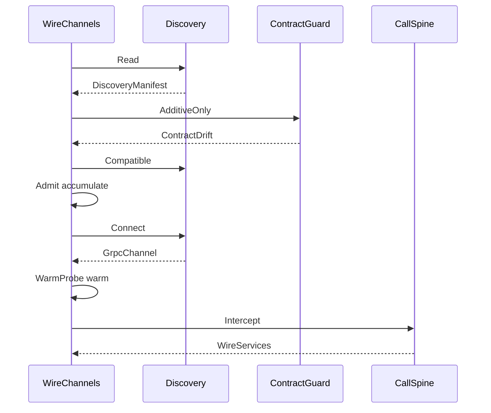

# [COMPUTE_CHANNELS]

Rasm.Compute owns the gRPC channel MECHANICS the suite wire moves over: the `RemoteTransport` dial axis warmed through its row's own `WarmProbe` and observed as typed connectivity transitions where the channel reports them, the canonical `GrpcChannelPolicy` every `GrpcChannelOptions` site reads, the per-call credential and encoding policy one interceptor stamps, and the 64 KiB `FrameEdge` artifact frame law over the frozen `ArtifactFrame` descriptor. One identity regime holds the page: a dialed channel, the calls that cross it, and the framed bytes those calls carry.

`Runtime/wire` owns the wire CONTRACT — proto vocabulary, contract evolution, fault projection, the TS posture — so this page owns how bytes MOVE and that page owns what they SAY, joined by prose anchor rather than a cross-split fence import (`RpcEdge.Rpc` folds a raised `RpcException` through the `Runtime/wire#FAULT_PROJECTION` `WireFault.Classify` arm by reference). `Runtime/ingest` owns the broker and REST ingest legs and composes `CallSpine.AwaitedHttp` from here; `Runtime/observation` owns the durable sensor lane. Channel policy values arrive settled on `GrpcChannelPolicy.Canonical`; discovery, retry ownership, deadline rows, correlation, degradation, and receipt sinks compose from the AppHost spine. Package spine: Google.Protobuf, Grpc.Core.Api, Grpc.Net.Client, Grpc.Net.Client.Web, Grpc.Net.Common, Microsoft.IO.RecyclableMemoryStream, CommunityToolkit.HighPerformance, System.IO.Hashing, Mapperly, Thinktecture.Runtime.Extensions, LanguageExt.Core, and NodaTime.

## [01]-[INDEX]

- [02]-[TRANSPORT_AXIS]: five transport rows under the canonical `GrpcChannelPolicy` tuning owner — RID-gated HTTP/3-forward posture, channel warm-up, typed connectivity fold, grpc-web binary framing, and the three-column dial admission.
- [03]-[CALL_POLICY]: five credential rows and three compression rows behind one stamping interceptor reading the `DeadlineClass.HopTotal` row's own bound.
- [04]-[ARTIFACT_FRAMES]: `FrameEdge` fixes the 64 KiB frame law over the descriptor's own `uint64` extents — `Crc32`, whole-artifact kernel `ContentHash`, zero-alloc buffer fast path, reassembly, mask-driven partial update, transaction choreography.

## [02]-[TRANSPORT_AXIS]

- Owner: `RemoteTransport` `[SmartEnum<string>]` rows with streaming, credential, affinity, warm-probe, and dial columns; `GrpcChannelPolicy` the canonical channel-tuning record centralizing send/receive caps, reconnect backoff, pooled-idle, keepalive, multiplexing, and the HTTP-version posture so a single literal-free policy value seeds every `GrpcChannelOptions` site; `HttpVersionPosture` `[Union]` the two-case HTTP-version family resolving the BCL `HttpVersion`/`HttpVersionPolicy` channel-option pair from the host QUIC verdict; `StreamShape` and `NodeSelection` row vocabularies; `EndpointLoad` the measured-or-absent load reading `NodeSelection.LeastLoaded` ranks on; `WireTransition` `[Union]` the typed prior→next connectivity-transition family carrying its own absorbing column; `WarmProbe` `[SmartEnum<string>]` the two-row warm-and-observe family every transport row seats; `ComputeEndpoint` endpoint identity record carrying the call shapes its composition intends; `RpcEdge` the ONE `RpcException` classifier this package's rails funnel through; `WireChannels` — attach, open, warm-through-the-row's-probe, observe, redial.
- Cases: Http2; Http3 (the QUIC byte path admitting unary/server/client/duplex over TLS only, dial-gated on `HttpVersionPosture.QuicCapable` so the row exists on every host but faults Excluded where `QuicConnection.IsSupported` answers false); GrpcWeb (unary and server-stream only, `GrpcWebMode.GrpcWeb` binary — the text mode is the rejected google-client-only spelling); UnixDomainSocket (discovery manifest consumption, peer-credential law, and the 0700 bind directory that IS the grant surface); InProcess (the composition-supplied `HttpMessageHandler` factory on `ComputeEndpoint.Handler`, dialing `GrpcChannel.ForAddress` against an in-host pipeline with no socket — the row names no handler source, so the proof estate binds `Microsoft.AspNetCore.TestHost` `TestServer.CreateHandler` onto that seam and a production in-host root binds its own).
- Entry: `Open(ComputeEndpoint endpoint, CallSpine spine)` — `IO<Fin<WireServices>>`. Admission ACCUMULATES three independent columns through the `Validation` applicative before one `ToFin` widen — credential-row membership, every intended `StreamShape` the row carries, and a client certificate present wherever the row's credential asserts `MutualAuth` — so a browser endpoint asking for duplex and an mTLS endpoint carrying no certificate report TOGETHER rather than one hiding the other. `NodeSelection.Select` ranks the admitted endpoint roster by rotation, validated load, or warm-fingerprint tier through one total row dispatch.
- Law: warm is universal and its MECHANISM is row data. `Open` warms every row before the first deadline-bearing call so connection latency never lands inside a budget; a cold channel dialed without the warm leg is the deleted form. Connectivity tracking is the mechanism only where the channel dials its own `SocketsHttpHandler`, because `ConnectAsync`, `State`, and `WaitForStateChangedAsync` all throw `InvalidOperationException` on a channel whose handler carries a `ConnectCallback` or arrives from the composition — the UDS, InProcess, and GrpcWeb rows are all that class, so they seat `WarmProbe.RoundTrip` and warm through one throwaway `grpc.health.v1` `Check`, and `Observe` answers unit on them rather than throwing. A `warms: false` skip and a bare `Observe` reachable on a handler-supplied row are the two deleted forms of one defect: the first pays connection latency inside the first budget, the second throws where a receipt was expected.
- Law: the round-trip probe CLASSIFIES its own refusal rather than swallowing it. `WireFault.Classify` is this estate's one `RpcException` reader, so a probe whose status classifies `Unreachable` proves the channel did NOT warm and rails, while every other arm — `Unimplemented` included — proves the round trip exactly as `Serving` does. NAMED LOSS: the discarded-status form was one line shorter. Witness: under the swallow an `Unavailable` and an `Unimplemented` erased alike and the caller was told a cold channel was warm.
- Law: channel pooling rides one `GrpcChannel` per `ComputeEndpoint` (`PooledConnectionIdleTimeout` Infinite, multiplexed) reused across redials until the storeEpoch re-handshake replaces it — a per-call channel is the deleted form. `DisableResolverServiceConfig` stays true and `GrpcChannelOptions.ServiceConfig` is never set, so a resolver-supplied service config can never override the root-declared no-retry posture and the whole retry/hedging/load-balancing config surface stays unadmitted. AppHost remains the one hop retry owner.
- Law: a redial ACQUIRES before it releases. The stale capsule disposes on the success arm alone, because a failed re-handshake leaves the caller a channel that still works and a disposed capsule beside a `Fail` is a caller holding nothing. NAMED LOSS: a redial that succeeds and then faults at composition leaks one capsule until its finalizer runs. Witness: the prior order disposed first, so every transient manifest miss cost the caller its live channel.
- Law: the UDS grant surface is the BIND DIRECTORY, never the socket file — the runtime exposes no chmod on a bound `UnixDomainSocketEndPoint`, so the 0700 parent directory is the whole access control and a per-socket permission call is a member that does not exist. A bind onto an existing path fails, so boot UNLINKS a stale socket before binding, under an exclusive advisory guard alone: unlink-then-bind is a real race two live hosts lose together, an `O_EXCL` sentinel or a lock file beside the socket serializes the pair, and an unguarded unlink is the deleted form that lets a second host delete a socket the first is already serving.
- Auto: the `ConnectivityState` fold projects `Idle`/`Connecting`/`Ready`/`TransientFailure`/`Shutdown` into typed `WireTransition` prior→next rows, and an unrecognized foreign state lands `Unknown` carrying the observed value rather than re-labelling itself a real state a recovery would act on. Pump termination is a TYPE fact: `Closed` publishes `Absorbing`, the pump reads that column, and a re-pump past the channel's absorbing state — which parks forever on a `WaitForStateChangedAsync` no channel can satisfy — is unspellable rather than comment-guarded.
- Receipt: channel-state transitions and redial evidence emit through `ReceiptSinkPort.Send` keyed by the endpoint correlation, the transition's own `Label` the rendered fact; a round-trip row emits dial and redial evidence alone because its channel reports no state; storeEpoch drift after redial is its own evidence row.
- Packages: Grpc.Core.Api (`CallInvoker`, `ChannelCredentials`, `Metadata`, `RpcException`), Grpc.Net.Client, Grpc.Net.Client.Web, Thinktecture.Runtime.Extensions, LanguageExt.Core, Rasm.AppHost (project — `HopFault`, `DeadlineClass`, `ClockPolicy`), BCL inbox (`System.Net.Http.HttpClient`/`HttpVersion`/`HttpVersionPolicy`, `System.Net.Security.SslClientAuthenticationOptions`, `System.Security.Cryptography.X509Certificates.X509Certificate2`/`X509CertificateCollection`, `System.Net.Quic.QuicConnection`)
- Growth: one row absorbs a new byte path, and a byte path a host admits later enters carrying its own security law; one `HttpVersionPosture` case absorbs a new version negotiation posture; one `NodeSelection` row absorbs a new farm strategy; one `WireTransition` case absorbs a new connectivity-state pairing; one `WarmProbe` row absorbs a new warm mechanism and every transport row seats it by name; zero new surface.
- Boundary: `GrpcChannelPolicy` is the canonical channel-tuning owner and `WireChannels` the named boundary capsule consuming it — keepalive, pooled-idle, multiplexing, reconnect-backoff, the HTTP-version posture, and the send/receive caps read from `GrpcChannelPolicy.Canonical` and are never re-declared. `KeepAlivePingDelay`/`KeepAlivePingTimeout`/`EnableMultipleHttp2Connections` and `KeepAlivePingPolicy = HttpKeepAlivePingPolicy.WithActiveRequests` are BCL `SocketsHttpHandler` members, not `Grpc.Net.Client`, so idle-pool connections never burn pings without an in-flight request and a redeclared gRPC-package keepalive member is the deleted form. HTTP-version selection is the `HttpVersion`/`HttpVersionPolicy` `GrpcChannelOptions` pair projected from `GrpcChannelPolicy.Canonical.Version.Wire`, self-resolved through `HttpVersionPosture.ForHost` over the ONE `QuicCapable` predicate — a static OS carve beside it restates the verdict in a second alphabet and drifts the moment a platform ships the asset; a per-call version knob, a handler-level `GrpcWebHandler.HttpVersion` override, and a forced `Version30` on a QUIC-absent host are the deleted forms. Client-side HTTP/2 flow-control windows are the app-root Kestrel `Http2Limits` SERVER leg, so the only client stream knob here is `EnableMultipleHttp2Connections`. ArtifactSyncService bidi and CaptureEvents client-stream are structurally excluded on the GrpcWeb row and the `Needs` accumulate refuses that endpoint at admission rather than at the first call; reconnect on UnixDomainSocket is redial-only with the storeEpoch re-handshake; a failed attach folds to the LocalOnly consequence, substrate predicates reading the retained Capability set rather than a second health probe. `NodeSelection.ModelWarmupAffinity` populates the endpoint affinity column from the warm-start session fingerprint so a cold companion routes to the node holding the matching EP-context blob — this endpoint affinity is the single warm-start column `SubstrateSelection.Plan` reads, never a second affinity notion parallel to endpoint identity, never a rank override, never a `ServiceConfig` load-balancing policy. Absence in the load reading is a TIER, not a magnitude: an unmeasured endpoint ranks below every measured one and orders by rotation inside its tier, where the prior `double.PositiveInfinity` fill made every unmeasured roster tie at one score and silently collapsed `LeastLoaded` onto "always the first endpoint". [SPIKE]: dialing this axis from inside the live integrated-host ALC converges on running-plugin evidence alone; the deterministic floor is the landed row set, the `WarmProbe` mechanism law, and the redial fold, each standing without it.

```csharp signature
// --- [TYPES] ----------------------------------------------------------------------------
[Union(ConversionFromValue = ConversionOperatorsGeneration.None)]
public abstract partial record HttpVersionPosture {
    private HttpVersionPosture() { }

    public sealed record Http2Default : HttpVersionPosture;
    public sealed record Http3Forward : HttpVersionPosture;

    // ONE predicate gates the posture AND the `Http3` dial. `IsSupported` probes the resolved msquic asset at
    // runtime: the runtime ships it in-box on win-x64/win-arm64 alone, a linux host answers true only where the
    // distro's own libmsquic is installed, and a darwin host answers FALSE on every arch. The probe also tests
    // IPv6 FIRST, so an IPv6-disabled host answers false with the asset present — the verdict is the host's whole
    // QUIC posture, stack and asset together, which is precisely what a static RID table gets wrong.
    public static readonly bool QuicCapable = QuicConnection.IsSupported && !OperatingSystem.IsBrowser();

    public static HttpVersionPosture ForHost() => QuicCapable ? new Http3Forward() : new Http2Default();

    public (Version Version, HttpVersionPolicy Policy) Wire => Switch(
        http2Default: static _ => (HttpVersion.Version20, HttpVersionPolicy.RequestVersionExact),
        http3Forward: static _ => (HttpVersion.Version30, HttpVersionPolicy.RequestVersionOrHigher));
}

[SmartEnum]
public sealed partial class StreamShape {
    public static readonly StreamShape Unary = new();
    public static readonly StreamShape ServerStream = new();
    public static readonly StreamShape ClientStream = new();
    public static readonly StreamShape Bidi = new();
}

// `Absorbing` is a ROW column rather than a caller's `is Shutdown` test: the pump's termination is then a type
// fact, and a second observer that forgets the test cannot park forever on a state change no channel will send.
// `Unknown` carries the OBSERVED value because the source enum is foreign and grows outside this package — the
// prior catch-all folded an unrecognized state onto `Idle`, a real state a recovery arm acts on.
[Union(ConversionFromValue = ConversionOperatorsGeneration.None)]
public abstract partial record WireTransition {
    private WireTransition() { }

    public sealed record Connecting(ConnectivityState Prior) : WireTransition;
    public sealed record Ready(ConnectivityState Prior) : WireTransition;
    public sealed record Degraded(ConnectivityState Prior) : WireTransition;
    public sealed record Closed(ConnectivityState Prior) : WireTransition;
    public sealed record Idle(ConnectivityState Prior) : WireTransition;
    public sealed record Unknown(ConnectivityState Prior, ConnectivityState Observed) : WireTransition;

    public static WireTransition Of(ConnectivityState prior, ConnectivityState next) => next switch {
        ConnectivityState.Idle => new Idle(prior),
        ConnectivityState.Connecting => new Connecting(prior),
        ConnectivityState.Ready => new Ready(prior),
        ConnectivityState.TransientFailure => new Degraded(prior),
        ConnectivityState.Shutdown => new Closed(prior),
        _ => new Unknown(prior, next),
    };

    public bool Absorbing => this is Closed;

    public string Label => Switch(
        connecting: static c => $"<connecting:{c.Prior}>",
        ready: static r => $"<ready:{r.Prior}>",
        degraded: static d => $"<transient-failure:{d.Prior}>",
        closed: static s => $"<shutdown:{s.Prior}>",
        idle: static i => $"<idle:{i.Prior}>",
        unknown: static u => $"<unknown:{u.Prior}:{u.Observed}>");
}

// --- [CONSTANTS] ------------------------------------------------------------------------
public sealed record GrpcChannelPolicy(
    TimeSpan PooledConnectionIdle,
    TimeSpan KeepAlivePingDelay,
    TimeSpan KeepAlivePingTimeout,
    bool EnableMultipleHttp2Connections,
    int MaxSendBytes,
    int MaxReceiveBytes,
    TimeSpan InitialReconnectBackoff,
    TimeSpan MaxReconnectBackoff,
    HttpVersionPosture Version) {
    public static readonly GrpcChannelPolicy Canonical = new(
        PooledConnectionIdle: Timeout.InfiniteTimeSpan,
        KeepAlivePingDelay: TimeSpan.FromSeconds(60),
        KeepAlivePingTimeout: TimeSpan.FromSeconds(30),
        EnableMultipleHttp2Connections: true,
        MaxSendBytes: 4 * 1024 * 1024,
        MaxReceiveBytes: 4 * 1024 * 1024,
        InitialReconnectBackoff: TimeSpan.FromSeconds(1),
        MaxReconnectBackoff: TimeSpan.FromSeconds(120),
        Version: HttpVersionPosture.ForHost());
}

// --- [MODELS] ---------------------------------------------------------------------------
// `Needs` states the call shapes the composition intends over this endpoint, so the `Streams` column on the row
// is CONSUMED at admission instead of decorating it: a browser endpoint asking for duplex refuses where it is
// dialed rather than at the first `AsyncDuplexStreamingCall` that lands an opaque `Unimplemented`.
public sealed record ComputeEndpoint(
    Uri Address, RemoteTransport Transport, CredentialPolicy Credential, CorrelationId Correlation,
    Seq<StreamShape> Needs = default,
    Option<DiscoveryManifest> Peer = default, Option<string> WarmFingerprint = default, Option<Func<HttpMessageHandler>> Handler = default,
    Seq<AsyncAuthInterceptor> Mints = default, Option<X509Certificate2> ClientCertificate = default);

// A load reading is MEASURED or ABSENT and the two never share a scale. An absent reading previously filled as
// `double.PositiveInfinity`, which made every unmeasured endpoint compare equal and collapsed `LeastLoaded` onto
// the roster's first element for the whole window before any measurer bound.
public readonly record struct EndpointLoad(HashMap<Uri, double> Measured) {
    public static readonly EndpointLoad Unmeasured = new(HashMap<Uri, double>());

    public Option<double> At(Uri address) =>
        Measured.Find(address).Filter(static value => double.IsFinite(value) && value >= 0d);
}

// --- [SERVICES] -------------------------------------------------------------------------
// ONE inbound funnel for the package's foreign gRPC boundary: a raised `RpcException` reaches the rail through
// `WireFault.Classify` with the original error retained as its cause, and every other raised error passes through
// unchanged, so no rail site spells its own per-status branch or erases captured transport evidence.
public static class RpcEdge {
    public static Error Rpc(Error raised) =>
        raised.Exception.Bind(static held => held is RpcException call ? Some(call) : None)
            .Match(
                Some: call => WireFault.Decode(call, raised).Match(
                    Succ: decoded => decoded.Match(
                        Some: static fault => (Error)fault,
                        None: () => (Error)WireFault.Classify(call, raised)),
                    Fail: static fault => fault),
                None: () => raised);
}

// Warm and observe are ONE capability under ONE precondition, so they ride ONE row rather than a bool column and
// a second unguarded member. `ConnectAsync`, `State`, and `WaitForStateChangedAsync` read the channel's OWN
// `SocketsHttpHandler` dial: a handler carrying a `ConnectCallback` (UDS), a caller-supplied handler (InProcess),
// and a wrapping web handler (GrpcWeb) each put the channel outside that dial, and EVERY member of the
// connectivity family throws `InvalidOperationException` there.
[SmartEnum<string>]
[KeyMemberEqualityComparer<ComparerAccessors.StringOrdinal, string>]
[KeyMemberComparer<ComparerAccessors.StringOrdinal, string>]
public sealed partial class WarmProbe {
    private static readonly Op WarmEdge = Op.Of(name: "wire.warm");

    public static readonly WarmProbe Connectivity = new("connectivity", observable: true, warm: static services =>
        IO.liftAsync(async envIO => await WarmEdge.Catch(
            async token => {
                await services.Channel.ConnectAsync(token).ConfigureAwait(false);
                return Fin.Succ(services);
            },
            envIO.Token).ConfigureAwait(false)));

    // The health round trip pays the connection latency the state machine rendered for the other rows. Its STATUS
    // is classified, never discarded: an `Unimplemented` proves the connection exactly as `Serving` does, while a
    // classified `Unreachable` is the one outcome the probe exists to detect and rails as a cold channel.
    public static readonly WarmProbe RoundTrip = new("round-trip", observable: false, warm: static services =>
        IO.liftAsync(async envIO => {
            Fin<HealthCheckResponse> outcome = (await WarmEdge.Catch(
                async token => Fin.Succ(await services.Health.CheckAsync(
                    new HealthCheckRequest(), cancellationToken: token).ResponseAsync.ConfigureAwait(false)),
                envIO.Token).ConfigureAwait(false)).MapFail(RpcEdge.Rpc);
            return outcome.Match(
                Succ: _ => Fin.Succ(services),
                Fail: error => error is WireFault.Unreachable
                    ? Fin.Fail<WireServices>(error)
                    : Fin.Succ(services));
        }));

    public Func<WireServices, IO<Fin<WireServices>>> Warm { get; }

    // A round-trip row reports no `ConnectivityState`, so `Observe` is a no-op there and the receipt carries dial
    // and redial evidence alone rather than a transition the channel structurally cannot answer.
    public bool Observable { get; }
}

// --- [TABLES] ---------------------------------------------------------------------------
[SmartEnum<string>]
[KeyMemberEqualityComparer<ComparerAccessors.StringOrdinal, string>]
[KeyMemberComparer<ComparerAccessors.StringOrdinal, string>]
public sealed partial class RemoteTransport {
    public static readonly RemoteTransport Http2 = new("http2", streams: [StreamShape.Unary, StreamShape.ServerStream, StreamShape.ClientStream, StreamShape.Bidi], credentials: Seq(CredentialPolicy.Tls, CredentialPolicy.Mtls, CredentialPolicy.Bearer, CredentialPolicy.Composed), affinity: true, probe: WarmProbe.Connectivity, dial: static endpoint => Fin.Succ(GrpcChannel.ForAddress(endpoint.Address, WireChannels.Canonical(endpoint))));
    public static readonly RemoteTransport Http3 = new("http3", streams: [StreamShape.Unary, StreamShape.ServerStream, StreamShape.ClientStream, StreamShape.Bidi], credentials: Seq(CredentialPolicy.Tls, CredentialPolicy.Mtls, CredentialPolicy.Composed), affinity: true, probe: WarmProbe.Connectivity, dial: static endpoint => HttpVersionPosture.QuicCapable ? Fin.Succ(GrpcChannel.ForAddress(endpoint.Address, WireChannels.Canonical(endpoint))) : Fin.Fail<GrpcChannel>(new HopFault.Excluded(nameof(Http3))));
    public static readonly RemoteTransport GrpcWeb = new("grpc-web", streams: [StreamShape.Unary, StreamShape.ServerStream], credentials: Seq(CredentialPolicy.Bearer, CredentialPolicy.Tls), affinity: false, probe: WarmProbe.RoundTrip, dial: static endpoint => Fin.Succ(GrpcChannel.ForAddress(endpoint.Address, WireChannels.Web(endpoint))));
    public static readonly RemoteTransport UnixDomainSocket = new("uds", streams: [StreamShape.Unary, StreamShape.ServerStream, StreamShape.ClientStream, StreamShape.Bidi], credentials: Seq(CredentialPolicy.InsecureLoopback), affinity: false, probe: WarmProbe.RoundTrip, dial: static endpoint => endpoint.Peer.ToFin(new HopFault.StaleManifest(endpoint.Address.AbsoluteUri)).Map(static peer => Discovery.Connect(peer, GrpcChannelPolicy.Canonical)));
    public static readonly RemoteTransport InProcess = new("in-process", streams: [StreamShape.Unary, StreamShape.ServerStream, StreamShape.ClientStream, StreamShape.Bidi], credentials: Seq(CredentialPolicy.InsecureLoopback), affinity: false, probe: WarmProbe.RoundTrip, dial: static endpoint => endpoint.Handler.ToFin(new HopFault.Excluded(nameof(InProcess))).Map(static handler => GrpcChannel.ForAddress(endpoint.Address, new GrpcChannelOptions { HttpHandler = handler() })));

    public Seq<StreamShape> Streams { get; }
    public Seq<CredentialPolicy> Credentials { get; }
    public bool Affinity { get; }
    public WarmProbe Probe { get; }
    public Func<ComputeEndpoint, Fin<GrpcChannel>> Dial { get; }

    public bool Carries(StreamShape shape) => Streams.Contains(shape);

    public Seq<StreamShape> Uncarried(Seq<StreamShape> needs) => needs.Filter(shape => !Carries(shape));
}

[SmartEnum]
public sealed partial class NodeSelection {
    public static readonly NodeSelection RoundRobin = new();
    public static readonly NodeSelection LeastLoaded = new();
    public static readonly NodeSelection ModelWarmupAffinity = new();

    public Fin<ComputeEndpoint> Select(Seq<ComputeEndpoint> endpoints, EndpointLoad loads, int rotation) =>
        endpoints.IsEmpty
            // An empty roster is a COMPOSITION fact, so it lands a terminal arm: the transient
            // `EndpointUnreachable` it carried before invited the re-drive rail to re-select against a roster
            // that answers empty forever.
            ? Fin.Fail<ComputeEndpoint>(new ComputeFault.Violation(ComputeArea.Runtime, new ComputeViolation.Required(ComputeSubject.Input)))
            : Fin.Succ(toSeq(endpoints.Zip(Enumerable.Range(0, endpoints.Count)))
                .Map(candidate => (Endpoint: candidate.First, Score: Score(candidate.First, candidate.Second, endpoints.Count, rotation, loads)))
                .OrderBy(static ranked => ranked.Score.Tier)
                .ThenBy(static ranked => ranked.Score.Load)
                .ThenBy(static ranked => ranked.Score.Rotation)
                .First().Endpoint);

    // Tier is the DISCRIMINANT and load the ordering inside it, so an unmeasured endpoint never compares against a
    // measured magnitude and a wholly unmeasured roster degrades to the rotation ordering rather than to arrival
    // order — the failure mode a shared infinite sentinel produced silently.
    private (int Tier, double Load, int Rotation) Score(
        ComputeEndpoint endpoint, int ordinal, int count, int rotation, EndpointLoad loads) {
        int turn = (int)((((long)ordinal - rotation) % count + count) % count);
        return Switch(
            state: (Endpoint: endpoint, Turn: turn, Load: loads.At(endpoint.Address)),
            roundRobin: static state => (0, 0d, state.Turn),
            leastLoaded: static state => state.Load.Match(
                Some: measured => (0, measured, state.Turn),
                None: () => (1, 0d, state.Turn)),
            modelWarmupAffinity: static state => (
                state.Endpoint.WarmFingerprint.IsSome ? 0 : 1,
                state.Load.IfNone(0d),
                state.Turn));
    }
}

// --- [BOUNDARIES] -----------------------------------------------------------------------
public static class WireChannels {
    public static GrpcChannelOptions Canonical(ComputeEndpoint endpoint) => new() {
        Credentials = endpoint.Credential.Channel(endpoint.Mints),
        CompressionProviders = CompressionProviders.Register,
        MaxSendMessageSize = GrpcChannelPolicy.Canonical.MaxSendBytes, MaxReceiveMessageSize = GrpcChannelPolicy.Canonical.MaxReceiveBytes,
        DisableResolverServiceConfig = true,
        InitialReconnectBackoff = GrpcChannelPolicy.Canonical.InitialReconnectBackoff,
        MaxReconnectBackoff = GrpcChannelPolicy.Canonical.MaxReconnectBackoff,
        HttpVersion = GrpcChannelPolicy.Canonical.Version.Wire.Version, HttpVersionPolicy = GrpcChannelPolicy.Canonical.Version.Wire.Policy,
        HttpHandler = new SocketsHttpHandler {
            PooledConnectionIdleTimeout = GrpcChannelPolicy.Canonical.PooledConnectionIdle,
            KeepAlivePingDelay = GrpcChannelPolicy.Canonical.KeepAlivePingDelay,
            KeepAlivePingTimeout = GrpcChannelPolicy.Canonical.KeepAlivePingTimeout,
            KeepAlivePingPolicy = HttpKeepAlivePingPolicy.WithActiveRequests,
            EnableMultipleHttp2Connections = GrpcChannelPolicy.Canonical.EnableMultipleHttp2Connections,
            // Absence rides the Option to an EMPTY collection, never to `null`: the admission below already
            // refused an `Mtls` endpoint carrying no certificate, so the None arm here is the non-mutual row.
            SslOptions = {
                ClientCertificates = endpoint.ClientCertificate.Match(
                    Some: static cert => new X509CertificateCollection { cert },
                    None: static () => new X509CertificateCollection()),
            },
        },
    };

    public static GrpcChannelOptions Web(ComputeEndpoint endpoint) => new() {
        Credentials = endpoint.Credential.Channel(endpoint.Mints),
        HttpVersion = HttpVersion.Version11, HttpVersionPolicy = HttpVersionPolicy.RequestVersionExact,
        MaxSendMessageSize = GrpcChannelPolicy.Canonical.MaxSendBytes, MaxReceiveMessageSize = GrpcChannelPolicy.Canonical.MaxReceiveBytes,
        HttpHandler = new GrpcWebHandler(GrpcWebMode.GrpcWeb, endpoint.Handler.IfNone(static () => new HttpClientHandler())()),
    };

    public static Fin<ComputeEndpoint> Attach(ProfileRoots roots, int pid, JsonTypeInfo<DiscoveryManifest> contract, CorrelationId correlation, string localChecksum, Func<string, string, Fin<bool>> additiveOnly) =>
        Discovery.Read(roots, pid, contract)
            .Bind(peer => Discovery.Compatible(peer, localChecksum, additiveOnly))
            .Map(peer => new ComputeEndpoint(
                new UriBuilder(Uri.UriSchemeHttp, "localhost").Uri, RemoteTransport.UnixDomainSocket, CredentialPolicy.InsecureLoopback,
                correlation, Needs: Seq(StreamShape.Unary, StreamShape.ServerStream, StreamShape.ClientStream, StreamShape.Bidi), Peer: peer));

    // The handler factory is a composition-supplied port value, so this package names no in-host server type: the
    // proof estate binds `TestServer.CreateHandler` onto it and a production in-host root binds its own.
    public static ComputeEndpoint InMemory(Func<HttpMessageHandler> handler, CorrelationId correlation, Seq<StreamShape> needs) =>
        new(new UriBuilder(Uri.UriSchemeHttp, "localhost").Uri, RemoteTransport.InProcess, CredentialPolicy.InsecureLoopback,
            correlation, Needs: needs, Handler: Some(handler));

    public static ComputeEndpoint WarmAffinity(ComputeEndpoint endpoint, FrozenSet<string> nodeWarmBlobs, string warmStartFingerprint) =>
        endpoint.Transport.Affinity && nodeWarmBlobs.Contains(warmStartFingerprint)
            ? endpoint with { WarmFingerprint = Some(warmStartFingerprint) }
            : endpoint;

    // Three INDEPENDENT columns, so the applicative accumulates and one `ToFin` widens: a browser endpoint asking
    // for duplex under an unadmitted credential reports both, where a `Fin` chain reported whichever gate the
    // author happened to write first and hid the rest until the next dial.
    public static Fin<ComputeEndpoint> Admit(ComputeEndpoint endpoint) =>
        (Credentialed(endpoint), Shaped(endpoint), Certified(endpoint))
            .Apply((_, _, _) => endpoint)
            .As().ToFin();

    private static Validation<Error, Unit> Credentialed(ComputeEndpoint endpoint) =>
        endpoint.Transport.Credentials.Contains(endpoint.Credential)
            ? Validation<Error, Unit>.Success(unit)
            : Validation<Error, Unit>.Fail(new HopFault.Excluded($"<credential-unadmitted:{endpoint.Transport.Key}:{endpoint.Credential.Key}>"));

    private static Validation<Error, Unit> Shaped(ComputeEndpoint endpoint) =>
        endpoint.Transport.Uncarried(endpoint.Needs) is { IsEmpty: false } missing
            ? Validation<Error, Unit>.Fail(new HopFault.Excluded($"<shape-uncarried:{endpoint.Transport.Key}:{missing.Count}>"))
            : Validation<Error, Unit>.Success(unit);

    private static Validation<Error, Unit> Certified(ComputeEndpoint endpoint) =>
        !endpoint.Credential.MutualAuth || endpoint.ClientCertificate.IsSome
            ? Validation<Error, Unit>.Success(unit)
            : Validation<Error, Unit>.Fail(new HopFault.Excluded($"<mutual-auth-uncertified:{endpoint.Address.AbsoluteUri}>"));

    // The clients mint BEFORE the warm leg because the round-trip probe dials through the intercepted invoker it
    // needs; the connectivity probe reads the same capsule's `Channel`, so one order serves both rows.
    public static IO<Fin<WireServices>> Open(ComputeEndpoint endpoint, CallSpine spine) =>
        Admit(endpoint).Bind(admitted => admitted.Transport.Dial(admitted)).Match(
            Succ: channel => endpoint.Transport.Probe
                .Warm(WireServices.Of(channel.CreateCallInvoker().Intercept(spine), channel)),
            Fail: error => IO.pure(Fin.Fail<WireServices>(error)));

    public static IO<Unit> Observe(ComputeEndpoint endpoint, GrpcChannel channel, Func<WireTransition, IO<Unit>> record) =>
        endpoint.Transport.Probe.Observable ? Pump(channel, channel.State, record) : IO.pure(unit);

    // ACQUIRE-then-RELEASE: the stale capsule is disposed on the success arm alone, so a transient manifest miss
    // leaves the caller the working channel it already had instead of a disposed capsule beside a `Fail`.
    public static IO<Fin<WireServices>> Redial(ComputeEndpoint endpoint, WireServices stale, CallSpine spine, Func<DiscoveryManifest, Fin<DiscoveryManifest>> rehandshake) =>
        endpoint.Peer.ToFin(new HopFault.StaleManifest(endpoint.Address.AbsoluteUri))
            .Bind(rehandshake)
            .Match(
                Succ: peer => Open(endpoint with { Peer = peer }, spine)
                    .Bind(opened => opened.Match(
                        Succ: _ => IO.lift(fun(stale.Dispose)).Map(_ => opened),
                        Fail: _ => IO.pure(opened))),
                Fail: error => IO.pure(Fin.Fail<WireServices>(error)));

    // Termination reads the transition's own `Absorbing` column, so the recursion stops where the family says the
    // channel stops rather than where a comment says a caller must remember to.
    private static IO<Unit> Pump(GrpcChannel channel, ConnectivityState prior, Func<WireTransition, IO<Unit>> record) =>
        IO.liftAsync(async () => { await channel.WaitForStateChangedAsync(prior).ConfigureAwait(false); return channel.State; })
            .Bind(next => record(WireTransition.Of(prior, next)).Map(_ => WireTransition.Of(prior, next)))
            .Bind(transition => transition.Absorbing
                ? IO.pure(unit)
                : Pump(channel, channel.State, record));
}
```


```mermaid
sequenceDiagram
    accTitle: Wire channel discovery, contract guard, and call-spine interception
    accDescr: Wire channels read the discovery manifest, prove additive-only contract compatibility, accumulate the three admission columns, connect a warmed channel, and intercept the call spine.
    participant WireChannels
    participant Discovery
    participant ContractGuard
    participant CallSpine
    WireChannels->>Discovery: Read
    Discovery-->>WireChannels: DiscoveryManifest
    WireChannels->>ContractGuard: AdditiveOnly
    ContractGuard-->>WireChannels: ContractDrift
    WireChannels->>Discovery: Compatible
    WireChannels->>WireChannels: Admit accumulate
    WireChannels->>Discovery: Connect
    Discovery-->>WireChannels: GrpcChannel
    WireChannels->>WireChannels: WarmProbe warm
    WireChannels->>CallSpine: Intercept
    CallSpine-->>WireChannels: WireServices
```

## [03]-[CALL_POLICY]

- Owner: `CredentialPolicy` `[SmartEnum<string>]` rows projecting `ChannelCredentials` and minting per-call identity through `AsyncAuthInterceptor`; `CompressionProviders` `[SmartEnum<string>]` the claim-gated encoding axis projecting inbox `ICompressionProvider` rows; `CallSpine` — the one client interceptor stamping correlation, the `DeadlineClass.HopTotal` budget, and the per-call compression and credential edges across all five client call shapes, plus the deadline, payload, and awaited-fault edges; the distributed-trace carrier is stamped by the spine's own propagation owner through `TraceContext.Inject`, never by a key this interceptor spells.
- Cases: InsecureLoopback (UnixDomainSocket-scoped), Tls, Mtls (the `MutualAuth` row whose `ComputeEndpoint.ClientCertificate` threads onto the handler `SslOptions.ClientCertificates` so the channel presents a client certificate at the TLS layer while `Channel` stays `ChannelCredentials.SecureSsl`), Bearer (browser; per-call token minted through `CallCredentials.FromInterceptor(AsyncAuthInterceptor)` reading the `AuthInterceptorContext.ServiceUrl`/`MethodName` and composed onto the channel through `ChannelCredentials.Create`), Composed (farm node dialing a hub; ≥2 per-call identity mints stacked through `CallCredentials.Compose(params CallCredentials[])` and bound to the TLS channel through `ChannelCredentials.Create`, a single-mint sequence collapsing to the bare `FromInterceptor` bind and an empty sequence to the plain `SecureSsl` channel). `CompressionProviders` rows: Identity (the default no-op `"identity"` accept-encoding), Gzip (`GzipCompressionProvider`), Deflate (`DeflateCompressionProvider` wrapping `ZLibStream` for zlib framing). `CallSpine` interceptor overrides: `BlockingUnaryCall`, `AsyncUnaryCall`, `AsyncServerStreamingCall`, `AsyncClientStreamingCall`, `AsyncDuplexStreamingCall` — the full `Grpc.Core.Interceptors.Interceptor` client family, one `Stamped` projection feeding every shape.
- Entry: `Options(AdmittedIntent intent, CancellationToken token)` projects the admitted deadline onto `CallOptions`; `Bounded` checks `CalculateSize` before serialization; token-aware `Awaited(Func<Task<T>>, CancellationToken)` captures through `Op.Catch` before folding a raised `RpcException` through `RpcEdge.Rpc`; `AwaitedHttp` owns the same budget and linked token for the REST leg `Runtime/ingest#REST_INGEST` composes; `WithIdentity` binds a fresh per-call credential.
- Law: the hop budget is the ROW's own bound. `DeadlineClass.HopTotal` carries `Bound` as the gauge lane it declares, so a `Func<DeadlineClass, TimeSpan> allotted` parameter reconstructs from the row it is handed and is the knob the removal test deletes. NAMED LOSS: a composition can no longer widen one call's budget without a row edit. Witness: two call sites resolving one deadline through two supplied delegates could disagree about `hop-total` while both read correct in isolation.
- Law: temporal capability arrives as the one `ClockPolicy` record. The semantic instant the deadline projects from is NodaTime's `IClock`, the elapsed evidence is the kernel `MonotonicTimeline` this record already minted off the provider at the app root, and a raw `TimeProvider.GetTimestamp`/`GetElapsedTime` pair below that root is the deleted form because a second timeline's stamps order against nothing the first produced.
- Law: cancellation and expiry are DISTINCT refusals. gRPC status maps `Cancelled` and `DeadlineExceeded` separately; the REST leg keeps a dedicated budget source beside caller/runtime cancellation, so only the budget-only trip refines captured `KernelFault.Cancelled` into cause-bearing `WireFault.DeadlineExpired`. NAMED LOSS: one arm became three. Witness: the single-arm form reported a user cancel as a deadline expiry, which is the one classification the re-drive rail reads in reverse.
- Auto: every generated stub call crosses the interceptor — correlation metadata, the injected W3C carrier, the budgeted deadline, and per-call receipt capture stamp without hand-threaded Metadata; the same `Stamped` projection runs for blocking unary, async unary, server-stream, client-stream, and duplex because the four request-and-context arities all route through one context rewrite.
- Receipt: per-call route, byte sizes, deadline outcome, and negotiated encoding evidence emit through `ReceiptSinkPort.Send` at the interceptor seam.
- Packages: Grpc.Core.Api (`Interceptor`, `CallOptions`, `CallCredentials`, `AsyncAuthInterceptor`, `Metadata`, `RpcException`), Grpc.Net.Client, Grpc.Net.Common (inbox `Grpc.Net.Compression.ICompressionProvider`/`GzipCompressionProvider`/`DeflateCompressionProvider`), Google.Protobuf, Thinktecture.Runtime.Extensions, LanguageExt.Core, NodaTime, Rasm.AppHost (project — `DeadlineClass`, `ClockPolicy`, `TraceContext`), BCL inbox (`System.IO.Compression.CompressionLevel`)
- Growth: one credential row per new trust shape (Composed stacks N identity mints, never a new surface); one `CompressionProviders` row per new wire encoding; a custom zstd/brotli codec is one `CompressionProviders` row whose `Provider` returns a host-implemented `ICompressionProvider` projecting the new `EncodingName`, never a package admission; the compression flip resolves through `CompressionProviders.Winning(payloadBytes, substrate, host, claims)` which folds the `BenchmarkClaim` rows of the `wire-compression` family, matches the running `HostFingerprint` and the payload `Band`, reads the winning `Route`-keyed row, and drops the `Identity` no-op, then `CallSpine.Compressed` stamps the per-call `grpc-internal-encoding-request` metadata key with the winning `Key` against the channel-side registration `CompressionProviders.Register` materializes from the axis rows — the winning encoding is a claim-gated `Option<CompressionProviders>`, so an absent or stale claim leaves the call uncompressed and a per-call default-on knob is the deleted form; zero new surface.
- Boundary: `Options` reads the admitted `DeadlineAt`; raw deadline parameters never cross `WireDocument`. `Budgeted` applies the `DeadlineClass.HopTotal` row bound only to interceptor calls that lack admitted intent evidence. `Awaited` classifies once through the ONE `RpcEdge.Rpc` funnel, while `CredentialPolicy.Mint` creates each bearer token per call. `DisableResolverServiceConfig` excludes resolver retry, hedging, and load balancing, and AppHost remains the one hop retry owner. `grpc-internal-encoding-request` selects only a provider registered on `GrpcChannelOptions.CompressionProviders`. Propagation is the spine's seam whole: `TraceContext.Inject(Metadata)` writes every field the registered composite propagator declares, so a `traceparent` const, a `tracestate` twin, and a `Func<string>` handing this interceptor a pre-rendered header are all deleted forms — each stamps one propagator's shape at one moment and silently drops whatever the composite gains afterward. Every protocol header name this interceptor spells is a `const` beside its siblings, because a default-parameter string literal is the same coordinate spelled where no reader can find it. [SPIKE]: the `Composed` row's dial through a running plugin channel converges on live-ALC evidence alone; the deterministic floor is that row's stacked `CallCredentials.Compose` shape and its `ChannelCredentials.Create` composition seam, both settled here.

```csharp signature
// --- [TABLES] ---------------------------------------------------------------------------
[SmartEnum<string>]
[KeyMemberEqualityComparer<ComparerAccessors.StringOrdinal, string>]
[KeyMemberComparer<ComparerAccessors.StringOrdinal, string>]
public sealed partial class CredentialPolicy {
    public static readonly CredentialPolicy InsecureLoopback = new("insecure-loopback", channel: static _ => ChannelCredentials.Insecure, mutualAuth: false);
    public static readonly CredentialPolicy Tls = new("tls", channel: static _ => ChannelCredentials.SecureSsl, mutualAuth: false);
    public static readonly CredentialPolicy Mtls = new("mtls", channel: static _ => ChannelCredentials.SecureSsl, mutualAuth: true);
    public static readonly CredentialPolicy Bearer = new("bearer", mutualAuth: false, channel: static mints => mints.Head.Match(
        Some: static mint => ChannelCredentials.Create(ChannelCredentials.SecureSsl, CallCredentials.FromInterceptor(mint)),
        None: static () => ChannelCredentials.SecureSsl));
    public static readonly CredentialPolicy Composed = new("composed", mutualAuth: false, channel: static mints => mints.Match(
        Empty: static () => ChannelCredentials.SecureSsl,
        Head: static mint => ChannelCredentials.Create(ChannelCredentials.SecureSsl, CallCredentials.FromInterceptor(mint)),
        Tail: static (head, tail) => ChannelCredentials.Create(
            ChannelCredentials.SecureSsl,
            CallCredentials.Compose(head.Cons(tail).Map(CallCredentials.FromInterceptor).ToArray()))));

    public Func<Seq<AsyncAuthInterceptor>, ChannelCredentials> Channel { get; }
    public bool MutualAuth { get; }

    public static AsyncAuthInterceptor Mint(Func<AuthInterceptorContext, CancellationToken, ValueTask<string>> token) =>
        async (context, metadata) => metadata.Add(CallSpine.AuthorizationKey, $"Bearer {await token(context, context.CancellationToken).ConfigureAwait(false)}");
}

[SmartEnum<string>]
[KeyMemberEqualityComparer<ComparerAccessors.StringOrdinal, string>]
[KeyMemberComparer<ComparerAccessors.StringOrdinal, string>]
public sealed partial class CompressionProviders {
    public static readonly CompressionProviders Identity = new("identity", provider: static () => Option<ICompressionProvider>.None);
    public static readonly CompressionProviders Gzip = new("gzip", provider: static () => Some<ICompressionProvider>(new GzipCompressionProvider(CompressionLevel.Fastest)));
    public static readonly CompressionProviders Deflate = new("deflate", provider: static () => Some<ICompressionProvider>(new DeflateCompressionProvider(CompressionLevel.Fastest)));

    public Func<Option<ICompressionProvider>> Provider { get; }

    public string EncodingName => Provider().Match(Some: static p => p.EncodingName, None: static () => Key);

    public static IList<ICompressionProvider> Register => toSeq(Items).Choose(static row => row.Provider()).ToList();

    public const string ClaimFamily = "wire-compression";

    public static Option<CompressionProviders> Winning(long payloadBytes, Substrate substrate, HostFingerprint host, Seq<BenchmarkClaim> claims) =>
        claims.Find(claim =>
                claim.Family == ClaimFamily && claim.Substrate == substrate && !claim.Stale(host) &&
                claim.Input.Band == BenchmarkClaim.BandOf(payloadBytes))
            .Bind(static claim => TryGet(claim.Route, out CompressionProviders? row) && row is not null ? Some(row) : None)
            .Filter(static row => row != Identity);
}

// --- [MIDDLEWARE] -----------------------------------------------------------------------
public sealed class CallSpine(CorrelationId correlation, ClockPolicy clocks) : Interceptor {
    public const string CorrelationKey = "rasm-correlation";
    public const string RequestEncodingKey = "grpc-internal-encoding-request";
    public const string AuthorizationKey = "authorization";
    private static readonly Op GrpcAwait = Op.Of(name: "wire.grpc-await");
    private static readonly Op HttpAwait = Op.Of(name: "wire.http-await");

    public CallOptions Options(AdmittedIntent intent, CancellationToken token) =>
        new CallOptions()
            .WithDeadline(intent.DeadlineAt.ToDateTimeUtc())
            .WithCancellationToken(token);

    public static CallOptions WithIdentity(CallOptions options, AsyncAuthInterceptor mint) =>
        options.WithCredentials(CallCredentials.FromInterceptor(mint));

    public static CallOptions Compressed(CallOptions options, Option<CompressionProviders> winningEncoding) =>
        winningEncoding.Match(
            Some: encoding => options.WithHeaders(Merge(options.Headers, new Metadata { { RequestEncodingKey, encoding.Key } })),
            None: () => options);

    public static Fin<T> Bounded<T>(T message) where T : IMessage<T> {
        int bytes = message.CalculateSize();
        return bytes <= GrpcChannelPolicy.Canonical.MaxSendBytes
            ? Fin.Succ(message)
            : Fin.Fail<T>(new ComputeFault.PayloadOverBounds($"<payload-over-bounds:{bytes}:{GrpcChannelPolicy.Canonical.MaxSendBytes}>"));
    }

    // `Op.Catch` sees the exact execution token before LanguageExt can normalize a cancellation or aggregate;
    // `RpcEdge.Rpc` then classifies only the captured exceptional error and preserves every non-gRPC error.
    public static IO<Fin<T>> Awaited<T>(Func<Task<T>> call, CancellationToken token) =>
        IO.liftAsync(async _ => (await GrpcAwait.Catch(
            async _ => Fin.Succ(await call().ConfigureAwait(false)),
            token).ConfigureAwait(false)).MapFail(RpcEdge.Rpc));

    // The REST leg's budget is the SAME `hop-total` row the gRPC edge reads. Caught cancellation retains its exact
    // cause through `KernelFault.Cancelled`; every other transport or decode failure retains its original `Error`.
    public IO<Fin<T>> AwaitedHttp<T>(string subject, CancellationToken token, Func<string, CancellationToken, Task<Fin<T>>> exchange) =>
        IO.liftAsync(async envIO => {
            using CancellationTokenSource budget = new(DeadlineClass.HopTotal.Bound);
            using CancellationTokenSource linked = CancellationTokenSource.CreateLinkedTokenSource(token, envIO.Token, budget.Token);
            Fin<T> outcome = await HttpAwait.Catch(
                async active => await exchange(subject, active).ConfigureAwait(false),
                linked.Token).ConfigureAwait(false);
            return outcome.MapFail(error =>
                budget.IsCancellationRequested && !token.IsCancellationRequested && !envIO.Token.IsCancellationRequested
                    && error is KernelFault.Cancelled cancelled
                    ? new WireFault.DeadlineExpired(subject, cancelled.Cause)
                    : error);
        });

    public override TResponse BlockingUnaryCall<TRequest, TResponse>(TRequest request, ClientInterceptorContext<TRequest, TResponse> context, BlockingUnaryCallContinuation<TRequest, TResponse> continuation) => continuation(request, Stamped(context));
    public override AsyncUnaryCall<TResponse> AsyncUnaryCall<TRequest, TResponse>(TRequest request, ClientInterceptorContext<TRequest, TResponse> context, AsyncUnaryCallContinuation<TRequest, TResponse> continuation) => continuation(request, Stamped(context));
    public override AsyncServerStreamingCall<TResponse> AsyncServerStreamingCall<TRequest, TResponse>(TRequest request, ClientInterceptorContext<TRequest, TResponse> context, AsyncServerStreamingCallContinuation<TRequest, TResponse> continuation) => continuation(request, Stamped(context));
    public override AsyncClientStreamingCall<TRequest, TResponse> AsyncClientStreamingCall<TRequest, TResponse>(ClientInterceptorContext<TRequest, TResponse> context, AsyncClientStreamingCallContinuation<TRequest, TResponse> continuation) => continuation(Stamped(context));
    public override AsyncDuplexStreamingCall<TRequest, TResponse> AsyncDuplexStreamingCall<TRequest, TResponse>(ClientInterceptorContext<TRequest, TResponse> context, AsyncDuplexStreamingCallContinuation<TRequest, TResponse> continuation) => continuation(Stamped(context));

    // The correlation key is this spine's own dimension and stamps here; the W3C pair is NOT — the propagation
    // owner writes every field its registered composite declares onto the gRPC `Metadata` carrier through one
    // `TraceContext.Inject` call. A hand-built pair stamps whatever the propagator happened to carry the day it
    // was written: it drops `tracestate` silently, freezes the version byte, and skips every carrier field a
    // later propagator row adds.
    private ClientInterceptorContext<TRequest, TResponse> Stamped<TRequest, TResponse>(ClientInterceptorContext<TRequest, TResponse> context) where TRequest : class where TResponse : class =>
        new(context.Method, context.Host,
            Budgeted(context.Options)
                .WithHeaders(TraceContext.Inject(Merge(context.Options.Headers, new Metadata { { CorrelationKey, correlation.ToString() } }))));

    private CallOptions Budgeted(CallOptions options) =>
        options.Deadline is not null
            ? options
            : options.WithDeadline(clocks.Now.ToDateTimeUtc() + DeadlineClass.HopTotal.Bound);

    private static Metadata Merge(Metadata? existing, Metadata stamped) =>
        toSeq(existing ?? Metadata.Empty).Fold(stamped, static (acc, entry) => { acc.Add(entry); return acc; });
}
```

## [04]-[ARTIFACT_FRAMES]

- Owner: `FrameEdge` owns frame size, per-frame `Crc32`, whole-artifact kernel `ContentHash`, buffer parsing, contiguous reassembly admission, partial updates, and transaction choreography over the settled `Tensor/memory#STREAM_POOL` singleton; `FrameSeed`/`TransactionSeed` the two typed sources one `[Mapper]` transcribes onto the wire messages; `WireFrames` that mapper; `FrameLease` couples an unsafe-wrapped frame to its `MemoryOwner<byte>` lifetime until the send completes.
- Law: the `ArtifactFrame` wire shape is the FROZEN descriptor's — `artifact_id=1 bytes; artifact_bytes=2 uint64; offset=3 uint64; frame_crc=4 uint64; payload=5 bytes` — so every extent this owner carries is `ulong` and `Runtime/wire#TS_PROJECTION` mirrors the same three widths. A `long` extent, a `uint` CRC, and an `int64`/`fixed32` prose spelling are three ways of not compiling against the descriptor, and the descriptor decides because its `FileDescriptorSet` snapshot is the frozen artifact both peers hash.
- Law: the whole-artifact digest is the KERNEL content key. `ContentHash.Of(Stream)` is the seed-zero federation entry every package addresses through, so a locally minted `XxHash128` beside it gives one digest two lane conventions and lets a Python or TypeScript peer disagree with this one. NAMED LOSS: the local accumulator could have taken a non-zero seed. Witness: nothing on this page ever wanted one, and `Drain` re-verified against a digest `Frames` had already produced under the same convention by accident rather than by law.
- Entry: `Frames` derives the artifact id and partitions a staged stream; `Owned` returns a lifetime-bound `FrameLease`; `Reassemble` validates artifact id, length, offsets, CRCs, and identity before parsing; `Staged` delegates length-prefixed writes to `StreamPool.Write`; `Patch` unions and validates field masks; `WireFrames.Transaction` transcribes one `TransactionSeed`.
- Receipt: StreamSegment evidence — segment counts and byte sizes — emits through `ReceiptSinkPort.Send`; every `UnsafeWrap` records ownership transfer in the same evidence row. `StreamPool` alone owns recyclable-manager events, typed `AllocationEvidence`, and subscription detachers.
- Packages: Google.Protobuf, Microsoft.IO.RecyclableMemoryStream, CommunityToolkit.HighPerformance, System.IO.Hashing, Mapperly, LanguageExt.Core, Rasm (project — kernel `ContentHash`), BCL inbox
- Growth: a new wire column on either message is one field on its seed record and one generated member — the mapper breaks until both agree, where the hand initializer landed the column twice or silently once; a new hash lane is a kernel `ContentHash` overload, never a second accumulator here; zero new surface.
- Boundary: `Staged` and `Reassemble` drive protobuf buffer APIs through the one `StreamPool`; direct `RecyclableMemoryStreamManager` construction and duplicate event wiring never enter this owner. `Admit` rejects empty, mixed-id, mixed-length, corrupt, overlapping, gapped, truncated, and overlong frame sets before parsing, then `Drain` re-verifies the whole-artifact digest. A reassembled artifact is over the channel receive cap BY CONSTRUCTION — frames exist because it is — so `Runtime/wire#CONTRACT_EVOLUTION` `ParseGuard` does NOT gate this parse: its `SizeLimitBytes` is `GrpcChannelPolicy.Canonical.MaxReceiveBytes`, and composing it here would refuse every artifact the frame law was written for. `FrameLease` retains the owner behind `UnsafeByteOperations.UnsafeWrap`; disposing the lease ends the frame lifetime. `Patch` validates the normalized `FieldMask` before `Merge`. `WireFrames` is the ONE construction of both messages, and a hand field-by-field initializer beside it is the deleted twin. `Transaction` preserves both HLC components.

```csharp signature
// --- [MODELS] ---------------------------------------------------------------------------
public sealed record FrameSeed(ByteString ArtifactId, ulong ArtifactBytes, ulong Offset, ReadOnlyMemory<byte> Body);

public sealed record TransactionSeed(
    ByteString IdempotencyKey, ulong ExpectedEpoch, Instant HlcPhysical, ulong HlcLogical,
    CorrelationId Correlation, Seq<IMessage> Ops);

public sealed class FrameLease : IDisposable {
    private readonly MemoryOwner<byte> _owner;

    internal FrameLease(ArtifactFrame frame, MemoryOwner<byte> owner) => (Frame, _owner) = (frame, owner);

    public ArtifactFrame Frame { get; }

    public void Dispose() => _owner.Dispose();
}

// --- [BOUNDARIES] -----------------------------------------------------------------------
// ONE construction per wire message, the `Map(TSource, TContext)` shape `Runtime/wire#FAULT_PROJECTION` already
// carries: the copies generate, the CRC and the zero-copy wrap ride `Use =` transforms, and the NodaTime bridge
// is the same static mapper the fault seam registers.
[Mapper]
[UseStaticMapper(typeof(NodaExtensions))]
public static partial class WireFrames {
    [MapProperty(nameof(FrameSeed.Body), nameof(ArtifactFrame.FrameCrc), Use = nameof(Checked))]
    [MapProperty(nameof(FrameSeed.Body), nameof(ArtifactFrame.Payload), Use = nameof(Wrapped))]
    public static partial ArtifactFrame Frame(FrameSeed seed);

    [MapProperty(nameof(TransactionSeed.Ops), nameof(TransactionRequest.Ops), Use = nameof(Packed))]
    public static partial TransactionRequest Transaction(TransactionSeed seed);

    // The descriptor's `frame_crc` is `uint64`; `Crc32` answers 32 bits, so the widening is one named projection
    // rather than a cast repeated at every construction site.
    private static ulong Checked(ReadOnlyMemory<byte> body) => Crc32.HashToUInt32(body.Span);

    private static ByteString Wrapped(ReadOnlyMemory<byte> body) => UnsafeByteOperations.UnsafeWrap(body);

    private static RepeatedField<Any> Packed(Seq<IMessage> ops) {
        RepeatedField<Any> packed = [];
        ops.Iter(op => packed.Add(Any.Pack(op)));
        return packed;
    }
}

// --- [OPERATIONS] -----------------------------------------------------------------------
public static class FrameEdge {
    public const int FrameBytes = 64 * 1024;

    public static readonly FieldMask.MergeOptions MergeReplace = new() { ReplaceMessageFields = true, ReplaceRepeatedFields = true };

    public static Fin<RecyclableMemoryStream> Staged(StreamPool pool, CorrelationId correlation, IMessage payload) =>
        pool.Write(correlation, payload);

    public static Fin<T> Patch<T>(T live, T update, params ReadOnlySpan<FieldMask> tiles) where T : class, IMessage<T> {
        if (tiles.IsEmpty) { return Fin.Fail<T>(new ComputeFault.PayloadOverBounds("<viewport-mask-empty>")); }
        FieldMask mask = tiles[0].Union(tiles[1..].ToArray()).Normalize();
        if (!FieldMask.IsValid(live.Descriptor, mask)) { return Fin.Fail<T>(new ComputeFault.PayloadOverBounds($"<patch-path-unknown:{string.Join(',', mask.Paths)}>")); }
        mask.Merge(update, live, MergeReplace);
        return Fin.Succ(live);
    }

    public static Fin<FrameLease> Owned(ByteString artifactId, ulong artifactBytes, MemoryOwner<byte> payload, ulong offset) {
        ulong payloadLength = (ulong)payload.Length;
        bool valid = artifactId.Length == 16 && artifactBytes > 0UL && offset <= artifactBytes
            && payloadLength <= artifactBytes - offset;
        if (valid) { return Fin.Succ(new FrameLease(WireFrames.Frame(new FrameSeed(artifactId, artifactBytes, offset, payload.DangerousGetArray())), payload)); }
        payload.Dispose();
        return Fin.Fail<FrameLease>(new ComputeFault.WireDecodeRejected($"<owned-frame:{artifactBytes}:{offset}:{payloadLength}>"));
    }

    public static Fin<T> Reassemble<T>(StreamPool pool, CorrelationId correlation, MessageParser<T> parser, Seq<ArtifactFrame> frames) where T : class, IMessage<T> =>
        Admit(toSeq(frames.OrderBy(static frame => frame.Offset)))
            .Bind(ordered => Drain(pool, correlation, parser, ordered.Head.ArtifactId, ordered));

    public static bool Valid(ArtifactFrame frame) => frame.FrameCrc == Crc32.HashToUInt32(frame.Payload.Span);

    public static Fin<Seq<ArtifactFrame>> Frames(RecyclableMemoryStream staged) {
        if (staged.Length <= 0L) { return Fin.Fail<Seq<ArtifactFrame>>(new ComputeFault.PayloadOverBounds("<frame-count:0>")); }

        long segments = 1L + ((staged.Length - 1L) / FrameBytes);
        if (segments > int.MaxValue) { return Fin.Fail<Seq<ArtifactFrame>>(new ComputeFault.PayloadOverBounds($"<frame-count:{staged.Length}:{segments}>")); }

        staged.Position = 0;
        Span<byte> digest = stackalloc byte[16];
        BinaryPrimitives.WriteUInt128LittleEndian(digest, ContentHash.Of(staged));
        ByteString artifactId = ByteString.CopyFrom(digest);
        staged.Position = 0;
        ReadOnlySequence<byte> sequence = staged.GetReadOnlySequence();
        return Fin.Succ(toSeq(Enumerable.Range(0, (int)segments))
            .Map(static index => (long)index * FrameBytes)
            .Map(offset => WireFrames.Frame(new FrameSeed(
                artifactId, (ulong)sequence.Length, (ulong)offset,
                sequence.Slice(offset, Math.Min(FrameBytes, sequence.Length - offset)).ToArray()))));
    }

    // The offset accumulator carries the descriptor's own width, so the fold compares like against like and a
    // near-4 GiB artifact never wraps a signed cursor the wire never declared.
    private static Fin<Seq<ArtifactFrame>> Admit(Seq<ArtifactFrame> frames) =>
        frames.Head.ToFin(new ComputeFault.WireDecodeRejected("<reassemble-empty>"))
            .Bind(head => frames.Fold(
                Fin.Succ((ExpectedOffset: 0UL, Frames: Seq<ArtifactFrame>())),
                (state, frame) => state.Bind(accepted =>
                    Valid(frame) && frame.ArtifactId == head.ArtifactId && frame.ArtifactBytes == head.ArtifactBytes
                        && frame.Offset == accepted.ExpectedOffset && accepted.ExpectedOffset <= head.ArtifactBytes
                        && (ulong)frame.Payload.Length <= head.ArtifactBytes - accepted.ExpectedOffset
                        ? Fin.Succ((accepted.ExpectedOffset + (ulong)frame.Payload.Length, accepted.Frames.Add(frame)))
                        : Fin.Fail<(ulong ExpectedOffset, Seq<ArtifactFrame> Frames)>(new ComputeFault.WireDecodeRejected($"<frame-shape:{frame.Offset}>"))))
                .Bind(accepted => accepted.ExpectedOffset == head.ArtifactBytes
                    ? Fin.Succ(accepted.Frames)
                    : Fin.Fail<Seq<ArtifactFrame>>(new ComputeFault.WireDecodeRejected($"<frame-length:{accepted.ExpectedOffset}:{head.ArtifactBytes}>"))));

    private static Fin<T> Drain<T>(StreamPool pool, CorrelationId correlation, MessageParser<T> parser, ByteString artifactId, Seq<ArtifactFrame> ordered) where T : class, IMessage<T> =>
        pool.Get(correlation, new StreamGrant.Sized((long)ordered.Head.ArtifactBytes)).Bind(staged => {
            using (staged) {
                ordered.Iter(frame => staged.Write(frame.Payload.Span));
                staged.Position = 0;
                UInt128 rebuilt = ContentHash.Of(staged);
                staged.Position = 0;
                return artifactId.Length == 16 && BinaryPrimitives.ReadUInt128LittleEndian(artifactId.Span) == rebuilt
                    ? pool.Read(staged, parser)
                    : Fin.Fail<T>(new ComputeFault.WireDecodeRejected("<artifact-identity>"));
            }
        });
}
```

## [05]-[RESEARCH]

<!-- source-only: research row template:
[TOKEN]-[OPEN|BLOCKED]: <exact question>; <verification route>.
-->

(none)
