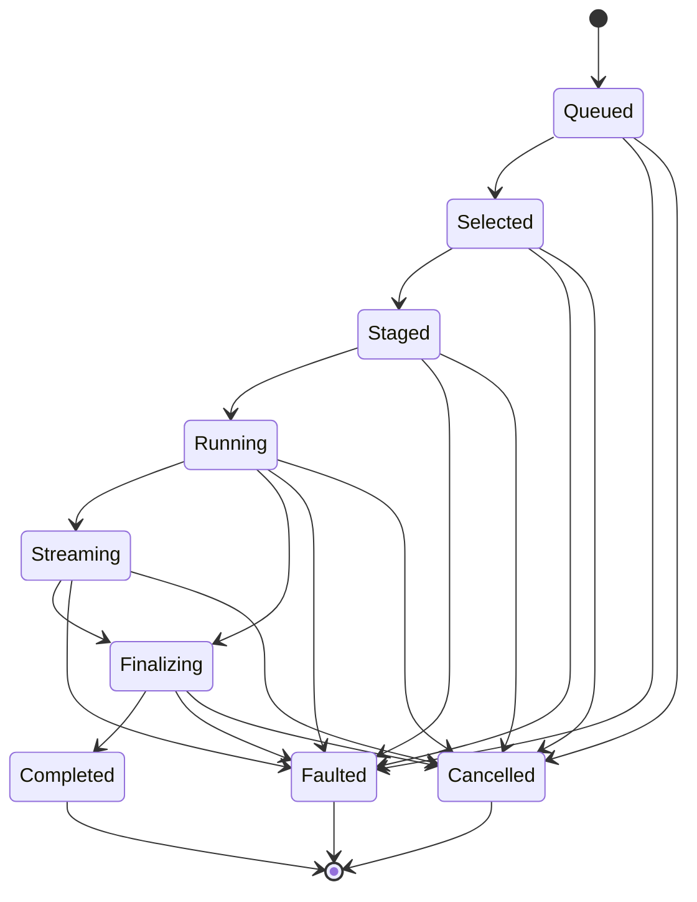

# [COMPUTE_CELL]

Rasm.Compute observation is one monotonic `ProgressPhase` family, one Atom-backed `ProgressCell` capsule committing `ProgressMark` structs under rank and terminal-dominance guards, one `SubscriptionPolicy` cadence axis gating observer delivery on interval, fraction, and segment thresholds, and one seam fold projecting the identical family onto AppUi presentation, the wire, and an aggregate parent cell. This owner holds the phase vocabulary, subscription gate, read-side throughput and ETA derivations, aggregate roll-up, observation seams, and progress wire shape.

Correlation identity, cancellation provenance, `IClock`, the scheduler marshal delegate, and the `PhaseSubscription` LIFO detacher composite arrive settled at composition; the `ComparerAccessors.StringOrdinal` accessor and the `AdmittedIntent` progress option arrive from `Runtime/admission`.

## [01]-[INDEX]

- [01]-[PHASE_FAMILY]: monotonic phase rows with rank and terminal columns; the aggregate bottleneck resolver.
- [02]-[PROGRESS_CELL]: atom-backed capsule; CAS rank guard; cadence-gated delivery; throughput/ETA derivation; child roll-up.
- [03]-[OBSERVATION_SEAMS]: AppUi marshal seam; wire mirror seam; sink-edge receipt law.
- [04]-[TS_PROJECTION]: progress wire shape consumed as connect-es server-stream.

## [02]-[PHASE_FAMILY]

- Owner: `ProgressPhase` `[SmartEnum<string>]` rows under the `ComparerAccessors.StringOrdinal` accessor, carrying the monotonic rank column, the terminal column, the terminal-precedence `Dominance` column, and the `Resolve` bottleneck fold the aggregate cell reads.
- Cases: queued, selected, staged, running, streaming, finalizing, completed, cancelled, faulted.
- Packages: Thinktecture.Runtime.Extensions, LanguageExt.Core, BCL inbox
- Growth: one phase row with its rank and terminal column values; zero new surface.
- Boundary: rank order is the page law — the guard compares rank, never adjacency, so forward jumps are admitted; running carries the fraction field and streaming the segment count, both lane-written through `Advance` and never mutating rank; cancelled and faulted stay single terminal rows, their evidence riding the fault rail and joining observers through the correlation, never extra phase rows; the shipped `ComparerAccessors.StringOrdinal` accessor is shared with `WorkLane`/`JobState`, so a second ordinal string accessor for the phase key never arises; `Resolve` folds a child phase set to one parent by the terminal `Dominance` column — the highest-`Dominance` fault-like terminal (Faulted over Cancelled) locks the aggregate, Completed requires unanimity, an otherwise-live set falls to the least-advanced non-terminal rank — so a new fault terminal lands as one `Dominance` row untouched by prior consumers, and an aggregate never reports completed while a part runs nor a rank ahead of its slowest part.

```csharp signature
[SmartEnum<string>]
[KeyMemberEqualityComparer<ComparerAccessors.StringOrdinal, string>]
[KeyMemberComparer<ComparerAccessors.StringOrdinal, string>]
public sealed partial class ProgressPhase {
    public static readonly ProgressPhase Queued = new("queued", rank: 0, terminal: false, dominance: 0);
    public static readonly ProgressPhase Selected = new("selected", rank: 1, terminal: false, dominance: 0);
    public static readonly ProgressPhase Staged = new("staged", rank: 2, terminal: false, dominance: 0);
    public static readonly ProgressPhase Running = new("running", rank: 3, terminal: false, dominance: 0);
    public static readonly ProgressPhase Streaming = new("streaming", rank: 4, terminal: false, dominance: 0);
    public static readonly ProgressPhase Finalizing = new("finalizing", rank: 5, terminal: false, dominance: 0);
    public static readonly ProgressPhase Completed = new("completed", rank: 6, terminal: true, dominance: 0);
    public static readonly ProgressPhase Cancelled = new("cancelled", rank: 7, terminal: true, dominance: 1);
    public static readonly ProgressPhase Faulted = new("faulted", rank: 8, terminal: true, dominance: 2);

    public int Rank { get; }

    public bool Terminal { get; }

    public int Dominance { get; }

    public static FrozenSet<string> Keys => Items.Select(static row => row.Key).ToFrozenSet(StringComparer.Ordinal);

    // Terminal precedence is the Dominance column, not enumerated arms: highest Dominance locks (Faulted over
    // Cancelled), Completed requires unanimity, else the least-advanced non-terminal rank.
    public static ProgressPhase Resolve(Seq<ProgressPhase> parts) =>
        parts.IsEmpty
            ? Queued
            : (parts.Filter(static p => p.Dominance > 0).Fold(Queued, static (top, p) => p.Dominance > top.Dominance ? p : top) is { Dominance: > 0 } dominating)
                ? dominating
                : parts.ForAll(static p => p == Completed)
                    ? Completed
                    : parts.Filter(static p => !p.Terminal).Fold(Finalizing, static (lo, p) => p.Rank < lo.Rank ? p : lo);
}
```



## [03]-[PROGRESS_CELL]

- Owner: `ProgressMark` readonly record struct hot-path capsule carrying the `Rate`/`Eta` read-side derivations and the `Roll` aggregate fold; `SubscriptionPolicy` cadence record with the `Due` delivery predicate over interval, fraction, and segment thresholds; `ProgressCell` Atom-backed boundary capsule with the `Aggregate` parent-fold factory and first typed observer failure.
- Seeds: `SubscriptionPolicy.Immediate` | `SubscriptionPolicy.Interactive` | `SubscriptionPolicy.Wire`; callers derive composed policies from the same parameterized carrier.
- Entry: `public ProgressMark Advance(ProgressPhase phase, double fraction = 0d, long segments = 0L)` — value-returning commit; the unchanged snapshot is the rejection contract and the hot path carries no fault rail.
- Auto: `ProgressMark.Accept` rejects invalid fractions, negative segments, rank regressions, and terminal regressions; same-phase fractions and all segment counts rise monotonically, timestamps never move backward, correlation stays cell-owned, and a higher-`Dominance` terminal can replace a lower terminal under a concurrent race. Each observer gate applies the same order through `Due`; a failed observer effect stores its first `Error` in `LatestFailure` and advances the cell to `Faulted`. `Aggregate` subscribes before its initial child fold, then re-folds `Roll` on change, so no advance can fall between snapshot and registration; an empty child set returns `None` rather than minting an unrequested parent.
- Receipt: none minted here — every mark carries the intent correlation that keys receipt evidence at the sink edge, so terminal marks join observers to evidence in one hop.
- Packages: LanguageExt.Core, NodaTime, Thinktecture.Runtime.Extensions, BCL inbox
- Growth: one cadence row on `SubscriptionPolicy`, one threshold field on the same record, or one field on `ProgressMark` mirrored by one wire member; the aggregate reuses `Subscribe`/`Advance`/`Roll` with zero new surface.
- Boundary: `ProgressCell` is the boundary capsule for subscription wiring and event registration. Its constructor is private; `Mint` is the only leaf factory and reads the admitted intent's `Option<SubscriptionPolicy>`, while `Aggregate` is the only parent factory. `Subscribe` accepts an effectful observer, so UI marshal and wire-write failures remain on `Fin` and terminate the cell instead of disappearing behind `ignore`. `IProgress<T>` plumbing, null checks, and consumer-side reminting never arise. `Advance` builds a candidate before the pure CAS fold. `Rate` and `Eta` derive from a mark pair, returning `0d` and `None` at zero interval. Observer cancellation rides `CancelScope`; composite jobs reuse the identical `ProgressMark` and observation seams. `IClock` supplies instants directly because App-owned `ClockPolicy` never crosses into this owner.

```csharp signature
public readonly record struct ProgressMark(ProgressPhase Phase, double Fraction, long Segments, Instant At, CorrelationId Correlation) {
    public int Rank => Phase.Rank;

    public double Rate(ProgressMark prior) {
        double seconds = (At - prior.At).TotalSeconds;
        return seconds > 0d ? Math.Max(0L, Segments - prior.Segments) / seconds : 0d;
    }

    public Option<Duration> Eta(ProgressMark prior) {
        double seconds = (At - prior.At).TotalSeconds;
        double velocity = Fraction - prior.Fraction;
        return seconds > 0d && velocity > 0d && Fraction < 1d
            ? Some(Duration.FromSeconds((1d - Fraction) * seconds / velocity))
            : None;
    }

    public static ProgressMark Accept(ProgressMark prior, ProgressMark next) {
        bool invalid = !double.IsFinite(next.Fraction) || next.Fraction < 0d || next.Fraction > 1d || next.Segments < 0L;
        bool terminalUpgrade = prior.Phase.Terminal && next.Phase.Terminal && next.Phase.Dominance > prior.Phase.Dominance;
        if (invalid || (prior.Phase.Terminal && !terminalUpgrade) || (!prior.Phase.Terminal && next.Rank < prior.Rank))
            return prior;

        double fraction = next.Phase == ProgressPhase.Completed ? 1d : Math.Max(prior.Fraction, next.Fraction);
        return next with {
            Fraction = fraction,
            Segments = Math.Max(prior.Segments, next.Segments),
            At = next.At < prior.At ? prior.At : next.At,
            Correlation = prior.Correlation,
        };
    }

    public static ProgressMark Roll(Seq<ProgressMark> parts, CorrelationId correlation, Instant at) =>
        parts.IsEmpty
            ? new ProgressMark(ProgressPhase.Completed, 1d, 0L, at, correlation)
            : new ProgressMark(
                ProgressPhase.Resolve(parts.Map(static m => m.Phase)),
                parts.Fold(0d, static (sum, mark) => sum + mark.Fraction) / parts.Count,
                parts.Fold(0L, AddSegments),
                at,
                correlation);

    private static long AddSegments(long accumulated, ProgressMark mark) {
        long segment = Math.Max(0L, mark.Segments);
        return segment > long.MaxValue - accumulated ? long.MaxValue : accumulated + segment;
    }
}

public sealed record SubscriptionPolicy(Duration MinInterval, double MinFraction, long MinSegments) {
    public static readonly SubscriptionPolicy Immediate = new(Duration.Zero, 0d, 0L);
    public static readonly SubscriptionPolicy Interactive = new(Duration.FromMilliseconds(100), 0.01d, 64L);
    public static readonly SubscriptionPolicy Wire = new(Duration.FromMilliseconds(250), 0.05d, 256L);

    public bool Due(ProgressMark prior, ProgressMark next) =>
        next.Rank >= prior.Rank
            && (next.Phase.Terminal
                || next.Rank > prior.Rank
                || next.At - prior.At >= (MinInterval < Duration.Zero ? Duration.Zero : MinInterval)
                || Math.Abs(next.Fraction - prior.Fraction) >= Math.Max(0d, MinFraction)
                || next.Segments - prior.Segments >= Math.Max(0L, MinSegments));
}

public sealed class ProgressCell {
    private readonly IClock clock;
    private readonly Atom<ProgressMark> cell;
    private readonly Atom<Option<Error>> failure;

    private ProgressCell(CorrelationId correlation, CancelScope scope, IClock clock, ProgressMark initial) {
        Correlation = correlation;
        Scope = scope;
        this.clock = clock;
        cell = Atom(initial);
        failure = Atom(Option<Error>.None);
    }

    public CorrelationId Correlation { get; }
    public CancelScope Scope { get; }
    public ProgressMark Latest => cell.Value;
    public Option<Error> LatestFailure => failure.Value;

    // Admitted progress policy is the only leaf-mint gate.
    public static Option<ProgressCell> Mint(AdmittedIntent intent, IClock clock) =>
        intent.Spec.Progress.Map(_ => new ProgressCell(
            intent.Correlation,
            intent.Scope,
            clock,
            new ProgressMark(ProgressPhase.Queued, 0d, 0L, clock.GetCurrentInstant(), intent.Correlation)));

    public ProgressMark Advance(ProgressPhase phase, double fraction = 0d, long segments = 0L) =>
        Advance(new ProgressMark(phase, fraction, segments, clock.GetCurrentInstant(), Correlation));

    public ProgressMark Advance(ProgressMark next) =>
        cell.Swap(prior => ProgressMark.Accept(prior, next));

    public PhaseSubscription Subscribe(SubscriptionPolicy policy, Func<ProgressMark, IO<Unit>> observer) {
        Atom<ProgressMark> gate = Atom(cell.Value);
        AtomChangedEvent<ProgressMark> handler = mark => Forward(gate, policy, observer, mark);
        cell.Change += handler;
        return new PhaseSubscription([() => cell.Change -= handler]);
    }

    public void Cancel() => Scope.Source.Cancel();

    public static Option<(ProgressCell Cell, PhaseSubscription Wiring)> Aggregate(
        CorrelationId correlation, CancelScope scope, IClock clock, Seq<ProgressCell> parts, SubscriptionPolicy cadence) {
        if (parts.IsEmpty)
            return None;

        ProgressCell parent = new(
            correlation,
            scope,
            clock,
            new ProgressMark(ProgressPhase.Queued, 0d, 0L, clock.GetCurrentInstant(), correlation));
        Arr<PhaseSubscription> wiring = parts.Map(part => part.Subscribe(
            cadence,
            _ => IO.lift(() => parent.Advance(ProgressMark.Roll(parts.Map(static child => child.Latest), correlation, clock.GetCurrentInstant()))).Map(static _ => unit))).ToArr();
        parent.Advance(ProgressMark.Roll(parts.Map(static child => child.Latest), correlation, clock.GetCurrentInstant()));
        return Some((parent, new PhaseSubscription(toSeq(wiring.Bind(static sub => sub.Detachers)))));
    }

    private Unit Forward(Atom<ProgressMark> gate, SubscriptionPolicy policy, Func<ProgressMark, IO<Unit>> observer, ProgressMark mark) =>
        gate.Value != mark && gate.Swap(prior => policy.Due(prior, mark) ? mark : prior) == mark
            ? observer(mark).Run().Match(Succ: static _ => unit, Fail: Fail)
            : unit;

    private Unit Fail(Error error) {
        failure.Swap(held => held.IsSome ? held : Some(error));
        if (Latest.Phase != ProgressPhase.Faulted) { Advance(ProgressPhase.Faulted); }
        return unit;
    }
}
```

## [04]-[OBSERVATION_SEAMS]

- Owner: `ProgressSeams` extension fold over `ProgressCell` — one member per observation seam, each binding one cadence row to one observer shape.
- Entry: `public PhaseSubscription Observe(UiSchedulerPort scheduler, Action<ProgressMark> render)` — the returned detacher composite disposes LIFO.
- Packages: LanguageExt.Core, BCL inbox
- Growth: one seam member binding one cadence row to one observer shape; zero new surface.
- Boundary: AppUi presentation marshals through the port delegate so no Compute type touches a UI thread. `Stream` feeds the ComputeService server-stream at app roots, and both seams return `IO<Unit>` into `ProgressCell.Subscribe`; the proto phase enum generates from `ProgressPhase.Keys`, so a second wire vocabulary is the named defect. Aggregate parents use these identical seams because their rolled value is a `ProgressMark`. Receipts materialize only at the sink edge.

```csharp signature
public static class ProgressSeams {
    extension(ProgressCell cell) {
        public PhaseSubscription Observe(UiSchedulerPort scheduler, Action<ProgressMark> render) =>
            cell.Subscribe(SubscriptionPolicy.Interactive, mark => scheduler.Marshal(() => render(mark)));

        public PhaseSubscription Stream(Func<ProgressMark, IO<Unit>> write) =>
            cell.Subscribe(SubscriptionPolicy.Wire, write);
    }
}
```

## [05]-[TS_PROJECTION]

- Owner: `ProgressPhaseKey`, `ProgressMarkWire` — the progress stream shape the dashboard and companion consume.
- Packages: BCL inbox
- Growth: one key-literal row per new phase and one wire member per new capsule field; zero new surface.
- Boundary: the stream rides connect-es server-stream for-await over the binary transport; phase crosses as its declared key from generated `ProgressPhase.Keys`, rank crosses as the row rank, the instant crosses as a round-trip pattern string, and correlation crosses as a guid string. Aggregate marks cross the identical shape. Consumer cadence stays observer-side policy, while throughput and ETA derive from consecutive marks.

```ts signature
type ProgressPhaseKey = "queued" | "selected" | "staged" | "running" | "streaming" | "finalizing" | "completed" | "cancelled" | "faulted";

interface ProgressMarkWire {
  readonly phase: ProgressPhaseKey;
  readonly rank: number;
  readonly fraction: number;
  readonly segments: bigint;
  readonly at: string;
  readonly correlation: string;
}
```

## [06]-[RESEARCH]

<!-- source-only: research row template:
[TOKEN]-[OPEN|BLOCKED]: <exact question>; <verification route>.
-->

- [COMMIT_ORDER]-[OPEN]: does any interleaving of concurrent `Advance` commits forward a rank-decreasing mark to a subscriber or store a rank below a prior committed mark; CsCheck `SampleParallel` property at implementation.
- [AGGREGATE_FANOUT]-[OPEN]: at what part count does the O(parts) `Aggregate` re-roll per part change become the sweep bottleneck, ceding `Immediate` re-folding to `Interactive`/`Wire` coalescing; measurement on a wide job-graph fan at implementation.
- [GH2_READBACK_IDLE]-[OPEN]: what idle-loop interval does a GH2 `SolveInstance` poll `ProgressCell.Latest` for a terminal mark before re-scheduling its solve; the live GH2 solver idle loop, gating only whether a readback cadence row beyond `SubscriptionPolicy.Interactive` is warranted since the in-flight ceiling is `Runtime/scheduling#SOLVE_GUARD`-owned.
