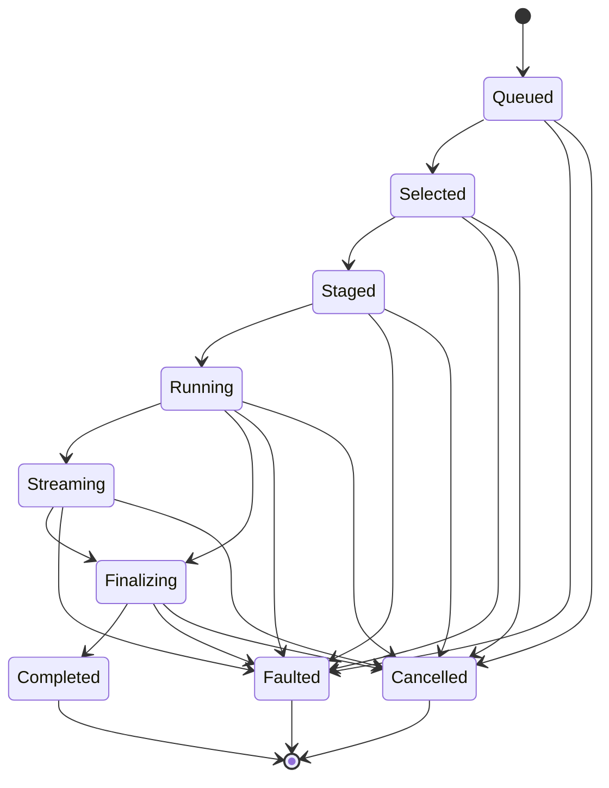

# [COMPUTE_CELL]

Rasm.Compute observation is one monotonic `ProgressPhase` family, one Atom-backed `ProgressCell` capsule committing zero-alloc `ProgressMark` structs under a CAS rank guard, one `SubscriptionPolicy` cadence axis gating observer delivery on interval, fraction, and segment thresholds, and one seam fold projecting the identical family onto AppUi presentation, the wire, and an aggregate parent cell that rolls a child set into one monotonic mark. This owner holds the phase vocabulary with its rank, terminal, and bottleneck-resolve columns, the subscription gate with observer-declared coalescing, the read-side throughput and ETA derivations, the aggregate roll-up fold, the observation seams, and the progress wire shape.

Correlation identity, cancellation provenance, the clock pair, the scheduler marshal delegate, and the `PhaseSubscription` LIFO detacher composite arrive settled from the AppHost spine; the `ComparerAccessors.StringOrdinal` accessor and the `AdmittedIntent` progress option arrive settled from `Runtime/admission` — all composed as given.

## [01]-[INDEX]

- [01]-[PHASE_FAMILY]: nine monotonic phase rows with rank and terminal columns; the aggregate bottleneck resolver.
- [02]-[PROGRESS_CELL]: atom-backed capsule; CAS rank guard; cadence-gated delivery; throughput/ETA derivation; child roll-up.
- [03]-[OBSERVATION_SEAMS]: AppUi marshal seam; wire mirror seam; sink-edge receipt law.
- [04]-[TS_PROJECTION]: progress wire shape consumed as connect-es server-stream.

## [02]-[PHASE_FAMILY]

- Owner: `ProgressPhase` `[SmartEnum<string>]` rows under the `ComparerAccessors.StringOrdinal` accessor, carrying the monotonic rank column, the terminal column, the terminal-precedence `Dominance` column, and the `Resolve` bottleneck fold the aggregate cell reads.
- Cases: queued, selected, staged, running, streaming, finalizing, completed, faulted, cancelled.
- Packages: Thinktecture.Runtime.Extensions, LanguageExt.Core, BCL inbox
- Growth: one phase row with its rank and terminal column values; zero new surface.
- Boundary: rank order is the page law — the guard compares rank, never adjacency, so forward jumps are admitted; running carries the fraction field and streaming the segment count, both lane-written through `Advance` and never mutating rank; cancelled and faulted stay single terminal rows, their evidence riding the fault rail and joining observers through the correlation, never extra phase rows; the shipped `ComparerAccessors.StringOrdinal` accessor is shared with `WorkLane`/`JobState`, so a second ordinal string accessor for the phase key never arises; `Resolve` folds a child phase set to one parent by the terminal `Dominance` column — the highest-`Dominance` fault-like terminal (Faulted over Cancelled) locks the aggregate, Completed requires unanimity, an otherwise-live set falls to the least-advanced non-terminal rank — so a new fault terminal lands as one `Dominance` row untouched by prior consumers, and an aggregate never reports completed while a part runs nor a rank ahead of its slowest part.

```csharp signature
[SmartEnum<string>]
[KeyMemberEqualityComparer<ComparerAccessors.StringOrdinal, string>]
[KeyMemberComparer<ComparerAccessors.StringOrdinal, string>]
public sealed partial class ProgressPhase {
    public static readonly ProgressPhase Queued = new("queued", rank: 0, terminal: false, dominance: 0);
    public static readonly ProgressPhase Selected = new("selected", rank: 1, terminal: false, dominance: 0);
    public static readonly ProgressPhase Staged = new("staged", rank: 2, terminal: false, dominance: 0);
    public static readonly ProgressPhase Running = new("running", rank: 3, terminal: false, dominance: 0);
    public static readonly ProgressPhase Streaming = new("streaming", rank: 4, terminal: false, dominance: 0);
    public static readonly ProgressPhase Finalizing = new("finalizing", rank: 5, terminal: false, dominance: 0);
    public static readonly ProgressPhase Completed = new("completed", rank: 6, terminal: true, dominance: 0);
    public static readonly ProgressPhase Faulted = new("faulted", rank: 7, terminal: true, dominance: 2);
    public static readonly ProgressPhase Cancelled = new("cancelled", rank: 8, terminal: true, dominance: 1);

    public int Rank { get; }

    public bool Terminal { get; }

    public int Dominance { get; }

    // Terminal precedence is the Dominance column, not enumerated arms: highest Dominance locks (Faulted over
    // Cancelled), Completed requires unanimity, else the least-advanced non-terminal rank.
    public static ProgressPhase Resolve(Seq<ProgressPhase> parts) =>
        parts.Filter(static p => p.Dominance > 0).Fold(Queued, static (top, p) => p.Dominance > top.Dominance ? p : top) is { Dominance: > 0 } dominating
            ? dominating
            : parts.ForAll(static p => p == Completed)
                ? Completed
                : parts.Filter(static p => !p.Terminal).Fold(Finalizing, static (lo, p) => p.Rank < lo.Rank ? p : lo);
}
```



## [03]-[PROGRESS_CELL]

- Owner: `ProgressMark` readonly record struct hot-path capsule carrying the `Rate`/`Eta` read-side derivations and the `Roll` aggregate fold; `SubscriptionPolicy` cadence record with the `Due` delivery predicate over interval, fraction, and segment thresholds; `ProgressCell` Atom-backed boundary capsule with the `Aggregate` parent-fold factory.
- Cases: `SubscriptionPolicy.Immediate` | `SubscriptionPolicy.Interactive` | `SubscriptionPolicy.Wire` cadence rows.
- Entry: `public ProgressMark Advance(ProgressPhase phase, double fraction = 0d, long segments = 0L)` — value-returning commit; the unchanged snapshot is the rejection contract and the hot path carries no fault rail.
- Auto: every successful swap fires the change event into per-subscription coalesce gates; a rejected regression retains the prior mark and re-fires it, the gate's equality pre-check dropping the duplicate, so observers structurally never observe rank regress; terminal commits always deliver and terminal re-fires suppress; concurrent `Advance` commits serialize through the cell `Atom` CAS so the stored mark is always the highest-rank winner, and each observer gate is itself a CAS over `Due`, so an out-of-order `AtomChangedEvent` delivering a higher-rank mark first permanently rejects the later lower-rank mark at that gate — observer monotonicity holds independent of handler-invocation order; `Aggregate` mints a parent cell, subscribes each part at the supplied cadence, and re-folds `Roll` over every part's `Latest` on any change, so a sweep observes one rolled mark whose bottleneck rank and completed ratio only rise and whose first part fault locks the parent terminal, the parent rank guard keeping it monotonic exactly as a leaf commit.
- Receipt: none minted here — every mark carries the intent correlation that keys receipt evidence at the sink edge, so terminal marks join observers to evidence in one hop.
- Packages: LanguageExt.Core, NodaTime, Thinktecture.Runtime.Extensions, BCL inbox
- Growth: one cadence row on `SubscriptionPolicy`, one threshold field on the same record, or one field on `ProgressMark` mirrored by one wire member; the aggregate reuses `Subscribe`/`Advance`/`Roll` with zero new surface.
- Boundary: `ProgressCell` is the named boundary capsule for the statement carve-out — subscription wiring and event registration carry language-owned statement forms while every other member stays expression-shaped; the cell mints only when the admitted intent's `Option<SubscriptionPolicy>` progress option is populated, so an unsubscribed intent carries no cell and lanes skip every write — `IProgress<T>` plumbing and null-progress checks never arise; the swap function is pure and runs once per CAS attempt, so marks build before the swap, never inside it; the lane writes raw fraction and segment counts while `Rate`/`Eta` are read-side derivations over a mark pair — the one canonical throughput and remaining-time formula every observer reads, returning `0d` and `None` rather than dividing by a zero interval; cadence literals trace to the three `SubscriptionPolicy` rows and the segment threshold gates streaming updates the interval and fraction thresholds miss, so subscribers override with observer-declared values; observer-initiated cancel rides the cell handle through `Cancel` into the linked scope chain and the executing lane commits the cancelled terminal mark, the aggregate scope the consumer-supplied parent of the part scopes so one `Cancel` cancels the whole set; per-observer queues, dispatchers, and event aggregators all reject — coalescing is gate policy — and a second progress shape for composite jobs rejects because the rolled mark is a `ProgressMark` riding the identical seams.

```csharp signature
public readonly record struct ProgressMark(ProgressPhase Phase, double Fraction, long Segments, Instant At, CorrelationId Correlation) {
    public int Rank => Phase.Rank;

    public double Rate(ProgressMark prior) =>
        (At - prior.At).TotalSeconds is > 0d and var dt ? (Segments - prior.Segments) / dt : 0d;

    public Option<Duration> Eta(ProgressMark prior) =>
        (At - prior.At).TotalSeconds is > 0d and var dt
            && Fraction - prior.Fraction is > 0d and var velocity
            && Fraction < 1d
                ? Some(Duration.FromSeconds((1d - Fraction) * dt / velocity))
                : None;

    public static ProgressMark Roll(Seq<ProgressMark> parts, CorrelationId correlation, Instant at) =>
        parts.IsEmpty
            ? new ProgressMark(ProgressPhase.Completed, 1d, 0L, at, correlation)
            : new ProgressMark(
                ProgressPhase.Resolve(parts.Map(static m => m.Phase)),
                (double)parts.Filter(static m => m.Phase == ProgressPhase.Completed).Count / parts.Count,
                parts.Fold(0L, static (acc, m) => acc + m.Segments),
                at,
                correlation);
}

public sealed record SubscriptionPolicy(Duration MinInterval, double MinFraction, long MinSegments, Option<Func<Action, IO<Unit>>> Marshal = default) {
    public static readonly SubscriptionPolicy Immediate = new(Duration.Zero, 0d, 0L);
    public static readonly SubscriptionPolicy Interactive = new(Duration.FromMilliseconds(100), 0.01d, 64L);
    public static readonly SubscriptionPolicy Wire = new(Duration.FromMilliseconds(250), 0.05d, 256L);

    public bool Due(ProgressMark prior, ProgressMark next) =>
        next.Rank >= prior.Rank
            && (next.Phase.Terminal
                || next.Rank > prior.Rank
                || next.At - prior.At >= MinInterval
                || Math.Abs(next.Fraction - prior.Fraction) >= MinFraction
                || next.Segments - prior.Segments >= MinSegments);
}

public sealed class ProgressCell(CorrelationId correlation, CancelScope scope, ClockPolicy clocks) {
    readonly Atom<ProgressMark> cell = Atom(new ProgressMark(ProgressPhase.Queued, 0d, 0L, clocks.Now, correlation));

    public CorrelationId Correlation { get; } = correlation;
    public CancelScope Scope { get; } = scope;
    public ProgressMark Latest => cell.Value;

    public ProgressMark Advance(ProgressPhase phase, double fraction = 0d, long segments = 0L) =>
        Advance(new ProgressMark(phase, fraction, segments, clocks.Now, Correlation));

    public ProgressMark Advance(ProgressMark next) =>
        cell.Swap(prior => prior.Phase.Terminal || next.Rank < prior.Rank ? prior : next);

    public PhaseSubscription Subscribe(SubscriptionPolicy policy, Action<ProgressMark> observer) {
        var gate = Atom(cell.Value);
        AtomChangedEvent<ProgressMark> handler = mark => Forward(gate, policy, observer, mark);
        cell.Change += handler;
        return new PhaseSubscription([() => cell.Change -= handler]);
    }

    public void Cancel() => Scope.Source.Cancel();

    public static (ProgressCell Cell, PhaseSubscription Wiring) Aggregate(
        CorrelationId correlation, CancelScope scope, ClockPolicy clocks, Seq<ProgressCell> parts, SubscriptionPolicy cadence) {
        var parent = new ProgressCell(correlation, scope, clocks);
        var wiring = parts.Map(part => part.Subscribe(
            cadence,
            _ => ignore(parent.Advance(ProgressMark.Roll(parts.Map(static p => p.Latest), correlation, clocks.Now)))));
        return (parent, new PhaseSubscription(wiring.Bind(static sub => sub.Detachers)));
    }

    static Unit Forward(Atom<ProgressMark> gate, SubscriptionPolicy policy, Action<ProgressMark> observer, ProgressMark mark) =>
        gate.Value != mark && gate.Swap(prior => policy.Due(prior, mark) ? mark : prior) == mark
            ? policy.Marshal is { IsSome: true, Case: Func<Action, IO<Unit>> marshal }
                ? ignore(marshal(() => observer(mark)).Run())
                : fun(() => observer(mark))()
            : unit;
}
```

## [04]-[OBSERVATION_SEAMS]

- Owner: `ProgressSeams` extension fold over `ProgressCell` — one member per observation seam, each binding one cadence row to one observer shape.
- Entry: `public PhaseSubscription Observe(UiSchedulerPort scheduler, Action<ProgressMark> render)` — the returned detacher composite disposes LIFO.
- Packages: LanguageExt.Core, BCL inbox
- Growth: one seam member binding one cadence row to one observer shape; zero new surface.
- Boundary: AppUi presentation marshals through the port delegate so no Compute type touches a UI thread — UI-thread marshaling inside observers is the deleted pattern; `Stream` feeds the ComputeService progress server-stream at app roots, and the proto phase enum mirrors the nine SmartEnum keys 1:1 — one family, two encodings, a second wire phase vocabulary is the named defect; an aggregate parent cell is observed through these identical seams because the rolled mark is a `ProgressMark`, so composite-job progress needs no third seam; dashboard and companion observers consume the identical family the desktop renders; receipts materialize at the receipt-sink edge only — capsules never allocate union cases on the observation path.

```csharp signature
public static class ProgressSeams {
    extension(ProgressCell cell) {
        public PhaseSubscription Observe(UiSchedulerPort scheduler, Action<ProgressMark> render) =>
            cell.Subscribe(SubscriptionPolicy.Interactive with { Marshal = Some(scheduler.Marshal) }, render);

        public PhaseSubscription Stream(Func<ProgressMark, IO<Unit>> write) =>
            cell.Subscribe(SubscriptionPolicy.Wire, mark => ignore(write(mark).Run()));
    }
}
```

## [05]-[TS_PROJECTION]

- Owner: `ProgressPhaseKey`, `ProgressMarkWire` — the progress stream shape the dashboard and companion consume.
- Packages: BCL inbox
- Growth: one key-literal row per new phase and one wire member per new capsule field; zero new surface.
- Boundary: the stream rides connect-es server-stream for-await over the binary transport; phase crosses as its declared key, rank crosses as the phase-row rank number, the instant crosses as a round-trip pattern string, and correlation crosses as a guid string; an aggregate mark crosses the identical shape — the bottleneck phase, the completed-part ratio as `fraction`, and the summed `segments` — so a dashboard renders a composite job through the same contract; reduced or coalesced cadence is observer-side policy on the consuming edge, never a wire knob, and throughput or ETA is derived on the consuming edge from consecutive marks, never a stored wire field.

```ts signature
type ProgressPhaseKey = "queued" | "selected" | "staged" | "running" | "streaming" | "finalizing" | "completed" | "faulted" | "cancelled";

interface ProgressMarkWire {
  readonly phase: ProgressPhaseKey;
  readonly rank: number;
  readonly fraction: number;
  readonly segments: number;
  readonly at: string;
  readonly correlation: string;
}
```

## [06]-[RESEARCH]

<!-- source-only: research row template:
[TOKEN]-[OPEN|BLOCKED]: <exact question>; <verification route>.
-->

- [COMMIT_ORDER]-[OPEN]: does any interleaving of concurrent `Advance` commits forward a rank-decreasing mark to a subscriber or store a rank below a prior committed mark; CsCheck `SampleParallel` property at implementation.
- [AGGREGATE_FANOUT]-[OPEN]: at what part count does the O(parts) `Aggregate` re-roll per part change become the sweep bottleneck, ceding `Immediate` re-folding to `Interactive`/`Wire` coalescing; measurement on a wide job-graph fan at implementation.
- [GH2_READBACK_IDLE]-[OPEN]: what idle-loop interval does a GH2 `SolveInstance` poll `ProgressCell.Latest` for a terminal mark before re-scheduling its solve; the live GH2 solver idle loop, gating only whether a readback cadence row beyond `SubscriptionPolicy.Interactive` is warranted since the in-flight ceiling is `Runtime/scheduling#SOLVE_GUARD`-owned.
