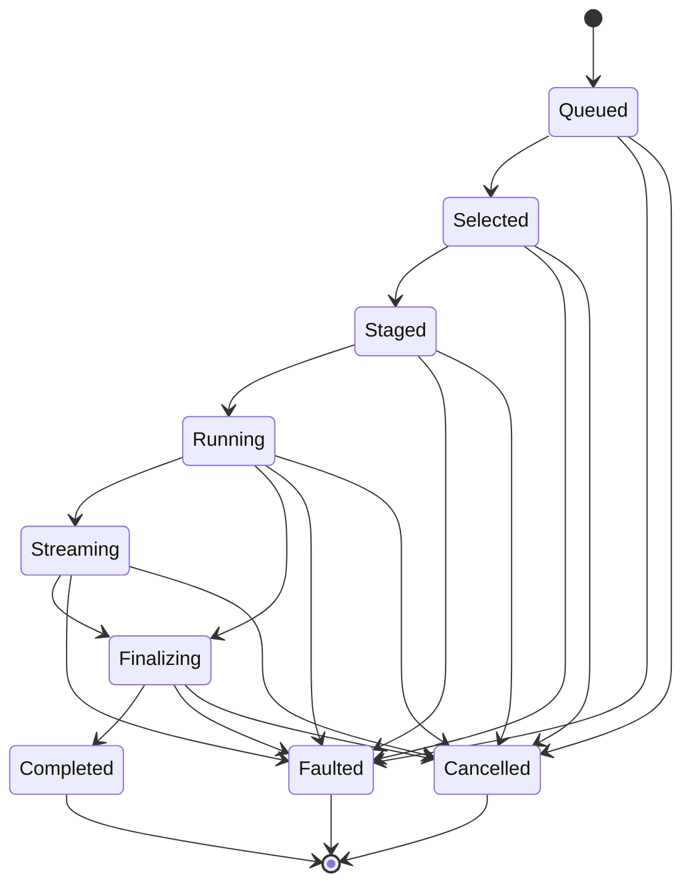

# [COMPUTE_CELL]

Rasm.Compute observation is one monotonic `ProgressPhase` family, one Atom-backed `ProgressCell` capsule committing `ProgressMark` structs under rank and terminal-dominance guards, one delivery gate applying the spine-declared `SubscriptionPolicy` cadence thresholds to consecutive marks, and one seam fold projecting the identical family onto AppUi presentation, the wire, the mounted instrument set, and an aggregate parent cell. This owner holds the phase vocabulary, the cadence predicate, read-side throughput and ETA derivations, aggregate roll-up, observation seams, and progress wire shape.

Correlation identity, cancellation provenance, `IClock`, the scheduler marshal delegate, the mounted `InstrumentSet`, and the `PhaseSubscription` LIFO detacher composite arrive settled at composition; `SubscriptionPolicy` and its three cadence rows arrive settled from `Rasm.AppHost` `Agent/capability`, and the `ComparerAccessors.StringOrdinal` accessor and the `AdmittedIntent` progress option arrive from `Runtime/admission`.

## [01]-[INDEX]

- [02]-[PHASE_FAMILY]: monotonic phase rows with rank and terminal columns; the aggregate bottleneck resolver.
- [03]-[PROGRESS_CELL]: atom-backed capsule; CAS rank guard; the `Due` cadence gate over the spine-declared policy; throughput/ETA derivation; child roll-up.
- [04]-[OBSERVATION_SEAMS]: AppUi marshal seam; wire mirror seam; instrument tap; sink-edge receipt law.
- [05]-[TS_PROJECTION]: progress wire shape consumed as connect-es server-stream.

## [02]-[PHASE_FAMILY]

- Owner: `ProgressPhase` `[SmartEnum<string>]` rows under the `ComparerAccessors.StringOrdinal` accessor, carrying the monotonic rank column, the terminal column, the terminal-precedence `Dominance` column, and the `Resolve` bottleneck fold the aggregate cell reads.
- Cases: queued, selected, staged, running, streaming, finalizing, completed, cancelled, faulted.
- Packages: Thinktecture.Runtime.Extensions, LanguageExt.Core, BCL inbox
- Growth: one phase row with its rank and terminal column values; zero new surface.
- Boundary: rank order is the page law — the guard compares rank, never adjacency, so forward jumps are admitted; running carries the fraction field and streaming the segment count, both lane-written through `Advance` and never mutating rank; cancelled and faulted stay single terminal rows, their evidence riding the fault rail and joining observers through the correlation, never extra phase rows; the shipped `ComparerAccessors.StringOrdinal` accessor is shared with `WorkLane`/`JobState`, so a second ordinal string accessor for the phase key never arises; `Resolve` folds a child phase set to one parent by the terminal `Dominance` column — the highest-`Dominance` fault-like terminal (Faulted over Cancelled) locks the aggregate, Completed requires unanimity, an otherwise-live set falls to the least-advanced non-terminal rank — so a new fault terminal lands as one `Dominance` row untouched by prior consumers, and an aggregate never reports completed while a part runs nor a rank ahead of its slowest part.

```csharp signature
[SmartEnum<string>]
[KeyMemberEqualityComparer<ComparerAccessors.StringOrdinal, string>]
[KeyMemberComparer<ComparerAccessors.StringOrdinal, string>]
public sealed partial class ProgressPhase {
    public static readonly ProgressPhase Queued = new("queued", rank: 0, terminal: false, dominance: 0);
    public static readonly ProgressPhase Selected = new("selected", rank: 1, terminal: false, dominance: 0);
    public static readonly ProgressPhase Staged = new("staged", rank: 2, terminal: false, dominance: 0);
    public static readonly ProgressPhase Running = new("running", rank: 3, terminal: false, dominance: 0);
    public static readonly ProgressPhase Streaming = new("streaming", rank: 4, terminal: false, dominance: 0);
    public static readonly ProgressPhase Finalizing = new("finalizing", rank: 5, terminal: false, dominance: 0);
    public static readonly ProgressPhase Completed = new("completed", rank: 6, terminal: true, dominance: 0);
    public static readonly ProgressPhase Cancelled = new("cancelled", rank: 7, terminal: true, dominance: 1);
    public static readonly ProgressPhase Faulted = new("faulted", rank: 8, terminal: true, dominance: 2);

    public int Rank { get; }

    public bool Terminal { get; }

    public int Dominance { get; }

    public static FrozenSet<string> Keys => Items.Select(static row => row.Key).ToFrozenSet(StringComparer.Ordinal);

    // Terminal precedence is the Dominance column, not enumerated arms: highest Dominance locks (Faulted over
    // Cancelled), Completed requires unanimity, else the least-advanced non-terminal rank.
    public static ProgressPhase Resolve(Seq<ProgressPhase> parts) =>
        parts.IsEmpty
            ? Queued
            : (parts.Filter(static p => p.Dominance > 0).Fold(Queued, static (top, p) => p.Dominance > top.Dominance ? p : top) is { Dominance: > 0 } dominating)
                ? dominating
                : parts.ForAll(static p => p == Completed)
                    ? Completed
                    : parts.Filter(static p => !p.Terminal).Fold(Finalizing, static (lo, p) => p.Rank < lo.Rank ? p : lo);
}
```


```mermaid
stateDiagram-v2
    accTitle: Compute progress phase transitions
    accDescr: Monotonic phase advance from queued through completed, with the fault and cancel terminals reachable from every live phase.
    [*] --> Queued
    Queued --> Selected
    Selected --> Staged
    Staged --> Running
    Running --> Streaming
    Running --> Finalizing
    Streaming --> Finalizing
    Finalizing --> Completed
    Queued --> Faulted
    Selected --> Faulted
    Staged --> Faulted
    Running --> Faulted
    Streaming --> Faulted
    Finalizing --> Faulted
    Queued --> Cancelled
    Selected --> Cancelled
    Staged --> Cancelled
    Running --> Cancelled
    Streaming --> Cancelled
    Finalizing --> Cancelled
    Completed --> [*]
    Faulted --> [*]
    Cancelled --> [*]
```

## [03]-[PROGRESS_CELL]

- Owner: `ProgressMark` readonly record struct hot-path capsule carrying the `Rate`/`Eta` read-side derivations and the `Roll` aggregate fold; `ProgressCadence` the one `extension(SubscriptionPolicy)` member applying the spine-declared interval, fraction, and segment thresholds to a mark pair; `ProgressCell` Atom-backed boundary capsule with the `Aggregate` parent-fold factory and first typed observer failure.
- Cases: the cadence rows `SubscriptionPolicy.Immediate` | `.Interactive` | `.Wire` are the spine's, and a caller composing its own thresholds mints one more value of that same carrier rather than a policy shape here.
- Entry: `public ProgressMark Advance(ProgressPhase phase, double fraction = 0d, long segments = 0L)` — value-returning commit; the unchanged snapshot is the rejection contract and the hot path carries no fault rail.
- Auto: `ProgressMark.Accept` rejects invalid fractions, negative segments, rank regressions, and terminal regressions; same-phase fractions and all segment counts rise monotonically, timestamps never move backward, correlation stays cell-owned, and a higher-`Dominance` terminal can replace a lower terminal under a concurrent race. Each observer gate applies the same order through `Due`; a failed observer effect stores its first `Error` in `LatestFailure` and advances the cell to `Faulted`. `Aggregate` subscribes before its initial child fold, then re-folds `Roll` on change, so no advance can fall between snapshot and registration; an empty child set returns `None` rather than minting an unrequested parent. DAG-wide aggregation rides Wire-cadence coalescing — `Runtime/scheduling#JOB_GRAPH` binds every part cell at `SubscriptionPolicy.Wire`, so a wide fan re-folds off the coalesced stream and `Immediate` re-folding never serves one. `Roll` averages part fractions UNWEIGHTED and sums their segments saturating: a part carries no cost column, so a weighted mean rests on a per-part share nothing measured — the honest aggregate reports equal parts and the phase resolver carries the truth a mean cannot, which is why `Resolve` and not the fraction decides what the parent says.
- Receipt: none minted here — every mark carries the intent correlation that keys receipt evidence at the sink edge, so terminal marks join observers to evidence in one hop.
- Packages: LanguageExt.Core, NodaTime, Thinktecture.Runtime.Extensions, Rasm.AppHost (project), BCL inbox
- Growth: a new cadence row or threshold column lands at the spine's `SubscriptionPolicy` and reaches `Due` as one more clause on the one predicate; a new observed axis is one field on `ProgressMark` mirrored by one wire member; the aggregate reuses `Subscribe`/`Advance`/`Roll` with zero new surface.
- Boundary: `ProgressCell` is the boundary capsule for subscription wiring and event registration. Its constructor is private; `Mint` is the only leaf factory and reads the admitted intent's `Spec.Progress` column — the spine-declared `Option<SubscriptionPolicy>` the capability descriptor stamped and the command algebra carried onto the intent verbatim, so a `None` row structurally has no cell for its producer to advance and no cadence is ever re-derived at dispatch — while `Aggregate` is the only parent factory. `Subscribe` accepts an effectful observer, so UI marshal and wire-write failures remain on `Fin` and terminate the cell instead of disappearing behind `ignore`. `IProgress<T>` plumbing, null checks, and consumer-side reminting never arise. `Advance` builds a candidate before the pure CAS fold. `Rate` and `Eta` derive from a mark pair, returning `0d` and `None` at zero interval — a converging producer publishing fraction with no segment count therefore reports no rate and a real ETA, which is the honest split rather than a fabricated throughput. Producers are FOREIGN-THREAD by contract: a native search worker, a companion pump, or a lane task all publish through `Advance`, so the Atom commit IS the concurrency contract and the cell holds no affinity — `Change` then fans every subscriber on that producer's own thread, which is why each seam marshals or writes non-blockingly and never re-enters the cell. `Fail` is the ONE sanctioned re-entry, bounded by its own terminal probe: it advances to `Faulted` from inside a `Change` handler, the second pass reads the terminal phase and stops, so an observer failing under a foreign producer terminates once instead of recursing. Observer cancellation rides `CancelScope`; composite jobs reuse the identical `ProgressMark` and observation seams. `IClock` supplies instants directly because App-owned `ClockPolicy` never crosses into this owner.

```csharp signature
public readonly record struct ProgressMark(ProgressPhase Phase, double Fraction, long Segments, Instant At, CorrelationId Correlation) {
    public int Rank => Phase.Rank;

    public double Rate(ProgressMark prior) {
        double seconds = (At - prior.At).TotalSeconds;
        return seconds > 0d ? Math.Max(0L, Segments - prior.Segments) / seconds : 0d;
    }

    public Option<Duration> Eta(ProgressMark prior) {
        double seconds = (At - prior.At).TotalSeconds;
        double velocity = Fraction - prior.Fraction;
        return seconds > 0d && velocity > 0d && Fraction < 1d
            ? Some(Duration.FromSeconds((1d - Fraction) * seconds / velocity))
            : None;
    }

    public static ProgressMark Accept(ProgressMark prior, ProgressMark next) {
        bool invalid = !double.IsFinite(next.Fraction) || next.Fraction < 0d || next.Fraction > 1d || next.Segments < 0L;
        bool terminalUpgrade = prior.Phase.Terminal && next.Phase.Terminal && next.Phase.Dominance > prior.Phase.Dominance;
        if (invalid || (prior.Phase.Terminal && !terminalUpgrade) || (!prior.Phase.Terminal && next.Rank < prior.Rank))
            return prior;

        double fraction = next.Phase == ProgressPhase.Completed ? 1d : Math.Max(prior.Fraction, next.Fraction);
        return next with {
            Fraction = fraction,
            Segments = Math.Max(prior.Segments, next.Segments),
            At = next.At < prior.At ? prior.At : next.At,
            Correlation = prior.Correlation,
        };
    }

    public static ProgressMark Roll(Seq<ProgressMark> parts, CorrelationId correlation, Instant at) =>
        parts.IsEmpty
            ? new ProgressMark(ProgressPhase.Completed, 1d, 0L, at, correlation)
            : new ProgressMark(
                ProgressPhase.Resolve(parts.Map(static m => m.Phase)),
                parts.Fold(0d, static (sum, mark) => sum + mark.Fraction) / parts.Count,
                parts.Fold(0L, AddSegments),
                at,
                correlation);

    private static long AddSegments(long accumulated, ProgressMark mark) {
        long segment = Math.Max(0L, mark.Segments);
        return segment > long.MaxValue - accumulated ? long.MaxValue : accumulated + segment;
    }
}

// The cadence THRESHOLDS declare at `Rasm.AppHost` `Agent/capability#DESCRIPTOR_AXIS`, beside the
// descriptor column that carries them, because an op declares its reporting posture where it declares itself —
// and the platform's command algebra seats that same value on the intent it compiles. The delivery PREDICATE
// lands here because it reads a `ProgressMark` pair, and `ProgressMark` is this owner's hot-path capsule that
// never crosses downward. So one value is declared once at the spine and decides exactly one thing, here: a
// second cadence record at either end would let a descriptor advertise thresholds this gate never applied.
public static class ProgressCadence {
    extension(SubscriptionPolicy policy) {
        public bool Due(ProgressMark prior, ProgressMark next) =>
            next.Rank >= prior.Rank
                && (next.Phase.Terminal
                    || next.Rank > prior.Rank
                    || next.At - prior.At >= (policy.MinInterval < Duration.Zero ? Duration.Zero : policy.MinInterval)
                    || Math.Abs(next.Fraction - prior.Fraction) >= Math.Max(0d, policy.MinFraction)
                    || next.Segments - prior.Segments >= Math.Max(0L, policy.MinSegments));
    }
}

public sealed class ProgressCell {
    private readonly IClock clock;
    private readonly Atom<ProgressMark> cell;
    private readonly Atom<Option<Error>> failure;

    private ProgressCell(CorrelationId correlation, CancelScope scope, IClock clock, ProgressMark initial) {
        Correlation = correlation;
        Scope = scope;
        this.clock = clock;
        cell = Atom(initial);
        failure = Atom(Option<Error>.None);
    }

    public CorrelationId Correlation { get; }
    public CancelScope Scope { get; }
    public ProgressMark Latest => cell.Value;
    public Option<Error> LatestFailure => failure.Value;

    // Admitted progress policy is the only leaf-mint gate.
    public static Option<ProgressCell> Mint(AdmittedIntent intent, IClock clock) =>
        intent.Spec.Progress.Map(_ => new ProgressCell(
            intent.Correlation,
            intent.Scope,
            clock,
            new ProgressMark(ProgressPhase.Queued, 0d, 0L, clock.GetCurrentInstant(), intent.Correlation)));

    public ProgressMark Advance(ProgressPhase phase, double fraction = 0d, long segments = 0L) =>
        Advance(new ProgressMark(phase, fraction, segments, clock.GetCurrentInstant(), Correlation));

    public ProgressMark Advance(ProgressMark next) =>
        cell.Swap(prior => ProgressMark.Accept(prior, next));

    public PhaseSubscription Subscribe(SubscriptionPolicy policy, Func<ProgressMark, IO<Unit>> observer) {
        Atom<ProgressMark> gate = Atom(cell.Value);
        AtomChangedEvent<ProgressMark> handler = mark => Forward(gate, policy, observer, mark);
        cell.Change += handler;
        return new PhaseSubscription([() => cell.Change -= handler]);
    }

    public void Cancel() => Scope.Source.Cancel();

    public static Option<(ProgressCell Cell, PhaseSubscription Wiring)> Aggregate(
        CorrelationId correlation, CancelScope scope, IClock clock, Seq<ProgressCell> parts, SubscriptionPolicy cadence) {
        if (parts.IsEmpty)
            return None;

        ProgressCell parent = new(
            correlation,
            scope,
            clock,
            new ProgressMark(ProgressPhase.Queued, 0d, 0L, clock.GetCurrentInstant(), correlation));
        Arr<PhaseSubscription> wiring = parts.Map(part => part.Subscribe(
            cadence,
            _ => IO.lift(() => parent.Advance(ProgressMark.Roll(parts.Map(static child => child.Latest), correlation, clock.GetCurrentInstant()))).Map(static _ => unit))).ToArr();
        parent.Advance(ProgressMark.Roll(parts.Map(static child => child.Latest), correlation, clock.GetCurrentInstant()));
        return Some((parent, new PhaseSubscription(toSeq(wiring.Bind(static sub => sub.Detachers)))));
    }

    private Unit Forward(Atom<ProgressMark> gate, SubscriptionPolicy policy, Func<ProgressMark, IO<Unit>> observer, ProgressMark mark) =>
        gate.Value != mark && gate.Swap(prior => policy.Due(prior, mark) ? mark : prior) == mark
            ? Try.lift(() => observer(mark).Run()).Run().Match(Succ: static _ => unit, Fail: Fail)
            : unit;

    private Unit Fail(Error error) {
        failure.Swap(held => held.IsSome ? held : Some(error));
        if (Latest.Phase != ProgressPhase.Faulted) { Advance(ProgressPhase.Faulted); }
        return unit;
    }
}
```

## [04]-[OBSERVATION_SEAMS]

- Owner: `ProgressSeams` extension fold over `ProgressCell` — one member per observation seam, each binding one cadence row to one observer shape.
- Entry: `public PhaseSubscription Observe(UiSchedulerPort scheduler, Action<ProgressMark> render)` — the returned detacher composite disposes LIFO.
- Packages: Riok.Mapperly (`ProgressUpdateMapper` under `RequiredMappingStrategy.Both`; the SmartEnum key crossing via `StaticConvertMethods`), NodaTime.Serialization.Protobuf, LanguageExt.Core, BCL inbox
- Growth: one seam member binding a cadence row to one observer shape; zero new surface.
- Boundary: every seam body runs on the PRODUCER's thread — the `Change` fan is synchronous, so a native solver worker, a companion pump, or a lane task carries each observer to completion before its own `Advance` returns; AppUi presentation therefore marshals through the port delegate so no Compute type touches a UI thread, `Instrument` writes through thread-safe meter handles, and a seam that blocks or fans out is the deleted form the `HANDOFF_DRAIN` channel owns. `Stream` feeds the ComputeService server-stream at app roots, and every seam returns `IO<Unit>` into `ProgressCell.Subscribe`; a readback consumer polling `Latest` for a terminal mark composes its own cadence as one more `SubscriptionPolicy` value on the spine's carrier — cadence growth is a spine row, never a seam member here, and the in-flight ceiling it reads against is `Runtime/scheduling#SOLVE_GUARD`-owned; the proto phase enum generates from `ProgressPhase.Keys`, so a second wire vocabulary is the named defect. Aggregate parents use these identical seams because their rolled value is a `ProgressMark`. Receipts materialize only at the sink edge. `Instrument` writes the two `rasm.compute.progress.*` rows through the `Runtime/receipts` mounted `InstrumentSet` — the marks counter per delivered mark, the cadence histogram per consecutive-mark interval, both tagged by phase — so progress telemetry is one more subscriber under the identical cadence gate and the cell never touches a meter; the prior-mark register reads before it swaps and advances only once both writes land, so no instrument write runs inside the CAS body and a refused row never becomes observable history, and the writer returns the kernel rail so that refusal raises on the subscription's own error channel rather than vanishing at the seam.

```csharp signature
public static class ProgressSeams {
    extension(ProgressCell cell) {
        public PhaseSubscription Observe(UiSchedulerPort scheduler, Action<ProgressMark> render) =>
            cell.Subscribe(SubscriptionPolicy.Interactive, mark => scheduler.Marshal(() => render(mark)));

        public PhaseSubscription Stream(Func<ProgressMark, IO<Unit>> write) =>
            cell.Subscribe(SubscriptionPolicy.Wire, write);

        public PhaseSubscription Instrument(InstrumentSet set, SubscriptionPolicy cadence) {
            Atom<Option<ProgressMark>> prior = Atom(Option<ProgressMark>.None);
            return cell.Subscribe(cadence, mark => IO.lift(() => Written(set, prior, mark)));
        }
    }

    // Instrument name and dimension slot are the `Runtime/receipts` owner's consts, and `InstrumentSet.Tags` mints
    // exactly the `TagList` its own `in TagList` write overload consumes, so declared row, writer, and
    // materialization owner stay one vocabulary; `Advance` requires a phase on every mark, so this axis carries no
    // absence arm and never omits its dimension. Cadence needs a predecessor, so the FIRST mark this subscription
    // observes records none — the register carries the subscription's own history and no phase flip resets it.
    // Returning the kernel rail binds `IO.lift`'s railed overload at the subscribe seam above, so a refused
    // write raises on the subscription's error channel instead of dying one frame short of it. The predecessor
    // advances on the SUCCESS path alone and outside the CAS body, so a refused pair leaves the register on the
    // last mark that actually recorded and the next interval spans the real gap instead of dropping it.
    static Fin<Unit> Written(InstrumentSet set, Atom<Option<ProgressMark>> prior, ProgressMark mark) {
        Option<ProgressMark> held = prior.Value;
        TagList phase = InstrumentSet.Tags((ReceiptSurface.PhaseSlot, mark.Phase.Key));
        return set.Write(ReceiptSurface.ProgressMarks, 1L, phase)
            .Bind(_ => held.Match(
                Some: previous => set.Write(ReceiptSurface.ProgressCadence, (mark.At - previous.At).TotalSeconds, phase),
                None: () => Fin.Succ(unit)))
            .Map(_ => ignore(prior.Swap(_ => Some(mark))));
    }
}

// The wire transcription is GENERATED: a mark lowers onto the ProgressUpdate frame under
// RequiredMappingStrategy.Both, so a new capsule field with no wire member fails the build — the mirror the
// Growth law demands is compiler-held. The phase crosses by its GENERATED KEY: StaticConvertMethods resolves
// the SmartEnum's own static Get inbound and the conversion operator outbound, so the proto enum stays
// generated from ProgressPhase.Keys and no hand mirror exists.
[Mapper(RequiredMappingStrategy = RequiredMappingStrategy.Both)]
[UseStaticMapper(typeof(NodaExtensions))]
public static partial class ProgressUpdateMapper {
    [MapProperty(nameof(ProgressMark.Correlation), nameof(ProgressUpdate.Correlation), Use = nameof(CorrelationText))]
    public static partial ProgressUpdate ToWire(ProgressMark mark);

    [NamedMapping("correlation-text")]
    private static string CorrelationText(CorrelationId correlation) => correlation.ToString();
}
```

## [05]-[TS_PROJECTION]

- Owner: `ProgressPhaseKey`, `ProgressUpdateWire` — the progress stream shape the dashboard and companion consume.
- Packages: BCL inbox
- Growth: one key-literal row per new phase and one wire member per new capsule field; zero new surface.
- Law: `ProgressUpdateWire` names the WIRE message `ProgressUpdateMapper` writes, never the `ProgressMark` capsule it transcribes — the same split `TransactionDraft`→`TransactionRequest`→`TransactionRequestWire` takes at `Runtime/wire#TS_PROJECTION`. Spelling the mirror off the domain capsule collides against the typescript branch's own `Evidence.Tally` fold subject, which counts done-against-total over an operation tree and shares no axis with this phase frame.
- Boundary: the stream rides connect-es server-stream for-await over the binary transport; phase crosses as its declared key from generated `ProgressPhase.Keys`, rank crosses as the row rank, the instant crosses as a round-trip pattern string, and correlation crosses as a guid string. Aggregate marks cross the identical shape. Consumer cadence stays observer-side policy, while throughput and ETA derive from consecutive marks.

```ts signature
type ProgressPhaseKey = "queued" | "selected" | "staged" | "running" | "streaming" | "finalizing" | "completed" | "cancelled" | "faulted";

interface ProgressUpdateWire {
  readonly phase: ProgressPhaseKey;
  readonly rank: number;
  readonly fraction: number;
  readonly segments: bigint;
  readonly at: string;
  readonly correlation: string;
}
```

## [06]-[RESEARCH]

<!-- source-only: research row template:
[TOKEN]-[OPEN|BLOCKED]: <exact question>; <verification route>.
-->

(none)
