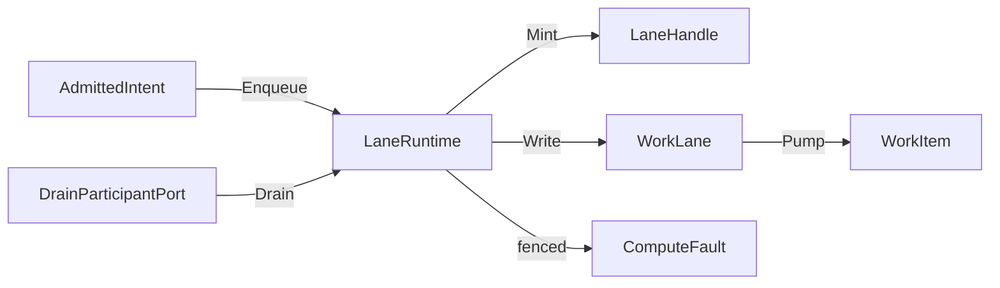
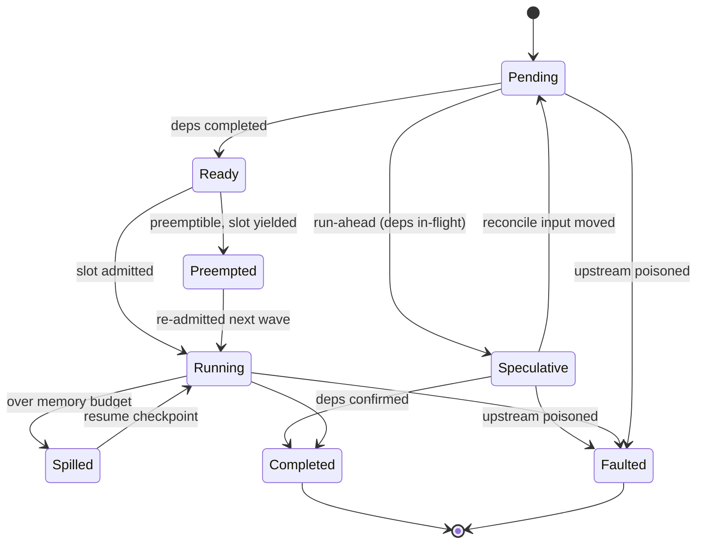

# [COMPUTE_RUNTIME]

Rasm.Compute schedules every admitted intent through five bounded `WorkLane` channel rows behind one `LaneRuntime` enqueue capsule: lane choice is an intent field, full-mode and backpressure are row data, drops emit a correlated `Backpressure` receipt, queue depth reads `ChannelReader.Count`, and solve-path dispatch structurally returns a `LaneHandle` instead of executing work. A `JobGraph` dependency-DAG scheduler layers speculative, preemptible, fair-share, accelerator-affinity, and spill-to-store orchestration bounded by the shared `CpuBudget`, keys every node on its input content digest so a re-run reconciles digests and recomputes only the moved subgraph while clean nodes replay cached receipts, and rolls every node's coarse progress cell into one live parent `ProgressCell` the dashboard observes as a single composite bar.

Clusters own the `WorkLane` axis, the work-item and handle shapes, the GH2 async-result ceiling, the `CpuBudget` record the three concurrency axes share, and band-200 drain participation, composed over bounded System.Threading.Channels pipes, Thinktecture vocabulary, LanguageExt rails, NodaTime instants, and the AppHost drain, cancellation, clock, and schedule spine.

## [01]-[INDEX]

- [01]-[LANE_AXIS]: five bounded channel rows; capacity, full-mode, readers, rank as row data.
- [02]-[SOLVE_GUARD]: one enqueue capsule; solve threads receive handles, never execute work.
- [03]-[CPU_BUDGET]: one processor-budget record shared by all three concurrency axes.
- [04]-[JOB_GRAPH]: batch-wave dependency scheduler; speculative run-ahead, fair-share preemptive admission, cooperative spill, content-key reactive reconcile, rolled-up live DAG progress aggregate.
- [05]-[DRAIN_CANCEL]: band-200 drain participation; one linked cancellation chain with provenance.

## [02]-[LANE_AXIS]

- Owner: `WorkLane` `[SmartEnum<string>]` rows under the `ComparerAccessors.StringOrdinal` accessor; `LaneHandle` readback handle; `WorkItem` channel element.
- Cases: interactive, background, bulk, benchmark, capture-ingest.
- Entry: `public BoundedChannelOptions Options(CpuBudget budget)` — pure row projection; capacity, full-mode, and reader fan-out are row data, never call-site arguments.
- Auto: cadence-driven work (compute-model-warmup, scheduled equivalence sweeps) enters as `ScheduleEntry` rows whose `Work` delegate enqueues onto its declared lane — the schedule port owns when, lanes own throughput; receipted-loss rows construct their channel with the drop delegate so every drop lands as a `Backpressure` receipt carrying the dropped item's correlation, never a silent loss; the queue-depth slot reads `ChannelReader<WorkItem>.Count` on the lane's reader at stamp time, never a hand-tracked counter.
- Receipt: Backpressure — lane row, queue depth from `ChannelReader.Count`, wait elapsed on a parked write, or dropped-item correlation on a `DropWrite`/`DropOldest` lane — materialized at the sink edge on the package receipt union.
- Packages: BCL inbox, Thinktecture.Runtime.Extensions, LanguageExt.Core, NodaTime, Rasm.AppHost (project)
- Growth: one lane row with its capacity, full-mode, reader, and rank columns; zero new surface.
- Boundary: the `WorkLane` name is owned here and `DrainQueue` stays the AppHost process-level altitude — one altitude per name; lane choice is an intent field and full-mode is row data, so a drop flag on another row is the deleted form; capture-ingest drops oldest because the latest geometry state wins, and its consumer is the DocumentService CaptureEvents client-stream; rank is the cross-lane precedence datum ordering drain steps — per-item priority mutation, unbounded channels, per-lane worker class hierarchies, and Dataflow lanes are the deleted patterns.

```csharp signature
[SmartEnum<string>]
[KeyMemberEqualityComparer<ComparerAccessors.StringOrdinal, string>]
[KeyMemberComparer<ComparerAccessors.StringOrdinal, string>]
public sealed partial class WorkLane {
    public static readonly WorkLane Interactive = new("interactive", capacity: 16, fullMode: BoundedChannelFullMode.Wait, rank: 1, readers: static _ => 1);
    public static readonly WorkLane Background = new("background", capacity: 256, fullMode: BoundedChannelFullMode.Wait, rank: 2, readers: static budget => budget.ReaderCeiling);
    public static readonly WorkLane Bulk = new("bulk", capacity: 1024, fullMode: BoundedChannelFullMode.DropWrite, rank: 3, readers: static _ => 1);
    public static readonly WorkLane Benchmark = new("benchmark", capacity: 4, fullMode: BoundedChannelFullMode.Wait, rank: 4, readers: static _ => 1);
    public static readonly WorkLane CaptureIngest = new("capture-ingest", capacity: 256, fullMode: BoundedChannelFullMode.DropOldest, rank: 5, readers: static _ => 1);

    private readonly Func<CpuBudget, int> readers;

    public int Capacity { get; }

    public BoundedChannelFullMode FullMode { get; }

    public int Rank { get; }

    public int Readers(CpuBudget budget) => Math.Min(readers(budget), budget.ReaderCeiling);

    public BoundedChannelOptions Options(CpuBudget budget) => new(Capacity) {
        FullMode = FullMode,
        SingleReader = Readers(budget) is 1,
        SingleWriter = false,
    };
}

public readonly record struct LaneHandle(CorrelationId Correlation, WorkLane Lane, CancelScope Cancel, Instant Enqueued);

public readonly record struct WorkItem(AdmittedIntent Intent, LaneHandle Handle);
```

## [03]-[SOLVE_GUARD]

- Owner: `LaneRuntime` — the one enqueue capsule over five bounded channels, the admission gate, and the pump readers.
- Entry: `public IO<LaneHandle> Enqueue(AdmittedIntent intent)` — `IO` carries the enqueue effect, awaits fullness on Wait rows, and aborts fenced admission with `ComputeFault.ShutdownDrained`.
- Auto: composition forks `Readers`-many `Pump` effects per row beneath the spine scope; dispatch from GH2 and UI threads structurally enqueues and returns the handle — synchronous model or remote execution on a solve path is unrepresentable by this seam, not by discipline.
- Receipt: wait evidence rides the pressure delegate only when the write parks; a synchronously completed write emits nothing, keeping the uncontended path allocation-free.
- Packages: BCL inbox, LanguageExt.Core, NodaTime, Rasm.AppHost (project)
- Growth: one lane row reuses the same enqueue, write, and pump members; zero new surface.
- Boundary: `LaneRuntime` is the named boundary capsule for the statement carve-out — channel construction, the parked-write window, and the pump loop carry language-owned statement forms; no blocking wait exists on the public surface and completion is observed only through progress states and receipts — handle to correlation to receipt join is the readback, and the GH2 async-result ceiling is the `Interactive` lane capacity of sixteen in-flight handles a GH2 `SolveInstance` readback never exceeds because the seventeenth `Enqueue` parks on the `Wait` full-mode rather than dropping a solve result; the dispatch delegate is total on the fault rail, so the pump never interprets failures.

```csharp signature
public sealed class LaneRuntime(
    ClockPolicy clocks,
    CpuBudget budget,
    Func<WorkItem, IO<Unit>> dispatch,
    Action<WorkLane, WorkItem, Option<Duration>> pressure)
{
    readonly Atom<bool> gate = Atom(true);
    readonly HashMap<WorkLane, Channel<WorkItem>> channels = toHashMap(toSeq(WorkLane.Items).Map(row =>
        (row, row.FullMode is BoundedChannelFullMode.Wait
            ? Channel.CreateBounded<WorkItem>(row.Options(budget))
            : Channel.CreateBounded<WorkItem>(row.Options(budget), item => pressure(row, item, None)))));

    public IO<LaneHandle> Enqueue(AdmittedIntent intent) =>
        from item in gate.Value
            ? IO.pure(Mint(intent))
            : IO.fail<WorkItem>(new ComputeFault.ShutdownDrained(intent.Spec.Lane.Key))
        from landed in Write(item)
        select item.Handle;

    public IO<Unit> Pump(WorkLane lane) =>
        IO.liftAsync(async env => {
            await foreach (var item in channels[lane].Reader.ReadAllAsync(env.Token)) {
                await dispatch(item).RunAsync(env);
            }
            return unit;
        });

    public int Depth(WorkLane lane) => channels[lane].Reader.Count;

    public Unit Fence() => ignore(gate.Swap(static _ => false));

    public IO<Unit> Drain(WorkLane lane, CancellationToken token) =>
        from fenced in IO.lift(Fence)
        from closed in IO.lift(() => channels[lane].Writer.TryComplete())
        from settled in IO.liftAsync(async _ => {
            await channels[lane].Reader.Completion.WaitAsync(token);
            return unit;
        })
        select unit;

    WorkItem Mint(AdmittedIntent intent) =>
        new(intent, new LaneHandle(
            intent.Correlation,
            intent.Spec.Lane,
            intent.Scope.Derive($"{intent.Spec.Lane.Key}/{intent.Correlation}", clocks.Time),
            clocks.Now));

    IO<Unit> Write(WorkItem item) =>
        IO.liftVAsync(async _ => {
            var parked = channels[item.Handle.Lane].Writer.WriteAsync(item, item.Handle.Cancel.Token);
            if (parked.IsCompletedSuccessfully) {
                await parked;
                return unit;
            }
            var mark = clocks.Mark();
            await parked;
            pressure(item.Handle.Lane, item, Some(clocks.Elapsed(mark)));
            return unit;
        });
}
```



## [04]-[CPU_BUDGET]

- Owner: `CpuBudget` — the one processor-budget record the three concurrency axes read.
- Entry: `public static CpuBudget Resolve(int processors, int hostReserve)` — pure clamp; the record freezes at composition and every derived field is arithmetic over the two inputs.
- Auto: the composition root resolves the record once from `Environment.ProcessorCount` and the posture row; lane readers clamp through `Readers`, the model lane sizes its one global ORT thread pool from `OrtIntraOp` and `OrtInterOp` with per-session threads disabled and binds `OrtThreadingOptions.GlobalSpinControl` from `SpinControl`, and the tensor-lane `Partition` execution column reads `PartitionCap` for its `ParallelHelper.For` partition count behind a winning benchmark claim — this record owns the cap, Tensor/dispatch#KERNEL_DISPATCH owns the fan-out.
- Packages: BCL inbox
- Growth: one posture row per new host-profile row and one policy value per new concurrency axis; zero new surface.
- Boundary: oversubscription is structurally impossible because all three axes read this record — a reader count, thread-pool size, or partition count not traced to a field here is the named defect, and a `ParallelHelper.For` degree, a second `Partitioner`/`ParallelRunner` owner, or a `Parallel.For` partition sized off the host total is the rejected form because `PartitionCap` is the one cap the tensor-lane fan-out reads; plugin rows reserve host cores for the Rhino UI and solver threads, service rows own the machine; `ReaderCeiling` halves the worker pool because readers park on kernel and remote completions while the global pool carries the arithmetic; `SpinControl` is the latency-versus-CPU posture the model lane reads at `Boot`, derived from the same `HostReserve` input — a co-tenanted host (`HostReserve > 0`: the plugin and desktop rows sharing cores with the Rhino UI) surrenders ORT spin so reserved cores stay idle between runs, and a machine-owning service row (`HostReserve == 0`) spins to hold model-call latency low, with an ORT thread count or spin flag set anywhere but from this record being the named defect; the `processors` input is sourced from the AppHost `PressurePolicy` container-limit grade when a cgroup/quota limit is present — never the host-total processor count — so one container-limit signal re-caps lane readers, the ORT thread pool, and the partition cap together, and a concurrency axis sized off the host total under a container limit is the named defect.

```csharp signature
public sealed record CpuBudget(int Total, int HostReserve) {
    public int Workers => Math.Max(1, Total - HostReserve);

    public int OrtIntraOp => Workers;

    public int OrtInterOp => 1;

    public int ReaderCeiling => Math.Max(1, Workers / 2);

    public int PartitionCap => Workers;

    public bool SpinControl => HostReserve is 0;

    public static CpuBudget Resolve(int processors, int hostReserve) =>
        new(Math.Max(1, processors), Math.Max(0, hostReserve));
}
```

A posture row supplies `hostReserve` per host-profile row at composition:

| [INDEX] | [PROFILE_ROW]      | [HOST_RESERVE] |
| :-----: | :----------------- | :------------: |
|  [01]   | rhino-plugin       |       2        |
|  [02]   | gh2-plugin         |       2        |
|  [03]   | standalone-desktop |       1        |
|  [04]   | companion          |       1        |
|  [05]   | sidecar            |       1        |
|  [06]   | headless-service   |       0        |
|  [07]   | web-service        |       0        |
|  [08]   | test-host          |       0        |

## [05]-[JOB_GRAPH]

- Owner: `JobNode` the dependency-graph node keyed on its input content seed; `JobState` `[SmartEnum<string>]` the node-lifecycle rows with `Terminal`, `Resumable`, and `Phase` (the `Runtime/progress#PROGRESS_CELL` `ProgressPhase` projection) columns; `JobSignal` `[Union]` the per-node execution outcome the runner returns; `CheckpointPort` the spill-to-store persist/resume pair over the Persistence blob lane; `JobLedger` the orchestration result; `JobGraph` the batch-wave dependency scheduler driving speculative run-ahead, fair-share preemptive admission, accelerator-affinity ordering, and cooperative memory-spill bounded by the shared `CpuBudget`, executing each node through the injected `runner`, keying every node on the suite `XxHash128` input digest so a re-run recomputes only the moved subgraph, and folding one coarse per-node `ProgressCell` through `ProgressCell.Aggregate` into one rolled parent cell so the whole DAG surfaces a single live monotonic `ProgressMark`.
- Cases: `JobState` rows pending · ready · running · speculative · preempted · spilled · completed · faulted; `JobSignal` cases completed · faulted · spilled.
- Entry: `public (ProgressCell Progress, IO<Fin<JobLedger>> Ledger) Run(Seq<JobNode> nodes, CpuBudget budget, CorrelationId correlation, CancelScope scope, ClockPolicy clocks)` — the eager `Progress` parent cell is observed live through the `Runtime/progress#OBSERVATION_SEAMS` `Observe`/`Stream` seams while the `Ledger` `IO<Fin<...>>` carries the schedule effect; a cyclic dependency aborts `ComputeFault.GraphCyclic` before any node runs, each wave folds the topological frontier through the runner returning the final `JobLedger`, and `Reconcile` mirrors the same pair shape for the content-key reactive re-solve so a live re-solve and a fresh run expose progress identically.
- Auto: `Run` plans each wave — the eligible set is every `Pending` node whose upstream is all `Completed`, every `Speculative` node whose upstream is still in flight, and every `Resumable` (`Preempted`/`Spilled`) node — orders it accelerator-affinity first, then `FairShareWeight` descending, and admits under each tenant's slice of `CpuBudget.Workers`: a slot-starved `Preemptible` node yields to `Preempted`, a non-preemptible one holds `Ready`, and both re-enter the next wave; each admitted node forks its `runner` (a resuming node reads its checkpoint first), the wave awaits, `Advance` moves each node on its `JobSignal`, every spilled checkpoint persists through the `CheckpointPort`, and `Poison` faults the downstream cone of every fault so the loop converges with every node `Terminal` — the non-terminating frontier (a scheduler that marks `Running` but never reconciles completions) is the deleted form; each wave additionally projects every node's `JobState.Phase` onto its coarse `ProgressCell` through `Mark` so the rolled parent's bottleneck phase tracks the least-advanced node and its completed ratio rises monotonically as nodes settle, the first node fault locking the parent terminal exactly as `ProgressPhase.Resolve` dictates.
- Receipt: the graph emits no `ComputeReceipt` case of its own — each node's execution rides its lane's existing receipts (`Backpressure` plus the substrate-lane facts the runner emits), and the `JobLedger` carries the graph-level fact: node count, the completed/faulted split, and the speculated/preempted/spilled tally with elapsed; a `Sweep`/`JobReceipt` case on the per-execution receipt union — whose required `(Lane, Substrate)` spine no whole graph carries — is the rejected form, and the live DAG progress rides the rolled-up parent `ProgressCell` (a monotonic `ProgressMark`, not a receipt fact) orthogonal to the post-hoc `JobLedger` count.
- Packages: BCL inbox, System.IO.Hashing, LanguageExt.Core, NodaTime, Rasm.AppHost (project), Rasm.Persistence (project)
- Growth: a new node lifecycle is one `JobState` row carrying its `Phase` column; a new scheduling policy is one column on `JobNode` the planning fold reads; the reactive recompute is the one `Reconcile` content-key diff over the existing edges; the transitive downstream closure is one `Closure` fixpoint shared by `MarkDirty` and `Poison`; the cycle test is `Cyclic` derived from the one `Topological` Kahn's kernel; zero new surface — a `JobScheduler`/`WorkflowEngine`/`DagRunner`/`IncrementalEngine` sibling surface is the rejected form collapsed onto the one `JobGraph` over the shared `CpuBudget` and the injected runner.
- Boundary: the job graph is the dependency-DAG layer above execution — it forks each node's injected `runner` and never executes work itself, so the per-node substrate dispatch the runner wraps owns the work while the graph owns only dependency order, and a graph node both enqueued onto the pumped `LaneRuntime` channel and forked through a runner — double-executing the work — is the rejected form; the wave forks every admitted node then awaits, so nodes run concurrently while the graph orchestrates only dependencies; fair-share is the per-tenant slice of `CpuBudget.Workers` the planning fold reads — the one shared cap the SOLVE_GUARD lane readers also size from, no second cap owner — and a `Preempted` node is a `Preemptible` node that yielded its slot to higher-priority work (re-admitted fresh the next wave), distinct from a `Spilled` node that ran past its `MemoryBudgetBytes` and whose runner cooperatively returned a `JobCheckpoint` the `CheckpointPort` persisted and a later wave resumes from — a scheduler-side checkpoint of in-flight work it cannot observe and a second checkpoint store are the rejected forms; accelerator affinity orders the frontier warm-first so a node carrying an EP-context affinity launches before a cold peer, while the actual warm-substrate routing stays the `Runtime/admission#DISPATCH_SPINE` `SubstrateSelection` warm-affinity column the runner dispatches through and the per-node load the AppHost `PeerRoster` carries — the graph never re-routes substrates, so distributed solve orchestration lands without a `FarmRouter`; speculative execution launches a node alongside its still-running upstream and `Poison` discards the mispredict when that upstream faults, so a speculative node's fault is receipt-gated through the same cone propagation; the cycle check runs once at admission — `Cyclic` is `Topological(nodes).Count != nodes.Count` over the one Kahn's kernel (the page's named measured-kernel exemption, alongside `LaneRuntime`'s statement carve-out) — and a cyclic graph faults `ComputeFault.GraphCyclic` (band 2220) before any node runs, never mid-schedule, the stringly-typed `ComputeFault.Create("<cycle>")` text fault being the deleted form; `MarkDirty` is the real-time incremental parametric re-solve primitive — a changed input transitively marks its downstream cone `Pending` through the one `Closure` fixpoint and `Run`/`Reconcile` recompute only the dirty subgraph against the still-`Completed` clean nodes, so a server-side headless merge-preview solve re-runs the touched parametric subgraph rather than the whole model and a full recompute on a single-input change is the named defect this layer deletes; `Reconcile` is the content-keyed reactive engine over that primitive — `Keys` walks the topological order and folds each node's `InputBytes` content seed under its upstream-key ancestry through the suite `XxHash128` law (the same `Runtime/admission#INTENT_FAMILY` `Seeded` precedent the intent digest folds, never a hand-tracked mutation flag and never a per-node version stamp beside the content key), the moved set is the content-key inequality against the prior key map, `MarkDirty` propagates the transitive dirty closure, and every clean node whose key did not move stays `Completed` and replays from the `Model/inference#RESULT_CACHE` deterministic cache hit without re-execution — the clean-node short-circuit is the existing cache hit so no second memoization owner appears, the dirty closure rides the `Solver/sweep#SWEEP_AND_BUDGET` `FrameBudget` per frame, the AppUi twin and Persistence federation receive only the moved nodes' receipts, and the whole package becomes one incremental compute engine over the existing identity and receipt rails rather than a parallel dependency tracker; `Closure` is a pure recursive fixpoint over the dependency edges — a mutable `grew` flag accumulating the dirty set is the deleted form — and `MarkDirty` and `Poison` share it, the dirty direction marking moved cones `Pending` and the fault direction marking faulted cones `Faulted` so the DAG always converges; the live progress aggregate composes at the `Run`/`Reconcile` frontier — one coarse `ProgressCell` per node minted on the node's own `AdmittedIntent` correlation and scope (never a parallel counter beside the per-intent cell), folded through `ProgressCell.Aggregate(correlation, scope, clocks, cells, SubscriptionPolicy.Wire)` into one parent cell whose `PhaseSubscription` wiring disposes on the bracketed terminal — so a dashboard observes one composite progress bar for the whole DAG through the identical `Runtime/progress#OBSERVATION_SEAMS` `Observe`/`Stream` seams a single intent rides, and a second graph-progress shape, a per-node progress fan the consumer must re-aggregate, and a `JobLedger`-polled progress estimate are the rejected forms because the rolled mark is itself a `ProgressMark`.

```csharp signature
[SmartEnum<string>]
[KeyMemberEqualityComparer<ComparerAccessors.StringOrdinal, string>]
[KeyMemberComparer<ComparerAccessors.StringOrdinal, string>]
public sealed partial class JobState {
    public static readonly JobState Pending = new("pending", terminal: false, resumable: false, phase: ProgressPhase.Queued);
    public static readonly JobState Ready = new("ready", terminal: false, resumable: false, phase: ProgressPhase.Selected);
    public static readonly JobState Running = new("running", terminal: false, resumable: false, phase: ProgressPhase.Running);
    public static readonly JobState Speculative = new("speculative", terminal: false, resumable: false, phase: ProgressPhase.Running);
    public static readonly JobState Preempted = new("preempted", terminal: false, resumable: true, phase: ProgressPhase.Selected);
    public static readonly JobState Spilled = new("spilled", terminal: false, resumable: true, phase: ProgressPhase.Running);
    public static readonly JobState Completed = new("completed", terminal: true, resumable: false, phase: ProgressPhase.Completed);
    public static readonly JobState Faulted = new("faulted", terminal: true, resumable: false, phase: ProgressPhase.Faulted);

    public bool Terminal { get; }

    public bool Resumable { get; }

    // The universal progress projection: each lifecycle row carries the Runtime/progress ProgressPhase the coarse
    // per-node cell advances to, so the JobGraph rolls every node's lifecycle into one monotonic parent ProgressMark.
    public ProgressPhase Phase { get; }
}

[Union]
public abstract partial record JobSignal {
    public sealed record Completed(ReadOnlyMemory<byte> Result) : JobSignal;
    public sealed record Faulted(Error Reason) : JobSignal;
    public sealed record Spilled(JobCheckpoint Checkpoint) : JobSignal;
}

public sealed record JobCheckpoint(string NodeId, UInt128 ContentKey, ReadOnlyMemory<byte> State, Instant At);

public sealed record CheckpointPort(
    Func<JobCheckpoint, IO<Unit>> Persist,
    Func<string, IO<Option<JobCheckpoint>>> Resume);

public readonly record struct JobReport(string NodeId, JobSignal Signal);

public readonly record struct JobRun(JobNode Node, Option<JobCheckpoint> Resume);

public readonly record struct JobTally(int Speculated, int Preempted, int Spilled);

public readonly record struct JobLedger(HashMap<string, JobState> States, int Nodes, int Completed, int Faulted, JobTally Tally, Duration Elapsed);

public sealed record JobNode(
    string Id,
    AdmittedIntent Intent,
    Seq<string> DependsOn,
    TenantId Tenant,
    bool Speculative,
    bool Preemptible,
    int FairShareWeight,
    Option<string> AcceleratorAffinity,
    long MemoryBudgetBytes,
    ReadOnlyMemory<byte> InputBytes) {
    public bool Ready(HashMap<string, JobState> states) =>
        DependsOn.ForAll(dep => states.Find(dep).Map(static state => state == JobState.Completed).IfNone(false));

    public bool Speculable(HashMap<string, JobState> states) =>
        Speculative && !Ready(states)
        && DependsOn.ForAll(dep => states.Find(dep).Map(static state =>
            state == JobState.Completed || state == JobState.Running || state == JobState.Speculative).IfNone(false));

    public UInt128 NodeKey(HashMap<string, UInt128> upstreamKeys) {
        Span<byte> seed = stackalloc byte[16];
        UInt128 ancestry = DependsOn.Fold(UInt128.Zero, (acc, dep) => acc ^ upstreamKeys.Find(dep).IfNone(UInt128.Zero));
        MemoryMarshal.Write(seed, in ancestry);
        return XxHash128.HashToUInt128(InputBytes.Span, unchecked((long)XxHash3.HashToUInt64(seed)));
    }
}

public sealed class JobGraph(Func<JobRun, IO<JobSignal>> runner, CheckpointPort checkpoints) {
    readonly record struct JobLaunch(JobNode Node, bool Resume);
    readonly record struct JobWave(HashMap<string, JobState> States, Seq<JobLaunch> Launches, int Speculated, int Preempted);

    public (ProgressCell Progress, IO<Fin<JobLedger>> Ledger) Run(Seq<JobNode> nodes, CpuBudget budget, CorrelationId correlation, CancelScope scope, ClockPolicy clocks) {
        var cells = Cells(nodes, clocks);
        var (parent, wiring) = ProgressCell.Aggregate(correlation, scope, clocks, toSeq(cells.Values), SubscriptionPolicy.Wire);
        return (parent, IO.pure(wiring).Bracket(
            Use: _ => Cyclic(nodes)
                ? IO.pure(Fin.Fail<JobLedger>(new ComputeFault.GraphCyclic(string.Join(">", nodes.Map(static node => node.Id)))))
                : Drive(nodes, budget, clocks, cells, clocks.Mark(), Seed(nodes), default).Map(Fin.Succ),
            Fin: static w => IO.lift(fun(w.Dispose))));
    }

    public (ProgressCell Progress, IO<Fin<JobLedger>> Ledger) Reconcile(Seq<JobNode> nodes, HashMap<string, UInt128> prior, HashMap<string, JobState> priorStates, CpuBudget budget, CorrelationId correlation, CancelScope scope, ClockPolicy clocks) {
        var current = Keys(nodes);
        var moved = toSeq(current.Filter((id, key) => prior.Find(id).Map(was => was != key).IfNone(true)).Keys);
        var states = MarkDirty(nodes, priorStates, moved);
        var cells = Cells(nodes, clocks);
        var (parent, wiring) = ProgressCell.Aggregate(correlation, scope, clocks, toSeq(cells.Values), SubscriptionPolicy.Wire);
        return (parent, IO.pure(wiring).Bracket(
            Use: _ => Cyclic(nodes)
                ? IO.pure(Fin.Fail<JobLedger>(new ComputeFault.GraphCyclic(string.Join(">", nodes.Map(static node => node.Id)))))
                : Drive(nodes, budget, clocks, cells, clocks.Mark(), states, default).Map(Fin.Succ),
            Fin: static w => IO.lift(fun(w.Dispose))));
    }

    static HashMap<string, JobState> Seed(Seq<JobNode> nodes) =>
        nodes.Fold(HashMap<string, JobState>(), static (acc, node) => acc.Add(node.Id, JobState.Pending));

    // One coarse ProgressCell per node, minted on the node's own AdmittedIntent correlation and scope; the parent
    // aggregate folds these so graph-level progress reuses the per-intent cell rather than a parallel counter.
    static HashMap<string, ProgressCell> Cells(Seq<JobNode> nodes, ClockPolicy clocks) =>
        nodes.Fold(HashMap<string, ProgressCell>(), (acc, node) => acc.Add(node.Id, new ProgressCell(node.Intent.Correlation, node.Intent.Scope, clocks)));

    // Project every node's current JobState onto its cell each wave; the cell's CAS rank guard keeps the per-node
    // mark monotonic, so a reconcile dirty-revert never regresses a live bar and the rolled parent only rises.
    static Unit Mark(Seq<JobNode> nodes, HashMap<string, ProgressCell> cells, HashMap<string, JobState> states) {
        nodes.Iter(node => cells.Find(node.Id).Iter(cell => states.Find(node.Id).Iter(state => ignore(cell.Advance(state.Phase)))));
        return unit;
    }

    IO<JobLedger> Drive(Seq<JobNode> nodes, CpuBudget budget, ClockPolicy clocks, HashMap<string, ProgressCell> cells, long started, HashMap<string, JobState> states, JobTally tally) {
        ignore(Mark(nodes, cells, states));
        if (states.Values.ForAll(static state => state.Terminal)) {
            return IO.pure(Settle(nodes, states, tally, clocks.Elapsed(started)));
        }
        var wave = Plan(nodes, states, budget);
        return from reports in Execute(wave.Launches)
               from done in Drive(nodes, budget, clocks, cells, started,
                   Poison(nodes, Advance(wave.States, reports)),
                   new JobTally(
                       tally.Speculated + wave.Speculated,
                       tally.Preempted + wave.Preempted,
                       tally.Spilled + reports.Filter(static report => report.Signal is JobSignal.Spilled).Count))
               select done;
    }

    static JobWave Plan(Seq<JobNode> nodes, HashMap<string, JobState> states, CpuBudget budget) {
        var tenants = nodes.Filter(node => states.Find(node.Id).Map(static s => !s.Terminal).IfNone(false)).Map(static node => node.Tenant).Distinct().Count;
        var share = Math.Max(1, budget.Workers / Math.Max(1, tenants));
        var eligible = toSeq(nodes
            .Filter(node => Eligible(node, states))
            .OrderBy(node => node.AcceleratorAffinity.IsSome ? 0 : 1)
            .ThenByDescending(static node => node.FairShareWeight));
        var seed = (States: states, Launches: Seq<JobLaunch>(), Global: budget.Workers, Tenant: HashMap<TenantId, int>(), Spec: 0, Pre: 0);
        var planned = eligible.Fold(seed, (acc, node) => Admit(acc, node, states, share));
        return new JobWave(planned.States, planned.Launches, planned.Spec, planned.Pre);
    }

    static (HashMap<string, JobState> States, Seq<JobLaunch> Launches, int Global, HashMap<TenantId, int> Tenant, int Spec, int Pre) Admit(
        (HashMap<string, JobState> States, Seq<JobLaunch> Launches, int Global, HashMap<TenantId, int> Tenant, int Spec, int Pre) acc,
        JobNode node, HashMap<string, JobState> states, int share) {
        var speculative = states.Find(node.Id).Map(static s => s == JobState.Pending).IfNone(false) && node.Speculable(states);
        var resume = states.Find(node.Id).Map(static s => s == JobState.Spilled).IfNone(false);
        var target = speculative ? JobState.Speculative : JobState.Running;
        return acc.Global > 0 && acc.Tenant.Find(node.Tenant).IfNone(0) < share
            ? (acc.States.SetItem(node.Id, target),
               acc.Launches.Add(new JobLaunch(node, resume)),
               acc.Global - 1,
               acc.Tenant.AddOrUpdate(node.Tenant, static c => c + 1, 1),
               acc.Spec + (speculative ? 1 : 0),
               acc.Pre)
            : node.Preemptible
                ? (acc.States.SetItem(node.Id, JobState.Preempted), acc.Launches, acc.Global, acc.Tenant, acc.Spec, acc.Pre + 1)
                : (acc.States.SetItem(node.Id, JobState.Ready), acc.Launches, acc.Global, acc.Tenant, acc.Spec, acc.Pre);
    }

    static bool Eligible(JobNode node, HashMap<string, JobState> states) =>
        states.Find(node.Id).Map(state =>
            ((state == JobState.Pending || state == JobState.Ready) && node.Ready(states))
            || (state == JobState.Pending && node.Speculable(states))
            || state.Resumable).IfNone(false);

    IO<Seq<JobReport>> Execute(Seq<JobLaunch> launches) =>
        from forks in launches.TraverseM(launch =>
            from resume in launch.Resume ? checkpoints.Resume(launch.Node.Id) : IO.pure(Option<JobCheckpoint>.None)
            from fork in runner(new JobRun(launch.Node, resume)).Map(signal => new JobReport(launch.Node.Id, signal)).Fork()
            select fork).As()
        from reports in forks.TraverseM(static fork => fork.Await).As()
        from settled in reports.TraverseM(report =>
            report.Signal is JobSignal.Spilled spilled ? checkpoints.Persist(spilled.Checkpoint) : IO.pure(unit)).As()
        select reports;

    static HashMap<string, JobState> Advance(HashMap<string, JobState> states, Seq<JobReport> reports) =>
        reports.Fold(states, static (acc, report) => report.Signal.Switch(
            completed: _ => acc.SetItem(report.NodeId, JobState.Completed),
            faulted: _ => acc.SetItem(report.NodeId, JobState.Faulted),
            spilled: _ => acc.SetItem(report.NodeId, JobState.Spilled)));

    // Fault the WHOLE downstream cone of every fault, including a speculatively-Completed mispredict: a node reachable
    // by a dependency edge from a faulted node carries an invalid result and must be discarded. A legitimately-Completed
    // node is never in a fault cone (Ready requires every dependency Completed, and a Completed dependency never later
    // faults), so the only Completed nodes the closure touches are speculative run-aheads — exactly the mispredicts the
    // discard is for; re-stamping an already-Faulted source is idempotent. A terminal-skip here would strand a
    // speculative mispredict Completed on a faulted ancestor, the silently-wrong result this propagation deletes.
    static HashMap<string, JobState> Poison(Seq<JobNode> nodes, HashMap<string, JobState> states) =>
        Closure(nodes, toHashSet(states.Filter(static (_, state) => state == JobState.Faulted).Keys))
            .Fold(states, static (acc, id) => acc.SetItem(id, JobState.Faulted));

    public static HashMap<string, JobState> MarkDirty(Seq<JobNode> nodes, HashMap<string, JobState> states, Seq<string> changed) =>
        Closure(nodes, toHashSet(changed)).Fold(states, static (acc, id) => acc.SetItem(id, JobState.Pending));

    static LanguageExt.HashSet<string> Closure(Seq<JobNode> nodes, LanguageExt.HashSet<string> seed) =>
        nodes.Filter(node => node.DependsOn.Exists(seed.Contains) && !seed.Contains(node.Id)) is var grown && grown.IsEmpty
            ? seed
            : Closure(nodes, seed.AddRange(grown.Map(static node => node.Id)));

    public static HashMap<string, UInt128> Keys(Seq<JobNode> nodes) =>
        Topological(nodes).Fold(HashMap<string, UInt128>(), static (acc, node) => acc.Add(node.Id, node.NodeKey(acc)));

    static JobLedger Settle(Seq<JobNode> nodes, HashMap<string, JobState> states, JobTally tally, Duration elapsed) =>
        new(states, nodes.Count,
            toSeq(states.Values).Filter(static state => state == JobState.Completed).Count,
            toSeq(states.Values).Filter(static state => state == JobState.Faulted).Count,
            tally, elapsed);

    static Seq<JobNode> Topological(Seq<JobNode> nodes) {
        var indegree = nodes.Fold(HashMap<string, int>(), static (acc, node) => acc.Add(node.Id, node.DependsOn.Count));
        var byId = nodes.Fold(HashMap<string, JobNode>(), static (acc, node) => acc.Add(node.Id, node));
        var queue = toSeq(indegree.Filter(static (_, degree) => degree == 0).Keys);
        var ordered = Seq<JobNode>();
        while (queue.Head.Case is string head) {
            queue = queue.Tail;
            ordered = ordered.Add(byId[head]);
            foreach (var node in nodes.Filter(n => n.DependsOn.Contains(head))) {
                indegree = indegree.SetItem(node.Id, indegree[node.Id] - 1);
                if (indegree[node.Id] == 0) { queue = queue.Add(node.Id); }
            }
        }
        return ordered;
    }

    static bool Cyclic(Seq<JobNode> nodes) => Topological(nodes).Count != nodes.Count;
}

public abstract partial record ComputeFault {
    public sealed record GraphCyclic : ComputeFault { public GraphCyclic(string detail) : base(detail, 2220) { } }
}
```



## [06]-[DRAIN_CANCEL]

- Owner: `LaneDrain` — the participant fold projecting lane rows onto the drain conductor.
- Cases: user cancel (handle scope), deadline expiry (scope deadline at the execution edge), shutdown drain (spine under the conductor) — provenance-preserved end to end through `CancelScope` path segments.
- Entry: `public Seq<DrainParticipantPort> Participants()` — one band-200 registration row per lane, rank-ordered inside the band.
- Auto: the draining phase receipt fences admission through one subscription row at composition, and every per-lane `Drain` re-fences idempotently so band order never races the gate; cooperative and forced budgets arrive from the drain deadline rows through the conductor — no duration literal lives here.
- Receipt: Drain — per-lane flushed and dropped counts at the sink edge; step timing and straggler evidence ride the AppHost conductor receipt.
- Packages: Rasm.AppHost (project), LanguageExt.Core, BCL inbox
- Growth: one participant row per new lane row; zero new surface.
- Boundary: one linked token chain runs intent to lane to the execution edges — the model lane maps the token onto the Terminate latch and the remote lane onto call deadlines — and a free-floating CancellationTokenSource below the spine is the named defect; late arrivals abort `ComputeFault.ShutdownDrained`, and the residual fence race between a gated write and writer completion lands on the IO error channel as evidence, never as silent loss.

```csharp signature
public static class LaneDrain {
    extension(LaneRuntime lanes) {
        public Seq<DrainParticipantPort> Participants() =>
            toSeq(WorkLane.Items).Map(row => new DrainParticipantPort(
                Name: $"compute-{row.Key}",
                Band: DrainBand.Compute,
                Rank: row.Rank,
                Drain: token => lanes.Drain(row, token)));
    }
}
```

## [07]-[RESEARCH]

<!-- source-only: research row template:
[TOKEN]-[OPEN|BLOCKED]: <exact question>; <verification route>.
-->

- [LANE_EVIDENCE]-[OPEN]: does the drop-path `Backpressure` projection allocate only the receipt envelope at the sink edge under sustained `DropOldest` capture-ingest load, given the bounded-channel `itemDropped` callback runs synchronously on the writer thread; implementation-time per-drop allocation profile.
- [WAVE_PARALLELISM]-[OPEN]: does the `ForkIO` wave overlap every admitted node's `runner` before awaiting so concurrency is the forked overlap bounded by the per-tenant `CpuBudget.Workers` slice, not the wave's await order; implementation-time wall-clock span of a fan-out-heavy frontier against the serial-await lower bound.
- [COOPERATIVE_SPILL]-[OPEN]: does a node past its `MemoryBudgetBytes` self-report `JobSignal.Spilled` carrying the `JobCheckpoint` its runner produced at the cooperative yield point so a resume reloads exactly those bytes; implementation-time checkpoint size and resume-warm latency under preemption pressure.
