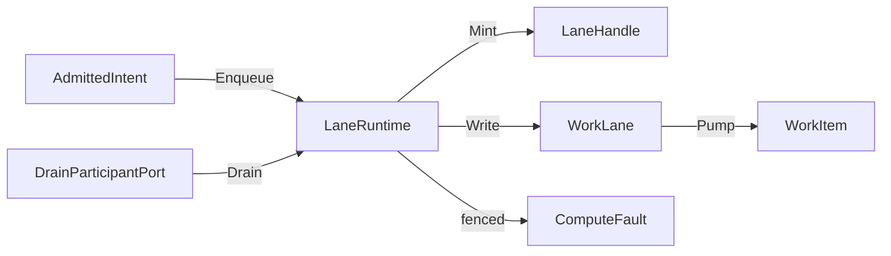
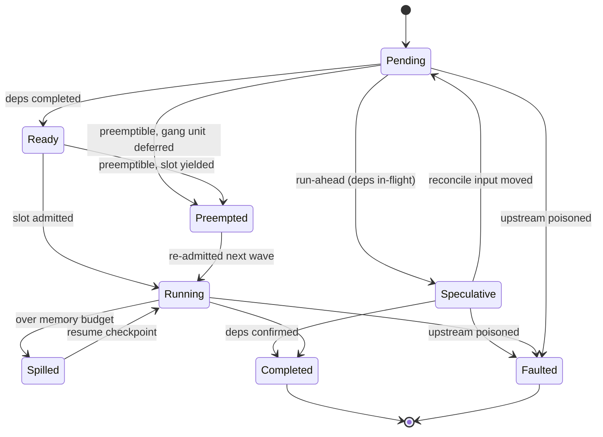

# [COMPUTE_RUNTIME]

Rasm.Compute schedules every admitted intent through bounded `WorkLane` channel rows behind one `LaneRuntime` enqueue capsule: lane choice is an intent field, full-mode and backpressure are row data, drops emit a correlated `Backpressure` receipt, queue depth reads `ChannelReader.Count`, and solve-path dispatch structurally returns a `LaneHandle` instead of executing work. A `JobGraph` dependency-DAG scheduler layers speculative, preemptible, fair-share, accelerator-affinity, and spill-to-store orchestration bounded by the shared `CpuBudget`, keys every node on its admitted-intent and input-content digest so a re-run reconciles semantic changes and recomputes only the moved subgraph, and rolls subscribed node cells into one live parent `ProgressCell`.

Clusters own the `WorkLane` axis, the work-item and handle shapes, the GH2 async-result ceiling, the `CpuBudget` record shared by lane, model, and tensor concurrency, and band-200 drain participation, composed over bounded System.Threading.Channels pipes, Thinktecture vocabulary, LanguageExt rails, NodaTime instants, and the AppHost drain, cancellation, clock, and schedule spine.

## [01]-[INDEX]

- [01]-[LANE_AXIS]: bounded channel rows; capacity, full-mode, readers, rank as row data.
- [02]-[SOLVE_GUARD]: one enqueue capsule; solve threads receive handles, never execute work.
- [03]-[CPU_BUDGET]: one processor-budget record shared by lane, model, and tensor concurrency.
- [04]-[JOB_GRAPH]: batch-wave dependency scheduler; speculative run-ahead, QoS-weighted fair-share and gang admission, cooperative spill, content-key reactive reconcile, rolled-up live DAG progress aggregate.
- [05]-[DRAIN_CANCEL]: band-200 drain participation; one linked cancellation chain with provenance.

## [02]-[LANE_AXIS]

- Owner: `WorkLane` `[SmartEnum<string>]` rows under the `ComparerAccessors.StringOrdinal` accessor; `LaneHandle` readback handle; `WorkItem` channel element.
- Cases: interactive, background, bulk, benchmark, capture-ingest.
- Entry: `public BoundedChannelOptions Options(CpuBudget budget)` — pure row projection; capacity, full-mode, and reader fan-out are row data, never call-site arguments.
- Auto: cadence-driven work (compute-model-warmup, scheduled equivalence sweeps) enters as `ScheduleEntry` rows whose `Work` delegate enqueues onto its declared lane — the schedule port owns when, lanes own throughput; receipted-loss rows construct their channel with the drop delegate so every drop lands as a `Backpressure` receipt carrying the dropped item's correlation, never a silent loss; the queue-depth slot reads `ChannelReader<WorkItem>.Count` on the lane's reader at stamp time, never a hand-tracked counter.
- Receipt: Backpressure — lane row, queue depth from `ChannelReader.Count`, wait elapsed on a parked write, or dropped-item correlation on a `DropWrite`/`DropOldest` lane — materialized at the sink edge on the package receipt union.
- Packages: BCL inbox, Thinktecture.Runtime.Extensions, LanguageExt.Core, NodaTime, Rasm.AppHost (project)
- Growth: one lane row with its capacity, full-mode, reader, and rank columns; zero new surface.
- Boundary: the `WorkLane` name is owned here and `DrainQueue` stays the AppHost process-level altitude — one altitude per name; lane choice is an intent field and full-mode is row data, so a drop flag on another row is the deleted form; capture-ingest drops oldest because the latest geometry state wins, and its consumer is the DocumentService CaptureEvents client-stream; rank is the cross-lane precedence datum ordering drain steps — per-item priority mutation, unbounded channels, per-lane worker class hierarchies, and Dataflow lanes are the deleted patterns; an external lane selector arriving as wire text admits through the generated `WorkLane.Validate`/`TryGet` key seam, never a raw-string comparison against row keys.

```csharp signature
[SmartEnum<string>]
[KeyMemberEqualityComparer<ComparerAccessors.StringOrdinal, string>]
[KeyMemberComparer<ComparerAccessors.StringOrdinal, string>]
public sealed partial class WorkLane {
    public static readonly WorkLane Interactive = new("interactive", capacity: 16, fullMode: BoundedChannelFullMode.Wait, rank: 1, readers: static _ => 1);
    public static readonly WorkLane Background = new("background", capacity: 256, fullMode: BoundedChannelFullMode.Wait, rank: 2, readers: static budget => budget.ReaderCeiling);
    public static readonly WorkLane Bulk = new("bulk", capacity: 1024, fullMode: BoundedChannelFullMode.DropWrite, rank: 3, readers: static _ => 1);
    public static readonly WorkLane Benchmark = new("benchmark", capacity: 4, fullMode: BoundedChannelFullMode.Wait, rank: 4, readers: static _ => 1);
    public static readonly WorkLane CaptureIngest = new("capture-ingest", capacity: 256, fullMode: BoundedChannelFullMode.DropOldest, rank: 5, readers: static _ => 1);

    private readonly Func<CpuBudget, int> readers;

    public int Capacity { get; }

    public BoundedChannelFullMode FullMode { get; }

    public int Rank { get; }

    public int Readers(CpuBudget budget) => Math.Min(readers(budget), budget.ReaderCeiling);

    public BoundedChannelOptions Options(CpuBudget budget) => new(Capacity) {
        FullMode = FullMode,
        SingleReader = Readers(budget) is 1,
        SingleWriter = false,
    };
}

public readonly record struct LaneHandle(CorrelationId Correlation, WorkLane Lane, CancelScope Cancel, Instant Enqueued);

public readonly record struct WorkItem(AdmittedIntent Intent, LaneHandle Handle);
```

## [03]-[SOLVE_GUARD]

- Owner: `LaneRuntime` — the one enqueue capsule over the bounded lane channels, the `LaneGate` admission-lifecycle family, and the pump readers; `LaneGate` is the closed open-versus-fenced `[Union]` whose `Fenced` case carries provenance and the fence instant, so a refused enqueue names which drain fenced it and a boolean lifecycle flag never arises.
- Entry: `public IO<LaneHandle> Enqueue(AdmittedIntent intent)` — `IO` carries the enqueue effect, awaits fullness on Wait rows, and aborts fenced admission with `ComputeFault.ShutdownDrained` carrying the gate's `Fenced` provenance; the gate read runs inside the effect, so an enqueue composed before the fence and run after it still refuses.
- Auto: composition forks `Readers`-many `Pump` effects per row beneath the spine scope; dispatch from GH2 and UI threads structurally enqueues and returns the handle — synchronous model or remote execution on a solve path is unrepresentable by this seam, not by discipline.
- Receipt: wait evidence rides the pressure delegate only when the write parks; a synchronously completed write emits nothing, keeping the uncontended path allocation-free.
- Packages: BCL inbox, LanguageExt.Core, NodaTime, Rasm.AppHost (project)
- Growth: one lane row reuses the same enqueue, write, and pump members; zero new surface.
- Boundary: `LaneRuntime` is the named boundary capsule for the statement carve-out — channel construction, the parked-write window, and the pump loop carry language-owned statement forms; no blocking wait exists on the public surface and completion is observed only through progress states and receipts — handle to correlation to receipt join is the readback, and the GH2 async-result ceiling is the `Interactive` lane capacity of sixteen in-flight handles a GH2 `SolveInstance` readback never exceeds because the seventeenth `Enqueue` parks on the `Wait` full-mode rather than dropping a solve result; the dispatch delegate is total on the fault rail, so the pump never interprets failures.

```csharp signature
[Union(ConversionFromValue = ConversionOperatorsGeneration.None)]
public abstract partial record LaneGate {
    private LaneGate() { }
    public sealed record Open : LaneGate;
    public sealed record Fenced(string Provenance, Instant At) : LaneGate;
}

public sealed class LaneRuntime(
    IClock clock,
    TimeProvider time,
    CpuBudget budget,
    Func<WorkItem, IO<Unit>> dispatch,
    Action<WorkLane, WorkItem, Option<Duration>> pressure)
{
    private readonly Atom<LaneGate> gate = Atom<LaneGate>(new LaneGate.Open());
    private readonly HashMap<WorkLane, Channel<WorkItem>> channels = toHashMap(toSeq(WorkLane.Items).Map(row =>
        (row, row.FullMode is BoundedChannelFullMode.Wait
            ? Channel.CreateBounded<WorkItem>(row.Options(budget))
            : Channel.CreateBounded<WorkItem>(row.Options(budget), item => pressure(row, item, None)))));

    // Execution-time gate reads reject an Enqueue effect composed before a later fence.
    public IO<LaneHandle> Enqueue(AdmittedIntent intent) =>
        from item in IO.lift(() => gate.Value.Switch(
                state: (Runtime: this, Work: intent),
                open: static (s, _) => Fin.Succ(s.Runtime.Mint(s.Work)),
                fenced: static (s, f) => Fin.Fail<WorkItem>(new ComputeFault.ShutdownDrained($"{s.Work.Spec.Lane.Key}:{f.Provenance}"))))
            .Bind(static admitted => admitted.Match(Succ: IO.pure, Fail: IO.fail<WorkItem>))
        from landed in Write(item)
        select item.Handle;

    public IO<Unit> Pump(WorkLane lane) =>
        IO.liftAsync(async env => {
            await foreach (WorkItem item in channels[lane].Reader.ReadAllAsync(env.Token).ConfigureAwait(false)) {
                await dispatch(item).RunAsync(env).ConfigureAwait(false);
            }
            return unit;
        });

    public int Depth(WorkLane lane) => channels[lane].Reader.Count;

    public Unit Fence(string provenance) =>
        ignore(gate.Swap(held => held is LaneGate.Open ? new LaneGate.Fenced(provenance, clock.GetCurrentInstant()) : held));

    public IO<Unit> Drain(WorkLane lane, CancellationToken token) =>
        from fenced in IO.lift(() => Fence($"{nameof(Drain)}/{lane.Key}"))
        from closed in IO.lift(() => channels[lane].Writer.TryComplete())
        from settled in IO.liftAsync(async _ => {
            await channels[lane].Reader.Completion.WaitAsync(token).ConfigureAwait(false);
            return unit;
        })
        select unit;

    private WorkItem Mint(AdmittedIntent intent) =>
        new(intent, new LaneHandle(
            intent.Correlation,
            intent.Spec.Lane,
            intent.Scope.Derive($"{intent.Spec.Lane.Key}/{intent.Correlation}", time),
            clock.GetCurrentInstant()));

    private IO<Unit> Write(WorkItem item) =>
        IO.liftVAsync(async _ => {
            ValueTask parked = channels[item.Handle.Lane].Writer.WriteAsync(item, item.Handle.Cancel.Token);
            if (parked.IsCompletedSuccessfully) {
                await parked.ConfigureAwait(false);
                return unit;
            }
            long mark = time.GetTimestamp();
            await parked.ConfigureAwait(false);
            pressure(item.Handle.Lane, item, Some(time.GetElapsedTime(mark).ToDuration()));
            return unit;
        });
}
```



## [04]-[CPU_BUDGET]

- Owner: `CpuBudget` — the one processor-budget record lane, model, and tensor concurrency read.
- Entry: `public static CpuBudget Resolve(int processors, int hostReserve)` — pure clamp; the record freezes at composition and every derived field is arithmetic over the two inputs.
- Auto: the composition root resolves the record once from `Environment.ProcessorCount` and the posture row; lane readers clamp through `Readers`, the model lane sizes its one global ORT thread pool from `OrtIntraOp` and `OrtInterOp` with per-session threads disabled and binds `OrtThreadingOptions.GlobalSpinControl` from `SpinControl`, and the tensor-lane `Partition` execution column reads `PartitionCap` for its `ParallelHelper.For` partition count behind a winning benchmark claim — this record owns the cap, Tensor/dispatch#KERNEL_DISPATCH owns the fan-out.
- Packages: BCL inbox
- Growth: one posture row per new host-profile row and one policy value per new concurrency axis; zero new surface.
- Boundary: lane readers, the model thread pool, and tensor partitions all read this record — a concurrency value not traced here is the named defect, and a `ParallelHelper.For` degree, a second `Partitioner`/`ParallelRunner` owner, or a `Parallel.For` partition sized off the host total rejects because `PartitionCap` owns tensor fan-out. Plugin rows reserve host cores for Rhino UI and solver threads; service rows own the machine. `ReaderCeiling` halves the worker pool because readers park on kernel and remote completions while the global pool carries arithmetic. `SpinControl` derives from `HostReserve`: co-tenanted hosts surrender ORT spin, while machine-owning service rows retain it. `processors` comes from the AppHost `PressurePolicy` container-limit grade when present, so one constraint re-caps every axis.

```csharp signature
public sealed record CpuBudget {
    private CpuBudget(int total, int hostReserve) {
        Total = total;
        HostReserve = hostReserve;
    }

    public int Total { get; }

    public int HostReserve { get; }

    public int Workers => Math.Max(1, Total - HostReserve);

    public int OrtIntraOp => Workers;

    public int OrtInterOp => 1;

    public int ReaderCeiling => Math.Max(1, Workers / 2);

    public int PartitionCap => Workers;

    public bool SpinControl => HostReserve is 0;

    public static CpuBudget Resolve(int processors, int hostReserve) {
        int total = Math.Max(1, processors);
        return new(total, Math.Clamp(hostReserve, 0, total - 1));
    }
}
```

A posture row supplies `hostReserve` per host-profile row at composition:

| [INDEX] | [PROFILE_ROW]      | [HOST_RESERVE] |
| :-----: | :----------------- | :------------: |
|  [01]   | rhino-plugin       |       2        |
|  [02]   | gh2-plugin         |       2        |
|  [03]   | standalone-desktop |       1        |
|  [04]   | companion          |       1        |
|  [05]   | sidecar            |       1        |
|  [06]   | headless-service   |       0        |
|  [07]   | web-service        |       0        |
|  [08]   | test-host          |       0        |

## [05]-[JOB_GRAPH]

- Owner: `JobNode` the dependency-graph node keyed on its input content seed; `JobState` `[SmartEnum<string>]` the node-lifecycle rows with `Terminal`, `Resumable`, and `Phase` (the `Runtime/progress#PROGRESS_CELL` `ProgressPhase` projection) columns; `JobSignal` `[Union]` the per-node execution outcome the runner returns; `CheckpointPort` the spill-to-store persist/resume pair over the Persistence blob lane; `JobLedger` the orchestration result; `JobGraph` the batch-wave dependency scheduler driving speculative run-ahead, QoS-weighted fair-share and gang admission, accelerator-affinity ordering, and cooperative memory-spill bounded by the shared `CpuBudget`, executing each node through the injected `runner`, keying every node on the suite `XxHash128` input digest so a re-run recomputes only the moved subgraph, and folding one coarse per-node `ProgressCell` through `ProgressCell.Aggregate` into one rolled parent cell so the whole DAG surfaces a single live monotonic `ProgressMark`.
- Cases: `JobState` rows pending · ready · running · speculative · preempted · spilled · completed · faulted; `JobSignal` cases completed · faulted · spilled.
- Entry: `public (Option<ProgressCell> Progress, IO<Fin<JobLedger>> Ledger) Run(Seq<JobNode> nodes, CpuBudget budget, CorrelationId correlation, CancelScope scope, IClock clock, TimeProvider time)` — `Progress` is absent when no admitted node requested observation, while `Ledger` carries graph admission and execution; `GraphRejected`, `GraphCyclic`, and `GraphStalled` abort on the typed rail, and `Reconcile` mirrors the pair shape.
- Auto: `Run` admits graph invariants before execution, then `Fill` repeatedly chooses the highest-ranked currently eligible gang unit against the evolving wave state, so launching an upstream node makes its speculative descendants eligible in the same wave; each unit admits all-or-none under the global and tenant shares, and an empty launch frontier with nonterminal nodes faults `GraphStalled` instead of recurring. `affinityRank` resolves each `AcceleratorAffinity` key against the composition-owned device roster instead of treating every present key alike. Each launch carries its computed `NodeKey`; resume accepts only a checkpoint with the same node id and content key, and a runner-emitted mismatched checkpoint becomes `CheckpointRejected` before persistence. Each wave projects `JobState.Phase` onto subscribed cells, forks admitted runners, advances reports, and poisons fault cones.
- Receipt: the graph emits no `ComputeReceipt` case of its own — each node's execution rides its lane's existing receipts (`Backpressure` plus the substrate-lane facts the runner emits), and the `JobLedger` carries the graph-level fact: node count, the completed/faulted split, and the speculated/preempted/spilled tally with elapsed; a `Sweep`/`JobReceipt` case on the per-execution receipt union — whose required `(Lane, Substrate)` spine no whole graph carries — is the rejected form, and the live DAG progress rides the rolled-up parent `ProgressCell` (a monotonic `ProgressMark`, not a receipt fact) orthogonal to the post-hoc `JobLedger` count.
- Packages: BCL inbox, System.IO.Hashing, LanguageExt.Core, NodaTime, Rasm.AppHost (project), Rasm.Persistence (project)
- Growth: a new node lifecycle is one `JobState` row carrying its `Phase` column; a new scheduling policy is one column on `JobNode` the planning fold reads; the reactive recompute is the one `Reconcile` content-key diff over the existing edges; the transitive downstream closure is one `Closure` fixpoint shared by `MarkDirty` and `Poison`; the cycle test is `Cyclic` derived from the one `Topological` Kahn's kernel; zero new surface — a `JobScheduler`/`WorkflowEngine`/`DagRunner`/`IncrementalEngine` sibling surface is the rejected form collapsed onto the one `JobGraph` over the shared `CpuBudget` and the injected runner.
- Boundary: the job graph forks each node's injected `runner` and owns only dependency order; a node never also enters `LaneRuntime`. Graph admission rejects empty graphs, duplicate ids, missing or self dependencies, mixed-tenant gangs, and cycles before a runner executes. Fair-share reads the per-tenant `QosWeight` slice of `CpuBudget.Workers`; a gang admits as one unit, and a unit larger than every available slice faults through `GraphStalled`. `Preempted` means a preemptible node yielded before launch, while `Spilled` means its runner returned a content-keyed checkpoint; resume never accepts a checkpoint from another semantic node revision, and a deferred wave never demotes a resumable state — a spilled node's checkpoint survives deferral because `Spilled`/`Preempted` hold until launch. `NodeKey` hashes `AdmittedIntent.Digest`, input bytes, and ordered upstream keys, so changing the operation with identical bytes dirties the cone. `MarkDirty` intersects change ids with the live graph before closure, preventing a removed id from reappearing in state. `IClock` supplies semantic instants and `TimeProvider` supplies elapsed measurement; App-owned `ClockPolicy` stays at composition.

```csharp signature
[SmartEnum<string>]
[KeyMemberEqualityComparer<ComparerAccessors.StringOrdinal, string>]
[KeyMemberComparer<ComparerAccessors.StringOrdinal, string>]
public sealed partial class JobState {
    public static readonly JobState Pending = new("pending", terminal: false, resumable: false, phase: ProgressPhase.Queued);
    public static readonly JobState Ready = new("ready", terminal: false, resumable: false, phase: ProgressPhase.Selected);
    public static readonly JobState Running = new("running", terminal: false, resumable: false, phase: ProgressPhase.Running);
    public static readonly JobState Speculative = new("speculative", terminal: false, resumable: false, phase: ProgressPhase.Running);
    public static readonly JobState Preempted = new("preempted", terminal: false, resumable: true, phase: ProgressPhase.Selected);
    public static readonly JobState Spilled = new("spilled", terminal: false, resumable: true, phase: ProgressPhase.Running);
    public static readonly JobState Completed = new("completed", terminal: true, resumable: false, phase: ProgressPhase.Completed);
    public static readonly JobState Faulted = new("faulted", terminal: true, resumable: false, phase: ProgressPhase.Faulted);

    public bool Terminal { get; }

    public bool Resumable { get; }

    // Each lifecycle row projects onto the shared progress algebra.
    public ProgressPhase Phase { get; }
}

[Union]
public abstract partial record JobSignal {
    public sealed record Completed(ReadOnlyMemory<byte> Result) : JobSignal;
    public sealed record Faulted(Error Reason) : JobSignal;
    public sealed record Spilled(JobCheckpoint Checkpoint) : JobSignal;
}

public sealed record JobCheckpoint(string NodeId, UInt128 ContentKey, ReadOnlyMemory<byte> State, Instant At);

public sealed record CheckpointPort(
    Func<JobCheckpoint, IO<Unit>> Persist,
    Func<string, IO<Option<JobCheckpoint>>> Resume);

public readonly record struct JobReport(string NodeId, JobSignal Signal);

public readonly record struct JobRun(JobNode Node, Option<JobCheckpoint> Resume);

public readonly record struct JobTally(int Speculated, int Preempted, int Spilled);

public readonly record struct JobLedger(HashMap<string, JobState> States, int Nodes, int Completed, int Faulted, JobTally Tally, Duration Elapsed);

public sealed record JobNode(
    string Id,
    AdmittedIntent Intent,
    Seq<string> DependsOn,
    TenantId Tenant,
    bool Speculative,
    bool Preemptible,
    int FairShareWeight,
    Option<string> AcceleratorAffinity,
    long MemoryBudgetBytes,
    ReadOnlyMemory<byte> InputBytes,
    int QosWeight = 1,
    Option<string> Gang = default) {
    public bool Ready(HashMap<string, JobState> states) =>
        DependsOn.ForAll(dep => states.Find(dep).Map(static state => state == JobState.Completed).IfNone(false));

    public bool Speculable(HashMap<string, JobState> states) =>
        Speculative && !Ready(states)
        && DependsOn.ForAll(dep => states.Find(dep).Map(static state =>
            state == JobState.Completed || state == JobState.Running || state == JobState.Speculative).IfNone(false));

    // Semantic intent, local input, and ordered ancestry share one canonical incremental hash state.
    public UInt128 NodeKey(HashMap<string, UInt128> upstreamKeys) {
        XxHash128 identity = new();
        byte[] word = GC.AllocateUninitializedArray<byte>(16);
        BinaryPrimitives.WriteUInt128LittleEndian(word, Intent.Digest);
        identity.Append(word);
        identity.Append(InputBytes.Span);
        (XxHash128 Hash, byte[] Word, HashMap<string, UInt128> Keys) seeded = (identity, word, upstreamKeys);
        return toSeq(DependsOn.OrderBy(static id => id, StringComparer.Ordinal))
            .Fold(seeded, static (state, dependency) => {
                BinaryPrimitives.WriteUInt128LittleEndian(state.Word, state.Keys.Find(dependency).IfNone(UInt128.Zero));
                state.Hash.Append(state.Word);
                return state;
            }).Hash.GetCurrentHashAsUInt128();
    }
}

public sealed class JobGraph(
    Func<JobRun, IO<JobSignal>> runner,
    CheckpointPort checkpoints,
    Func<Option<string>, int> affinityRank) {
    private readonly record struct JobLaunch(JobNode Node, UInt128 Key, bool Resume);
    private readonly record struct JobWave(HashMap<string, JobState> States, Seq<JobLaunch> Launches, int Speculated, int Preempted);

    public (Option<ProgressCell> Progress, IO<Fin<JobLedger>> Ledger) Run(Seq<JobNode> nodes, CpuBudget budget, CorrelationId correlation, CancelScope scope, IClock clock, TimeProvider time) {
        HashMap<string, ProgressCell> cells = Cells(nodes, clock);
        Option<(ProgressCell Cell, PhaseSubscription Wiring)> aggregate = ProgressCell.Aggregate(correlation, scope, clock, toSeq(cells.Values), SubscriptionPolicy.Wire);
        IO<Fin<JobLedger>> ledger = AdmitGraph(nodes).Match(
                Succ: graph => Drive(graph, budget, time, cells, time.GetTimestamp(), Seed(graph), Keys(graph), default),
                Fail: fault => IO.pure(Fin.Fail<JobLedger>(fault)));
        return (aggregate.Map(static rolled => rolled.Cell), Wired(aggregate.Map(static rolled => rolled.Wiring), ledger));
    }

    public (Option<ProgressCell> Progress, IO<Fin<JobLedger>> Ledger) Reconcile(Seq<JobNode> nodes, HashMap<string, UInt128> prior, HashMap<string, JobState> priorStates, CpuBudget budget, CorrelationId correlation, CancelScope scope, IClock clock, TimeProvider time) {
        HashMap<string, ProgressCell> cells = Cells(nodes, clock);
        Option<(ProgressCell Cell, PhaseSubscription Wiring)> aggregate = ProgressCell.Aggregate(correlation, scope, clock, toSeq(cells.Values), SubscriptionPolicy.Wire);
        IO<Fin<JobLedger>> ledger = AdmitGraph(nodes).Match(
                Succ: graph => Reconciled(graph, prior, priorStates, budget, time, cells),
                Fail: fault => IO.pure(Fin.Fail<JobLedger>(fault)));
        return (aggregate.Map(static rolled => rolled.Cell), Wired(aggregate.Map(static rolled => rolled.Wiring), ledger));
    }

    private static IO<A> Wired<A>(Option<PhaseSubscription> wiring, IO<A> effect) =>
        wiring.Match(
            Some: subscription => IO.pure(subscription).Bracket(Use: _ => effect, Fin: static held => IO.lift(fun(held.Dispose))),
            None: () => effect);

    private static HashMap<string, JobState> Seed(Seq<JobNode> nodes) =>
        nodes.Fold(HashMap<string, JobState>(), static (acc, node) => acc.Add(node.Id, JobState.Pending));

    // Intent admission decides whether a node owns an observable cell.
    private static HashMap<string, ProgressCell> Cells(Seq<JobNode> nodes, IClock clock) =>
        nodes.Fold(HashMap<string, ProgressCell>(), (acc, node) =>
            ProgressCell.Mint(node.Intent, clock).Match(Some: cell => acc.SetItem(node.Id, cell), None: () => acc));

    private IO<Fin<JobLedger>> Reconciled(
        Seq<JobNode> nodes,
        HashMap<string, UInt128> prior,
        HashMap<string, JobState> priorStates,
        CpuBudget budget,
        TimeProvider time,
        HashMap<string, ProgressCell> cells) {
        HashMap<string, UInt128> current = Keys(nodes);
        Seq<string> moved = toSeq(current.Filter((id, key) => prior.Find(id).Map(was => was != key).IfNone(true)).Keys);
        return Drive(nodes, budget, time, cells, time.GetTimestamp(), MarkDirty(nodes, priorStates, moved), current, default);
    }

    // Cell rank guards make every wave projection monotonic.
    private static Unit Mark(Seq<JobNode> nodes, HashMap<string, ProgressCell> cells, HashMap<string, JobState> states) {
        nodes.Iter(node => cells.Find(node.Id).Iter(cell => states.Find(node.Id).Iter(state => ignore(cell.Advance(state.Phase)))));
        return unit;
    }

    private IO<Fin<JobLedger>> Drive(Seq<JobNode> nodes, CpuBudget budget, TimeProvider time, HashMap<string, ProgressCell> cells, long started, HashMap<string, JobState> states, HashMap<string, UInt128> keys, JobTally tally) =>
        from marked in IO.lift(() => Mark(nodes, cells, states))
        from settled in states.Values.ForAll(static state => state.Terminal)
            ? IO.pure(Fin.Succ(Settle(nodes, states, tally, time.GetElapsedTime(started).ToDuration())))
            : Continue(nodes, budget, time, cells, started, states, keys, tally)
        select settled;

    private IO<Fin<JobLedger>> Continue(Seq<JobNode> nodes, CpuBudget budget, TimeProvider time, HashMap<string, ProgressCell> cells, long started, HashMap<string, JobState> states, HashMap<string, UInt128> keys, JobTally tally) {
        JobWave wave = Plan(nodes, states, budget, keys);
        return wave.Launches.IsEmpty
            ? IO.pure(Fin.Fail<JobLedger>(new ComputeFault.GraphStalled(string.Join(',', states.Filter(static (_, state) => !state.Terminal).Keys))))
            : from reports in Execute(wave.Launches)
              from done in Drive(
                  nodes,
                  budget,
                  time,
                  cells,
                  started,
                  Poison(nodes, Advance(wave.States, reports)),
                  keys,
                  new JobTally(
                      tally.Speculated + wave.Speculated,
                      tally.Preempted + wave.Preempted,
                      tally.Spilled + reports.Filter(static report => report.Signal is JobSignal.Spilled).Count))
              select done;
    }

    // Tenant shares derive from QoS weight; Fill observes each preceding launch while choosing the next unit.
    private static JobWave Plan(Seq<JobNode> nodes, HashMap<string, JobState> states, CpuBudget budget, HashMap<string, UInt128> keys) {
        Seq<JobNode> active = nodes.Filter(node => states.Find(node.Id).Map(static state => !state.Terminal).IfNone(false));
        HashMap<TenantId, int> weights = active.Fold(HashMap<TenantId, int>(), static (acc, node) =>
            acc.AddOrUpdate(node.Tenant, held => Math.Max(held, Math.Max(1, node.QosWeight)), Math.Max(1, node.QosWeight)));
        int mass = Math.Max(1, toSeq(weights.Values).Sum());
        HashMap<TenantId, int> shares = weights.Map(weight => Math.Max(1, (budget.Workers * weight) / mass));
        Seq<Seq<JobNode>> units = Units(toSeq(active
            .OrderBy(node => affinityRank(node.AcceleratorAffinity))
            .ThenByDescending(static node => node.FairShareWeight)));
        (HashMap<string, JobState> States, Seq<JobLaunch> Launches, int Global, HashMap<TenantId, int> Tenant, int Spec, int Pre) seed =
            (states, Seq<JobLaunch>(), budget.Workers, HashMap<TenantId, int>(), 0, 0);
        (HashMap<string, JobState> States, Seq<JobLaunch> Launches, int Global, HashMap<TenantId, int> Tenant, int Spec, int Pre) planned =
            Fill(units, seed, states, shares, keys);
        return new JobWave(planned.States, planned.Launches, planned.Spec, planned.Pre);
    }

    private static Seq<Seq<JobNode>> Units(Seq<JobNode> active) =>
        toSeq(active.GroupBy(static node => (Grouped: node.Gang.IsSome, Key: node.Gang.IfNone(node.Id))).Map(static unit => toSeq(unit)));

    private static (HashMap<string, JobState> States, Seq<JobLaunch> Launches, int Global, HashMap<TenantId, int> Tenant, int Spec, int Pre) Fill(
        Seq<Seq<JobNode>> remaining,
        (HashMap<string, JobState> States, Seq<JobLaunch> Launches, int Global, HashMap<TenantId, int> Tenant, int Spec, int Pre) acc,
        HashMap<string, JobState> initial,
        HashMap<TenantId, int> shares,
        HashMap<string, UInt128> keys) =>
        remaining.Filter(unit => unit.ForAll(node => Eligible(node, acc.States))).HeadOrNone().Match(
            Some: unit => Fill(
                remaining.Filter(candidate => UnitKey(candidate) != UnitKey(unit)),
                Admit(acc, unit, initial, shares, keys),
                initial,
                shares,
                keys),
            None: () => acc);

    private static (bool Grouped, string Key) UnitKey(Seq<JobNode> unit) =>
        (unit[0].Gang.IsSome, unit[0].Gang.IfNone(unit[0].Id));

    private static (HashMap<string, JobState> States, Seq<JobLaunch> Launches, int Global, HashMap<TenantId, int> Tenant, int Spec, int Pre) Admit(
        (HashMap<string, JobState> States, Seq<JobLaunch> Launches, int Global, HashMap<TenantId, int> Tenant, int Spec, int Pre) acc,
        Seq<JobNode> unit,
        HashMap<string, JobState> initial,
        HashMap<TenantId, int> shares,
        HashMap<string, UInt128> keys) {
        JobNode lead = unit[0];
        int share = shares.Find(lead.Tenant).IfNone(1);
        return acc.Global >= unit.Count && (acc.Tenant.Find(lead.Tenant).IfNone(0) + unit.Count) <= share
            ? unit.Fold(acc, (run, node) => Launch(run, node, initial, keys[node.Id]))
            : unit.Fold(acc, static (run, node) => run.States.Find(node.Id).Map(static held => held.Resumable).IfNone(false)
                ? run
                : node.Preemptible
                    ? (run.States.SetItem(node.Id, JobState.Preempted), run.Launches, run.Global, run.Tenant, run.Spec, run.Pre + 1)
                    : (run.States.SetItem(node.Id, JobState.Ready), run.Launches, run.Global, run.Tenant, run.Spec, run.Pre));
    }

    private static (HashMap<string, JobState> States, Seq<JobLaunch> Launches, int Global, HashMap<TenantId, int> Tenant, int Spec, int Pre) Launch(
        (HashMap<string, JobState> States, Seq<JobLaunch> Launches, int Global, HashMap<TenantId, int> Tenant, int Spec, int Pre) acc,
        JobNode node,
        HashMap<string, JobState> initial,
        UInt128 key) {
        bool speculative = initial.Find(node.Id).Map(static state => state == JobState.Pending).IfNone(false) && node.Speculable(acc.States);
        bool resume = initial.Find(node.Id).Map(static state => state == JobState.Spilled).IfNone(false);
        return (acc.States.SetItem(node.Id, speculative ? JobState.Speculative : JobState.Running),
            acc.Launches.Add(new JobLaunch(node, key, resume)),
            acc.Global - 1,
            acc.Tenant.AddOrUpdate(node.Tenant, static c => c + 1, 1),
            acc.Spec + (speculative ? 1 : 0),
            acc.Pre);
    }

    private static bool Eligible(JobNode node, HashMap<string, JobState> states) =>
        states.Find(node.Id).Map(state =>
            ((state == JobState.Pending || state == JobState.Ready) && node.Ready(states))
            || (state == JobState.Pending && node.Speculable(states))
            || state.Resumable).IfNone(false);

    private IO<Seq<JobReport>> Execute(Seq<JobLaunch> launches) =>
        from forks in launches.TraverseM(launch =>
            from resume in launch.Resume
                ? checkpoints.Resume(launch.Node.Id).Map(checkpoint => checkpoint.Filter(row => row.NodeId == launch.Node.Id && row.ContentKey == launch.Key))
                : IO.pure(Option<JobCheckpoint>.None)
            from fork in (launch.Resume && resume.IsNone
                ? IO.pure(new JobReport(launch.Node.Id, new JobSignal.Faulted(new ComputeFault.CheckpointRejected($"{launch.Node.Id}:{launch.Key}"))))
                : runner(new JobRun(launch.Node, resume))
                    .Map(signal => new JobReport(launch.Node.Id, Verified(launch, signal))))
                .Fork()
            select fork).As()
        from reports in forks.TraverseM(static fork => fork.Await).As()
        from settled in reports.TraverseM(report =>
            report.Signal is JobSignal.Spilled spilled ? checkpoints.Persist(spilled.Checkpoint) : IO.pure(unit)).As()
        select reports;

    private static JobSignal Verified(JobLaunch launch, JobSignal signal) =>
        signal is JobSignal.Spilled spilled
            && (spilled.Checkpoint.NodeId != launch.Node.Id || spilled.Checkpoint.ContentKey != launch.Key)
                ? new JobSignal.Faulted(new ComputeFault.CheckpointRejected($"{launch.Node.Id}:{launch.Key}"))
                : signal;

    private static HashMap<string, JobState> Advance(HashMap<string, JobState> states, Seq<JobReport> reports) =>
        reports.Fold(states, static (acc, report) => report.Signal.Switch(
            completed: _ => acc.SetItem(report.NodeId, JobState.Completed),
            faulted: _ => acc.SetItem(report.NodeId, JobState.Faulted),
            spilled: _ => acc.SetItem(report.NodeId, JobState.Spilled)));

    // Fault closure invalidates speculative completions reached from a failed ancestor.
    private static HashMap<string, JobState> Poison(Seq<JobNode> nodes, HashMap<string, JobState> states) =>
        Closure(nodes, toHashSet(states.Filter(static (_, state) => state == JobState.Faulted).Keys))
            .Fold(states, static (acc, id) => acc.SetItem(id, JobState.Faulted));

    // Reconcile seeds live additions and removes stale state before dirty closure.
    public static HashMap<string, JobState> MarkDirty(Seq<JobNode> nodes, HashMap<string, JobState> states, Seq<string> changed) {
        LanguageExt.HashSet<string> live = toHashSet(nodes.Map(static node => node.Id));
        HashMap<string, JobState> aligned = nodes.Fold(
            states.Filter((id, _) => live.Contains(id)),
            static (acc, node) => acc.ContainsKey(node.Id) ? acc : acc.Add(node.Id, JobState.Pending));
        return Closure(nodes, toHashSet(changed.Filter(live.Contains)))
            .Fold(aligned, static (acc, id) => acc.SetItem(id, JobState.Pending));
    }

    private static LanguageExt.HashSet<string> Closure(Seq<JobNode> nodes, LanguageExt.HashSet<string> seed) {
        Seq<JobNode> grown = nodes.Filter(node => node.DependsOn.Exists(seed.Contains) && !seed.Contains(node.Id));
        return grown.IsEmpty ? seed : Closure(nodes, seed.AddRange(grown.Map(static node => node.Id)));
    }

    public static HashMap<string, UInt128> Keys(Seq<JobNode> nodes) =>
        Topological(nodes).Fold(HashMap<string, UInt128>(), static (acc, node) => acc.Add(node.Id, node.NodeKey(acc)));

    private static JobLedger Settle(Seq<JobNode> nodes, HashMap<string, JobState> states, JobTally tally, Duration elapsed) =>
        new(states, nodes.Count,
            toSeq(states.Values).Filter(static state => state == JobState.Completed).Count,
            toSeq(states.Values).Filter(static state => state == JobState.Faulted).Count,
            tally, elapsed);

    private static Seq<JobNode> Topological(Seq<JobNode> nodes) =>
        Ordered(
            nodes,
            nodes.Fold(HashMap<string, int>(), static (acc, node) => acc.Add(node.Id, node.DependsOn.Count)),
            nodes.Fold(HashMap<string, JobNode>(), static (acc, node) => acc.Add(node.Id, node)),
            nodes.Filter(static node => node.DependsOn.IsEmpty).Map(static node => node.Id),
            Seq<JobNode>());

    private static Seq<JobNode> Ordered(
        Seq<JobNode> nodes,
        HashMap<string, int> indegree,
        HashMap<string, JobNode> byId,
        Seq<string> queue,
        Seq<JobNode> ordered) =>
        queue.HeadOrNone().Match(
            Some: head => {
                HashMap<string, int> advanced = nodes
                    .Filter(node => node.DependsOn.Contains(head))
                    .Fold(indegree, static (acc, node) => acc.SetItem(node.Id, acc[node.Id] - 1));
                Seq<string> released = nodes
                    .Filter(node => node.DependsOn.Contains(head) && advanced[node.Id] == 0)
                    .Map(static node => node.Id);
                return Ordered(nodes, advanced, byId, queue.Tail + released, ordered.Add(byId[head]));
            },
            None: () => ordered);

    private static Fin<Seq<JobNode>> AdmitGraph(Seq<JobNode> nodes) {
        Seq<string> ids = nodes.Map(static node => node.Id);
        LanguageExt.HashSet<string> known = toHashSet(ids);
        Seq<string> structural =
            (nodes.IsEmpty ? Seq("empty") : Seq<string>())
            + toSeq(ids.GroupBy(static id => id).Filter(static group => group.Count() > 1).Map(static group => $"duplicate:{group.Key}"))
            + nodes.Bind(node => node.DependsOn
                .Filter(dependency => dependency == node.Id || !known.Contains(dependency))
                .Map(dependency => dependency == node.Id ? $"self:{node.Id}" : $"missing:{node.Id}:{dependency}"))
            + nodes.Bind(node => toSeq(node.DependsOn.GroupBy(static dependency => dependency)
                .Filter(static group => group.Count() > 1)
                .Map(group => $"duplicate-edge:{node.Id}:{group.Key}")))
            + nodes.Filter(static node => string.IsNullOrWhiteSpace(node.Id)
                || node.FairShareWeight <= 0
                || node.QosWeight <= 0
                || node.MemoryBudgetBytes <= 0L
                || node.Gang.Exists(string.IsNullOrWhiteSpace)
                || node.AcceleratorAffinity.Exists(string.IsNullOrWhiteSpace))
                .Map(static node => $"policy:{node.Id}")
            + toSeq(nodes.Filter(static node => node.Gang.IsSome)
                .GroupBy(static node => node.Gang.IfNone(string.Empty))
                .Filter(static gang => gang.Select(static node => node.Tenant).Distinct().Count() > 1)
                .Map(static gang => $"mixed-tenant-gang:{gang.Key}"));
        return !structural.IsEmpty
            ? Fin.Fail<Seq<JobNode>>(new ComputeFault.GraphRejected(string.Join(',', structural)))
            : Topological(nodes).Count != nodes.Count
                ? Fin.Fail<Seq<JobNode>>(new ComputeFault.GraphCyclic(string.Join(">", ids)))
                : Fin.Succ(nodes);
    }
}

public abstract partial record ComputeFault {
    public sealed record GraphCyclic : ComputeFault { public GraphCyclic(string detail) : base(detail, 2220) { } }
    public sealed record GraphRejected : ComputeFault { public GraphRejected(string detail) : base(detail, 2221) { } }
    public sealed record GraphStalled : ComputeFault { public GraphStalled(string detail) : base(detail, 2222) { } }
    public sealed record CheckpointRejected : ComputeFault { public CheckpointRejected(string detail) : base(detail, 2223) { } }
}
```



## [06]-[DRAIN_CANCEL]

- Owner: `LaneDrain` — the participant fold projecting lane rows onto the drain conductor.
- Cases: user cancel (handle scope), deadline expiry (scope deadline at the execution edge), shutdown drain (spine under the conductor) — provenance-preserved end to end through `CancelScope` path segments.
- Entry: `public Seq<DrainParticipantPort> Participants()` — one band-200 registration row per lane, rank-ordered inside the band.
- Auto: the draining phase receipt fences admission through one subscription row at composition, and every per-lane `Drain` re-fences idempotently so band order never races the gate; cooperative and forced budgets arrive from the drain deadline rows through the conductor — no duration literal lives here.
- Receipt: Drain — per-lane flushed and dropped counts at the sink edge; step timing and straggler evidence ride the AppHost conductor receipt.
- Packages: Rasm.AppHost (project), LanguageExt.Core, BCL inbox
- Growth: one participant row per new lane row; zero new surface.
- Boundary: one linked token chain runs intent to lane to the execution edges — the model lane maps the token onto the Terminate latch and the remote lane onto call deadlines — and a free-floating CancellationTokenSource below the spine is the named defect; late arrivals abort `ComputeFault.ShutdownDrained`, and the residual fence race between a gated write and writer completion lands on the IO error channel as evidence, never as silent loss.

```csharp signature
public static class LaneDrain {
    extension(LaneRuntime lanes) {
        public Seq<DrainParticipantPort> Participants() =>
            toSeq(WorkLane.Items).Map(row => new DrainParticipantPort(
                Name: $"compute-{row.Key}",
                Band: DrainBand.Compute,
                Rank: row.Rank,
                Drain: token => lanes.Drain(row, token)));
    }
}
```

## [07]-[RESEARCH]

<!-- source-only: research row template:
[TOKEN]-[OPEN|BLOCKED]: <exact question>; <verification route>.
-->

- [LANE_EVIDENCE]-[OPEN]: does the drop-path `Backpressure` projection allocate only the receipt envelope at the sink edge under sustained `DropOldest` capture-ingest load, given the bounded-channel `itemDropped` callback runs synchronously on the writer thread; implementation-time per-drop allocation profile.
- [WAVE_PARALLELISM]-[OPEN]: does the `ForkIO` wave overlap every admitted node's `runner` before awaiting so concurrency is the forked overlap bounded by the per-tenant `CpuBudget.Workers` slice, not the wave's await order; implementation-time wall-clock span of a fan-out-heavy frontier against the serial-await lower bound.
- [COOPERATIVE_SPILL]-[OPEN]: does a node past its `MemoryBudgetBytes` self-report `JobSignal.Spilled` carrying the `JobCheckpoint` its runner produced at the cooperative yield point so a resume reloads exactly those bytes; implementation-time checkpoint size and resume-warm latency under preemption pressure.
